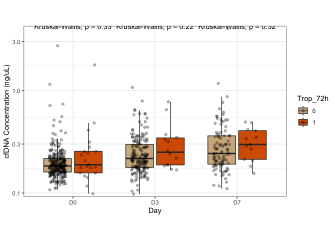

Figure4_S3
================
Tom LaSalle

This document contains all the code necessary to generate the plots for
Figure 4 and related supplementary figure (S3G-J). Plots are
subsequently edited in Adobe Illustrator to produce the final figures.

Load the necessary libraries:

``` r
library(knitr)
library(ggplot2)
library(ggrepel)
library(RColorBrewer)
library(plyr)
library(dplyr)
library(DESeq2)
library(openxlsx)
library(cowplot)
library(fgsea)
library(ggpubr)
library(dr4pl)
```

Load in the data:

``` r
prefix <- "~/Downloads/COVID19_Neutrophil_Code/" #Adapt as necessary
metadata_long <- read.xlsx(paste0(prefix,"Tables/TableS1.xlsx"), sheet = 4)
Count <- read.table(gzfile(paste0(prefix,"Neutrophil_RNAseq_Count_Matrix.txt.gz")),sep="\t")
colnames(Count) <- Count[1,]
Count <- Count[-1,]
Count <- Count[,-2]
rownames(Count) <- Count[,1]
nams <- Count[,1]
Count <- Count[,-1]
Count <- as.data.frame(apply(Count,2,as.numeric))
rownames(Count) <- nams
TPM <- read.table(gzfile(paste0(prefix,"Neutrophil_RNAseq_TPM_Matrix.txt.gz")),sep="\t")
colnames(TPM) <- TPM[1,]
TPM <- TPM[-1,]
TPM <- TPM[,-2]
rownames(TPM) <- TPM[,1]
nams <- TPM[,1]
TPM <- TPM[,-1]
TPM <- as.data.frame(apply(TPM,2,as.numeric))
rownames(TPM) <- nams
qc_data <- read.xlsx(paste0(prefix,"Tables/TableS1.xlsx"), sheet = 7)
genomic_signatures <- read.xlsx(paste0(prefix,"Tables/TableS1.xlsx"), sheet = 10)
genepc <- read.delim(paste0(prefix,"Ensembl_to_Symbol.txt"))
logTPM <- log2(TPM + 1)

metadata_long <- metadata_long[which(metadata_long$Public.ID %in% qc_data$Public.ID),]
metadata_long <- merge(metadata_long, qc_data, all.y = TRUE)

metadata_filtered <- metadata_long[metadata_long$percent.mt < 20 & metadata_long$Genes.Detected > 10000 & metadata_long$Median.Exon.CV < 1 & metadata_long$Exon.CV.MAD < 0.75 & metadata_long$Exonic.Rate*100 > 25 & metadata_long$Median.3..bias < 0.9,]

logTPM_filtered <- logTPM[,colnames(logTPM) %in% metadata_filtered$Public.Sample.ID]
TPM_filtered <- TPM[,colnames(TPM) %in% metadata_filtered$Public.Sample.ID]
Count_filtered <- Count[,colnames(Count) %in% metadata_filtered$Public.Sample.ID]

tf <- rowSums(TPM_filtered > 0.1) > ncol(TPM_filtered)*.2
TPM_filtered <- TPM_filtered[tf,]
Count_filtered <- Count_filtered[tf,]
logTPM_filtered <- logTPM_filtered[tf,]
tf <- rowSums(Count_filtered >= 6) > ncol(Count_filtered)*.2
TPM_filtered <- TPM_filtered[tf,]
Count_filtered <- Count_filtered[tf,]
logTPM_filtered <- logTPM_filtered[tf,]

metadata_filtered <- merge(metadata_filtered, genomic_signatures)
metadata_filtered$Public.Sample.ID <- metadata_filtered$Public.Sample.ID
metadata_filtered$COVID <- mapvalues(metadata_filtered$COVID, from = c(0,1), to = c("Negative","Positive"))

# Color Palette
vermillion <- rgb(213,94,0,max=255)
bluishgreen <- rgb(0,158,115,max=255)
yellow <- rgb(240,228,66,max=255)
blue <- rgb(0,114,178,max=255)
orange <- rgb(230,159,0,max=255)
skyblue <- rgb(86,180,233,max=255)
lightgray <- rgb(211,211,211,max=255)

somalogic <- read.xlsx(paste0(prefix,"Somalogic_Proteomics.xlsx"))
somalogic$Public.Sample.ID <- paste0(somalogic$Public,"_D",somalogic$day)
UniProt_Symbol <- read.xlsx(paste0(prefix,"UniProt_to_GeneID.xlsx"))

somalogic_hugo <- somalogic[,colnames(somalogic) %in% UniProt_Symbol$UniProtID]
somalogic_hugo <- somalogic_hugo[,colnames(somalogic_hugo) %in% UniProt_Symbol$UniProtID]
somalogic_hugo <- somalogic_hugo[,!(colnames(somalogic_hugo) %in% c("Q9HDB5","P58400"))]
UniProt_Symbol_somalogic <- UniProt_Symbol[UniProt_Symbol$UniProtID %in% colnames(somalogic_hugo),]
UniProt_Symbol_somalogic <- UniProt_Symbol_somalogic[!(is.na(UniProt_Symbol_somalogic$Gene)),]
somalogic_hugo <- somalogic_hugo[,colnames(somalogic_hugo) %in% UniProt_Symbol_somalogic$UniProtID]
rownames(UniProt_Symbol_somalogic) <- UniProt_Symbol_somalogic$UniProtID
colnames(somalogic_hugo) <- UniProt_Symbol_somalogic[colnames(somalogic_hugo),]$Gene
somalogic_hugo <- cbind(somalogic$Public,somalogic$day,somalogic$sample_barcode,somalogic$Public.Sample.ID,somalogic_hugo)
colnames(somalogic_hugo)[1:4] <- c("Public","day","sample_barcode","Public.Sample.ID")

somalogic <- somalogic[somalogic$Public.Sample.ID %in% metadata_filtered$Public.Sample.ID,]
somalogic_hugo <- somalogic_hugo[somalogic_hugo$Public.Sample.ID %in% metadata_filtered$Public.Sample.ID,]
metadata_somalogic <- metadata_filtered[metadata_filtered$Public.Sample.ID %in% somalogic$Public.Sample.ID,]

somalogic <- merge(somalogic, metadata_somalogic, by = "Public.Sample.ID")
somalogic$cluster_neuhi <- factor(somalogic$cluster_neuhi)
somalogic_hugo <- merge(somalogic_hugo, metadata_somalogic, by = "Public.Sample.ID")
somalogic_hugo$cluster_neuhi <- factor(somalogic_hugo$cluster_neuhi)
```

In Figure 4 we explore signatures of neutrophil effector functions. We
begin by defining a transcriptional signature of virally-induced NETosis
composed of the genes *PADI4*, *MPO*, *ELANE*, *TNF*, *CXCL8*, *GSDMD*,
*TLR3*. First we check the pairwise correlations between these genes.

``` r
netosisgenes <- c("PADI4_logTPM","MPO_logTPM","ELANE_logTPM","TNF_logTPM","CXCL8_logTPM","GSDMD_logTPM","TLR3_logTPM")

metadata_temp <- metadata_filtered[metadata_filtered$COVID == "Positive",]

my.cols <- brewer.pal(3,"RdBu")
upper.panel<-function(x, y){
  points(x,y, pch=19, col=mapvalues(metadata_temp$severity.max, from = c("non-severe","severe"), to = c(my.cols[2],my.cols[1])))
  r <- round(cor(as.numeric(x), as.numeric(y)), digits=2)
  txt <- paste0("R = ", r)
  usr <- par("usr"); on.exit(par(usr))
  par(usr = c(0, 1, 0, 1))
  text(0.5, 0.9, txt)
}
```

**Figure S3G:**

``` r
pairs(sapply(metadata_temp[,colnames(metadata_temp) %in% netosisgenes],as.numeric), pch = 19, upper.panel = NULL, cex = 0.5, col = mapvalues(metadata_temp$severity.max, from = c("non-severe","severe"), to = c(my.cols[3],my.cols[1])))
```

<!-- -->

Then we score each sample according to these genes.

``` r
source(paste0(prefix,"Pathway_scoring.R"))

netosisgenes <- c("PADI4","MPO","ELANE","TNF","CXCL8","GSDMD","TLR3")
NETosis.score <- Pathway_scoring(netosisgenes)
metadata_filtered$NETosis.score <- (NETosis.score)
```

As a sanity check, we score each sample based on a previously-defined
NETosis signature (Mukhopadhyay et al.) and check for a correlation with
our score.

``` r
gmt.file <- gmtPathways(paste0(prefix,"all_gene_sets.gmt"))
metadata_filtered$NETosis_Mukhopadhyay <- Pathway_scoring("NETOSIS_MUKHOPADHYAY")

metadata_temp <- metadata_filtered[metadata_filtered$COVID == "Positive",]

summary(lm(NETosis.score ~ NETosis_Mukhopadhyay, metadata_temp))
```

    ## 
    ## Call:
    ## lm(formula = NETosis.score ~ NETosis_Mukhopadhyay, data = metadata_temp)
    ## 
    ## Residuals:
    ##      Min       1Q   Median       3Q      Max 
    ## -1.00050 -0.21420  0.00735  0.20974  1.29725 
    ## 
    ## Coefficients:
    ##                      Estimate Std. Error t value Pr(>|t|)    
    ## (Intercept)          -0.13707    0.01409  -9.729   <2e-16 ***
    ## NETosis_Mukhopadhyay  1.55396    0.03062  50.752   <2e-16 ***
    ## ---
    ## Signif. codes:  0 '***' 0.001 '**' 0.01 '*' 0.05 '.' 0.1 ' ' 1
    ## 
    ## Residual standard error: 0.3216 on 621 degrees of freedom
    ## Multiple R-squared:  0.8057, Adjusted R-squared:  0.8054 
    ## F-statistic:  2576 on 1 and 621 DF,  p-value: < 2.2e-16

``` r
summary(lm(NETosis.score ~ NETosis_Mukhopadhyay, metadata_temp))$coefficients
```

    ##                        Estimate Std. Error   t value      Pr(>|t|)
    ## (Intercept)          -0.1370718 0.01408838 -9.729425  6.429878e-21
    ## NETosis_Mukhopadhyay  1.5539636 0.03061882 50.751910 3.931734e-223

**Figure S3H:**

``` r
plot(metadata_temp$NETosis.score, metadata_temp$NETosis_Mukhopadhyay, col = mapvalues(metadata_temp$severity.max, from = c("non-severe","severe"), to = c(my.cols[3],my.cols[1])), pch = 19, cex = 0.5, xlab = "NETosis Metagene Score", ylab = "Mukhopadhyay NETosis Metagene Score")
```

<!-- -->

We then check how the NETosis metagene score varies across disease
severity, COVID status, disease acuity, and NMF cluster.

``` r
my.cols <- brewer.pal(3,"RdBu")

p1 <- ggplot(metadata_filtered[metadata_filtered$COVID == "Positive" & metadata_filtered$Day %in% c("D0","D3","D7"),], aes(x = factor(Day), y = as.numeric(NETosis.score), fill = factor(severity.max))) + geom_boxplot(outlier.shape = NA) + geom_point(position = position_jitterdodge()) + theme_bw() + scale_fill_manual(values = c(my.cols[3],my.cols[1])) + theme(panel.grid = element_blank()) + xlab("Day") + ylab("NETosis Metagene Score") + stat_compare_means()
p1$labels$colour <- "Severity Max"
p2 <- ggplot(metadata_filtered[metadata_filtered$COVID == "Positive" & metadata_filtered$Day %in% c("D0","D3","D7"),], aes(x = factor(cluster_neuhi), y = as.numeric(NETosis.score), fill = factor(cluster_neuhi))) + geom_boxplot(outlier.shape = NA) + geom_jitter() + theme_bw() + scale_fill_manual(values = c(orange, skyblue, bluishgreen, yellow, blue, vermillion, "#c64dd1")) + theme(panel.grid = element_blank(), legend.position = "none") + xlab("Day") + ylab("NETosis Metagene Score") + stat_compare_means()
```

**Figure 4A:**

``` r
p1
```

<!-- -->

``` r
p2
```

<!-- -->

``` r
my.cols <- brewer.pal(3,"Set2")
p1 <- ggplot(metadata_filtered[metadata_filtered$Day == c("D0"),], aes(x = factor(COVID), y = as.numeric(NETosis.score), fill = factor(COVID))) + geom_boxplot(outlier.shape = NA) + geom_jitter() + theme_bw() + scale_fill_manual(values = c(my.cols[1],my.cols[2])) + theme(panel.grid = element_blank(), legend.position = "none") + xlab("COVID") + ylab("NETosis Metagene Score") + stat_compare_means() + coord_fixed(ratio = 1)
p2 <- ggplot(metadata_filtered[metadata_filtered$COVID == "Positive" & metadata_filtered$Day %in% c("D0","D3","D7") & metadata_filtered$severity.max == "severe",], aes(x = factor(Day), y = as.numeric(NETosis.score), fill = factor(Acuity.max))) + geom_boxplot(outlier.shape = NA) + geom_point(position = position_jitterdodge()) + theme_bw() + scale_fill_manual(values = c("red","navy")) + theme(panel.grid = element_blank()) + xlab("Day") + ylab("NETosis Metagene Score") + stat_compare_means()
p2$labels$colour <- "Acuity Max"
p3 <- ggplot(metadata_filtered[metadata_filtered$COVID == "Positive" & metadata_filtered$Day %in% c("D0"),], aes(x = factor(cluster_neuhi), y = as.numeric(NETosis.score), fill = factor(cluster_neuhi))) + geom_boxplot(outlier.shape = NA) + geom_jitter() + theme_bw() + scale_fill_manual(values = c(orange, skyblue, bluishgreen, yellow, blue, vermillion, "#c64dd1")) + theme(panel.grid = element_blank(), legend.position = "none") + xlab("Day") + ylab("NETosis Metagene Score") + stat_compare_means()
p4 <- ggplot(metadata_filtered[metadata_filtered$COVID == "Positive" & metadata_filtered$Day %in% c("D3"),], aes(x = factor(cluster_neuhi), y = as.numeric(NETosis.score), fill = factor(cluster_neuhi))) + geom_boxplot(outlier.shape = NA) + geom_jitter() + theme_bw() + scale_fill_manual(values = c(orange, skyblue, bluishgreen, yellow, blue, vermillion, "#c64dd1")) + theme(panel.grid = element_blank(), legend.position = "none") + xlab("Day") + ylab("NETosis Metagene Score") + stat_compare_means()
p5 <- ggplot(metadata_filtered[metadata_filtered$COVID == "Positive" & metadata_filtered$Day %in% c("D7"),], aes(x = factor(cluster_neuhi), y = as.numeric(NETosis.score), fill = factor(cluster_neuhi))) + geom_boxplot(outlier.shape = NA) + geom_jitter() + theme_bw() + scale_fill_manual(values = c(orange, skyblue, bluishgreen, yellow, blue, vermillion, "#c64dd1")) + theme(panel.grid = element_blank(), legend.position = "none") + xlab("Day") + ylab("NETosis Metagene Score") + stat_compare_means()
```

**Figure Not Included:**

``` r
p1
```

<!-- -->

**Figure Not Included:**

``` r
p2
```

<!-- -->

**Figure Not Included:**

``` r
p3
```

<!-- -->

``` r
p4
```

<!-- -->

``` r
p5
```

<!-- -->

Many factors influencing NET release are post-transcriptional, so we
next searched for selected protein markers of NETosis in the matched
plasma samples. Here we read in the fully-processed selected Olink
proteins. The full code for pre-processing of the Olink data is included
in the code for the proteomics section, Figure 6. We compare the protein
levels across disease severity by day,

``` r
my.cols <- brewer.pal(3,"RdBu")
p1 <- ggplot(metadata_filtered[metadata_filtered$COVID == "Positive" & metadata_filtered$Day %in% c("D0","D3","D7"),], aes(x = factor(Day), y = as.numeric(MPO_NPX), fill = factor(severity.max))) + geom_boxplot(outlier.shape = NA) + geom_point(position = position_jitterdodge(), alpha = 0.1) + theme_bw() + scale_fill_manual(values = c(my.cols[3],my.cols[1])) + theme(panel.grid = element_blank(), legend.position = "none") + xlab("") + ylab("MPO NPX") + stat_compare_means() + coord_fixed(ratio = 1)
p2 <- ggplot(metadata_filtered[metadata_filtered$COVID == "Positive" & metadata_filtered$Day %in% c("D0","D3","D7"),], aes(x = factor(Day), y = as.numeric(PADI4_NPX), fill = factor(severity.max))) + geom_boxplot(outlier.shape = NA) + geom_point(position = position_jitterdodge(), alpha = 0.1) + theme_bw() + scale_fill_manual(values = c(my.cols[3],my.cols[1])) + theme(panel.grid = element_blank(), legend.position = "none") + xlab("") + ylab("PADI4 NPX") + stat_compare_means() + coord_fixed(ratio = .8)
p3 <- ggplot(metadata_filtered[metadata_filtered$COVID == "Positive" & metadata_filtered$Day %in% c("D0","D3","D7"),], aes(x = factor(Day), y = as.numeric(CXCL8_NPX), fill = factor(severity.max))) + geom_boxplot(outlier.shape = NA) + geom_point(position = position_jitterdodge(), alpha = 0.1) + theme_bw() + scale_fill_manual(values = c(my.cols[3],my.cols[1])) + theme(panel.grid = element_blank(), legend.position = "none") + xlab("") + ylab("CXCL8 NPX") + stat_compare_means() + coord_fixed(ratio = .6)
p4 <- ggplot(metadata_filtered[metadata_filtered$COVID == "Positive" & metadata_filtered$Day %in% c("D0","D3","D7"),], aes(x = factor(Day), y = as.numeric(TNF_NPX), fill = factor(severity.max))) + geom_boxplot(outlier.shape = NA) + geom_point(position = position_jitterdodge(), alpha = 0.1) + theme_bw() + scale_fill_manual(values = c(my.cols[3],my.cols[1])) + theme(panel.grid = element_blank(), legend.position = "none") + xlab("") + ylab("TNF NPX") + stat_compare_means() + coord_fixed(ratio = .8)
p5 <- ggplot(metadata_filtered[metadata_filtered$COVID == "Positive" & metadata_filtered$Day %in% c("D0","D3","D7"),], aes(x = factor(Day), y = as.numeric(HGF_NPX), fill = factor(severity.max))) + geom_boxplot(outlier.shape = NA) + geom_point(position = position_jitterdodge(), alpha = 0.1) + theme_bw() + scale_fill_manual(values = c(my.cols[3],my.cols[1])) + theme(panel.grid = element_blank(), legend.position = "none") + xlab("") + ylab("HGF NPX") + stat_compare_means() + coord_fixed(ratio = .65)
p6 <- ggplot(metadata_filtered[metadata_filtered$COVID == "Positive" & metadata_filtered$Day %in% c("D0","D3","D7"),], aes(x = factor(Day), y = as.numeric(CD177_NPX), fill = factor(severity.max))) + geom_boxplot(outlier.shape = NA) + geom_point(position = position_jitterdodge(), alpha = 0.1) + theme_bw() + scale_fill_manual(values = c(my.cols[3],my.cols[1])) + theme(panel.grid = element_blank(), legend.position = "none") + xlab("") + ylab("CD177 NPX") + stat_compare_means() + coord_fixed(ratio = .7)
```

**Figure 4B:**

``` r
cowplot::plot_grid(p1,p2,ncol=2)
```

<!-- -->

**Figure Not Included:**

``` r
cowplot::plot_grid(p3,p4,p5,p6,ncol=2)
```

<!-- -->

``` r
p1 <- ggplot(metadata_filtered[metadata_filtered$COVID == "Positive" & metadata_filtered$Day %in% c("D0","D3","D7"),], aes(x = factor(cluster_neuhi), y = as.numeric(MPO_NPX), fill = factor(cluster_neuhi))) + geom_boxplot(outlier.shape = NA) + geom_jitter(alpha = 0.05) + theme_bw() + scale_fill_manual(values = c(orange, skyblue, bluishgreen, yellow, blue, vermillion, "#c64dd1")) + theme(panel.grid = element_blank(), legend.position = "none") + xlab("") + ylab("MPO NPX") + stat_compare_means()
p2 <- ggplot(metadata_filtered[metadata_filtered$COVID == "Positive" & metadata_filtered$Day %in% c("D0","D3","D7"),], aes(x = factor(cluster_neuhi), y = as.numeric(CXCL8_NPX), fill = factor(cluster_neuhi))) + geom_boxplot(outlier.shape = NA) + geom_jitter(alpha = 0.05) + theme_bw() + scale_fill_manual(values = c(orange, skyblue, bluishgreen, yellow, blue, vermillion, "#c64dd1")) + theme(panel.grid = element_blank(), legend.position = "none") + xlab("") + ylab("CXCL8 NPX") + stat_compare_means()
p3 <- ggplot(metadata_filtered[metadata_filtered$COVID == "Positive" & metadata_filtered$Day %in% c("D0","D3","D7"),], aes(x = factor(cluster_neuhi), y = as.numeric(TNF_NPX), fill = factor(cluster_neuhi))) + geom_boxplot(outlier.shape = NA) + geom_jitter(alpha = 0.05) + theme_bw() + scale_fill_manual(values = c(orange, skyblue, bluishgreen, yellow, blue, vermillion, "#c64dd1")) + theme(panel.grid = element_blank(), legend.position = "none") + xlab("") + ylab("TNF NPX") + stat_compare_means()
p4 <- ggplot(metadata_filtered[metadata_filtered$COVID == "Positive" & metadata_filtered$Day %in% c("D0","D3","D7"),], aes(x = factor(cluster_neuhi), y = as.numeric(PADI4_NPX), fill = factor(cluster_neuhi))) + geom_boxplot(outlier.shape = NA) + geom_jitter(alpha = 0.05) + theme_bw() + scale_fill_manual(values = c(orange, skyblue, bluishgreen, yellow, blue, vermillion, "#c64dd1")) + theme(panel.grid = element_blank(), legend.position = "none") + xlab("") + ylab("PADI4 NPX") + stat_compare_means()
p5 <- ggplot(metadata_filtered[metadata_filtered$COVID == "Positive" & metadata_filtered$Day %in% c("D0","D3","D7"),], aes(x = factor(cluster_neuhi), y = as.numeric(HGF_NPX), fill = factor(cluster_neuhi))) + geom_boxplot(outlier.shape = NA) + geom_jitter(alpha = 0.05) + theme_bw() + scale_fill_manual(values = c(orange, skyblue, bluishgreen, yellow, blue, vermillion, "#c64dd1")) + theme(panel.grid = element_blank(), legend.position = "none") + xlab("") + ylab("HGF NPX") + stat_compare_means()
p6 <- ggplot(metadata_filtered[metadata_filtered$COVID == "Positive" & metadata_filtered$Day %in% c("D0","D3","D7"),], aes(x = factor(cluster_neuhi), y = as.numeric(CD177_NPX), fill = factor(cluster_neuhi))) + geom_boxplot(outlier.shape = NA) + geom_jitter(alpha = 0.05) + theme_bw() + scale_fill_manual(values = c(orange, skyblue, bluishgreen, yellow, blue, vermillion, "#c64dd1")) + theme(panel.grid = element_blank(), legend.position = "none") + xlab("") + ylab("CD177 NPX") + stat_compare_means()
```

**Figure Not Included:**

``` r
cowplot::plot_grid(p1,p2,p3,p4,p5,p6,ncol=3)
```

<!-- -->

Next we performed an ELISA measuring the levels of citrullinated histone
H3 in the plasma.

``` r
elisa_long <- read.xlsx(paste0(prefix,"Tables/TableS3.xlsx"), sheet = 17)

standards_p1 <- elisa_long[elisa_long$severity.max == "Standard" & elisa_long$plate == "P1",]
elisa_p1 <- elisa_long[elisa_long$severity.max != "Standard" & elisa_long$plate == "P1",]

a <- dr4pl(dose = as.numeric(standards_p1[standards_p1$Day != "",]$absorbance450),
            response = standards_p1[standards_p1$Day != "",]$concentration,
            method.init = "logistic")
plot(a)
```

<!-- -->

``` r
conversion <- function(ab) {
  th1 <- a$parameters[1]
  th2 <- a$parameters[2]
  th3 <- a$parameters[3]
  th4 <- a$parameters[4]
  conc <- th1+(th4-th1)/(1+(ab/th2)^th3)
  return(conc)
}

for (i in 1:nrow(elisa_p1)){
  elisa_p1$CitH3[i] <- conversion(elisa_p1$absorbance450[i])
}
elisa_p1$CitH3 <- elisa_p1$CitH3 * 9 #Samples were diluted 1:2 for the ELISA

for (i in 1:nrow(standards_p1)){
  standards_p1$CitH3[i] <- conversion(standards_p1$absorbance450[i])
}

elisa_p1 <- rbind(elisa_p1,standards_p1)
elisa_p1$CitH3 <- elisa_p1$CitH3 - mean(elisa_p1$CitH3[elisa_p1$Day == "S8"])

standards_p2 <- elisa_long[elisa_long$severity.max == "Standard" & elisa_long$plate == "P2",]
elisa_p2 <- elisa_long[elisa_long$severity.max != "Standard" & elisa_long$plate == "P2",]

a <- dr4pl(dose = as.numeric(standards_p2[standards_p2$Day != "",]$absorbance450),
            response = standards_p2[standards_p2$Day != "",]$concentration,
            method.init = "logistic")
plot(a)
```

<!-- -->

``` r
conversion <- function(ab) {
  th1 <- a$parameters[1]
  th2 <- a$parameters[2]
  th3 <- a$parameters[3]
  th4 <- a$parameters[4]
  conc <- th1+(th4-th1)/(1+(ab/th2)^th3)
  return(conc)
}

for (i in 1:nrow(elisa_p2)){
  elisa_p2$CitH3[i] <- conversion(elisa_p2$absorbance450[i])
}
elisa_p2$CitH3 <- elisa_p2$CitH3 * 9 #Samples were diluted 1:2 for the ELISA

for (i in 1:nrow(standards_p2)){
  standards_p2$CitH3[i] <- conversion(standards_p2$absorbance450[i])
}

elisa_p2 <- rbind(elisa_p2,standards_p2)
elisa_p2$CitH3 <- elisa_p2$CitH3 - mean(elisa_p2$CitH3[elisa_p2$Day == "S8"])

standards_p3 <- elisa_long[elisa_long$severity.max == "Standard" & elisa_long$plate == "P3",]
elisa_p3 <- elisa_long[elisa_long$severity.max != "Standard" & elisa_long$plate == "P3",]

a <- dr4pl(dose = as.numeric(standards_p3[standards_p3$Day != "",]$absorbance450),
            response = standards_p3[standards_p3$Day != "",]$concentration,
            method.init = "logistic")
plot(a)
```

<!-- -->

``` r
conversion <- function(ab) {
  th1 <- a$parameters[1]
  th2 <- a$parameters[2]
  th3 <- a$parameters[3]
  th4 <- a$parameters[4]
  conc <- th1+(th4-th1)/(1+(ab/th2)^th3)
  return(conc)
}

for (i in 1:nrow(elisa_p3)){
  elisa_p3$CitH3[i] <- conversion(elisa_p3$absorbance450[i])
}
elisa_p3$CitH3 <- elisa_p3$CitH3 * 9 #Samples were diluted 1:2 for the ELISA

for (i in 1:nrow(standards_p3)){
  standards_p3$CitH3[i] <- conversion(standards_p3$absorbance450[i])
}

elisa_p3 <- rbind(elisa_p3,standards_p3)
elisa_p3$CitH3 <- elisa_p3$CitH3 - mean(elisa_p3$CitH3[elisa_p3$Day == "S8"])

elisa_res <- rbind(elisa_p1,elisa_p2,elisa_p3)
```

**Figure 4C:**

``` r
ggplot(elisa_res[elisa_res$Day %in% c("D0","D3","D7","H"),], aes(x = factor(Day, levels = c("H","D0","D3","D7")), y = as.numeric(CitH3), fill = factor(severity.max))) + geom_boxplot(outlier.shape = NA) + geom_point(position = position_jitterdodge()) + theme_bw() + stat_compare_means() + scale_y_log10() + ylab("CitH3 Concentration") + xlab("Day") + scale_fill_manual(values = c("green",my.cols[3],my.cols[1]))
```

<!-- -->

``` r
ggplot(elisa_res[elisa_res$Day %in% c("D0","D3","D7"),], aes(x = factor(cluster_neuhi), y = as.numeric(CitH3), fill = factor(cluster_neuhi))) + geom_boxplot(outlier.shape = NA) + geom_point(position = position_jitterdodge()) + theme_bw() + stat_compare_means() + scale_y_log10() + ylab("CitH3 Concentration") + xlab("Day") 
```

<!-- -->

We also check the correlation between CitH3 levels measured by ELISA and
the NETosis metagene score.

``` r
elisa_res_cov <- elisa_res[elisa_res$Public.Sample.ID %in% somalogic$Public.Sample.ID,]
elisa_res_cov_netosis <- merge(elisa_res_cov,somalogic[,c("Public.Sample.ID","NETosis","NETosis_Mukhopadhyay")],all.x=TRUE,by="Public.Sample.ID")
elisa_res_cov_netosis$NETosis <- as.numeric(elisa_res_cov_netosis$NETosis)
tmp_ct2 <- cor.test(elisa_res_cov_netosis$NETosis[as.numeric(elisa_res_cov_netosis$CitH3)>0],log10(as.numeric(elisa_res_cov_netosis$CitH3)[as.numeric(elisa_res_cov_netosis$CitH3)>0]),method="spearman")
tmp_ct2_lab <- paste0("rho=",round(tmp_ct2$estimate,2)," p=",signif(tmp_ct2$p.value,3))
```

**Figure S3I:**

``` r
ggplot(elisa_res_cov_netosis[elisa_res_cov_netosis$Day %in% c("D0","D3","D7"),], aes(x = as.numeric(NETosis), y = as.numeric(CitH3))) + geom_point() + geom_smooth(method="lm") + theme_bw() + ylab("CitH3 Concentration") + xlab("RNA-Seq NETosis metagene") + scale_y_log10() + annotate(geom="text",x=-0.5,y=100,label=tmp_ct2_lab)
```

<!-- -->

We also looked at the concentration of cell-free DNA (cfDNA) as a marker
of NETosis. Recent studies have shown that the majority of cfDNA in the
plasma of severe COVID-19 patients originates from hematopoietic cells,
specifically neutrophils. cfDNA measurements were available from all
plasma samples regardless of if there was enough volume to isolate
neutrophils.

``` r
metadata_temp <- metadata_long[metadata_long$COVID == "1" & metadata_long$Day %in% c("D0","D3","D7"),]
my.cols <- brewer.pal(3, "RdBu")
p1 <- ggplot(metadata_temp, aes(x = factor(Day), y = as.numeric(cell_free_dna), fill = factor(severity.max))) + geom_boxplot(outlier.shape = NA) + geom_point(position = position_jitterdodge(), alpha = 0.3) + theme_bw() + ylab("cfDNA Concentration (ng/uL)") + xlab("Day") + scale_y_log10(expand = c(0.01,0.01)) + scale_fill_manual(values = my.cols[c(3,1)]) + coord_fixed(ratio = 1.25) + stat_compare_means()
p1$labels$fill <- "Severity Max"

my.cols <- brewer.pal(3,"Set2")
p2 <- ggplot(metadata_long[metadata_long$Day == c("D0"),], aes(x = factor(COVID), y = as.numeric(cell_free_dna), fill = factor(COVID))) + geom_boxplot(outlier.shape = NA) + geom_jitter() + theme_bw() + scale_fill_manual(values = c(my.cols[1],my.cols[2])) + theme(panel.grid = element_blank(), legend.position = "none") + scale_y_log10(expand = c(0.01,0.01)) + xlab("COVID") + ylab("cfDNA Concentration (ng/uL)") + stat_compare_means() + coord_fixed(ratio = 2.5)

my.cols <- brewer.pal(9,"Blues")
metadata_temp <- metadata_long[metadata_long$Day == "D0" & metadata_long$COVID == "1",]
metadata_temp <- metadata_temp[complete.cases(metadata_temp$ANC.matched),]
p3 <- ggplot(metadata_temp, aes(x = factor(ANC.matched), y = as.numeric(cell_free_dna), fill = factor(ANC.matched))) + geom_boxplot(outlier.shape = NA) + theme_bw() + geom_jitter(height = 0, alpha = 0.3) + theme(legend.position = "none", panel.grid = element_blank()) + xlab("ANC Quintile") + ylab("cfDNA Concentration (ng/uL)") + stat_compare_means() + scale_y_log10(expand = c(0.01,0.01)) + coord_fixed(ylim = c(min((as.numeric(metadata_temp$cell_free_dna)),na.rm = TRUE),max((as.numeric(metadata_temp$cell_free_dna)),na.rm = TRUE)), ratio = 3.2) + scale_fill_manual(values = c(my.cols[c(1,3,5,7,9)]))
cor.test(y = as.numeric(metadata_temp$cell_free_dna), x = as.numeric(metadata_temp$ANC.matched), method = "kendall")
```

    ## 
    ##  Kendall's rank correlation tau
    ## 
    ## data:  as.numeric(metadata_temp$ANC.matched) and as.numeric(metadata_temp$cell_free_dna)
    ## z = 5.2324, p-value = 1.673e-07
    ## alternative hypothesis: true tau is not equal to 0
    ## sample estimates:
    ##       tau 
    ## 0.2350802

**Figure 4D:**

``` r
p1
```

<!-- -->

**Figure 4E:**

``` r
p2
```

<!-- -->

**Figure 4F:**

``` r
p3
```

<!-- -->

``` r
metadata_temp <- metadata_filtered[metadata_filtered$COVID == "Positive" & metadata_filtered$Day %in% c("D0","D3","D7") & metadata_filtered$severity.max == "severe",]
my.cols <- brewer.pal(3, "RdBu")
p1 <- ggplot(metadata_temp, aes(x = factor(Day), y = as.numeric(cell_free_dna), fill = factor(Acuity.max))) + geom_boxplot(outlier.shape = NA) + geom_point(position = position_jitterdodge(), alpha = 0.3) + theme_bw() + ylab("cfDNA Concentration (ng/uL)") + xlab("Day") + scale_y_log10(expand = c(0.01,0.01)) + scale_fill_manual(values = c("red","navy")) + coord_fixed(ratio = 1.25) + stat_compare_means()
p1$labels$fill <- "Acuity Max"

metadata_temp <- metadata_filtered[metadata_filtered$COVID == "Positive" & metadata_filtered$Day %in% c("D0","D3","D7") & metadata_filtered$cluster_neuhi %in% c(1,4),]
p2 <- ggplot(metadata_temp, aes(x = factor(Day), y = as.numeric(cell_free_dna), fill = factor(cluster_neuhi))) + geom_boxplot(outlier.shape = NA) + geom_point(position = position_jitterdodge(), alpha = 0.3) + theme_bw() + ylab("cfDNA Concentration (ng/uL)") + xlab("Day") + scale_y_log10(expand = c(0.01,0.01)) + scale_fill_manual(values = c(orange,yellow)) + coord_fixed(ratio = 1.25) + stat_compare_means()
p2$labels$fill <- "Acuity Max"

my.cols <- brewer.pal(9,"Blues")
metadata_temp <- metadata_filtered[metadata_filtered$Day == "D3" & metadata_filtered$COVID == "Positive",]
metadata_temp <- metadata_temp[complete.cases(metadata_temp$ANC.matched),]
p3 <- ggplot(metadata_temp, aes(x = factor(ANC.matched), y = as.numeric(cell_free_dna), fill = factor(ANC.matched))) + geom_boxplot(outlier.shape = NA) + theme_bw() + geom_jitter(height = 0, alpha = 0.3) + theme(legend.position = "none", panel.grid = element_blank()) + xlab("ANC Quintile") + ylab("cfDNA Concentration (ng/uL)") + stat_compare_means() + scale_y_log10(expand = c(0.01,0.01)) + coord_fixed(ylim = c(min((as.numeric(metadata_temp$cell_free_dna)),na.rm = TRUE),max((as.numeric(metadata_temp$cell_free_dna)),na.rm = TRUE)), ratio = 3.2) + scale_fill_manual(values = c(my.cols[c(1,3,5,7,9)]))
cor.test(y = as.numeric(metadata_temp$cell_free_dna), x = as.numeric(metadata_temp$ANC.matched), method = "kendall")
```

    ## 
    ##  Kendall's rank correlation tau
    ## 
    ## data:  as.numeric(metadata_temp$ANC.matched) and as.numeric(metadata_temp$cell_free_dna)
    ## z = 5.6118, p-value = 2.002e-08
    ## alternative hypothesis: true tau is not equal to 0
    ## sample estimates:
    ##       tau 
    ## 0.3224663

``` r
my.cols <- brewer.pal(9,"Blues")
metadata_temp <- metadata_filtered[metadata_filtered$Day == "D7" & metadata_filtered$COVID == "Positive",]
metadata_temp <- metadata_temp[complete.cases(metadata_temp$ANC.matched),]
p4 <- ggplot(metadata_temp, aes(x = factor(ANC.matched), y = as.numeric(cell_free_dna), fill = factor(ANC.matched))) + geom_boxplot(outlier.shape = NA) + theme_bw() + geom_jitter(height = 0, alpha = 0.3) + theme(legend.position = "none", panel.grid = element_blank()) + xlab("ANC Quintile") + ylab("cfDNA Concentration (ng/uL)") + stat_compare_means() + scale_y_log10(expand = c(0.01,0.01)) + coord_fixed(ylim = c(min((as.numeric(metadata_temp$cell_free_dna)),na.rm = TRUE),max((as.numeric(metadata_temp$cell_free_dna)),na.rm = TRUE)), ratio = 3.2) + scale_fill_manual(values = c(my.cols[c(1,3,5,7,9)]))
cor.test(y = as.numeric(metadata_temp$cell_free_dna), x = as.numeric(metadata_temp$ANC.matched), method = "kendall")
```

    ## 
    ##  Kendall's rank correlation tau
    ## 
    ## data:  as.numeric(metadata_temp$ANC.matched) and as.numeric(metadata_temp$cell_free_dna)
    ## z = 4.5787, p-value = 4.679e-06
    ## alternative hypothesis: true tau is not equal to 0
    ## sample estimates:
    ##       tau 
    ## 0.3456522

**Figure Not Included:**

``` r
p1
```

<!-- -->

**Figure S3J:**

``` r
p2
```

<!-- -->

**Figure Not Included:**

``` r
p3
```

<!-- -->

``` r
p4
```

<!-- -->

We also check for cfDNA differences in patients with detectable troponin
in their bloodstream within 72 hours of hospitalization.

``` r
metadata_temp <- metadata_filtered[metadata_filtered$COVID == "Positive" & metadata_filtered$Day %in% c("D0","D3","D7"),]
p1 <- ggplot(metadata_temp, aes(x = factor(Day), y = as.numeric(cell_free_dna), fill = factor(Trop_72h))) + geom_boxplot(outlier.shape = NA) + geom_point(position = position_jitterdodge(), alpha = 0.3) + theme_bw() + ylab("cfDNA Concentration (ng/uL)") + xlab("Day") + scale_y_log10(expand = c(0.01,0.01)) + scale_fill_manual(values = c("tan",vermillion)) + coord_fixed(ratio = 1.25) + stat_compare_means()
p1$labels$fill <- "Trop_72h"
```

**Figure Not Included:**

``` r
p1
```

<!-- -->

The next neutrophil effector function we explore is degranulation. There
are three types of neutrophil granules: azurophil, specific, and
tertiary. We will define a generic neutrophil degranulation score as
well as scores for each type of granule.

``` r
metadata_filtered$REACTOME_NEUTROPHIL_DEGRANULATION <- Pathway_scoring("REACTOME_NEUTROPHIL_DEGRANULATION")
metadata_filtered$GO_AZUROPHIL_GRANULE <- Pathway_scoring("GO_AZUROPHIL_GRANULE")
metadata_filtered$GO_SPECIFIC_GRANULE <- Pathway_scoring("GO_SPECIFIC_GRANULE")
metadata_filtered$GO_TERTIARY_GRANULE <- Pathway_scoring("GO_TERTIARY_GRANULE")
```

We check how the degranulation score breaks down by severity, NMF
cluster, and acuity.

``` r
metadata_temp <- metadata_filtered[metadata_filtered$COVID == "Positive" & metadata_filtered$Day %in% c("D0","D3","D7"),]
my.cols <- brewer.pal(3, "RdBu")
p1 <- ggplot(metadata_temp, aes(x = factor(Day), y = as.numeric(REACTOME_NEUTROPHIL_DEGRANULATION), fill = factor(severity.max))) + geom_boxplot(outlier.shape = NA) + geom_point(position = position_jitterdodge(), alpha = 0.3) + theme_bw() + ylab("Neutrophil Degranulation Metagene Score") + xlab("Day") + scale_fill_manual(values = my.cols[c(3,1)]) + stat_compare_means()
p1$labels$fill <- "Severity Max"

p2 <- ggplot(metadata_filtered[metadata_filtered$COVID == "Positive" & metadata_filtered$cluster_neuhi %in% c(1,4),], aes(x = factor(cluster_neuhi), y = as.numeric(REACTOME_NEUTROPHIL_DEGRANULATION), fill = factor(cluster_neuhi))) + geom_boxplot(outlier.shape = NA) + geom_jitter(alpha = 0.3) + theme_bw() + ylab("Neutrophil Degranulation Metagene Score") + xlab("") + scale_fill_manual(values = c(orange,yellow)) + stat_compare_means() + coord_fixed(ratio = 3)
p2$labels$fill <- "NMF Cluster"
```

**Figure 4G:**

``` r
p1
```

<!-- -->

``` r
p2
```

<!-- -->

``` r
metadata_temp <- metadata_filtered[metadata_filtered$COVID == "Positive" & metadata_filtered$Day %in% c("D0","D3","D7") & metadata_filtered$severity.max == "severe",]
my.cols <- brewer.pal(3, "RdBu")
p1 <- ggplot(metadata_temp, aes(x = factor(Day), y = as.numeric(REACTOME_NEUTROPHIL_DEGRANULATION), fill = factor(Acuity.max))) + geom_boxplot(outlier.shape = NA) + geom_point(position = position_jitterdodge(), alpha = 0.3) + theme_bw() + ylab("Neutrophil Degranulation Metagene Score") + xlab("Day") + scale_fill_manual(values = c("red","navy")) + stat_compare_means()
p1$labels$fill <- "Acuity Max"

p2 <- ggplot(metadata_filtered[metadata_filtered$COVID == "Positive",], aes(x = factor(cluster_neuhi), y = as.numeric(REACTOME_NEUTROPHIL_DEGRANULATION), fill = factor(cluster_neuhi))) + geom_boxplot(outlier.shape = NA) + geom_jitter(alpha = 0.3) + theme_bw() + ylab("Neutrophil Degranulation Metagene Score") + xlab("") + scale_fill_manual(values = c(orange, skyblue, bluishgreen, yellow, blue, vermillion, "#c64dd1")) + stat_compare_means() + coord_fixed(ratio = 3)
p2$labels$fill <- "NMF Cluster"
```

**Figures Not Included:**

``` r
p1
```

<!-- -->

``` r
p2
```

<!-- -->

Then we break down each of the three types of granule.

``` r
metadata_temp <- metadata_filtered[metadata_filtered$COVID == "Positive" & metadata_filtered$Day %in% c("D0","D3","D7"),]
my.cols <- brewer.pal(3, "RdBu")
p1 <- ggplot(metadata_temp, aes(x = factor(Day), y = as.numeric(GO_AZUROPHIL_GRANULE), fill = factor(severity.max))) + geom_boxplot(outlier.shape = NA) + geom_point(position = position_jitterdodge(), alpha = 0.3) + theme_bw() + ylab("Azurophil Granule Metagene Score") + xlab("Day") + scale_fill_manual(values = my.cols[c(3,1)]) + stat_compare_means()
p1$labels$fill <- "Severity Max"

p2 <- ggplot(metadata_temp, aes(x = factor(Day), y = as.numeric(GO_SPECIFIC_GRANULE), fill = factor(severity.max))) + geom_boxplot(outlier.shape = NA) + geom_point(position = position_jitterdodge(), alpha = 0.3) + theme_bw() + ylab("Specific Granule Metagene Score") + xlab("Day") + scale_fill_manual(values = my.cols[c(3,1)]) + stat_compare_means()
p2$labels$fill <- "Severity Max"

p3 <- ggplot(metadata_temp, aes(x = factor(Day), y = as.numeric(GO_TERTIARY_GRANULE), fill = factor(severity.max))) + geom_boxplot(outlier.shape = NA) + geom_point(position = position_jitterdodge(), alpha = 0.3) + theme_bw() + ylab("Tertiary Granule Metagene Score") + xlab("Day") + scale_fill_manual(values = my.cols[c(3,1)]) + stat_compare_means()
p3$labels$fill <- "Severity Max"
```

**Figures Not Included:**

``` r
p1
```

<!-- -->

``` r
p2
```

<!-- -->

``` r
p3
```

<!-- -->

Then we checked for protein measurements of neutrophil granules in the
SomaScan proteomics data.

``` r
poi <- "CTSG"
id <- UniProt_Symbol$UniProtID[which(UniProt_Symbol$Gene == poi)]
my.cols <- brewer.pal(3, "RdBu")
dat <- as.data.frame(somalogic[somalogic$COVID == "Positive" & somalogic$day %in% c("0","3","7"),colnames(somalogic) %in% c("day","severity.max", "cluster_neuhi",id)])
dat$zscore <- (dat[,2]-mean(dat[,2]))/sd(dat[,2])
p1 <- ggplot(dat, aes_string(x = "day", y = "zscore", fill = "severity.max")) + theme_bw() + geom_boxplot(outlier.shape = NA) + xlab("") + theme(panel.grid = element_blank(), legend.position = "none") + geom_point(aes(colour = severity.max), position = position_jitterdodge(jitter.height = 0, jitter.width = 0.2), fill = "black", alpha = 0.2, size = 0.5) + ggtitle(paste0(poi,"/",id)) + stat_compare_means() + scale_fill_manual(values = c(my.cols[3],my.cols[1])) + scale_colour_manual(values = c("black","black")) + coord_fixed(ratio = .5)

poi <- "ELANE"
id <- UniProt_Symbol$UniProtID[which(UniProt_Symbol$Gene == poi)]
my.cols <- brewer.pal(3, "RdBu")
dat <- as.data.frame(somalogic[somalogic$COVID == "Positive" & somalogic$day %in% c("0","3","7"),colnames(somalogic) %in% c("day","severity.max", "cluster_neuhi",id)])
dat$zscore <- (dat[,2]-mean(dat[,2]))/sd(dat[,2])
p2 <- ggplot(dat, aes_string(x = "day", y = "zscore", fill = "severity.max")) + theme_bw() + geom_boxplot(outlier.shape = NA) + xlab("") + theme(panel.grid = element_blank(), legend.position = "none") + geom_point(aes(colour = severity.max), position = position_jitterdodge(jitter.height = 0, jitter.width = 0.2), fill = "black", alpha = 0.2, size = 0.5) + ggtitle(paste0(poi,"/",id)) + stat_compare_means() + scale_fill_manual(values = c(my.cols[3],my.cols[1])) + scale_colour_manual(values = c("black","black")) + coord_fixed(ratio = .5)

poi <- "LCN2"
id <- UniProt_Symbol$UniProtID[which(UniProt_Symbol$Gene == poi)]
my.cols <- brewer.pal(3, "RdBu")
dat <- as.data.frame(somalogic[somalogic$COVID == "Positive" & somalogic$day %in% c("0","3","7"),colnames(somalogic) %in% c("day","severity.max", "cluster_neuhi",id)])
dat$zscore <- (dat[,2]-mean(dat[,2]))/sd(dat[,2])
p3 <- ggplot(dat, aes_string(x = "day", y = "zscore", fill = "severity.max")) + theme_bw() + geom_boxplot(outlier.shape = NA) + xlab("") + theme(panel.grid = element_blank(), legend.position = "none") + geom_point(aes(colour = severity.max), position = position_jitterdodge(jitter.height = 0, jitter.width = 0.2), fill = "black", alpha = 0.2, size = 0.5) + ggtitle(paste0(poi,"/",id)) + stat_compare_means() + scale_fill_manual(values = c(my.cols[3],my.cols[1])) + scale_colour_manual(values = c("black","black")) + coord_fixed(ratio = .5)

poi <- "PRTN3"
id <- UniProt_Symbol$UniProtID[which(UniProt_Symbol$Gene == poi)]
my.cols <- brewer.pal(3, "RdBu")
dat <- as.data.frame(somalogic[somalogic$COVID == "Positive" & somalogic$day %in% c("0","3","7"),colnames(somalogic) %in% c("day","severity.max", "cluster_neuhi",id)])
dat$zscore <- (dat[,2]-mean(dat[,2]))/sd(dat[,2])
p4 <- ggplot(dat, aes_string(x = "day", y = "zscore", fill = "severity.max")) + theme_bw() + geom_boxplot(outlier.shape = NA) + xlab("") + theme(panel.grid = element_blank(), legend.position = "none") + geom_point(aes(colour = severity.max), position = position_jitterdodge(jitter.height = 0, jitter.width = 0.2), fill = "black", alpha = 0.2, size = 0.5) + ggtitle(paste0(poi,"/",id)) + stat_compare_means() + scale_fill_manual(values = c(my.cols[3],my.cols[1])) + scale_colour_manual(values = c("black","black")) + coord_fixed(ratio = .5)
```

**Figure 4H:**

``` r
cowplot::plot_grid(p1,p2,p3,p4,ncol=4)
```

<!-- -->

Finally, we investigate genes known to contribute to T cell suppression.
These include *ARG1*, *CD274*, *NECTIN2*, *IDO1*, and *SLC7A11*.

``` r
metadata_temp <- metadata_filtered[metadata_filtered$COVID == "Positive" & metadata_filtered$Day %in% c("D0","D3","D7"),]
my.cols <- brewer.pal(3, "RdBu")
p1 <- ggplot(metadata_temp, aes(x = factor(Day), y = as.numeric(ARG1_logTPM), fill = factor(severity.max))) + geom_boxplot(outlier.shape = NA) + geom_point(position = position_jitterdodge(), alpha = 0.3) + theme_bw() + ylab("log2(TPM+1) Expression") + xlab("Day") + scale_fill_manual(values = my.cols[c(3,1)]) + stat_compare_means() + ggtitle("ARG1")
p1$labels$fill <- "Severity Max"

p2 <- ggplot(metadata_temp, aes(x = factor(Day), y = as.numeric(CD274_logTPM), fill = factor(severity.max))) + geom_boxplot(outlier.shape = NA) + geom_point(position = position_jitterdodge(), alpha = 0.3) + theme_bw() + ylab("log2(TPM+1) Expression") + xlab("Day") + scale_fill_manual(values = my.cols[c(3,1)]) + stat_compare_means() + ggtitle("CD274")
p2$labels$fill <- "Severity Max"
```

**Figure 4I:**

``` r
p1
```

<!-- -->

``` r
p2
```

<!-- -->

``` r
p1 <- ggplot(metadata_filtered[metadata_filtered$COVID == "Positive",], aes(x = factor(cluster_neuhi), y = as.numeric(ARG1_logTPM), fill = factor(cluster_neuhi))) + geom_boxplot(outlier.shape = NA) + geom_jitter(alpha = 0.3) + theme_bw() + ylab("log2(TPM+1) Expression") + xlab("") + scale_fill_manual(values = c(orange, skyblue, bluishgreen, yellow, blue, vermillion, "#c64dd1")) + stat_compare_means() + ggtitle("ARG1")
p1$labels$fill <- "NMF Cluster"

p2 <- ggplot(metadata_filtered[metadata_filtered$COVID == "Positive",], aes(x = factor(cluster_neuhi), y = as.numeric(CD274_logTPM), fill = factor(cluster_neuhi))) + geom_boxplot(outlier.shape = NA) + geom_jitter(alpha = 0.3) + theme_bw() + ylab("log2(TPM+1) Expression") + xlab("") + scale_fill_manual(values = c(orange, skyblue, bluishgreen, yellow, blue, vermillion, "#c64dd1")) + stat_compare_means() + ggtitle("CD274")
p2$labels$fill <- "NMF Cluster"
```

**Figures Not Included:**

``` r
p1
```

<!-- -->

``` r
p2
```

<!-- -->

``` r
metadata_temp <- metadata_filtered[metadata_filtered$COVID == "Positive" & metadata_filtered$Day %in% c("D0","D3","D7"),]
my.cols <- brewer.pal(3, "RdBu")
p1 <- ggplot(metadata_temp, aes(x = factor(Day), y = as.numeric(NECTIN2_logTPM), fill = factor(severity.max))) + geom_boxplot(outlier.shape = NA) + geom_point(position = position_jitterdodge(), alpha = 0.3) + theme_bw() + ylab("log2(TPM+1) Expression") + xlab("Day") + scale_fill_manual(values = my.cols[c(3,1)]) + stat_compare_means() + ggtitle("NECTIN2")
p1$labels$fill <- "Severity Max"

p2 <- ggplot(metadata_temp, aes(x = factor(Day), y = as.numeric(IDO1_logTPM), fill = factor(severity.max))) + geom_boxplot(outlier.shape = NA) + geom_point(position = position_jitterdodge(), alpha = 0.3) + theme_bw() + ylab("log2(TPM+1) Expression") + xlab("Day") + scale_fill_manual(values = my.cols[c(3,1)]) + stat_compare_means() + ggtitle("IDO1")
p2$labels$fill <- "Severity Max"

p3 <- ggplot(metadata_temp, aes(x = factor(Day), y = as.numeric(SLC7A11_logTPM), fill = factor(severity.max))) + geom_boxplot(outlier.shape = NA) + geom_point(position = position_jitterdodge(), alpha = 0.3) + theme_bw() + ylab("log2(TPM+1) Expression") + xlab("Day") + scale_fill_manual(values = my.cols[c(3,1)]) + stat_compare_means() + ggtitle("SLC7A11")
p3$labels$fill <- "Severity Max"
```

**Figures Not Included:**

``` r
p1
```

<!-- -->

``` r
p2
```

<!-- -->

``` r
p3
```

<!-- -->

``` r
sessionInfo()
```

    ## R version 4.2.0 (2022-04-22)
    ## Platform: x86_64-apple-darwin17.0 (64-bit)
    ## Running under: macOS Big Sur/Monterey 10.16
    ## 
    ## Matrix products: default
    ## BLAS:   /Library/Frameworks/R.framework/Versions/4.2/Resources/lib/libRblas.0.dylib
    ## LAPACK: /Library/Frameworks/R.framework/Versions/4.2/Resources/lib/libRlapack.dylib
    ## 
    ## locale:
    ## [1] en_US.UTF-8/en_US.UTF-8/en_US.UTF-8/C/en_US.UTF-8/en_US.UTF-8
    ## 
    ## attached base packages:
    ## [1] stats4    stats     graphics  grDevices utils     datasets  methods  
    ## [8] base     
    ## 
    ## other attached packages:
    ##  [1] dr4pl_2.0.0                 ggpubr_0.4.0               
    ##  [3] fgsea_1.22.0                cowplot_1.1.1              
    ##  [5] openxlsx_4.2.5              DESeq2_1.36.0              
    ##  [7] SummarizedExperiment_1.26.1 Biobase_2.56.0             
    ##  [9] MatrixGenerics_1.8.1        matrixStats_0.62.0         
    ## [11] GenomicRanges_1.48.0        GenomeInfoDb_1.32.3        
    ## [13] IRanges_2.30.1              S4Vectors_0.34.0           
    ## [15] BiocGenerics_0.42.0         dplyr_1.0.9                
    ## [17] plyr_1.8.7                  RColorBrewer_1.1-3         
    ## [19] ggrepel_0.9.1               ggplot2_3.3.6              
    ## [21] knitr_1.40                 
    ## 
    ## loaded via a namespace (and not attached):
    ##  [1] nlme_3.1-159           bitops_1.0-7           bit64_4.0.5           
    ##  [4] httr_1.4.4             tools_4.2.0            backports_1.4.1       
    ##  [7] utf8_1.2.2             R6_2.5.1               mgcv_1.8-40           
    ## [10] DBI_1.1.3              colorspace_2.0-3       withr_2.5.0           
    ## [13] tidyselect_1.1.2       gridExtra_2.3          bit_4.0.4             
    ## [16] compiler_4.2.0         cli_3.3.0              DelayedArray_0.22.0   
    ## [19] labeling_0.4.2         scales_1.2.1           genefilter_1.78.0     
    ## [22] stringr_1.4.1          digest_0.6.29          rmarkdown_2.16        
    ## [25] XVector_0.36.0         pkgconfig_2.0.3        htmltools_0.5.3       
    ## [28] highr_0.9              fastmap_1.1.0          rlang_1.0.4           
    ## [31] rstudioapi_0.14        RSQLite_2.2.16         farver_2.1.1          
    ## [34] generics_0.1.3         BiocParallel_1.30.3    zip_2.2.0             
    ## [37] car_3.1-0              RCurl_1.98-1.8         magrittr_2.0.3        
    ## [40] GenomeInfoDbData_1.2.8 Matrix_1.4-1           Rcpp_1.0.9            
    ## [43] munsell_0.5.0          fansi_1.0.3            abind_1.4-5           
    ## [46] lifecycle_1.0.1        stringi_1.7.8          yaml_2.3.5            
    ## [49] carData_3.0-5          zlibbioc_1.42.0        grid_4.2.0            
    ## [52] blob_1.2.3             parallel_4.2.0         crayon_1.5.1          
    ## [55] lattice_0.20-45        Biostrings_2.64.1      splines_4.2.0         
    ## [58] tensor_1.5             annotate_1.74.0        KEGGREST_1.36.3       
    ## [61] locfit_1.5-9.6         pillar_1.8.1           ggsignif_0.6.3        
    ## [64] geneplotter_1.74.0     codetools_0.2-18       fastmatch_1.1-3       
    ## [67] XML_3.99-0.10          glue_1.6.2             evaluate_0.16         
    ## [70] data.table_1.14.2      Rdpack_2.4             png_0.1-7             
    ## [73] vctrs_0.4.1            gtable_0.3.0           purrr_0.3.4           
    ## [76] tidyr_1.2.0            assertthat_0.2.1       cachem_1.0.6          
    ## [79] xfun_0.32              rbibutils_2.2.9        xtable_1.8-4          
    ## [82] broom_1.0.0            rstatix_0.7.0          survival_3.4-0        
    ## [85] tibble_3.1.8           AnnotationDbi_1.58.0   memoise_2.0.1         
    ## [88] ellipsis_0.3.2
