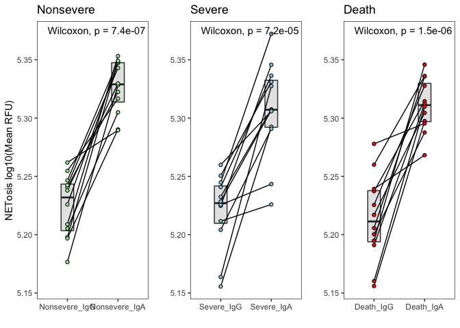

Figure5_S4
================
Tom LaSalle

This document contains all the code necessary to generate the plots for
Figure 5 and related supplementary figure S4. Plots are subsequently
edited in Adobe Illustrator to produce the final figures.

Load the necessary libraries:

``` r
library(knitr)
library(ggplot2)
library(ggrepel)
library(RColorBrewer)
library(plyr)
library(dplyr)
library(openxlsx)
library(cowplot)
library(ggpubr)
library(ggplotify)
library(pheatmap)
library(DESeq2)
library(fgsea)
library(ELISAtools)
library(dr4pl)
```

Load the neutrophil RNA-seq data and metadata:

``` r
prefix <- "~/Downloads/COVID19_Neutrophil_Code/" #Adapt as necessary
metadata_long <- read.xlsx(paste0(prefix,"Tables/TableS1.xlsx"), sheet = 4)
Count <- read.table(gzfile(paste0(prefix,"Neutrophil_RNAseq_Count_Matrix.txt.gz")),sep="\t")
colnames(Count) <- Count[1,]
Count <- Count[-1,]
Count <- Count[,-2]
rownames(Count) <- Count[,1]
nams <- Count[,1]
Count <- Count[,-1]
Count <- as.data.frame(apply(Count,2,as.numeric))
rownames(Count) <- nams
TPM <- read.table(gzfile(paste0(prefix,"Neutrophil_RNAseq_TPM_Matrix.txt.gz")),sep="\t")
colnames(TPM) <- TPM[1,]
TPM <- TPM[-1,]
TPM <- TPM[,-2]
rownames(TPM) <- TPM[,1]
nams <- TPM[,1]
TPM <- TPM[,-1]
TPM <- as.data.frame(apply(TPM,2,as.numeric))
rownames(TPM) <- nams
qc_data <- read.xlsx(paste0(prefix,"Tables/TableS1.xlsx"), sheet = 7)
genomic_signatures <- read.xlsx(paste0(prefix,"Tables/TableS1.xlsx"), sheet = 10)
genepc <- read.delim(paste0(prefix,"Ensembl_to_Symbol.txt"))
logTPM <- log2(TPM + 1)

metadata_long <- metadata_long[which(metadata_long$Public.ID %in% qc_data$Public.ID),]
metadata_long <- merge(metadata_long, qc_data)

metadata_filtered <- metadata_long[metadata_long$percent.mt < 20 & metadata_long$Genes.Detected > 10000 & metadata_long$Median.Exon.CV < 1 & metadata_long$Exon.CV.MAD < 0.75 & metadata_long$Exonic.Rate*100 > 25 & metadata_long$Median.3..bias < 0.9,]

logTPM_filtered <- logTPM[,colnames(logTPM) %in% metadata_filtered$Public.Sample.ID]
TPM_filtered <- TPM[,colnames(TPM) %in% metadata_filtered$Public.Sample.ID]
Count_filtered <- Count[,colnames(Count) %in% metadata_filtered$Public.Sample.ID]

tf <- rowSums(TPM_filtered > 0.1) > ncol(TPM_filtered)*.2
TPM_filtered <- TPM_filtered[tf,]
Count_filtered <- Count_filtered[tf,]
logTPM_filtered <- logTPM_filtered[tf,]
tf <- rowSums(Count_filtered >= 6) > ncol(Count_filtered)*.2
TPM_filtered <- TPM_filtered[tf,]
Count_filtered <- Count_filtered[tf,]
logTPM_filtered <- logTPM_filtered[tf,]

metadata_filtered <- merge(metadata_filtered, genomic_signatures)
metadata_filtered$Public.Sample.ID <- metadata_filtered$Public.Sample.ID
metadata_filtered$COVID <- mapvalues(metadata_filtered$COVID, from = c(0,1), to = c("Negative","Positive"))
metadata_filtered_orig <- metadata_filtered

# Color Palette
vermillion <- rgb(213,94,0,max=255)
bluishgreen <- rgb(0,158,115,max=255)
yellow <- rgb(240,228,66,max=255)
blue <- rgb(0,114,178,max=255)
orange <- rgb(230,159,0,max=255)
skyblue <- rgb(86,180,233,max=255)
lightgray <- rgb(211,211,211,max=255)
```

In Figure 5 we explore the relationship between neutrophil effector
functions and the humoral immune response. We start by reading in the
systems serology (high-throughput antibody profiling) data. We process
the raw data by subtracting the value of the corresponding PBS value and
taking the log of the result. When calculating the ratios, we subtract
out the PBS well, set any negative values to 1, take the ratio, and then
take the log of the result.

``` r
antibody <- read.xlsx(paste0(prefix,"Tables/TableS4.xlsx"), sheet = 2, rowNames = TRUE)
antibody_ratios <- antibody
for (i in colnames(antibody)){
  antibody[,i] <- antibody[,i] - antibody[nrow(antibody)-1,i]
  antibody[,i][antibody[,i] < 0] <- 0
  antibody[,i] <- log10(antibody[,i] + 1)
}
for (i in colnames(antibody_ratios)){
  antibody_ratios[,i] <- antibody_ratios[,i] - antibody_ratios[nrow(antibody_ratios)-1,i]
  antibody_ratios[,i][antibody_ratios[,i] < 0] <- 1
}
antibody_ratios$S_IgG1_IgA1 <- antibody_ratios$S_IgG1 / antibody_ratios$S_IgA1
antibody_ratios$S1_IgG1_IgA1 <- antibody_ratios$S1_IgG1 / antibody_ratios$S1_IgA1
antibody_ratios$S2_IgG1_IgA1 <- antibody_ratios$S2_IgG1 / antibody_ratios$S2_IgA1
antibody_ratios$N_IgG1_IgA1 <- antibody_ratios$N_IgG1 / antibody_ratios$N_IgA1
antibody_ratios$RBD_IgG1_IgA1 <- antibody_ratios$RBD_IgG1 / antibody_ratios$RBD_IgA1
antibody_ratios$HA_IgG1_IgA1 <- antibody_ratios$HA_IgG1 / antibody_ratios$HA_IgA1
antibody_ratios$CMV_IgG1_IgA1 <- antibody_ratios$CMV_IgG1 / antibody_ratios$CMV_IgA1
antibody_ratios$OC43_IgG1_IgA1 <- antibody_ratios$OC43_IgG1 / antibody_ratios$OC43_IgA1
antibody_ratios$S_IgG2_IgA1 <- antibody_ratios$S_IgG2 / antibody_ratios$S_IgA1
antibody_ratios$S1_IgG2_IgA1 <- antibody_ratios$S1_IgG2 / antibody_ratios$S1_IgA1
antibody_ratios$S2_IgG2_IgA1 <- antibody_ratios$S2_IgG2 / antibody_ratios$S2_IgA1
antibody_ratios$N_IgG2_IgA1 <- antibody_ratios$N_IgG2 / antibody_ratios$N_IgA1
antibody_ratios$RBD_IgG2_IgA1 <- antibody_ratios$RBD_IgG2 / antibody_ratios$RBD_IgA1
antibody_ratios$HA_IgG2_IgA1 <- antibody_ratios$HA_IgG2 / antibody_ratios$HA_IgA1
antibody_ratios$CMV_IgG2_IgA1 <- antibody_ratios$CMV_IgG2 / antibody_ratios$CMV_IgA1
antibody_ratios$OC43_IgG2_IgA1 <- antibody_ratios$OC43_IgG2 / antibody_ratios$OC43_IgA1
antibody_ratios$S_IgG3_IgA1 <- antibody_ratios$S_IgG3 / antibody_ratios$S_IgA1
antibody_ratios$S1_IgG3_IgA1 <- antibody_ratios$S1_IgG3 / antibody_ratios$S1_IgA1
antibody_ratios$S2_IgG3_IgA1 <- antibody_ratios$S2_IgG3 / antibody_ratios$S2_IgA1
antibody_ratios$N_IgG3_IgA1 <- antibody_ratios$N_IgG3 / antibody_ratios$N_IgA1
antibody_ratios$RBD_IgG3_IgA1 <- antibody_ratios$RBD_IgG3 / antibody_ratios$RBD_IgA1
antibody_ratios$HA_IgG3_IgA1 <- antibody_ratios$HA_IgG3 / antibody_ratios$HA_IgA1
antibody_ratios$CMV_IgG3_IgA1 <- antibody_ratios$CMV_IgG3 / antibody_ratios$CMV_IgA1
antibody_ratios$OC43_IgG3_IgA1 <- antibody_ratios$OC43_IgG3 / antibody_ratios$OC43_IgA1
antibody_ratios$S_IgG4_IgA1 <- antibody_ratios$S_IgG4 / antibody_ratios$S_IgA1
antibody_ratios$S1_IgG4_IgA1 <- antibody_ratios$S1_IgG4 / antibody_ratios$S1_IgA1
antibody_ratios$S2_IgG4_IgA1 <- antibody_ratios$S2_IgG4 / antibody_ratios$S2_IgA1
antibody_ratios$N_IgG4_IgA1 <- antibody_ratios$N_IgG4 / antibody_ratios$N_IgA1
antibody_ratios$RBD_IgG4_IgA1 <- antibody_ratios$RBD_IgG4 / antibody_ratios$RBD_IgA1
antibody_ratios$HA_IgG4_IgA1 <- antibody_ratios$HA_IgG4 / antibody_ratios$HA_IgA1
antibody_ratios$CMV_IgG4_IgA1 <- antibody_ratios$CMV_IgG4 / antibody_ratios$CMV_IgA1
antibody_ratios$OC43_IgG4_IgA1 <- antibody_ratios$OC43_IgG4 / antibody_ratios$OC43_IgA1
antibody_ratios <- antibody_ratios[,-c(1:48)]
for (i in 1:ncol(antibody_ratios)){
  antibody_ratios[,i] <- log10(antibody_ratios[,i])
}
antibody$Public.Sample.ID <- antibody_ratios$Public.Sample.ID <- rownames(antibody)

metadata_filtered <- merge(metadata_filtered, antibody, by = "Public.Sample.ID", all.x = FALSE)
metadata_filtered <- metadata_filtered[!(metadata_filtered$Public.Sample.ID %in% c("87_D3","154_D7","43_D7","321_D7A","321_D7B")),] # remove samples for which two plasma samples were taken on the same day
metadata_filtered <- merge(x = metadata_filtered, y = antibody_ratios, by = "Public.Sample.ID", all.x = TRUE, all.y = FALSE)
```

First, we highlight that S-specific IgA1 antibody titers are associated
with disease severity.

``` r
metadata_temp <- metadata_filtered[metadata_filtered$COVID == "Positive" & metadata_filtered$Day %in% c("D0","D3","D7"),]
my.cols <- brewer.pal(3, "RdBu")

metadata_temp$new_x <- paste(metadata_temp$severity.max, metadata_temp$Day, sep = "_")
metadata_temp$new_x <- factor(metadata_temp$new_x, levels = c("non-severe_D0","severe_D0","non-severe_D3","severe_D3","non-severe_D7","severe_D7"))
metadata_temp$numeric_new_x <- as.numeric(metadata_temp$new_x)
metadata_temp <- arrange(metadata_temp, new_x, S_IgA1)
metadata_temp$adjust <- 0
metadata_temp[metadata_temp$new_x=="non-severe_D0","adjust"] <- seq(0.2,0.8,length=nrow(metadata_temp[metadata_temp$new_x=="non-severe_D0",]))
metadata_temp[metadata_temp$new_x=="severe_D0","adjust"] <- seq(0.2,0.8,length=nrow(metadata_temp[metadata_temp$new_x=="severe_D0",]))
metadata_temp[metadata_temp$new_x=="non-severe_D3","adjust"] <- seq(0.2,0.8,length=nrow(metadata_temp[metadata_temp$new_x=="non-severe_D3",]))
metadata_temp[metadata_temp$new_x=="severe_D3","adjust"] <- seq(0.2,0.8,length=nrow(metadata_temp[metadata_temp$new_x=="severe_D3",]))
metadata_temp[metadata_temp$new_x=="non-severe_D7","adjust"] <- seq(0.2,0.8,length=nrow(metadata_temp[metadata_temp$new_x=="non-severe_D7",]))
metadata_temp[metadata_temp$new_x=="severe_D7","adjust"] <- seq(0.2,0.8,length=nrow(metadata_temp[metadata_temp$new_x=="severe_D7",]))

metadata_temp[metadata_temp$new_x %in% c("severe_D0","severe_D3","severe_D7"),"adjust"] <- metadata_temp[metadata_temp$new_x %in% c("severe_D0","severe_D3","severe_D7"),"adjust"] - 0.35

my.cols <- brewer.pal(3,"RdBu")
p1 <- ggplot(metadata_temp, aes(x = numeric_new_x+adjust, y = S_IgA1, fill = factor(new_x))) + geom_boxplot(outlier.shape = NA) + geom_point(aes(colour = factor(new_x))) + scale_fill_manual(values = c(my.cols[3], my.cols[1], my.cols[3], my.cols[1], my.cols[3], my.cols[1])) + theme_bw() + theme(legend.position = "none", panel.grid = element_blank(), axis.text.x = element_blank()) + scale_colour_manual(values = c("black","grey","black","grey","black","grey")) + xlab("") + ylab("S IgA1 log10(MFI)") + scale_x_continuous(breaks = c(1.8,3.8,5.8)) + coord_fixed(ratio = 1.25)
wilcox.test(S_IgA1 ~ severity.max, metadata_temp[metadata_temp$Day == "D0",])
```

    ## 
    ##  Wilcoxon rank sum test with continuity correction
    ## 
    ## data:  S_IgA1 by severity.max
    ## W = 8616, p-value = 0.5839
    ## alternative hypothesis: true location shift is not equal to 0

``` r
wilcox.test(S_IgA1 ~ severity.max, metadata_temp[metadata_temp$Day == "D3",])
```

    ## 
    ##  Wilcoxon rank sum test with continuity correction
    ## 
    ## data:  S_IgA1 by severity.max
    ## W = 3919, p-value = 0.2266
    ## alternative hypothesis: true location shift is not equal to 0

``` r
wilcox.test(S_IgA1 ~ severity.max, metadata_temp[metadata_temp$Day == "D7",])
```

    ## 
    ##  Wilcoxon rank sum test with continuity correction
    ## 
    ## data:  S_IgA1 by severity.max
    ## W = 1091, p-value = 0.02972
    ## alternative hypothesis: true location shift is not equal to 0

**Figure 5A:**

``` r
p1
```

<!-- -->

However, we do not observe the same trend for S-specific IgG1
antibodies.

``` r
metadata_temp <- metadata_filtered[metadata_filtered$COVID == "Positive" & metadata_filtered$Day %in% c("D0","D3","D7"),]
my.cols <- brewer.pal(3, "RdBu")

metadata_temp$new_x <- paste(metadata_temp$severity.max, metadata_temp$Day, sep = "_")
metadata_temp$new_x <- factor(metadata_temp$new_x, levels = c("non-severe_D0","severe_D0","non-severe_D3","severe_D3","non-severe_D7","severe_D7"))
metadata_temp$numeric_new_x <- as.numeric(metadata_temp$new_x)
metadata_temp <- arrange(metadata_temp, new_x, S_IgG1)
metadata_temp$adjust <- 0
metadata_temp[metadata_temp$new_x=="non-severe_D0","adjust"] <- seq(0.2,0.8,length=nrow(metadata_temp[metadata_temp$new_x=="non-severe_D0",]))
metadata_temp[metadata_temp$new_x=="severe_D0","adjust"] <- seq(0.2,0.8,length=nrow(metadata_temp[metadata_temp$new_x=="severe_D0",]))
metadata_temp[metadata_temp$new_x=="non-severe_D3","adjust"] <- seq(0.2,0.8,length=nrow(metadata_temp[metadata_temp$new_x=="non-severe_D3",]))
metadata_temp[metadata_temp$new_x=="severe_D3","adjust"] <- seq(0.2,0.8,length=nrow(metadata_temp[metadata_temp$new_x=="severe_D3",]))
metadata_temp[metadata_temp$new_x=="non-severe_D7","adjust"] <- seq(0.2,0.8,length=nrow(metadata_temp[metadata_temp$new_x=="non-severe_D7",]))
metadata_temp[metadata_temp$new_x=="severe_D7","adjust"] <- seq(0.2,0.8,length=nrow(metadata_temp[metadata_temp$new_x=="severe_D7",]))

metadata_temp[metadata_temp$new_x %in% c("severe_D0","severe_D3","severe_D7"),"adjust"] <- metadata_temp[metadata_temp$new_x %in% c("severe_D0","severe_D3","severe_D7"),"adjust"] - 0.35

my.cols <- brewer.pal(3,"RdBu")
p1 <- ggplot(metadata_temp, aes(x = numeric_new_x+adjust, y = S_IgG1, fill = factor(new_x))) + geom_boxplot(outlier.shape = NA) + geom_point(aes(colour = factor(new_x))) + scale_fill_manual(values = c(my.cols[3], my.cols[1], my.cols[3], my.cols[1], my.cols[3], my.cols[1])) + theme_bw() + theme(legend.position = "none", panel.grid = element_blank(), axis.text.x = element_blank()) + scale_colour_manual(values = c("black","grey","black","grey","black","grey")) + xlab("") + ylab("S IgG1 log10(MFI)") + scale_x_continuous(breaks = c(1.8,3.8,5.8)) + coord_fixed(ratio = 0.8)
wilcox.test(S_IgG1 ~ severity.max, metadata_temp[metadata_temp$Day == "D0",])
```

    ## 
    ##  Wilcoxon rank sum test with continuity correction
    ## 
    ## data:  S_IgG1 by severity.max
    ## W = 8830, p-value = 0.8239
    ## alternative hypothesis: true location shift is not equal to 0

``` r
wilcox.test(S_IgG1 ~ severity.max, metadata_temp[metadata_temp$Day == "D3",])
```

    ## 
    ##  Wilcoxon rank sum test with continuity correction
    ## 
    ## data:  S_IgG1 by severity.max
    ## W = 4304.5, p-value = 0.8647
    ## alternative hypothesis: true location shift is not equal to 0

``` r
wilcox.test(S_IgG1 ~ severity.max, metadata_temp[metadata_temp$Day == "D7",])
```

    ## 
    ##  Wilcoxon rank sum test with continuity correction
    ## 
    ## data:  S_IgG1 by severity.max
    ## W = 1245, p-value = 0.2159
    ## alternative hypothesis: true location shift is not equal to 0

**Figure Not Included:**

``` r
p1
```

<!-- -->

Next we build heatmaps of signed p-values for the Wilcoxon rank-sum test
to get an overall sense of associations with antibody isotypes and
subclasses with disease acuity and severity.

``` r
metadata_select <- metadata_filtered[metadata_filtered$COVID == "Positive" & metadata_filtered$Day %in% c("D0") & metadata_filtered$Acuity.max %in% c("1","2"),]

storage <- list()

pmatrix <- as.data.frame(matrix(0L, nrow = 8, ncol = 6))
rownames(pmatrix) <- c("S","S1","S2","N","RBD","OC43","HA","CMV")
colnames(pmatrix) <- c("IgG1","IgG2","IgG3","IgG4","IgA1","IgM")
i = 1
j = 1
for (i in 1:nrow(pmatrix)){
  for (j in 1:ncol(pmatrix)){
    string <- paste(rownames(pmatrix)[i], colnames(pmatrix)[j], sep = "_")
    metadata_temp <- metadata_select[complete.cases(metadata_select[,which(colnames(metadata_select) == string)]),]
    test <- wilcox.test(as.numeric(metadata_temp[,colnames(metadata_temp) == string]) ~ factor(metadata_temp$Acuity.max))
    sign <- median(metadata_temp[metadata_temp$Acuity.max == "2",colnames(metadata_temp) %in% string]) - median(metadata_temp[metadata_temp$Acuity.max == "1",colnames(metadata_temp) %in% string])
    if (test$p.value < 0.05){
      pmatrix[i,j] <- -1*log10(test$p.value)*sign(sign)
    }
    else {
      pmatrix[i,j] <- NA
    }
  }
}
pmatrix0 <- pmatrix

metadata_select <- metadata_filtered[metadata_filtered$COVID == "Positive" & metadata_filtered$Day %in% c("D3") & metadata_filtered$Acuity.max %in% c("1","2"),]

pmatrix <- as.data.frame(matrix(0L, nrow = 8, ncol = 6))
rownames(pmatrix) <- c("S","S1","S2","N","RBD","OC43","HA","CMV")
colnames(pmatrix) <- c("IgG1","IgG2","IgG3","IgG4","IgA1","IgM")
i = 1
j = 1
for (i in 1:nrow(pmatrix)){
  for (j in 1:ncol(pmatrix)){
    string <- paste(rownames(pmatrix)[i], colnames(pmatrix)[j], sep = "_")
    metadata_temp <- metadata_select[complete.cases(metadata_select[,which(colnames(metadata_select) == string)]),]
    test <- wilcox.test(as.numeric(metadata_temp[,colnames(metadata_temp) == string]) ~ factor(metadata_temp$Acuity.max))
    sign <- median(metadata_temp[metadata_temp$Acuity.max == "2",colnames(metadata_temp) %in% string]) - median(metadata_temp[metadata_temp$Acuity.max == "1",colnames(metadata_temp) %in% string])
    if (test$p.value < 0.05){
      pmatrix[i,j] <- -1*log10(test$p.value)*sign(sign)
    }
    else {
      pmatrix[i,j] <- NA
    }
  }
}
pmatrix3 <- pmatrix

metadata_select <- metadata_filtered[metadata_filtered$COVID == "Positive" & metadata_filtered$Day %in% c("D7") & metadata_filtered$Acuity.max %in% c("1","2"),]

pmatrix <- as.data.frame(matrix(0L, nrow = 8, ncol = 6))
rownames(pmatrix) <- c("S","S1","S2","N","RBD","OC43","HA","CMV")
colnames(pmatrix) <- c("IgG1","IgG2","IgG3","IgG4","IgA1","IgM")
i = 1
j = 1
for (i in 1:nrow(pmatrix)){
  for (j in 1:ncol(pmatrix)){
    string <- paste(rownames(pmatrix)[i], colnames(pmatrix)[j], sep = "_")
    metadata_temp <- metadata_select[complete.cases(metadata_select[,which(colnames(metadata_select) == string)]),]
    test <- wilcox.test(as.numeric(metadata_temp[,colnames(metadata_temp) == string]) ~ factor(metadata_temp$Acuity.max))
    sign <- median(metadata_temp[metadata_temp$Acuity.max == "2",colnames(metadata_temp) %in% string]) - median(metadata_temp[metadata_temp$Acuity.max == "1",colnames(metadata_temp) %in% string])
    if (test$p.value < 0.05){
      pmatrix[i,j] <- -1*log10(test$p.value)*sign(sign)
    }
    else {
      pmatrix[i,j] <- NA
    }
  }
}
pmatrix7 <- pmatrix

breaksList = seq(-3, 3, by = 0.25)
```

**Figure 5B:**

``` r
pheatmap(as.matrix(pmatrix0), main = "Day 0 Acuity", scale = "none", cluster_cols = FALSE, cluster_rows = FALSE, color = colorRampPalette(colors = c("red",vermillion,orange,"white",bluishgreen,blue,"navy"))(length(breaksList)), breaks = breaksList)
```

<!-- -->

``` r
pheatmap(as.matrix(pmatrix3), main = "Day 3 Acuity", scale = "none", cluster_cols = FALSE, cluster_rows = FALSE, color = colorRampPalette(colors = c("red",vermillion,orange,"white",bluishgreen,blue,"navy"))(length(breaksList)), breaks = breaksList)
```

<!-- -->

``` r
pheatmap(as.matrix(pmatrix7), main = "Day 7 Acuity", scale = "none", cluster_cols = FALSE, cluster_rows = FALSE, color = colorRampPalette(colors = c("red",vermillion,orange,"white",bluishgreen,blue,"navy"))(length(breaksList)), breaks = breaksList)
```

<!-- -->

``` r
metadata_select <- metadata_filtered[metadata_filtered$COVID == "Positive" & metadata_filtered$Day %in% c("D0"),]

storage <- list()

pmatrix <- as.data.frame(matrix(0L, nrow = 8, ncol = 6))
rownames(pmatrix) <- c("S","S1","S2","N","RBD","OC43","HA","CMV")
colnames(pmatrix) <- c("IgG1","IgG2","IgG3","IgG4","IgA1","IgM")
i = 1
j = 1
for (i in 1:nrow(pmatrix)){
  for (j in 1:ncol(pmatrix)){
    string <- paste(rownames(pmatrix)[i], colnames(pmatrix)[j], sep = "_")
    metadata_temp <- metadata_select[complete.cases(metadata_select[,which(colnames(metadata_select) == string)]),]
    test <- wilcox.test(as.numeric(metadata_temp[,colnames(metadata_temp) == string]) ~ factor(metadata_temp$severity.max))
    sign <- median(metadata_temp[metadata_temp$severity.max == "non-severe",colnames(metadata_temp) %in% string]) - median(metadata_temp[metadata_temp$severity.max == "severe",colnames(metadata_temp) %in% string])
    if (test$p.value < 0.05){
      pmatrix[i,j] <- -1*log10(test$p.value)*sign(sign)
    }
    else {
      pmatrix[i,j] <- NA
    }
  }
}
pmatrix0 <- pmatrix

metadata_select <- metadata_filtered[metadata_filtered$COVID == "Positive" & metadata_filtered$Day %in% c("D3"),]

pmatrix <- as.data.frame(matrix(0L, nrow = 8, ncol = 6))
rownames(pmatrix) <- c("S","S1","S2","N","RBD","OC43","HA","CMV")
colnames(pmatrix) <- c("IgG1","IgG2","IgG3","IgG4","IgA1","IgM")
i = 1
j = 1
for (i in 1:nrow(pmatrix)){
  for (j in 1:ncol(pmatrix)){
    string <- paste(rownames(pmatrix)[i], colnames(pmatrix)[j], sep = "_")
    metadata_temp <- metadata_select[complete.cases(metadata_select[,which(colnames(metadata_select) == string)]),]
    test <- wilcox.test(as.numeric(metadata_temp[,colnames(metadata_temp) == string]) ~ factor(metadata_temp$severity.max))
    sign <- median(metadata_temp[metadata_temp$severity.max == "non-severe",colnames(metadata_temp) %in% string]) - median(metadata_temp[metadata_temp$severity.max == "severe",colnames(metadata_temp) %in% string])
    if (test$p.value < 0.05){
      pmatrix[i,j] <- -1*log10(test$p.value)*sign(sign)
    }
    else {
      pmatrix[i,j] <- NA
    }
  }
}
pmatrix3 <- pmatrix

metadata_select <- metadata_filtered[metadata_filtered$COVID == "Positive" & metadata_filtered$Day %in% c("D7"),]

pmatrix <- as.data.frame(matrix(0L, nrow = 8, ncol = 6))
rownames(pmatrix) <- c("S","S1","S2","N","RBD","OC43","HA","CMV")
colnames(pmatrix) <- c("IgG1","IgG2","IgG3","IgG4","IgA1","IgM")
i = 1
j = 1
for (i in 1:nrow(pmatrix)){
  for (j in 1:ncol(pmatrix)){
    string <- paste(rownames(pmatrix)[i], colnames(pmatrix)[j], sep = "_")
    metadata_temp <- metadata_select[complete.cases(metadata_select[,which(colnames(metadata_select) == string)]),]
    test <- wilcox.test(as.numeric(metadata_temp[,colnames(metadata_temp) == string]) ~ factor(metadata_temp$severity.max))
    sign <- median(metadata_temp[metadata_temp$severity.max == "non-severe",colnames(metadata_temp) %in% string]) - median(metadata_temp[metadata_temp$severity.max == "severe",colnames(metadata_temp) %in% string])
    if (test$p.value < 0.05){
      pmatrix[i,j] <- -1*log10(test$p.value)*sign(sign)
    }
    else {
      pmatrix[i,j] <- NA
    }
  }
}
pmatrix7 <- pmatrix

breaksList = seq(-3, 3, by = 0.25)
```

**Figure Not Included:**

``` r
pheatmap(as.matrix(pmatrix0), main = "Day 0 Severity", scale = "none", cluster_cols = FALSE, cluster_rows = FALSE, color = colorRampPalette(colors = c("red",vermillion,orange,"white",bluishgreen,blue,"navy"))(length(breaksList)), breaks = breaksList)
```

<!-- -->

``` r
pheatmap(as.matrix(pmatrix3), main = "Day 3 Severity", scale = "none", cluster_cols = FALSE, cluster_rows = FALSE, color = colorRampPalette(colors = c("red",vermillion,orange,"white",bluishgreen,blue,"navy"))(length(breaksList)), breaks = breaksList)
```

<!-- -->

``` r
pheatmap(as.matrix(pmatrix7), main = "Day 7 Severity", scale = "none", cluster_cols = FALSE, cluster_rows = FALSE, color = colorRampPalette(colors = c("red",vermillion,orange,"white",bluishgreen,blue,"navy"))(length(breaksList)), breaks = breaksList)
```

<!-- -->

We check for differences in Fc receptor expression across severity and
neutrophil subtypes.

``` r
gene <- "FCGR1A"
id <- genepc$Gene.stable.ID[which(genepc$Gene.name == gene)][1]
metadata_filtered_orig$GOI <- t(logTPM_filtered[rownames(logTPM_filtered) == id,])
metadata_temp <- metadata_filtered_orig[metadata_filtered_orig$COVID == "Positive" & metadata_filtered_orig$Day %in% c("D0","D3","D7"),]
my.cols <- brewer.pal(3, "RdBu")
p1 <- ggplot(metadata_temp, aes(x = factor(Day), y = as.numeric(GOI), fill = factor(severity.max))) + geom_boxplot(outlier.shape = NA) + geom_point(position = position_jitterdodge(), alpha = 0.2, size = 0.5) + theme_bw() + ylab("log2(TPM+1) Expression") + xlab("Day") + scale_fill_manual(values = my.cols[c(3,1)]) + stat_compare_means() + ggtitle(gene) + theme(legend.position = "none") + xlab("")

gene <- "FCGR1B"
id <- genepc$Gene.stable.ID[which(genepc$Gene.name == gene)][1]
metadata_filtered_orig$GOI <- t(logTPM_filtered[rownames(logTPM_filtered) == id,])
metadata_temp <- metadata_filtered_orig[metadata_filtered_orig$COVID == "Positive" & metadata_filtered_orig$Day %in% c("D0","D3","D7"),]
my.cols <- brewer.pal(3, "RdBu")
p2 <- ggplot(metadata_temp, aes(x = factor(Day), y = as.numeric(GOI), fill = factor(severity.max))) + geom_boxplot(outlier.shape = NA) + geom_point(position = position_jitterdodge(), alpha = 0.2, size = 0.5) + theme_bw() + ylab("log2(TPM+1) Expression") + xlab("Day") + scale_fill_manual(values = my.cols[c(3,1)]) + stat_compare_means() + ggtitle(gene) + theme(legend.position = "none") + xlab("")

gene <- "FCGR2A"
id <- genepc$Gene.stable.ID[which(genepc$Gene.name == gene)][1]
metadata_filtered_orig$GOI <- t(logTPM_filtered[rownames(logTPM_filtered) == id,])
metadata_temp <- metadata_filtered_orig[metadata_filtered_orig$COVID == "Positive" & metadata_filtered_orig$Day %in% c("D0","D3","D7"),]
my.cols <- brewer.pal(3, "RdBu")
p3 <- ggplot(metadata_temp, aes(x = factor(Day), y = as.numeric(GOI), fill = factor(severity.max))) + geom_boxplot(outlier.shape = NA) + geom_point(position = position_jitterdodge(), alpha = 0.2, size = 0.5) + theme_bw() + ylab("log2(TPM+1) Expression") + xlab("Day") + scale_fill_manual(values = my.cols[c(3,1)]) + stat_compare_means() + ggtitle(gene) + theme(legend.position = "none") + xlab("")

gene <- "FCGR2B"
id <- genepc$Gene.stable.ID[which(genepc$Gene.name == gene)][1]
metadata_filtered_orig$GOI <- t(logTPM_filtered[rownames(logTPM_filtered) == id,])
metadata_temp <- metadata_filtered_orig[metadata_filtered_orig$COVID == "Positive" & metadata_filtered_orig$Day %in% c("D0","D3","D7"),]
my.cols <- brewer.pal(3, "RdBu")
p4 <- ggplot(metadata_temp, aes(x = factor(Day), y = as.numeric(GOI), fill = factor(severity.max))) + geom_boxplot(outlier.shape = NA) + geom_point(position = position_jitterdodge(), alpha = 0.2, size = 0.5) + theme_bw() + ylab("log2(TPM+1) Expression") + xlab("Day") + scale_fill_manual(values = my.cols[c(3,1)]) + stat_compare_means() + ggtitle(gene) + theme(legend.position = "none") + xlab("")

gene <- "FCGR3A"
id <- genepc$Gene.stable.ID[which(genepc$Gene.name == gene)][1]
metadata_filtered_orig$GOI <- t(logTPM_filtered[rownames(logTPM_filtered) == id,])
metadata_temp <- metadata_filtered_orig[metadata_filtered_orig$COVID == "Positive" & metadata_filtered_orig$Day %in% c("D0","D3","D7"),]
my.cols <- brewer.pal(3, "RdBu")
p5 <- ggplot(metadata_temp, aes(x = factor(Day), y = as.numeric(GOI), fill = factor(severity.max))) + geom_boxplot(outlier.shape = NA) + geom_point(position = position_jitterdodge(), alpha = 0.2, size = 0.5) + theme_bw() + ylab("log2(TPM+1) Expression") + xlab("Day") + scale_fill_manual(values = my.cols[c(3,1)]) + stat_compare_means() + ggtitle(gene) + theme(legend.position = "none") + xlab("")

gene <- "FCGR3B"
id <- genepc$Gene.stable.ID[which(genepc$Gene.name == gene)][1]
metadata_filtered_orig$GOI <- t(logTPM_filtered[rownames(logTPM_filtered) == id,])
metadata_temp <- metadata_filtered_orig[metadata_filtered_orig$COVID == "Positive" & metadata_filtered_orig$Day %in% c("D0","D3","D7"),]
my.cols <- brewer.pal(3, "RdBu")
p6 <- ggplot(metadata_temp, aes(x = factor(Day), y = as.numeric(GOI), fill = factor(severity.max))) + geom_boxplot(outlier.shape = NA) + geom_point(position = position_jitterdodge(), alpha = 0.2, size = 0.5) + theme_bw() + ylab("log2(TPM+1) Expression") + xlab("Day") + scale_fill_manual(values = my.cols[c(3,1)]) + stat_compare_means() + ggtitle(gene) + theme(legend.position = "none") + xlab("")

gene <- "FCAR"
id <- genepc$Gene.stable.ID[which(genepc$Gene.name == gene)][1]
metadata_filtered_orig$GOI <- t(logTPM_filtered[rownames(logTPM_filtered) == id,])
metadata_temp <- metadata_filtered_orig[metadata_filtered_orig$COVID == "Positive" & metadata_filtered_orig$Day %in% c("D0","D3","D7"),]
my.cols <- brewer.pal(3, "RdBu")
p7 <- ggplot(metadata_temp, aes(x = factor(Day), y = as.numeric(GOI), fill = factor(severity.max))) + geom_boxplot(outlier.shape = NA) + geom_point(position = position_jitterdodge(), alpha = 0.2, size = 0.5) + theme_bw() + ylab("log2(TPM+1) Expression") + xlab("Day") + scale_fill_manual(values = my.cols[c(3,1)]) + stat_compare_means() + ggtitle(gene) + theme(legend.position = "none") + xlab("")

gene <- "FCGRT"
id <- genepc$Gene.stable.ID[which(genepc$Gene.name == gene)][1]
metadata_filtered_orig$GOI <- t(logTPM_filtered[rownames(logTPM_filtered) == id,])
metadata_temp <- metadata_filtered_orig[metadata_filtered_orig$COVID == "Positive" & metadata_filtered_orig$Day %in% c("D0","D3","D7"),]
my.cols <- brewer.pal(3, "RdBu")
p8 <- ggplot(metadata_temp, aes(x = factor(Day), y = as.numeric(GOI), fill = factor(severity.max))) + geom_boxplot(outlier.shape = NA) + geom_point(position = position_jitterdodge(), alpha = 0.2, size = 0.5) + theme_bw() + ylab("log2(TPM+1) Expression") + xlab("Day") + scale_fill_manual(values = my.cols[c(3,1)]) + stat_compare_means() + ggtitle(gene) + theme(legend.position = "none") + xlab("")
```

**Figure S4A:**

``` r
cowplot::plot_grid(p1,p2,p3,p4,p5,p6,p7,p8,ncol=4)
```

<!-- -->

``` r
gene <- "FCGR1A"
id <- genepc$Gene.stable.ID[which(genepc$Gene.name == gene)][1]
metadata_filtered_orig$GOI <- t(logTPM_filtered[rownames(logTPM_filtered) == id,])
metadata_filtered_orig$cluster_neuhi <- mapvalues(metadata_filtered_orig$cluster_neuhi, from = c("1","2","3","4","5","6","7"), to = c("NMF1","NMF2","NMF3","NMF4","NMF5","NMF6","Neu-Lo"))
metadata_filtered_orig$cluster_neuhi <- factor(metadata_filtered_orig$cluster_neuhi, levels = c("NMF1","NMF2","NMF3","NMF4","NMF5","NMF6","Neu-Lo"))
metadata_temp <- metadata_filtered_orig[metadata_filtered_orig$COVID == "Positive" & metadata_filtered_orig$Day %in% c("D0","D3","D7"),]
kruskal.test(g = metadata_temp$cluster_neuhi, x = metadata_temp$GOI)$p.value
```

    ## [1] 4.804151e-25

``` r
p1 <- ggplot(metadata_temp, aes(x = factor(cluster_neuhi), y = as.numeric(GOI), fill = cluster_neuhi)) + geom_boxplot(outlier.shape = NA) + geom_jitter(width = 0.3, alpha = 0.2, size = 0.5) + theme_bw() + ylab("log2(TPM+1) Expression") + scale_fill_manual(values = c(orange,skyblue,bluishgreen,yellow,blue,vermillion,"purple")) + stat_compare_means() + ggtitle(gene) + theme(legend.position = "none") + xlab("")

gene <- "FCGR1B"
id <- genepc$Gene.stable.ID[which(genepc$Gene.name == gene)][1]
metadata_filtered_orig$GOI <- t(logTPM_filtered[rownames(logTPM_filtered) == id,])
metadata_filtered_orig$cluster_neuhi <- mapvalues(metadata_filtered_orig$cluster_neuhi, from = c("1","2","3","4","5","6","7"), to = c("NMF1","NMF2","NMF3","NMF4","NMF5","NMF6","Neu-Lo"))
metadata_filtered_orig$cluster_neuhi <- factor(metadata_filtered_orig$cluster_neuhi, levels = c("NMF1","NMF2","NMF3","NMF4","NMF5","NMF6","Neu-Lo"))
metadata_temp <- metadata_filtered_orig[metadata_filtered_orig$COVID == "Positive" & metadata_filtered_orig$Day %in% c("D0","D3","D7"),]
kruskal.test(g = metadata_temp$cluster_neuhi, x = metadata_temp$GOI)$p.value
```

    ## [1] 6.934239e-57

``` r
p2 <- ggplot(metadata_temp, aes(x = factor(cluster_neuhi), y = as.numeric(GOI), fill = cluster_neuhi)) + geom_boxplot(outlier.shape = NA) + geom_jitter(width = 0.3, alpha = 0.2, size = 0.5) + theme_bw() + ylab("log2(TPM+1) Expression") + scale_fill_manual(values = c(orange,skyblue,bluishgreen,yellow,blue,vermillion,"purple")) + stat_compare_means() + ggtitle(gene) + theme(legend.position = "none") + xlab("")

gene <- "FCGR2A"
id <- genepc$Gene.stable.ID[which(genepc$Gene.name == gene)][1]
metadata_filtered_orig$GOI <- t(logTPM_filtered[rownames(logTPM_filtered) == id,])
metadata_filtered_orig$cluster_neuhi <- mapvalues(metadata_filtered_orig$cluster_neuhi, from = c("1","2","3","4","5","6","7"), to = c("NMF1","NMF2","NMF3","NMF4","NMF5","NMF6","Neu-Lo"))
metadata_filtered_orig$cluster_neuhi <- factor(metadata_filtered_orig$cluster_neuhi, levels = c("NMF1","NMF2","NMF3","NMF4","NMF5","NMF6","Neu-Lo"))
metadata_temp <- metadata_filtered_orig[metadata_filtered_orig$COVID == "Positive" & metadata_filtered_orig$Day %in% c("D0","D3","D7"),]
kruskal.test(g = metadata_temp$cluster_neuhi, x = metadata_temp$GOI)$p.value
```

    ## [1] 1.318661e-79

``` r
p3 <- ggplot(metadata_temp, aes(x = factor(cluster_neuhi), y = as.numeric(GOI), fill = cluster_neuhi)) + geom_boxplot(outlier.shape = NA) + geom_jitter(width = 0.3, alpha = 0.2, size = 0.5) + theme_bw() + ylab("log2(TPM+1) Expression") + scale_fill_manual(values = c(orange,skyblue,bluishgreen,yellow,blue,vermillion,"purple")) + stat_compare_means() + ggtitle(gene) + theme(legend.position = "none") + xlab("")

gene <- "FCGR2B"
id <- genepc$Gene.stable.ID[which(genepc$Gene.name == gene)][1]
metadata_filtered_orig$GOI <- t(logTPM_filtered[rownames(logTPM_filtered) == id,])
metadata_filtered_orig$cluster_neuhi <- mapvalues(metadata_filtered_orig$cluster_neuhi, from = c("1","2","3","4","5","6","7"), to = c("NMF1","NMF2","NMF3","NMF4","NMF5","NMF6","Neu-Lo"))
metadata_filtered_orig$cluster_neuhi <- factor(metadata_filtered_orig$cluster_neuhi, levels = c("NMF1","NMF2","NMF3","NMF4","NMF5","NMF6","Neu-Lo"))
metadata_temp <- metadata_filtered_orig[metadata_filtered_orig$COVID == "Positive" & metadata_filtered_orig$Day %in% c("D0","D3","D7"),]
kruskal.test(g = metadata_temp$cluster_neuhi, x = metadata_temp$GOI)$p.value
```

    ## [1] 5.872294e-36

``` r
p4 <- ggplot(metadata_temp, aes(x = factor(cluster_neuhi), y = as.numeric(GOI), fill = cluster_neuhi)) + geom_boxplot(outlier.shape = NA) + geom_jitter(width = 0.3, alpha = 0.2, size = 0.5) + theme_bw() + ylab("log2(TPM+1) Expression") + scale_fill_manual(values = c(orange,skyblue,bluishgreen,yellow,blue,vermillion,"purple")) + stat_compare_means() + ggtitle(gene) + theme(legend.position = "none") + xlab("")

gene <- "FCGR3A"
id <- genepc$Gene.stable.ID[which(genepc$Gene.name == gene)][1]
metadata_filtered_orig$GOI <- t(logTPM_filtered[rownames(logTPM_filtered) == id,])
metadata_filtered_orig$cluster_neuhi <- mapvalues(metadata_filtered_orig$cluster_neuhi, from = c("1","2","3","4","5","6","7"), to = c("NMF1","NMF2","NMF3","NMF4","NMF5","NMF6","Neu-Lo"))
metadata_filtered_orig$cluster_neuhi <- factor(metadata_filtered_orig$cluster_neuhi, levels = c("NMF1","NMF2","NMF3","NMF4","NMF5","NMF6","Neu-Lo"))
metadata_temp <- metadata_filtered_orig[metadata_filtered_orig$COVID == "Positive" & metadata_filtered_orig$Day %in% c("D0","D3","D7"),]
kruskal.test(g = metadata_temp$cluster_neuhi, x = metadata_temp$GOI)$p.value
```

    ## [1] 7.564739e-37

``` r
p5 <- ggplot(metadata_temp, aes(x = factor(cluster_neuhi), y = as.numeric(GOI), fill = cluster_neuhi)) + geom_boxplot(outlier.shape = NA) + geom_jitter(width = 0.3, alpha = 0.2, size = 0.5) + theme_bw() + ylab("log2(TPM+1) Expression") + scale_fill_manual(values = c(orange,skyblue,bluishgreen,yellow,blue,vermillion,"purple")) + stat_compare_means() + ggtitle(gene) + theme(legend.position = "none") + xlab("")

gene <- "FCGR3B"
id <- genepc$Gene.stable.ID[which(genepc$Gene.name == gene)][1]
metadata_filtered_orig$GOI <- t(logTPM_filtered[rownames(logTPM_filtered) == id,])
metadata_filtered_orig$cluster_neuhi <- mapvalues(metadata_filtered_orig$cluster_neuhi, from = c("1","2","3","4","5","6","7"), to = c("NMF1","NMF2","NMF3","NMF4","NMF5","NMF6","Neu-Lo"))
metadata_filtered_orig$cluster_neuhi <- factor(metadata_filtered_orig$cluster_neuhi, levels = c("NMF1","NMF2","NMF3","NMF4","NMF5","NMF6","Neu-Lo"))
metadata_temp <- metadata_filtered_orig[metadata_filtered_orig$COVID == "Positive" & metadata_filtered_orig$Day %in% c("D0","D3","D7"),]
kruskal.test(g = metadata_temp$cluster_neuhi, x = metadata_temp$GOI)$p.value
```

    ## [1] 2.977992e-69

``` r
p6 <- ggplot(metadata_temp, aes(x = factor(cluster_neuhi), y = as.numeric(GOI), fill = cluster_neuhi)) + geom_boxplot(outlier.shape = NA) + geom_jitter(width = 0.3, alpha = 0.2, size = 0.5) + theme_bw() + ylab("log2(TPM+1) Expression") + scale_fill_manual(values = c(orange,skyblue,bluishgreen,yellow,blue,vermillion,"purple")) + stat_compare_means() + ggtitle(gene) + theme(legend.position = "none") + xlab("")

gene <- "FCAR"
id <- genepc$Gene.stable.ID[which(genepc$Gene.name == gene)][1]
metadata_filtered_orig$GOI <- t(logTPM_filtered[rownames(logTPM_filtered) == id,])
metadata_filtered_orig$cluster_neuhi <- mapvalues(metadata_filtered_orig$cluster_neuhi, from = c("1","2","3","4","5","6","7"), to = c("NMF1","NMF2","NMF3","NMF4","NMF5","NMF6","Neu-Lo"))
metadata_filtered_orig$cluster_neuhi <- factor(metadata_filtered_orig$cluster_neuhi, levels = c("NMF1","NMF2","NMF3","NMF4","NMF5","NMF6","Neu-Lo"))
metadata_temp <- metadata_filtered_orig[metadata_filtered_orig$COVID == "Positive" & metadata_filtered_orig$Day %in% c("D0","D3","D7"),]
kruskal.test(g = metadata_temp$cluster_neuhi, x = metadata_temp$GOI)$p.value
```

    ## [1] 1.98525e-57

``` r
p7 <- ggplot(metadata_temp, aes(x = factor(cluster_neuhi), y = as.numeric(GOI), fill = cluster_neuhi)) + geom_boxplot(outlier.shape = NA) + geom_jitter(width = 0.3, alpha = 0.2, size = 0.5) + theme_bw() + ylab("log2(TPM+1) Expression") + scale_fill_manual(values = c(orange,skyblue,bluishgreen,yellow,blue,vermillion,"purple")) + stat_compare_means() + ggtitle(gene) + theme(legend.position = "none") + xlab("")

gene <- "FCGRT"
id <- genepc$Gene.stable.ID[which(genepc$Gene.name == gene)][1]
metadata_filtered_orig$GOI <- t(logTPM_filtered[rownames(logTPM_filtered) == id,])
metadata_filtered_orig$cluster_neuhi <- mapvalues(metadata_filtered_orig$cluster_neuhi, from = c("1","2","3","4","5","6","7"), to = c("NMF1","NMF2","NMF3","NMF4","NMF5","NMF6","Neu-Lo"))
metadata_filtered_orig$cluster_neuhi <- factor(metadata_filtered_orig$cluster_neuhi, levels = c("NMF1","NMF2","NMF3","NMF4","NMF5","NMF6","Neu-Lo"))
metadata_temp <- metadata_filtered_orig[metadata_filtered_orig$COVID == "Positive" & metadata_filtered_orig$Day %in% c("D0","D3","D7"),]
kruskal.test(g = metadata_temp$cluster_neuhi, x = metadata_temp$GOI)$p.value
```

    ## [1] 1.575079e-15

``` r
p8 <- ggplot(metadata_temp, aes(x = factor(cluster_neuhi), y = as.numeric(GOI), fill = cluster_neuhi)) + geom_boxplot(outlier.shape = NA) + geom_jitter(width = 0.3, alpha = 0.2, size = 0.5) + theme_bw() + ylab("log2(TPM+1) Expression") + scale_fill_manual(values = c(orange,skyblue,bluishgreen,yellow,blue,vermillion,"purple")) + stat_compare_means() + ggtitle(gene) + theme(legend.position = "none") + xlab("")
```

**Figure S4B:**

``` r
cowplot::plot_grid(p1,p2,p3,p4,p5,p6,p7,p8,ncol=4)
```

<!-- -->

We also check if S-specific IgA1 titers are associated with neutrophil
subtypes or absolute neutrophil counts.

``` r
metadata_temp <- metadata_filtered[metadata_filtered$COVID == "Positive" & metadata_filtered$Day %in% c("D0"),]
metadata_temp$new_x <- paste(metadata_temp$cluster_neuhi)
metadata_temp$new_x <- factor(metadata_temp$new_x, levels = c("1","2","3","4","5","6","7"))
metadata_temp$numeric_new_x <- as.numeric(metadata_temp$new_x)
metadata_temp <- arrange(metadata_temp, new_x, S_IgA1)
metadata_temp$adjust <- 0
metadata_temp[metadata_temp$new_x=="1","adjust"] <- seq(0.2,0.8,length=nrow(metadata_temp[metadata_temp$new_x=="1",]))
metadata_temp[metadata_temp$new_x=="2","adjust"] <- seq(0.2,0.8,length=nrow(metadata_temp[metadata_temp$new_x=="2",]))
metadata_temp[metadata_temp$new_x=="3","adjust"] <- seq(0.2,0.8,length=nrow(metadata_temp[metadata_temp$new_x=="3",]))
metadata_temp[metadata_temp$new_x=="4","adjust"] <- seq(0.2,0.8,length=nrow(metadata_temp[metadata_temp$new_x=="4",]))
metadata_temp[metadata_temp$new_x=="5","adjust"] <- seq(0.2,0.8,length=nrow(metadata_temp[metadata_temp$new_x=="5",]))
metadata_temp[metadata_temp$new_x=="6","adjust"] <- seq(0.2,0.8,length=nrow(metadata_temp[metadata_temp$new_x=="6",]))
metadata_temp[metadata_temp$new_x=="7","adjust"] <- seq(0.2,0.8,length=nrow(metadata_temp[metadata_temp$new_x=="7",]))
p1 <- ggplot(metadata_temp, aes(x = numeric_new_x+adjust, y = S_IgA1, fill = factor(new_x))) + geom_boxplot(outlier.shape = NA) + geom_point() + scale_fill_manual(values = c(orange, skyblue, bluishgreen, yellow, blue, vermillion, "#bd6bd9")) + theme_bw() + theme(legend.position = "none", panel.grid = element_blank(), axis.ticks.x = element_blank(), axis.text.x = element_blank())  + xlab("") + ylab("S IgA1 log10(MFI)") + coord_fixed(ratio = .3)

metadata_temp <- metadata_filtered[metadata_filtered$COVID == "Positive" & metadata_filtered$Day %in% c("D3"),]
metadata_temp$new_x <- paste(metadata_temp$cluster_neuhi)
metadata_temp$new_x <- factor(metadata_temp$new_x, levels = c("1","2","3","4","5","6","7"))
metadata_temp$numeric_new_x <- as.numeric(metadata_temp$new_x)
metadata_temp <- arrange(metadata_temp, new_x, S_IgA1)
metadata_temp$adjust <- 0
metadata_temp[metadata_temp$new_x=="1","adjust"] <- seq(0.2,0.8,length=nrow(metadata_temp[metadata_temp$new_x=="1",]))
metadata_temp[metadata_temp$new_x=="2","adjust"] <- seq(0.2,0.8,length=nrow(metadata_temp[metadata_temp$new_x=="2",]))
metadata_temp[metadata_temp$new_x=="3","adjust"] <- seq(0.2,0.8,length=nrow(metadata_temp[metadata_temp$new_x=="3",]))
metadata_temp[metadata_temp$new_x=="4","adjust"] <- seq(0.2,0.8,length=nrow(metadata_temp[metadata_temp$new_x=="4",]))
metadata_temp[metadata_temp$new_x=="5","adjust"] <- seq(0.2,0.8,length=nrow(metadata_temp[metadata_temp$new_x=="5",]))
metadata_temp[metadata_temp$new_x=="6","adjust"] <- seq(0.2,0.8,length=nrow(metadata_temp[metadata_temp$new_x=="6",]))
metadata_temp[metadata_temp$new_x=="7","adjust"] <- seq(0.2,0.8,length=nrow(metadata_temp[metadata_temp$new_x=="7",]))
p2 <- ggplot(metadata_temp, aes(x = numeric_new_x+adjust, y = S_IgA1, fill = factor(new_x))) + geom_boxplot(outlier.shape = NA) + geom_point() + scale_fill_manual(values = c(orange, skyblue, bluishgreen, yellow, blue, vermillion, "#bd6bd9")) + theme_bw() + theme(legend.position = "none", panel.grid = element_blank(), axis.ticks.x = element_blank(), axis.text.x = element_blank())  + xlab("") + ylab("S IgA1 log10(MFI)") + coord_fixed(ratio = .3)

metadata_temp <- metadata_filtered[metadata_filtered$COVID == "Positive" & metadata_filtered$Day %in% c("D7"),]
metadata_temp$new_x <- paste(metadata_temp$cluster_neuhi)
metadata_temp$new_x <- factor(metadata_temp$new_x, levels = c("1","2","3","4","5","6","7"))
metadata_temp$numeric_new_x <- as.numeric(metadata_temp$new_x)
metadata_temp <- arrange(metadata_temp, new_x, S_IgA1)
metadata_temp$adjust <- 0
metadata_temp[metadata_temp$new_x=="1","adjust"] <- seq(0.2,0.8,length=nrow(metadata_temp[metadata_temp$new_x=="1",]))
metadata_temp[metadata_temp$new_x=="2","adjust"] <- seq(0.2,0.8,length=nrow(metadata_temp[metadata_temp$new_x=="2",]))
metadata_temp[metadata_temp$new_x=="3","adjust"] <- seq(0.2,0.8,length=nrow(metadata_temp[metadata_temp$new_x=="3",]))
metadata_temp[metadata_temp$new_x=="4","adjust"] <- seq(0.2,0.8,length=nrow(metadata_temp[metadata_temp$new_x=="4",]))
metadata_temp[metadata_temp$new_x=="5","adjust"] <- seq(0.2,0.8,length=nrow(metadata_temp[metadata_temp$new_x=="5",]))
metadata_temp[metadata_temp$new_x=="6","adjust"] <- seq(0.2,0.8,length=nrow(metadata_temp[metadata_temp$new_x=="6",]))
metadata_temp[metadata_temp$new_x=="7","adjust"] <- seq(0.2,0.8,length=nrow(metadata_temp[metadata_temp$new_x=="7",]))
p3 <- ggplot(metadata_temp, aes(x = numeric_new_x+adjust, y = S_IgA1, fill = factor(new_x))) + geom_boxplot(outlier.shape = NA) + geom_point() + scale_fill_manual(values = c(orange, skyblue, bluishgreen, yellow, blue, vermillion, "#bd6bd9")) + theme_bw() + theme(legend.position = "none", panel.grid = element_blank(), axis.ticks.x = element_blank(), axis.text.x = element_blank())  + xlab("") + ylab("S IgA1 log10(MFI)") + coord_fixed(ratio = .3)

kruskal.test(S_IgA1 ~ factor(cluster_neuhi), metadata_filtered[metadata_filtered$COVID == "Positive" & metadata_filtered$Day == "D0",])
```

    ## 
    ##  Kruskal-Wallis rank sum test
    ## 
    ## data:  S_IgA1 by factor(cluster_neuhi)
    ## Kruskal-Wallis chi-squared = 28.77, df = 6, p-value = 6.723e-05

``` r
kruskal.test(S_IgA1 ~ factor(cluster_neuhi), metadata_filtered[metadata_filtered$COVID == "Positive" & metadata_filtered$Day == "D3",])
```

    ## 
    ##  Kruskal-Wallis rank sum test
    ## 
    ## data:  S_IgA1 by factor(cluster_neuhi)
    ## Kruskal-Wallis chi-squared = 28.446, df = 6, p-value = 7.742e-05

``` r
kruskal.test(S_IgA1 ~ factor(cluster_neuhi), metadata_filtered[metadata_filtered$COVID == "Positive" & metadata_filtered$Day == "D7",])
```

    ## 
    ##  Kruskal-Wallis rank sum test
    ## 
    ## data:  S_IgA1 by factor(cluster_neuhi)
    ## Kruskal-Wallis chi-squared = 14.252, df = 6, p-value = 0.02694

**Figure Not Included:**

``` r
plot_grid(p1,p2,p3,nrow = 3)
```

<!-- -->

``` r
metadata_temp <- metadata_filtered[metadata_filtered$COVID == "Positive" & metadata_filtered$Day %in% c("D0") & complete.cases(metadata_filtered$ANC.matched),]
metadata_temp$new_x <- paste(metadata_temp$ANC.matched)
metadata_temp$new_x <- factor(metadata_temp$new_x, levels = c("1","2","3","4","5"))
metadata_temp$numeric_new_x <- as.numeric(metadata_temp$new_x)
metadata_temp <- arrange(metadata_temp, new_x, S_IgA1)
metadata_temp$adjust <- 0
metadata_temp[metadata_temp$new_x=="1","adjust"] <- seq(0.2,0.8,length=nrow(metadata_temp[metadata_temp$new_x=="1",]))
metadata_temp[metadata_temp$new_x=="2","adjust"] <- seq(0.2,0.8,length=nrow(metadata_temp[metadata_temp$new_x=="2",]))
metadata_temp[metadata_temp$new_x=="3","adjust"] <- seq(0.2,0.8,length=nrow(metadata_temp[metadata_temp$new_x=="3",]))
metadata_temp[metadata_temp$new_x=="4","adjust"] <- seq(0.2,0.8,length=nrow(metadata_temp[metadata_temp$new_x=="4",]))
metadata_temp[metadata_temp$new_x=="5","adjust"] <- seq(0.2,0.8,length=nrow(metadata_temp[metadata_temp$new_x=="5",]))
my.cols <- brewer.pal(6,"Blues")
p1 <- ggplot(metadata_temp, aes(x = numeric_new_x+adjust, y = S_IgA1, fill = factor(new_x))) + geom_boxplot(outlier.shape = NA) + geom_point(aes(colour = factor(new_x))) + scale_fill_manual(values = c(my.cols[2], my.cols[3], my.cols[4], my.cols[5], my.cols[6])) + theme_bw() + theme(legend.position = "none", panel.grid = element_blank(), axis.ticks.x = element_blank(), axis.text.x = element_blank()) + scale_colour_manual(values = c("black","black","black","black","black")) + xlab("") + ylab("S IgA1 log10(MFI)") + coord_fixed(ratio = 0.2)

metadata_temp <- metadata_filtered[metadata_filtered$COVID == "Positive" & metadata_filtered$Day %in% c("D3") & complete.cases(metadata_filtered$ANC.matched),]
metadata_temp$new_x <- paste(metadata_temp$ANC.matched)
metadata_temp$new_x <- factor(metadata_temp$new_x, levels = c("1","2","3","4","5"))
metadata_temp$numeric_new_x <- as.numeric(metadata_temp$new_x)
metadata_temp <- arrange(metadata_temp, new_x, S_IgA1)
metadata_temp$adjust <- 0
metadata_temp[metadata_temp$new_x=="1","adjust"] <- seq(0.2,0.8,length=nrow(metadata_temp[metadata_temp$new_x=="1",]))
metadata_temp[metadata_temp$new_x=="2","adjust"] <- seq(0.2,0.8,length=nrow(metadata_temp[metadata_temp$new_x=="2",]))
metadata_temp[metadata_temp$new_x=="3","adjust"] <- seq(0.2,0.8,length=nrow(metadata_temp[metadata_temp$new_x=="3",]))
metadata_temp[metadata_temp$new_x=="4","adjust"] <- seq(0.2,0.8,length=nrow(metadata_temp[metadata_temp$new_x=="4",]))
metadata_temp[metadata_temp$new_x=="5","adjust"] <- seq(0.2,0.8,length=nrow(metadata_temp[metadata_temp$new_x=="5",]))
my.cols <- brewer.pal(6,"Blues")
p2 <- ggplot(metadata_temp, aes(x = numeric_new_x+adjust, y = S_IgA1, fill = factor(new_x))) + geom_boxplot(outlier.shape = NA) + geom_point(aes(colour = factor(new_x))) + scale_fill_manual(values = c(my.cols[2], my.cols[3], my.cols[4], my.cols[5], my.cols[6])) + theme_bw() + theme(legend.position = "none", panel.grid = element_blank(), axis.ticks.x = element_blank(), axis.text.x = element_blank()) + scale_colour_manual(values = c("black","black","black","black","black")) + xlab("") + ylab("S IgA1 log10(MFI)") + coord_fixed(ratio = 0.2)

metadata_temp <- metadata_filtered[metadata_filtered$COVID == "Positive" & metadata_filtered$Day %in% c("D7") & complete.cases(metadata_filtered$ANC.matched),]
metadata_temp$new_x <- paste(metadata_temp$ANC.matched)
metadata_temp$new_x <- factor(metadata_temp$new_x, levels = c("1","2","3","4","5"))
metadata_temp$numeric_new_x <- as.numeric(metadata_temp$new_x)
metadata_temp <- arrange(metadata_temp, new_x, S_IgA1)
metadata_temp$adjust <- 0
metadata_temp[metadata_temp$new_x=="1","adjust"] <- seq(0.2,0.8,length=nrow(metadata_temp[metadata_temp$new_x=="1",]))
metadata_temp[metadata_temp$new_x=="2","adjust"] <- seq(0.2,0.8,length=nrow(metadata_temp[metadata_temp$new_x=="2",]))
metadata_temp[metadata_temp$new_x=="3","adjust"] <- seq(0.2,0.8,length=nrow(metadata_temp[metadata_temp$new_x=="3",]))
metadata_temp[metadata_temp$new_x=="4","adjust"] <- seq(0.2,0.8,length=nrow(metadata_temp[metadata_temp$new_x=="4",]))
metadata_temp[metadata_temp$new_x=="5","adjust"] <- seq(0.2,0.8,length=nrow(metadata_temp[metadata_temp$new_x=="5",]))
my.cols <- brewer.pal(6,"Blues")
p3 <- ggplot(metadata_temp, aes(x = numeric_new_x+adjust, y = S_IgA1, fill = factor(new_x))) + geom_boxplot(outlier.shape = NA) + geom_point(aes(colour = factor(new_x))) + scale_fill_manual(values = c(my.cols[2], my.cols[3], my.cols[4], my.cols[5], my.cols[6])) + theme_bw() + theme(legend.position = "none", panel.grid = element_blank(), axis.ticks.x = element_blank(), axis.text.x = element_blank()) + scale_colour_manual(values = c("black","black","black","black","black")) + xlab("") + ylab("S IgA1 log10(MFI)") + coord_fixed(ratio = 0.2)

cor.test(metadata_filtered[metadata_filtered$COVID == "Positive" & metadata_filtered$Day == "D0",]$S_IgA1, metadata_filtered[metadata_filtered$COVID == "Positive" & metadata_filtered$Day == "D0",]$ANC.matched, method = "kendall")
```

    ## 
    ##  Kendall's rank correlation tau
    ## 
    ## data:  metadata_filtered[metadata_filtered$COVID == "Positive" & metadata_filtered$Day == "D0", ]$S_IgA1 and metadata_filtered[metadata_filtered$COVID == "Positive" & metadata_filtered$Day == "D0", ]$ANC.matched
    ## z = 5.1708, p-value = 2.331e-07
    ## alternative hypothesis: true tau is not equal to 0
    ## sample estimates:
    ##       tau 
    ## 0.2404313

``` r
kruskal.test(S_IgA1 ~ ANC.matched, metadata_filtered[metadata_filtered$COVID == "Positive" & metadata_filtered$Day == "D0",])
```

    ## 
    ##  Kruskal-Wallis rank sum test
    ## 
    ## data:  S_IgA1 by ANC.matched
    ## Kruskal-Wallis chi-squared = 27.472, df = 4, p-value = 1.595e-05

``` r
cor.test(metadata_filtered[metadata_filtered$COVID == "Positive" & metadata_filtered$Day == "D3",]$S_IgA1, metadata_filtered[metadata_filtered$COVID == "Positive" & metadata_filtered$Day == "D3",]$ANC.matched, method = "kendall")
```

    ## 
    ##  Kendall's rank correlation tau
    ## 
    ## data:  metadata_filtered[metadata_filtered$COVID == "Positive" & metadata_filtered$Day == "D3", ]$S_IgA1 and metadata_filtered[metadata_filtered$COVID == "Positive" & metadata_filtered$Day == "D3", ]$ANC.matched
    ## z = 2.6377, p-value = 0.008348
    ## alternative hypothesis: true tau is not equal to 0
    ## sample estimates:
    ##      tau 
    ## 0.152061

``` r
kruskal.test(S_IgA1 ~ ANC.matched, metadata_filtered[metadata_filtered$COVID == "Positive" & metadata_filtered$Day == "D3",])
```

    ## 
    ##  Kruskal-Wallis rank sum test
    ## 
    ## data:  S_IgA1 by ANC.matched
    ## Kruskal-Wallis chi-squared = 8.2713, df = 4, p-value = 0.08213

``` r
cor.test(metadata_filtered[metadata_filtered$COVID == "Positive" & metadata_filtered$Day == "D7",]$S_IgA1, metadata_filtered[metadata_filtered$COVID == "Positive" & metadata_filtered$Day == "D7",]$ANC.matched, method = "kendall")
```

    ## 
    ##  Kendall's rank correlation tau
    ## 
    ## data:  metadata_filtered[metadata_filtered$COVID == "Positive" & metadata_filtered$Day == "D7", ]$S_IgA1 and metadata_filtered[metadata_filtered$COVID == "Positive" & metadata_filtered$Day == "D7", ]$ANC.matched
    ## z = 2.6655, p-value = 0.007688
    ## alternative hypothesis: true tau is not equal to 0
    ## sample estimates:
    ##       tau 
    ## 0.2049889

``` r
kruskal.test(S_IgA1 ~ ANC.matched, metadata_filtered[metadata_filtered$COVID == "Positive" & metadata_filtered$Day == "D7",])
```

    ## 
    ##  Kruskal-Wallis rank sum test
    ## 
    ## data:  S_IgA1 by ANC.matched
    ## Kruskal-Wallis chi-squared = 7.8888, df = 4, p-value = 0.09574

**Figure Not Included:**

``` r
plot_grid(p1,p2,p3,ncol=1)
```

<!-- -->

Next we analyze the ADNP experiment performed using all antibody types
found in the matched plasma sample.

``` r
adnp <- read.xlsx(paste0(prefix,"Tables/TableS4.xlsx"), sheet = 11)
pbsmean <- mean(c(adnp$Phago.Score.BL3.R1[adnp$Public.Sample.ID == "PBS"],adnp$Phago.Score.BL3.R2[adnp$Public.Sample.ID == "PBS"]))
for (i in 1:nrow(adnp)){
  adnp$Phago.Score[i] <- mean(c(adnp$Phago.Score.BL3.R1[i],adnp$Phago.Score.BL3.R2[i]))
}
adnp$Phago.Score <- adnp$Phago.Score - pbsmean
adnp$Phago.Score[adnp$Phago.Score < 0] <- 0
adnp$ADNP <- log10(adnp$Phago.Score + 1)
adnp <- adnp[,colnames(adnp) %in% c("Public.Sample.ID","ADNP")]
adnp <- adnp[!(adnp$Public.Sample.ID %in% c("mAb","positive","PBS","negative","mAb","EMPTY")),]
colnames(adnp) <- c("Public.Sample.ID", "ADNP")

metadata_filtered <- merge(x = metadata_filtered, y = adnp, by = "Public.Sample.ID", all.x = TRUE, all.y = FALSE)
```

We observe the largest differences among the most severe patients, but
not between severe and non-severe patients.

``` r
metadata_temp <- metadata_filtered[metadata_filtered$COVID == "Positive" & metadata_filtered$severity.max == "severe" & metadata_filtered$Day %in% c("D0","D3","D7") & complete.cases(metadata_filtered$ADNP),]

metadata_temp$new_x <- paste(metadata_temp$Acuity.max, metadata_temp$Day, sep = "_")
metadata_temp$new_x <- factor(metadata_temp$new_x, levels = c("1_D0","2_D0","1_D3","2_D3","1_D7","2_D7"))
metadata_temp$numeric_new_x <- as.numeric(metadata_temp$new_x)
metadata_temp <- arrange(metadata_temp, new_x, ADNP)
metadata_temp$adjust <- 0
metadata_temp[metadata_temp$new_x=="1_D0","adjust"] <- seq(0.2,0.8,length=nrow(metadata_temp[metadata_temp$new_x=="1_D0",]))
metadata_temp[metadata_temp$new_x=="2_D0","adjust"] <- seq(0.2,0.8,length=nrow(metadata_temp[metadata_temp$new_x=="2_D0",]))
metadata_temp[metadata_temp$new_x=="1_D3","adjust"] <- seq(0.2,0.8,length=nrow(metadata_temp[metadata_temp$new_x=="1_D3",]))
metadata_temp[metadata_temp$new_x=="2_D3","adjust"] <- seq(0.2,0.8,length=nrow(metadata_temp[metadata_temp$new_x=="2_D3",]))
metadata_temp[metadata_temp$new_x=="1_D7","adjust"] <- seq(0.2,0.8,length=nrow(metadata_temp[metadata_temp$new_x=="1_D7",]))
metadata_temp[metadata_temp$new_x=="2_D7","adjust"] <- seq(0.2,0.8,length=nrow(metadata_temp[metadata_temp$new_x=="2_D7",]))

metadata_temp[metadata_temp$new_x %in% c("2_D0","2_D3","2_D7"),"adjust"] <- metadata_temp[metadata_temp$new_x %in% c("2_D0","2_D3","2_D7"),"adjust"] - 0.35

p1 <- ggplot(metadata_temp, aes(x = numeric_new_x+adjust, y = ADNP, fill = factor(new_x))) + geom_boxplot(outlier.shape = NA) + geom_point(aes(colour = factor(new_x))) + scale_fill_manual(values = c("red", "navy", "red", "navy", "red", "navy")) + theme_bw() + theme(legend.position = "none", panel.grid = element_blank(), axis.ticks.x = element_blank(), axis.text.x = element_blank()) + scale_colour_manual(values = c("black","grey","black","grey","black","grey")) + xlab("") + ylab("ADNP log10(MFI)") + coord_fixed(ratio = 1.5)
wilcox.test(ADNP ~ Acuity.max, metadata_temp[metadata_temp$Day == "D0",])
```

    ## 
    ##  Wilcoxon rank sum test with continuity correction
    ## 
    ## data:  ADNP by Acuity.max
    ## W = 1101, p-value = 0.3025
    ## alternative hypothesis: true location shift is not equal to 0

``` r
wilcox.test(ADNP ~ Acuity.max, metadata_temp[metadata_temp$Day == "D3",])
```

    ## 
    ##  Wilcoxon rank sum test with continuity correction
    ## 
    ## data:  ADNP by Acuity.max
    ## W = 493, p-value = 0.0217
    ## alternative hypothesis: true location shift is not equal to 0

``` r
wilcox.test(ADNP ~ Acuity.max, metadata_temp[metadata_temp$Day == "D7",])
```

    ## 
    ##  Wilcoxon rank sum test with continuity correction
    ## 
    ## data:  ADNP by Acuity.max
    ## W = 200, p-value = 0.004079
    ## alternative hypothesis: true location shift is not equal to 0

**Figure 5D:**

``` r
p1
```

<!-- -->

``` r
metadata_temp <- metadata_filtered[metadata_filtered$COVID == "Positive" & metadata_filtered$Day %in% c("D0","D3","D7") & complete.cases(metadata_filtered$ADNP),]

metadata_temp$new_x <- paste(metadata_temp$severity.max, metadata_temp$Day, sep = "_")
metadata_temp$new_x <- factor(metadata_temp$new_x, levels = c("non-severe_D0","severe_D0","non-severe_D3","severe_D3","non-severe_D7","severe_D7"))
metadata_temp$numeric_new_x <- as.numeric(metadata_temp$new_x)
metadata_temp <- arrange(metadata_temp, new_x, ADNP)
metadata_temp$adjust <- 0
metadata_temp[metadata_temp$new_x=="non-severe_D0","adjust"] <- seq(0.2,0.8,length=nrow(metadata_temp[metadata_temp$new_x=="non-severe_D0",]))
metadata_temp[metadata_temp$new_x=="severe_D0","adjust"] <- seq(0.2,0.8,length=nrow(metadata_temp[metadata_temp$new_x=="severe_D0",]))
metadata_temp[metadata_temp$new_x=="non-severe_D3","adjust"] <- seq(0.2,0.8,length=nrow(metadata_temp[metadata_temp$new_x=="non-severe_D3",]))
metadata_temp[metadata_temp$new_x=="severe_D3","adjust"] <- seq(0.2,0.8,length=nrow(metadata_temp[metadata_temp$new_x=="severe_D3",]))
metadata_temp[metadata_temp$new_x=="non-severe_D7","adjust"] <- seq(0.2,0.8,length=nrow(metadata_temp[metadata_temp$new_x=="non-severe_D7",]))
metadata_temp[metadata_temp$new_x=="severe_D7","adjust"] <- seq(0.2,0.8,length=nrow(metadata_temp[metadata_temp$new_x=="severe_D7",]))

metadata_temp[metadata_temp$new_x %in% c("severe_D0","severe_D3","severe_D7"),"adjust"] <- metadata_temp[metadata_temp$new_x %in% c("severe_D0","severe_D3","severe_D7"),"adjust"] - 0.35

my.cols <- brewer.pal(3,"RdBu")
p1 <- ggplot(metadata_temp, aes(x = numeric_new_x+adjust, y = ADNP, fill = factor(new_x))) + geom_boxplot(outlier.shape = NA) + geom_point(aes(colour = factor(new_x))) + scale_fill_manual(values = my.cols[c(3,1,3,1,3,1)]) + theme_bw() + theme(legend.position = "none", panel.grid = element_blank(), axis.ticks.x = element_blank(), axis.text.x = element_blank()) + scale_colour_manual(values = c("black","grey","black","grey","black","grey")) + xlab("") + ylab("ADNP log10(MFI)") + coord_fixed(ratio = 1.5)
wilcox.test(ADNP ~ severity.max, metadata_temp[metadata_temp$Day == "D0",])
```

    ## 
    ##  Wilcoxon rank sum test with continuity correction
    ## 
    ## data:  ADNP by severity.max
    ## W = 7600, p-value = 0.06934
    ## alternative hypothesis: true location shift is not equal to 0

``` r
wilcox.test(ADNP ~ severity.max, metadata_temp[metadata_temp$Day == "D3",])
```

    ## 
    ##  Wilcoxon rank sum test with continuity correction
    ## 
    ## data:  ADNP by severity.max
    ## W = 3380.5, p-value = 0.3045
    ## alternative hypothesis: true location shift is not equal to 0

``` r
wilcox.test(ADNP ~ severity.max, metadata_temp[metadata_temp$Day == "D7",])
```

    ## 
    ##  Wilcoxon rank sum test with continuity correction
    ## 
    ## data:  ADNP by severity.max
    ## W = 1058, p-value = 0.1367
    ## alternative hypothesis: true location shift is not equal to 0

**Figure Not Included:**

``` r
p1
```

<!-- -->

Since ADNP is an Fc-receptor-mediated effector function, we compared
ratios of antibody isotypes over time.

``` r
metadata_temp <- metadata_filtered[metadata_filtered$COVID == "Positive" & metadata_filtered$severity.max == "severe" & metadata_filtered$Day %in% c("D0","D3","D7") & complete.cases(metadata_filtered$S_IgG1_IgA1),]

metadata_temp$new_x <- paste(metadata_temp$Acuity.max, metadata_temp$Day, sep = "_")
metadata_temp$new_x <- factor(metadata_temp$new_x, levels = c("1_D0","2_D0","1_D3","2_D3","1_D7","2_D7"))
metadata_temp$numeric_new_x <- as.numeric(metadata_temp$new_x)
metadata_temp <- arrange(metadata_temp, new_x, S_IgG1_IgA1)
metadata_temp$adjust <- 0
metadata_temp[metadata_temp$new_x=="1_D0","adjust"] <- seq(0.2,0.8,length=nrow(metadata_temp[metadata_temp$new_x=="1_D0",]))
metadata_temp[metadata_temp$new_x=="2_D0","adjust"] <- seq(0.2,0.8,length=nrow(metadata_temp[metadata_temp$new_x=="2_D0",]))
metadata_temp[metadata_temp$new_x=="1_D3","adjust"] <- seq(0.2,0.8,length=nrow(metadata_temp[metadata_temp$new_x=="1_D3",]))
metadata_temp[metadata_temp$new_x=="2_D3","adjust"] <- seq(0.2,0.8,length=nrow(metadata_temp[metadata_temp$new_x=="2_D3",]))
metadata_temp[metadata_temp$new_x=="1_D7","adjust"] <- seq(0.2,0.8,length=nrow(metadata_temp[metadata_temp$new_x=="1_D7",]))
metadata_temp[metadata_temp$new_x=="2_D7","adjust"] <- seq(0.2,0.8,length=nrow(metadata_temp[metadata_temp$new_x=="2_D7",]))

metadata_temp[metadata_temp$new_x %in% c("2_D0","2_D3","2_D7"),"adjust"] <- metadata_temp[metadata_temp$new_x %in% c("2_D0","2_D3","2_D7"),"adjust"] - 0.35

p1 <- ggplot(metadata_temp, aes(x = numeric_new_x+adjust, y = S_IgG1_IgA1, fill = factor(new_x))) + geom_hline(yintercept = 0) + geom_boxplot(outlier.shape = NA) + geom_point(aes(colour = factor(new_x))) + scale_fill_manual(values = c("red", "navy", "red", "navy", "red", "navy")) + theme_bw() + theme(legend.position = "none", panel.grid = element_blank(), axis.ticks.x = element_blank(), axis.text.x = element_blank()) + scale_colour_manual(values = c("black","grey","black","grey","black","grey")) + xlab("") + ylab("log10(S IgG1 MFI/S IgA1 MFI)") + coord_fixed(ratio = .5)
wilcox.test(S_IgG1_IgA1 ~ Acuity.max, metadata_temp[metadata_temp$Day == "D0",])
```

    ## 
    ##  Wilcoxon rank sum test with continuity correction
    ## 
    ## data:  S_IgG1_IgA1 by Acuity.max
    ## W = 981, p-value = 0.3396
    ## alternative hypothesis: true location shift is not equal to 0

``` r
wilcox.test(S_IgG1_IgA1 ~ Acuity.max, metadata_temp[metadata_temp$Day == "D3",])
```

    ## 
    ##  Wilcoxon rank sum test with continuity correction
    ## 
    ## data:  S_IgG1_IgA1 by Acuity.max
    ## W = 481, p-value = 0.005808
    ## alternative hypothesis: true location shift is not equal to 0

``` r
wilcox.test(S_IgG1_IgA1 ~ Acuity.max, metadata_temp[metadata_temp$Day == "D7",])
```

    ## 
    ##  Wilcoxon rank sum test with continuity correction
    ## 
    ## data:  S_IgG1_IgA1 by Acuity.max
    ## W = 254, p-value = 0.009026
    ## alternative hypothesis: true location shift is not equal to 0

**Figure 5E:**

``` r
p1
```

<!-- -->

``` r
metadata_temp <- metadata_filtered[metadata_filtered$COVID == "Positive" & metadata_filtered$Day %in% c("D0","D3","D7") & complete.cases(metadata_filtered$S_IgG1_IgA1),]

metadata_temp$new_x <- paste(metadata_temp$severity.max, metadata_temp$Day, sep = "_")
metadata_temp$new_x <- factor(metadata_temp$new_x, levels = c("non-severe_D0","severe_D0","non-severe_D3","severe_D3","non-severe_D7","severe_D7"))
metadata_temp$numeric_new_x <- as.numeric(metadata_temp$new_x)
metadata_temp <- arrange(metadata_temp, new_x, S_IgG1_IgA1)
metadata_temp$adjust <- 0
metadata_temp[metadata_temp$new_x=="non-severe_D0","adjust"] <- seq(0.2,0.8,length=nrow(metadata_temp[metadata_temp$new_x=="non-severe_D0",]))
metadata_temp[metadata_temp$new_x=="severe_D0","adjust"] <- seq(0.2,0.8,length=nrow(metadata_temp[metadata_temp$new_x=="severe_D0",]))
metadata_temp[metadata_temp$new_x=="non-severe_D3","adjust"] <- seq(0.2,0.8,length=nrow(metadata_temp[metadata_temp$new_x=="non-severe_D3",]))
metadata_temp[metadata_temp$new_x=="severe_D3","adjust"] <- seq(0.2,0.8,length=nrow(metadata_temp[metadata_temp$new_x=="severe_D3",]))
metadata_temp[metadata_temp$new_x=="non-severe_D7","adjust"] <- seq(0.2,0.8,length=nrow(metadata_temp[metadata_temp$new_x=="non-severe_D7",]))
metadata_temp[metadata_temp$new_x=="severe_D7","adjust"] <- seq(0.2,0.8,length=nrow(metadata_temp[metadata_temp$new_x=="severe_D7",]))

metadata_temp[metadata_temp$new_x %in% c("severe_D0","severe_D3","severe_D7"),"adjust"] <- metadata_temp[metadata_temp$new_x %in% c("severe_D0","severe_D3","severe_D7"),"adjust"] - 0.35

my.cols <- brewer.pal(3,"RdBu")
p1 <- ggplot(metadata_temp, aes(x = numeric_new_x+adjust, y = S_IgG1_IgA1, fill = factor(new_x))) + geom_hline(yintercept = 0) + geom_boxplot(outlier.shape = NA) + geom_point(aes(colour = factor(new_x))) + scale_fill_manual(values = my.cols[c(3,1,3,1,3,1)]) + theme_bw() + theme(legend.position = "none", panel.grid = element_blank(), axis.ticks.x = element_blank(), axis.text.x = element_blank()) + scale_colour_manual(values = c("black","grey","black","grey","black","grey")) + xlab("") + ylab("log10(S IgG1 MFI/S IgA1 MFI)") + coord_fixed(ratio = 0.5)
wilcox.test(S_IgG1_IgA1 ~ severity.max, metadata_temp[metadata_temp$Day == "D0",])
```

    ## 
    ##  Wilcoxon rank sum test with continuity correction
    ## 
    ## data:  S_IgG1_IgA1 by severity.max
    ## W = 8854.5, p-value = 0.8566
    ## alternative hypothesis: true location shift is not equal to 0

``` r
wilcox.test(S_IgG1_IgA1 ~ severity.max, metadata_temp[metadata_temp$Day == "D3",])
```

    ## 
    ##  Wilcoxon rank sum test with continuity correction
    ## 
    ## data:  S_IgG1_IgA1 by severity.max
    ## W = 4476.5, p-value = 0.7709
    ## alternative hypothesis: true location shift is not equal to 0

``` r
wilcox.test(S_IgG1_IgA1 ~ severity.max, metadata_temp[metadata_temp$Day == "D7",])
```

    ## 
    ##  Wilcoxon rank sum test with continuity correction
    ## 
    ## data:  S_IgG1_IgA1 by severity.max
    ## W = 1502, p-value = 0.7496
    ## alternative hypothesis: true location shift is not equal to 0

**Figure Not Included:**

``` r
p1
```

<!-- -->

It appears that ADNP and IgG1-to-IgA1 ratios are related, and that ADNP
may be driven by higher IgG titers. We reanalyze the result from Figure
5D, this time separating into groups based on IgG1-to-IgA1 ratios.

``` r
metadata_filtered$positiveG <- as.numeric(metadata_filtered$S_IgG1_IgA1 > 0)
metadata_filtered$positiveA <- as.numeric(metadata_filtered$S_IgG1_IgA1 < 0)*2
metadata_filtered$binary <- metadata_filtered$positiveG + metadata_filtered$positiveA
metadata_filtered$binary <- mapvalues(metadata_filtered$binary, from = c(0,1,2), to = c(NA,"IgG","IgA"))
metadata_filtered$binary[metadata_filtered$binary == 0] <- NA

metadata_temp <- metadata_filtered[metadata_filtered$COVID == "Positive" & metadata_filtered$Day %in% c("D7") & complete.cases(metadata_filtered$binary) & metadata_filtered$severity.max == "severe",]

metadata_temp$new_x <- metadata_temp$binary
metadata_temp$new_x <- factor(metadata_temp$new_x, levels = c("IgG","IgA"))
metadata_temp$numeric_new_x <- as.numeric(metadata_temp$new_x)
metadata_temp <- arrange(metadata_temp, new_x, ADNP)
metadata_temp$adjust <- 0
metadata_temp[metadata_temp$new_x=="IgG","adjust"] <- seq(0.2,0.8,length=nrow(metadata_temp[metadata_temp$new_x=="IgG",]))
metadata_temp[metadata_temp$new_x=="IgA","adjust"] <- seq(0.2,0.8,length=nrow(metadata_temp[metadata_temp$new_x=="IgA",]))

metadata_temp[metadata_temp$new_x %in% c("IgA"),"adjust"] <- metadata_temp[metadata_temp$new_x %in% c("IgA"),"adjust"] - 0.35

my.cols <- brewer.pal(3,"RdBu")
p1 <- ggplot(metadata_temp, aes(x = numeric_new_x+adjust, y = ADNP, fill = factor(new_x))) + geom_boxplot(outlier.shape = NA) + geom_point(aes(colour = factor(new_x))) + scale_fill_manual(values = c("forestgreen",yellow)) + theme_bw() + theme(legend.position = "none", panel.grid = element_blank(), axis.ticks.x = element_blank(), axis.text.x = element_blank()) + scale_colour_manual(values = c("black","black")) + xlab("") + ylab("ADNP log10(MFI)") + coord_fixed(ratio = 0.5)
wilcox.test(ADNP ~ binary, metadata_temp)
```

    ## 
    ##  Wilcoxon rank sum test with continuity correction
    ## 
    ## data:  ADNP by binary
    ## W = 154, p-value = 5.63e-06
    ## alternative hypothesis: true location shift is not equal to 0

**Figure 5F:**

``` r
p1
```

<!-- -->

Now that we know that this is the case for severe patients at late time
points, we look to generalize this finding over the cohort.

``` r
metadata_temp <- metadata_filtered[metadata_filtered$COVID == "Positive" & metadata_filtered$Day %in% c("D0","D3","D7") & complete.cases(metadata_filtered$binary),]

metadata_temp$new_x <- paste(metadata_temp$binary, metadata_temp$Day, sep = "_")
metadata_temp$new_x <- factor(metadata_temp$new_x, levels = c("IgG_D0","IgA_D0","IgG_D3","IgA_D3","IgG_D7","IgA_D7"))
metadata_temp$numeric_new_x <- as.numeric(metadata_temp$new_x)
metadata_temp <- arrange(metadata_temp, new_x, ADNP)
metadata_temp$adjust <- 0
metadata_temp[metadata_temp$new_x=="IgG_D0","adjust"] <- seq(0.2,0.8,length=nrow(metadata_temp[metadata_temp$new_x=="IgG_D0",]))
metadata_temp[metadata_temp$new_x=="IgA_D0","adjust"] <- seq(0.2,0.8,length=nrow(metadata_temp[metadata_temp$new_x=="IgA_D0",]))
metadata_temp[metadata_temp$new_x=="IgG_D3","adjust"] <- seq(0.2,0.8,length=nrow(metadata_temp[metadata_temp$new_x=="IgG_D3",]))
metadata_temp[metadata_temp$new_x=="IgA_D3","adjust"] <- seq(0.2,0.8,length=nrow(metadata_temp[metadata_temp$new_x=="IgA_D3",]))
metadata_temp[metadata_temp$new_x=="IgG_D7","adjust"] <- seq(0.2,0.8,length=nrow(metadata_temp[metadata_temp$new_x=="IgG_D7",]))
metadata_temp[metadata_temp$new_x=="IgA_D7","adjust"] <- seq(0.2,0.8,length=nrow(metadata_temp[metadata_temp$new_x=="IgA_D7",]))

metadata_temp[metadata_temp$new_x %in% c("IgA_D0","IgA_D3","IgA_D7"),"adjust"] <- metadata_temp[metadata_temp$new_x %in% c("IgA_D0","IgA_D3","IgA_D7"),"adjust"] - 0.35

my.cols <- brewer.pal(3,"RdBu")
p1 <- ggplot(metadata_temp, aes(x = numeric_new_x+adjust, y = ADNP, fill = factor(new_x))) + geom_boxplot(outlier.shape = NA) + geom_point(aes(colour = factor(new_x))) + scale_fill_manual(values = c("forestgreen",yellow,"forestgreen",yellow,"forestgreen",yellow)) + theme_bw() + theme(legend.position = "none", panel.grid = element_blank(), axis.ticks.x = element_blank(), axis.text.x = element_blank()) + scale_colour_manual(values = c("black","black","black","black","black","black")) + xlab("") + ylab("ADNP log10(MFI)") + coord_fixed(ratio = 0.8)
wilcox.test(ADNP ~ binary, metadata_temp[metadata_temp$Day == "D0",])
```

    ## 
    ##  Wilcoxon rank sum test with continuity correction
    ## 
    ## data:  ADNP by binary
    ## W = 4901, p-value = 0.0001519
    ## alternative hypothesis: true location shift is not equal to 0

``` r
wilcox.test(ADNP ~ binary, metadata_temp[metadata_temp$Day == "D3",])
```

    ## 
    ##  Wilcoxon rank sum test with continuity correction
    ## 
    ## data:  ADNP by binary
    ## W = 2230.5, p-value = 9.267e-06
    ## alternative hypothesis: true location shift is not equal to 0

``` r
wilcox.test(ADNP ~ binary, metadata_temp[metadata_temp$Day == "D7",])
```

    ## 
    ##  Wilcoxon rank sum test with continuity correction
    ## 
    ## data:  ADNP by binary
    ## W = 462, p-value = 2.371e-07
    ## alternative hypothesis: true location shift is not equal to 0

**Figure Not Included:**

``` r
p1
```

<!-- -->

Next we perform *in vitro* assays to determine the differential effects
of IgG or IgA antibodies on neutrophil effector functions; namely, ADNP,
ROS production, and NETosis.

``` r
ADNPexp <- read.xlsx(paste0(prefix,"Tables/TableS4.xlsx"), sheet = 13)
ADNPexp$Category <- factor(ADNPexp$Category, levels = c("Nonsevere_IgG","Nonsevere_IgA","Severe_IgG","Severe_IgA","Death_IgG","Death_IgA"))

my.cols <- brewer.pal(8, "Set2")
string <- "ADNP"
p1 <- ggplot(ADNPexp[complete.cases(ADNPexp[,colnames(ADNPexp) == string]) & ADNPexp$Category %in% c("Nonsevere_IgG","Nonsevere_IgA"),], aes_string(x = "Category", y = string, fill = "Severity")) + theme_bw() + geom_boxplot(outlier.shape = NA, fill = "grey90", coef = 0, width = 0.25) + xlab("") + geom_line(aes(group = Public.Sample.ID)) + theme(legend.position = "none", panel.grid = element_blank()) + geom_point(pch = 21, fill = "lightgreen", colour = "black") + ggtitle("Nonsevere") + ylab("ADNP log10(MFI)") + scale_y_continuous(limits = c(min(ADNPexp$ADNP, na.rm = TRUE), max(ADNPexp$ADNP, na.rm = TRUE))) + stat_compare_means()

p2 <- ggplot(ADNPexp[complete.cases(ADNPexp[,colnames(ADNPexp) == string]) & ADNPexp$Category %in% c("Severe_IgG","Severe_IgA"),], aes_string(x = "Category", y = string, fill = "Severity")) + theme_bw() + geom_boxplot(outlier.shape = NA, fill = "grey90", coef = 0, width = 0.25) + xlab("") + geom_line(aes(group = Public.Sample.ID)) + geom_point(pch = 21, fill = "skyblue", colour = "black") + theme(legend.position = "none", panel.grid = element_blank()) + ggtitle("Severe") + ylab("") + scale_y_continuous(limits = c(min(ADNPexp$ADNP, na.rm = TRUE), max(ADNPexp$ADNP, na.rm = TRUE))) + stat_compare_means()

p3 <- ggplot(ADNPexp[complete.cases(ADNPexp[,colnames(ADNPexp) == string]) & ADNPexp$Category %in% c("Death_IgG","Death_IgA"),], aes_string(x = "Category", y = string, fill = "Severity")) + theme_bw() + geom_boxplot(outlier.shape = NA, fill = "grey90", coef = 0, width = 0.25) + xlab("") + geom_line(aes(group = Public.Sample.ID)) + geom_point(pch = 21, fill = "red", colour = "black") + theme(legend.position = "none", panel.grid = element_blank()) + ggtitle("Death") + ylab("") + scale_y_continuous(limits = c(min(ADNPexp$ADNP, na.rm = TRUE), max(ADNPexp$ADNP, na.rm = TRUE))) + stat_compare_means()
```

**Figure 5G:**

``` r
cowplot::plot_grid(p1,p2,p3,ncol=3)
```

<!-- -->

ADNP broken down by healthy donor:

``` r
my.cols <- brewer.pal(8, "Set2")
string <- "ADNP1"
p1 <- ggplot(ADNPexp[complete.cases(ADNPexp[,colnames(ADNPexp) == string]) & ADNPexp$Category %in% c("Nonsevere_IgG","Nonsevere_IgA"),], aes_string(x = "Category", y = string, fill = "Severity")) + theme_bw() + geom_boxplot(outlier.shape = NA, fill = "grey90", coef = 0, width = 0.25) + xlab("") + geom_line(aes(group = Public.Sample.ID)) + theme(legend.position = "none", panel.grid = element_blank()) + geom_point(pch = 21, fill = "lightgreen", colour = "black") + ggtitle("Nonsevere") + ylab("ADNP log10(MFI)") + scale_y_continuous(limits = c(min(ADNPexp$ADNP1, na.rm = TRUE), max(ADNPexp$ADNP1, na.rm = TRUE))) + stat_compare_means()

p2 <- ggplot(ADNPexp[complete.cases(ADNPexp[,colnames(ADNPexp) == string]) & ADNPexp$Category %in% c("Severe_IgG","Severe_IgA"),], aes_string(x = "Category", y = string, fill = "Severity")) + theme_bw() + geom_boxplot(outlier.shape = NA, fill = "grey90", coef = 0, width = 0.25) + xlab("") + geom_line(aes(group = Public.Sample.ID)) + geom_point(pch = 21, fill = "skyblue", colour = "black") + theme(legend.position = "none", panel.grid = element_blank()) + ggtitle("Severe") + ylab("") + scale_y_continuous(limits = c(min(ADNPexp$ADNP1, na.rm = TRUE), max(ADNPexp$ADNP1, na.rm = TRUE))) + stat_compare_means()

p3 <- ggplot(ADNPexp[complete.cases(ADNPexp[,colnames(ADNPexp) == string]) & ADNPexp$Category %in% c("Death_IgG","Death_IgA"),], aes_string(x = "Category", y = string, fill = "Severity")) + theme_bw() + geom_boxplot(outlier.shape = NA, fill = "grey90", coef = 0, width = 0.25) + xlab("") + geom_line(aes(group = Public.Sample.ID)) + geom_point(pch = 21, fill = "red", colour = "black") + theme(legend.position = "none", panel.grid = element_blank()) + ggtitle("Death") + ylab("") + scale_y_continuous(limits = c(min(ADNPexp$ADNP1, na.rm = TRUE), max(ADNPexp$ADNP1, na.rm = TRUE))) + stat_compare_means()

string <- "ADNP2"
p4 <- ggplot(ADNPexp[complete.cases(ADNPexp[,colnames(ADNPexp) == string]) & ADNPexp$Category %in% c("Nonsevere_IgG","Nonsevere_IgA"),], aes_string(x = "Category", y = string, fill = "Severity")) + theme_bw() + geom_boxplot(outlier.shape = NA, fill = "grey90", coef = 0, width = 0.25) + xlab("") + geom_line(aes(group = Public.Sample.ID)) + theme(legend.position = "none", panel.grid = element_blank()) + geom_point(pch = 21, fill = "lightgreen", colour = "black") + ggtitle("Nonsevere") + ylab("ADNP log10(MFI)") + scale_y_continuous(limits = c(min(ADNPexp$ADNP2, na.rm = TRUE), max(ADNPexp$ADNP2, na.rm = TRUE))) + stat_compare_means()

p5 <- ggplot(ADNPexp[complete.cases(ADNPexp[,colnames(ADNPexp) == string]) & ADNPexp$Category %in% c("Severe_IgG","Severe_IgA"),], aes_string(x = "Category", y = string, fill = "Severity")) + theme_bw() + geom_boxplot(outlier.shape = NA, fill = "grey90", coef = 0, width = 0.25) + xlab("") + geom_line(aes(group = Public.Sample.ID)) + geom_point(pch = 21, fill = "skyblue", colour = "black") + theme(legend.position = "none", panel.grid = element_blank()) + ggtitle("Severe") + ylab("") + scale_y_continuous(limits = c(min(ADNPexp$ADNP2, na.rm = TRUE), max(ADNPexp$ADNP2, na.rm = TRUE))) + stat_compare_means()

p6 <- ggplot(ADNPexp[complete.cases(ADNPexp[,colnames(ADNPexp) == string]) & ADNPexp$Category %in% c("Death_IgG","Death_IgA"),], aes_string(x = "Category", y = string, fill = "Severity")) + theme_bw() + geom_boxplot(outlier.shape = NA, fill = "grey90", coef = 0, width = 0.25) + xlab("") + geom_line(aes(group = Public.Sample.ID)) + geom_point(pch = 21, fill = "red", colour = "black") + theme(legend.position = "none", panel.grid = element_blank()) + ggtitle("Death") + ylab("") + scale_y_continuous(limits = c(min(ADNPexp$ADNP2, na.rm = TRUE), max(ADNPexp$ADNP2, na.rm = TRUE))) + stat_compare_means()
```

**Figure Not Included:**

``` r
cowplot::plot_grid(p1,p2,p3,ncol=3)
```

<!-- -->

``` r
cowplot::plot_grid(p4,p5,p6,ncol=3)
```

<!-- -->

The ROS timecourse plots in **Figure 5H** and **Figure S4C** were
generated in Graphpad Prism 8. The Prism file, ROS_Assay.pzfx, is
available in the Zenodo. The significance bars were generated in R with
the following code and appended to the timecourse data in Adobe
Illustrator.

``` r
donor1 <- read.xlsx(paste0(prefix,"Tables/TableS4.xlsx"), sheet = 14)
donor1$Category <- factor(donor1$Category, levels = c("Nonsevere_IgG","Nonsevere_IgA","Severe_IgG","Severe_IgA","Death_IgG","Death_IgA"))
donor2 <- read.xlsx(paste0(prefix,"Tables/TableS4.xlsx"), sheet = 15)
donor2$Category <- factor(donor2$Category, levels = c("Nonsevere_IgG","Nonsevere_IgA","Severe_IgG","Severe_IgA","Death_IgG","Death_IgA"))
```

``` r
donor1tests <- as.data.frame(matrix(0L, nrow = ncol(donor1)-1, ncol = 3))
rownames(donor1tests) <- colnames(donor1)[2:ncol(donor1)]
colnames(donor1tests) <- c("Death","Severe","Nonsevere")
for (i in 1:nrow(donor1tests)){
  temp <- donor1[donor1$Category %in% c("Death_IgG","Death_IgA"),]
  donor1tests[i,1] <- wilcox.test(x = temp[temp$Category == "Death_IgG",i+1], y = temp[temp$Category == "Death_IgA",i+1])$p.value
}
for (i in 1:nrow(donor1tests)){
  temp <- donor1[donor1$Category %in% c("Severe_IgG","Severe_IgA"),]
  donor1tests[i,2] <- wilcox.test(x = temp[temp$Category == "Severe_IgG",i+1], y = temp[temp$Category == "Severe_IgA",i+1])$p.value
}
for (i in 1:(nrow(donor1tests)-1)){
  temp <- donor1[donor1$Category %in% c("Nonsevere_IgG","Nonsevere_IgA"),]
  donor1tests[i,3] <- wilcox.test(x = temp[temp$Category == "Nonsevere_IgG",i+1], y = temp[temp$Category == "Nonsevere_IgA",i+1])$p.value
}
donor1tests[nrow(donor1tests),3] <- NA

donor1tests <- -1*log10(donor1tests)
donor1tests[donor1tests < -1*log10(0.05)] <- NA

donor2tests <- as.data.frame(matrix(0L, nrow = ncol(donor2)-1, ncol = 3))
rownames(donor2tests) <- colnames(donor2)[2:ncol(donor2)]
colnames(donor2tests) <- c("Death","Severe","Nonsevere")
for (i in 1:nrow(donor2tests)){
  temp <- donor2[donor2$Category %in% c("Death_IgG","Death_IgA"),]
  donor2tests[i,1] <- wilcox.test(x = temp[temp$Category == "Death_IgG",i+1], y = temp[temp$Category == "Death_IgA",i+1])$p.value
}
for (i in 1:nrow(donor2tests)){
  temp <- donor2[donor2$Category %in% c("Severe_IgG","Severe_IgA"),]
  donor2tests[i,2] <- wilcox.test(x = temp[temp$Category == "Severe_IgG",i+1], y = temp[temp$Category == "Severe_IgA",i+1])$p.value
}
for (i in 1:(nrow(donor2tests)-1)){
  temp <- donor2[donor2$Category %in% c("Nonsevere_IgG","Nonsevere_IgA"),]
  donor2tests[i,3] <- wilcox.test(x = temp[temp$Category == "Nonsevere_IgG",i+1], y = temp[temp$Category == "Nonsevere_IgA",i+1])$p.value
}
donor2tests[nrow(donor2tests),3] <- NA

donor2tests <- -1*log10(donor2tests)
donor2tests[donor2tests < -1*log10(0.05)] <- NA

breaksList <- seq(-1*log10(0.05), max(donor1tests,donor2tests,na.rm = TRUE), by = .05)
```

**Figure 5H (Significance plot only):**

``` r
pheatmap(t(donor1tests), scale = "none", cluster_rows = FALSE, cluster_cols = FALSE, show_colnames = FALSE, cellheight = 10, border_color = NA, main = "Healthy Donor 1 - IgG vs. IgA", color = colorRampPalette(rev(brewer.pal(n = 9, name = "RdYlBu")))(length(breaksList)), breaks = breaksList)
```

<!-- -->

``` r
pheatmap(t(donor2tests), scale = "none", cluster_rows = FALSE, cluster_cols = FALSE, show_colnames = FALSE, cellheight = 10, border_color = NA, main = "Healthy Donor 2 - IgG vs. IgA", color = colorRampPalette(rev(brewer.pal(n = 9, name = "RdYlBu")))(length(breaksList)), breaks = breaksList)
```

<!-- -->

``` r
donor1testsG <- as.data.frame(matrix(0L, nrow = ncol(donor1)-1, ncol = 3))
rownames(donor1testsG) <- colnames(donor1)[2:ncol(donor1)]
colnames(donor1testsG) <- c("Death_Severe","Death_Nonsevere","Severe_Nonsevere")
for (i in 1:nrow(donor1testsG)){
  temp <- donor1[donor1$Category %in% c("Death_IgG","Severe_IgG"),]
  donor1testsG[i,1] <- wilcox.test(x = temp[temp$Category == "Death_IgG",i+1], y = temp[temp$Category == "Severe_IgG",i+1])$p.value
}
for (i in 1:(nrow(donor1testsG)-1)){
  temp <- donor1[donor1$Category %in% c("Death_IgG","Nonsevere_IgG"),]
  donor1testsG[i,2] <- wilcox.test(x = temp[temp$Category == "Death_IgG",i+1], y = temp[temp$Category == "Nonsevere_IgG",i+1])$p.value
}
donor1testsG[nrow(donor1testsG),2] <- NA
for (i in 1:(nrow(donor1testsG)-1)){
  temp <- donor1[donor1$Category %in% c("Severe_IgG","Nonsevere_IgG"),]
  donor1testsG[i,3] <- wilcox.test(x = temp[temp$Category == "Severe_IgG",i+1], y = temp[temp$Category == "Nonsevere_IgG",i+1])$p.value
}
donor1testsG[nrow(donor1testsG),3] <- NA

donor1testsG <- -1*log10(donor1testsG)
donor1testsG[donor1testsG < -1*log10(0.05)] <- NA

donor2testsG <- as.data.frame(matrix(0L, nrow = ncol(donor2)-1, ncol = 3))
rownames(donor2testsG) <- colnames(donor2)[2:ncol(donor2)]
colnames(donor2testsG) <- c("Death_Severe","Death_Nonsevere","Severe_Nonsevere")
for (i in 1:nrow(donor2testsG)){
  temp <- donor2[donor2$Category %in% c("Death_IgG","Severe_IgG"),]
  donor2testsG[i,1] <- wilcox.test(x = temp[temp$Category == "Death_IgG",i+1], y = temp[temp$Category == "Severe_IgG",i+1])$p.value
}
for (i in 1:(nrow(donor2testsG)-1)){
  temp <- donor2[donor2$Category %in% c("Death_IgG","Nonsevere_IgG"),]
  donor2testsG[i,2] <- wilcox.test(x = temp[temp$Category == "Death_IgG",i+1], y = temp[temp$Category == "Nonsevere_IgG",i+1])$p.value
}
donor2testsG[nrow(donor2testsG),2] <- NA
for (i in 1:(nrow(donor2testsG)-1)){
  temp <- donor2[donor2$Category %in% c("Severe_IgG","Nonsevere_IgG"),]
  donor2testsG[i,3] <- wilcox.test(x = temp[temp$Category == "Severe_IgG",i+1], y = temp[temp$Category == "Nonsevere_IgG",i+1])$p.value
}
donor2testsG[nrow(donor2testsG),3] <- NA

donor2testsG <- -1*log10(donor2testsG)
donor2testsG[donor2testsG < -1*log10(0.05)] <- NA

donor1testsA <- as.data.frame(matrix(0L, nrow = ncol(donor1)-1, ncol = 3))
rownames(donor1testsA) <- colnames(donor1)[2:ncol(donor1)]
colnames(donor1testsA) <- c("Death_Severe","Death_Nonsevere","Severe_Nonsevere")
for (i in 1:nrow(donor1testsA)){
  temp <- donor1[donor1$Category %in% c("Death_IgA","Severe_IgA"),]
  donor1testsA[i,1] <- wilcox.test(x = temp[temp$Category == "Death_IgA",i+1], y = temp[temp$Category == "Severe_IgA",i+1])$p.value
}
for (i in 1:(nrow(donor1testsA)-1)){
  temp <- donor1[donor1$Category %in% c("Death_IgA","Nonsevere_IgA"),]
  donor1testsA[i,2] <- wilcox.test(x = temp[temp$Category == "Death_IgA",i+1], y = temp[temp$Category == "Nonsevere_IgA",i+1])$p.value
}
donor1testsA[nrow(donor1testsA),2] <- NA
for (i in 1:(nrow(donor1testsA)-1)){
  temp <- donor1[donor1$Category %in% c("Severe_IgA","Nonsevere_IgA"),]
  donor1testsA[i,3] <- wilcox.test(x = temp[temp$Category == "Severe_IgA",i+1], y = temp[temp$Category == "Nonsevere_IgA",i+1])$p.value
}
donor1testsA[nrow(donor1testsA),3] <- NA

donor1testsA <- -1*log10(donor1testsA)
donor1testsA[donor1testsA < -1*log10(0.05)] <- NA

donor2testsA <- as.data.frame(matrix(0L, nrow = ncol(donor2)-1, ncol = 3))
rownames(donor2testsA) <- colnames(donor2)[2:ncol(donor2)]
colnames(donor2testsA) <- c("Death_Severe","Death_Nonsevere","Severe_Nonsevere")
for (i in 1:nrow(donor2testsA)){
  temp <- donor2[donor2$Category %in% c("Death_IgA","Severe_IgA"),]
  donor2testsA[i,1] <- wilcox.test(x = temp[temp$Category == "Death_IgA",i+1], y = temp[temp$Category == "Severe_IgA",i+1])$p.value
}
for (i in 1:(nrow(donor2testsA)-1)){
  temp <- donor2[donor2$Category %in% c("Death_IgA","Nonsevere_IgA"),]
  donor2testsA[i,2] <- wilcox.test(x = temp[temp$Category == "Death_IgA",i+1], y = temp[temp$Category == "Nonsevere_IgA",i+1])$p.value
}
donor2testsA[nrow(donor2testsA),2] <- NA
for (i in 1:(nrow(donor2testsA)-1)){
  temp <- donor2[donor2$Category %in% c("Severe_IgA","Nonsevere_IgA"),]
  donor2testsA[i,3] <- wilcox.test(x = temp[temp$Category == "Severe_IgA",i+1], y = temp[temp$Category == "Nonsevere_IgA",i+1])$p.value
}
donor2testsA[nrow(donor2testsA),3] <- NA

donor2testsA <- -1*log10(donor2testsA)
donor2testsA[donor2testsA < -1*log10(0.05)] <- NA

breaksList <- seq(-1*log10(0.05), max(donor1testsG,donor2testsG,na.rm = TRUE), by = .05)
```

**Figure S4C (Significance plot only):**

``` r
pheatmap(t(donor1testsG), scale = "none", cluster_rows = FALSE, cluster_cols = FALSE, show_colnames = FALSE, cellheight = 10, border_color = NA, main = "Healthy Donor 1 - IgG Comparisons", color = colorRampPalette(rev(brewer.pal(n = 9, name = "RdYlBu")))(length(breaksList)), breaks = breaksList)
```

<!-- -->

``` r
pheatmap(t(donor2testsG), scale = "none", cluster_rows = FALSE, cluster_cols = FALSE, show_colnames = FALSE, cellheight = 10, border_color = NA, main = "Healthy Donor 2 - IgG Comparisons", color = colorRampPalette(rev(brewer.pal(n = 9, name = "RdYlBu")))(length(breaksList)), breaks = breaksList)
```

<!-- -->

``` r
pheatmap(t(donor1testsA), scale = "none", cluster_rows = FALSE, cluster_cols = FALSE, show_colnames = FALSE, cellheight = 10, border_color = NA, main = "Healthy Donor 1 - IgA Comparisons", color = colorRampPalette(rev(brewer.pal(n = 9, name = "RdYlBu")))(length(breaksList)), breaks = breaksList)
```

<!-- -->

``` r
pheatmap(t(donor2testsA), scale = "none", cluster_rows = FALSE, cluster_cols = FALSE, show_colnames = FALSE, cellheight = 10, border_color = NA, main = "Healthy Donor 2 - IgA Comparisons", color = colorRampPalette(rev(brewer.pal(n = 9, name = "RdYlBu")))(length(breaksList)), breaks = breaksList)
```

<!-- -->

Next we want to see if the IgG/IgA ROS results are recapitulated *in
vivo* with the transcriptomic data. We perform differential expression
and GSEA between severe samples on Day 7 with higher IgA or IgG titers.

``` r
source(paste0(prefix,"Neutrophil_DESeq2.R"))
```

``` r
metadata_filtered$binary <- factor(metadata_filtered$binary, levels = c("IgG","IgA"))
metadata_filtered$Public.Sample.ID <- metadata_filtered$Public.Sample.ID
metadata_filtered <- metadata_filtered[order(metadata_filtered$Public.Sample.ID),]
metadata_temp <- metadata_filtered[complete.cases(metadata_filtered$binary),]
DESeq2_list <- Neutrophil_DESeq2(counts = Count_filtered, mdata = metadata_temp, covid = "Positive", day = "D7", severity = "severe")
dds <- DESeqDataSetFromMatrix(countData = DESeq2_list$Count_select, colData = DESeq2_list$coldata, design = ~ Neutrophil_total + T_NK_factor + Monocyte_factor + IG_factor + Plasmablast_factor + binary)
dds <- DESeq(dds)

res <- as.data.frame(results(dds, name="binary_IgA_vs_IgG"))
filenam <- "Day7_COVID+_binary_IgG_vs_IgA_correct-NeuCont+TNK+Monocyte+Plasmablast+IG"
temp <- genepc[which(genepc$Gene.stable.ID %in% rownames(res)),]
res$symbol <- matrix(0L, nrow = nrow(res))
for (i in 1:nrow(res)){
  if (rownames(res)[i] %in% temp$Gene.stable.ID){
    res$symbol[i] <- temp$Gene.name[which(rownames(res)[i] == temp$Gene.stable.ID)]
  } else {
    res$symbol[i] <- rownames(res)[i]
  }
}
res$rank <- sign(res$log2FoldChange)*(-1)*log10(res$pvalue)
res <- res[complete.cases(res),]
res_sig <- res[res$padj < 0.05,]
#write.table(res,paste0(prefix,"DESeq2/",filenam,".txt"),sep = "\t")

gmt.file <- gmtPathways(paste0(prefix,"all_gene_sets.gmt"))

ranking <- res[,"rank"]
names(ranking) <- res$symbol
set.seed(15001)
fgseaRes <- fgsea(pathways = gmt.file, 
                  stats = ranking,
                  minSize=25,
                  maxSize=1000,
                  eps = 0)
fgseasig <- fgseaRes[fgseaRes$padj < 0.05,]
#write.table(fgseaRes[,1:7], file = paste0(prefix,"GSEA_",filenam,".txt"), sep = "\t")
```

``` r
getEnrichmentDataframe <- function (pathway, stats, gseaParam = 1, ticksSize = 0.2) {
    rnk <- rank(-stats)
    ord <- order(rnk)
    statsAdj <- stats[ord]
    statsAdj <- sign(statsAdj) * (abs(statsAdj)^gseaParam)
    statsAdj <- statsAdj/max(abs(statsAdj))
    pathway <- unname(as.vector(na.omit(match(pathway, names(statsAdj)))))
    pathway <- sort(pathway)
    gseaRes <- calcGseaStat(statsAdj, selectedStats = pathway, returnAllExtremes = TRUE)
    bottoms <- gseaRes$bottoms
    tops <- gseaRes$tops
    combo <- as.data.frame(cbind(tops,bottoms))
    combo$average <- matrix(0L, nrow = nrow(combo), ncol = 1)
    for (p in 1:nrow(combo)){
      combo$average[p] <- (combo$tops[p]+combo$bottoms[p])/2
    }
    combo <- cbind(combo,pathway)
    return(combo)
}

IgApathways <- c("HALLMARK_INTERFERON_ALPHA_RESPONSE","GO_REGULATION_OF_MEMBRANE_POTENTIAL")

IgGpathways <- c("GO_FICOLIN_1_RICH_GRANULE","HALLMARK_REACTIVE_OXYGEN_SPECIES_PATHWAY")

dataframe <- getEnrichmentDataframe(gmt.file[[IgApathways[1]]], ranking)
IgAdf <- cbind(dataframe$pathway,dataframe$average,rep(IgApathways[1],nrow(dataframe)))
colnames(IgAdf) <- c("rank","enrichment","pathway")
for (i in 2:length(IgApathways)){
  dataframe <- getEnrichmentDataframe(gmt.file[[IgApathways[i]]],
               ranking)
  temp <- cbind(dataframe$pathway,dataframe$average,rep(IgApathways[i],nrow(dataframe)))
  colnames(temp) <- c("rank","enrichment","pathway")
  IgAdf <- rbind(IgAdf,temp)
}

dataframe <- getEnrichmentDataframe(gmt.file[[IgGpathways[1]]], ranking)
IgGdf <- cbind(dataframe$pathway,dataframe$average,rep(IgGpathways[1],nrow(dataframe)))
colnames(IgGdf) <- c("rank","enrichment","pathway")
for (i in 2:length(IgGpathways)){
  dataframe <- getEnrichmentDataframe(gmt.file[[IgGpathways[i]]],
               ranking)
  temp <- cbind(dataframe$pathway,dataframe$average,rep(IgGpathways[i],nrow(dataframe)))
  colnames(temp) <- c("rank","enrichment","pathway")
  IgGdf <- rbind(IgGdf,temp)
}
```

``` r
my.cols <- brewer.pal(12,"Paired")
p1 <- ggplot(as.data.frame(IgAdf), aes(x = as.numeric(rank), y = as.numeric(enrichment), colour = factor(pathway))) + geom_point() + theme_bw() + scale_colour_manual(values = c("yellow2","yellow4")) + coord_fixed(ratio = 10000) + theme(panel.grid = element_blank(), legend.text=element_text(size=6)) + xlab("Rank in Gene List") + ylab("Running Enrichment Score") + ggtitle("Pathways Enriched in \nSevere IgA-high Samples \non Day 7") + scale_y_continuous(limits = c(-0.6,0.6), breaks = c(-0.6,-0.3,0,0.3,0.6)) + geom_hline(yintercept = 0) + geom_vline(xintercept = 0)
my.cols <- brewer.pal(8,"Dark2")
p1$labels$colour <- "Pathways"
p2 <- ggplot(as.data.frame(IgGdf), aes(x = as.numeric(rank), y = as.numeric(enrichment), colour = pathway)) + geom_point() + theme_bw() + scale_colour_manual(values = c("yellowgreen","forestgreen")) + coord_fixed(ratio = 10000) + theme(panel.grid = element_blank(), legend.text=element_text(size=6)) + xlab("Rank in Gene List") + ylab("Running Enrichment Score") + ggtitle("Pathways Enriched in \nSevere IgG-high Samples \non Day 7") + scale_y_continuous(limits = c(-0.6,0.6), breaks = c(-0.6,-0.3,0,0.3,0.6)) + geom_hline(yintercept = 0) + geom_vline(xintercept = 0)
p2$labels$colour <- "Pathways"
```

**Figure S4D:**

``` r
p1
```

<!-- -->

``` r
p2
```

<!-- -->

Next we analyze the results of the ELANE Imaging assay.

``` r
NETosisELANE <- read.xlsx(paste0(prefix,"Tables/TableS4.xlsx"), sheet = 18)
ELANEres <- as.data.frame(matrix(0L, nrow = length(unique(NETosisELANE$Slide)), ncol = 3))
colnames(ELANEres) <- c("Slide","Ab","Death_avg")
ELANEres$Slide <- unique(NETosisELANE$Slide)
ELANEres$Ab <- c("PBS","PBS","PMA","PMA","IgG","IgA","IgG","IgA","IgG","IgA","IgG","IgA","IgG","IgA","IgG","IgA")
for (i in 1:nrow(ELANEres)){
  ELANEres$Death_avg[i] <- mean(NETosisELANE$Death_pct[NETosisELANE$Slide == ELANEres$Slide[i]])
}
```

**Figure 5J:**

``` r
ggplot(ELANEres, aes(x = factor(Ab, levels = c("PBS","IgG","IgA","PMA")), y = Death_avg, fill = factor(Ab, levels = c("PBS","IgG","IgA","PMA")))) + geom_boxplot(outlier.shape = NA) + geom_jitter(alpha = 0.2) + theme_bw() + theme(legend.position = "none") + xlab("Condition")
```

<!-- -->

Next we analyze the results of the Sytox Green NETosis assay, first by
averaging the donors.

``` r
NETosisexp <- read.xlsx(paste0(prefix,"Tables/TableS4.xlsx"), sheet = 19)
NETosisexp$Category <- factor(NETosisexp$Category, levels = c("Nonsevere_IgG","Nonsevere_IgA","Severe_IgG","Severe_IgA","Death_IgG","Death_IgA"))
NETosisexp$Mean_NETosis_log10 <- log10(NETosisexp$Mean_NETosis)
NETosisexp$HD1_NETosis_log10 <- log10(NETosisexp$HD1_NETosis)
NETosisexp$HD2_NETosis_log10 <- log10(NETosisexp$HD2_NETosis)

string <- "Mean_NETosis_log10"
p1 <- ggplot(NETosisexp[complete.cases(NETosisexp[,colnames(NETosisexp) == string]) & NETosisexp$Category %in% c("Nonsevere_IgG","Nonsevere_IgA"),], aes_string(x = "Category", y = string, fill = "Severity")) + theme_bw() + geom_boxplot(outlier.shape = NA, fill = "grey90", coef = 0, width = 0.25) + xlab("") + geom_line(aes(group = Public.Sample.ID)) + theme(legend.position = "none", panel.grid = element_blank()) + geom_point(pch = 21, fill = "lightgreen", colour = "black") + ggtitle("Nonsevere") + ylab("NETosis log10(Mean RFU)") + scale_y_continuous(limits = c(min(NETosisexp$Mean_NETosis_log10, na.rm = TRUE), max(NETosisexp$Mean_NETosis_log10, na.rm = TRUE))) + stat_compare_means()

p2 <- ggplot(NETosisexp[complete.cases(NETosisexp[,colnames(NETosisexp) == string]) & NETosisexp$Category %in% c("Severe_IgG","Severe_IgA"),], aes_string(x = "Category", y = string, fill = "Severity")) + theme_bw() + geom_boxplot(outlier.shape = NA, fill = "grey90", coef = 0, width = 0.25) + xlab("") + geom_line(aes(group = Public.Sample.ID)) + geom_point(pch = 21, fill = "skyblue", colour = "black") + theme(legend.position = "none", panel.grid = element_blank()) + ggtitle("Severe") + ylab("") + scale_y_continuous(limits = c(min(NETosisexp$Mean_NETosis_log10, na.rm = TRUE), max(NETosisexp$Mean_NETosis_log10, na.rm = TRUE))) + stat_compare_means()

p3 <- ggplot(NETosisexp[complete.cases(NETosisexp[,colnames(NETosisexp) == string]) & NETosisexp$Category %in% c("Death_IgG","Death_IgA"),], aes_string(x = "Category", y = string, fill = "Severity")) + theme_bw() + geom_boxplot(outlier.shape = NA, fill = "grey90", coef = 0, width = 0.25) + xlab("") + geom_line(aes(group = Public.Sample.ID)) + geom_point(pch = 21, fill = "red", colour = "black") + theme(legend.position = "none", panel.grid = element_blank()) + ggtitle("Death") + ylab("") + scale_y_continuous(limits = c(min(NETosisexp$Mean_NETosis_log10, na.rm = TRUE), max(NETosisexp$Mean_NETosis_log10, na.rm = TRUE))) + stat_compare_means()
```

**Figure 5K:**

``` r
cowplot::plot_grid(p1,p2,p3,ncol=3)
```

<!-- -->

The NETosis assay broken by healthy donor:

``` r
my.cols <- brewer.pal(8, "Set2")
string <- "HD1_NETosis_log10"
p1 <- ggplot(NETosisexp[complete.cases(NETosisexp[,colnames(NETosisexp) == string]) & NETosisexp$Category %in% c("Nonsevere_IgG","Nonsevere_IgA"),], aes_string(x = "Category", y = string, fill = "Severity")) + theme_bw() + geom_boxplot(outlier.shape = NA, fill = "grey90", coef = 0, width = 0.25) + xlab("") + geom_line(aes(group = Public.Sample.ID)) + theme(legend.position = "none", panel.grid = element_blank()) + geom_point(pch = 21, fill = "lightgreen", colour = "black") + ggtitle("Nonsevere") + ylab("NETosis log10(Mean RFU)") + scale_y_continuous(limits = c(min(NETosisexp$HD1_NETosis_log10, na.rm = TRUE), max(NETosisexp$HD1_NETosis_log10, na.rm = TRUE))) + stat_compare_means()

p2 <- ggplot(NETosisexp[complete.cases(NETosisexp[,colnames(NETosisexp) == string]) & NETosisexp$Category %in% c("Severe_IgG","Severe_IgA"),], aes_string(x = "Category", y = string, fill = "Severity")) + theme_bw() + geom_boxplot(outlier.shape = NA, fill = "grey90", coef = 0, width = 0.25) + xlab("") + geom_line(aes(group = Public.Sample.ID)) + geom_point(pch = 21, fill = "skyblue", colour = "black") + theme(legend.position = "none", panel.grid = element_blank()) + ggtitle("Severe") + ylab("") + scale_y_continuous(limits = c(min(NETosisexp$HD1_NETosis_log10, na.rm = TRUE), max(NETosisexp$HD1_NETosis_log10, na.rm = TRUE))) + stat_compare_means()

p3 <- ggplot(NETosisexp[complete.cases(NETosisexp[,colnames(NETosisexp) == string]) & NETosisexp$Category %in% c("Death_IgG","Death_IgA"),], aes_string(x = "Category", y = string, fill = "Severity")) + theme_bw() + geom_boxplot(outlier.shape = NA, fill = "grey90", coef = 0, width = 0.25) + xlab("") + geom_line(aes(group = Public.Sample.ID)) + geom_point(pch = 21, fill = "red", colour = "black") + theme(legend.position = "none", panel.grid = element_blank()) + ggtitle("Death") + ylab("") + scale_y_continuous(limits = c(min(NETosisexp$HD1_NETosis_log10, na.rm = TRUE), max(NETosisexp$HD1_NETosis_log10, na.rm = TRUE))) + stat_compare_means()

string <- "HD2_NETosis_log10"
p4 <- ggplot(NETosisexp[complete.cases(NETosisexp[,colnames(NETosisexp) == string]) & NETosisexp$Category %in% c("Nonsevere_IgG","Nonsevere_IgA"),], aes_string(x = "Category", y = string, fill = "Severity")) + theme_bw() + geom_boxplot(outlier.shape = NA, fill = "grey90", coef = 0, width = 0.25) + xlab("") + geom_line(aes(group = Public.Sample.ID)) + theme(legend.position = "none", panel.grid = element_blank()) + geom_point(pch = 21, fill = "lightgreen", colour = "black") + ggtitle("Nonsevere") + ylab("NETosis log10(Mean RFU)") + scale_y_continuous(limits = c(min(NETosisexp$HD2_NETosis_log10, na.rm = TRUE), max(NETosisexp$HD2_NETosis_log10, na.rm = TRUE))) + stat_compare_means()

p5 <- ggplot(NETosisexp[complete.cases(NETosisexp[,colnames(NETosisexp) == string]) & NETosisexp$Category %in% c("Severe_IgG","Severe_IgA"),], aes_string(x = "Category", y = string, fill = "Severity")) + theme_bw() + geom_boxplot(outlier.shape = NA, fill = "grey90", coef = 0, width = 0.25) + xlab("") + geom_line(aes(group = Public.Sample.ID)) + geom_point(pch = 21, fill = "skyblue", colour = "black") + theme(legend.position = "none", panel.grid = element_blank()) + ggtitle("Severe") + ylab("") + scale_y_continuous(limits = c(min(NETosisexp$HD2_NETosis_log10, na.rm = TRUE), max(NETosisexp$HD2_NETosis_log10, na.rm = TRUE))) + stat_compare_means()

p6 <- ggplot(NETosisexp[complete.cases(NETosisexp[,colnames(NETosisexp) == string]) & NETosisexp$Category %in% c("Death_IgG","Death_IgA"),], aes_string(x = "Category", y = string, fill = "Severity")) + theme_bw() + geom_boxplot(outlier.shape = NA, fill = "grey90", coef = 0, width = 0.25) + xlab("") + geom_line(aes(group = Public.Sample.ID)) + geom_point(pch = 21, fill = "red", colour = "black") + theme(legend.position = "none", panel.grid = element_blank()) + ggtitle("Death") + ylab("") + scale_y_continuous(limits = c(min(NETosisexp$HD2_NETosis_log10, na.rm = TRUE), max(NETosisexp$HD2_NETosis_log10, na.rm = TRUE))) + stat_compare_means()
```

**Figure Not Included:**

``` r
cowplot::plot_grid(p1,p2,p3,ncol=3)
```

<!-- -->

``` r
cowplot::plot_grid(p4,p5,p6,ncol=3)
```

<!-- -->

Finally we analyze the results of the neutrophil degranulation flow
cytometry assay.

``` r
degranres <- read.xlsx(paste0(prefix,"Tables/TableS4.xlsx"), sheet = 21)
degranres <- degranres[complete.cases(degranres$CD11b_avg),]

for (i in 1:nrow(degranres)){
  degranres$CD11b_FC[i] <- degranres$CD11b_avg[i]/(mean(degranres$CD11b_avg[degranres$Category == "PBS"])) - 1
  degranres$CD45_FC[i] <- degranres$CD45_avg[i]/(mean(degranres$CD45_avg[degranres$Category == "PBS"])) - 1
  degranres$CD63_FC[i] <- degranres$CD63_avg[i]/(mean(degranres$CD63_avg[degranres$Category == "PBS"])) - 1
  degranres$CD66b_FC[i] <- degranres$CD66b_avg[i]/(mean(degranres$CD66b_avg[degranres$Category == "PBS"])) - 1
  degranres$CD14_FC[i] <- degranres$CD14_avg[i]/(mean(degranres$CD14_avg[degranres$Category == "PBS"])) - 1
  degranres$CD15_FC[i] <- degranres$CD15_avg[i]/(mean(degranres$CD15_avg[degranres$Category == "PBS"])) - 1
  degranres$CD35_FC[i] <- degranres$CD35_avg[i]/(mean(degranres$CD35_avg[degranres$Category == "PBS"])) - 1
}

p1 <- ggplot(degranres, aes(x = factor(Category, levels = c("PBS","LPS_10ug","IgG","IgA")), y = CD11b_FC, fill = factor(Category, levels = c("PBS","LPS_10ug","IgG","IgA")))) + geom_boxplot(outlier.shape = NA) + geom_jitter(alpha = 0.2) + theme_bw() + theme(legend.position = "none") + xlab("Condition") + scale_fill_manual(values = c("grey40","grey60","forestgreen","goldenrod"))
p2 <- ggplot(degranres, aes(x = factor(Category, levels = c("PBS","LPS_10ug","IgG","IgA")), y = CD45_FC, fill = factor(Category, levels = c("PBS","LPS_10ug","IgG","IgA")))) + geom_boxplot(outlier.shape = NA) + geom_jitter(alpha = 0.2) + theme_bw() + theme(legend.position = "none") + xlab("Condition") + scale_fill_manual(values = c("grey40","grey60","forestgreen","goldenrod"))
p3 <- ggplot(degranres, aes(x = factor(Category, levels = c("PBS","LPS_10ug","IgG","IgA")), y = CD63_FC, fill = factor(Category, levels = c("PBS","LPS_10ug","IgG","IgA")))) + geom_boxplot(outlier.shape = NA) + geom_jitter(alpha = 0.2) + theme_bw() + theme(legend.position = "none") + xlab("Condition") + scale_fill_manual(values = c("grey40","grey60","forestgreen","goldenrod"))
p4 <- ggplot(degranres, aes(x = factor(Category, levels = c("PBS","LPS_10ug","IgG","IgA")), y = CD66b_FC, fill = factor(Category, levels = c("PBS","LPS_10ug","IgG","IgA")))) + geom_boxplot(outlier.shape = NA) + geom_jitter(alpha = 0.2) + theme_bw() + theme(legend.position = "none") + xlab("Condition") + scale_fill_manual(values = c("grey40","grey60","forestgreen","goldenrod"))
```

**Figure 5L:**

``` r
cowplot::plot_grid(p1,p2,p3,p4,ncol=2)
```

<!-- -->

``` r
p1 <- ggplot(degranres, aes(x = factor(Category, levels = c("PBS","LPS_10ug","IgG","IgA")), y = CD14_FC, fill = factor(Category, levels = c("PBS","LPS_10ug","IgG","IgA")))) + geom_boxplot(outlier.shape = NA) + geom_jitter(alpha = 0.2) + theme_bw() + theme(legend.position = "none") + xlab("Condition") + scale_fill_manual(values = c("grey40","grey60","forestgreen","goldenrod"))
p2 <- ggplot(degranres, aes(x = factor(Category, levels = c("PBS","LPS_10ug","IgG","IgA")), y = CD15_FC, fill = factor(Category, levels = c("PBS","LPS_10ug","IgG","IgA")))) + geom_boxplot(outlier.shape = NA) + geom_jitter(alpha = 0.2) + theme_bw() + theme(legend.position = "none") + xlab("Condition") + scale_fill_manual(values = c("grey40","grey60","forestgreen","goldenrod"))
p3 <- ggplot(degranres, aes(x = factor(Category, levels = c("PBS","LPS_10ug","IgG","IgA")), y = CD35_FC, fill = factor(Category, levels = c("PBS","LPS_10ug","IgG","IgA")))) + geom_boxplot(outlier.shape = NA) + geom_jitter(alpha = 0.2) + theme_bw() + theme(legend.position = "none") + xlab("Condition") + scale_fill_manual(values = c("grey40","grey60","forestgreen","goldenrod"))
```

**Figure Not Included:**

``` r
cowplot::plot_grid(p1,p2,p3,ncol=3)
```

<!-- -->

``` r
sessionInfo()
```

    ## R version 4.2.0 (2022-04-22)
    ## Platform: x86_64-apple-darwin17.0 (64-bit)
    ## Running under: macOS Big Sur/Monterey 10.16
    ## 
    ## Matrix products: default
    ## BLAS:   /Library/Frameworks/R.framework/Versions/4.2/Resources/lib/libRblas.0.dylib
    ## LAPACK: /Library/Frameworks/R.framework/Versions/4.2/Resources/lib/libRlapack.dylib
    ## 
    ## locale:
    ## [1] en_US.UTF-8/en_US.UTF-8/en_US.UTF-8/C/en_US.UTF-8/en_US.UTF-8
    ## 
    ## attached base packages:
    ## [1] stats4    stats     graphics  grDevices utils     datasets  methods  
    ## [8] base     
    ## 
    ## other attached packages:
    ##  [1] dr4pl_2.0.0                 ELISAtools_0.1.5           
    ##  [3] minpack.lm_1.2-2            stringi_1.7.8              
    ##  [5] R2HTML_2.3.3                fgsea_1.22.0               
    ##  [7] DESeq2_1.36.0               SummarizedExperiment_1.26.1
    ##  [9] Biobase_2.56.0              MatrixGenerics_1.8.1       
    ## [11] matrixStats_0.62.0          GenomicRanges_1.48.0       
    ## [13] GenomeInfoDb_1.32.3         IRanges_2.30.1             
    ## [15] S4Vectors_0.34.0            BiocGenerics_0.42.0        
    ## [17] pheatmap_1.0.12             ggplotify_0.1.0            
    ## [19] ggpubr_0.4.0                cowplot_1.1.1              
    ## [21] openxlsx_4.2.5              dplyr_1.0.9                
    ## [23] plyr_1.8.7                  RColorBrewer_1.1-3         
    ## [25] ggrepel_0.9.1               ggplot2_3.3.6              
    ## [27] knitr_1.40                 
    ## 
    ## loaded via a namespace (and not attached):
    ##  [1] bitops_1.0-7           bit64_4.0.5            httr_1.4.4            
    ##  [4] tools_4.2.0            backports_1.4.1        utf8_1.2.2            
    ##  [7] R6_2.5.1               DBI_1.1.3              colorspace_2.0-3      
    ## [10] withr_2.5.0            gridExtra_2.3          tidyselect_1.1.2      
    ## [13] bit_4.0.4              compiler_4.2.0         cli_3.3.0             
    ## [16] DelayedArray_0.22.0    labeling_0.4.2         scales_1.2.1          
    ## [19] genefilter_1.78.0      stringr_1.4.1          digest_0.6.29         
    ## [22] yulab.utils_0.0.5      rmarkdown_2.16         XVector_0.36.0        
    ## [25] pkgconfig_2.0.3        htmltools_0.5.3        highr_0.9             
    ## [28] fastmap_1.1.0          rlang_1.0.4            rstudioapi_0.14       
    ## [31] RSQLite_2.2.16         farver_2.1.1           gridGraphics_0.5-1    
    ## [34] generics_0.1.3         BiocParallel_1.30.3    zip_2.2.0             
    ## [37] car_3.1-0              RCurl_1.98-1.8         magrittr_2.0.3        
    ## [40] GenomeInfoDbData_1.2.8 Matrix_1.4-1           Rcpp_1.0.9            
    ## [43] munsell_0.5.0          fansi_1.0.3            abind_1.4-5           
    ## [46] lifecycle_1.0.1        yaml_2.3.5             carData_3.0-5         
    ## [49] zlibbioc_1.42.0        grid_4.2.0             blob_1.2.3            
    ## [52] parallel_4.2.0         crayon_1.5.1           lattice_0.20-45       
    ## [55] splines_4.2.0          Biostrings_2.64.1      tensor_1.5            
    ## [58] annotate_1.74.0        KEGGREST_1.36.3        locfit_1.5-9.6        
    ## [61] pillar_1.8.1           ggsignif_0.6.3         geneplotter_1.74.0    
    ## [64] codetools_0.2-18       fastmatch_1.1-3        XML_3.99-0.10         
    ## [67] glue_1.6.2             evaluate_0.16          data.table_1.14.2     
    ## [70] Rdpack_2.4             vctrs_0.4.1            png_0.1-7             
    ## [73] gtable_0.3.0           purrr_0.3.4            tidyr_1.2.0           
    ## [76] assertthat_0.2.1       cachem_1.0.6           xfun_0.32             
    ## [79] rbibutils_2.2.9        xtable_1.8-4           broom_1.0.0           
    ## [82] rstatix_0.7.0          survival_3.4-0         tibble_3.1.8          
    ## [85] AnnotationDbi_1.58.0   memoise_2.0.1          ellipsis_0.3.2
