Figure6
================
Tom LaSalle

This document contains all the code necessary to generate the plots for
Figure 6. Plots are subsequently edited in Adobe Illustrator to produce
the final figures.

Load the necessary libraries:

``` r
library(knitr)
library(ggplot2)
library(ggrepel)
library(RColorBrewer)
library(plyr)
library(dplyr)
library(openxlsx)
library(cowplot)
library(reshape2)
library(pheatmap)
library(ggpubr)
library(DESeq2)
library(stringr)
```

Load the neutrophil RNA-seq data and metadata:

``` r
prefix <- "~/Downloads/COVID19_Neutrophil_Code/" #Adapt as necessary
metadata_long <- read.xlsx(paste0(prefix,"Tables/TableS1.xlsx"), sheet = 4)
Count <- read.table(gzfile(paste0(prefix,"Neutrophil_RNAseq_Count_Matrix.txt.gz")),sep="\t")
colnames(Count) <- Count[1,]
Count <- Count[-1,]
Count <- Count[,-2]
rownames(Count) <- Count[,1]
nams <- Count[,1]
Count <- Count[,-1]
Count <- as.data.frame(apply(Count,2,as.numeric))
rownames(Count) <- nams
TPM <- read.table(gzfile(paste0(prefix,"Neutrophil_RNAseq_TPM_Matrix.txt.gz")),sep="\t")
colnames(TPM) <- TPM[1,]
TPM <- TPM[-1,]
TPM <- TPM[,-2]
rownames(TPM) <- TPM[,1]
nams <- TPM[,1]
TPM <- TPM[,-1]
TPM <- as.data.frame(apply(TPM,2,as.numeric))
rownames(TPM) <- nams
qc_data <- read.xlsx(paste0(prefix,"Tables/TableS1.xlsx"), sheet = 7)
genomic_signatures <- read.xlsx(paste0(prefix,"Tables/TableS1.xlsx"), sheet = 10)
genepc <- read.delim(paste0(prefix,"Ensembl_to_Symbol.txt"))
logTPM <- log2(TPM + 1)

metadata_long <- metadata_long[which(metadata_long$Public.ID %in% qc_data$Public.ID),]
metadata_long <- merge(metadata_long, qc_data)
rownames(metadata_long) <- metadata_long$Public.Sample.ID

metadata_filtered <- metadata_long[metadata_long$percent.mt < 20 & metadata_long$Genes.Detected > 10000 & metadata_long$Median.Exon.CV < 1 & metadata_long$Exon.CV.MAD < 0.75 & metadata_long$Exonic.Rate*100 > 25 & metadata_long$Median.3..bias < 0.9,]

logTPM_filtered <- logTPM[,colnames(logTPM) %in% metadata_filtered$Public.Sample.ID]
TPM_filtered <- TPM[,colnames(TPM) %in% metadata_filtered$Public.Sample.ID]
Count_filtered <- Count[,colnames(Count) %in% metadata_filtered$Public.Sample.ID]

tf <- rowSums(TPM_filtered > 0.1) > ncol(TPM_filtered)*.2
TPM_filtered <- TPM_filtered[tf,]
Count_filtered <- Count_filtered[tf,]
logTPM_filtered <- logTPM_filtered[tf,]
tf <- rowSums(Count_filtered >= 6) > ncol(Count_filtered)*.2
TPM_filtered <- TPM_filtered[tf,]
Count_filtered <- Count_filtered[tf,]
logTPM_filtered <- logTPM_filtered[tf,]

rownames(genomic_signatures) <- genomic_signatures$Public.Sample.ID
metadata_filtered <- merge(metadata_filtered, genomic_signatures)
metadata_filtered$Public.Sample.ID <- metadata_filtered$Public.Sample.ID
metadata_filtered$COVID <- mapvalues(metadata_filtered$COVID, from = c(0,1), to = c("Negative","Positive"))

# Color Palette
vermillion <- rgb(213,94,0,max=255)
bluishgreen <- rgb(0,158,115,max=255)
yellow <- rgb(240,228,66,max=255)
blue <- rgb(0,114,178,max=255)
orange <- rgb(230,159,0,max=255)
skyblue <- rgb(86,180,233,max=255)
lightgray <- rgb(211,211,211,max=255)
```

In Figure 6 we connect neutrophil states to plasma proteomics. We begin
by importing the Olink plasma proteomics data. We discard values which
are below the limit of detection and assays which were flagged with QC
warnings.

``` r
df.covid <- read.delim(paste0(prefix,"MGH_Olink_COVID_Apr_27_2021/MGH_COVID_OLINK_NPX.txt"), sep = ";")
df.covid$NPX[df.covid$NPX < df.covid$LOD] <- NA
df.covid$NPX[df.covid$QC_Warning == "WARN"] <- NA
df.covid$NPX[df.covid$Assay_Warning == "WARN"] <- NA
sample_to_exclude <- c("180_D0", "172_D7", "320_D7", "CONTROL_SAMPLE_AS-1", "CONTROL_SAMPLE_AS-2", "NEG_CTRL_EX_87009_A94102-1", "NEG_CTRL_EX_87009_A94102-2", "NEG_CTRL_EX_87009_A94102-3", "PLATE_CTRL_87010_B00202-1", "PLATE_CTRL_87010_B00202-2", "PLATE_CTRL_87010_B00202-3")
df.covid <- df.covid %>% filter(!(SampleID %in% sample_to_exclude)) %>% mutate(SampleID=as.character(SampleID))
OIDtoAssay <- unique(subset(df.covid, select=c('OlinkID', 'Assay')))
AssaytoPanel <- unique(subset(df.covid, select=c('Assay','Panel')))
uniprotOlink <- subset(df.covid, select=c('OlinkID', 'UniProt', 'Assay') )%>% unique()
#df.covid.w <- df.covid %>% subset(select=c('patient', 'day', 'OlinkID', 'NPX')) %>% dcast(patient + day ~ OlinkID, value.var="NPX", fun.aggregate=mean)
df.covid.w <- df.covid %>% subset(select=c('subject_id', 'Timepoint', 'OlinkID', 'NPX')) %>% dcast(subject_id + Timepoint ~ OlinkID, value.var="NPX", fun.aggregate=mean)
rownames(df.covid.w) <- paste(df.covid.w$subject_id,df.covid.w$Timepoint,sep = "_")
df.covid.w <- df.covid.w[rownames(df.covid.w) %in% metadata_filtered$Public.Sample.ID,]
nummissing <- matrix(0L, nrow = 1, ncol = ncol(df.covid.w))
for (i in 1:length(nummissing)){
  nummissing[i] <- sum(is.na(df.covid.w[,i]))/nrow(df.covid.w)*100
}
df.covid.w <- df.covid.w[,nummissing < 50]
df.covid.w$Public.Sample.ID <- rownames(df.covid.w)
colnames(df.covid.w)[colnames(df.covid.w) == "subject_id"] <- "Public.ID"
colnames(df.covid.w)[colnames(df.covid.w) == "Timepoint"] <- "Day"

df.covid.w <- merge(x = metadata_filtered, y = df.covid.w, by = "Public.Sample.ID", all.x = FALSE, all.y = TRUE)
```

We start by searching for protein markers associated with each NMF
cluster.

``` r
df.covid.w$nmf1 <- as.numeric(df.covid.w$cluster_neuhi == 1)
df.covid.w$nmf2 <- as.numeric(df.covid.w$cluster_neuhi == 2)
df.covid.w$nmf3 <- as.numeric(df.covid.w$cluster_neuhi == 3)
df.covid.w$nmf4 <- as.numeric(df.covid.w$cluster_neuhi == 4)
df.covid.w$nmf5 <- as.numeric(df.covid.w$cluster_neuhi == 5)
df.covid.w$nmf6 <- as.numeric(df.covid.w$cluster_neuhi == 6)
df.covid.w$nmf7 <- as.numeric(df.covid.w$cluster_neuhi == 7)
df.covid.w <- df.covid.w[,!(colnames(df.covid.w) == c("Day.y","Public.ID.y"))]
colnames(df.covid.w)[colnames(df.covid.w) == "Day.x"] <- "Day"
colnames(df.covid.w)[colnames(df.covid.w) == "Public.ID.x"] <- "Public.ID"

df.select <- df.covid.w[df.covid.w$COVID == "Positive" & df.covid.w$Day %in% c("D0","D3","D7","DE"),]

proteins <- names(df.select)[!(names(df.select) %in% c(colnames(metadata_filtered),"Day.y","Public.ID.y","nmf1","nmf2","nmf3","nmf4","nmf5","nmf6","nmf7"))]

storage <- list()
for (i in proteins){
  storage[[i]] <- wilcox.test(get(i) ~ as.numeric(nmf1), df.select)
}
volcano1 <- as.data.frame(matrix(0L, nrow = length(storage), ncol = 15))
colnames(volcano1) <- c("pval","lfc","padj","rank","protein","nmf1","nmf2","nmf3","nmf4","nmf5","nmf6","nmf7","sign","minmax","stepratio")
rownames(volcano1) <- proteins
for (i in 1:nrow(volcano1)){
  volcano1$pval[i] <- storage[[i]]$p.value
  volcano1$lfc[i] <- mean(df.select[df.select$nmf1 == 1,colnames(df.select) == rownames(volcano1)[i]], na.rm = TRUE) - mean(df.select[df.select$nmf1 == 0,colnames(df.select) == rownames(volcano1)[i]], na.rm = TRUE)
  volcano1$protein[i] <- uniprotOlink$Assay[which(uniprotOlink$OlinkID == rownames(volcano1)[i])]
}
volcano1$padj <- p.adjust(volcano1$pval, method = "fdr")
volcano1$rank <- -1*sign(volcano1$lfc)*log10(volcano1$pval)
volcano1 <- volcano1[rev(order(volcano1$rank)),]
volcano1full <- volcano1
volcano1 <- volcano1[volcano1$padj < 0.05,]
for (i in 1:nrow(volcano1)){
  volcano1$sign[i] <- sign(volcano1$lfc[i])
  volcano1$nmf1[i] <- mean(df.select[df.select$cluster_neuhi == 1,colnames(df.select) == rownames(volcano1)[i]], na.rm = TRUE)
  volcano1$nmf2[i] <- mean(df.select[df.select$cluster_neuhi == 2,colnames(df.select) == rownames(volcano1)[i]], na.rm = TRUE)
  volcano1$nmf3[i] <- mean(df.select[df.select$cluster_neuhi == 3,colnames(df.select) == rownames(volcano1)[i]], na.rm = TRUE)
  volcano1$nmf4[i] <- mean(df.select[df.select$cluster_neuhi == 4,colnames(df.select) == rownames(volcano1)[i]], na.rm = TRUE)
  volcano1$nmf5[i] <- mean(df.select[df.select$cluster_neuhi == 5,colnames(df.select) == rownames(volcano1)[i]], na.rm = TRUE)
  volcano1$nmf6[i] <- mean(df.select[df.select$cluster_neuhi == 6,colnames(df.select) == rownames(volcano1)[i]], na.rm = TRUE)
  volcano1$nmf7[i] <- mean(df.select[df.select$cluster_neuhi == 7,colnames(df.select) == rownames(volcano1)[i]], na.rm = TRUE)
}
volcano1$sign <- mapvalues(volcano1$sign, from = c(-1,1), to = c("negative","positive"))
for (i in 1:nrow(volcano1)){
  if (volcano1$sign[i] == "positive"){
    volcano1$minmax[i] <- volcano1$nmf1[i] > max(volcano1$nmf2[i],volcano1$nmf3[i],volcano1$nmf4[i],volcano1$nmf5[i],volcano1$nmf6[i],volcano1$nmf7[i])
  }
  if (volcano1$sign[i] == "negative"){
    volcano1$minmax[i] <- volcano1$nmf1[i] < min(volcano1$nmf2[i],volcano1$nmf3[i],volcano1$nmf4[i],volcano1$nmf5[i],volcano1$nmf6[i],volcano1$nmf7[i])
  }
}
volcano1 <- volcano1[volcano1$minmax == 1,]
for (i in 1:nrow(volcano1)){
  if (volcano1$sign[i] == "positive"){
    volcano1$stepratio[i] <- volcano1$nmf1[i] - max(volcano1$nmf2[i],volcano1$nmf3[i],volcano1$nmf4[i],volcano1$nmf5[i],volcano1$nmf6[i],volcano1$nmf7[i])
  }
  if (volcano1$sign[i] == "negative"){
    volcano1$stepratio[i] <- min(volcano1$nmf2[i],volcano1$nmf3[i],volcano1$nmf4[i],volcano1$nmf5[i],volcano1$nmf6[i],volcano1$nmf7[i])-volcano1$nmf1[i]
  }
}
volcano1 <- volcano1[volcano1$stepratio > 0.1,]
markergenes <- as.data.frame(cbind(rownames(volcano1), volcano1$protein, volcano1$lfc, volcano1$pval, volcano1$padj, volcano1$stepratio, volcano1$sign, rep("NMF1",length(volcano1$protein))))
colnames(markergenes) <- c("OID","Protein","LFC","pval","padj","stepratio","sign","cluster")


storage <- list()
for(i in proteins){
  storage[[i]] <- wilcox.test(get(i) ~ nmf2, df.select)
}
volcano2 <- as.data.frame(matrix(0L, nrow = length(storage), ncol = 15))
colnames(volcano2) <- c("pval","lfc","padj","rank","protein","nmf1","nmf2","nmf3","nmf4","nmf5","nmf6","nmf7","sign","minmax","stepratio")
rownames(volcano2) <- proteins
for (i in 1:nrow(volcano2)){
  volcano2$pval[i] <- storage[[i]]$p.value
  volcano2$lfc[i] <- mean(df.select[df.select$nmf2 == 1,colnames(df.select) == rownames(volcano2)[i]], na.rm = TRUE) - mean(df.select[df.select$nmf2 == 0,colnames(df.select) == rownames(volcano2)[i]], na.rm = TRUE)
  volcano2$protein[i] <- uniprotOlink$Assay[which(uniprotOlink$OlinkID == rownames(volcano2)[i])]
}
volcano2$padj <- p.adjust(volcano2$pval, method = "fdr")
volcano2$rank <- -1*sign(volcano2$lfc)*log10(volcano2$pval)
volcano2 <- volcano2[rev(order(volcano2$rank)),]
volcano2full <- volcano2
volcano2 <- volcano2[volcano2$padj < 0.05,]
for (i in 1:nrow(volcano2)){
  volcano2$sign[i] <- sign(volcano2$lfc[i])
  volcano2$nmf1[i] <- mean(df.select[df.select$cluster_neuhi == 1,colnames(df.select) == rownames(volcano2)[i]], na.rm = TRUE)
  volcano2$nmf2[i] <- mean(df.select[df.select$cluster_neuhi == 2,colnames(df.select) == rownames(volcano2)[i]], na.rm = TRUE)
  volcano2$nmf3[i] <- mean(df.select[df.select$cluster_neuhi == 3,colnames(df.select) == rownames(volcano2)[i]], na.rm = TRUE)
  volcano2$nmf4[i] <- mean(df.select[df.select$cluster_neuhi == 4,colnames(df.select) == rownames(volcano2)[i]], na.rm = TRUE)
  volcano2$nmf5[i] <- mean(df.select[df.select$cluster_neuhi == 5,colnames(df.select) == rownames(volcano2)[i]], na.rm = TRUE)
  volcano2$nmf6[i] <- mean(df.select[df.select$cluster_neuhi == 6,colnames(df.select) == rownames(volcano2)[i]], na.rm = TRUE)
  volcano2$nmf7[i] <- mean(df.select[df.select$cluster_neuhi == 7,colnames(df.select) == rownames(volcano2)[i]], na.rm = TRUE)
}
volcano2$sign <- mapvalues(volcano2$sign, from = c(-1,1), to = c("negative","positive"))
for (i in 1:nrow(volcano2)){
  if (volcano2$sign[i] == "positive"){
    volcano2$minmax[i] <- volcano2$nmf2[i] > max(volcano2$nmf1[i],volcano2$nmf3[i],volcano2$nmf4[i],volcano2$nmf5[i],volcano2$nmf6[i],volcano2$nmf7[i])
  }
  if (volcano2$sign[i] == "negative"){
    volcano2$minmax[i] <- volcano2$nmf2[i] < min(volcano2$nmf1[i],volcano2$nmf3[i],volcano2$nmf4[i],volcano2$nmf5[i],volcano2$nmf6[i],volcano2$nmf7[i])
  }
}
volcano2 <- volcano2[volcano2$minmax == 1,]
for (i in 1:nrow(volcano2)){
  if (volcano2$sign[i] == "positive"){
    volcano2$stepratio[i] <- volcano2$nmf2[i] - max(volcano2$nmf1[i],volcano2$nmf3[i],volcano2$nmf4[i],volcano2$nmf5[i],volcano2$nmf6[i],volcano2$nmf7[i])
  }
  if (volcano2$sign[i] == "negative"){
    volcano2$stepratio[i] <- min(volcano2$nmf1[i],volcano2$nmf3[i],volcano2$nmf4[i],volcano2$nmf5[i],volcano2$nmf6[i],volcano2$nmf7[i]) - volcano2$nmf2[i]
  }
}
volcano2 <- volcano2[volcano2$stepratio > 0.1,]
markergenes2 <- as.data.frame(cbind(rownames(volcano2), volcano2$protein, volcano2$lfc, volcano2$pval, volcano2$padj, volcano2$stepratio, volcano2$sign, rep("NMF2",length(volcano2$protein))))
colnames(markergenes2) <- c("OID","Protein","LFC","pval","padj","stepratio","sign","cluster")
markergenes <- rbind(markergenes,markergenes2)

storage <- list()
for(i in proteins){
  storage[[i]] <- wilcox.test(get(i) ~ nmf3, df.select)
}
volcano3 <- as.data.frame(matrix(0L, nrow = length(storage), ncol = 15))
colnames(volcano3) <- c("pval","lfc","padj","rank","protein","nmf1","nmf2","nmf3","nmf4","nmf5","nmf6","nmf7","sign","minmax","stepratio")
rownames(volcano3) <- proteins
for (i in 1:nrow(volcano3)){
  volcano3$pval[i] <- storage[[i]]$p.value
  volcano3$lfc[i] <- mean(df.select[df.select$nmf3 == 1,colnames(df.select) == rownames(volcano3)[i]], na.rm = TRUE) - mean(df.select[df.select$nmf3 == 0,colnames(df.select) == rownames(volcano3)[i]], na.rm = TRUE)
  volcano3$protein[i] <- uniprotOlink$Assay[which(uniprotOlink$OlinkID == rownames(volcano3)[i])]
}
volcano3$padj <- p.adjust(volcano3$pval, method = "fdr")
volcano3$rank <- -1*sign(volcano3$lfc)*log10(volcano3$pval)
volcano3 <- volcano3[rev(order(volcano3$rank)),]
volcano3full <- volcano3
volcano3 <- volcano3[volcano3$padj < 0.05,]
for (i in 1:nrow(volcano3)){
  volcano3$sign[i] <- sign(volcano3$lfc[i])
  volcano3$nmf1[i] <- mean(df.select[df.select$cluster_neuhi == 1,colnames(df.select) == rownames(volcano3)[i]], na.rm = TRUE)
  volcano3$nmf2[i] <- mean(df.select[df.select$cluster_neuhi == 2,colnames(df.select) == rownames(volcano3)[i]], na.rm = TRUE)
  volcano3$nmf3[i] <- mean(df.select[df.select$cluster_neuhi == 3,colnames(df.select) == rownames(volcano3)[i]], na.rm = TRUE)
  volcano3$nmf4[i] <- mean(df.select[df.select$cluster_neuhi == 4,colnames(df.select) == rownames(volcano3)[i]], na.rm = TRUE)
  volcano3$nmf5[i] <- mean(df.select[df.select$cluster_neuhi == 5,colnames(df.select) == rownames(volcano3)[i]], na.rm = TRUE)
  volcano3$nmf6[i] <- mean(df.select[df.select$cluster_neuhi == 6,colnames(df.select) == rownames(volcano3)[i]], na.rm = TRUE)
  volcano3$nmf7[i] <- mean(df.select[df.select$cluster_neuhi == 7,colnames(df.select) == rownames(volcano3)[i]], na.rm = TRUE)
}
volcano3$sign <- mapvalues(volcano3$sign, from = c(-1,1), to = c("negative","positive"))
for (i in 1:nrow(volcano3)){
  if (volcano3$sign[i] == "positive"){
    volcano3$minmax[i] <- volcano3$nmf3[i] > max(volcano3$nmf2[i],volcano3$nmf1[i],volcano3$nmf4[i],volcano3$nmf5[i],volcano3$nmf6[i],volcano3$nmf7[i])
  }
  if (volcano3$sign[i] == "negative"){
    volcano3$minmax[i] <- volcano3$nmf3[i] < min(volcano3$nmf2[i],volcano3$nmf1[i],volcano3$nmf4[i],volcano3$nmf5[i],volcano3$nmf6[i],volcano3$nmf7[i])
  }
}
volcano3 <- volcano3[volcano3$minmax == 1,]
for (i in 1:nrow(volcano3)){
  if (volcano3$sign[i] == "positive"){
    volcano3$stepratio[i] <- volcano3$nmf3[i] - max(volcano3$nmf2[i],volcano3$nmf1[i],volcano3$nmf4[i],volcano3$nmf5[i],volcano3$nmf6[i],volcano3$nmf7[i])
  }
  if (volcano3$sign[i] == "negative"){
    volcano3$stepratio[i] <- min(volcano3$nmf2[i],volcano3$nmf1[i],volcano3$nmf4[i],volcano3$nmf5[i],volcano3$nmf6[i],volcano3$nmf7[i]) - volcano3$nmf3[i]
  }
}
volcano3 <- volcano3[volcano3$stepratio > 0.1,]
markergenes3 <- as.data.frame(cbind(rownames(volcano3), volcano3$protein, volcano3$lfc, volcano3$pval, volcano3$padj, volcano3$stepratio, volcano3$sign, rep("NMF3",length(volcano3$protein))))
colnames(markergenes3) <- c("OID","Protein","LFC","pval","padj","stepratio","sign","cluster")
markergenes <- rbind(markergenes,markergenes3)

storage <- list()
for(i in proteins){
  storage[[i]] <- wilcox.test(get(i) ~ nmf4, df.select)
}
volcano4 <- as.data.frame(matrix(0L, nrow = length(storage), ncol = 15))
colnames(volcano4) <- c("pval","lfc","padj","rank","protein","nmf1","nmf2","nmf3","nmf4","nmf5","nmf6","nmf7","sign","minmax","stepratio")
rownames(volcano4) <- proteins
for (i in 1:nrow(volcano4)){
  volcano4$pval[i] <- storage[[i]]$p.value
  volcano4$lfc[i] <- mean(df.select[df.select$nmf4 == 1,colnames(df.select) == rownames(volcano4)[i]], na.rm = TRUE) - mean(df.select[df.select$nmf4 == 0,colnames(df.select) == rownames(volcano4)[i]], na.rm = TRUE)
  volcano4$protein[i] <- uniprotOlink$Assay[which(uniprotOlink$OlinkID == rownames(volcano4)[i])]
}
volcano4$padj <- p.adjust(volcano4$pval, method = "fdr")
volcano4$rank <- -1*sign(volcano4$lfc)*log10(volcano4$pval)
volcano4 <- volcano4[rev(order(volcano4$rank)),]
volcano4full <- volcano4
volcano4 <- volcano4[volcano4$padj < 0.05,]
for (i in 1:nrow(volcano4)){
  volcano4$sign[i] <- sign(volcano4$lfc[i])
  volcano4$nmf1[i] <- mean(df.select[df.select$cluster_neuhi == 1,colnames(df.select) == rownames(volcano4)[i]], na.rm = TRUE)
  volcano4$nmf2[i] <- mean(df.select[df.select$cluster_neuhi == 2,colnames(df.select) == rownames(volcano4)[i]], na.rm = TRUE)
  volcano4$nmf3[i] <- mean(df.select[df.select$cluster_neuhi == 3,colnames(df.select) == rownames(volcano4)[i]], na.rm = TRUE)
  volcano4$nmf4[i] <- mean(df.select[df.select$cluster_neuhi == 4,colnames(df.select) == rownames(volcano4)[i]], na.rm = TRUE)
  volcano4$nmf5[i] <- mean(df.select[df.select$cluster_neuhi == 5,colnames(df.select) == rownames(volcano4)[i]], na.rm = TRUE)
  volcano4$nmf6[i] <- mean(df.select[df.select$cluster_neuhi == 6,colnames(df.select) == rownames(volcano4)[i]], na.rm = TRUE)
  volcano4$nmf7[i] <- mean(df.select[df.select$cluster_neuhi == 7,colnames(df.select) == rownames(volcano4)[i]], na.rm = TRUE)
}
volcano4$sign <- mapvalues(volcano4$sign, from = c(-1,1), to = c("negative","positive"))
for (i in 1:nrow(volcano4)){
  if (volcano4$sign[i] == "positive"){
    volcano4$minmax[i] <- volcano4$nmf4[i] > max(volcano4$nmf2[i],volcano4$nmf3[i],volcano4$nmf1[i],volcano4$nmf5[i],volcano4$nmf6[i],volcano4$nmf7[i])
  }
  if (volcano4$sign[i] == "negative"){
    volcano4$minmax[i] <- volcano4$nmf4[i] < min(volcano4$nmf2[i],volcano4$nmf3[i],volcano4$nmf1[i],volcano4$nmf5[i],volcano4$nmf6[i],volcano4$nmf7[i])
  }
}
volcano4 <- volcano4[volcano4$minmax == 1,]
for (i in 1:nrow(volcano4)){
  if (volcano4$sign[i] == "positive"){
    volcano4$stepratio[i] <- volcano4$nmf4[i] - max(volcano4$nmf2[i],volcano4$nmf3[i],volcano4$nmf1[i],volcano4$nmf5[i],volcano4$nmf6[i],volcano4$nmf7[i])
  }
  if (volcano4$sign[i] == "negative"){
    volcano4$stepratio[i] <- min(volcano4$nmf2[i],volcano4$nmf3[i],volcano4$nmf1[i],volcano4$nmf5[i],volcano4$nmf6[i],volcano4$nmf7[i]) - volcano4$nmf4[i]
  }
}
volcano4 <- volcano4[volcano4$stepratio > 0.1,]
markergenes4 <- as.data.frame(cbind(rownames(volcano4), volcano4$protein, volcano4$lfc, volcano4$pval, volcano4$padj, volcano4$stepratio, volcano4$sign, rep("NMF4",length(volcano4$protein))))
colnames(markergenes4) <- c("OID","Protein","LFC","pval","padj","stepratio","sign","cluster")
markergenes <- rbind(markergenes,markergenes4)

storage <- list()
for(i in proteins){
  storage[[i]] <- wilcox.test(get(i) ~ nmf5, df.select)
}
volcano5 <- as.data.frame(matrix(0L, nrow = length(storage), ncol = 15))
colnames(volcano5) <- c("pval","lfc","padj","rank","protein","nmf1","nmf2","nmf3","nmf4","nmf5","nmf6","nmf7","sign","minmax","stepratio")
rownames(volcano5) <- proteins
for (i in 1:nrow(volcano5)){
  volcano5$pval[i] <- storage[[i]]$p.value
  volcano5$lfc[i] <- mean(df.select[df.select$nmf5 == 1,colnames(df.select) == rownames(volcano5)[i]], na.rm = TRUE) - mean(df.select[df.select$nmf5 == 0,colnames(df.select) == rownames(volcano5)[i]], na.rm = TRUE)
  volcano5$protein[i] <- uniprotOlink$Assay[which(uniprotOlink$OlinkID == rownames(volcano5)[i])]
}
volcano5$padj <- p.adjust(volcano5$pval, method = "fdr")
volcano5$rank <- -1*sign(volcano5$lfc)*log10(volcano5$pval)
volcano5 <- volcano5[rev(order(volcano5$rank)),]
volcano5full <- volcano5
volcano5 <- volcano5[volcano5$padj < 0.05,]
for (i in 1:nrow(volcano5)){
  volcano5$sign[i] <- sign(volcano5$lfc[i])
  volcano5$nmf1[i] <- mean(df.select[df.select$cluster_neuhi == 1,colnames(df.select) == rownames(volcano5)[i]], na.rm = TRUE)
  volcano5$nmf2[i] <- mean(df.select[df.select$cluster_neuhi == 2,colnames(df.select) == rownames(volcano5)[i]], na.rm = TRUE)
  volcano5$nmf3[i] <- mean(df.select[df.select$cluster_neuhi == 3,colnames(df.select) == rownames(volcano5)[i]], na.rm = TRUE)
  volcano5$nmf4[i] <- mean(df.select[df.select$cluster_neuhi == 4,colnames(df.select) == rownames(volcano5)[i]], na.rm = TRUE)
  volcano5$nmf5[i] <- mean(df.select[df.select$cluster_neuhi == 5,colnames(df.select) == rownames(volcano5)[i]], na.rm = TRUE)
  volcano5$nmf6[i] <- mean(df.select[df.select$cluster_neuhi == 6,colnames(df.select) == rownames(volcano5)[i]], na.rm = TRUE)
  volcano5$nmf7[i] <- mean(df.select[df.select$cluster_neuhi == 7,colnames(df.select) == rownames(volcano5)[i]], na.rm = TRUE)
}
volcano5$sign <- mapvalues(volcano5$sign, from = c(-1,1), to = c("negative","positive"))
for (i in 1:nrow(volcano5)){
  if (volcano5$sign[i] == "positive"){
    volcano5$minmax[i] <- volcano5$nmf5[i] > max(volcano5$nmf2[i],volcano5$nmf3[i],volcano5$nmf4[i],volcano5$nmf1[i],volcano5$nmf6[i],volcano5$nmf7[i])
  }
  if (volcano5$sign[i] == "negative"){
    volcano5$minmax[i] <- volcano5$nmf5[i] < min(volcano5$nmf2[i],volcano5$nmf3[i],volcano5$nmf4[i],volcano5$nmf1[i],volcano5$nmf6[i],volcano5$nmf7[i])
  }
}
volcano5 <- volcano5[volcano5$minmax == 1,]
for (i in 1:nrow(volcano5)){
  if (volcano5$sign[i] == "positive"){
    volcano5$stepratio[i] <- volcano5$nmf5[i] - max(volcano5$nmf2[i],volcano5$nmf3[i],volcano5$nmf4[i],volcano5$nmf1[i],volcano5$nmf6[i],volcano5$nmf7[i])
  }
  if (volcano5$sign[i] == "negative"){
    volcano5$stepratio[i] <- min(volcano5$nmf2[i],volcano5$nmf3[i],volcano5$nmf4[i],volcano5$nmf1[i],volcano5$nmf6[i],volcano5$nmf7[i]) - volcano5$nmf5[i]
  }
}
volcano5 <- volcano5[volcano5$stepratio > 0.1,]
markergenes5 <- as.data.frame(cbind(rownames(volcano5), volcano5$protein, volcano5$lfc, volcano5$pval, volcano5$padj, volcano5$stepratio, volcano5$sign, rep("NMF5",length(volcano5$protein))))
colnames(markergenes5) <- c("OID","Protein","LFC","pval","padj","stepratio", "sign","cluster")
markergenes <- rbind(markergenes,markergenes5)

storage <- list()
for(i in proteins){
  storage[[i]] <- wilcox.test(get(i) ~ nmf6, df.select)
}
volcano6 <- as.data.frame(matrix(0L, nrow = length(storage), ncol = 15))
colnames(volcano6) <- c("pval","lfc","padj","rank","protein","nmf1","nmf2","nmf3","nmf4","nmf5","nmf6","nmf7","sign","minmax","stepratio")
rownames(volcano6) <- proteins
for (i in 1:nrow(volcano6)){
  volcano6$pval[i] <- storage[[i]]$p.value
  volcano6$lfc[i] <- mean(df.select[df.select$nmf6 == 1,colnames(df.select) == rownames(volcano6)[i]], na.rm = TRUE) - mean(df.select[df.select$nmf6 == 0,colnames(df.select) == rownames(volcano6)[i]], na.rm = TRUE)
  volcano6$protein[i] <- uniprotOlink$Assay[which(uniprotOlink$OlinkID == rownames(volcano6)[i])]
}
volcano6$padj <- p.adjust(volcano6$pval, method = "fdr")
volcano6$rank <- -1*sign(volcano6$lfc)*log10(volcano6$pval)
volcano6 <- volcano6[rev(order(volcano6$rank)),]
volcano6full <- volcano6
volcano6 <- volcano6[volcano6$padj < 0.05,]
for (i in 1:nrow(volcano6)){
  volcano6$sign[i] <- sign(volcano6$lfc[i])
  volcano6$nmf1[i] <- mean(df.select[df.select$cluster_neuhi == 1,colnames(df.select) == rownames(volcano6)[i]], na.rm = TRUE)
  volcano6$nmf2[i] <- mean(df.select[df.select$cluster_neuhi == 2,colnames(df.select) == rownames(volcano6)[i]], na.rm = TRUE)
  volcano6$nmf3[i] <- mean(df.select[df.select$cluster_neuhi == 3,colnames(df.select) == rownames(volcano6)[i]], na.rm = TRUE)
  volcano6$nmf4[i] <- mean(df.select[df.select$cluster_neuhi == 4,colnames(df.select) == rownames(volcano6)[i]], na.rm = TRUE)
  volcano6$nmf5[i] <- mean(df.select[df.select$cluster_neuhi == 5,colnames(df.select) == rownames(volcano6)[i]], na.rm = TRUE)
  volcano6$nmf6[i] <- mean(df.select[df.select$cluster_neuhi == 6,colnames(df.select) == rownames(volcano6)[i]], na.rm = TRUE)
  volcano6$nmf7[i] <- mean(df.select[df.select$cluster_neuhi == 7,colnames(df.select) == rownames(volcano6)[i]], na.rm = TRUE)
}
volcano6$sign <- mapvalues(volcano6$sign, from = c(-1,1), to = c("negative","positive"))
for (i in 1:nrow(volcano6)){
  if (volcano6$sign[i] == "positive"){
    volcano6$minmax[i] <- volcano6$nmf6[i] > max(volcano6$nmf2[i],volcano6$nmf3[i],volcano6$nmf4[i],volcano6$nmf5[i],volcano6$nmf1[i],volcano6$nmf7[i])
  }
  if (volcano6$sign[i] == "negative"){
    volcano6$minmax[i] <- volcano6$nmf6[i] < min(volcano6$nmf2[i],volcano6$nmf3[i],volcano6$nmf4[i],volcano6$nmf5[i],volcano6$nmf1[i],volcano6$nmf7[i])
  }
}
volcano6 <- volcano6[volcano6$minmax == 1,]
for (i in 1:nrow(volcano6)){
  if (volcano6$sign[i] == "positive"){
    volcano6$stepratio[i] <- volcano6$nmf6[i] - max(volcano6$nmf2[i],volcano6$nmf3[i],volcano6$nmf4[i],volcano6$nmf5[i],volcano6$nmf1[i],volcano6$nmf7[i])
  }
  if (volcano6$sign[i] == "negative"){
    volcano6$stepratio[i] <- min(volcano6$nmf2[i],volcano6$nmf3[i],volcano6$nmf4[i],volcano6$nmf5[i],volcano6$nmf1[i],volcano6$nmf7[i]) - volcano6$nmf6[i]
  }
}
volcano6 <- volcano6[volcano6$stepratio > 0.1,]
markergenes6 <- as.data.frame(cbind(rownames(volcano6), volcano6$protein, volcano6$lfc, volcano6$pval, volcano6$padj, volcano6$stepratio, volcano6$sign, rep("NMF6",length(volcano6$protein))))
colnames(markergenes6) <- c("OID","Protein","LFC","pval","padj","stepratio","sign","cluster")
markergenes <- rbind(markergenes,markergenes6)

storage <- list()
for(i in proteins){
  storage[[i]] <- wilcox.test(get(i) ~ nmf7, df.select)
}
volcano7 <- as.data.frame(matrix(0L, nrow = length(storage), ncol = 15))
colnames(volcano7) <- c("pval","lfc","padj","rank","protein","nmf1","nmf2","nmf3","nmf4","nmf5","nmf6","nmf7","sign","minmax","stepratio")
rownames(volcano7) <- proteins
for (i in 1:nrow(volcano7)){
  volcano7$pval[i] <- storage[[i]]$p.value
  volcano7$lfc[i] <- mean(df.select[df.select$nmf7 == 1,colnames(df.select) == rownames(volcano7)[i]], na.rm = TRUE) - mean(df.select[df.select$nmf7 == 0,colnames(df.select) == rownames(volcano7)[i]], na.rm = TRUE)
  volcano7$protein[i] <- uniprotOlink$Assay[which(uniprotOlink$OlinkID == rownames(volcano7)[i])]
}
volcano7$padj <- p.adjust(volcano7$pval, method = "fdr")
volcano7$rank <- -1*sign(volcano7$lfc)*log10(volcano7$pval)
volcano7 <- volcano7[rev(order(volcano7$rank)),]
volcano7full <- volcano7
volcano7 <- volcano7[volcano7$padj < 0.05,]
for (i in 1:nrow(volcano7)){
  volcano7$sign[i] <- sign(volcano7$lfc[i])
  volcano7$nmf1[i] <- mean(df.select[df.select$cluster_neuhi == 1,colnames(df.select) == rownames(volcano7)[i]], na.rm = TRUE)
  volcano7$nmf2[i] <- mean(df.select[df.select$cluster_neuhi == 2,colnames(df.select) == rownames(volcano7)[i]], na.rm = TRUE)
  volcano7$nmf3[i] <- mean(df.select[df.select$cluster_neuhi == 3,colnames(df.select) == rownames(volcano7)[i]], na.rm = TRUE)
  volcano7$nmf4[i] <- mean(df.select[df.select$cluster_neuhi == 4,colnames(df.select) == rownames(volcano7)[i]], na.rm = TRUE)
  volcano7$nmf5[i] <- mean(df.select[df.select$cluster_neuhi == 5,colnames(df.select) == rownames(volcano7)[i]], na.rm = TRUE)
  volcano7$nmf6[i] <- mean(df.select[df.select$cluster_neuhi == 6,colnames(df.select) == rownames(volcano7)[i]], na.rm = TRUE)
  volcano7$nmf7[i] <- mean(df.select[df.select$cluster_neuhi == 7,colnames(df.select) == rownames(volcano7)[i]], na.rm = TRUE)
}
volcano7$sign <- mapvalues(volcano7$sign, from = c(-1,1), to = c("negative","positive"))
for (i in 1:nrow(volcano7)){
  if (volcano7$sign[i] == "positive"){
    volcano7$minmax[i] <- volcano7$nmf7[i] > max(volcano7$nmf2[i],volcano7$nmf3[i],volcano7$nmf4[i],volcano7$nmf5[i],volcano7$nmf6[i],volcano7$nmf1[i])
  }
  if (volcano7$sign[i] == "negative"){
    volcano7$minmax[i] <- volcano7$nmf7[i] < min(volcano7$nmf2[i],volcano7$nmf3[i],volcano7$nmf4[i],volcano7$nmf5[i],volcano7$nmf6[i],volcano7$nmf1[i])
  }
}
volcano7 <- volcano7[volcano7$minmax == 1,]
for (i in 1:nrow(volcano7)){
  if (volcano7$sign[i] == "positive"){
    volcano7$stepratio[i] <- volcano7$nmf7[i] - max(volcano7$nmf2[i],volcano7$nmf3[i],volcano7$nmf4[i],volcano7$nmf5[i],volcano7$nmf6[i],volcano7$nmf1[i])
  }
  if (volcano7$sign[i] == "negative"){
    volcano7$stepratio[i] <- min(volcano7$nmf2[i],volcano7$nmf3[i],volcano7$nmf4[i],volcano7$nmf5[i],volcano7$nmf6[i],volcano7$nmf1[i]) - volcano7$nmf7[i]
  }
}
volcano7 <- volcano7[volcano7$stepratio > 0.1,]
markergenes7 <- as.data.frame(cbind(rownames(volcano7), volcano7$protein, volcano7$lfc, volcano7$pval, volcano7$padj, volcano7$stepratio, volcano7$sign, rep("NMF7",length(volcano7$protein))))
colnames(markergenes7) <- c("OID","Protein","LFC","pval","padj","stepratio","sign","cluster")
markergenes <- rbind(markergenes,markergenes7)

posmarkergenes <- markergenes[markergenes$sign == "positive",]
negmarkergenes <- markergenes[markergenes$sign == "negative",]
remove(markergenes2,markergenes3,markergenes4,markergenes5,markergenes6,markergenes7)

posmarkergenes$pval <- as.numeric(posmarkergenes$pval)
posmarkergenes$padj <- as.numeric(posmarkergenes$padj)
posmarkergenes$stepratio <- as.numeric(posmarkergenes$stepratio)
posmarkergenesordered <- posmarkergenes[order(posmarkergenes$cluster, (posmarkergenes$pval)),]

negmarkergenes$pval <- as.numeric(negmarkergenes$pval)
negmarkergenes$padj <- as.numeric(negmarkergenes$padj)
negmarkergenes$stepratio <- as.numeric(negmarkergenes$stepratio)
negmarkergenesordered <- negmarkergenes[order(negmarkergenes$cluster, (negmarkergenes$pval)),]

nmf1 <- posmarkergenesordered[posmarkergenesordered$cluster == "NMF1",]
genes1 <- nmf1$OID[1:1]
nmf2 <- posmarkergenesordered[posmarkergenesordered$cluster == "NMF2",]
genes2 <- nmf2$OID[1:10]
nmf3 <- posmarkergenesordered[posmarkergenesordered$cluster == "NMF3",]
genes3 <- nmf3$OID[1:10]
nmf4 <- posmarkergenesordered[posmarkergenesordered$cluster == "NMF4",]
genes4 <- nmf4$OID[1:10]
nmf5 <- posmarkergenesordered[posmarkergenesordered$cluster == "NMF5",]
genes5 <- nmf5$OID[1:10]
nmf6 <- posmarkergenesordered[posmarkergenesordered$cluster == "NMF6",]
genes6 <- nmf6$OID[1:10]
nmf7 <- posmarkergenesordered[posmarkergenesordered$cluster == "NMF7",]
genes7 <- nmf7$OID[1:10]
uniquegenelist <- c(genes1,genes2,genes3,genes4,genes5,genes6,genes7)

df.select.temp <- df.select[order(df.select$cluster_neuhi),]
df.nmfmarkers <- df.select.temp[,colnames(df.select.temp) %in% uniquegenelist]
df.nmfmarkers <- df.nmfmarkers[,(uniquegenelist)]

my_gene_col <- df.select.temp[,colnames(df.select.temp) %in% c("Day","cluster_neuhi")]
my_gene_col$cluster_neuhi <- factor(my_gene_col$cluster_neuhi)
my_gene_col <- my_gene_col[,c(2,1)]

for (i in 1:ncol(df.nmfmarkers)){
  colnames(df.nmfmarkers)[i] <- uniprotOlink$Assay[which(uniprotOlink$OlinkID == colnames(df.nmfmarkers)[i])]
}

my.cols <- brewer.pal(3, "Set2")
ann_colors = list(
    Day = c("D0" = my.cols[1], "D3" = my.cols[2], "D7" = my.cols[3], "DE" = yellow),
    cluster_neuhi = c("1" = orange, "2" = skyblue, "3" = bluishgreen, "4" = yellow, "5" = blue, "6" = vermillion, "7" = "#bd6bd9")
)

breaksList = seq(-1.5, 1.5, by = 0.2)
colfunc <- colorRampPalette(c("navy","black","red"))
```

**Figure 6A:**

``` r
pheatmap(t(df.nmfmarkers), show_colnames = FALSE, treeheight_col = 0, annotation_col = my_gene_col, annotation_colors = ann_colors, cluster_cols = FALSE, cluster_rows = FALSE, scale = "row", color=colfunc(length(breaksList)), breaks = breaksList)
```

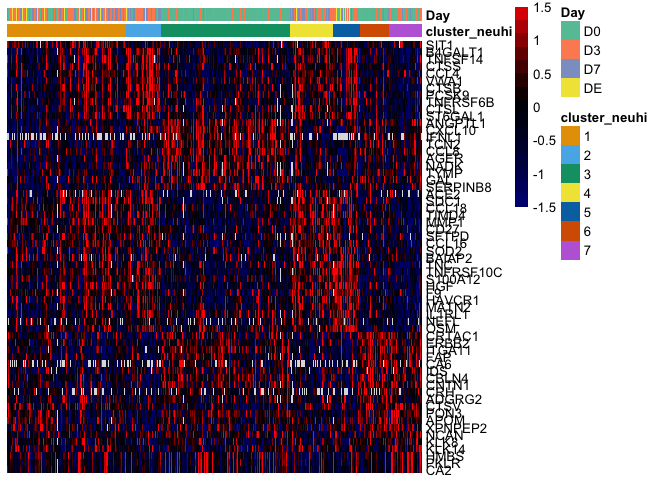<!-- -->

``` r
nmf1 <- negmarkergenesordered[negmarkergenesordered$cluster == "NMF1",]
genes1 <- nmf1$OID[1:10]
nmf2 <- negmarkergenesordered[negmarkergenesordered$cluster == "NMF2",]
genes2 <- nmf2$OID[1:10]
nmf3 <- negmarkergenesordered[negmarkergenesordered$cluster == "NMF3",]
genes3 <- nmf3$OID[1:10]
nmf4 <- negmarkergenesordered[negmarkergenesordered$cluster == "NMF4",]
genes4 <- nmf4$OID[1:4]
nmf5 <- negmarkergenesordered[negmarkergenesordered$cluster == "NMF5",]
genes5 <- nmf5$OID[1:10]
nmf6 <- negmarkergenesordered[negmarkergenesordered$cluster == "NMF6",]
genes6 <- nmf6$OID[1:10]
nmf7 <- negmarkergenesordered[negmarkergenesordered$cluster == "NMF7",]
genes7 <- nmf7$OID[1:10]
uniquegenelist <- c(genes1,genes2,genes3,genes4,genes5,genes6,genes7)

df.select.temp <- df.select[order(df.select$cluster_neuhi),]
df.nmfmarkers <- df.select.temp[,colnames(df.select.temp) %in% uniquegenelist]
df.nmfmarkers <- df.nmfmarkers[,(uniquegenelist)]

my_gene_col <- df.select.temp[,colnames(df.select.temp) %in% c("Day","cluster_neuhi")]
my_gene_col$cluster_neuhi <- factor(my_gene_col$cluster_neuhi)
my_gene_col <- my_gene_col[,c(2,1)]

for (i in 1:ncol(df.nmfmarkers)){
  colnames(df.nmfmarkers)[i] <- uniprotOlink$Assay[which(uniprotOlink$OlinkID == colnames(df.nmfmarkers)[i])]
}

my.cols <- brewer.pal(3, "Set2")
ann_colors = list(
    Day = c("D0" = my.cols[1], "D3" = my.cols[2], "D7" = my.cols[3], "DE" = yellow),
    cluster_neuhi = c("1" = orange, "2" = skyblue, "3" = bluishgreen, "4" = yellow, "5" = blue, "6" = vermillion, "7" = "#bd6bd9")
)

breaksList = seq(-1.5, 1.5, by = 0.2)
colfunc <- colorRampPalette(c("navy","black","red"))
```

**Figure Not Included:**

``` r
pheatmap(t(df.nmfmarkers), show_colnames = FALSE, treeheight_col = 0, annotation_col = my_gene_col, annotation_colors = ann_colors, cluster_cols = FALSE, cluster_rows = FALSE, scale = "row", color=colfunc(length(breaksList)), breaks = breaksList)
```

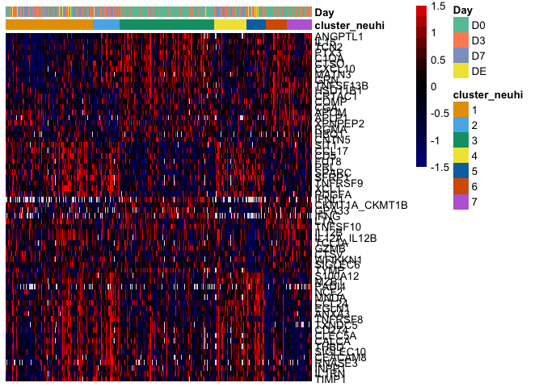<!-- -->

Let’s highlight the top protein marker for NMF5, which is TNC, and its
association with disease severity:

``` r
my.cols <- brewer.pal(3, "RdBu")
df.covid.w$Day <- factor(df.covid.w$Day)
df.covid.w$severity.max <- factor(df.covid.w$severity.max)
TNC_ID <- uniprotOlink$OlinkID[which(uniprotOlink$Assay == "TNC")]
p1 <- ggplot(df.covid.w[df.covid.w$COVID == "Positive" & df.covid.w$Day %in% c("D0","D3","D7"),], aes_string(x = "Day", y = TNC_ID, fill = "severity.max")) + geom_boxplot(outlier.shape = NA) + geom_point(position = position_jitterdodge(), alpha = 0.3) + theme_bw() + ylab("Normalized Protein Expression (NPX)") + xlab("Day") + scale_fill_manual(values = my.cols[c(3,1)]) + coord_fixed(ratio = .9) + stat_compare_means() + ggtitle("TNC")
p1$labels$fill <- "Severity Max"
```

**Figure Not Included:**

``` r
p1
```

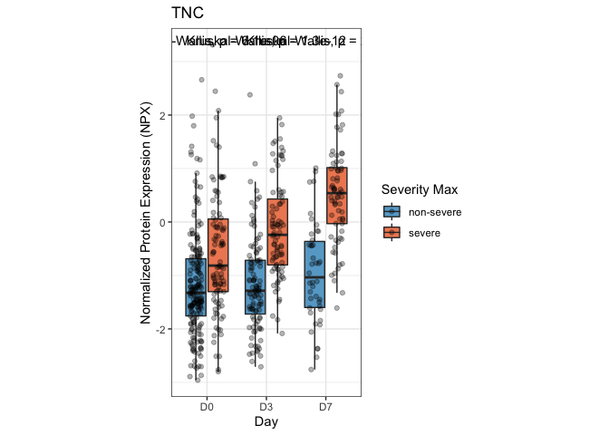<!-- -->

We can visualize the genes in volcano plots as well.

``` r
options(ggrepel.max.overlaps = Inf)

volcano1full <- volcano1full[,1:5]
volcano1full$label <- 0
volcano1full$label[volcano1full$protein %in% c("ANGPTL1","IL15","CSF3","IFNL1","C1QA","CXCL10","FURIN","CCL8","IL1RL1","IFNG","IL6","SIT1","CTSF","CD5","FCRL5","CCL24","GZMA","TNFRSF4","TNFRSF9","CCL13","SERPINA9")] <- 1

volcano2full <- volcano2full[,1:5]
volcano2full$label <- 0
volcano2full$label[volcano2full$protein %in% c("SFRP1","B4GALT1","TNFSF14","CTSS","CCL4","VWA1","CXCL16","TGFA","TNFRSF6B","HGF","SPP1","S100A12","CCL20","CCL3","IL6","THBS2","PON3","APLP1","KIT","CA6","TNFSF10","ITGA11","TNFSF11","CD1C","CRH","CLEC4C")] <- 1

volcano3full <- volcano3full[,1:5]
volcano3full$label <- 0
volcano3full$label[volcano3full$protein %in% c("IFNL1","ANGPTL1","CXCL10","C1QA","CSF3","TCN2","CCL8","ITGA11","AGER","IFNG","GRN","CA6","FCRL5","NRP1","SIT1","TNFRSF4","MMP1","SDC1","CCL17","CD5","CCL24","CCL13","CCL16")] <- 1

volcano4full <- volcano4full[,1:5]
volcano4full$label <- 0
volcano4full$label[volcano4full$protein %in% c("ACE2","MZB1","NRP1","SCARF1","CXCL17","SDC1","TIMP1","TIMD4","CCL18","SELP","TXNDC5","MMP1","TNFRSF10B","TNFRSF4","ITGA11","PON3","CA6","CSF3","IFNL1","IFNG","TNFSF10","FAP","CCL8","CD34","EPCAM","CXCL10","GZMB")] <- 1

volcano5full <- volcano5full[,1:5]
volcano5full$label <- 0
volcano5full$label[volcano5full$protein %in% c("LTA","TNFSF10","IL12B","CRH","TCL1A","GZMB","ITGA11","KIT","CLEC4C","TNFSF11","FAP","CXCL1","FASLG","CCL8","CD22","TNC","TNFRSF10C","S100A12","HGF","F9","HAVCR1","IL1RL1","OSM","CEACAM8","TGFA","CCL23","IGF1R","IL5RA","TNFRSF11B","SPON1","VNN2","IL1R2","DEFA1_DEFA1B","MMP8","TNFRSF10B","TGFB1","PADI4")] <- 1

volcano6full <- volcano6full[,1:5]
volcano6full$label <- 0
volcano6full$label[volcano6full$protein %in% c("CRTAC1","CA6","ERBB2","ITGA11","FAP","ADAMTS13","TNFSF10","CLEC4C","ICOSLG","APLP1","S100A12","MZB1","TNFRSF10C","CCL23","NOS3","CST7","TNFRSF10B","MMP8","ANXA3","CXCL13")] <- 1

volcano7full <- volcano7full[,1:5]
volcano7full$label <- 0
volcano7full$label[volcano7full$protein %in% c("CTSV","PON3","CLEC4C","APLP1","TNFSF10","CA6","MSTN","APOM","CD1C","XPNPEP2","CD274","CLEC5A","CEACAM8","THBD","IL1RN","TNFRSF10B","DEFA1_DEFA1B","IL1RL1","TNC","RNASE3")] <- 1

p1 <- ggplot(volcano1full, aes(x = lfc, y = -log10(pval))) + geom_point(data = subset(volcano1full, padj < 0.05 & lfc < 0), colour = "#ffe7b3") + geom_point(data = subset(volcano1full, padj > 0.05), colour = "grey") + geom_point(data = subset(volcano1full, padj < 0.05 & lfc > 0), colour = orange) + theme_bw() + geom_text_repel(data = subset(volcano1full, label == 1), aes(label = as.character(protein))) + ylab("-Log10(p-value)") + xlab("NPX Difference") + ggtitle("NMF1") + coord_fixed(ratio = .09)

p2 <- ggplot(volcano2full, aes(x = lfc, y = -log10(pval))) + geom_point(data = subset(volcano2full, padj < 0.05 & lfc < 0), colour = "#cce9f9") + geom_point(data = subset(volcano2full, padj > 0.05), colour = "grey") + geom_point(data = subset(volcano2full, padj < 0.05 & lfc > 0), colour = skyblue) + theme_bw() + geom_text_repel(data = subset(volcano2full, label == 1), aes(label = as.character(protein))) + ylab("-Log10(p-value)") + xlab("NPX Difference") + ggtitle("NMF2") + coord_fixed(ratio = .42)

p3 <- ggplot(volcano3full, aes(x = lfc, y = -log10(pval))) + geom_point(data = subset(volcano3full, padj < 0.05 & lfc < 0), colour = "#b2ded4") + geom_point(data = subset(volcano3full, padj > 0.05), colour = "grey") + geom_point(data = subset(volcano3full, padj < 0.05 & lfc > 0), colour = bluishgreen) + theme_bw() + geom_text_repel(data = subset(volcano3full, label == 1), aes(label = as.character(protein))) + ylab("-Log10(p-value)") + xlab("NPX Difference") + ggtitle("NMF3") + coord_fixed(ratio = .14)

p4 <- ggplot(volcano4full, aes(x = lfc, y = -log10(pval))) + geom_point(data = subset(volcano4full, padj < 0.05 & lfc < 0), colour = "#f9f8c7") + geom_point(data = subset(volcano4full, padj > 0.05), colour = "grey") + geom_point(data = subset(volcano4full, padj < 0.05 & lfc > 0), colour = yellow) + theme_bw() + geom_text_repel(data = subset(volcano4full, label == 1), aes(label = as.character(protein))) + ylab("-Log10(p-value)") + xlab("NPX Difference") + ggtitle("NMF4") + coord_fixed(ratio = .42)

p5 <- ggplot(volcano5full, aes(x = lfc, y = -log10(pval))) + geom_point(data = subset(volcano5full, padj < 0.05 & lfc < 0), colour = skyblue) + geom_point(data = subset(volcano5full, padj > 0.05), colour = "grey") + geom_point(data = subset(volcano5full, padj < 0.05 & lfc > 0), colour = blue) + theme_bw() + geom_text_repel(data = subset(volcano5full, label == 1), aes(label = as.character(protein))) + ylab("-Log10(p-value)") + xlab("NPX Difference") + ggtitle("NMF5") + coord_fixed(ratio = .42)

p6 <- ggplot(volcano6full, aes(x = lfc, y = -log10(pval))) + geom_point(data = subset(volcano6full, padj < 0.05 & lfc < 0), colour = "#eebe98") + geom_point(data = subset(volcano6full, padj > 0.05), colour = "grey") + geom_point(data = subset(volcano6full, padj < 0.05 & lfc > 0), colour = vermillion) + theme_bw() + geom_text_repel(data = subset(volcano6full, label == 1), aes(label = as.character(protein))) + ylab("-Log10(p-value)") + xlab("NPX Difference") + ggtitle("NMF6") + coord_fixed(ratio = .42)

p7 <- ggplot(volcano7full, aes(x = lfc, y = -log10(pval))) + geom_point(data = subset(volcano7full, padj < 0.05 & lfc < 0), colour = "#EBD2F3") + geom_point(data = subset(volcano7full, padj > 0.05), colour = "grey") + geom_point(data = subset(volcano7full, padj < 0.05 & lfc > 0), colour = "#bd6bd9") + theme_bw() + geom_text_repel(data = subset(volcano7full, label == 1), aes(label = as.character(protein))) + ylab("-Log10(p-value)") + xlab("NPX Difference") + ggtitle("Neu-Lo") + coord_fixed(ratio = .42)
```

**Figure 6B:**

``` r
p5
```

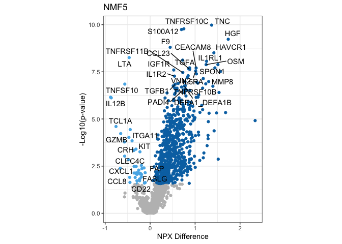<!-- -->

**Figures Not Included:**

``` r
p1
```

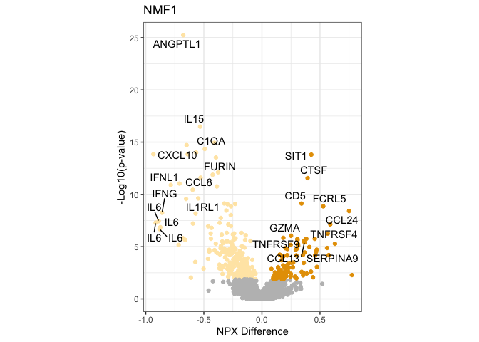<!-- -->

``` r
p2
```

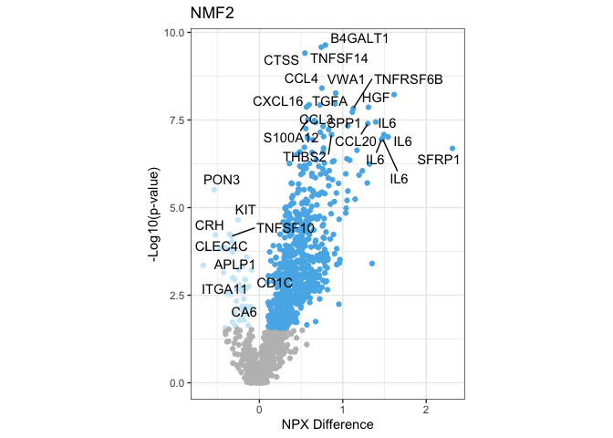<!-- -->

``` r
p3
```

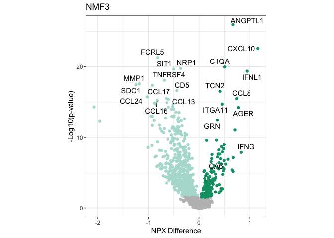<!-- -->

``` r
p4
```

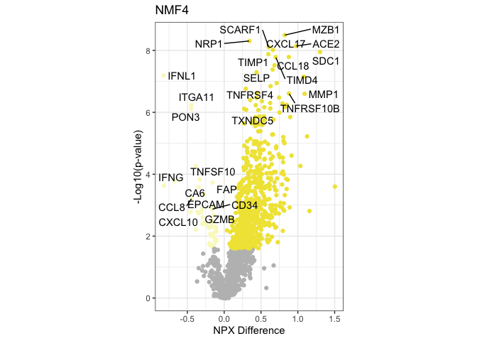<!-- -->

``` r
p6
```

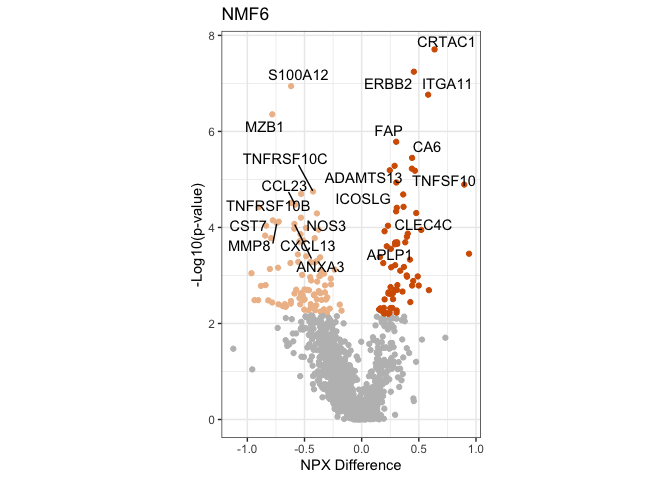<!-- -->

``` r
p7
```

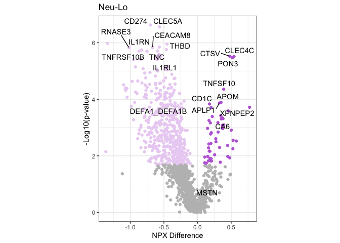<!-- -->

Next we want to compare fold-change values for proteins and RNA across
various conditions to infer whether the observed plasma protein levels
may be originating from neutrophils. For this analysis, we include
clinical attributes as covariates, and therefore due to IRB constraints
the analysis cannot be replicated here. We provide the code used to
generate the results and load them in from the supplementary tables.

``` r
source(paste0(prefix,"Neutrophil_DESeq2.R"))
```

First we do the COVID vs. non-COVID comparison.

``` r
# metadata_filtered$Public.Sample.ID <- metadata_filtered$Public.Sample.ID
# DESeq2_list <- Neutrophil_DESeq2(counts = Count_filtered, mdata = metadata_filtered, day = "D0")
# dds <- DESeqDataSetFromMatrix(countData = DESeq2_list$Count_select, colData = DESeq2_list$coldata, design = ~ Neutrophil_total + T_NK_factor + Monocyte_factor + IG_factor + Plasmablast_factor + Age + sex + ethnicity + Heart.condition + Diabetes + HTN + HLD + Lung.condition + Kidney.condition + Immuno + COVID)
# dds <- DESeq(dds)
# 
# res <- as.data.frame(results(dds, name="COVID_Positive_vs_Negative"))
# filenam <- "CLINICAL_Day0_COVID_negative_vs_positive_correct-NeuCont+TNK+Monocyte+Plasmablast+IG+CLINICAL"
# temp <- genepc[which(genepc$Gene.stable.ID %in% rownames(res)),]
# res$symbol <- matrix(0L, nrow = nrow(res))
# for (i in 1:nrow(res)){
#   if (rownames(res)[i] %in% temp$Gene.stable.ID){
#     res$symbol[i] <- temp$Gene.name[which(rownames(res)[i] == temp$Gene.stable.ID)]
#   } else {
#     res$symbol[i] <- rownames(res)[i]
#   }
# }
# res$rank <- sign(res$log2FoldChange)*(-1)*log10(res$pvalue)
# res <- res[complete.cases(res),]
# res_sig <- res[res$padj < 0.05,]

# df.select <- df.covid.w[df.covid.w$day == "D0",]
# df.select$COVID <- factor(df.select$COVID)
# 
# storage <- list()
# for(i in proteins){
#   storage[[i]] <- lm(get(i) ~ Age + sex + ethnicity + Heart.condition + Diabetes + HTN + HLD + Lung.condition + Kidney.condition + Immuno + COVID, df.select)
# }
# 
# volcano <- as.data.frame(matrix(0L, nrow = length(storage), ncol = 7))
# colnames(volcano) <- c("pval","lfc","padj","significance","label","rank","protein")
# rownames(volcano) <- proteins
# for (i in 1:nrow(volcano)){
#   volcano$pval[i] <- summary(storage[[i]])$coefficients[12,4]
#   volcano$lfc[i] <- mean(df.select[df.select$COVID == "Positive",colnames(df.select) == rownames(volcano)[i]], na.rm = TRUE) - mean(df.select[df.select$COVID == "Negative",colnames(df.select) == rownames(volcano)[i]], na.rm = TRUE)
#   volcano$protein[i] <- uniprotOlink$Assay[which(uniprotOlink$OlinkID == rownames(volcano)[i])]
# }
# volcano$padj <- p.adjust(volcano$pval, method = "fdr")
# volcano$significance <- as.numeric(volcano$padj < 0.05)
# volcano$rank <- -1*sign(volcano$lfc)*log10(volcano$pval)
# volcano <- volcano[rev(order(volcano$rank)),]

res <- read.xlsx(paste0(prefix,"Tables/TableS5.xlsx"), sheet = 10)
volcano <- read.xlsx(paste0(prefix,"Tables/TableS5.xlsx"), sheet = 14)

# Fix the labels on some of the Olink proteins which have underscores in the names
volcanomissingA <- volcano[grepl("_",volcano$protein),]
volcanomissingB <- volcano[grepl("_",volcano$protein),]
rownames(volcanomissingA) <- paste(rownames(volcanomissingA),"_A",sep = "")
rownames(volcanomissingB) <- paste(rownames(volcanomissingB),"_B",sep = "")
volcanomissingA$protein <- gsub("_.*","",volcanomissingA$protein)
volcanomissingB$protein <- gsub(".*_","",volcanomissingB$protein)
volcano <- volcano[!grepl("_",volcano$protein),]
volcano <- rbind(volcano, volcanomissingA, volcanomissingB)
plasmastats <- volcano

res <- res[which(res$symbol %in% plasmastats$protein),]
plasmastats <- plasmastats[which(plasmastats$protein %in% res$symbol),]
plasmastats <- plasmastats[-which(duplicated(plasmastats$protein)),]
res <- res[order(res$symbol),]
plasmastats <- plasmastats[order(plasmastats$protein),]
lfc <- as.data.frame(cbind(res$symbol,as.numeric(res$log2FoldChange),as.numeric(plasmastats$lfc)))
colnames(lfc) <- c("Symbol","RNA","Protein")

threshold <- log2(1.25)
my.cols <- brewer.pal(3,"RdBu")
lfc$positive <- matrix(0L, nrow = nrow(lfc), ncol = 1)
for (i in 1:nrow(lfc)){
  if (as.numeric(lfc$RNA[i]) > threshold & as.numeric(lfc$Protein[i]) > threshold){
    lfc$positive[i] <- 1
  }
  if (as.numeric(lfc$RNA[i]) < -1*threshold & as.numeric(lfc$Protein[i]) < -1*threshold){
    lfc$positive[i] <- 2
  }
}

my.cols <- brewer.pal(3,"Set2")
p1 <- ggplot(as.data.frame(lfc), aes(x = as.numeric(RNA), y = as.numeric(Protein), colour = factor(positive))) + geom_point() + xlab("RNA log2(fold-change)") + theme_bw() + ylab("Plasma log2(fold-change)") + ggtitle("COVID+ vs. COVID-") + scale_colour_manual(values = c("gray",my.cols[2], my.cols[1])) + geom_text_repel(data=subset(as.data.frame(lfc), as.numeric(RNA) > threshold + 0.25 & as.numeric(Protein) > threshold + 0.25), aes(as.numeric(RNA),as.numeric(Protein),label=Symbol), colour = "black") + coord_fixed(ratio = 1.2) + geom_segment(aes(x = threshold, xend = Inf, y = threshold, yend = threshold), linetype = "dashed", colour = "black") + geom_segment(aes(x = threshold, xend = threshold, y = threshold, yend = Inf), linetype = "dashed", colour = "black") + geom_segment(aes(x = -1*threshold, xend = -Inf, y = -1*threshold, yend = -1*threshold), linetype = "dashed", colour = "black") + geom_segment(aes(x = -1*threshold, xend = -1*threshold, y = -1*threshold, yend = -Inf), linetype = "dashed", colour = "black") + geom_text_repel(data=subset(as.data.frame(lfc), as.numeric(RNA) < -1*threshold - 0.25 & as.numeric(Protein) < -1*threshold - 0.25), aes(as.numeric(RNA),as.numeric(Protein),label=Symbol), colour = "black") + theme(legend.position = "none") + coord_fixed(ratio = 1.5)
```

**Figure 6C:**

``` r
p1
```

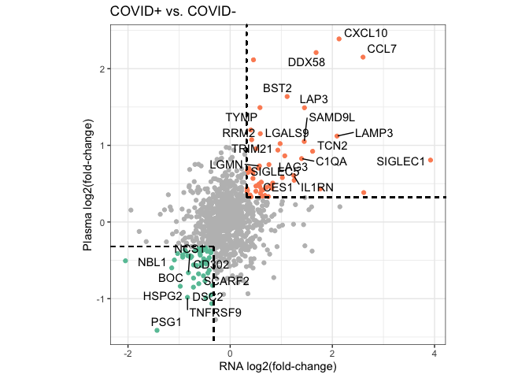<!-- -->

Next is severity on Day 0.

``` r
# metadata_filtered$Public.Sample.ID <- metadata_filtered$Public.Sample.ID
# DESeq2_list <- Neutrophil_DESeq2(counts = Count_filtered, mdata = metadata_filtered, day = "D0", covid = "Positive")
# dds <- DESeqDataSetFromMatrix(countData = DESeq2_list$Count_select, colData = DESeq2_list$coldata, design = ~ Neutrophil_total + T_NK_factor + Monocyte_factor + IG_factor + Plasmablast_factor + Age + sex + ethnicity + Heart.condition + Diabetes + HTN + HLD + Lung.condition + Kidney.condition + Immuno + severity.max)
# dds <- DESeq(dds)
# 
# res <- as.data.frame(results(dds, name="severity.max_non-severe_vs_severe"))
# filenam <- "CLINICAL_Day0_COVID+_severe_vs_non-severe_correct-NeuCont+TNK+Monocyte+Plasmablast+IG+CLINICAL"
# temp <- genepc[which(genepc$Gene.stable.ID %in% rownames(res)),]
# res$symbol <- matrix(0L, nrow = nrow(res))
# for (i in 1:nrow(res)){
#   if (rownames(res)[i] %in% temp$Gene.stable.ID){
#     res$symbol[i] <- temp$Gene.name[which(rownames(res)[i] == temp$Gene.stable.ID)]
#   } else {
#     res$symbol[i] <- rownames(res)[i]
#   }
# }
# res$rank <- sign(res$log2FoldChange)*(-1)*log10(res$pvalue)
# res <- res[complete.cases(res),]
# res_sig <- res[res$padj < 0.05,]

# df.select <- df.covid.w[df.covid.w$day == "D0" & df.covid.w$COVID == "Positive",]
# df.select$COVID <- factor(df.select$COVID)
# 
# storage <- list()
# for(i in proteins){
#   storage[[i]] <- lm(get(i) ~ Age + sex + ethnicity + Heart.condition + Diabetes + HTN + HLD + Lung.condition + Kidney.condition + Immuno + severity.max, df.select)
# }
# 
# volcano <- as.data.frame(matrix(0L, nrow = length(storage), ncol = 7))
# colnames(volcano) <- c("pval","lfc","padj","significance","label","rank","protein")
# rownames(volcano) <- proteins
# for (i in 1:nrow(volcano)){
#   volcano$pval[i] <- summary(storage[[i]])$coefficients[12,4]
#   volcano$lfc[i] <- mean(df.select[df.select$severity.max == "severe",colnames(df.select) == rownames(volcano)[i]], na.rm = TRUE) - mean(df.select[df.select$severity.max == "non-severe",colnames(df.select) == rownames(volcano)[i]], na.rm = TRUE)
#   volcano$protein[i] <- uniprotOlink$Assay[which(uniprotOlink$OlinkID == rownames(volcano)[i])]
# }
# volcano$padj <- p.adjust(volcano$pval, method = "fdr")
# volcano$significance <- as.numeric(volcano$padj < 0.05)
# volcano$rank <- -1*sign(volcano$lfc)*log10(volcano$pval)
# volcano <- volcano[rev(order(volcano$rank)),]

res <- read.xlsx(paste0(prefix,"Tables/TableS5.xlsx"), sheet = 11)
volcano <- read.xlsx(paste0(prefix,"Tables/TableS5.xlsx"), sheet = 15)

# Fix the labels on some of the Olink proteins which have underscores in the names
volcanomissingA <- volcano[grepl("_",volcano$protein),]
volcanomissingB <- volcano[grepl("_",volcano$protein),]
rownames(volcanomissingA) <- paste(rownames(volcanomissingA),"_A",sep = "")
rownames(volcanomissingB) <- paste(rownames(volcanomissingB),"_B",sep = "")
volcanomissingA$protein <- gsub("_.*","",volcanomissingA$protein)
volcanomissingB$protein <- gsub(".*_","",volcanomissingB$protein)
volcano <- volcano[!grepl("_",volcano$protein),]
volcano <- rbind(volcano, volcanomissingA, volcanomissingB)
plasmastats <- volcano

res <- res[which(res$symbol %in% plasmastats$protein),]
plasmastats <- plasmastats[which(plasmastats$protein %in% res$symbol),]
plasmastats <- plasmastats[-which(duplicated(plasmastats$protein)),]
res <- res[order(res$symbol),]
plasmastats <- plasmastats[order(plasmastats$protein),]
lfc <- as.data.frame(cbind(res$symbol,as.numeric(res$log2FoldChange),as.numeric(plasmastats$lfc)))
colnames(lfc) <- c("Symbol","RNA","Protein")

threshold <- log2(1.25)
my.cols <- brewer.pal(3,"RdBu")
lfc$positive <- matrix(0L, nrow = nrow(lfc), ncol = 1)
for (i in 1:nrow(lfc)){
  if (as.numeric(lfc$RNA[i]) > threshold & as.numeric(lfc$Protein[i]) > threshold){
    lfc$positive[i] <- 1
  }
  if (as.numeric(lfc$RNA[i]) < -1*threshold & as.numeric(lfc$Protein[i]) < -1*threshold){
    lfc$positive[i] <- 2
  }
}

my.cols <- brewer.pal(3,"RdBu")
p1 <- ggplot(as.data.frame(lfc), aes(x = as.numeric(RNA), y = as.numeric(Protein), colour = factor(positive))) + geom_point() + xlab("RNA log2(fold-change)") + theme_bw() + ylab("Plasma log2(fold-change)") + ggtitle("Day 0, COVID+") + scale_colour_manual(values = c("gray",my.cols[1], my.cols[3])) + geom_text_repel(data=subset(as.data.frame(lfc), as.numeric(RNA) > threshold & as.numeric(Protein) > threshold), aes(as.numeric(RNA),as.numeric(Protein),label=Symbol), colour = "black") + coord_fixed(ratio = 1.2) + geom_segment(aes(x = threshold, xend = Inf, y = threshold, yend = threshold), linetype = "dashed", colour = "black") + geom_segment(aes(x = threshold, xend = threshold, y = threshold, yend = Inf), linetype = "dashed", colour = "black") + geom_segment(aes(x = -1*threshold, xend = -Inf, y = -1*threshold, yend = -1*threshold), linetype = "dashed", colour = "black") + geom_segment(aes(x = -1*threshold, xend = -1*threshold, y = -1*threshold, yend = -Inf), linetype = "dashed", colour = "black") + geom_text_repel(data=subset(as.data.frame(lfc), as.numeric(RNA) < -1*threshold & as.numeric(Protein) < -1*threshold), aes(as.numeric(RNA),as.numeric(Protein),label=Symbol), colour = "black") + theme(legend.position = "none") + coord_fixed(ratio = 1.3)
```

**Figure 6D:**

``` r
p1
```

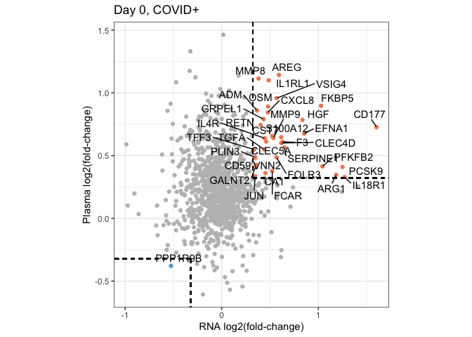<!-- -->

Next is severity on Day 3.

``` r
# metadata_filtered$Public.Sample.ID <- metadata_filtered$Public.Sample.ID
# DESeq2_list <- Neutrophil_DESeq2(counts = Count_filtered, mdata = metadata_filtered, day = "D3", covid = "Positive")
# dds <- DESeqDataSetFromMatrix(countData = DESeq2_list$Count_select, colData = DESeq2_list$coldata, design = ~ Neutrophil_total + T_NK_factor + Monocyte_factor + IG_factor + Plasmablast_factor + Age + sex + ethnicity + Heart.condition + Diabetes + HTN + HLD + Lung.condition + Kidney.condition + Immuno + severity.max)
# dds <- DESeq(dds)
# 
# res <- as.data.frame(results(dds, name="severity.max_non-severe_vs_severe"))
# filenam <- "CLINICAL_Day3_COVID+_severe_vs_non-severe_correct-NeuCont+TNK+Monocyte+Plasmablast+IG+CLINICAL"
# temp <- genepc[which(genepc$Gene.stable.ID %in% rownames(res)),]
# res$symbol <- matrix(0L, nrow = nrow(res))
# for (i in 1:nrow(res)){
#   if (rownames(res)[i] %in% temp$Gene.stable.ID){
#     res$symbol[i] <- temp$Gene.name[which(rownames(res)[i] == temp$Gene.stable.ID)]
#   } else {
#     res$symbol[i] <- rownames(res)[i]
#   }
# }
# res$rank <- sign(res$log2FoldChange)*(-1)*log10(res$pvalue)
# res <- res[complete.cases(res),]
# res_sig <- res[res$padj < 0.05,]

# df.select <- df.covid.w[df.covid.w$day == "D3" & df.covid.w$COVID == "Positive",]
# df.select$COVID <- factor(df.select$COVID)
# 
# storage <- list()
# for(i in proteins){
#   storage[[i]] <- lm(get(i) ~ Age + sex + ethnicity + Heart.condition + Diabetes + HTN + HLD + Lung.condition + Kidney.condition + Immuno + severity.max, df.select)
# }
# 
# volcano <- as.data.frame(matrix(0L, nrow = length(storage), ncol = 7))
# colnames(volcano) <- c("pval","lfc","padj","significance","label","rank","protein")
# rownames(volcano) <- proteins
# for (i in 1:nrow(volcano)){
#   volcano$pval[i] <- summary(storage[[i]])$coefficients[12,4]
#   volcano$lfc[i] <- mean(df.select[df.select$severity.max == "severe",colnames(df.select) == rownames(volcano)[i]], na.rm = TRUE) - mean(df.select[df.select$severity.max == "non-severe",colnames(df.select) == rownames(volcano)[i]], na.rm = TRUE)
#   volcano$protein[i] <- uniprotOlink$Assay[which(uniprotOlink$OlinkID == rownames(volcano)[i])]
# }
# volcano$padj <- p.adjust(volcano$pval, method = "fdr")
# volcano$significance <- as.numeric(volcano$padj < 0.05)
# volcano$rank <- -1*sign(volcano$lfc)*log10(volcano$pval)
# volcano <- volcano[rev(order(volcano$rank)),]

res <- read.xlsx(paste0(prefix,"Tables/TableS5.xlsx"), sheet = 12)
volcano <- read.xlsx(paste0(prefix,"Tables/TableS5.xlsx"), sheet = 16)

# Fix the labels on some of the Olink proteins which have underscores in the names
volcanomissingA <- volcano[grepl("_",volcano$protein),]
volcanomissingB <- volcano[grepl("_",volcano$protein),]
rownames(volcanomissingA) <- paste(rownames(volcanomissingA),"_A",sep = "")
rownames(volcanomissingB) <- paste(rownames(volcanomissingB),"_B",sep = "")
volcanomissingA$protein <- gsub("_.*","",volcanomissingA$protein)
volcanomissingB$protein <- gsub(".*_","",volcanomissingB$protein)
volcano <- volcano[!grepl("_",volcano$protein),]
volcano <- rbind(volcano, volcanomissingA, volcanomissingB)
plasmastats <- volcano

res <- res[which(res$symbol %in% plasmastats$protein),]
plasmastats <- plasmastats[which(plasmastats$protein %in% res$symbol),]
plasmastats <- plasmastats[-which(duplicated(plasmastats$protein)),]
res <- res[order(res$symbol),]
plasmastats <- plasmastats[order(plasmastats$protein),]
lfc <- as.data.frame(cbind(res$symbol,as.numeric(res$log2FoldChange),as.numeric(plasmastats$lfc)))
colnames(lfc) <- c("Symbol","RNA","Protein")

threshold <- log2(1.25)
my.cols <- brewer.pal(3,"RdBu")
lfc$positive <- matrix(0L, nrow = nrow(lfc), ncol = 1)
for (i in 1:nrow(lfc)){
  if (as.numeric(lfc$RNA[i]) > threshold & as.numeric(lfc$Protein[i]) > threshold){
    lfc$positive[i] <- 1
  }
  if (as.numeric(lfc$RNA[i]) < -1*threshold & as.numeric(lfc$Protein[i]) < -1*threshold){
    lfc$positive[i] <- 2
  }
}

my.cols <- brewer.pal(3,"RdBu")
p1 <- ggplot(as.data.frame(lfc), aes(x = as.numeric(RNA), y = as.numeric(Protein), colour = factor(positive))) + geom_point() + xlab("RNA log2(fold-change)") + theme_bw() + ylab("Plasma log2(fold-change)") + ggtitle("Day 3, COVID+") + scale_colour_manual(values = c("gray",my.cols[1], my.cols[3])) + geom_text_repel(data=subset(as.data.frame(lfc), as.numeric(RNA) > threshold + 0.25 & as.numeric(Protein) > threshold + 0.25), aes(as.numeric(RNA),as.numeric(Protein),label=Symbol), colour = "black") + coord_fixed(ratio = 1.2) + geom_segment(aes(x = threshold, xend = Inf, y = threshold, yend = threshold), linetype = "dashed", colour = "black") + geom_segment(aes(x = threshold, xend = threshold, y = threshold, yend = Inf), linetype = "dashed", colour = "black") + geom_segment(aes(x = -1*threshold, xend = -Inf, y = -1*threshold, yend = -1*threshold), linetype = "dashed", colour = "black") + geom_segment(aes(x = -1*threshold, xend = -1*threshold, y = -1*threshold, yend = -Inf), linetype = "dashed", colour = "black") + geom_text_repel(data=subset(as.data.frame(lfc), as.numeric(RNA) < -1*threshold - 0.25 & as.numeric(Protein) < -1*threshold - 0.25), aes(as.numeric(RNA),as.numeric(Protein),label=Symbol), colour = "black") + theme(legend.position = "none") + coord_fixed(ratio = 1.1)
```

**Figure Not Included:**

``` r
p1
```

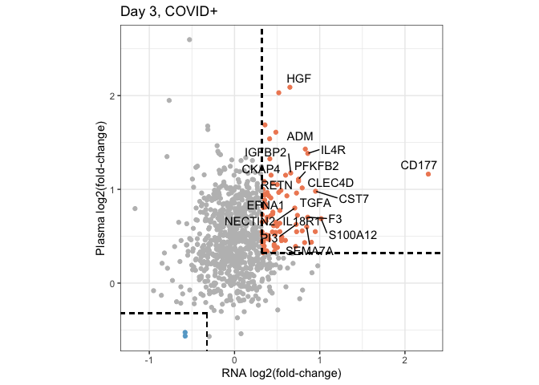<!-- -->

Finally, severity on Day 7.

``` r
# metadata_filtered$Public.Sample.ID <- metadata_filtered$Public.Sample.ID
# DESeq2_list <- Neutrophil_DESeq2(counts = Count_filtered, mdata = metadata_filtered, day = "D7", covid = "Positive")
# dds <- DESeqDataSetFromMatrix(countData = DESeq2_list$Count_select, colData = DESeq2_list$coldata, design = ~ Neutrophil_total + T_NK_factor + Monocyte_factor + IG_factor + Plasmablast_factor + Age + sex + ethnicity + Heart.condition + Diabetes + HTN + HLD + Lung.condition + Kidney.condition + Immuno + severity.max)
# dds <- DESeq(dds)
# 
# res <- as.data.frame(results(dds, name="severity.max_non-severe_vs_severe"))
# filenam <- "CLINICAL_Day7_COVID+_severe_vs_non-severe_correct-NeuCont+TNK+Monocyte+Plasmablast+IG+CLINICAL"
# temp <- genepc[which(genepc$Gene.stable.ID %in% rownames(res)),]
# res$symbol <- matrix(0L, nrow = nrow(res))
# for (i in 1:nrow(res)){
#   if (rownames(res)[i] %in% temp$Gene.stable.ID){
#     res$symbol[i] <- temp$Gene.name[which(rownames(res)[i] == temp$Gene.stable.ID)]
#   } else {
#     res$symbol[i] <- rownames(res)[i]
#   }
# }
# res$rank <- sign(res$log2FoldChange)*(-1)*log10(res$pvalue)
# res <- res[complete.cases(res),]
# res_sig <- res[res$padj < 0.05,]

# df.select <- df.covid.w[df.covid.w$day == "D7" & df.covid.w$COVID == "Positive",]
# df.select$COVID <- factor(df.select$COVID)
# 
# storage <- list()
# for(i in proteins){
#   storage[[i]] <- lm(get(i) ~ Age + sex + ethnicity + Heart.condition + Diabetes + HTN + HLD + Lung.condition + Kidney.condition + Immuno + severity.max, df.select)
# }
# 
# volcano <- as.data.frame(matrix(0L, nrow = length(storage), ncol = 7))
# colnames(volcano) <- c("pval","lfc","padj","significance","label","rank","protein")
# rownames(volcano) <- proteins
# for (i in 1:nrow(volcano)){
#   volcano$pval[i] <- summary(storage[[i]])$coefficients[12,4]
#   volcano$lfc[i] <- mean(df.select[df.select$severity.max == "severe",colnames(df.select) == rownames(volcano)[i]], na.rm = TRUE) - mean(df.select[df.select$severity.max == "non-severe",colnames(df.select) == rownames(volcano)[i]], na.rm = TRUE)
#   volcano$protein[i] <- uniprotOlink$Assay[which(uniprotOlink$OlinkID == rownames(volcano)[i])]
# }
# volcano$padj <- p.adjust(volcano$pval, method = "fdr")
# volcano$significance <- as.numeric(volcano$padj < 0.05)
# volcano$rank <- -1*sign(volcano$lfc)*log10(volcano$pval)
# volcano <- volcano[rev(order(volcano$rank)),]

res <- read.xlsx(paste0(prefix,"Tables/TableS5.xlsx"), sheet = 13)
volcano <- read.xlsx(paste0(prefix,"Tables/TableS5.xlsx"), sheet = 17)

# Fix the labels on some of the Olink proteins which have underscores in the names
volcanomissingA <- volcano[grepl("_",volcano$protein),]
volcanomissingB <- volcano[grepl("_",volcano$protein),]
rownames(volcanomissingA) <- paste(rownames(volcanomissingA),"_A",sep = "")
rownames(volcanomissingB) <- paste(rownames(volcanomissingB),"_B",sep = "")
volcanomissingA$protein <- gsub("_.*","",volcanomissingA$protein)
volcanomissingB$protein <- gsub(".*_","",volcanomissingB$protein)
volcano <- volcano[!grepl("_",volcano$protein),]
volcano <- rbind(volcano, volcanomissingA, volcanomissingB)
plasmastats <- volcano

res <- res[which(res$symbol %in% plasmastats$protein),]
plasmastats <- plasmastats[which(plasmastats$protein %in% res$symbol),]
plasmastats <- plasmastats[-which(duplicated(plasmastats$protein)),]
res <- res[order(res$symbol),]
plasmastats <- plasmastats[order(plasmastats$protein),]
lfc <- as.data.frame(cbind(res$symbol,as.numeric(res$log2FoldChange),as.numeric(plasmastats$lfc)))
colnames(lfc) <- c("Symbol","RNA","Protein")

threshold <- log2(1.25)
my.cols <- brewer.pal(3,"RdBu")
lfc$positive <- matrix(0L, nrow = nrow(lfc), ncol = 1)
for (i in 1:nrow(lfc)){
  if (as.numeric(lfc$RNA[i]) > threshold & as.numeric(lfc$Protein[i]) > threshold){
    lfc$positive[i] <- 1
  }
  if (as.numeric(lfc$RNA[i]) < -1*threshold & as.numeric(lfc$Protein[i]) < -1*threshold){
    lfc$positive[i] <- 2
  }
}

my.cols <- brewer.pal(3,"RdBu")
p1 <- ggplot(as.data.frame(lfc), aes(x = as.numeric(RNA), y = as.numeric(Protein), colour = factor(positive))) + geom_point() + xlab("RNA log2(fold-change)") + theme_bw() + ylab("Plasma log2(fold-change)") + ggtitle("Day 7, COVID+") + scale_colour_manual(values = c("gray",my.cols[1], my.cols[3])) + geom_text_repel(data=subset(as.data.frame(lfc), as.numeric(RNA) > threshold + 0.25 & as.numeric(Protein) > threshold + 0.25), aes(as.numeric(RNA),as.numeric(Protein),label=Symbol), colour = "black") + coord_fixed(ratio = 1.2) + geom_segment(aes(x = threshold, xend = Inf, y = threshold, yend = threshold), linetype = "dashed", colour = "black") + geom_segment(aes(x = threshold, xend = threshold, y = threshold, yend = Inf), linetype = "dashed", colour = "black") + geom_segment(aes(x = -1*threshold, xend = -Inf, y = -1*threshold, yend = -1*threshold), linetype = "dashed", colour = "black") + geom_segment(aes(x = -1*threshold, xend = -1*threshold, y = -1*threshold, yend = -Inf), linetype = "dashed", colour = "black") + geom_text_repel(data=subset(as.data.frame(lfc), as.numeric(RNA) < -1*threshold - 0.25 & as.numeric(Protein) < -1*threshold - 0.25), aes(as.numeric(RNA),as.numeric(Protein),label=Symbol), colour = "black") + theme(legend.position = "none") + coord_fixed(ratio = 1.2)
```

**Figure Not Included:**

``` r
p1
```

<!-- -->

Last, we search for proteins that are associated with having higher IgA
or IgG titers in plasma.

``` r
abratios <- read.xlsx(paste0(prefix,"Tables/TableS4.xlsx"), sheet = 3)
abratios$positiveG <- as.numeric(abratios$S_IgG1_IgA1 > 0)
abratios$positiveA <- as.numeric(abratios$S_IgG1_IgA1 < 0)*2
abratios$binary <- abratios$positiveG + abratios$positiveA
abratios$binary <- mapvalues(abratios$binary, from = c(0,1,2), to = c(NA,"IgG","IgA"))
abratios$binary[abratios$binary == 0] <- NA
abratios <- abratios[,colnames(abratios) %in% c("Public.Sample.ID", "binary")]

df.covid.w <- merge(x = df.covid.w, y = abratios, by = "Public.Sample.ID", all.x = TRUE, all.y = FALSE)
colnames(df.covid.w)[colnames(df.covid.w) == "Day.x"] <- "Day"
```

First, we take all COVID+ samples across all the days.

``` r
df.covid.w.select <- df.covid.w[df.covid.w$COVID == "Positive" & df.covid.w$Day %in% c("D0","D3","D7","DE"),]
storage <- list()
for(i in proteins){
  storage[[i]] <- wilcox.test(get(i) ~ factor(binary), df.covid.w.select)
}

volcano <- as.data.frame(matrix(0L, nrow = length(storage), ncol = 7))
colnames(volcano) <- c("pval","lfc","padj","significance","label","rank","protein")
rownames(volcano) <- proteins
for (i in 1:nrow(volcano)){
  volcano$pval[i] <- storage[[i]]$p.value
  volcano$lfc[i] <- mean(df.covid.w.select[df.covid.w.select$binary == "IgG",colnames(df.covid.w.select) == rownames(volcano)[i]], na.rm = TRUE) - mean(df.covid.w.select[df.covid.w.select$binary == "IgA",colnames(df.covid.w.select) == rownames(volcano)[i]], na.rm = TRUE)
  volcano$protein[i] <- uniprotOlink$Assay[which(uniprotOlink$OlinkID == rownames(volcano)[i])]
}
volcano$padj <- p.adjust(volcano$pval, method = "fdr")
volcano$significance <- as.numeric(volcano$padj < 0.05)
volcano$rank <- -1*sign(volcano$lfc)*log10(volcano$pval)
volcano <- volcano[rev(order(volcano$rank)),]
volcano$label <- as.numeric(volcano$protein %in% c("IFNL1","AGER","C1QA","ADGRE5","CXCL10","CCL8","ANGPTL1","CTSO","IFNG","CXCL8","CSF3","EPCAM","SDC1","BAIAP2","SELP","PDGFB","PDGFA","MMP1","CCL17","CCL4","ACE2","EGF","VEGFC","GZMA","CD63","MZB1"))

p1 <- ggplot(volcano, aes(x = lfc, y = -log10(pval))) + geom_point(data = subset(volcano, significance == 1 & lfc < 0), colour = yellow) + geom_point(data = subset(volcano, significance == 0), colour = "grey") + geom_point(data = subset(volcano, significance == 1 & lfc > 0), colour = "forestgreen") + theme_bw() + theme(panel.grid = element_blank()) + geom_text_repel(data = subset(volcano, label == 1), size = 3, aes(label = as.character(protein))) + ylab("-Log10(p-value)") + xlab("NPX Difference") + ggtitle("COVID+ S IgG1/IgA1") + coord_fixed(ratio = .11)
```

**Figure 6E:**

``` r
p1
```

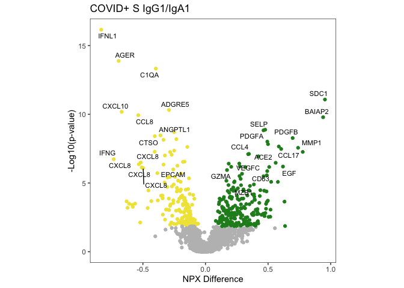<!-- -->

Then we do COVID+ Day 0.

``` r
df.covid.w.select <- df.covid.w[df.covid.w$COVID == "Positive" & df.covid.w$Day %in% c("D0"),]
storage <- list()
for(i in proteins){
  storage[[i]] <- wilcox.test(get(i) ~ factor(binary), df.covid.w.select)
}

volcano <- as.data.frame(matrix(0L, nrow = length(storage), ncol = 7))
colnames(volcano) <- c("pval","lfc","padj","significance","label","rank","protein")
rownames(volcano) <- proteins
for (i in 1:nrow(volcano)){
  volcano$pval[i] <- storage[[i]]$p.value
  volcano$lfc[i] <- mean(df.covid.w.select[df.covid.w.select$binary == "IgG",colnames(df.covid.w.select) == rownames(volcano)[i]], na.rm = TRUE) - mean(df.covid.w.select[df.covid.w.select$binary == "IgA",colnames(df.covid.w.select) == rownames(volcano)[i]], na.rm = TRUE)
  volcano$protein[i] <- uniprotOlink$Assay[which(uniprotOlink$OlinkID == rownames(volcano)[i])]
}
volcano$padj <- p.adjust(volcano$pval, method = "fdr")
volcano$significance <- as.numeric(volcano$padj < 0.05)
volcano$rank <- -1*sign(volcano$lfc)*log10(volcano$pval)
volcano <- volcano[rev(order(volcano$rank)),]
volcano$label <- volcano$significance

p1 <- ggplot(volcano, aes(x = lfc, y = -log10(pval))) + geom_point(data = subset(volcano, significance == 1 & lfc < 0), colour = yellow) + geom_point(data = subset(volcano, significance == 0), colour = "grey") + geom_point(data = subset(volcano, significance == 1 & lfc > 0), colour = "forestgreen") + theme_bw() + theme(panel.grid = element_blank()) + geom_text_repel(data = subset(volcano, label == 1), size = 3, aes(label = as.character(protein))) + ylab("-Log10(p-value)") + xlab("NPX Difference") + ggtitle("Day 0 COVID+") + coord_fixed(ratio = .28)
```

**Figure Not Included:**

``` r
p1
```

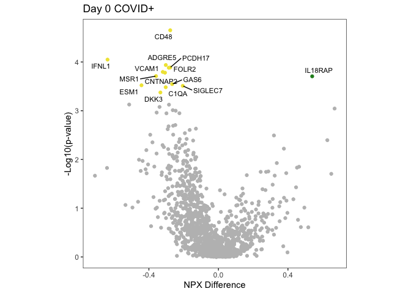<!-- -->

Then we do COVID+ Day 3.

``` r
df.covid.w.select <- df.covid.w[df.covid.w$COVID == "Positive" & df.covid.w$Day %in% c("D3"),]
storage <- list()
for(i in proteins){
  storage[[i]] <- wilcox.test(get(i) ~ factor(binary), df.covid.w.select)
}

volcano <- as.data.frame(matrix(0L, nrow = length(storage), ncol = 7))
colnames(volcano) <- c("pval","lfc","padj","significance","label","rank","protein")
rownames(volcano) <- proteins
for (i in 1:nrow(volcano)){
  volcano$pval[i] <- storage[[i]]$p.value
  volcano$lfc[i] <- mean(df.covid.w.select[df.covid.w.select$binary == "IgG",colnames(df.covid.w.select) == rownames(volcano)[i]], na.rm = TRUE) - mean(df.covid.w.select[df.covid.w.select$binary == "IgA",colnames(df.covid.w.select) == rownames(volcano)[i]], na.rm = TRUE)
  volcano$protein[i] <- uniprotOlink$Assay[which(uniprotOlink$OlinkID == rownames(volcano)[i])]
}
volcano$padj <- p.adjust(volcano$pval, method = "fdr")
volcano$significance <- as.numeric(volcano$padj < 0.05)
volcano$rank <- -1*sign(volcano$lfc)*log10(volcano$pval)
volcano <- volcano[rev(order(volcano$rank)),]
volcano$label <- volcano$significance

p1 <- ggplot(volcano, aes(x = lfc, y = -log10(pval))) + geom_point(data = subset(volcano, significance == 1 & lfc < 0), colour = yellow) + geom_point(data = subset(volcano, significance == 0), colour = "grey") + geom_point(data = subset(volcano, significance == 1 & lfc > 0), colour = "forestgreen") + theme_bw() + theme(panel.grid = element_blank()) + geom_text_repel(data = subset(volcano, label == 1), size = 3, aes(label = as.character(protein))) + ylab("-Log10(p-value)") + xlab("NPX Difference") + ggtitle("Day 3 COVID+") + coord_fixed(ratio = .45)
```

**Figure Not Included:**

``` r
p1
```

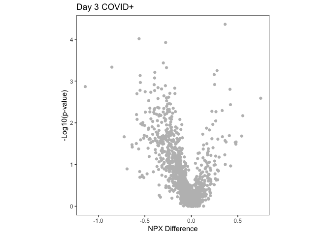<!-- -->

Finally we do COVID+ Day 7.

``` r
df.covid.w.select <- df.covid.w[df.covid.w$COVID == "Positive" & df.covid.w$Day %in% c("D7"),]
storage <- list()
for(i in proteins){
  storage[[i]] <- wilcox.test(get(i) ~ factor(binary), df.covid.w.select)
}

volcano <- as.data.frame(matrix(0L, nrow = length(storage), ncol = 7))
colnames(volcano) <- c("pval","lfc","padj","significance","label","rank","protein")
rownames(volcano) <- proteins
for (i in 1:nrow(volcano)){
  volcano$pval[i] <- storage[[i]]$p.value
  volcano$lfc[i] <- mean(df.covid.w.select[df.covid.w.select$binary == "IgG",colnames(df.covid.w.select) == rownames(volcano)[i]], na.rm = TRUE) - mean(df.covid.w.select[df.covid.w.select$binary == "IgA",colnames(df.covid.w.select) == rownames(volcano)[i]], na.rm = TRUE)
  volcano$protein[i] <- uniprotOlink$Assay[which(uniprotOlink$OlinkID == rownames(volcano)[i])]
}
volcano$padj <- p.adjust(volcano$pval, method = "fdr")
volcano$significance <- as.numeric(volcano$padj < 0.05)
volcano$rank <- -1*sign(volcano$lfc)*log10(volcano$pval)
volcano <- volcano[rev(order(volcano$rank)),]
volcano$label <- volcano$significance

p1 <- ggplot(volcano, aes(x = lfc, y = -log10(pval))) + geom_point(data = subset(volcano, significance == 1 & lfc < 0), colour = yellow) + geom_point(data = subset(volcano, significance == 0), colour = "grey") + geom_point(data = subset(volcano, significance == 1 & lfc > 0), colour = "forestgreen") + theme_bw() + theme(panel.grid = element_blank()) + geom_text_repel(data = subset(volcano, label == 1), size = 3, aes(label = as.character(protein))) + ylab("-Log10(p-value)") + xlab("NPX Difference") + ggtitle("Day 7 COVID+") + coord_fixed(ratio = .45)
```

**Figure Not Included:**

``` r
p1
```

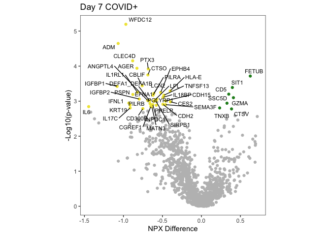<!-- -->

Last, we highlight specific proteins which show a significant difference
between IgA- or IgG-high titers among severe patients.

``` r
my.cols <- brewer.pal(3, "RdBu")
df.covid.w$binary <- factor(df.covid.w$binary, levels = c("IgG","IgA"))

IFNL1_ID <- uniprotOlink$OlinkID[which(uniprotOlink$Assay == "IFNL1")]
p1 <- ggplot(df.covid.w[df.covid.w$COVID == "Positive" & df.covid.w$Day %in% c("D0","D3","D7") & complete.cases(df.covid.w$binary) & df.covid.w$severity.max == "severe",], aes_string(x = "Day", y = IFNL1_ID, fill = "binary")) + geom_boxplot(outlier.shape = NA) + geom_point(position = position_jitterdodge(), alpha = 0.1) + theme_bw() + theme(panel.grid = element_blank(), legend.position = "none") + ylab("NPX") + xlab("Day") + scale_fill_manual(values = c("forestgreen",yellow)) + coord_fixed(ratio = .3) + stat_compare_means() + ggtitle("IFNL1")
p1$labels$fill <- "Binary"

AGER_ID <- uniprotOlink$OlinkID[which(uniprotOlink$Assay == "AGER")]
p2 <- ggplot(df.covid.w[df.covid.w$COVID == "Positive" & df.covid.w$Day %in% c("D0","D3","D7") & complete.cases(df.covid.w$binary) & df.covid.w$severity.max == "severe",], aes_string(x = "Day", y = AGER_ID, fill = "binary")) + geom_boxplot(outlier.shape = NA) + geom_point(position = position_jitterdodge(), alpha = 0.1) + theme_bw() + theme(panel.grid = element_blank(), legend.position = "none") + ylab("NPX") + xlab("Day") + scale_fill_manual(values = c("forestgreen",yellow)) + coord_fixed(ratio = .34) + stat_compare_means() + ggtitle("AGER")
p2$labels$fill <- "Binary"

FETUB_ID <- uniprotOlink$OlinkID[which(uniprotOlink$Assay == "FETUB")]
p3 <- ggplot(df.covid.w[df.covid.w$COVID == "Positive" & df.covid.w$Day %in% c("D0","D3","D7") & complete.cases(df.covid.w$binary) & df.covid.w$severity.max == "severe",], aes_string(x = "Day", y = FETUB_ID, fill = "binary")) + geom_boxplot(outlier.shape = NA) + geom_point(position = position_jitterdodge(), alpha = 0.1) + theme_bw() + theme(panel.grid = element_blank(), legend.position = "none") + ylab("NPX") + xlab("Day") + scale_fill_manual(values = c("forestgreen",yellow)) + coord_fixed(ratio = .42) + stat_compare_means() + ggtitle("FETUB")
p3$labels$fill <- "Binary"

CCL17_ID <- uniprotOlink$OlinkID[which(uniprotOlink$Assay == "CCL17")]
p4 <- ggplot(df.covid.w[df.covid.w$COVID == "Positive" & df.covid.w$Day %in% c("D0","D3","D7") & complete.cases(df.covid.w$binary) & df.covid.w$severity.max == "severe",], aes_string(x = "Day", y = CCL17_ID, fill = "binary")) + geom_boxplot(outlier.shape = NA) + geom_point(position = position_jitterdodge(), alpha = 0.1) + theme_bw() + theme(panel.grid = element_blank(), legend.position = "none") + ylab("NPX") + xlab("Day") + scale_fill_manual(values = c("forestgreen",yellow)) + coord_fixed(ratio = .25) + stat_compare_means() + ggtitle("CCL17")
p4$labels$fill <- "Binary"
```

**Figure 6F:**

``` r
plot_grid(p1,p3,p2,p4,ncol=2)
```

<!-- -->

``` r
sessionInfo()
```

    ## R version 4.2.0 (2022-04-22)
    ## Platform: x86_64-apple-darwin17.0 (64-bit)
    ## Running under: macOS Big Sur/Monterey 10.16
    ## 
    ## Matrix products: default
    ## BLAS:   /Library/Frameworks/R.framework/Versions/4.2/Resources/lib/libRblas.0.dylib
    ## LAPACK: /Library/Frameworks/R.framework/Versions/4.2/Resources/lib/libRlapack.dylib
    ## 
    ## locale:
    ## [1] en_US.UTF-8/en_US.UTF-8/en_US.UTF-8/C/en_US.UTF-8/en_US.UTF-8
    ## 
    ## attached base packages:
    ## [1] stats4    stats     graphics  grDevices utils     datasets  methods  
    ## [8] base     
    ## 
    ## other attached packages:
    ##  [1] stringr_1.4.1               DESeq2_1.36.0              
    ##  [3] SummarizedExperiment_1.26.1 Biobase_2.56.0             
    ##  [5] MatrixGenerics_1.8.1        matrixStats_0.62.0         
    ##  [7] GenomicRanges_1.48.0        GenomeInfoDb_1.32.3        
    ##  [9] IRanges_2.30.1              S4Vectors_0.34.0           
    ## [11] BiocGenerics_0.42.0         ggpubr_0.4.0               
    ## [13] pheatmap_1.0.12             reshape2_1.4.4             
    ## [15] cowplot_1.1.1               openxlsx_4.2.5             
    ## [17] dplyr_1.0.9                 plyr_1.8.7                 
    ## [19] RColorBrewer_1.1-3          ggrepel_0.9.1              
    ## [21] ggplot2_3.3.6               knitr_1.40                 
    ## 
    ## loaded via a namespace (and not attached):
    ##  [1] bitops_1.0-7           bit64_4.0.5            httr_1.4.4            
    ##  [4] tools_4.2.0            backports_1.4.1        utf8_1.2.2            
    ##  [7] R6_2.5.1               DBI_1.1.3              colorspace_2.0-3      
    ## [10] withr_2.5.0            tidyselect_1.1.2       bit_4.0.4             
    ## [13] compiler_4.2.0         cli_3.3.0              DelayedArray_0.22.0   
    ## [16] labeling_0.4.2         scales_1.2.1           genefilter_1.78.0     
    ## [19] digest_0.6.29          rmarkdown_2.16         XVector_0.36.0        
    ## [22] pkgconfig_2.0.3        htmltools_0.5.3        highr_0.9             
    ## [25] fastmap_1.1.0          rlang_1.0.4            rstudioapi_0.14       
    ## [28] RSQLite_2.2.16         farver_2.1.1           generics_0.1.3        
    ## [31] BiocParallel_1.30.3    zip_2.2.0              car_3.1-0             
    ## [34] RCurl_1.98-1.8         magrittr_2.0.3         GenomeInfoDbData_1.2.8
    ## [37] Matrix_1.4-1           Rcpp_1.0.9             munsell_0.5.0         
    ## [40] fansi_1.0.3            abind_1.4-5            lifecycle_1.0.1       
    ## [43] stringi_1.7.8          yaml_2.3.5             carData_3.0-5         
    ## [46] zlibbioc_1.42.0        grid_4.2.0             blob_1.2.3            
    ## [49] parallel_4.2.0         crayon_1.5.1           lattice_0.20-45       
    ## [52] Biostrings_2.64.1      splines_4.2.0          annotate_1.74.0       
    ## [55] KEGGREST_1.36.3        locfit_1.5-9.6         pillar_1.8.1          
    ## [58] ggsignif_0.6.3         geneplotter_1.74.0     codetools_0.2-18      
    ## [61] XML_3.99-0.10          glue_1.6.2             evaluate_0.16         
    ## [64] vctrs_0.4.1            png_0.1-7              gtable_0.3.0          
    ## [67] purrr_0.3.4            tidyr_1.2.0            assertthat_0.2.1      
    ## [70] cachem_1.0.6           xfun_0.32              xtable_1.8-4          
    ## [73] broom_1.0.0            rstatix_0.7.0          survival_3.4-0        
    ## [76] tibble_3.1.8           AnnotationDbi_1.58.0   memoise_2.0.1         
    ## [79] ellipsis_0.3.2
