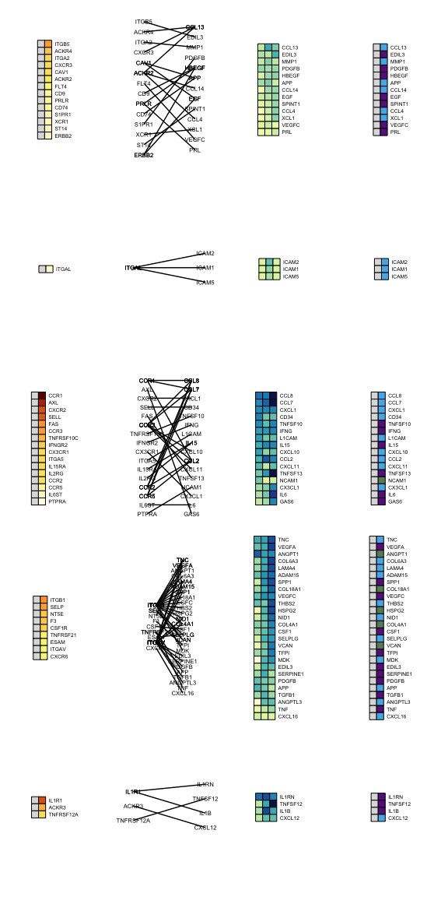
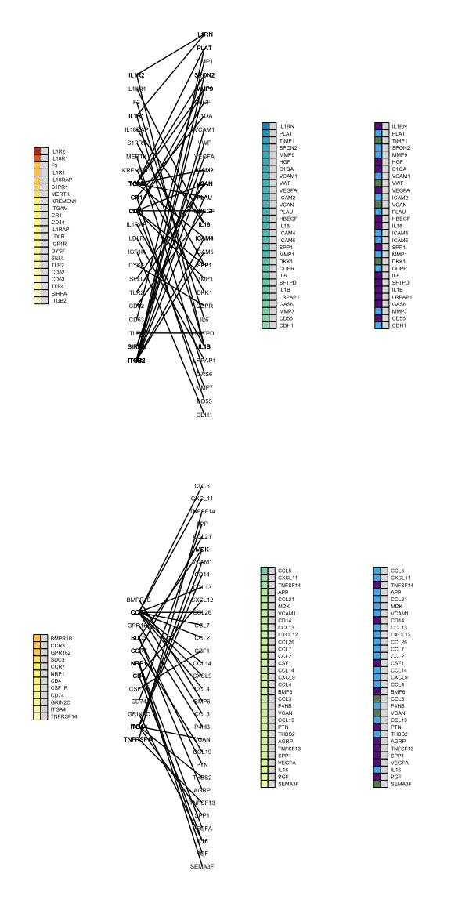
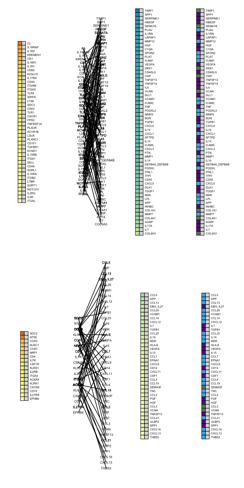
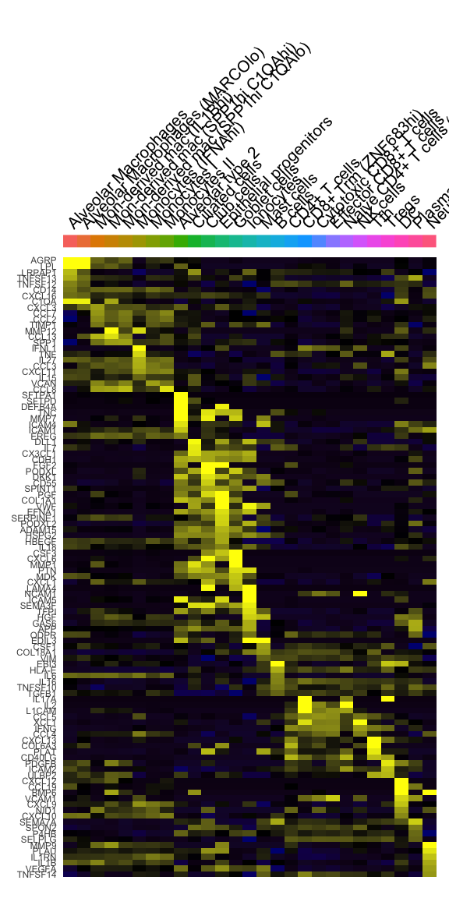
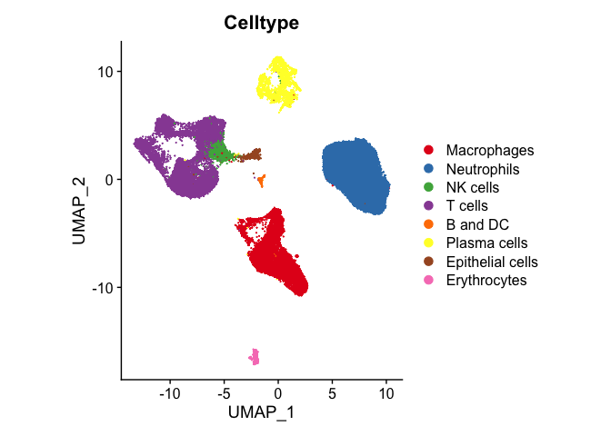
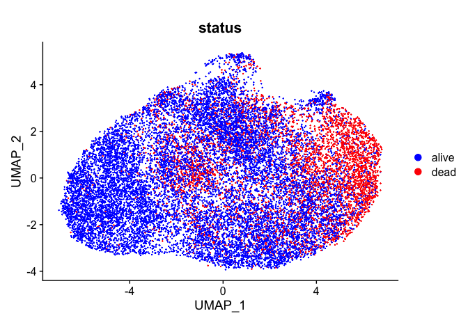
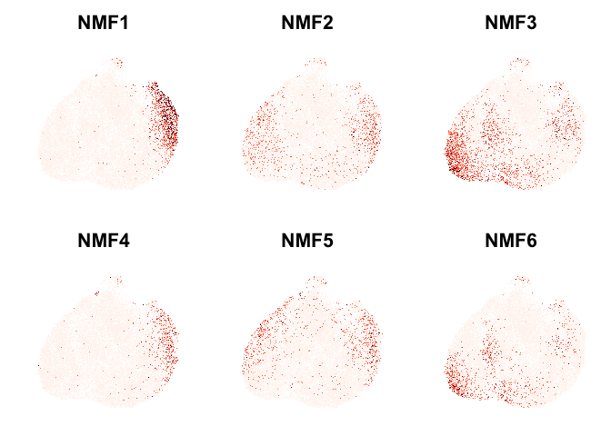
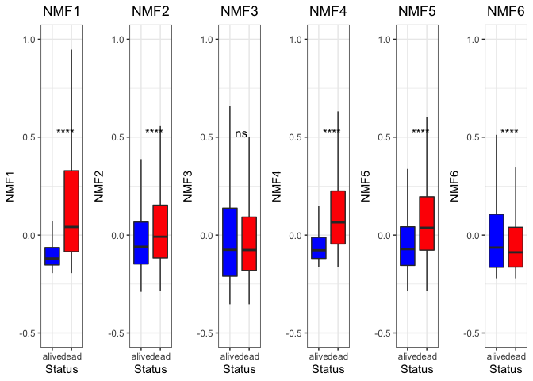

Figure7_S5-S7
================
Tom LaSalle

This document contains all the code necessary to generate the plots for
Figure 7 and related supplementary figures (S5-S7). Plots are
subsequently edited in Adobe Illustrator to produce the final figures.

Load the necessary libraries:

``` r
library(knitr)
library(ggplot2)
library(RColorBrewer)
library(plyr)
library(dplyr)
library(openxlsx)
library(cowplot)
library(pheatmap)
library(reshape2)
library(DESeq2)
```

    ## Warning: package 'IRanges' was built under R version 4.2.1

    ## Warning: package 'GenomeInfoDb' was built under R version 4.2.1

``` r
library(ggplotify)
library(Seurat)
library(batchelor)
library(fgsea)
library(stringr)
library(ggpubr)
library(gridExtra)
```

Load the neutrophil RNA-seq data, plasma proteomics data, and metadata:

``` r
prefix <- "~/Downloads/COVID19_Neutrophil_Code/" #Adapt as necessary
metadata_long <- read.xlsx(paste0(prefix,"Tables/TableS1.xlsx"), sheet = 4)
Count <- read.table(gzfile(paste0(prefix,"Neutrophil_RNAseq_Count_Matrix.txt.gz")),sep="\t")
colnames(Count) <- Count[1,]
Count <- Count[-1,]
Count <- Count[,-2]
rownames(Count) <- Count[,1]
nams <- Count[,1]
Count <- Count[,-1]
Count <- as.data.frame(apply(Count,2,as.numeric))
rownames(Count) <- nams
TPM <- read.table(gzfile(paste0(prefix,"Neutrophil_RNAseq_TPM_Matrix.txt.gz")),sep="\t")
colnames(TPM) <- TPM[1,]
TPM <- TPM[-1,]
TPM <- TPM[,-2]
rownames(TPM) <- TPM[,1]
nams <- TPM[,1]
TPM <- TPM[,-1]
TPM <- as.data.frame(apply(TPM,2,as.numeric))
rownames(TPM) <- nams
qc_data <- read.xlsx(paste0(prefix,"Tables/TableS1.xlsx"), sheet = 7)
genomic_signatures <- read.xlsx(paste0(prefix,"Tables/TableS1.xlsx"), sheet = 10)
genepc <- read.delim(paste0(prefix,"Ensembl_to_Symbol.txt"))
logTPM <- log2(TPM + 1)

metadata_long <- metadata_long[which(metadata_long$Public.ID %in% qc_data$Public.ID),]
metadata_long <- merge(metadata_long, qc_data)
rownames(metadata_long) <- metadata_long$Public.Sample.ID

metadata_filtered <- metadata_long[metadata_long$percent.mt < 20 & metadata_long$Genes.Detected > 10000 & metadata_long$Median.Exon.CV < 1 & metadata_long$Exon.CV.MAD < 0.75 & metadata_long$Exonic.Rate*100 > 25 & metadata_long$Median.3..bias < 0.9,]

logTPM_filtered <- logTPM[,colnames(logTPM) %in% metadata_filtered$Public.Sample.ID]
TPM_filtered <- TPM[,colnames(TPM) %in% metadata_filtered$Public.Sample.ID]
Count_filtered <- Count[,colnames(Count) %in% metadata_filtered$Public.Sample.ID]

tf <- rowSums(TPM_filtered > 0.1) > ncol(TPM_filtered)*.2
TPM_filtered <- TPM_filtered[tf,]
Count_filtered <- Count_filtered[tf,]
logTPM_filtered <- logTPM_filtered[tf,]
tf <- rowSums(Count_filtered >= 6) > ncol(Count_filtered)*.2
TPM_filtered <- TPM_filtered[tf,]
Count_filtered <- Count_filtered[tf,]
logTPM_filtered <- logTPM_filtered[tf,]

rownames(genomic_signatures) <- genomic_signatures$Public.Sample.ID
metadata_filtered <- merge(metadata_filtered, genomic_signatures)
metadata_filtered$Public.Sample.ID <- metadata_filtered$Public.Sample.ID
metadata_filtered$COVID <- mapvalues(metadata_filtered$COVID, from = c(0,1), to = c("Negative","Positive"))

# Color Palette
vermillion <- rgb(213,94,0,max=255)
bluishgreen <- rgb(0,158,115,max=255)
yellow <- rgb(240,228,66,max=255)
blue <- rgb(0,114,178,max=255)
orange <- rgb(230,159,0,max=255)
skyblue <- rgb(86,180,233,max=255)
lightgray <- rgb(211,211,211,max=255)

df.covid <- read.delim(paste0(prefix,"MGH_Olink_COVID_Apr_27_2021/MGH_COVID_OLINK_NPX.txt"), sep = ";")
df.covid$NPX[df.covid$NPX < df.covid$LOD] <- NA
df.covid$NPX[df.covid$QC_Warning == "WARN"] <- NA
df.covid$NPX[df.covid$Assay_Warning == "WARN"] <- NA
sample_to_exclude <- c("180_D0", "172_D7", "320_D7", "CONTROL_SAMPLE_AS-1", "CONTROL_SAMPLE_AS-2", "NEG_CTRL_EX_87009_A94102-1", "NEG_CTRL_EX_87009_A94102-2", "NEG_CTRL_EX_87009_A94102-3", "PLATE_CTRL_87010_B00202-1", "PLATE_CTRL_87010_B00202-2", "PLATE_CTRL_87010_B00202-3")
df.covid <- df.covid %>% filter(!(SampleID %in% sample_to_exclude)) %>% mutate(SampleID=as.character(SampleID))
OIDtoAssay <- unique(subset(df.covid, select=c('OlinkID', 'Assay')))
AssaytoPanel <- unique(subset(df.covid, select=c('Assay','Panel')))
uniprotOlink <- subset(df.covid, select=c('OlinkID', 'UniProt', 'Assay') )%>% unique()
#df.covid.w <- df.covid %>% subset(select=c('patient', 'day', 'OlinkID', 'NPX')) %>% dcast(patient + day ~ OlinkID, value.var="NPX", fun.aggregate=mean)
df.covid.w <- df.covid %>% subset(select=c('subject_id', 'Timepoint', 'OlinkID', 'NPX')) %>% dcast(subject_id + Timepoint ~ OlinkID, value.var="NPX", fun.aggregate=mean)
rownames(df.covid.w) <- paste(df.covid.w$subject_id,df.covid.w$Timepoint,sep = "_")
df.covid.w <- df.covid.w[rownames(df.covid.w) %in% metadata_filtered$Public.Sample.ID,]
nummissing <- matrix(0L, nrow = 1, ncol = ncol(df.covid.w))
for (i in 1:length(nummissing)){
  nummissing[i] <- sum(is.na(df.covid.w[,i]))/nrow(df.covid.w)*100
}
df.covid.w <- df.covid.w[,nummissing < 50]
df.covid.w$Public.Sample.ID <- rownames(df.covid.w)
colnames(df.covid.w)[colnames(df.covid.w) == "subject_id"] <- "Public.ID"
colnames(df.covid.w)[colnames(df.covid.w) == "Timepoint"] <- "Day"

df.covid.w <- merge(x = metadata_filtered, y = df.covid.w, by = "Public.Sample.ID", all.x = FALSE, all.y = TRUE)

df.covid.w <- df.covid.w[,!(colnames(df.covid.w) == c("Day.y","Public.ID.y"))]
colnames(df.covid.w)[colnames(df.covid.w) == "Day.x"] <- "Day"
colnames(df.covid.w)[colnames(df.covid.w) == "Public.ID.x"] <- "Public.ID"
```

In Figure 7 we search for potential interactions between neutrophil
receptors and plasma ligands to get a sense of what may be driving
neutrophil phenotypes and disease severity. We start with the NMF
analysis. We need lists of differentially expressed genes between
cluster *i* and all other clusters.

``` r
source(paste0(prefix,"Neutrophil_DESeq2.R"))
```

The following chunk is likely too computationally intensive to run
locally on most Macs, so we read in the results from the NMF
differential expression.

``` r
metadata_filtered$nmf1 <- factor(as.numeric(metadata_filtered$cluster_neuhi == 1))
metadata_filtered$nmf2 <- factor(as.numeric(metadata_filtered$cluster_neuhi == 2))
metadata_filtered$nmf3 <- factor(as.numeric(metadata_filtered$cluster_neuhi == 3))
metadata_filtered$nmf4 <- factor(as.numeric(metadata_filtered$cluster_neuhi == 4))
metadata_filtered$nmf5 <- factor(as.numeric(metadata_filtered$cluster_neuhi == 5))
metadata_filtered$nmf6 <- factor(as.numeric(metadata_filtered$cluster_neuhi == 6))
metadata_filtered$nmf7 <- factor(as.numeric(metadata_filtered$cluster_neuhi == 7))
rownames(metadata_filtered) <- metadata_filtered$sample_id

# DESeq2_list <- Neutrophil_DESeq2(counts = Count_filtered, mdata = metadata_filtered, covid = "Positive", day = c("D0","D3","D7","DE"))
# dds <- DESeqDataSetFromMatrix(countData = DESeq2_list$Count_select, colData = DESeq2_list$coldata, design = ~ Neutrophil_total + T_NK_factor + Monocyte_factor + IG_factor + Plasmablast_factor + nmf1)
# dds <- DESeq(dds)
# nmf1 <- as.data.frame(results(dds, name="nmf1_1_vs_0"))
# temp <- genepc[which(genepc$Gene.stable.ID %in% rownames(nmf1)),]
# nmf1$symbol <- matrix(0L, nrow = nrow(nmf1))
# for (i in 1:nrow(nmf1)){
#   if (rownames(nmf1)[i] %in% temp$Gene.stable.ID){
#     nmf1$symbol[i] <- temp$Gene.name[which(rownames(nmf1)[i] == temp$Gene.stable.ID)]
#   } else {
#     nmf1$symbol[i] <- rownames(nmf1)[i]
#   }
# }
# nmf1$rank <- sign(nmf1$log2FoldChange)*(-1)*log10(nmf1$pvalue)
# nmf1 <- nmf1[complete.cases(nmf1),]
# 
# DESeq2_list <- Neutrophil_DESeq2(counts = Count_filtered, mdata = metadata_filtered, covid = "Positive", day = c("D0","D3","D7","DE"))
# dds <- DESeqDataSetFromMatrix(countData = DESeq2_list$Count_select, colData = DESeq2_list$coldata, design = ~ Neutrophil_total + T_NK_factor + Monocyte_factor + IG_factor + Plasmablast_factor + nmf2)
# dds <- DESeq(dds)
# nmf2 <- as.data.frame(results(dds, name="nmf2_1_vs_0"))
# temp <- genepc[which(genepc$Gene.stable.ID %in% rownames(nmf2)),]
# nmf2$symbol <- matrix(0L, nrow = nrow(nmf2))
# for (i in 1:nrow(nmf2)){
#   if (rownames(nmf2)[i] %in% temp$Gene.stable.ID){
#     nmf2$symbol[i] <- temp$Gene.name[which(rownames(nmf2)[i] == temp$Gene.stable.ID)]
#   } else {
#     nmf2$symbol[i] <- rownames(nmf2)[i]
#   }
# }
# nmf2$rank <- sign(nmf2$log2FoldChange)*(-1)*log10(nmf2$pvalue)
# nmf2 <- nmf2[complete.cases(nmf2),]
# 
# DESeq2_list <- Neutrophil_DESeq2(counts = Count_filtered, mdata = metadata_filtered, covid = "Positive", day = c("D0","D3","D7","DE"))
# dds <- DESeqDataSetFromMatrix(countData = DESeq2_list$Count_select, colData = DESeq2_list$coldata, design = ~ Neutrophil_total + T_NK_factor + Monocyte_factor + IG_factor + Plasmablast_factor + nmf3)
# dds <- DESeq(dds)
# nmf3 <- as.data.frame(results(dds, name="nmf3_1_vs_0"))
# temp <- genepc[which(genepc$Gene.stable.ID %in% rownames(nmf3)),]
# nmf3$symbol <- matrix(0L, nrow = nrow(nmf3))
# for (i in 1:nrow(nmf3)){
#   if (rownames(nmf3)[i] %in% temp$Gene.stable.ID){
#     nmf3$symbol[i] <- temp$Gene.name[which(rownames(nmf3)[i] == temp$Gene.stable.ID)]
#   } else {
#     nmf3$symbol[i] <- rownames(nmf3)[i]
#   }
# }
# nmf3$rank <- sign(nmf3$log2FoldChange)*(-1)*log10(nmf3$pvalue)
# nmf3 <- nmf3[complete.cases(nmf3),]
# 
# DESeq2_list <- Neutrophil_DESeq2(counts = Count_filtered, mdata = metadata_filtered, covid = "Positive", day = c("D0","D3","D7","DE"))
# dds <- DESeqDataSetFromMatrix(countData = DESeq2_list$Count_select, colData = DESeq2_list$coldata, design = ~ Neutrophil_total + T_NK_factor + Monocyte_factor + IG_factor + Plasmablast_factor + nmf4)
# dds <- DESeq(dds)
# nmf4 <- as.data.frame(results(dds, name="nmf4_1_vs_0"))
# temp <- genepc[which(genepc$Gene.stable.ID %in% rownames(nmf4)),]
# nmf4$symbol <- matrix(0L, nrow = nrow(nmf4))
# for (i in 1:nrow(nmf4)){
#   if (rownames(nmf4)[i] %in% temp$Gene.stable.ID){
#     nmf4$symbol[i] <- temp$Gene.name[which(rownames(nmf4)[i] == temp$Gene.stable.ID)]
#   } else {
#     nmf4$symbol[i] <- rownames(nmf4)[i]
#   }
# }
# nmf4$rank <- sign(nmf4$log2FoldChange)*(-1)*log10(nmf4$pvalue)
# nmf4 <- nmf4[complete.cases(nmf4),]
# 
# DESeq2_list <- Neutrophil_DESeq2(counts = Count_filtered, mdata = metadata_filtered, covid = "Positive", day = c("D0","D3","D7","DE"))
# dds <- DESeqDataSetFromMatrix(countData = DESeq2_list$Count_select, colData = DESeq2_list$coldata, design = ~ Neutrophil_total + T_NK_factor + Monocyte_factor + IG_factor + Plasmablast_factor + nmf5)
# dds <- DESeq(dds)
# nmf5 <- as.data.frame(results(dds, name="nmf5_1_vs_0"))
# temp <- genepc[which(genepc$Gene.stable.ID %in% rownames(nmf5)),]
# nmf5$symbol <- matrix(0L, nrow = nrow(nmf5))
# for (i in 1:nrow(nmf5)){
#   if (rownames(nmf5)[i] %in% temp$Gene.stable.ID){
#     nmf5$symbol[i] <- temp$Gene.name[which(rownames(nmf5)[i] == temp$Gene.stable.ID)]
#   } else {
#     nmf5$symbol[i] <- rownames(nmf5)[i]
#   }
# }
# nmf5$rank <- sign(nmf5$log2FoldChange)*(-1)*log10(nmf5$pvalue)
# nmf5 <- nmf5[complete.cases(nmf5),]
# 
# DESeq2_list <- Neutrophil_DESeq2(counts = Count_filtered, mdata = metadata_filtered, covid = "Positive", day = c("D0","D3","D7","DE"))
# dds <- DESeqDataSetFromMatrix(countData = DESeq2_list$Count_select, colData = DESeq2_list$coldata, design = ~ Neutrophil_total + T_NK_factor + Monocyte_factor + IG_factor + Plasmablast_factor + nmf6)
# dds <- DESeq(dds)
# nmf6 <- as.data.frame(results(dds, name="nmf6_1_vs_0"))
# temp <- genepc[which(genepc$Gene.stable.ID %in% rownames(nmf6)),]
# nmf6$symbol <- matrix(0L, nrow = nrow(nmf6))
# for (i in 1:nrow(nmf6)){
#   if (rownames(nmf6)[i] %in% temp$Gene.stable.ID){
#     nmf6$symbol[i] <- temp$Gene.name[which(rownames(nmf6)[i] == temp$Gene.stable.ID)]
#   } else {
#     nmf6$symbol[i] <- rownames(nmf6)[i]
#   }
# }
# nmf6$rank <- sign(nmf6$log2FoldChange)*(-1)*log10(nmf6$pvalue)
# nmf6 <- nmf6[complete.cases(nmf6),]
# 
# DESeq2_list <- Neutrophil_DESeq2(counts = Count_filtered, mdata = metadata_filtered, covid = "Positive", day = c("D0","D3","D7","DE"))
# dds <- DESeqDataSetFromMatrix(countData = DESeq2_list$Count_select, colData = DESeq2_list$coldata, design = ~ Neutrophil_total + T_NK_factor + Monocyte_factor + IG_factor + Plasmablast_factor + nmf7)
# dds <- DESeq(dds)
# nmf7 <- as.data.frame(results(dds, name="nmf7_1_vs_0"))
# temp <- genepc[which(genepc$Gene.stable.ID %in% rownames(nmf7)),]
# nmf7$symbol <- matrix(0L, nrow = nrow(nmf7))
# for (i in 1:nrow(nmf7)){
#   if (rownames(nmf7)[i] %in% temp$Gene.stable.ID){
#     nmf7$symbol[i] <- temp$Gene.name[which(rownames(nmf7)[i] == temp$Gene.stable.ID)]
#   } else {
#     nmf7$symbol[i] <- rownames(nmf7)[i]
#   }
# }
# nmf7$rank <- sign(nmf7$log2FoldChange)*(-1)*log10(nmf7$pvalue)
# nmf7 <- nmf7[complete.cases(nmf7),]

nmf1 <- read.xlsx(paste0(prefix,"Tables/TableS5.xlsx"), sheet = 26)
colnames(nmf1)[colnames(nmf1) == "log2FoldChange_NMF1_others"] <- "log2FoldChange"
nmf2 <- read.xlsx(paste0(prefix,"Tables/TableS5.xlsx"), sheet = 27)
colnames(nmf2)[colnames(nmf2) == "log2FoldChange_NMF2_others"] <- "log2FoldChange"
nmf3 <- read.xlsx(paste0(prefix,"Tables/TableS5.xlsx"), sheet = 28)
colnames(nmf3)[colnames(nmf3) == "log2FoldChange_NMF3_others"] <- "log2FoldChange"
nmf4 <- read.xlsx(paste0(prefix,"Tables/TableS5.xlsx"), sheet = 29)
colnames(nmf4)[colnames(nmf4) == "log2FoldChange_NMF4_others"] <- "log2FoldChange"
nmf5 <- read.xlsx(paste0(prefix,"Tables/TableS5.xlsx"), sheet = 30)
colnames(nmf5)[colnames(nmf5) == "log2FoldChange_NMF5_others"] <- "log2FoldChange"
nmf6 <- read.xlsx(paste0(prefix,"Tables/TableS5.xlsx"), sheet = 31)
colnames(nmf6)[colnames(nmf6) == "log2FoldChange_NMF6_others"] <- "log2FoldChange"
nmf7 <- read.xlsx(paste0(prefix,"Tables/TableS5.xlsx"), sheet = 32)
colnames(nmf7)[colnames(nmf7) == "log2FoldChange_NMF7_others"] <- "log2FoldChange"
```

Next we read in the ligand-receptor database and filter the neutrophil
RNA differential expression lists by: 1) receptors according to the
FANTOM database, 2) \>0 expression in granulocytes according to the
Human Protein Atlas, 3) padj \< 0.05 and positively enriched in NMF
cluster *i* according to DESeq2, and 4) the receptor is unique to a
given cluster.

``` r
df.covid.select <- df.covid.w[df.covid.w$COVID == "Positive" & df.covid.w$Day %in% c("D0","D3","D7","DE"),]
logTPM_select <- logTPM_filtered[,which(colnames(logTPM_filtered) %in% df.covid.select$Public.Sample.ID),]
metadata_select <- metadata_filtered[metadata_filtered$Public.Sample.ID %in% colnames(logTPM_select),]

lrdatabase <- read.delim(paste0(prefix,"LR-database_fantom.txt"))
lrdatabase <- lrdatabase[lrdatabase$Pair.Evidence %in% c("literature supported","putative"),]
lrdatabase <- lrdatabase[,colnames(lrdatabase) %in% c("Pair.Name","Ligand.ApprovedSymbol","Receptor.ApprovedSymbol")]
colnames(lrdatabase) <- c("Pair.Name","Ligand","Receptor")
lrdatabase <- lrdatabase[lrdatabase$Ligand %in% c(uniprotOlink$Assay,"DEFA1","DEFA1B","MICB","MICA","CKMT1A","CKMT1B","FUT3","FUT5","EBI3","IL27","DEFB4A","DEFB4B","IL12A","IL12B","LGALS7","LGALS7B"),]

temp <- genepc[genepc$Gene.stable.ID %in% rownames(logTPM_select),]

hpa <- read.delim(paste0(prefix,"HPA_rna_consensus.tsv"))
hpa <- hpa[hpa$Tissue == "granulocytes",]
hpa0 <- hpa[hpa$NX == 0,]

nmf1 <- nmf1[rev(order(nmf1$rank)),]
nmf1 <- nmf1[nmf1$padj < 0.05 & nmf1$rank > 0,]
nmf1$cluster <- "NMF1"
nmf1 <- nmf1[nmf1$symbol %in% lrdatabase$Receptor,]
nmf2 <- nmf2[rev(order(nmf2$rank)),]
nmf2 <- nmf2[nmf2$padj < 0.05 & nmf2$rank > 0,]
nmf2$cluster <- "NMF2"
nmf2 <- nmf2[nmf2$symbol %in% lrdatabase$Receptor,]
nmf3 <- nmf3[rev(order(nmf3$rank)),]
nmf3 <- nmf3[nmf3$padj < 0.05 & nmf3$rank > 0,]
nmf3$cluster <- "NMF3"
nmf3 <- nmf3[nmf3$symbol %in% lrdatabase$Receptor,]
nmf4 <- nmf4[rev(order(nmf4$rank)),]
nmf4 <- nmf4[nmf4$padj < 0.05 & nmf4$rank > 0,]
nmf4$cluster <- "NMF4"
nmf4 <- nmf4[nmf4$symbol %in% lrdatabase$Receptor,]
nmf5 <- nmf5[rev(order(nmf5$rank)),]
nmf5 <- nmf5[nmf5$padj < 0.05 & nmf5$rank > 0,]
nmf5$cluster <- "NMF5"
nmf5 <- nmf5[nmf5$symbol %in% lrdatabase$Receptor,]
nmf6 <- nmf6[rev(order(nmf6$rank)),]
nmf6 <- nmf6[nmf6$padj < 0.05 & nmf6$rank > 0,]
nmf6$cluster <- "NMF6"
nmf6 <- nmf6[nmf6$symbol %in% lrdatabase$Receptor,]
nmf7 <- nmf7[rev(order(nmf7$rank)),]
nmf7 <- nmf7[nmf7$padj < 0.05 & nmf7$rank > 0,]
nmf7$cluster <- "NMF7"
nmf7 <- nmf7[nmf7$symbol %in% lrdatabase$Receptor,]

nmf1_unique <- nmf1[!(nmf1$symbol %in% rbind(nmf2,nmf3,nmf4,nmf5,nmf6,nmf7)$symbol),]
nmf1_interactions <- lrdatabase[lrdatabase$Receptor %in% nmf1_unique$symbol,]
nmf1_interactions <- nmf1_interactions[!(nmf1_interactions$Receptor %in% hpa0$Gene.name),]
nmf1_interactions$Ligand <- mapvalues(nmf1_interactions$Ligand, from = c("DEFA1","DEFA1B","MICB","MICA","CKMT1A","CKMT1B","FUT3","FUT5","EBI3","IL27","DEFB4A","DEFB4B","IL12A","IL12B","LGALS7","LGALS7B"), to = c("DEFA1_DEFA1B","DEFA1_DEFA1B","MICB_MICA","MICB_MICA","CKMT1A_CKMT1B","CKMT1A_CKMT1B","FUT3_FUT5","FUT3_FUT5","EBI3_IL27","EBI3_IL27","DEFB4A_DEFB4B","DEFB4A_DEFB4B","IL12A_IL12B","IL12A_IL12B","LGALS7_LGALS7B","LGALS7_LGALS7B"))
for (i in 1:nrow(nmf1_interactions)){
  nmf1_interactions$Ligand.ID[i] <- uniprotOlink$OlinkID[which(uniprotOlink$Assay == nmf1_interactions$Ligand[i])]
  nmf1_interactions$Receptor.ID[i] <- temp$Gene.stable.ID[which(temp$Gene.name == nmf1_interactions$Receptor[i])]
}

nmf2_unique <- nmf2[!(nmf2$symbol %in% rbind(nmf1,nmf3,nmf4,nmf5,nmf6,nmf7)$symbol),]
nmf2_interactions <- lrdatabase[lrdatabase$Receptor %in% nmf2_unique$symbol,]
nmf2_interactions <- nmf2_interactions[!(nmf2_interactions$Receptor %in% hpa0$Gene.name),]
nmf2_interactions$Ligand <- mapvalues(nmf2_interactions$Ligand, from = c("DEFA1","DEFA1B","MICB","MICA","CKMT1A","CKMT1B","FUT3","FUT5","EBI3","IL27","DEFB4A","DEFB4B","IL12A","IL12B","LGALS7","LGALS7B"), to = c("DEFA1_DEFA1B","DEFA1_DEFA1B","MICB_MICA","MICB_MICA","CKMT1A_CKMT1B","CKMT1A_CKMT1B","FUT3_FUT5","FUT3_FUT5","EBI3_IL27","EBI3_IL27","DEFB4A_DEFB4B","DEFB4A_DEFB4B","IL12A_IL12B","IL12A_IL12B","LGALS7_LGALS7B","LGALS7_LGALS7B"))
for (i in 1:nrow(nmf2_interactions)){
  nmf2_interactions$Ligand.ID[i] <- uniprotOlink$OlinkID[which(uniprotOlink$Assay == nmf2_interactions$Ligand[i])]
  nmf2_interactions$Receptor.ID[i] <- temp$Gene.stable.ID[which(temp$Gene.name == nmf2_interactions$Receptor[i])]
}

nmf3_unique <- nmf3[!(nmf3$symbol %in% rbind(nmf1,nmf2,nmf4,nmf5,nmf6,nmf7)$symbol),]
nmf3_interactions <- lrdatabase[lrdatabase$Receptor %in% nmf3_unique$symbol,]
nmf3_interactions <- nmf3_interactions[!(nmf3_interactions$Receptor %in% hpa0$Gene.name),]
nmf3_interactions$Ligand <- mapvalues(nmf3_interactions$Ligand, from = c("DEFA1","DEFA1B","MICB","MICA","CKMT1A","CKMT1B","FUT3","FUT5","EBI3","IL27","DEFB4A","DEFB4B","IL12A","IL12B","LGALS7","LGALS7B"), to = c("DEFA1_DEFA1B","DEFA1_DEFA1B","MICB_MICA","MICB_MICA","CKMT1A_CKMT1B","CKMT1A_CKMT1B","FUT3_FUT5","FUT3_FUT5","EBI3_IL27","EBI3_IL27","DEFB4A_DEFB4B","DEFB4A_DEFB4B","IL12A_IL12B","IL12A_IL12B","LGALS7_LGALS7B","LGALS7_LGALS7B"))
for (i in 1:nrow(nmf3_interactions)){
  nmf3_interactions$Ligand.ID[i] <- uniprotOlink$OlinkID[which(uniprotOlink$Assay == nmf3_interactions$Ligand[i])]
  nmf3_interactions$Receptor.ID[i] <- temp$Gene.stable.ID[which(temp$Gene.name == nmf3_interactions$Receptor[i])]
}

nmf4_unique <- nmf4[!(nmf4$symbol %in% rbind(nmf1,nmf2,nmf3,nmf5,nmf6,nmf7)$symbol),]
nmf4_interactions <- lrdatabase[lrdatabase$Receptor %in% nmf4_unique$symbol,]
nmf4_interactions <- nmf4_interactions[!(nmf4_interactions$Receptor %in% hpa0$Gene.name),]
nmf4_interactions$Ligand <- mapvalues(nmf4_interactions$Ligand, from = c("DEFA1","DEFA1B","MICB","MICA","CKMT1A","CKMT1B","FUT3","FUT5","EBI3","IL27","DEFB4A","DEFB4B","IL12A","IL12B","LGALS7","LGALS7B"), to = c("DEFA1_DEFA1B","DEFA1_DEFA1B","MICB_MICA","MICB_MICA","CKMT1A_CKMT1B","CKMT1A_CKMT1B","FUT3_FUT5","FUT3_FUT5","EBI3_IL27","EBI3_IL27","DEFB4A_DEFB4B","DEFB4A_DEFB4B","IL12A_IL12B","IL12A_IL12B","LGALS7_LGALS7B","LGALS7_LGALS7B"))
for (i in 1:nrow(nmf4_interactions)){
  nmf4_interactions$Ligand.ID[i] <- uniprotOlink$OlinkID[which(uniprotOlink$Assay == nmf4_interactions$Ligand[i])]
  nmf4_interactions$Receptor.ID[i] <- temp$Gene.stable.ID[which(temp$Gene.name == nmf4_interactions$Receptor[i])]
}

nmf5_unique <- nmf5[!(nmf5$symbol %in% rbind(nmf1,nmf2,nmf3,nmf4,nmf6,nmf7)$symbol),]
nmf5_interactions <- lrdatabase[lrdatabase$Receptor %in% nmf5_unique$symbol,]
nmf5_interactions <- nmf5_interactions[!(nmf5_interactions$Receptor %in% hpa0$Gene.name),]
nmf5_interactions$Ligand <- mapvalues(nmf5_interactions$Ligand, from = c("DEFA1","DEFA1B","MICB","MICA","CKMT1A","CKMT1B","FUT3","FUT5","EBI3","IL27","DEFB4A","DEFB4B","IL12A","IL12B","LGALS7","LGALS7B"), to = c("DEFA1_DEFA1B","DEFA1_DEFA1B","MICB_MICA","MICB_MICA","CKMT1A_CKMT1B","CKMT1A_CKMT1B","FUT3_FUT5","FUT3_FUT5","EBI3_IL27","EBI3_IL27","DEFB4A_DEFB4B","DEFB4A_DEFB4B","IL12A_IL12B","IL12A_IL12B","LGALS7_LGALS7B","LGALS7_LGALS7B"))
for (i in 1:nrow(nmf5_interactions)){
  nmf5_interactions$Ligand.ID[i] <- uniprotOlink$OlinkID[which(uniprotOlink$Assay == nmf5_interactions$Ligand[i])]
  nmf5_interactions$Receptor.ID[i] <- temp$Gene.stable.ID[which(temp$Gene.name == nmf5_interactions$Receptor[i])]
}

volcano1 <- read.xlsx(paste0(prefix,"Tables/TableS5.xlsx"), sheet = 3)
volcano1 <- volcano1[volcano1$rank > 0 & volcano1$padj < 0.05,]
nmf1_hits <- nmf1_interactions[nmf1_interactions$Ligand %in% volcano1$protein,]
nmf1_hits$NMF <- "NMF1"

volcano2 <- read.xlsx(paste0(prefix,"Tables/TableS5.xlsx"), sheet = 4)
volcano2 <- volcano2[volcano2$rank > 0 & volcano2$padj < 0.05,]
nmf2_hits <- nmf2_interactions[nmf2_interactions$Ligand %in% volcano2$protein,]
nmf2_hits$NMF <- "NMF2"

volcano3 <- read.xlsx(paste0(prefix,"Tables/TableS5.xlsx"), sheet = 5)
volcano3 <- volcano3[volcano3$rank > 0 & volcano3$padj < 0.05,]
nmf3_hits <- nmf3_interactions[nmf3_interactions$Ligand %in% volcano3$protein,]
nmf3_hits$NMF <- "NMF3"

volcano4 <- read.xlsx(paste0(prefix,"Tables/TableS5.xlsx"), sheet = 6)
volcano4 <- volcano4[volcano4$rank > 0 & volcano4$padj < 0.05,]
nmf4_hits <- nmf4_interactions[nmf4_interactions$Ligand %in% volcano4$protein,]
nmf4_hits$NMF <- "NMF4"

volcano5 <- read.xlsx(paste0(prefix,"Tables/TableS5.xlsx"), sheet = 7)
volcano5 <- volcano5[volcano5$rank > 0 & volcano5$padj < 0.05,]
nmf5_hits <- nmf5_interactions[nmf5_interactions$Ligand %in% volcano5$protein,]
nmf5_hits$NMF <- "NMF5"

interactions <- rbind(nmf1_hits,nmf2_hits,nmf3_hits,nmf4_hits,nmf5_hits)
```

The previous chunk gives a list of potential interactions per cluster
based on the differentially expressed neutrophil receptors in each. All
of the receptors for NMF6 and Neu-Lo have been filtered out. As for the
plasma ligands, the Olink protein values are reported in arbitrary units
of Normalized Protein Expression (NPX) and can only be analyzed in terms
of relative expression, not absolute values. Since it is unclear what
NPX would be necessary to trigger a given interaction, we simply present
all possible interactions with the differentially expressed receptors
and indicate the strength of interaction with receptor fold-changes and
ligand differential expression values.

``` r
logTPM_select_NMF1 <- logTPM_select[,colnames(logTPM_select) %in% (metadata_select$Public.Sample.ID[metadata_select$cluster_neuhi == 1])]
logTPM_select_NMF1_d0 <- logTPM_select[,colnames(logTPM_select) %in% (metadata_select$Public.Sample.ID[metadata_select$cluster_neuhi == 1 & metadata_select$Day == "D0"])]
logTPM_select_NMF1_d3 <- logTPM_select[,colnames(logTPM_select) %in% (metadata_select$Public.Sample.ID[metadata_select$cluster_neuhi == 1 & metadata_select$Day == "D3"])]
logTPM_select_NMF1_d7 <- logTPM_select[,colnames(logTPM_select) %in% (metadata_select$Public.Sample.ID[metadata_select$cluster_neuhi == 1 & metadata_select$Day == "D7"])]
logTPM_select_NMF2 <- logTPM_select[,colnames(logTPM_select) %in% (metadata_select$Public.Sample.ID[metadata_select$cluster_neuhi == 2])]
logTPM_select_NMF2_d0 <- logTPM_select[,colnames(logTPM_select) %in% (metadata_select$Public.Sample.ID[metadata_select$cluster_neuhi == 2 & metadata_select$Day == "D0"])]
logTPM_select_NMF2_d3 <- logTPM_select[,colnames(logTPM_select) %in% (metadata_select$Public.Sample.ID[metadata_select$cluster_neuhi == 2 & metadata_select$Day == "D3"])]
logTPM_select_NMF2_d7 <- logTPM_select[,colnames(logTPM_select) %in% (metadata_select$Public.Sample.ID[metadata_select$cluster_neuhi == 2 & metadata_select$Day == "D7"])]
logTPM_select_NMF3 <- logTPM_select[,colnames(logTPM_select) %in% (metadata_select$Public.Sample.ID[metadata_select$cluster_neuhi == 3])]
logTPM_select_NMF3_d0 <- logTPM_select[,colnames(logTPM_select) %in% (metadata_select$Public.Sample.ID[metadata_select$cluster_neuhi == 3 & metadata_select$Day == "D0"])]
logTPM_select_NMF3_d3 <- logTPM_select[,colnames(logTPM_select) %in% (metadata_select$Public.Sample.ID[metadata_select$cluster_neuhi == 3 & metadata_select$Day == "D3"])]
logTPM_select_NMF3_d7 <- logTPM_select[,colnames(logTPM_select) %in% (metadata_select$Public.Sample.ID[metadata_select$cluster_neuhi == 3 & metadata_select$Day == "D7"])]
logTPM_select_NMF4 <- logTPM_select[,colnames(logTPM_select) %in% (metadata_select$Public.Sample.ID[metadata_select$cluster_neuhi == 4])]
logTPM_select_NMF4_d0 <- logTPM_select[,colnames(logTPM_select) %in% (metadata_select$Public.Sample.ID[metadata_select$cluster_neuhi == 4 & metadata_select$Day == "D0"])]
logTPM_select_NMF4_d3 <- logTPM_select[,colnames(logTPM_select) %in% (metadata_select$Public.Sample.ID[metadata_select$cluster_neuhi == 4 & metadata_select$Day == "D3"])]
logTPM_select_NMF4_d7 <- logTPM_select[,colnames(logTPM_select) %in% (metadata_select$Public.Sample.ID[metadata_select$cluster_neuhi == 4 & metadata_select$Day == "D7"])]
logTPM_select_NMF5 <- logTPM_select[,colnames(logTPM_select) %in% (metadata_select$Public.Sample.ID[metadata_select$cluster_neuhi == 5])]
logTPM_select_NMF5_d0 <- logTPM_select[,colnames(logTPM_select) %in% (metadata_select$Public.Sample.ID[metadata_select$cluster_neuhi == 5 & metadata_select$Day == "D0"])]
logTPM_select_NMF5_d3 <- logTPM_select[,colnames(logTPM_select) %in% (metadata_select$Public.Sample.ID[metadata_select$cluster_neuhi == 5 & metadata_select$Day == "D3"])]
logTPM_select_NMF5_d7 <- logTPM_select[,colnames(logTPM_select) %in% (metadata_select$Public.Sample.ID[metadata_select$cluster_neuhi == 5 & metadata_select$Day == "D7"])]
logTPM_select_NMF6 <- logTPM_select[,colnames(logTPM_select) %in% (metadata_select$Public.Sample.ID[metadata_select$cluster_neuhi == 6])]
logTPM_select_NMF6_d0 <- logTPM_select[,colnames(logTPM_select) %in% (metadata_select$Public.Sample.ID[metadata_select$cluster_neuhi == 6 & metadata_select$Day == "D0"])]
logTPM_select_NMF6_d3 <- logTPM_select[,colnames(logTPM_select) %in% (metadata_select$Public.Sample.ID[metadata_select$cluster_neuhi == 6 & metadata_select$Day == "D3"])]
logTPM_select_NMF6_d7 <- logTPM_select[,colnames(logTPM_select) %in% (metadata_select$Public.Sample.ID[metadata_select$cluster_neuhi == 6 & metadata_select$Day == "D7"])]
logTPM_select_NMF7 <- logTPM_select[,colnames(logTPM_select) %in% (metadata_select$Public.Sample.ID[metadata_select$cluster_neuhi == 7])]
logTPM_select_NMF7_d0 <- logTPM_select[,colnames(logTPM_select) %in% (metadata_select$Public.Sample.ID[metadata_select$cluster_neuhi == 7 & metadata_select$Day == "D0"])]
logTPM_select_NMF7_d3 <- logTPM_select[,colnames(logTPM_select) %in% (metadata_select$Public.Sample.ID[metadata_select$cluster_neuhi == 7 & metadata_select$Day == "D3"])]
logTPM_select_NMF7_d7 <- logTPM_select[,colnames(logTPM_select) %in% (metadata_select$Public.Sample.ID[metadata_select$cluster_neuhi == 7 & metadata_select$Day == "D7"])]

df.covid.select.NMF1 <- df.covid.select[df.covid.select$cluster_neuhi == 1,]
df.covid.select.NMF1.d0 <- df.covid.select.NMF1[df.covid.select.NMF1$Day == "D0",]
df.covid.select.NMF1.d3 <- df.covid.select.NMF1[df.covid.select.NMF1$Day == "D3",]
df.covid.select.NMF1.d7 <- df.covid.select.NMF1[df.covid.select.NMF1$Day == "D7",]
df.covid.select.NMF2 <- df.covid.select[df.covid.select$cluster_neuhi == 2,]
df.covid.select.NMF2.d0 <- df.covid.select.NMF2[df.covid.select.NMF2$Day == "D0",]
df.covid.select.NMF2.d3 <- df.covid.select.NMF2[df.covid.select.NMF2$Day == "D3",]
df.covid.select.NMF2.d7 <- df.covid.select.NMF2[df.covid.select.NMF2$Day == "D7",]
df.covid.select.NMF3 <- df.covid.select[df.covid.select$cluster_neuhi == 3,]
df.covid.select.NMF3.d0 <- df.covid.select.NMF3[df.covid.select.NMF3$Day == "D0",]
df.covid.select.NMF3.d3 <- df.covid.select.NMF3[df.covid.select.NMF3$Day == "D3",]
df.covid.select.NMF3.d7 <- df.covid.select.NMF3[df.covid.select.NMF3$Day == "D7",]
df.covid.select.NMF4 <- df.covid.select[df.covid.select$cluster_neuhi == 4,]
df.covid.select.NMF4.d0 <- df.covid.select.NMF4[df.covid.select.NMF4$Day == "D0",]
df.covid.select.NMF4.d3 <- df.covid.select.NMF4[df.covid.select.NMF4$Day == "D3",]
df.covid.select.NMF4.d7 <- df.covid.select.NMF4[df.covid.select.NMF4$Day == "D7",]
df.covid.select.NMF5 <- df.covid.select[df.covid.select$cluster_neuhi == 5,]
df.covid.select.NMF5.d0 <- df.covid.select.NMF5[df.covid.select.NMF5$Day == "D0",]
df.covid.select.NMF5.d3 <- df.covid.select.NMF5[df.covid.select.NMF5$Day == "D3",]
df.covid.select.NMF5.d7 <- df.covid.select.NMF5[df.covid.select.NMF5$Day == "D7",]
df.covid.select.NMF6 <- df.covid.select[df.covid.select$cluster_neuhi == 6,]
df.covid.select.NMF6.d0 <- df.covid.select.NMF6[df.covid.select.NMF6$Day == "D0",]
df.covid.select.NMF6.d3 <- df.covid.select.NMF6[df.covid.select.NMF6$Day == "D3",]
df.covid.select.NMF6.d7 <- df.covid.select.NMF6[df.covid.select.NMF6$Day == "D7",]
df.covid.select.NMF7 <- df.covid.select[df.covid.select$cluster_neuhi == 7,]
df.covid.select.NMF7.d0 <- df.covid.select.NMF7[df.covid.select.NMF7$Day == "D0",]
df.covid.select.NMF7.d3 <- df.covid.select.NMF7[df.covid.select.NMF7$Day == "D3",]
df.covid.select.NMF7.d7 <- df.covid.select.NMF7[df.covid.select.NMF7$Day == "D7",]

rownames(nmf1_unique) <- nmf1_unique$Gene.ID
rownames(nmf2_unique) <- nmf2_unique$Gene.ID
rownames(nmf3_unique) <- nmf3_unique$Gene.ID
rownames(nmf4_unique) <- nmf4_unique$Gene.ID
rownames(nmf5_unique) <- nmf5_unique$Gene.ID

for (i in 1:nrow(interactions)){
  if (interactions$NMF[i] == "NMF1"){
    interactions$Receptor_LFC[i] <- nmf1_unique$log2FoldChange[which(rownames(nmf1_unique) == interactions$Receptor.ID[i])]
    meantpm <- mean(t(logTPM_select[which(rownames(logTPM_select) == interactions$Receptor.ID[i]),]))
    meannpx <- mean(df.covid.select[,which(colnames(df.covid.select) == interactions$Ligand.ID[i])], na.rm = TRUE)
    tpmtf <- as.numeric(logTPM_select_NMF1[which(rownames(logTPM_select) == interactions$Receptor.ID[i]),] > meantpm)
    npxtf <- as.numeric(df.covid.select.NMF1[,which(colnames(df.covid.select) == interactions$Ligand.ID[i])] > meannpx)
    combo <- tpmtf + npxtf
    interactions$Percentage[i] <- sum(combo == 2, na.rm = TRUE)/(length(combo) - sum(is.na(combo)))*100
    tpmtf0 <- as.numeric(logTPM_select_NMF1_d0[which(rownames(logTPM_select) == interactions$Receptor.ID[i]),] > meantpm)
    npxtf0 <- as.numeric(df.covid.select.NMF1.d0[,which(colnames(df.covid.select) == interactions$Ligand.ID[i])] > meannpx)
    combo0 <- tpmtf0 + npxtf0
    interactions$Day0Percentage[i] <- sum(combo0 == 2, na.rm = TRUE)/(length(combo0) - sum(is.na(combo0)))*100
    tpmtf3 <- as.numeric(logTPM_select_NMF1_d3[which(rownames(logTPM_select) == interactions$Receptor.ID[i]),] > meantpm)
    npxtf3 <- as.numeric(df.covid.select.NMF1.d3[,which(colnames(df.covid.select) == interactions$Ligand.ID[i])] > meannpx)
    combo3 <- tpmtf3 + npxtf3
    interactions$Day3Percentage[i] <- sum(combo3 == 2, na.rm = TRUE)/(length(combo3) - sum(is.na(combo3)))*100
    tpmtf7 <- as.numeric(logTPM_select_NMF1_d7[which(rownames(logTPM_select) == interactions$Receptor.ID[i]),] > meantpm)
    npxtf7 <- as.numeric(df.covid.select.NMF1.d7[,which(colnames(df.covid.select) == interactions$Ligand.ID[i])] > meannpx)
    combo7 <- tpmtf7 + npxtf7
    interactions$Day7Percentage[i] <- sum(combo7 == 2, na.rm = TRUE)/(length(combo7) - sum(is.na(combo7)))*100
  }
  if (interactions$NMF[i] == "NMF2"){
    interactions$Receptor_LFC[i] <- nmf2_unique$log2FoldChange[which(rownames(nmf2_unique) == interactions$Receptor.ID[i])]
    meantpm <- mean(t(logTPM_select[which(rownames(logTPM_select) == interactions$Receptor.ID[i]),]))
    meannpx <- mean(df.covid.select[,which(colnames(df.covid.select) == interactions$Ligand.ID[i])], na.rm = TRUE)
    tpmtf <- as.numeric(logTPM_select_NMF2[which(rownames(logTPM_select) == interactions$Receptor.ID[i]),] > meantpm)
    npxtf <- as.numeric(df.covid.select.NMF2[,which(colnames(df.covid.select) == interactions$Ligand.ID[i])] > meannpx)
    combo <- tpmtf + npxtf
    interactions$Percentage[i] <- sum(combo == 2, na.rm = TRUE)/(length(combo) - sum(is.na(combo)))*100
    tpmtf0 <- as.numeric(logTPM_select_NMF2_d0[which(rownames(logTPM_select) == interactions$Receptor.ID[i]),] > meantpm)
    npxtf0 <- as.numeric(df.covid.select.NMF2.d0[,which(colnames(df.covid.select) == interactions$Ligand.ID[i])] > meannpx)
    combo0 <- tpmtf0 + npxtf0
    interactions$Day0Percentage[i] <- sum(combo0 == 2, na.rm = TRUE)/(length(combo0) - sum(is.na(combo0)))*100
    tpmtf3 <- as.numeric(logTPM_select_NMF2_d3[which(rownames(logTPM_select) == interactions$Receptor.ID[i]),] > meantpm)
    npxtf3 <- as.numeric(df.covid.select.NMF2.d3[,which(colnames(df.covid.select) == interactions$Ligand.ID[i])] > meannpx)
    combo3 <- tpmtf3 + npxtf3
    interactions$Day3Percentage[i] <- sum(combo3 == 2, na.rm = TRUE)/(length(combo3) - sum(is.na(combo3)))*100
    tpmtf7 <- as.numeric(logTPM_select_NMF2_d7[which(rownames(logTPM_select) == interactions$Receptor.ID[i]),] > meantpm)
    npxtf7 <- as.numeric(df.covid.select.NMF2.d7[,which(colnames(df.covid.select) == interactions$Ligand.ID[i])] > meannpx)
    combo7 <- tpmtf7 + npxtf7
    interactions$Day7Percentage[i] <- sum(combo7 == 2, na.rm = TRUE)/(length(combo7) - sum(is.na(combo7)))*100
  }
  if (interactions$NMF[i] == "NMF3"){
    interactions$Receptor_LFC[i] <- nmf3_unique$log2FoldChange[which(rownames(nmf3_unique) == interactions$Receptor.ID[i])]
    meantpm <- mean(t(logTPM_select[which(rownames(logTPM_select) == interactions$Receptor.ID[i]),]))
    meannpx <- mean(df.covid.select[,which(colnames(df.covid.select) == interactions$Ligand.ID[i])], na.rm = TRUE)
    tpmtf <- as.numeric(logTPM_select_NMF3[which(rownames(logTPM_select) == interactions$Receptor.ID[i]),] > meantpm)
    npxtf <- as.numeric(df.covid.select.NMF3[,which(colnames(df.covid.select) == interactions$Ligand.ID[i])] > meannpx)
    combo <- tpmtf + npxtf
    interactions$Percentage[i] <- sum(combo == 2, na.rm = TRUE)/(length(combo) - sum(is.na(combo)))*100
    tpmtf0 <- as.numeric(logTPM_select_NMF3_d0[which(rownames(logTPM_select) == interactions$Receptor.ID[i]),] > meantpm)
    npxtf0 <- as.numeric(df.covid.select.NMF3.d0[,which(colnames(df.covid.select) == interactions$Ligand.ID[i])] > meannpx)
    combo0 <- tpmtf0 + npxtf0
    interactions$Day0Percentage[i] <- sum(combo0 == 2, na.rm = TRUE)/(length(combo0) - sum(is.na(combo0)))*100
    tpmtf3 <- as.numeric(logTPM_select_NMF3_d3[which(rownames(logTPM_select) == interactions$Receptor.ID[i]),] > meantpm)
    npxtf3 <- as.numeric(df.covid.select.NMF3.d3[,which(colnames(df.covid.select) == interactions$Ligand.ID[i])] > meannpx)
    combo3 <- tpmtf3 + npxtf3
    interactions$Day3Percentage[i] <- sum(combo3 == 2, na.rm = TRUE)/(length(combo3) - sum(is.na(combo3)))*100
    tpmtf7 <- as.numeric(logTPM_select_NMF3_d7[which(rownames(logTPM_select) == interactions$Receptor.ID[i]),] > meantpm)
    npxtf7 <- as.numeric(df.covid.select.NMF3.d7[,which(colnames(df.covid.select) == interactions$Ligand.ID[i])] > meannpx)
    combo7 <- tpmtf7 + npxtf7
    interactions$Day7Percentage[i] <- sum(combo7 == 2, na.rm = TRUE)/(length(combo7) - sum(is.na(combo7)))*100
  }
  if (interactions$NMF[i] == "NMF4"){
    interactions$Receptor_LFC[i] <- nmf4_unique$log2FoldChange[which(rownames(nmf4_unique) == interactions$Receptor.ID[i])]
    meantpm <- mean(t(logTPM_select[which(rownames(logTPM_select) == interactions$Receptor.ID[i]),]))
    meannpx <- mean(df.covid.select[,which(colnames(df.covid.select) == interactions$Ligand.ID[i])], na.rm = TRUE)
    tpmtf <- as.numeric(logTPM_select_NMF4[which(rownames(logTPM_select) == interactions$Receptor.ID[i]),] > meantpm)
    npxtf <- as.numeric(df.covid.select.NMF4[,which(colnames(df.covid.select) == interactions$Ligand.ID[i])] > meannpx)
    combo <- tpmtf + npxtf
    interactions$Percentage[i] <- sum(combo == 2, na.rm = TRUE)/(length(combo) - sum(is.na(combo)))*100
    tpmtf0 <- as.numeric(logTPM_select_NMF4_d0[which(rownames(logTPM_select) == interactions$Receptor.ID[i]),] > meantpm)
    npxtf0 <- as.numeric(df.covid.select.NMF4.d0[,which(colnames(df.covid.select) == interactions$Ligand.ID[i])] > meannpx)
    combo0 <- tpmtf0 + npxtf0
    interactions$Day0Percentage[i] <- sum(combo0 == 2, na.rm = TRUE)/(length(combo0) - sum(is.na(combo0)))*100
    tpmtf3 <- as.numeric(logTPM_select_NMF4_d3[which(rownames(logTPM_select) == interactions$Receptor.ID[i]),] > meantpm)
    npxtf3 <- as.numeric(df.covid.select.NMF4.d3[,which(colnames(df.covid.select) == interactions$Ligand.ID[i])] > meannpx)
    combo3 <- tpmtf3 + npxtf3
    interactions$Day3Percentage[i] <- sum(combo3 == 2, na.rm = TRUE)/(length(combo3) - sum(is.na(combo3)))*100
    tpmtf7 <- as.numeric(logTPM_select_NMF4_d7[which(rownames(logTPM_select) == interactions$Receptor.ID[i]),] > meantpm)
    npxtf7 <- as.numeric(df.covid.select.NMF4.d7[,which(colnames(df.covid.select) == interactions$Ligand.ID[i])] > meannpx)
    combo7 <- tpmtf7 + npxtf7
    interactions$Day7Percentage[i] <- sum(combo7 == 2, na.rm = TRUE)/(length(combo7) - sum(is.na(combo7)))*100
  }
  if (interactions$NMF[i] == "NMF5"){
    interactions$Receptor_LFC[i] <- nmf5_unique$log2FoldChange[which(rownames(nmf5_unique) == interactions$Receptor.ID[i])]
    meantpm <- mean(t(logTPM_select[which(rownames(logTPM_select) == interactions$Receptor.ID[i]),]))
    meannpx <- mean(df.covid.select[,which(colnames(df.covid.select) == interactions$Ligand.ID[i])], na.rm = TRUE)
    tpmtf <- as.numeric(logTPM_select_NMF5[which(rownames(logTPM_select) == interactions$Receptor.ID[i]),] > meantpm)
    npxtf <- as.numeric(df.covid.select.NMF5[,which(colnames(df.covid.select) == interactions$Ligand.ID[i])] > meannpx)
    combo <- tpmtf + npxtf
    interactions$Percentage[i] <- sum(combo == 2, na.rm = TRUE)/(length(combo) - sum(is.na(combo)))*100
    tpmtf0 <- as.numeric(logTPM_select_NMF5_d0[which(rownames(logTPM_select) == interactions$Receptor.ID[i]),] > meantpm)
    npxtf0 <- as.numeric(df.covid.select.NMF5.d0[,which(colnames(df.covid.select) == interactions$Ligand.ID[i])] > meannpx)
    combo0 <- tpmtf0 + npxtf0
    interactions$Day0Percentage[i] <- sum(combo0 == 2, na.rm = TRUE)/(length(combo0) - sum(is.na(combo0)))*100
    tpmtf3 <- as.numeric(logTPM_select_NMF5_d3[which(rownames(logTPM_select) == interactions$Receptor.ID[i]),] > meantpm)
    npxtf3 <- as.numeric(df.covid.select.NMF5.d3[,which(colnames(df.covid.select) == interactions$Ligand.ID[i])] > meannpx)
    combo3 <- tpmtf3 + npxtf3
    interactions$Day3Percentage[i] <- sum(combo3 == 2, na.rm = TRUE)/(length(combo3) - sum(is.na(combo3)))*100
    tpmtf7 <- as.numeric(logTPM_select_NMF5_d7[which(rownames(logTPM_select) == interactions$Receptor.ID[i]),] > meantpm)
    npxtf7 <- as.numeric(df.covid.select.NMF5.d7[,which(colnames(df.covid.select) == interactions$Ligand.ID[i])] > meannpx)
    combo7 <- tpmtf7 + npxtf7
    interactions$Day7Percentage[i] <- sum(combo7 == 2, na.rm = TRUE)/(length(combo7) - sum(is.na(combo7)))*100
  }
  if (interactions$NMF[i] == "NMF6"){
    interactions$Receptor_LFC[i] <- nmf6_unique$log2FoldChange[which(rownames(nmf6_unique) == interactions$Receptor.ID[i])]
    meantpm <- mean(t(logTPM_select[which(rownames(logTPM_select) == interactions$Receptor.ID[i]),]))
    meannpx <- mean(df.covid.select[,which(colnames(df.covid.select) == interactions$Ligand.ID[i])], na.rm = TRUE)
    tpmtf <- as.numeric(logTPM_select_NMF6[which(rownames(logTPM_select) == interactions$Receptor.ID[i]),] > meantpm)
    npxtf <- as.numeric(df.covid.select.NMF6[,which(colnames(df.covid.select) == interactions$Ligand.ID[i])] > meannpx)
    combo <- tpmtf + npxtf
    interactions$Percentage[i] <- sum(combo == 2, na.rm = TRUE)/(length(combo) - sum(is.na(combo)))*100
    tpmtf0 <- as.numeric(logTPM_select_NMF6_d0[which(rownames(logTPM_select) == interactions$Receptor.ID[i]),] > meantpm)
    npxtf0 <- as.numeric(df.covid.select.NMF6.d0[,which(colnames(df.covid.select) == interactions$Ligand.ID[i])] > meannpx)
    combo0 <- tpmtf0 + npxtf0
    interactions$Day0Percentage[i] <- sum(combo0 == 2, na.rm = TRUE)/(length(combo0) - sum(is.na(combo0)))*100
    tpmtf3 <- as.numeric(logTPM_select_NMF6_d3[which(rownames(logTPM_select) == interactions$Receptor.ID[i]),] > meantpm)
    npxtf3 <- as.numeric(df.covid.select.NMF6.d3[,which(colnames(df.covid.select) == interactions$Ligand.ID[i])] > meannpx)
    combo3 <- tpmtf3 + npxtf3
    interactions$Day3Percentage[i] <- sum(combo3 == 2, na.rm = TRUE)/(length(combo3) - sum(is.na(combo3)))*100
    tpmtf7 <- as.numeric(logTPM_select_NMF6_d7[which(rownames(logTPM_select) == interactions$Receptor.ID[i]),] > meantpm)
    npxtf7 <- as.numeric(df.covid.select.NMF6.d7[,which(colnames(df.covid.select) == interactions$Ligand.ID[i])] > meannpx)
    combo7 <- tpmtf7 + npxtf7
    interactions$Day7Percentage[i] <- sum(combo7 == 2, na.rm = TRUE)/(length(combo7) - sum(is.na(combo7)))*100
  }
  if (interactions$NMF[i] == "NMF7"){
    interactions$Receptor_LFC[i] <- nmf7_unique$log2FoldChange[which(rownames(nmf7_unique) == interactions$Receptor.ID[i])]
    meantpm <- mean(t(logTPM_select[which(rownames(logTPM_select) == interactions$Receptor.ID[i]),]))
    meannpx <- mean(df.covid.select[,which(colnames(df.covid.select) == interactions$Ligand.ID[i])], na.rm = TRUE)
    tpmtf <- as.numeric(logTPM_select_NMF7[which(rownames(logTPM_select) == interactions$Receptor.ID[i]),] > meantpm)
    npxtf <- as.numeric(df.covid.select.NMF7[,which(colnames(df.covid.select) == interactions$Ligand.ID[i])] > meannpx)
    combo <- tpmtf + npxtf
    interactions$Percentage[i] <- sum(combo == 2, na.rm = TRUE)/(length(combo) - sum(is.na(combo)))*100
    tpmtf0 <- as.numeric(logTPM_select_NMF7_d0[which(rownames(logTPM_select) == interactions$Receptor.ID[i]),] > meantpm)
    npxtf0 <- as.numeric(df.covid.select.NMF7.d0[,which(colnames(df.covid.select) == interactions$Ligand.ID[i])] > meannpx)
    combo0 <- tpmtf0 + npxtf0
    interactions$Day0Percentage[i] <- sum(combo0 == 2, na.rm = TRUE)/(length(combo0) - sum(is.na(combo0)))*100
    tpmtf3 <- as.numeric(logTPM_select_NMF7_d3[which(rownames(logTPM_select) == interactions$Receptor.ID[i]),] > meantpm)
    npxtf3 <- as.numeric(df.covid.select.NMF7.d3[,which(colnames(df.covid.select) == interactions$Ligand.ID[i])] > meannpx)
    combo3 <- tpmtf3 + npxtf3
    interactions$Day3Percentage[i] <- sum(combo3 == 2, na.rm = TRUE)/(length(combo3) - sum(is.na(combo3)))*100
    tpmtf7 <- as.numeric(logTPM_select_NMF7_d7[which(rownames(logTPM_select) == interactions$Receptor.ID[i]),] > meantpm)
    npxtf7 <- as.numeric(df.covid.select.NMF7.d7[,which(colnames(df.covid.select) == interactions$Ligand.ID[i])] > meannpx)
    combo7 <- tpmtf7 + npxtf7
    interactions$Day7Percentage[i] <- sum(combo7 == 2, na.rm = TRUE)/(length(combo7) - sum(is.na(combo7)))*100
  }
}

remove(logTPM_select_NMF1, logTPM_select_NMF1_d0, logTPM_select_NMF1_d3, logTPM_select_NMF1_d7, logTPM_select_NMF2, logTPM_select_NMF2_d0, logTPM_select_NMF2_d3, logTPM_select_NMF2_d7, logTPM_select_NMF3, logTPM_select_NMF3_d0, logTPM_select_NMF3_d3, logTPM_select_NMF3_d7, logTPM_select_NMF4, logTPM_select_NMF4_d0, logTPM_select_NMF4_d3, logTPM_select_NMF4_d7, logTPM_select_NMF5, logTPM_select_NMF5_d0, logTPM_select_NMF5_d3, logTPM_select_NMF5_d7, logTPM_select_NMF6, logTPM_select_NMF6_d0, logTPM_select_NMF6_d3, logTPM_select_NMF6_d7, logTPM_select_NMF7, logTPM_select_NMF7_d0, logTPM_select_NMF7_d3, logTPM_select_NMF7_d7, df.covid.select.NMF1, df.covid.select.NMF1.d0, df.covid.select.NMF1.d3, df.covid.select.NMF1.d7, df.covid.select.NMF2, df.covid.select.NMF2.d0, df.covid.select.NMF2.d3, df.covid.select.NMF2.d7, df.covid.select.NMF3, df.covid.select.NMF3.d0, df.covid.select.NMF3.d3, df.covid.select.NMF3.d7, df.covid.select.NMF4, df.covid.select.NMF4.d0, df.covid.select.NMF4.d3, df.covid.select.NMF4.d7, df.covid.select.NMF5, df.covid.select.NMF5.d0, df.covid.select.NMF5.d3, df.covid.select.NMF5.d7, df.covid.select.NMF6, df.covid.select.NMF6.d0, df.covid.select.NMF6.d3, df.covid.select.NMF6.d7, df.covid.select.NMF7, df.covid.select.NMF7.d0, df.covid.select.NMF7.d3, df.covid.select.NMF7.d7)
```

``` r
lrtypes <- read.xlsx(paste0(prefix,"LR_interaction_types_manual.xlsx"))

generateLRplot <- function(cluster,offset){
  storage <- list()
  
  nmfchoice <- cluster
  
  # Connecting lines

  nmf_interactions <- interactions[interactions$NMF == nmfchoice,]
  nmf_lines <- nmf_interactions[,colnames(nmf_interactions) %in% c("Pair.Name","Ligand","Receptor","Percentage","Receptor_LFC")]
  nmf_points <- as.data.frame(matrix(0L, nrow = 2*nrow(nmf_lines), ncol = 7))
  colnames(nmf_points) <- c("pair","ligand","receptor","percentage","xval","yval","LFC")
  nmf_points$pair <- rep(nmf_lines$Pair.Name, each = 2)
  nmf_points$ligand <- rep(nmf_lines$Ligand, each = 2)
  nmf_points$receptor <- rep(nmf_lines$Receptor, each = 2)
  nmf_points$percentage <- rep(nmf_lines$Percentage, each = 2)
  nmf_points$LFC <- rep(nmf_lines$LFC, each = 2)
  ligands <- unique(nmf_lines$Ligand[rev(order(nmf_lines$Percentage))])
  ligands <- as.data.frame(cbind(ligands,rev(1:length(ligands))))
  colnames(ligands) <- c("ligandname","ligandorder")
  receptors <- unique(nmf_lines$Receptor[rev(order(nmf_lines$Receptor_LFC))])
  receptors <- as.data.frame(cbind(receptors,rev(1:length(receptors))))
  colnames(receptors) <- c("receptorname","receptororder")

  nmf_points$xval <- rep(c(0,1),nrow(nmf_points)/2)
  for (i in seq(1,nrow(nmf_points),2)){
    nmf_points$yval[i] <- receptors$receptororder[which(receptors$receptorname == nmf_points$receptor[i])]
  }
  for (i in seq(2,nrow(nmf_points),2)){
    nmf_points$yval[i] <- ligands$ligandorder[which(ligands$ligandname == nmf_points$ligand[i])]
  }

  nmf_points$yval[seq(1,nrow(nmf_points),2)] <- as.numeric(nmf_points$yval[seq(1,nrow(nmf_points),2)]) + offset

  storage[[1]] <- as.ggplot(ggplot(nmf_points, aes(x = as.numeric(xval), y = as.numeric(yval))) + geom_line(aes(group = pair)) + theme_bw() + theme(panel.grid = element_blank(), axis.line = element_blank(), panel.border = element_blank(), axis.title = element_blank(), axis.ticks = element_blank(), axis.text = element_blank(), plot.margin = unit(c(1,1,1,1),"lines")) + coord_fixed(ratio = .2, clip = "off") + geom_text(data = subset(nmf_points, xval == "0"), aes(label = receptor), size = 2) + geom_text(data = subset(nmf_points, xval == "1"), aes(label = ligand), size = 2))

  # Ligand Heatmap

  heatdf <- interactions[interactions$NMF == nmfchoice,]
  heatdf <- heatdf[rev(order(heatdf$Percentage)),]
  if (sum(duplicated(heatdf$Ligand.ID)) > 0){
    heatdf <- heatdf[-which(duplicated(heatdf$Ligand.ID)),]
  }
  rownames(heatdf) <- heatdf$Ligand
  heatdf <- heatdf[,c(9,10,11)]
  breaksList = seq(0, 100, by = 0.25)
  storage[[2]] <- as.ggplot(pheatmap(as.matrix(heatdf), scale = "none", cluster_cols = FALSE, cluster_rows = FALSE, color = colorRampPalette(colors = c("#ffffd9","#edf8b1","#c7e9b4","#7fcdbb","#41b6c4","#1d91c0","#225ea8","#253494","#081d58"))(length(breaksList)), breaks = breaksList, cellwidth = 6.8, cellheight = 6.8, fontsize_row = 5, border_color = "black", legend = FALSE, show_colnames = FALSE))

  # Receptor Heatmap

  heatdf <- interactions[interactions$NMF == nmfchoice,]
  heatdf <- heatdf[rev(order(heatdf$Receptor_LFC)),]
  heatdf <- heatdf[-which(duplicated(heatdf$Receptor.ID)),]
  heatdf$dummy <- NA
  rownames(heatdf) <- heatdf$Receptor
  heatdf <- heatdf[,c(12,7)]
  breaksList = seq(0,2, by = 0.01)
  storage[[3]] <- as.ggplot(pheatmap(as.matrix(heatdf), scale = "none", cluster_cols = FALSE, cluster_rows = FALSE, color = colorRampPalette(colors = c("white","#f9f37c","#ff9b35","#bd370a","#5e0000"))(length(breaksList)), breaks = breaksList, cellwidth = 6.8, cellheight = 6.8, fontsize_row = 5, border_color = "black", legend = FALSE, show_colnames = FALSE))
  
  # Interaction Type
  heatdf <- interactions[interactions$NMF == nmfchoice,]
  heatdf <- heatdf[rev(order(heatdf$Percentage)),]
  if (sum(duplicated(heatdf$Ligand.ID)) > 0){
    heatdf <- heatdf[-which(duplicated(heatdf$Ligand.ID)),]
  }
  heatdf$dummy <- NA
  rownames(heatdf) <- heatdf$Ligand
  heatdf$type <- NA
  for (i in 1:nrow(heatdf)){
    heatdf$type[i] <- lrtypes$Interaction[(which(lrtypes$Pair.Name == heatdf$Pair.Name[i]))]
  }
  heatdf <- heatdf[,c(12,13)]
  heatdf$type <- mapvalues(heatdf$type, from = c("ChemoAdh","CytGro","Both"), to = c(1,2,3))
  breaksList = c(0,1,2,3)
  colors <- c(skyblue,"darkorchid4","darkseagreen4")
  heatdf[,2] <- as.numeric(heatdf[,2])
  storage[[4]] <- as.ggplot(pheatmap(as.matrix(heatdf), scale = "none", cluster_cols = FALSE, cluster_rows = FALSE, breaks = breaksList, color = colors, cellwidth = 6.8, cellheight = 6.8, fontsize_row = 5, border_color = "black", legend = FALSE, show_colnames = FALSE))
  
  return(storage)
}
```

``` r
lrplots1 <- generateLRplot("NMF1",offset=-0.5)
```

``` r
lrplots2 <- generateLRplot("NMF2",offset=1)
```

``` r
lrplots3 <- generateLRplot("NMF3",offset=0)
```

``` r
lrplots4 <- generateLRplot("NMF4",offset=8.5)
```

``` r
lrplots5 <- generateLRplot("NMF5",offset=0.5)
```

**Figure 7A (Without Cell-of-origin):**

``` r
plot_grid(lrplots1[[3]],lrplots1[[1]],lrplots1[[2]],lrplots1[[4]],lrplots2[[3]],lrplots2[[1]],lrplots2[[2]],lrplots2[[4]],lrplots3[[3]],lrplots3[[1]],lrplots3[[2]],lrplots3[[4]],lrplots4[[3]],lrplots4[[1]],lrplots4[[2]],lrplots4[[4]],lrplots5[[3]],lrplots5[[1]],lrplots5[[2]],lrplots5[[4]],ncol = 4)
```

<!-- -->

Then we repeat this analysis for severity on Days 0, 3, and 7
separately.

First is Day 0.

``` r
df.covid.select <- df.covid.w[df.covid.w$COVID == "Positive" & df.covid.w$Day %in% c("D0"),]
logTPM_select <- logTPM_filtered[,which(colnames(logTPM_filtered) %in% df.covid.select$Public.Sample.ID),]
metadata_select <- metadata_filtered[metadata_filtered$Public.Sample.ID %in% colnames(logTPM_select),]

lrdatabase <- read.delim(paste0(prefix,"LR-database_fantom.txt"))
lrdatabase <- lrdatabase[lrdatabase$Pair.Evidence %in% c("literature supported","putative"),]
lrdatabase <- lrdatabase[,colnames(lrdatabase) %in% c("Pair.Name","Ligand.ApprovedSymbol","Receptor.ApprovedSymbol")]
colnames(lrdatabase) <- c("Pair.Name","Ligand","Receptor")
lrdatabase <- lrdatabase[lrdatabase$Ligand %in% c(uniprotOlink$Assay,"DEFA1","DEFA1B","MICB","MICA","CKMT1A","CKMT1B","FUT3","FUT5","EBI3","IL27","DEFB4A","DEFB4B","IL12A","IL12B","LGALS7","LGALS7B"),]

res <- read.xlsx(paste0(prefix,"Tables/TableS2.xlsx"), sheet = 16)
res <- res[rev(order(res$rank)),]
severe <- res[res$padj < 0.05 & res$rank > 0,]
nonsevere <- res[res$padj < 0.05 & res$rank < 0,]
severe$cluster <- "severe"
severe <- severe[severe$symbol %in% lrdatabase$Receptor,]
nonsevere$cluster <- "nonsevere"
nonsevere <- nonsevere[nonsevere$symbol %in% lrdatabase$Receptor,]

severe_unique <- severe[!(severe$symbol %in% rbind(nonsevere)$symbol),]
severe_interactions <- lrdatabase[lrdatabase$Receptor %in% severe_unique$symbol,]
severe_interactions <- severe_interactions[!(severe_interactions$Receptor %in% hpa0$Gene.name),]
severe_interactions$Ligand <- mapvalues(severe_interactions$Ligand, from = c("DEFA1","DEFA1B","MICB","MICA","CKMT1A","CKMT1B","FUT3","FUT5","EBI3","IL27","DEFB4A","DEFB4B","IL12A","IL12B","LGALS7","LGALS7B"), to = c("DEFA1_DEFA1B","DEFA1_DEFA1B","MICB_MICA","MICB_MICA","CKMT1A_CKMT1B","CKMT1A_CKMT1B","FUT3_FUT5","FUT3_FUT5","EBI3_IL27","EBI3_IL27","DEFB4A_DEFB4B","DEFB4A_DEFB4B","IL12A_IL12B","IL12A_IL12B","LGALS7_LGALS7B","LGALS7_LGALS7B"))
for (i in 1:nrow(severe_interactions)){
  severe_interactions$Ligand.ID[i] <- uniprotOlink$OlinkID[which(uniprotOlink$Assay == severe_interactions$Ligand[i])]
  severe_interactions$Receptor.ID[i] <- temp$Gene.stable.ID[which(temp$Gene.name == severe_interactions$Receptor[i])]
}

nonsevere_unique <- nonsevere[!(nonsevere$symbol %in% rbind(severe)$symbol),]
nonsevere_interactions <- lrdatabase[lrdatabase$Receptor %in% nonsevere_unique$symbol,]
nonsevere_interactions <- nonsevere_interactions[!(nonsevere_interactions$Receptor %in% hpa0$Gene.name),]
nonsevere_interactions$Ligand <- mapvalues(nonsevere_interactions$Ligand, from = c("DEFA1","DEFA1B","MICB","MICA","CKMT1A","CKMT1B","FUT3","FUT5","EBI3","IL27","DEFB4A","DEFB4B","IL12A","IL12B","LGALS7","LGALS7B"), to = c("DEFA1_DEFA1B","DEFA1_DEFA1B","MICB_MICA","MICB_MICA","CKMT1A_CKMT1B","CKMT1A_CKMT1B","FUT3_FUT5","FUT3_FUT5","EBI3_IL27","EBI3_IL27","DEFB4A_DEFB4B","DEFB4A_DEFB4B","IL12A_IL12B","IL12A_IL12B","LGALS7_LGALS7B","LGALS7_LGALS7B"))
for (i in 1:nrow(nonsevere_interactions)){
  nonsevere_interactions$Ligand.ID[i] <- uniprotOlink$OlinkID[which(uniprotOlink$Assay == nonsevere_interactions$Ligand[i])]
  nonsevere_interactions$Receptor.ID[i] <- temp$Gene.stable.ID[which(temp$Gene.name == nonsevere_interactions$Receptor[i])]
}

proteins <- names(df.covid.select)[!(names(df.covid.select) %in% c(colnames(metadata_filtered),"Public.ID.y","Day.y","nmf1","nmf2","nmf3","nmf4","nmf5","nmf6","nmf7"))]

storage <- list()
for(i in proteins){
  storage[[i]] <- wilcox.test(get(i) ~ severity.max, df.covid.select)
}
volcano <- as.data.frame(matrix(0L, nrow = length(storage), ncol = 5))
colnames(volcano) <- c("pval","lfc","padj","rank","protein")
rownames(volcano) <- proteins
for (i in 1:nrow(volcano)){
  volcano$pval[i] <- storage[[i]]$p.value
  volcano$lfc[i] <- mean(df.covid.select[df.covid.select$severity.max == "severe",colnames(df.covid.select) == rownames(volcano)[i]], na.rm = TRUE) - mean(df.covid.select[df.covid.select$severity.max == "non-severe",colnames(df.covid.select) == rownames(volcano)[i]], na.rm = TRUE)
  volcano$protein[i] <- uniprotOlink$Assay[which(uniprotOlink$OlinkID == rownames(volcano)[i])]
}
volcano$padj <- p.adjust(volcano$pval, method = "fdr")
volcano$rank <- -1*sign(volcano$lfc)*log10(volcano$pval)
volcano <- volcano[rev(order(volcano$rank)),]
volcanofull <- volcano
volcano$significance <- as.numeric(volcano$padj < 0.05)

volcanosevere <- volcano[volcano$rank > 0 & volcano$significance == 1,]
severe_hits <- severe_interactions[severe_interactions$Ligand %in% volcanosevere$protein,]
severe_hits$severity <- "severe"

colnames(severe_hits)[colnames(severe_hits) == "log2FoldChange_severe_nonsevere"] <- "log2FoldChange"

volcanononsevere <- volcano[volcano$rank < 0 & volcano$significance == 1,]
nonsevere_hits <- nonsevere_interactions[nonsevere_interactions$Ligand %in% volcano2$protein,]
nonsevere_hits$severity <- "nonsevere"

colnames(nonsevere_hits)[colnames(nonsevere_hits) == "log2FoldChange_severe_nonsevere"] <- "log2FoldChange"

interactions <- rbind(severe_hits,nonsevere_hits)

logTPM_select_severe <- logTPM_select[,colnames(logTPM_select) %in% metadata_select$Public.Sample.ID[metadata_select$severity.max == "severe"]]
logTPM_select_nonsevere <- logTPM_select[,colnames(logTPM_select) %in% metadata_select$Public.Sample.ID[metadata_select$severity.max == "non-severe"]]

df.covid.select.severe <- df.covid.select[df.covid.select$severity.max == "severe",]
df.covid.select.nonsevere <- df.covid.select[df.covid.select$severity.max == "non-severe",]

for (i in 1:nrow(interactions)){
  if (interactions$severity[i] == "severe"){
    interactions$Receptor_LFC[i] <- severe_unique$log2FoldChange[which(severe_unique$Gene.ID == interactions$Receptor.ID[i])]
    meantpm <- mean(t(logTPM_select[which(rownames(logTPM_select) == interactions$Receptor.ID[i]),]))
    meannpx <- mean(df.covid.select[,which(colnames(df.covid.select) == interactions$Ligand.ID[i])], na.rm = TRUE)
    tpmtf <- as.numeric(logTPM_select_severe[which(rownames(logTPM_select) == interactions$Receptor.ID[i]),] > meantpm)
    npxtf <- as.numeric(df.covid.select.severe[,which(colnames(df.covid.select) == interactions$Ligand.ID[i])] > meannpx)
    combo <- tpmtf + npxtf
    interactions$Percentage[i] <- sum(combo == 2, na.rm = TRUE)/(length(combo) - sum(is.na(combo)))*100
  }
  if (interactions$severity[i] == "nonsevere"){
    interactions$Receptor_LFC[i] <- nonsevere_unique$log2FoldChange[which(nonsevere_unique$Gene.ID == interactions$Receptor.ID[i])]
    meantpm <- mean(t(logTPM_select[which(rownames(logTPM_select) == interactions$Receptor.ID[i]),]))
    meannpx <- mean(df.covid.select[,which(colnames(df.covid.select) == interactions$Ligand.ID[i])], na.rm = TRUE)
    tpmtf <- as.numeric(logTPM_select_nonsevere[which(rownames(logTPM_select) == interactions$Receptor.ID[i]),] > meantpm)
    npxtf <- as.numeric(df.covid.select.nonsevere[,which(colnames(df.covid.select) == interactions$Ligand.ID[i])] > meannpx)
    combo <- tpmtf + npxtf
    interactions$Percentage[i] <- sum(combo == 2, na.rm = TRUE)/(length(combo) - sum(is.na(combo)))*100
  }
}

remove(logTPM_select_severe, logTPM_select_nonsevere, df.covid.select.severe, df.covid.select.nonsevere)
```

``` r
severityLRplot <- function(severitychoice,offset){
  storage <- list()
  
  severitychoice <- severitychoice
  
  # Connecting lines

  severity_interactions <- interactions[interactions$severity == severitychoice,]
  severity_lines <- severity_interactions[,colnames(severity_interactions) %in% c("Pair.Name","Ligand","Receptor","Percentage","Receptor_LFC")]
  severity_points <- as.data.frame(matrix(0L, nrow = 2*nrow(severity_lines), ncol = 7))
  colnames(severity_points) <- c("pair","ligand","receptor","percentage","xval","yval","LFC")
  severity_points$pair <- rep(severity_lines$Pair.Name, each = 2)
  severity_points$ligand <- rep(severity_lines$Ligand, each = 2)
  severity_points$receptor <- rep(severity_lines$Receptor, each = 2)
  severity_points$percentage <- rep(severity_lines$Percentage, each = 2)
  severity_points$LFC <- rep(severity_lines$LFC, each = 2)
  ligands <- unique(severity_lines$Ligand[rev(order(severity_lines$Percentage))])
  ligands <- as.data.frame(cbind(ligands,rev(1:length(ligands))))
  colnames(ligands) <- c("ligandname","ligandorder")
  receptors <- unique(severity_lines$Receptor[rev(order(abs(severity_lines$Receptor_LFC)))])
  receptors <- as.data.frame(cbind(receptors,rev(1:length(receptors))))
  colnames(receptors) <- c("receptorname","receptororder")

  severity_points$xval <- rep(c(0,1),nrow(severity_points)/2)
  for (i in seq(1,nrow(severity_points),2)){
    severity_points$yval[i] <- receptors$receptororder[which(receptors$receptorname == severity_points$receptor[i])]
  }
  for (i in seq(2,nrow(severity_points),2)){
    severity_points$yval[i] <- ligands$ligandorder[which(ligands$ligandname == severity_points$ligand[i])]
  }

  severity_points$yval[seq(1,nrow(severity_points),2)] <- as.numeric(severity_points$yval[seq(1,nrow(severity_points),2)]) + offset

  storage[[1]] <- as.ggplot(ggplot(severity_points, aes(x = as.numeric(xval), y = as.numeric(yval))) + geom_line(aes(group = pair)) + theme_bw() + theme(panel.grid = element_blank(), axis.line = element_blank(), panel.border = element_blank(), axis.title = element_blank(), axis.ticks = element_blank(), axis.text = element_blank(), plot.margin = unit(c(1,1,1,1),"lines")) + coord_fixed(ratio = .2, clip = "off") + geom_text(data = subset(severity_points, xval == "0"), aes(label = receptor), size = 2) + geom_text(data = subset(severity_points, xval == "1"), aes(label = ligand), size = 2))

  # Ligand Heatmap

  heatdf <- interactions[interactions$severity == severitychoice,]
  heatdf <- heatdf[rev(order(heatdf$Percentage)),]
  if (sum(duplicated(heatdf$Ligand.ID)) > 0){
    heatdf <- heatdf[-which(duplicated(heatdf$Ligand.ID)),]
  }
  rownames(heatdf) <- heatdf$Ligand
  heatdf <- heatdf[,c(8,6)]
  breaksList = seq(0, 100, by = 0.25)
  heatdf[,1] <- as.numeric(heatdf[,1])
  heatdf[,2] <- NA
  storage[[2]] <- as.ggplot(pheatmap(as.matrix(heatdf), scale = "none", cluster_cols = FALSE, cluster_rows = FALSE, color = colorRampPalette(colors = c("#ffffd9","#edf8b1","#c7e9b4","#7fcdbb","#41b6c4","#1d91c0","#225ea8","#253494","#081d58"))(length(breaksList)), breaks = breaksList, cellwidth = 6.8, cellheight = 6.8, fontsize_row = 5, border_color = "black", legend = FALSE, show_colnames = FALSE))

  # Receptor Heatmap

  heatdf <- interactions[interactions$severity == severitychoice,]
  heatdf$Receptor_LFC <- abs(heatdf$Receptor_LFC)
  heatdf <- heatdf[rev(order(heatdf$Receptor_LFC)),]
  heatdf <- heatdf[-which(duplicated(heatdf$Receptor.ID)),]
  heatdf$dummy <- NA
  rownames(heatdf) <- heatdf$Receptor
  heatdf <- heatdf[,c(7,9)]
  breaksList = seq(0,2, by = 0.01)
  storage[[3]] <- as.ggplot(pheatmap(as.matrix(heatdf), scale = "none", cluster_cols = FALSE, cluster_rows = FALSE, color = colorRampPalette(colors = c("white","#f9f37c","#ff9b35","#bd370a","#5e0000"))(length(breaksList)), breaks = breaksList, cellwidth = 6.8, cellheight = 6.8, fontsize_row = 5, border_color = "black", legend = FALSE, show_colnames = FALSE))
  
  # Interaction Type
  heatdf <- interactions[interactions$severity == severitychoice,]
  heatdf <- heatdf[rev(order(heatdf$Percentage)),]
  if (sum(duplicated(heatdf$Ligand.ID)) > 0){
    heatdf <- heatdf[-which(duplicated(heatdf$Ligand.ID)),]
  }
  heatdf$dummy <- NA
  rownames(heatdf) <- heatdf$Ligand
  heatdf$type <- NA
  for (i in 1:nrow(heatdf)){
    heatdf$type[i] <- lrtypes$Interaction[(which(lrtypes$Pair.Name == heatdf$Pair.Name[i]))]
  }
  heatdf <- heatdf[,c(10,9)]
  heatdf$type <- mapvalues(heatdf$type, from = c("ChemoAdh","CytGro","Both"), to = c(1,2,3))
  breaksList = c(0,1,2,3)
  colors <- c(skyblue,"darkorchid4","darkseagreen4")
  heatdf[,1] <- as.numeric(heatdf[,1])
  storage[[4]] <- as.ggplot(pheatmap(as.matrix(heatdf), scale = "none", cluster_cols = FALSE, cluster_rows = FALSE, breaks = breaksList, color = colors, cellwidth = 6.8, cellheight = 6.8, fontsize_row = 5, border_color = "black", legend = FALSE, show_colnames = FALSE))
  
  return(storage)
}
```

``` r
lrplotsD0severe <- severityLRplot("severe",offset=4)
```

``` r
lrplotsD0nonsevere <- severityLRplot("nonsevere",offset=10)
```

**Figure 7B (Without Cell-of-origin):**

``` r
plot_grid(lrplotsD0severe[[3]],lrplotsD0severe[[1]],lrplotsD0severe[[2]],lrplotsD0severe[[4]],lrplotsD0nonsevere[[3]],lrplotsD0nonsevere[[1]],lrplotsD0nonsevere[[2]],lrplotsD0nonsevere[[4]],ncol = 4)
```

<!-- -->

Next is Day 3.

``` r
df.covid.select <- df.covid.w[df.covid.w$COVID == "Positive" & df.covid.w$Day %in% c("D3"),]
logTPM_select <- logTPM_filtered[,which(colnames(logTPM_filtered) %in% df.covid.select$Public.Sample.ID),]
metadata_select <- metadata_filtered[metadata_filtered$Public.Sample.ID %in% colnames(logTPM_select),]

lrdatabase <- read.delim(paste0(prefix,"LR-database_fantom.txt"))
lrdatabase <- lrdatabase[lrdatabase$Pair.Evidence %in% c("literature supported","putative"),]
lrdatabase <- lrdatabase[,colnames(lrdatabase) %in% c("Pair.Name","Ligand.ApprovedSymbol","Receptor.ApprovedSymbol")]
colnames(lrdatabase) <- c("Pair.Name","Ligand","Receptor")
lrdatabase <- lrdatabase[lrdatabase$Ligand %in% c(uniprotOlink$Assay,"DEFA1","DEFA1B","MICB","MICA","CKMT1A","CKMT1B","FUT3","FUT5","EBI3","IL27","DEFB4A","DEFB4B","IL12A","IL12B","LGALS7","LGALS7B"),]

res <- read.xlsx(paste0(prefix,"Tables/TableS2.xlsx"), sheet = 17)
res <- res[rev(order(res$rank)),]
severe <- res[res$padj < 0.05 & res$rank > 0,]
nonsevere <- res[res$padj < 0.05 & res$rank < 0,]
severe$cluster <- "severe"
severe <- severe[severe$symbol %in% lrdatabase$Receptor,]
nonsevere$cluster <- "nonsevere"
nonsevere <- nonsevere[nonsevere$symbol %in% lrdatabase$Receptor,]

severe_unique <- severe[!(severe$symbol %in% rbind(nonsevere)$symbol),]
severe_interactions <- lrdatabase[lrdatabase$Receptor %in% severe_unique$symbol,]
severe_interactions <- severe_interactions[!(severe_interactions$Receptor %in% hpa0$Gene.name),]
severe_interactions$Ligand <- mapvalues(severe_interactions$Ligand, from = c("DEFA1","DEFA1B","MICB","MICA","CKMT1A","CKMT1B","FUT3","FUT5","EBI3","IL27","DEFB4A","DEFB4B","IL12A","IL12B","LGALS7","LGALS7B"), to = c("DEFA1_DEFA1B","DEFA1_DEFA1B","MICB_MICA","MICB_MICA","CKMT1A_CKMT1B","CKMT1A_CKMT1B","FUT3_FUT5","FUT3_FUT5","EBI3_IL27","EBI3_IL27","DEFB4A_DEFB4B","DEFB4A_DEFB4B","IL12A_IL12B","IL12A_IL12B","LGALS7_LGALS7B","LGALS7_LGALS7B"))
for (i in 1:nrow(severe_interactions)){
  severe_interactions$Ligand.ID[i] <- uniprotOlink$OlinkID[which(uniprotOlink$Assay == severe_interactions$Ligand[i])]
  severe_interactions$Receptor.ID[i] <- temp$Gene.stable.ID[which(temp$Gene.name == severe_interactions$Receptor[i])]
}

nonsevere_unique <- nonsevere[!(nonsevere$symbol %in% rbind(severe)$symbol),]
nonsevere_interactions <- lrdatabase[lrdatabase$Receptor %in% nonsevere_unique$symbol,]
nonsevere_interactions <- nonsevere_interactions[!(nonsevere_interactions$Receptor %in% hpa0$Gene.name),]
nonsevere_interactions$Ligand <- mapvalues(nonsevere_interactions$Ligand, from = c("DEFA1","DEFA1B","MICB","MICA","CKMT1A","CKMT1B","FUT3","FUT5","EBI3","IL27","DEFB4A","DEFB4B","IL12A","IL12B","LGALS7","LGALS7B"), to = c("DEFA1_DEFA1B","DEFA1_DEFA1B","MICB_MICA","MICB_MICA","CKMT1A_CKMT1B","CKMT1A_CKMT1B","FUT3_FUT5","FUT3_FUT5","EBI3_IL27","EBI3_IL27","DEFB4A_DEFB4B","DEFB4A_DEFB4B","IL12A_IL12B","IL12A_IL12B","LGALS7_LGALS7B","LGALS7_LGALS7B"))
for (i in 1:nrow(nonsevere_interactions)){
  nonsevere_interactions$Ligand.ID[i] <- uniprotOlink$OlinkID[which(uniprotOlink$Assay == nonsevere_interactions$Ligand[i])]
  nonsevere_interactions$Receptor.ID[i] <- temp$Gene.stable.ID[which(temp$Gene.name == nonsevere_interactions$Receptor[i])]
}

proteins <- names(df.covid.select)[!(names(df.covid.select) %in% c(colnames(metadata_filtered),"Public.ID.y","Day.y","nmf1","nmf2","nmf3","nmf4","nmf5","nmf6","nmf7"))]

storage <- list()
for(i in proteins){
  storage[[i]] <- wilcox.test(get(i) ~ severity.max, df.covid.select)
}
volcano <- as.data.frame(matrix(0L, nrow = length(storage), ncol = 5))
colnames(volcano) <- c("pval","lfc","padj","rank","protein")
rownames(volcano) <- proteins
for (i in 1:nrow(volcano)){
  volcano$pval[i] <- storage[[i]]$p.value
  volcano$lfc[i] <- mean(df.covid.select[df.covid.select$severity.max == "severe",colnames(df.covid.select) == rownames(volcano)[i]], na.rm = TRUE) - mean(df.covid.select[df.covid.select$severity.max == "non-severe",colnames(df.covid.select) == rownames(volcano)[i]], na.rm = TRUE)
  volcano$protein[i] <- uniprotOlink$Assay[which(uniprotOlink$OlinkID == rownames(volcano)[i])]
}
volcano$padj <- p.adjust(volcano$pval, method = "fdr")
volcano$rank <- -1*sign(volcano$lfc)*log10(volcano$pval)
volcano <- volcano[rev(order(volcano$rank)),]
volcanofull <- volcano
volcano$significance <- as.numeric(volcano$padj < 0.05)

volcanosevere <- volcano[volcano$rank > 0 & volcano$significance == 1,]
severe_hits <- severe_interactions[severe_interactions$Ligand %in% volcanosevere$protein,]
severe_hits$severity <- "severe"

colnames(severe_hits)[colnames(severe_hits) == "log2FoldChange_severe_nonsevere"] <- "log2FoldChange"

volcanononsevere <- volcano[volcano$rank < 0 & volcano$significance == 1,]
nonsevere_hits <- nonsevere_interactions[nonsevere_interactions$Ligand %in% volcano2$protein,]
nonsevere_hits$severity <- "nonsevere"

colnames(nonsevere_hits)[colnames(nonsevere_hits) == "log2FoldChange_severe_nonsevere"] <- "log2FoldChange"

interactions <- rbind(severe_hits,nonsevere_hits)

logTPM_select_severe <- logTPM_select[,colnames(logTPM_select) %in% metadata_select$Public.Sample.ID[metadata_select$severity.max == "severe"]]
logTPM_select_nonsevere <- logTPM_select[,colnames(logTPM_select) %in% metadata_select$Public.Sample.ID[metadata_select$severity.max == "non-severe"]]

df.covid.select.severe <- df.covid.select[df.covid.select$severity.max == "severe",]
df.covid.select.nonsevere <- df.covid.select[df.covid.select$severity.max == "non-severe",]

interactions$Receptor_LFC <- matrix(0L, nrow = nrow(interactions), ncol = 1)
interactions$Percentage <- matrix(0L, nrow = nrow(interactions), ncol = 1)
for (i in 1:nrow(interactions)){
  if (interactions$severity[i] == "severe"){
    interactions$Receptor_LFC[i] <- severe_unique$log2FoldChange[which(severe_unique$Gene.ID == interactions$Receptor.ID[i])]
    meantpm <- mean(t(logTPM_select[which(rownames(logTPM_select) == interactions$Receptor.ID[i]),]))
    meannpx <- mean(df.covid.select[,which(colnames(df.covid.select) == interactions$Ligand.ID[i])], na.rm = TRUE)
    tpmtf <- as.numeric(logTPM_select_severe[which(rownames(logTPM_select) == interactions$Receptor.ID[i]),] > meantpm)
    npxtf <- as.numeric(df.covid.select.severe[,which(colnames(df.covid.select) == interactions$Ligand.ID[i])] > meannpx)
    combo <- tpmtf + npxtf
    interactions$Percentage[i] <- sum(combo == 2, na.rm = TRUE)/(length(combo) - sum(is.na(combo)))*100
  }
  if (interactions$severity[i] == "nonsevere"){
    interactions$Receptor_LFC[i] <- nonsevere_unique$log2FoldChange[which(nonsevere_unique$Gene.ID == interactions$Receptor.ID[i])]
    meantpm <- mean(t(logTPM_select[which(rownames(logTPM_select) == interactions$Receptor.ID[i]),]))
    meannpx <- mean(df.covid.select[,which(colnames(df.covid.select) == interactions$Ligand.ID[i])], na.rm = TRUE)
    tpmtf <- as.numeric(logTPM_select_nonsevere[which(rownames(logTPM_select) == interactions$Receptor.ID[i]),] > meantpm)
    npxtf <- as.numeric(df.covid.select.nonsevere[,which(colnames(df.covid.select) == interactions$Ligand.ID[i])] > meannpx)
    combo <- tpmtf + npxtf
    interactions$Percentage[i] <- sum(combo == 2, na.rm = TRUE)/(length(combo) - sum(is.na(combo)))*100
  }
}

remove(logTPM_select_severe, logTPM_select_nonsevere, df.covid.select.severe, df.covid.select.nonsevere)

lrplotsD3severe <- severityLRplot("severe",offset=8.5)
```

``` r
lrplotsD3nonsevere <- severityLRplot("nonsevere",offset=10)
```

**Figure S5A (Without Cell-of-origin):**

``` r
plot_grid(lrplotsD3severe[[3]],lrplotsD3severe[[1]],lrplotsD3severe[[2]],lrplotsD3severe[[4]],lrplotsD3nonsevere[[3]],lrplotsD3nonsevere[[1]],lrplotsD3nonsevere[[2]],lrplotsD3nonsevere[[4]],ncol = 4)
```

<!-- -->

Last is Day 7.

``` r
df.covid.select <- df.covid.w[df.covid.w$COVID == "Positive" & df.covid.w$Day %in% c("D7"),]
logTPM_select <- logTPM_filtered[,which(colnames(logTPM_filtered) %in% df.covid.select$Public.Sample.ID),]
metadata_select <- metadata_filtered[metadata_filtered$Public.Sample.ID %in% colnames(logTPM_select),]

lrdatabase <- read.delim(paste0(prefix,"LR-database_fantom.txt"))
lrdatabase <- lrdatabase[lrdatabase$Pair.Evidence %in% c("literature supported","putative"),]
lrdatabase <- lrdatabase[,colnames(lrdatabase) %in% c("Pair.Name","Ligand.ApprovedSymbol","Receptor.ApprovedSymbol")]
colnames(lrdatabase) <- c("Pair.Name","Ligand","Receptor")
lrdatabase <- lrdatabase[lrdatabase$Ligand %in% c(uniprotOlink$Assay,"DEFA1","DEFA1B","MICB","MICA","CKMT1A","CKMT1B","FUT3","FUT5","EBI3","IL27","DEFB4A","DEFB4B","IL12A","IL12B","LGALS7","LGALS7B"),]

res <- read.xlsx(paste0(prefix,"Tables/TableS2.xlsx"), sheet = 18)
res <- res[rev(order(res$rank)),]
severe <- res[res$padj < 0.05 & res$rank > 0,]
nonsevere <- res[res$padj < 0.05 & res$rank < 0,]
severe$cluster <- "severe"
severe <- severe[severe$symbol %in% lrdatabase$Receptor,]
nonsevere$cluster <- "nonsevere"
nonsevere <- nonsevere[nonsevere$symbol %in% lrdatabase$Receptor,]

severe_unique <- severe[!(severe$symbol %in% rbind(nonsevere)$symbol),]
severe_interactions <- lrdatabase[lrdatabase$Receptor %in% severe_unique$symbol,]
severe_interactions <- severe_interactions[!(severe_interactions$Receptor %in% hpa0$Gene.name),]
severe_interactions$Ligand <- mapvalues(severe_interactions$Ligand, from = c("DEFA1","DEFA1B","MICB","MICA","CKMT1A","CKMT1B","FUT3","FUT5","EBI3","IL27","DEFB4A","DEFB4B","IL12A","IL12B","LGALS7","LGALS7B"), to = c("DEFA1_DEFA1B","DEFA1_DEFA1B","MICB_MICA","MICB_MICA","CKMT1A_CKMT1B","CKMT1A_CKMT1B","FUT3_FUT5","FUT3_FUT5","EBI3_IL27","EBI3_IL27","DEFB4A_DEFB4B","DEFB4A_DEFB4B","IL12A_IL12B","IL12A_IL12B","LGALS7_LGALS7B","LGALS7_LGALS7B"))
for (i in 1:nrow(severe_interactions)){
  severe_interactions$Ligand.ID[i] <- uniprotOlink$OlinkID[which(uniprotOlink$Assay == severe_interactions$Ligand[i])]
  severe_interactions$Receptor.ID[i] <- temp$Gene.stable.ID[which(temp$Gene.name == severe_interactions$Receptor[i])]
}

nonsevere_unique <- nonsevere[!(nonsevere$symbol %in% rbind(severe)$symbol),]
nonsevere_interactions <- lrdatabase[lrdatabase$Receptor %in% nonsevere_unique$symbol,]
nonsevere_interactions <- nonsevere_interactions[!(nonsevere_interactions$Receptor %in% hpa0$Gene.name),]
nonsevere_interactions$Ligand <- mapvalues(nonsevere_interactions$Ligand, from = c("DEFA1","DEFA1B","MICB","MICA","CKMT1A","CKMT1B","FUT3","FUT5","EBI3","IL27","DEFB4A","DEFB4B","IL12A","IL12B","LGALS7","LGALS7B"), to = c("DEFA1_DEFA1B","DEFA1_DEFA1B","MICB_MICA","MICB_MICA","CKMT1A_CKMT1B","CKMT1A_CKMT1B","FUT3_FUT5","FUT3_FUT5","EBI3_IL27","EBI3_IL27","DEFB4A_DEFB4B","DEFB4A_DEFB4B","IL12A_IL12B","IL12A_IL12B","LGALS7_LGALS7B","LGALS7_LGALS7B"))
for (i in 1:nrow(nonsevere_interactions)){
  nonsevere_interactions$Ligand.ID[i] <- uniprotOlink$OlinkID[which(uniprotOlink$Assay == nonsevere_interactions$Ligand[i])]
  nonsevere_interactions$Receptor.ID[i] <- temp$Gene.stable.ID[which(temp$Gene.name == nonsevere_interactions$Receptor[i])]
}

proteins <- names(df.covid.select)[!(names(df.covid.select) %in% c(colnames(metadata_filtered),"Public.ID.y","Day.y","nmf1","nmf2","nmf3","nmf4","nmf5","nmf6","nmf7"))]

storage <- list()
for(i in proteins){
  storage[[i]] <- wilcox.test(get(i) ~ severity.max, df.covid.select)
}
volcano <- as.data.frame(matrix(0L, nrow = length(storage), ncol = 5))
colnames(volcano) <- c("pval","lfc","padj","rank","protein")
rownames(volcano) <- proteins
for (i in 1:nrow(volcano)){
  volcano$pval[i] <- storage[[i]]$p.value
  volcano$lfc[i] <- mean(df.covid.select[df.covid.select$severity.max == "severe",colnames(df.covid.select) == rownames(volcano)[i]], na.rm = TRUE) - mean(df.covid.select[df.covid.select$severity.max == "non-severe",colnames(df.covid.select) == rownames(volcano)[i]], na.rm = TRUE)
  volcano$protein[i] <- uniprotOlink$Assay[which(uniprotOlink$OlinkID == rownames(volcano)[i])]
}
volcano$padj <- p.adjust(volcano$pval, method = "fdr")
volcano$rank <- -1*sign(volcano$lfc)*log10(volcano$pval)
volcano <- volcano[rev(order(volcano$rank)),]
volcanofull <- volcano
volcano$significance <- as.numeric(volcano$padj < 0.05)

volcanosevere <- volcano[volcano$rank > 0 & volcano$significance == 1,]
severe_hits <- severe_interactions[severe_interactions$Ligand %in% volcanosevere$protein,]
severe_hits$severity <- "severe"

colnames(severe_hits)[colnames(severe_hits) == "log2FoldChange_severe_nonsevere"] <- "log2FoldChange"

volcanononsevere <- volcano[volcano$rank < 0 & volcano$significance == 1,]
nonsevere_hits <- nonsevere_interactions[nonsevere_interactions$Ligand %in% volcano2$protein,]
nonsevere_hits$severity <- "nonsevere"

colnames(nonsevere_hits)[colnames(nonsevere_hits) == "log2FoldChange_severe_nonsevere"] <- "log2FoldChange"

interactions <- rbind(severe_hits,nonsevere_hits)

logTPM_select_severe <- logTPM_select[,colnames(logTPM_select) %in% metadata_select$Public.Sample.ID[metadata_select$severity.max == "severe"]]
logTPM_select_nonsevere <- logTPM_select[,colnames(logTPM_select) %in% metadata_select$Public.Sample.ID[metadata_select$severity.max == "non-severe"]]

df.covid.select.severe <- df.covid.select[df.covid.select$severity.max == "severe",]
df.covid.select.nonsevere <- df.covid.select[df.covid.select$severity.max == "non-severe",]

interactions$Receptor_LFC <- matrix(0L, nrow = nrow(interactions), ncol = 1)
interactions$Percentage <- matrix(0L, nrow = nrow(interactions), ncol = 1)
for (i in 1:nrow(interactions)){
  if (interactions$severity[i] == "severe"){
    interactions$Receptor_LFC[i] <- severe_unique$log2FoldChange[which(severe_unique$Gene.ID == interactions$Receptor.ID[i])]
    meantpm <- mean(t(logTPM_select[which(rownames(logTPM_select) == interactions$Receptor.ID[i]),]))
    meannpx <- mean(df.covid.select[,which(colnames(df.covid.select) == interactions$Ligand.ID[i])], na.rm = TRUE)
    tpmtf <- as.numeric(logTPM_select_severe[which(rownames(logTPM_select) == interactions$Receptor.ID[i]),] > meantpm)
    npxtf <- as.numeric(df.covid.select.severe[,which(colnames(df.covid.select) == interactions$Ligand.ID[i])] > meannpx)
    combo <- tpmtf + npxtf
    interactions$Percentage[i] <- sum(combo == 2, na.rm = TRUE)/(length(combo) - sum(is.na(combo)))*100
  }
  if (interactions$severity[i] == "nonsevere"){
    interactions$Receptor_LFC[i] <- nonsevere_unique$log2FoldChange[which(nonsevere_unique$Gene.ID == interactions$Receptor.ID[i])]
    meantpm <- mean(t(logTPM_select[which(rownames(logTPM_select) == interactions$Receptor.ID[i]),]))
    meannpx <- mean(df.covid.select[,which(colnames(df.covid.select) == interactions$Ligand.ID[i])], na.rm = TRUE)
    tpmtf <- as.numeric(logTPM_select_nonsevere[which(rownames(logTPM_select) == interactions$Receptor.ID[i]),] > meantpm)
    npxtf <- as.numeric(df.covid.select.nonsevere[,which(colnames(df.covid.select) == interactions$Ligand.ID[i])] > meannpx)
    combo <- tpmtf + npxtf
    interactions$Percentage[i] <- sum(combo == 2, na.rm = TRUE)/(length(combo) - sum(is.na(combo)))*100
  }
}

remove(logTPM_select_severe, logTPM_select_nonsevere, df.covid.select.severe, df.covid.select.nonsevere)

lrplotsD7severe <- severityLRplot("severe",offset=7)
```

``` r
lrplotsD7nonsevere <- severityLRplot("nonsevere",offset=6)
```

**Figure S5B (Without Cell-of-origin):**

``` r
plot_grid(lrplotsD7severe[[3]],lrplotsD7severe[[1]],lrplotsD7severe[[2]],lrplotsD7severe[[4]],lrplotsD7nonsevere[[3]],lrplotsD7nonsevere[[1]],lrplotsD7nonsevere[[2]],lrplotsD7nonsevere[[4]],ncol = 4)
```

<!-- -->

We map each plasma ligand back to an inferred cell-of-origin based on
single-cell RNA-sequencing data from BAL fluid of COVID-19-infected
lungs from Bost et al. 2020, following the same strategy as described in
Filbin et al. 2021.

``` r
load(paste0(prefix,"BAL_Bost.RData"))

lrgenes <- unique(c("CXCL12","TNFSF12","IL1B","IL1RN","CXCL16","TNF","ANGPTL3","APP","TGFB1","PDGFB","SERPINE1","EDIL3","MDK","TFPI","VCAN","SELPLG","CSF1","COL4A1","NID1","HSPG2","THBS2","VEGFC","COL18A1","LAMA4","SPP1","ADAM15","COL6A3","ANGPT1","VEGFA","TNC","GAS6","CX3CL1","IL6","NCAM1","TNFSF13","CXCL11","CCL2","CXCL10","IL15","L1CAM","IFNG","TNFSF10","CD34","CXCL1","CCL7","CCL8","ICAM5","ICAM1","ICAM2","PRL","VEGFC","HSPG2","EREG","XCL1","TNFSF11","SPINT1","EGF","APP","CCL14","HBEGF","PDGFB","MMP1","CCL13","IL1RN","PLAT","MMP9","TIMP1","SPON2","HGF","C1QA","VCAM1","VWF","VEGFA","SFTPA1","ICAM2","VCAN","PLAU","HBEGF","IL18","ICAM4","IL1B","ICAM5","SPP1","MMP1","IL6","VIM","DKK1","QDPR","SFTPD","MMP7","LRPAP1","GAS6","CD55","CDH1","CCL5","CXCL11","TNFSF14","CXCL12","CCL21","MDK","APP","VCAM1","CD14","CCL13","PTN","CCL7","CCL2","CSF1","CCL14","CXCL9","CCL4","BMP6","CCL3","P4HB","VCAN","CCL19","THBS2","AGRP","FGF2","TNFSF13","SPP1","VEGFA","IL16","PGF","SEMA3F","SPON2","LRPAP1","HGF","SPP1","PLAU","TFPI","ICAM2","MMP7","VCAN","ICAM1","IL6","COL1A1","FGF2","PLAT","VIM","LPL","F7","HBEGF","CCL5","CXCL9","CCL4","CCL13","CXCL11","CCL14","TGFB1","CCL7","CCL3","CCL2","TNFSF13","FGF2","HGF","TIMP1","SERPINE1","HBEGF","SEMA7A","PLAU","IL1RN","LRPAP1","MMP12","C1QA","SPON2","PLAT","ICAM1","VEGFA","DKK1","CD40LG","VWF","TNFSF14","IL6","VCAN","TNF","DLL1","VCAM1","ICAM2","PODXL2","BGN","DEFB4A","DEFB4B","CSF3","IFNG","TGFB1","CXCL6","IL18","CXCL1","SFTPD","IL15","ICAM5","MMP9","CXCL3","MMP1","IL16","PTN","MMP7","PODXL","IL2","TFPI","CD55","IL1B","IL17A","IFNL1","DLK1","APP","FGF2","MDK","LPL","IL7","INHBC","COL1A1","COL4A1","AGRP","COL6A3","TDGF1","NGF","CCL5","IL2","APP","CCL13","EBI3","IL27","VCAM1","CCL14","TGFB1","CXCL12","IL7","CCL25","IL16","FGF2","MDK","HLA-E","VEGFA","IL15","CCL7","EFNA1","CXCL9","CD14","CXCL11","CSF1","CCL4","CCL19","SEMA3F","TNF","CCL2","HGF","CCL3","VCAN","TNFSF13","PGF","CCL21","ULBP2","SPP1","CXCL16","CXCL13","THBS2"))
seuratcovid <- CreateSeuratObject(counts = plotDefault_exprDF[rownames(plotDefault_exprDF) %in% lrgenes,], project = "COVID", assay = "RNA")
seuratcovid <- AddMetaData(seuratcovid, metadata = subset(plotDefault_samplesDF, select = c("annotation")), col.name = "annotation")
seuratcovid <- subset(seuratcovid, subset = annotation %in% c("Alveolar Macrophages",  "Alveolar Macrophages (MARCOlo)","Alveolar type 2","B cells","CD4+ T cells","CD8+ Trm (ZNF683hi)","Ciliated cells","Club cells","Cytotoxic CD8+ T cells","DC","Effector CD8+ T cells","Epithelial progenitors","Goblet cells","Ionocytes","Mast cells","Mon-derived mac (IL1Bhi)", "Mon-derived mac (SPP1hi C1QAhi)", "Mon-derived mac (SPP1hi C1QAlo)","Monocytes (IFNAhi)","Monocytes I","Monocytes II","Naive CD4+ T cells (CCR7hi)","Neutrophils","NK cells","Plasmacytoid DC (pDC)","Tfh","Tregs"))
seuratcovid <- NormalizeData(seuratcovid)
seuratcovid <- FindVariableFeatures(seuratcovid, selection.method = "vst", nfeatures = 2000)
seuratcovid <- ScaleData(seuratcovid, features = lrgenes)

seuratcovid <- SetIdent(seuratcovid, value = "annotation")
seurataverage <- AverageExpression(seuratcovid, return.seurat=TRUE)
seurataverage <- FindVariableFeatures(seurataverage, selection.method = "vst", nfeatures = 2000)

my_levels <- c("Alveolar Macrophages","Alveolar Macrophages (MARCOlo)","Mon-derived mac (IL1Bhi)","Mon-derived mac (SPP1hi C1QAhi)","Mon-derived mac (SPP1hi C1QAlo)","Monocytes (IFNAhi)","Monocytes I","Monocytes II","Alveolar type 2","Ciliated cells","Club cells","Epithelial progenitors","Goblet cells","Ionocytes","Mast cells","B cells","CD4+ T cells","CD8+ Trm (ZNF683hi)","Cytotoxic CD8+ T cells","Effector CD8+ T cells","Naive CD4+ T cells (CCR7hi)","NK cells","Tfh","Tregs","DC","Plasmacytoid DC (pDC)","Neutrophils")
lineage <- c("Mono/Mac","Mono/Mac","Mono/Mac","Mono/Mac","Mono/Mac","Mono/Mac","Mono/Mac","Mono/Mac","Native Lung Cells","Native Lung Cells","Native Lung Cells","Native Lung Cells","Native Lung Cells","Native Lung Cells","Native Lung Cells","B/Plasma","T/NK","T/NK","T/NK","T/NK","T/NK","T/NK","T/NK","T/NK","DC","DC","Neutrophil")
cell_lineages <- cbind(my_levels,lineage)

df <- seurataverage@assays$RNA@scale.data
df <- df[,my_levels]

celltype <- as.data.frame(matrix(0L, nrow = nrow(df), ncol = 3))
colnames(celltype) <- c("Primary","Secondary","Expression")
rownames(celltype) <- rownames(df)
celltype$Secondary <- NA
for (i in 1:nrow(celltype)){
  celltype$Primary[i] <- colnames(df)[which(df[i,] == max(df[i,]))]
  celltype$Expression[i] <- max(df[i,])
  if ((max(df[i,]) - Rfast::nth(df[i,],2, descending = T)) < 0.1){
    celltype$Secondary[i] <- colnames(df)[which(df[i,] == Rfast::nth(df[i,],2, descending = T))]
  }
}
# Label the secondary cell type in Illustrator only if it is from a different main lineage (e.g. T/NK vs. Mono/Mac)

celltype <- celltype %>%
    arrange(factor(Primary, levels = my_levels), desc(Expression))

seurataverage@active.ident <- factor(x = seurataverage@active.ident, levels = my_levels)
```

**Figure S6A:**

``` r
DoHeatmap(seurataverage, raster = FALSE, draw.lines = FALSE, features = rownames(celltype)) + NoLegend() + scale_fill_gradientn(colors = c("navy", "black", "yellow"))
```

<!-- -->

Now we can use this information to draw the lines tracing each ligand
back to the cell of origin. This was completed in Adobe Illustrator.

We also search for the NMF signatures in scRNAseq of BAL fluid from
Wendisch et al.

``` r
object <- readRDS(paste0(prefix,"BAL.Rds"))

g_all_umap <- Seurat::DimPlot(object, group.by = "Celltype") +
  ggplot2::scale_color_brewer(palette = "Set1") +
  ggplot2::coord_fixed()
```

**Figure Not Included:**

``` r
g_all_umap
```

<!-- -->

Subset Seurat object to Neutrophils, renormalize and identify variable
genes:

``` r
#Subset
cells <- colnames(object)[which(
  object@meta.data$Celltype == "Neutrophils"
)]

tcounts <- GetAssayData(object@assays[["RNA"]], slot = "counts")[,cells]
genes.use <- rowSums(tcounts) > 0
genes <- names(genes.use[genes.use])

# Filter
object <- subset(object, cells = cells, features = genes)

# Normalize mRNA counts
object <- Seurat::NormalizeData(
  object               = object,
  assay                = "RNA",
  normalization.method = "LogNormalize",
  scale.factor         = 10000
)

# Find HVGs
object <- Seurat::FindVariableFeatures(
  object           = object,
  selection.method = "vst", 
  nfeatures        = 3000
)
```

Run UMAP for Neutrophils

``` r
# Calculate low-dimensional embedding & clustering

# MNN-corrected PCA
set.seed(1993)
object@reductions[["pca"]] <- Seurat::CreateDimReducObject(
  embeddings = batchelor::fastMNN(
    object@assays$RNA@data[object@assays$RNA@var.features, ],
    batch = object@meta.data$patient,
    d     = 15
  )@int_colData$reducedDims$corrected,
  key        = "PC_",
  assay      = "RNA"
)

# UMAP
object <- Seurat::RunUMAP(object = object, dims = 1:15, seed.use = 1993)

# Clustering
# set.seed(1993)
# object <- Seurat::FindNeighbors(object = object, dims = 1:15)
# object@meta.data$Cluster <- factor(leiden::leiden(
#   object@graphs$RNA_snn, resolution_parameter = 0.6, seed = 1993
# ))
# g_neu_umap <- Seurat::DimPlot(object, group.by = "Cluster") + ggplot2::scale_color_brewer(palette = "Set1") + ggplot2::coord_fixed()
#ggsave("wendisch.neu.umap.pdf",g_neu_umap)

#plot NMF signature split by patient status (alive/dead)
#patients C19-82 and C19-83 had WHO status 8 (death) and patients C19-62,C19-85,C19-98,C19-120 and C19-136 had WHO status 7 (severe disease)
object <- AddMetaData(object,ifelse(object$patient %in% c("C19-82","C19-83"),"dead","alive"),col.name="status")

g_neu_umap_alivedead <- Seurat::DimPlot(object, group.by = "status") + ggplot2::scale_color_manual(values= c("blue","red")) + ggplot2::coord_fixed()
#ggsave("wendisch.neu.umap.alivedead.pdf",g_neu_umap_alivedead)
```

**Figure S6B:**

``` r
g_neu_umap_alivedead
```

<!-- -->

``` r
genepc <- read.delim(paste0(prefix,"Ensembl_to_Symbol.txt"))
bal_featureplot <- FeaturePlot(object, features = c(genepc[genepc$Gene.name=="S100A8",]$Gene.stable.ID,genepc[genepc$Gene.name=="S100A9",]$Gene.stable.ID,genepc[genepc$Gene.name=="S100A12",]$Gene.stable.ID,genepc[genepc$Gene.name=="FCGR2A",]$Gene.stable.ID,genepc[genepc$Gene.name=="CEACAM8",]$Gene.stable.ID,genepc[genepc$Gene.name=="CXCR2",]$Gene.stable.ID), raster=TRUE)
tmp_geneids <- c("S100A8","S100A9","S100A12","FCGR2A","CEACAM8","CXCR2")
for (i in 1: length(tmp_geneids)) bal_featureplot[[i]]$labels$title = tmp_geneids[i]
#ggsave("BAL_featureplot.pdf",bal_featureplot)
```

**Figure S6C:**

``` r
bal_featureplot
```

<!-- -->

Score all BAL neutrophils by NMF signatures

``` r
gmt.file.ensg <- gmtPathways(paste0(prefix,"neutrophil_state_gene_sets_ensembl.gmt"))

tab <- object@assays$RNA@counts[object@assays$RNA@counts@Dimnames[[1]] %in% gmt.file.ensg$NMF1,]
tab_z <- apply(tab,1,scale)
tab_z <- t(tab_z)
nmf1_meanz <- as.numeric(colMeans(tab_z))
object <- AddMetaData(object, metadata = nmf1_meanz, col.name = "nmf1")
tab <- object@assays$RNA@counts[object@assays$RNA@counts@Dimnames[[1]] %in% gmt.file.ensg$NMF2,]
tab_z <- apply(tab,1,scale)
tab_z <- t(tab_z)
nmf2_meanz <- as.numeric(colMeans(tab_z))
object <- AddMetaData(object, metadata = nmf2_meanz, col.name = "nmf2")
tab <- object@assays$RNA@counts[object@assays$RNA@counts@Dimnames[[1]] %in% gmt.file.ensg$NMF3,]
tab_z <- apply(tab,1,scale)
tab_z <- t(tab_z)
nmf3_meanz <- as.numeric(colMeans(tab_z))
object <- AddMetaData(object, metadata = nmf3_meanz, col.name = "nmf3")
tab <- object@assays$RNA@counts[object@assays$RNA@counts@Dimnames[[1]] %in% gmt.file.ensg$NMF4,]
tab_z <- apply(tab,1,scale)
tab_z <- t(tab_z)
nmf4_meanz <- as.numeric(colMeans(tab_z))
object <- AddMetaData(object, metadata = nmf4_meanz, col.name = "nmf4")
tab <- object@assays$RNA@counts[object@assays$RNA@counts@Dimnames[[1]] %in% gmt.file.ensg$NMF5,]
tab_z <- apply(tab,1,scale)
tab_z <- t(tab_z)
nmf5_meanz <- as.numeric(colMeans(tab_z))
object <- AddMetaData(object, metadata = nmf5_meanz, col.name = "nmf5")
tab <- object@assays$RNA@counts[object@assays$RNA@counts@Dimnames[[1]] %in% gmt.file.ensg$NMF6,]
tab_z <- apply(tab,1,scale)
tab_z <- t(tab_z)
nmf6_meanz <- as.numeric(colMeans(tab_z))
object <- AddMetaData(object, metadata = nmf6_meanz, col.name = "nmf6")

p1 <- FeaturePlot(object, reduction = "umap", features = c("nmf1"), max.cutoff = 1.5, cols = c("blue","yellow","red"), raster = TRUE) & scale_colour_gradientn(colours = (brewer.pal(n = 9, name = "Reds"))) 
p1 <- p1 + theme(axis.line = element_blank(), axis.text = element_blank(), axis.title = element_blank(), axis.ticks = element_blank(), legend.position = "none") + ggtitle("NMF1")
p2 <- FeaturePlot(object, reduction = "umap", features = c("nmf2"), max.cutoff = 1.5, cols = c("blue","yellow","red"), raster = TRUE) & scale_colour_gradientn(colours = (brewer.pal(n = 9, name = "Reds"))) 
p2 <- p2 + theme(axis.line = element_blank(), axis.text = element_blank(), axis.title = element_blank(), axis.ticks = element_blank(), legend.position = "none") + ggtitle("NMF2")
p3 <- FeaturePlot(object, reduction = "umap", features = c("nmf3"), max.cutoff = 1.5, cols = c("blue","yellow","red"), raster = TRUE) & scale_colour_gradientn(colours = (brewer.pal(n = 9, name = "Reds")))
p3 <- p3 + theme(axis.line = element_blank(), axis.text = element_blank(), axis.title = element_blank(), axis.ticks = element_blank(), legend.position = "none") + ggtitle("NMF3")
p4 <- FeaturePlot(object, reduction = "umap", features = c("nmf4"), max.cutoff = 1.5, cols = c("blue","yellow","red"), raster = TRUE) & scale_colour_gradientn(colours = (brewer.pal(n = 9, name = "Reds")))
p4 <- p4 + theme(axis.line = element_blank(), axis.text = element_blank(), axis.title = element_blank(), axis.ticks = element_blank(), legend.position = "none") + ggtitle("NMF4")
p5 <- FeaturePlot(object, reduction = "umap", features = c("nmf5"), max.cutoff = 1.5, cols = c("blue","yellow","red"), raster = TRUE) & scale_colour_gradientn(colours = (brewer.pal(n = 9, name = "Reds")))
p5 <- p5 + theme(axis.line = element_blank(), axis.text = element_blank(), axis.title = element_blank(), axis.ticks = element_blank(), legend.position = "none") + ggtitle("NMF5")
p6 <- FeaturePlot(object, reduction = "umap", features = c("nmf6"), max.cutoff = 1.5, cols = c("blue","yellow","red"), raster = TRUE) & scale_colour_gradientn(colours = (brewer.pal(n = 9, name = "Reds"))) 
p6 <- p6 + theme(axis.line = element_blank(), axis.text = element_blank(), axis.title = element_blank(), axis.ticks = element_blank(), legend.position = "none") + ggtitle("NMF6")
```

**Figure S6D:**

``` r
cowplot::plot_grid(p1,p2,p3,p4,p5,p6,ncol=3)
```

<!-- -->

We compare the NMF signatures with survival outcomes in the Wendisch et
al. cohort.

``` r
df_bal <- data.frame(NMF1=object@meta.data$nmf1,
                     NMF2=object@meta.data$nmf2,
                     NMF3=object@meta.data$nmf3,
                     NMF4=object@meta.data$nmf4,
                     NMF5=object@meta.data$nmf5,
                     NMF6=object@meta.data$nmf6,
                     patient=object@meta.data$patient,
                     status=object@meta.data$status,stringsAsFactors=F)

p_nmf1_ad <- ggplot(df_bal, aes(x = factor(status), y = NMF1, fill = factor(status))) + geom_boxplot(outlier.shape = NA) + theme_bw() + xlab("Status") + ylab("NMF1") + scale_fill_manual(values = c("blue","red")) + coord_fixed(ratio = 0.5) + coord_cartesian(ylim = c(-0.5,1)) + stat_compare_means(label = "p.signif",label.y=0.5,label.x=1.4) + theme(legend.position="none",plot.title=element_text(hjust = 0.5)) + ggtitle("NMF1")
p_nmf2_ad <- ggplot(df_bal, aes(x = factor(status), y = NMF2, fill = factor(status))) + geom_boxplot(outlier.shape = NA) + theme_bw() + xlab("Status") + ylab("NMF2") + scale_fill_manual(values = c("blue","red")) + coord_fixed(ratio = 0.5) + coord_cartesian(ylim = c(-0.5,1)) + stat_compare_means(label = "p.signif",label.y=0.5,label.x=1.4) + theme(legend.position="none",plot.title=element_text(hjust = 0.5)) + ggtitle("NMF2")
p_nmf3_ad <- ggplot(df_bal, aes(x = factor(status), y = NMF3, fill = factor(status))) + geom_boxplot(outlier.shape = NA) + theme_bw() + xlab("Status") + ylab("NMF3") + scale_fill_manual(values = c("blue","red")) + coord_fixed(ratio = 0.5) + coord_cartesian(ylim = c(-0.5,1)) + stat_compare_means(label = "p.signif",label.y=0.5,label.x=1.4) + theme(legend.position="none",plot.title=element_text(hjust = 0.5)) + ggtitle("NMF3")
p_nmf4_ad <- ggplot(df_bal, aes(x = factor(status), y = NMF4, fill = factor(status))) + geom_boxplot(outlier.shape = NA) + theme_bw() + xlab("Status") + ylab("NMF4") + scale_fill_manual(values = c("blue","red")) + coord_fixed(ratio = 0.5) + coord_cartesian(ylim = c(-0.5,1)) + stat_compare_means(label = "p.signif",label.y=0.5,label.x=1.4) + theme(legend.position="none",plot.title=element_text(hjust = 0.5)) + ggtitle("NMF4")
p_nmf5_ad <- ggplot(df_bal, aes(x = factor(status), y = NMF5, fill = factor(status))) + geom_boxplot(outlier.shape = NA) + theme_bw() + xlab("Status") + ylab("NMF5") + scale_fill_manual(values = c("blue","red")) + coord_fixed(ratio = 0.5) + coord_cartesian(ylim = c(-0.5,1)) + stat_compare_means(label = "p.signif",label.y=0.5,label.x=1.4) + theme(legend.position="none",plot.title=element_text(hjust = 0.5)) + ggtitle("NMF5")
p_nmf6_ad <- ggplot(df_bal, aes(x = factor(status), y = NMF6, fill = factor(status))) + geom_boxplot(outlier.shape = NA) + theme_bw() + xlab("Status") + ylab("NMF6") + scale_fill_manual(values = c("blue","red")) + coord_fixed(ratio = 0.5) + coord_cartesian(ylim = c(-0.5,1)) + stat_compare_means(label = "p.signif",label.y=0.5,label.x=1.4) + theme(legend.position="none",plot.title=element_text(hjust = 0.5)) + ggtitle("NMF6")
```

**Figure S6E:**

``` r
g_grid <- grid.arrange(p_nmf1_ad,p_nmf2_ad,p_nmf3_ad,p_nmf4_ad,p_nmf5_ad,p_nmf6_ad,nrow=1)
```

<!-- -->

``` r
#ggsave("BAL_NMF_signature_alive_vs_dead.pdf",g_grid,height=7,width=12)
g_grid
```

    ## TableGrob (1 x 6) "arrange": 6 grobs
    ##   z     cells    name           grob
    ## 1 1 (1-1,1-1) arrange gtable[layout]
    ## 2 2 (1-1,2-2) arrange gtable[layout]
    ## 3 3 (1-1,3-3) arrange gtable[layout]
    ## 4 4 (1-1,4-4) arrange gtable[layout]
    ## 5 5 (1-1,5-5) arrange gtable[layout]
    ## 6 6 (1-1,6-6) arrange gtable[layout]

Finally, we built another logistic regression model to predict COVID-19
disease severity on Day 0, this time using patient information, clinical
parameters, neutrophil signatures, the top 5 neutrophil-expressed
severity-associated proteins, and the top 5 protein markers of NMF5.
This is the same code used to generate Models 1-3 in **Figure 3**; since
it cannot be run here as not all parameters in the model are publicly
reportable, please refer to the code used in **Figure 3**.

``` r
sessionInfo()
```

    ## R version 4.2.0 (2022-04-22)
    ## Platform: x86_64-apple-darwin17.0 (64-bit)
    ## Running under: macOS Big Sur/Monterey 10.16
    ## 
    ## Matrix products: default
    ## BLAS:   /Library/Frameworks/R.framework/Versions/4.2/Resources/lib/libRblas.0.dylib
    ## LAPACK: /Library/Frameworks/R.framework/Versions/4.2/Resources/lib/libRlapack.dylib
    ## 
    ## locale:
    ## [1] en_US.UTF-8/en_US.UTF-8/en_US.UTF-8/C/en_US.UTF-8/en_US.UTF-8
    ## 
    ## attached base packages:
    ## [1] stats4    stats     graphics  grDevices utils     datasets  methods  
    ## [8] base     
    ## 
    ## other attached packages:
    ##  [1] gridExtra_2.3               ggpubr_0.4.0               
    ##  [3] stringr_1.4.1               fgsea_1.22.0               
    ##  [5] batchelor_1.12.3            SingleCellExperiment_1.18.0
    ##  [7] sp_1.5-0                    SeuratObject_4.1.0         
    ##  [9] Seurat_4.1.1                ggplotify_0.1.0            
    ## [11] DESeq2_1.36.0               SummarizedExperiment_1.26.1
    ## [13] Biobase_2.56.0              MatrixGenerics_1.8.1       
    ## [15] matrixStats_0.62.0          GenomicRanges_1.48.0       
    ## [17] GenomeInfoDb_1.32.3         IRanges_2.30.1             
    ## [19] S4Vectors_0.34.0            BiocGenerics_0.42.0        
    ## [21] reshape2_1.4.4              pheatmap_1.0.12            
    ## [23] cowplot_1.1.1               openxlsx_4.2.5             
    ## [25] dplyr_1.0.9                 plyr_1.8.7                 
    ## [27] RColorBrewer_1.1-3          ggplot2_3.3.6              
    ## [29] knitr_1.40                 
    ## 
    ## loaded via a namespace (and not attached):
    ##   [1] utf8_1.2.2                reticulate_1.25          
    ##   [3] tidyselect_1.1.2          RSQLite_2.2.16           
    ##   [5] AnnotationDbi_1.58.0      htmlwidgets_1.5.4        
    ##   [7] grid_4.2.0                BiocParallel_1.30.3      
    ##   [9] Rtsne_0.16                munsell_0.5.0            
    ##  [11] ScaledMatrix_1.4.0        codetools_0.2-18         
    ##  [13] ica_1.0-3                 future_1.27.0            
    ##  [15] miniUI_0.1.1.1            withr_2.5.0              
    ##  [17] spatstat.random_2.2-0     colorspace_2.0-3         
    ##  [19] progressr_0.10.1          highr_0.9                
    ##  [21] rstudioapi_0.14           ROCR_1.0-11              
    ##  [23] ggsignif_0.6.3            tensor_1.5               
    ##  [25] listenv_0.8.0             labeling_0.4.2           
    ##  [27] GenomeInfoDbData_1.2.8    polyclip_1.10-0          
    ##  [29] farver_2.1.1              bit64_4.0.5              
    ##  [31] parallelly_1.32.1         vctrs_0.4.1              
    ##  [33] generics_0.1.3            xfun_0.32                
    ##  [35] R6_2.5.1                  rsvd_1.0.5               
    ##  [37] locfit_1.5-9.6            RcppZiggurat_0.1.6       
    ##  [39] bitops_1.0-7              spatstat.utils_2.3-1     
    ##  [41] cachem_1.0.6              gridGraphics_0.5-1       
    ##  [43] DelayedArray_0.22.0       assertthat_0.2.1         
    ##  [45] promises_1.2.0.1          scales_1.2.1             
    ##  [47] rgeos_0.5-9               gtable_0.3.0             
    ##  [49] beachmat_2.12.0           globals_0.16.0           
    ##  [51] goftest_1.2-3             rlang_1.0.4              
    ##  [53] genefilter_1.78.0         splines_4.2.0            
    ##  [55] rstatix_0.7.0             lazyeval_0.2.2           
    ##  [57] spatstat.geom_2.4-0       broom_1.0.0              
    ##  [59] yaml_2.3.5                abind_1.4-5              
    ##  [61] backports_1.4.1           Rfast_2.0.6              
    ##  [63] httpuv_1.6.5              tools_4.2.0              
    ##  [65] ellipsis_0.3.2            spatstat.core_2.4-4      
    ##  [67] ggridges_0.5.3            Rcpp_1.0.9               
    ##  [69] sparseMatrixStats_1.8.0   zlibbioc_1.42.0          
    ##  [71] purrr_0.3.4               RCurl_1.98-1.8           
    ##  [73] rpart_4.1.16              deldir_1.0-6             
    ##  [75] pbapply_1.5-0             zoo_1.8-10               
    ##  [77] ggrepel_0.9.1             cluster_2.1.4            
    ##  [79] magrittr_2.0.3            data.table_1.14.2        
    ##  [81] scattermore_0.8           ResidualMatrix_1.6.1     
    ##  [83] lmtest_0.9-40             RANN_2.6.1               
    ##  [85] fitdistrplus_1.1-8        patchwork_1.1.2          
    ##  [87] mime_0.12                 evaluate_0.16            
    ##  [89] xtable_1.8-4              XML_3.99-0.10            
    ##  [91] compiler_4.2.0            tibble_3.1.8             
    ##  [93] KernSmooth_2.23-20        crayon_1.5.1             
    ##  [95] htmltools_0.5.3           mgcv_1.8-40              
    ##  [97] later_1.3.0               tidyr_1.2.0              
    ##  [99] geneplotter_1.74.0        DBI_1.1.3                
    ## [101] MASS_7.3-58.1             Matrix_1.4-1             
    ## [103] car_3.1-0                 cli_3.3.0                
    ## [105] parallel_4.2.0            igraph_1.3.4             
    ## [107] pkgconfig_2.0.3           plotly_4.10.0            
    ## [109] scuttle_1.6.3             spatstat.sparse_2.1-1    
    ## [111] annotate_1.74.0           XVector_0.36.0           
    ## [113] yulab.utils_0.0.5         digest_0.6.29            
    ## [115] sctransform_0.3.4         RcppAnnoy_0.0.19         
    ## [117] spatstat.data_2.2-0       Biostrings_2.64.1        
    ## [119] rmarkdown_2.16            leiden_0.4.2             
    ## [121] fastmatch_1.1-3           uwot_0.1.14              
    ## [123] DelayedMatrixStats_1.18.0 shiny_1.7.2              
    ## [125] lifecycle_1.0.1           nlme_3.1-159             
    ## [127] jsonlite_1.8.0            carData_3.0-5            
    ## [129] BiocNeighbors_1.14.0      viridisLite_0.4.1        
    ## [131] fansi_1.0.3               pillar_1.8.1             
    ## [133] lattice_0.20-45           KEGGREST_1.36.3          
    ## [135] fastmap_1.1.0             httr_1.4.4               
    ## [137] survival_3.4-0            glue_1.6.2               
    ## [139] zip_2.2.0                 png_0.1-7                
    ## [141] bit_4.0.4                 stringi_1.7.8            
    ## [143] blob_1.2.3                BiocSingular_1.12.0      
    ## [145] memoise_2.0.1             irlba_2.3.5              
    ## [147] future.apply_1.9.0
