Figure2\_S7-S11
================
Tom LaSalle

This document contains all the code necessary to generate the plots for
Figure 2 and related supplementary figures (S7-S11). Plots are
subsequently edited in Adobe Illustrator to produce the final figures.

Load the necessary libraries:

``` r
library(knitr)
library(ggplot2)
library(ggrepel)
library(RColorBrewer)
library(plyr)
library(dplyr)
library(DESeq2)
library(openxlsx)
library(cowplot)
library(fgsea)
library(ggpubr)
library(pheatmap)
library(Seurat)
library(ggalluvial)
library(Nebulosa)
library(SingleCellExperiment)
library(Matrix)
library(scales)
library(RCurl)
library(plyr)
library(igraph)
library(stringr)
library(corrplot)
```

Load in the data:

``` r
prefix <- "~/Downloads/Github/"
metadata_long <- read.xlsx(paste0(prefix,"Tables/TableS1.xlsx"), sheet = 4)
Count <- read.xlsx(paste0(prefix,"Tables/TableS1.xlsx"), sheet = 7, rowNames = TRUE)
TPM <- read.xlsx(paste0(prefix,"Tables/TableS1.xlsx"), sheet = 8, rowNames = TRUE)
qc_data <- read.xlsx(paste0(prefix,"Tables/TableS1.xlsx"), sheet = 9)
genomic_signatures <- read.xlsx(paste0(prefix,"Tables/TableS1.xlsx"), sheet = 10)
genepc <- read.delim(paste0(prefix,"Ensembl_to_Symbol.txt"))
logTPM <- log2(TPM + 1)

metadata_long <- metadata_long[which(metadata_long$Public.ID %in% qc_data$Public.ID),]
metadata_long <- merge(metadata_long, qc_data, all.y = TRUE)

metadata_filtered <- metadata_long[metadata_long$percent.mt < 20 & metadata_long$Genes.Detected > 10000 & metadata_long$Median.Exon.CV < 1 & metadata_long$Exon.CV.MAD < 0.75 & metadata_long$Exonic.Rate*100 > 25 & metadata_long$Median.3..bias < 0.9,]

logTPM_filtered <- logTPM[,colnames(logTPM) %in% metadata_filtered$Public.Sample.ID]
TPM_filtered <- TPM[,colnames(TPM) %in% metadata_filtered$Public.Sample.ID]
Count_filtered <- Count[,colnames(Count) %in% metadata_filtered$Public.Sample.ID]

tf <- rowSums(TPM_filtered > 0.1) > ncol(TPM_filtered)*.2
TPM_filtered <- TPM_filtered[tf,]
Count_filtered <- Count_filtered[tf,]
logTPM_filtered <- logTPM_filtered[tf,]
tf <- rowSums(Count_filtered >= 6) > ncol(Count_filtered)*.2
TPM_filtered <- TPM_filtered[tf,]
Count_filtered <- Count_filtered[tf,]
logTPM_filtered <- logTPM_filtered[tf,]

metadata_filtered <- merge(metadata_filtered, genomic_signatures)
metadata_filtered$Public.Sample.ID <- metadata_filtered$Public.Sample.ID
metadata_filtered$COVID <- mapvalues(metadata_filtered$COVID, from = c(0,1), to = c("Negative","Positive"))

# Color Palette
vermillion <- rgb(213,94,0,max=255)
bluishgreen <- rgb(0,158,115,max=255)
yellow <- rgb(240,228,66,max=255)
blue <- rgb(0,114,178,max=255)
orange <- rgb(230,159,0,max=255)
skyblue <- rgb(86,180,233,max=255)
lightgray <- rgb(211,211,211,max=255)
```

In Figure 2 we explore the associations between neutrophil states and
COVID-19 disease severity. We begin by comparing the estimated
CIBERSORTx cell type proportions with severity.

``` r
my.cols <- brewer.pal(3, "RdBu")
p1 <- ggplot(metadata_filtered[metadata_filtered$COVID == "Positive" & metadata_filtered$Day %in% c("D0"),], aes(x = factor(severity.max), y = as.numeric(Neutrophil_total*100), fill = factor(severity.max))) + geom_boxplot(outlier.shape = NA) + geom_jitter(alpha = 0.2) + theme_bw() + scale_fill_manual(values = my.cols[c(3,1)]) + theme(panel.grid = element_blank(), legend.position = "none", axis.text.x = element_blank()) + xlab("") + ylab("") + stat_compare_means() + scale_y_continuous(limits = c(0,100))
p2 <- ggplot(metadata_filtered[metadata_filtered$COVID == "Positive" & metadata_filtered$Day %in% c("D3"),], aes(x = factor(severity.max), y = as.numeric(Neutrophil_total*100), fill = factor(severity.max))) + geom_boxplot(outlier.shape = NA) + geom_jitter(alpha = 0.2) + theme_bw() + scale_fill_manual(values = my.cols[c(3,1)]) + theme(panel.grid = element_blank(), legend.position = "none", axis.text.x = element_blank()) + xlab("") + ylab("") + stat_compare_means() + scale_y_continuous(limits = c(0,100))
p3 <- ggplot(metadata_filtered[metadata_filtered$COVID == "Positive" & metadata_filtered$Day %in% c("D7"),], aes(x = factor(severity.max), y = as.numeric(Neutrophil_total*100), fill = factor(severity.max))) + geom_boxplot(outlier.shape = NA) + geom_jitter(alpha = 0.2) + theme_bw() + scale_fill_manual(values = my.cols[c(3,1)]) + theme(panel.grid = element_blank(), legend.position = "none", axis.text.x = element_blank()) + xlab("") + ylab("") + stat_compare_means() + scale_y_continuous(limits = c(0,100))
p4 <- ggplot(metadata_filtered[metadata_filtered$COVID == "Positive" & metadata_filtered$Day %in% c("D0"),], aes(x = factor(severity.max), y = as.numeric(Mature_Neutrophil*100), fill = factor(severity.max))) + geom_boxplot(outlier.shape = NA) + geom_jitter(alpha = 0.2) + theme_bw() + scale_fill_manual(values = my.cols[c(3,1)]) + theme(panel.grid = element_blank(), legend.position = "none", axis.text.x = element_blank()) + xlab("") + ylab("") + stat_compare_means() + scale_y_continuous(limits = c(0,100))
p5 <- ggplot(metadata_filtered[metadata_filtered$COVID == "Positive" & metadata_filtered$Day %in% c("D3"),], aes(x = factor(severity.max), y = as.numeric(Mature_Neutrophil*100), fill = factor(severity.max))) + geom_boxplot(outlier.shape = NA) + geom_jitter(alpha = 0.2) + theme_bw() + scale_fill_manual(values = my.cols[c(3,1)]) + theme(panel.grid = element_blank(), legend.position = "none", axis.text.x = element_blank()) + xlab("") + ylab("") + stat_compare_means() + scale_y_continuous(limits = c(0,100))
p6 <- ggplot(metadata_filtered[metadata_filtered$COVID == "Positive" & metadata_filtered$Day %in% c("D7"),], aes(x = factor(severity.max), y = as.numeric(Mature_Neutrophil*100), fill = factor(severity.max))) + geom_boxplot(outlier.shape = NA) + geom_jitter(alpha = 0.2) + theme_bw() + scale_fill_manual(values = my.cols[c(3,1)]) + theme(panel.grid = element_blank(), legend.position = "none", axis.text.x = element_blank()) + xlab("") + ylab("") + stat_compare_means() + scale_y_continuous(limits = c(0,100))
p7 <- ggplot(metadata_filtered[metadata_filtered$COVID == "Positive" & metadata_filtered$Day %in% c("D0"),], aes(x = factor(severity.max), y = as.numeric(Immature_Neutrophil*100), fill = factor(severity.max))) + geom_boxplot(outlier.shape = NA) + geom_jitter(alpha = 0.2) + theme_bw() + scale_fill_manual(values = my.cols[c(3,1)]) + theme(panel.grid = element_blank(), legend.position = "none", axis.text.x = element_blank()) + xlab("") + ylab("") + stat_compare_means() + scale_y_continuous(limits = c(0,100))
p8 <- ggplot(metadata_filtered[metadata_filtered$COVID == "Positive" & metadata_filtered$Day %in% c("D3"),], aes(x = factor(severity.max), y = as.numeric(Immature_Neutrophil*100), fill = factor(severity.max))) + geom_boxplot(outlier.shape = NA) + geom_jitter(alpha = 0.2) + theme_bw() + scale_fill_manual(values = my.cols[c(3,1)]) + theme(panel.grid = element_blank(), legend.position = "none", axis.text.x = element_blank()) + xlab("") + ylab("") + stat_compare_means() + scale_y_continuous(limits = c(0,100))
p9 <- ggplot(metadata_filtered[metadata_filtered$COVID == "Positive" & metadata_filtered$Day %in% c("D7"),], aes(x = factor(severity.max), y = as.numeric(Immature_Neutrophil*100), fill = factor(severity.max))) + geom_boxplot(outlier.shape = NA) + geom_jitter(alpha = 0.2) + theme_bw() + scale_fill_manual(values = my.cols[c(3,1)]) + theme(panel.grid = element_blank(), legend.position = "none", axis.text.x = element_blank()) + xlab("") + ylab("") + stat_compare_means() + scale_y_continuous(limits = c(0,100))
```

**Figure 2A:**

``` r
cowplot::plot_grid(p1,p2,p3,p4,p5,p6,p7,p8,p9,ncol=3)
```

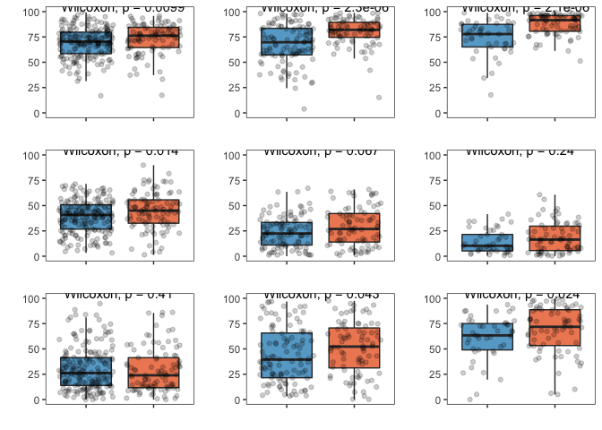<!-- -->

We also check the other CIBERSORTx estimated cell type proportions to
see if there is any confounding.

``` r
my.cols <- brewer.pal(3, "RdBu")
p1 <- ggplot(metadata_filtered[metadata_filtered$COVID == "Positive" & metadata_filtered$Day %in% c("D0"),], aes(x = factor(severity.max), y = as.numeric(T_NK*100+1e-5), fill = factor(severity.max))) + geom_boxplot(outlier.shape = NA) + geom_jitter(alpha = 0.2, shape = 16, size = 0.5) + theme_bw() + scale_fill_manual(values = my.cols[c(3,1)]) + theme(panel.grid = element_blank(), legend.position = "none", axis.text.x = element_blank()) + xlab("") + ylab("") + stat_compare_means() + scale_y_log10(limits = c(1e-6,100), breaks = c(1e-2,1e-1,1,10,100))
p2 <- ggplot(metadata_filtered[metadata_filtered$COVID == "Positive" & metadata_filtered$Day %in% c("D3"),], aes(x = factor(severity.max), y = as.numeric(T_NK*100+1e-5), fill = factor(severity.max))) + geom_boxplot(outlier.shape = NA) + geom_jitter(alpha = 0.2, shape = 16) + theme_bw() + scale_fill_manual(values = my.cols[c(3,1)]) + theme(panel.grid = element_blank(), legend.position = "none", axis.text.x = element_blank()) + xlab("") + ylab("") + stat_compare_means() + scale_y_log10(limits = c(1e-6,100), breaks = c(1e-2,1e-1,1,10,100))
p3 <- ggplot(metadata_filtered[metadata_filtered$COVID == "Positive" & metadata_filtered$Day %in% c("D7"),], aes(x = factor(severity.max), y = as.numeric(T_NK*100+1e-5), fill = factor(severity.max))) + geom_boxplot(outlier.shape = NA) + geom_jitter(alpha = 0.2, shape = 16) + theme_bw() + scale_fill_manual(values = my.cols[c(3,1)]) + theme(panel.grid = element_blank(), legend.position = "none", axis.text.x = element_blank()) + xlab("") + ylab("") + stat_compare_means() + scale_y_log10(limits = c(1e-6,100), breaks = c(1e-2,1e-1,1,10,100))
p4 <- ggplot(metadata_filtered[metadata_filtered$COVID == "Positive" & metadata_filtered$Day %in% c("D0"),], aes(x = factor(severity.max), y = as.numeric(Monocyte*100+1e-5), fill = factor(severity.max))) + geom_boxplot(outlier.shape = NA) + geom_jitter(alpha = 0.2, shape = 16) + theme_bw() + scale_fill_manual(values = my.cols[c(3,1)]) + theme(panel.grid = element_blank(), legend.position = "none", axis.text.x = element_blank()) + xlab("") + ylab("") + stat_compare_means() + scale_y_log10(limits = c(1e-6,100), breaks = c(1e-2,1e-1,1,10,100))
p5 <- ggplot(metadata_filtered[metadata_filtered$COVID == "Positive" & metadata_filtered$Day %in% c("D3"),], aes(x = factor(severity.max), y = as.numeric(Monocyte*100+1e-5), fill = factor(severity.max))) + geom_boxplot(outlier.shape = NA) + geom_jitter(alpha = 0.2, shape = 16) + theme_bw() + scale_fill_manual(values = my.cols[c(3,1)]) + theme(panel.grid = element_blank(), legend.position = "none", axis.text.x = element_blank()) + xlab("") + ylab("") + stat_compare_means() + scale_y_log10(limits = c(1e-6,100), breaks = c(1e-2,1e-1,1,10,100))
p6 <- ggplot(metadata_filtered[metadata_filtered$COVID == "Positive" & metadata_filtered$Day %in% c("D7"),], aes(x = factor(severity.max), y = as.numeric(Monocyte*100+1e-5), fill = factor(severity.max))) + geom_boxplot(outlier.shape = NA) + geom_jitter(alpha = 0.2, shape = 16) + theme_bw() + scale_fill_manual(values = my.cols[c(3,1)]) + theme(panel.grid = element_blank(), legend.position = "none", axis.text.x = element_blank()) + xlab("") + ylab("") + stat_compare_means() + scale_y_log10(limits = c(1e-6,100), breaks = c(1e-2,1e-1,1,10,100))
p7 <- ggplot(metadata_filtered[metadata_filtered$COVID == "Positive" & metadata_filtered$Day %in% c("D0"),], aes(x = factor(severity.max), y = as.numeric(B*100+1e-5), fill = factor(severity.max))) + geom_boxplot(outlier.shape = NA) + geom_jitter(alpha = 0.2, shape = 16) + theme_bw() + scale_fill_manual(values = my.cols[c(3,1)]) + theme(panel.grid = element_blank(), legend.position = "none", axis.text.x = element_blank()) + xlab("") + ylab("") + stat_compare_means() + scale_y_log10(limits = c(1e-6,100), breaks = c(1e-2,1e-1,1,10,100))
p8 <- ggplot(metadata_filtered[metadata_filtered$COVID == "Positive" & metadata_filtered$Day %in% c("D3"),], aes(x = factor(severity.max), y = as.numeric(B*100+1e-5), fill = factor(severity.max))) + geom_boxplot(outlier.shape = NA) + geom_jitter(alpha = 0.2, shape = 16) + theme_bw() + scale_fill_manual(values = my.cols[c(3,1)]) + theme(panel.grid = element_blank(), legend.position = "none", axis.text.x = element_blank()) + xlab("") + ylab("") + stat_compare_means() + scale_y_log10(limits = c(1e-6,100), breaks = c(1e-2,1e-1,1,10,100))
p9 <- ggplot(metadata_filtered[metadata_filtered$COVID == "Positive" & metadata_filtered$Day %in% c("D7"),], aes(x = factor(severity.max), y = as.numeric(B*100+1e-5), fill = factor(severity.max))) + geom_boxplot(outlier.shape = NA) + geom_jitter(alpha = 0.2, shape = 16) + theme_bw() + scale_fill_manual(values = my.cols[c(3,1)]) + theme(panel.grid = element_blank(), legend.position = "none", axis.text.x = element_blank()) + xlab("") + ylab("") + stat_compare_means() + scale_y_log10(limits = c(1e-6,100), breaks = c(1e-2,1e-1,1,10,100))
p10 <- ggplot(metadata_filtered[metadata_filtered$COVID == "Positive" & metadata_filtered$Day %in% c("D0"),], aes(x = factor(severity.max), y = as.numeric(Plasmablast*100+1e-5), fill = factor(severity.max))) + geom_boxplot(outlier.shape = NA) + geom_jitter(alpha = 0.2, shape = 16) + theme_bw() + scale_fill_manual(values = my.cols[c(3,1)]) + theme(panel.grid = element_blank(), legend.position = "none", axis.text.x = element_blank()) + xlab("") + ylab("") + stat_compare_means() + scale_y_log10(limits = c(1e-6,100), breaks = c(1e-2,1e-1,1,10,100))
p11 <- ggplot(metadata_filtered[metadata_filtered$COVID == "Positive" & metadata_filtered$Day %in% c("D3"),], aes(x = factor(severity.max), y = as.numeric(Plasmablast*100+1e-5), fill = factor(severity.max))) + geom_boxplot(outlier.shape = NA) + geom_jitter(alpha = 0.2, shape = 16) + theme_bw() + scale_fill_manual(values = my.cols[c(3,1)]) + theme(panel.grid = element_blank(), legend.position = "none", axis.text.x = element_blank()) + xlab("") + ylab("") + stat_compare_means() + scale_y_log10(limits = c(1e-6,100), breaks = c(1e-2,1e-1,1,10,100))
p12 <- ggplot(metadata_filtered[metadata_filtered$COVID == "Positive" & metadata_filtered$Day %in% c("D7"),], aes(x = factor(severity.max), y = as.numeric(Plasmablast*100+1e-5), fill = factor(severity.max))) + geom_boxplot(outlier.shape = NA) + geom_jitter(alpha = 0.2, shape = 16) + theme_bw() + scale_fill_manual(values = my.cols[c(3,1)]) + theme(panel.grid = element_blank(), legend.position = "none", axis.text.x = element_blank()) + xlab("") + ylab("") + stat_compare_means() + scale_y_log10(limits = c(1e-6,100), breaks = c(1e-2,1e-1,1,10,100))
```

**Figure S7A:**

``` r
cowplot::plot_grid(p1,p2,p3,p4,p5,p6,ncol=3)
```

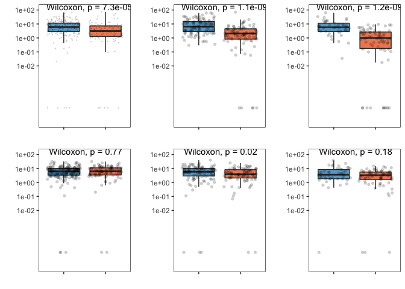<!-- -->

``` r
cowplot::plot_grid(p7,p8,p9,p10,p11,p12,ncol=3)
```

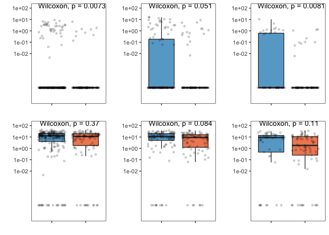<!-- -->

Next we perform unbiased NMF clustering to define bulk neutrophil states
in the context of acute COVID-19 infection. To do this, we used a
previously described Bayesian NMF approach which identified six clusters
(Freeman et al., 2021; Kim et al., 2019; Robertson et al., 2018).
Clustering was performed on all samples with CIBERSORTx estimated
neutrophil fraction &gt; 50% (mature neutrophils and immature
neutrophils combined). This code is not yet publicly available, so we
read in the outputs.

**Figure S7B:**

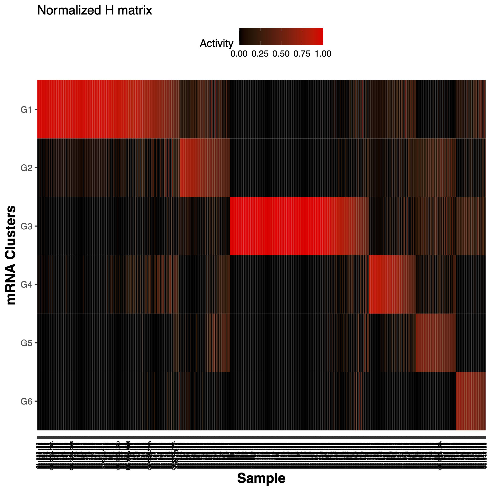

**Figure 2B:**


First we want to check the extent to which these clusters are influenced
by the estimated CIBERSORTx cell type proportions.

``` r
my.cols <- c(orange, skyblue, bluishgreen, yellow, blue, vermillion, "#c64dd1")
p1 <- ggplot(metadata_filtered, aes(x = factor(cluster_neuhi), y = as.numeric(Neutrophil_total*100), fill = factor(cluster_neuhi))) + geom_boxplot(outlier.shape = NA) + geom_jitter(alpha = 0.2, shape = 16, size = 0.5) + theme_bw() + scale_fill_manual(values = my.cols) + theme(panel.grid = element_blank(), legend.position = "none", axis.text.x = element_blank()) + xlab("") + ylab("Total Neutrophil") + stat_compare_means() + scale_y_continuous(limits = c(0,100), expand = c(0.01,0.01))
p2 <- ggplot(metadata_filtered, aes(x = factor(cluster_neuhi), y = as.numeric(Mature_Neutrophil*100), fill = factor(cluster_neuhi))) + geom_boxplot(outlier.shape = NA) + geom_jitter(alpha = 0.2, shape = 16) + theme_bw() + scale_fill_manual(values = my.cols) + theme(panel.grid = element_blank(), legend.position = "none", axis.text.x = element_blank()) + xlab("") + ylab("Mature Neutrophil") + stat_compare_means() + scale_y_continuous(limits = c(0,100), expand = c(0.01,0.01))
p3 <- ggplot(metadata_filtered, aes(x = factor(cluster_neuhi), y = as.numeric(Immature_Neutrophil*100), fill = factor(cluster_neuhi))) + geom_boxplot(outlier.shape = NA) + geom_jitter(alpha = 0.2, shape = 16) + theme_bw() + scale_fill_manual(values = my.cols) + theme(panel.grid = element_blank(), legend.position = "none", axis.text.x = element_blank()) + xlab("") + ylab("Immature Neutrophil") + stat_compare_means() + scale_y_continuous(limits = c(0,100), expand = c(0.01,0.01))
p4 <- ggplot(metadata_filtered, aes(x = factor(cluster_neuhi), y = as.numeric(T_NK*100), fill = factor(cluster_neuhi))) + geom_boxplot(outlier.shape = NA) + geom_jitter(alpha = 0.2, shape = 16) + theme_bw() + scale_fill_manual(values = my.cols) + theme(panel.grid = element_blank(), legend.position = "none", axis.text.x = element_blank()) + xlab("") + ylab("T/NK") + stat_compare_means() + scale_y_continuous(limits = c(0,100), expand = c(0.01,0.01))
p5 <- ggplot(metadata_filtered, aes(x = factor(cluster_neuhi), y = as.numeric(Monocyte*100), fill = factor(cluster_neuhi))) + geom_boxplot(outlier.shape = NA) + geom_jitter(alpha = 0.2, shape = 16) + theme_bw() + scale_fill_manual(values = my.cols) + theme(panel.grid = element_blank(), legend.position = "none", axis.text.x = element_blank()) + xlab("") + ylab("Monocyte") + stat_compare_means() + scale_y_continuous(limits = c(0,100), expand = c(0.01,0.01))
p6 <- ggplot(metadata_filtered, aes(x = factor(cluster_neuhi), y = as.numeric(B*100), fill = factor(cluster_neuhi))) + geom_boxplot(outlier.shape = NA) + geom_jitter(alpha = 0.2, shape = 16) + theme_bw() + scale_fill_manual(values = my.cols) + theme(panel.grid = element_blank(), legend.position = "none", axis.text.x = element_blank()) + xlab("") + ylab("B") + stat_compare_means() + scale_y_continuous(limits = c(0,100), expand = c(0.01,0.01))
p7 <- ggplot(metadata_filtered, aes(x = factor(cluster_neuhi), y = as.numeric(Plasmablast*100), fill = factor(cluster_neuhi))) + geom_boxplot(outlier.shape = NA) + geom_jitter(alpha = 0.2, shape = 16) + theme_bw() + scale_fill_manual(values = my.cols) + theme(panel.grid = element_blank(), legend.position = "none", axis.text.x = element_blank()) + xlab("") + ylab("Plasmablast") + stat_compare_means() + scale_y_continuous(limits = c(0,100), expand = c(0.01,0.01))
```

**Figure S8A:**

``` r
cowplot::plot_grid(p1,p2,p3,p4,p5,p6,p7,ncol=4)
```

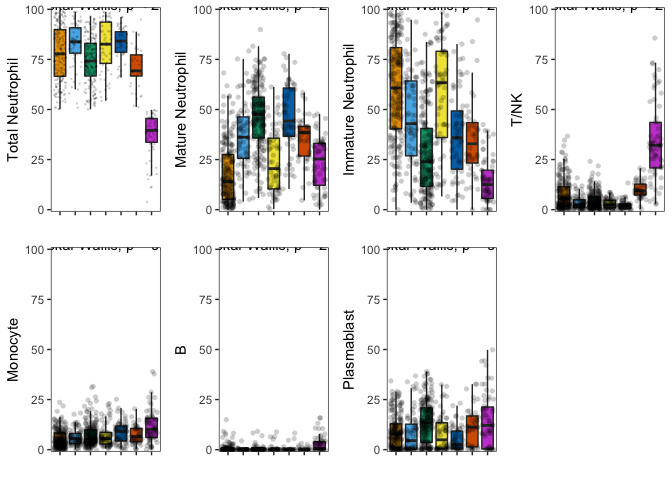<!-- -->

Next we want to compare our bulk neutrophil signatures to single-cell
neutrophil data from COVID-19 patients and healthy controls to see
whether our clusters are reflective of the states which are defined at a
single-cell resolution. To this end we use the Schulte-Schrepping Cohort
2 fresh whole blood neutrophil single-cell data. We score each cell
according to the genes which define the NMF clusters.

``` r
seuratneu <- readRDS(paste0(prefix,"seurat_COVID19_Neutrophils_cohort2_rhapsody_jonas_FG_2020-08-18.rds"))

gene_signatures <- read.xlsx(paste0(prefix,"Tables/TableS1.xlsx"), sheet = 11)
nmf1 <- gene_signatures$NMF1_score
nmf1[nmf1 == "AC109460.4"] <- NA
nmf1 <- na.omit(nmf1)
nmf2 <- gene_signatures$NMF2_score
nmf2[nmf2 == "AP006259.1"] <- NA
nmf2[nmf2 == "AL358333.2"] <- NA
nmf2 <- na.omit(nmf2)
nmf3 <- gene_signatures$NMF3_score
nmf3 <- na.omit(nmf3)
nmf4 <- gene_signatures$NMF4_score
nmf4[nmf4 == "RPL13AP6"] <- NA
nmf4 <- na.omit(nmf4)
nmf5 <- gene_signatures$NMF5_score
nmf5 <- na.omit(nmf5)
nmf6 <- gene_signatures$NMF6_score
nmf6 <- na.omit(nmf6)

tab <- seuratneu@assays$RNA@counts[seuratneu@assays$RNA@counts@Dimnames[[1]] %in% nmf1,]
tab_z <- apply(tab,1,scale)
tab_z <- t(tab_z)
nmf1_meanz <- as.numeric(colMeans(tab_z))
seuratneu <- AddMetaData(seuratneu, metadata = nmf1_meanz, col.name = "nmf1")
tab <- seuratneu@assays$RNA@counts[seuratneu@assays$RNA@counts@Dimnames[[1]] %in% nmf2,]
tab_z <- apply(tab,1,scale)
tab_z <- t(tab_z)
nmf2_meanz <- as.numeric(colMeans(tab_z))
seuratneu <- AddMetaData(seuratneu, metadata = nmf2_meanz, col.name = "nmf2")
tab <- seuratneu@assays$RNA@counts[seuratneu@assays$RNA@counts@Dimnames[[1]] %in% nmf3,]
tab_z <- apply(tab,1,scale)
tab_z <- t(tab_z)
nmf3_meanz <- as.numeric(colMeans(tab_z))
seuratneu <- AddMetaData(seuratneu, metadata = nmf3_meanz, col.name = "nmf3")
tab <- seuratneu@assays$RNA@counts[seuratneu@assays$RNA@counts@Dimnames[[1]] %in% nmf4,]
tab_z <- apply(tab,1,scale)
tab_z <- t(tab_z)
nmf4_meanz <- as.numeric(colMeans(tab_z))
seuratneu <- AddMetaData(seuratneu, metadata = nmf4_meanz, col.name = "nmf4")
tab <- seuratneu@assays$RNA@counts[seuratneu@assays$RNA@counts@Dimnames[[1]] %in% nmf5,]
tab_z <- apply(tab,1,scale)
tab_z <- t(tab_z)
nmf5_meanz <- as.numeric(colMeans(tab_z))
seuratneu <- AddMetaData(seuratneu, metadata = nmf5_meanz, col.name = "nmf5")
tab <- seuratneu@assays$RNA@counts[seuratneu@assays$RNA@counts@Dimnames[[1]] %in% nmf6,]
tab_z <- apply(tab,1,scale)
tab_z <- t(tab_z)
nmf6_meanz <- as.numeric(colMeans(tab_z))
seuratneu <- AddMetaData(seuratneu, metadata = nmf6_meanz, col.name = "nmf6")

p1 <- DimPlot(seuratneu, reduction = "umap", group.by = "seurat_clusters", label = TRUE, raster = TRUE)
p1 <- p1 + theme(axis.line = element_blank(), axis.text = element_blank(), axis.title = element_blank(), axis.ticks = element_blank()) + ggtitle("")

p2 <- FeaturePlot(seuratneu, reduction = "umap", features = c("nmf1"), max.cutoff = 2, cols = c("blue","yellow","red"), raster = TRUE) & scale_colour_gradientn(colours = (brewer.pal(n = 9, name = "Reds"))) 
p2 <- p2 + theme(axis.line = element_blank(), axis.text = element_blank(), axis.title = element_blank(), axis.ticks = element_blank(), legend.position = "none") + ggtitle("NMF1")

p3 <- FeaturePlot(seuratneu, reduction = "umap", features = c("nmf2"), max.cutoff = 2, cols = c("blue","yellow","red"), raster = TRUE) & scale_colour_gradientn(colours = (brewer.pal(n = 9, name = "Reds"))) 
p3 <- p3 + theme(axis.line = element_blank(), axis.text = element_blank(), axis.title = element_blank(), axis.ticks = element_blank(), legend.position = "none") + ggtitle("NMF2")

p4 <- FeaturePlot(seuratneu, reduction = "umap", features = c("nmf3"), max.cutoff = 2, cols = c("blue","yellow","red"), raster = TRUE) & scale_colour_gradientn(colours = (brewer.pal(n = 9, name = "Reds"))) 
p4 <- p4 + theme(axis.line = element_blank(), axis.text = element_blank(), axis.title = element_blank(), axis.ticks = element_blank(), legend.position = "none") + ggtitle("NMF3")

p5 <- FeaturePlot(seuratneu, reduction = "umap", features = c("nmf4"), max.cutoff = 2, cols = c("blue","yellow","red"), raster = TRUE) & scale_colour_gradientn(colours = (brewer.pal(n = 9, name = "Reds"))) 
p5 <- p5 + theme(axis.line = element_blank(), axis.text = element_blank(), axis.title = element_blank(), axis.ticks = element_blank(), legend.position = "none") + ggtitle("NMF4")

p6 <- FeaturePlot(seuratneu, reduction = "umap", features = c("nmf5"), max.cutoff = 2, cols = c("blue","yellow","red"), raster = TRUE) & scale_colour_gradientn(colours = (brewer.pal(n = 9, name = "Reds"))) 
p6 <- p6 + theme(axis.line = element_blank(), axis.text = element_blank(), axis.title = element_blank(), axis.ticks = element_blank(), legend.position = "none") + ggtitle("NMF5")

p7 <- FeaturePlot(seuratneu, reduction = "umap", features = c("nmf6"), max.cutoff = 2, cols = c("blue","yellow","red"), raster = TRUE) & scale_colour_gradientn(colours = (brewer.pal(n = 9, name = "Reds"))) 
p7 <- p7 + theme(axis.line = element_blank(), axis.text = element_blank(), axis.title = element_blank(), axis.ticks = element_blank(), legend.position = "none") + ggtitle("NMF6")
```

**Figure 2C:**

``` r
p1
```

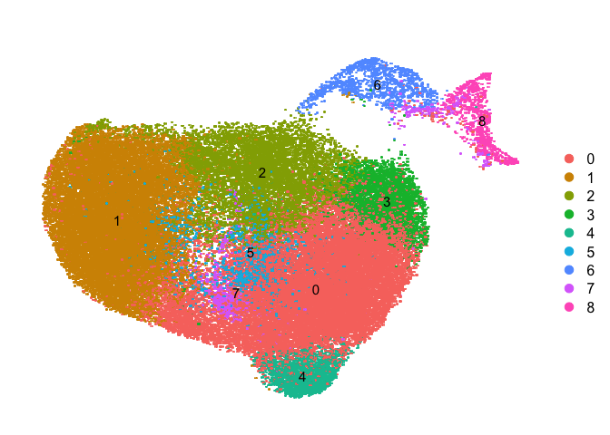<!-- -->

``` r
cowplot::plot_grid(p2,p3,p4,p5,p6,p7,ncol=3)
```

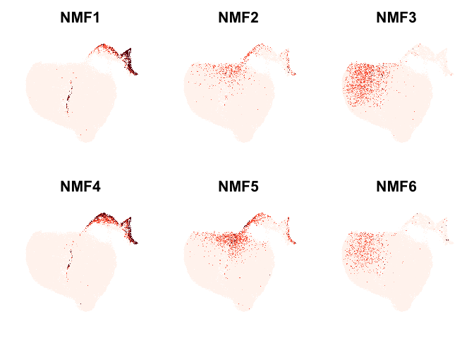<!-- -->

We can visualize the same thing in violin plots:

``` r
p1 <- VlnPlot(seuratneu, features = c("nmf1"), group.by = "seurat_clusters", pt.size = 0, y.max = 8) + ylab("NMF1") + theme(legend.position = "none") + ggtitle("") + xlab("")
p2 <- VlnPlot(seuratneu, features = c("nmf2"), group.by = "seurat_clusters", pt.size = 0, y.max = 1.5) + ylab("NMF2") + theme(legend.position = "none") + ggtitle("") + xlab("")
p3 <- VlnPlot(seuratneu, features = c("nmf3"), group.by = "seurat_clusters", pt.size = 0, y.max = 1.5) + ylab("NMF3") + theme(legend.position = "none") + ggtitle("") + xlab("")
p4 <- VlnPlot(seuratneu, features = c("nmf4"), group.by = "seurat_clusters", pt.size = 0, y.max = 4) + ylab("NMF4") + theme(legend.position = "none") + ggtitle("") + xlab("")
p5 <- VlnPlot(seuratneu, features = c("nmf5"), group.by = "seurat_clusters", pt.size = 0, y.max = 1.5) + ylab("NMF5") + theme(legend.position = "none") + ggtitle("") + xlab("")
p6 <- VlnPlot(seuratneu, features = c("nmf6"), group.by = "seurat_clusters", pt.size = 0, y.max = 1.5) + ylab("NMF6") + theme(legend.position = "none") + ggtitle("") + xlab("")
```

**Figure S8B:**

``` r
cowplot::plot_grid(p1,p2,p3,p4,p5,p6,ncol=1)
```

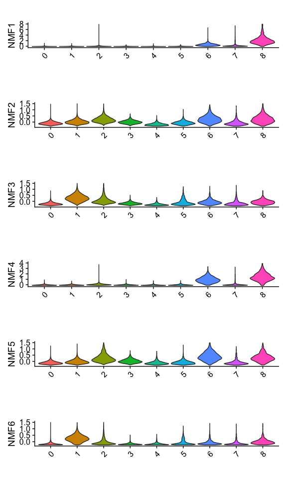<!-- -->

Now we want to visualize how NMF cluster membership varies by day.

``` r
pvals <- as.data.frame(matrix(0L, nrow = 3, ncol = 7))
rownames(pvals) <- c("D0","D3","D7")
colnames(pvals) <- c("1","2","3","4","5","6","7")

metadata_temp <- metadata_filtered[metadata_filtered$COVID == "Positive" & metadata_filtered$Day == "D0",]
for (i in 1:7){
  twoway <- matrix(0L, nrow = 2, ncol = 2)
  twoway[1,1] <- sum(metadata_temp$severity.max == "severe" & metadata_temp$cluster_neuhi == i)
  twoway[1,2] <- sum(metadata_temp$severity.max == "non-severe" & metadata_temp$cluster_neuhi == i)
  twoway[2,1] <- sum(metadata_temp$severity.max == "severe" & metadata_temp$cluster_neuhi != i)
  twoway[2,2] <- sum(metadata_temp$severity.max == "non-severe" & metadata_temp$cluster_neuhi != i)
  
  pval <- fisher.test(twoway)
  pvals[1,i] <- pval$p.value
}

metadata_temp <- metadata_filtered[metadata_filtered$COVID == "Positive" & metadata_filtered$Day == "D3",]
for (i in 1:7){
  twoway <- matrix(0L, nrow = 2, ncol = 2)
  twoway[1,1] <- sum(metadata_temp$severity.max == "severe" & metadata_temp$cluster_neuhi == i)
  twoway[1,2] <- sum(metadata_temp$severity.max == "non-severe" & metadata_temp$cluster_neuhi == i)
  twoway[2,1] <- sum(metadata_temp$severity.max == "severe" & metadata_temp$cluster_neuhi != i)
  twoway[2,2] <- sum(metadata_temp$severity.max == "non-severe" & metadata_temp$cluster_neuhi != i)
  
  pval <- fisher.test(twoway)
  pvals[2,i] <- pval$p.value
}

metadata_temp <- metadata_filtered[metadata_filtered$COVID == "Positive" & metadata_filtered$Day == "D7",]
for (i in 1:7){
  twoway <- matrix(0L, nrow = 2, ncol = 2)
  twoway[1,1] <- sum(metadata_temp$severity.max == "severe" & metadata_temp$cluster_neuhi == i)
  twoway[1,2] <- sum(metadata_temp$severity.max == "non-severe" & metadata_temp$cluster_neuhi == i)
  twoway[2,1] <- sum(metadata_temp$severity.max == "severe" & metadata_temp$cluster_neuhi != i)
  twoway[2,2] <- sum(metadata_temp$severity.max == "non-severe" & metadata_temp$cluster_neuhi != i)
  
  pval <- fisher.test(twoway)
  pvals[3,i] <- pval$p.value
}

pvallist <- as.numeric(c(pvals[1,],pvals[2,],pvals[3,]))
pvallistcorrected <- p.adjust(pvallist, method = "fdr")
pvals[1,] <- pvallistcorrected[1:7]
pvals[2,] <- pvallistcorrected[8:14]
pvals[3,] <- pvallistcorrected[15:21]

nmftable <- as.data.frame(matrix(0L, nrow = 14, ncol = 3))
colnames(nmftable) <- c("Cluster","Severity","Freq")
nmftable$Cluster <- rep(1:7, each = 2)
nmftable$Severity <- rep(c("severe","non-severe"),7)

metadata_temp <- metadata_filtered[metadata_filtered$COVID == "Positive" & metadata_filtered$Day == "D0",]
for (i in 1:nrow(nmftable)){
  nmftable$Freq[i] <- sum(metadata_temp$cluster_neuhi == nmftable$Cluster[i] & metadata_temp$severity.max == nmftable$Severity[i])/sum(metadata_temp$severity.max == nmftable$Severity[i])
}

my.cols <- brewer.pal(3,"RdBu")
p1 <- ggplot(nmftable, aes(x = factor(Cluster), y = Freq*100, fill = Severity)) + geom_bar(position="dodge", stat="identity") + theme_bw() + xlab("") + ylab("Frequency") + ggtitle("Day 0, COVIDP") + scale_fill_manual(values = my.cols[c(3,1)]) + theme(legend.position = "none")

metadata_temp <- metadata_filtered[metadata_filtered$COVID == "Positive" & metadata_filtered$Day == "D3",]
for (i in 1:nrow(nmftable)){
  nmftable$Freq[i] <- sum(metadata_temp$cluster_neuhi == nmftable$Cluster[i] & metadata_temp$severity.max == nmftable$Severity[i])/sum(metadata_temp$severity.max == nmftable$Severity[i])
}

my.cols <- brewer.pal(3,"RdBu")
p2 <- ggplot(nmftable, aes(x = factor(Cluster), y = Freq*100, fill = Severity)) + geom_bar(position="dodge", stat="identity") + theme_bw() + xlab("") + ylab("Frequency") + ggtitle("Day 3, COVIDP") + scale_fill_manual(values = my.cols[c(3,1)]) + theme(legend.position = "none")

metadata_temp <- metadata_filtered[metadata_filtered$COVID == "Positive" & metadata_filtered$Day == "D7",]
for (i in 1:nrow(nmftable)){
  nmftable$Freq[i] <- sum(metadata_temp$cluster_neuhi == nmftable$Cluster[i] & metadata_temp$severity.max == nmftable$Severity[i])/sum(metadata_temp$severity.max == nmftable$Severity[i])
}

my.cols <- brewer.pal(3,"RdBu")
p3 <- ggplot(nmftable, aes(x = factor(Cluster), y = Freq*100, fill = Severity)) + geom_bar(position="dodge", stat="identity") + theme_bw() + xlab("NMF Cluster") + ylab("Frequency") + ggtitle("Day 7, COVIDP") + scale_fill_manual(values = my.cols[c(3,1)]) + theme(legend.position = "none")
```

**Figure 2D:**

``` r
cowplot::plot_grid(p1,p2,p3,ncol=1)
```

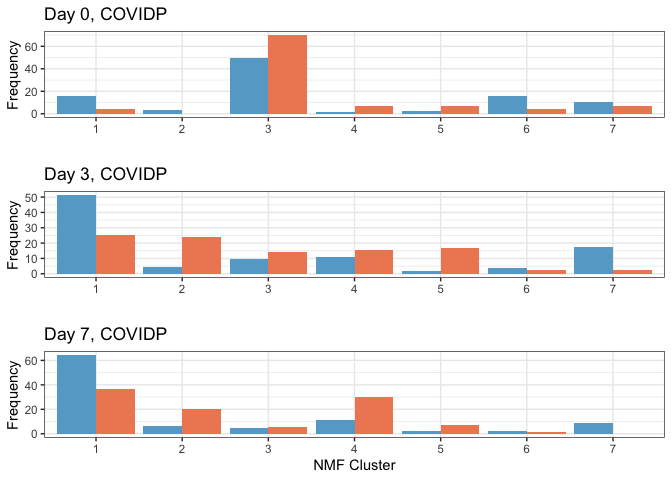<!-- -->

Visualize the same data in terms of counts rather than frequency:

``` r
nmftable <- as.data.frame(matrix(0L, nrow = 14, ncol = 3))
colnames(nmftable) <- c("Cluster","Severity","Count")
nmftable$Cluster <- rep(1:7, each = 2)
nmftable$Severity <- rep(c("severe","non-severe"),7)

metadata_temp <- metadata_filtered[metadata_filtered$COVID == "Positive" & metadata_filtered$Day == "D0",]
for (i in 1:nrow(nmftable)){
  nmftable$Count[i] <- sum(metadata_temp$cluster_neuhi == nmftable$Cluster[i] & metadata_temp$severity.max == nmftable$Severity[i])
}

my.cols <- brewer.pal(3,"RdBu")
p1 <- ggplot(nmftable, aes(x = factor(Cluster), y = Count, fill = Severity)) + geom_bar(position="dodge", stat="identity") + theme_bw() + xlab("") + ylab("Count") + ggtitle("Day 0, COVIDP") + scale_fill_manual(values = my.cols[c(3,1)]) + theme(legend.position = "none")

metadata_temp <- metadata_filtered[metadata_filtered$COVID == "Positive" & metadata_filtered$Day == "D3",]
for (i in 1:nrow(nmftable)){
  nmftable$Count[i] <- sum(metadata_temp$cluster_neuhi == nmftable$Cluster[i] & metadata_temp$severity.max == nmftable$Severity[i])
}

my.cols <- brewer.pal(3,"RdBu")
p2 <- ggplot(nmftable, aes(x = factor(Cluster), y = Count, fill = Severity)) + geom_bar(position="dodge", stat="identity") + theme_bw() + xlab("") + ylab("Count") + ggtitle("Day 3, COVIDP") + scale_fill_manual(values = my.cols[c(3,1)]) + theme(legend.position = "none")

metadata_temp <- metadata_filtered[metadata_filtered$COVID == "Positive" & metadata_filtered$Day == "D7",]
for (i in 1:nrow(nmftable)){
  nmftable$Count[i] <- sum(metadata_temp$cluster_neuhi == nmftable$Cluster[i] & metadata_temp$severity.max == nmftable$Severity[i])
}

my.cols <- brewer.pal(3,"RdBu")
p3 <- ggplot(nmftable, aes(x = factor(Cluster), y = Count, fill = Severity)) + geom_bar(position="dodge", stat="identity") + theme_bw() + xlab("NMF Cluster") + ylab("Count") + ggtitle("Day 7, COVIDP") + scale_fill_manual(values = my.cols[c(3,1)]) + theme(legend.position = "none")
```

**Figure S8C:**

``` r
cowplot::plot_grid(p1,p2,p3,ncol=1)
```

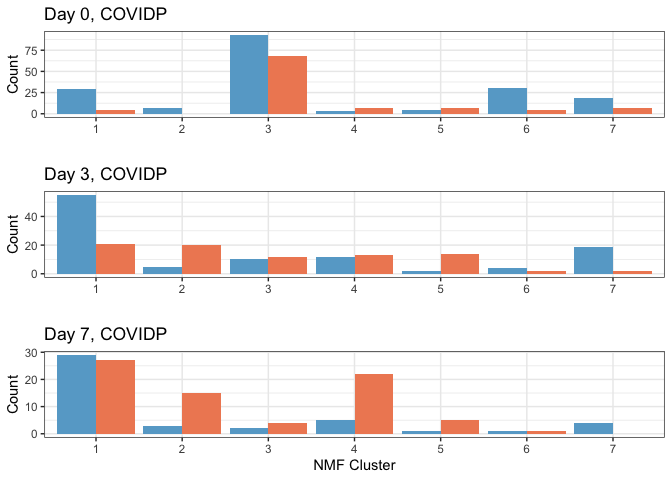<!-- -->

It is also of interest to view how the states evolve over time for the
patients who have serial blood draws.

``` r
metadata_temp <- read.xlsx(paste0(prefix,"Tables/TableS1.xlsx"), sheet = 2)
metadata_temp$nmf.0 <- NA
metadata_temp$nmf.3 <- NA
metadata_temp$nmf.7 <- NA
metadata_temp$nmf.E <- NA

for (i in 1:nrow(metadata_temp)){
  patient <- metadata_temp$Public.ID[i]
  temp <- metadata_filtered[metadata_filtered$Public.ID == patient,]
  if (nrow(temp) >= 1){
    temp0 <- temp[temp$Day == "D0",]
    if (nrow(temp0) == 1){
      metadata_temp$nmf.0[i] <- temp0$cluster_neuhi[1]
    }
    temp3 <- temp[temp$Day == "D3",]
    if (nrow(temp3) == 1){
      metadata_temp$nmf.3[i] <- temp3$cluster_neuhi[1]
    }
    temp7 <- temp[temp$Day == "D7",]
    if (nrow(temp7) == 1){
      metadata_temp$nmf.7[i] <- temp7$cluster_neuhi[1]
    }
    tempE <- temp[temp$Day == "DE",]
    if (nrow(tempE) == 1){
      metadata_temp$nmf.E[i] <- tempE$cluster_neuhi[1]
    }
  }
}

metadata_temp$nmf.0 <- mapvalues(metadata_temp$nmf.0, from = c("1","2","3","4","5","6","7"), to = c("Pro","MDSC","ISG","Imm","MDSC","ISG","LO"))
metadata_temp$nmf.3 <- mapvalues(metadata_temp$nmf.3, from = c("1","2","3","4","5","6","7"), to = c("Pro","MDSC","ISG","Imm","MDSC","ISG","LO"))
metadata_temp$nmf.7 <- mapvalues(metadata_temp$nmf.7, from = c("1","2","3","4","5","6","7"), to = c("Pro","MDSC","ISG","Imm","MDSC","ISG","LO"))
metadata_temp$nmf.E <- mapvalues(metadata_temp$nmf.E, from = c("1","2","3","4","5","6","7"), to = c("Pro","MDSC","ISG","Imm","MDSC","ISG","LO"))

metadata_completecases <- metadata_temp[complete.cases(metadata_temp$nmf.0),]
metadata_completecases <- metadata_completecases[complete.cases(metadata_completecases$nmf.3),]
metadata_completecases <- metadata_completecases[complete.cases(metadata_completecases$nmf.7),]

alluvialtable <- as.data.frame(matrix(0L, nrow = 5^3*2, ncol = 5))
alluvialtable[alluvialtable == 0] <- NA
colnames(alluvialtable) <- c("Day0","Day3","Day7","Severity","Freq")
alluvialtable$Day0 <- c(rep(c("ISG","Pro","MDSC","Imm","LO"), each = 5^2),rep(c("ISG","Pro","MDSC","Imm","LO"), each = 5^2))
alluvialtable$Day3 <- rep(rep(c("ISG","Pro","MDSC","Imm","LO"), each = 5),10)
alluvialtable$Day7 <- rep(c("ISG","Pro","MDSC","Imm","LO"),50)
alluvialtable$Severity <- c(rep("Severe",125),rep("Non-severe",125))

metadata_completecases$severity.max <- matrix(0L, nrow = nrow(metadata_completecases), ncol = 1)
metadata_completecases$severity.max[metadata_completecases$severity.max == 0] <- NA
for (i in 1:nrow(metadata_completecases)){
  if (metadata_completecases$Acuity.max[i] %in% c("1","2")){
    metadata_completecases$severity.max[i] <- "Severe"
  }
  if (metadata_completecases$Acuity.max[i] %in% c("3","4","5")){
    metadata_completecases$severity.max[i] <- "Non-severe"
  }
}

for (i in 1:nrow(alluvialtable)){
  alluvialtable$Freq[i] <- sum(metadata_completecases$nmf.0 == alluvialtable$Day0[i] & metadata_completecases$nmf.3 == alluvialtable$Day3[i] & metadata_completecases$nmf.7 == alluvialtable$Day7[i] & metadata_completecases$severity.max == alluvialtable$Severity[i])
}
alluvialtable$Freq[alluvialtable$Freq == 0] <- NA
alluvialtable <- alluvialtable[complete.cases(alluvialtable$Freq),]

alluvialtable$Day0 <- factor(alluvialtable$Day0, levels = c("ISG","Pro","MDSC","Imm","LO"))
alluvialtable$Day3 <- factor(alluvialtable$Day3, levels = c("ISG","Pro","MDSC","Imm","LO"))
alluvialtable$Day7 <- factor(alluvialtable$Day7, levels = c("ISG","Pro","MDSC","Imm","LO"))

nonseverealluvialtable <- alluvialtable[alluvialtable$Severity == "Non-severe",]
p1 <- ggplot(as.data.frame(nonseverealluvialtable), aes(y = Freq, axis1 = Day0, axis2 = Day3, axis3 = Day7, fill = factor(Day0))) + geom_alluvium(aes(fill = factor(Day0)), width = 1/12) + geom_stratum(width = 1/12, colour = "black", fill = "grey") + geom_label(stat = "stratum", aes(label = after_stat(stratum))) + scale_fill_brewer(type = "qual", palette = "Set2") + ggtitle("Non-severe NMF Clusters by Day") + theme_bw() + scale_x_discrete(expand = c(.1, .1)) + ylab("Count") + theme(legend.position = "none")

severealluvialtable <- alluvialtable[alluvialtable$Severity == "Severe",]
p2 <- ggplot(as.data.frame(severealluvialtable), aes(y = Freq, axis1 = Day0, axis2 = Day3, axis3 = Day7, fill = factor(Day0))) + geom_alluvium(aes(fill = factor(Day0)), width = 1/12) + geom_stratum(width = 1/12, colour = "black", fill = "grey") + geom_label(stat = "stratum", aes(label = after_stat(stratum))) + scale_fill_brewer(type = "qual", palette = "Set2") + ggtitle("Severe NMF Clusters by Day") + theme_bw() + scale_x_discrete(expand = c(.1, .1)) + ylab("Count") + theme(legend.position = "none")
```

**Figure S8D (Edited in Adobe Illustrator):**

``` r
p1
```

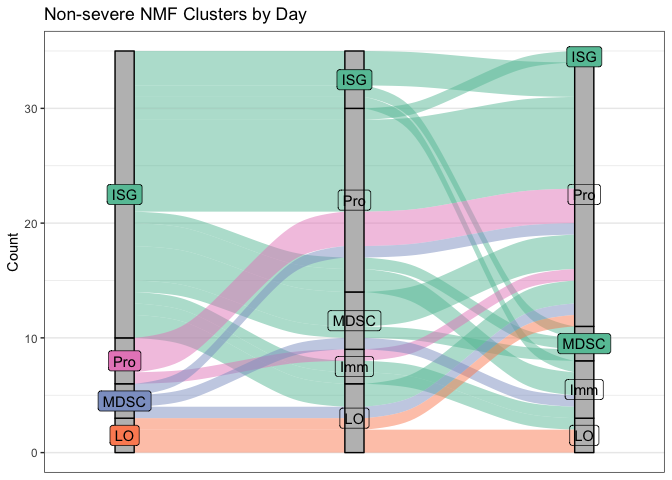<!-- -->

``` r
p2
```

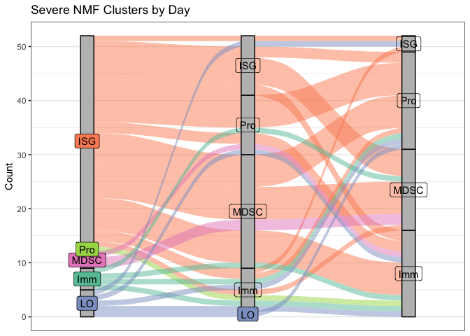<!-- -->

The ISG state seems to decline in time, though it appears to persist at
late time points in the Schulte-Schrepping data according to an
early/late cutoff of 10 days after symptom onset. We reanalyze the data
using a sliding value for the early inclusion cutoff.

``` r
clusterdaytable <- as.data.frame(matrix(0L, nrow = length(0:max(seuratneu$days_after_onset)), ncol = 10))
colnames(clusterdaytable) <- c("Day","C0","C1","C2","C3","C4","C5","C6","C7","C8")
clusterdaytable$Day <- 0:max(seuratneu$days_after_onset)
for (j in 2:ncol(clusterdaytable)){
  for (i in 1:nrow(clusterdaytable)){
    clusterdaytable[i,j] <- sum(seuratneu$days_after_onset == i-1 & seuratneu$seurat_clusters == j-2 & seuratneu$group_per_sample %in% c("mild","severe"))
  }
}
clusterdaytable <- clusterdaytable[c(1,4:6,9,10,13,15,18:21,23,25,26),]
rownames(clusterdaytable) <- clusterdaytable$Day
clusterdaytable <- clusterdaytable[,-1]

percentagetable <- (matrix(0L, nrow = nrow(clusterdaytable), ncol = ncol(clusterdaytable)))
rownames(percentagetable) <- rownames(clusterdaytable)
for (j in 1:ncol(percentagetable)){
  for (i in 1:nrow(percentagetable)){
    percentagetable[i,j] <- sum(clusterdaytable[1:i,j])/sum(clusterdaytable[,j])*100
  }
}
percentagetable <- as.data.frame(rbind(matrix(0L, nrow = 1, ncol = ncol(percentagetable)), percentagetable))
percentagetable$Day <- as.numeric(rownames(percentagetable)) + 1
percentagetable$Day[1] <- 0
rownames(percentagetable) <- percentagetable$Day
percentagetable <- percentagetable[,-10]
colnames(percentagetable) <- colnames(clusterdaytable)

percentagelong <- as.data.frame(cbind(rep(rownames(percentagetable),9),c(percentagetable[,1],percentagetable[,2],percentagetable[,3],percentagetable[,4],percentagetable[,5],percentagetable[,6],percentagetable[,7],percentagetable[,8],percentagetable[,9]), c(rep("C0",16),rep("C1",16),rep("C2",16),rep("C3",16),rep("C4",16),rep("C5",16),rep("C6",16),rep("C7",16),rep("C8",16))))
colnames(percentagelong) <- c("x","y","cluster")

p1 <- ggplot(percentagelong, aes(x = as.numeric(x), y = as.numeric(y), colour = factor(cluster))) + geom_point() + geom_line() + theme_bw() + xlab("Early Inclusion Cutoff for Days After Symptom Onset (Day 0 to Day x)") + ylab("Percentage of Cells Classified as Early (%)") + coord_fixed(ratio = .4)
p1$labels$colour <- "Cluster"
```

**Figure S8E:**

``` r
p1
```

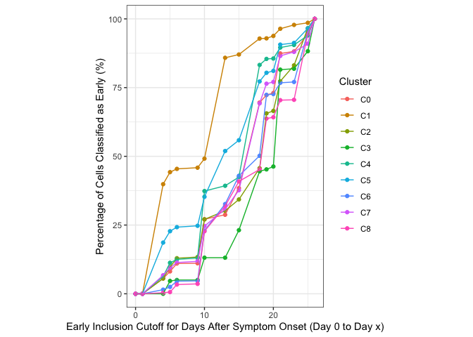<!-- -->

Given the large jump in the ISG cluster (C1) on Day 13 and the
relatively slow cumulative increase after that, we visualize the data
using Day 13 post symptom onset as the early inclusion cutoff.

``` r
seuratneu$control <- as.numeric(seuratneu$group_per_sample == "control")
seuratneu$severe <- as.numeric(seuratneu$group_per_sample == "severe")
seuratneu$mild <- as.numeric(seuratneu$group_per_sample == "mild")
seuratneu$early <- as.numeric(seuratneu$days_after_onset %in% c(0:12) & seuratneu$group_per_sample %in% c("mild","severe"))
seuratneu$late <- as.numeric(seuratneu$days_after_onset > 12 & seuratneu$group_per_sample %in% c("mild","severe"))
seuratneu$earlymild <- as.numeric((seuratneu$early + seuratneu$mild) == 2)
seuratneu$latemild <- as.numeric((seuratneu$late + seuratneu$mild) == 2)
seuratneu$earlysevere <- as.numeric((seuratneu$early + seuratneu$severe) == 2)
seuratneu$latesevere <- as.numeric((seuratneu$late + seuratneu$severe) == 2)

my.cols <- brewer.pal(3,"Set2")
my.cols2 <- brewer.pal(3,"RdBu")

storage <- list()

p1 <- plot_density(seuratneu, "control") + scale_colour_gradient2(low = "grey",mid = "white", high = my.cols[1], midpoint = 0.015)
storage[[1]] <- p1 + theme(axis.line = element_blank(), axis.text = element_blank(), axis.title = element_blank(), axis.ticks = element_blank(), legend.position = "none", axis.text.x = element_blank(), axis.text.y = element_blank()) + ggtitle("Control")

p2 <- plot_density(seuratneu, "earlymild") + scale_colour_gradient2(low = "grey",mid = "white", high = my.cols2[3], midpoint = 0.015)
storage[[2]] <- p2 + theme(axis.line = element_blank(), axis.text = element_blank(), axis.title.x = element_blank(), axis.ticks = element_blank(), legend.position = "none", axis.text.x = element_blank(), axis.text.y = element_blank()) + ggtitle("Mild") + ylab("Early")

p3 <- plot_density(seuratneu, "earlysevere") + scale_colour_gradient2(low = "grey",mid = "white", high = "red", midpoint = 0.015)
storage[[3]] <- p3 + theme(axis.line = element_blank(), axis.text = element_blank(), axis.title.x = element_blank(), axis.ticks = element_blank(), legend.position = "none", axis.text.x = element_blank(), axis.text.y = element_blank()) + ggtitle("Severe") + ylab("Early")

p5 <- plot_density(seuratneu, "latemild") + scale_colour_gradient2(low = "grey",mid = "white", high = my.cols2[3], midpoint = 0.015)
storage[[5]] <- p5 + theme(axis.line = element_blank(), axis.text = element_blank(), axis.title.x = element_blank(), axis.ticks = element_blank(), legend.position = "none", axis.text.x = element_blank(), axis.text.y = element_blank()) + ggtitle("") + ylab("Late")

p6 <- plot_density(seuratneu, "latesevere") + scale_colour_gradient2(low = "grey",mid = "white", high = "red", midpoint = 0.015)
storage[[6]] <- p6 + theme(axis.line = element_blank(), axis.text = element_blank(), axis.title.x = element_blank(), axis.ticks = element_blank(), legend.position = "none", axis.text.x = element_blank(), axis.text.y = element_blank()) + ggtitle("") + ylab("Late")
```

**Figure S8F:**

``` r
cowplot::plot_grid(storage[[1]],storage[[2]],storage[[3]],storage[[4]],storage[[5]],storage[[6]],ncol=3)
```

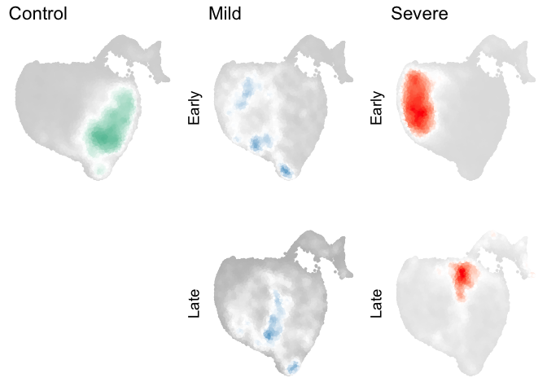<!-- -->

We can also explore NMF membership with COVID-19 disease status, though
this analysis can only be done on Day 0.

``` r
pvals <- as.data.frame(matrix(0L, nrow = 3, ncol = 7))
rownames(pvals) <- c("D0","D3","D7")
colnames(pvals) <- c("1","2","3","4","5","6","7")

metadata_temp <- metadata_filtered[metadata_filtered$Day == "D0",]
for (i in 1:7){
  twoway <- matrix(0L, nrow = 2, ncol = 2)
  twoway[1,1] <- sum(metadata_temp$COVID == "Negative" & metadata_temp$cluster_neuhi == i)
  twoway[1,2] <- sum(metadata_temp$COVID == "Positive" & metadata_temp$cluster_neuhi == i)
  twoway[2,1] <- sum(metadata_temp$COVID == "Negative" & metadata_temp$cluster_neuhi != i)
  twoway[2,2] <- sum(metadata_temp$COVID == "Positive" & metadata_temp$cluster_neuhi != i)
  
  pval <- fisher.test(twoway)
  pvals[1,i] <- pval$p.value
}

pvallist <- as.numeric(pvals[1,])
pvallistcorrected <- p.adjust(pvallist, method = "fdr")

nmftable <- as.data.frame(matrix(0L, nrow = 14, ncol = 3))
colnames(nmftable) <- c("Cluster","COVID","Freq")
nmftable$Cluster <- rep(1:7, each = 2)
nmftable$COVID <- rep(c("Negative","Positive"),7)

metadata_temp <- metadata_filtered[metadata_filtered$Day == "D0",]
for (i in 1:nrow(nmftable)){
  nmftable$Freq[i] <- sum(metadata_temp$cluster_neuhi == nmftable$Cluster[i] & metadata_temp$COVID == nmftable$COVID[i])/sum(metadata_temp$COVID == nmftable$COVID[i])
}
my.cols <- brewer.pal(3,"Set2")
p1 <- ggplot(nmftable, aes(x = factor(Cluster), y = Freq*100, fill = COVID)) + geom_bar(position="dodge", stat="identity") + theme_bw() + xlab("") + ylab("Frequency (%)") + ggtitle("Day 0") + scale_fill_manual(values = my.cols[c(1,2)]) + theme(legend.position = "none")

nmftable$Count <- NA
for (i in 1:nrow(nmftable)){
  nmftable$Count[i] <- sum(metadata_temp$cluster_neuhi == nmftable$Cluster[i] & metadata_temp$COVID == nmftable$COVID[i])
}
p2 <- ggplot(nmftable, aes(x = factor(Cluster), y = Count, fill = COVID)) + geom_bar(position="dodge", stat="identity") + theme_bw() + xlab("") + ylab("Count") + ggtitle("Day 0") + scale_fill_manual(values = my.cols[c(1,2)]) + theme(legend.position = "none")
```

**Figure S9A:**

``` r
p2
```

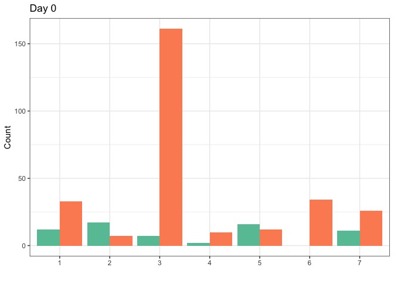<!-- -->

``` r
p1
```

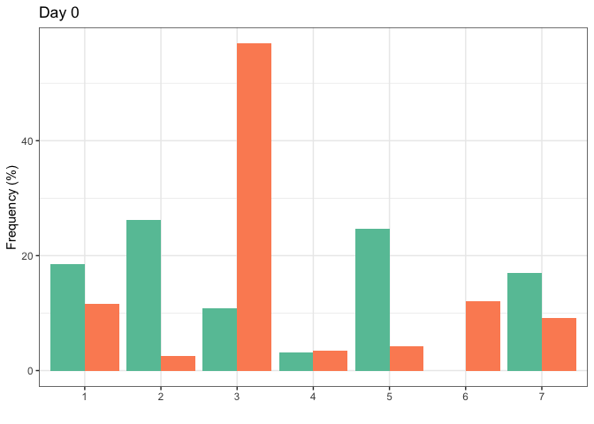<!-- -->

We then examined how clinical parameters varied with neutrophil NMF
cluster membership among COVID-19 samples. We do not report
individual-level intubation status so those lines have been commented
out.

``` r
CreatininetableDay0 <- as.data.frame(matrix(0L, nrow = 35, ncol = 3))
colnames(CreatininetableDay0) <- c("Cluster","Category","Freq")
CreatininetableDay0$Cluster <- rep(1:7, each = 5)
CreatininetableDay0$Category <- rep(1:5, 7)
metadata_temp <- metadata_filtered[complete.cases(metadata_filtered$Creatinine.matched),]
metadata_temp <- metadata_temp[metadata_temp$Day == "D0",]
metadata_temp <- metadata_temp[metadata_temp$COVID == "Positive",]
for (i in 1:nrow(CreatininetableDay0)){
  CreatininetableDay0$Freq[i] <- sum(metadata_temp$cluster_neuhi == CreatininetableDay0$Cluster[i] & metadata_temp$Creatinine.matched == CreatininetableDay0$Category[i])/sum(metadata_temp$cluster_neuhi == CreatininetableDay0$Cluster[i])
}
CreatininetableDay3 <- as.data.frame(matrix(0L, nrow = 35, ncol = 3))
colnames(CreatininetableDay3) <- c("Cluster","Category","Freq")
CreatininetableDay3$Cluster <- rep(1:7, each = 5)
CreatininetableDay3$Category <- rep(1:5, 7)
metadata_temp <- metadata_filtered[complete.cases(metadata_filtered$Creatinine.matched),]
metadata_temp <- metadata_temp[metadata_temp$Day == "D3",]
metadata_temp <- metadata_temp[metadata_temp$COVID == "Positive",]
for (i in 1:nrow(CreatininetableDay3)){
  CreatininetableDay3$Freq[i] <- sum(metadata_temp$cluster_neuhi == CreatininetableDay3$Cluster[i] & metadata_temp$Creatinine.matched == CreatininetableDay3$Category[i])/sum(metadata_temp$cluster_neuhi == CreatininetableDay3$Cluster[i])
}
CreatininetableDay7 <- as.data.frame(matrix(0L, nrow = 35, ncol = 3))
colnames(CreatininetableDay7) <- c("Cluster","Category","Freq")
CreatininetableDay7$Cluster <- rep(1:7, each = 5)
CreatininetableDay7$Category <- rep(1:5, 7)
metadata_temp <- metadata_filtered[complete.cases(metadata_filtered$Creatinine.matched),]
metadata_temp <- metadata_temp[metadata_temp$Day == "D7",]
metadata_temp <- metadata_temp[metadata_temp$COVID == "Positive",]
for (i in 1:nrow(CreatininetableDay7)){
  CreatininetableDay7$Freq[i] <- sum(metadata_temp$cluster_neuhi == CreatininetableDay7$Cluster[i] & metadata_temp$Creatinine.matched == CreatininetableDay7$Category[i])/sum(metadata_temp$cluster_neuhi == CreatininetableDay7$Cluster[i])
}

CRPtableDay0 <- as.data.frame(matrix(0L, nrow = 35, ncol = 3))
colnames(CRPtableDay0) <- c("Cluster","Category","Freq")
CRPtableDay0$Cluster <- rep(1:7, each = 5)
CRPtableDay0$Category <- rep(1:5, 7)
metadata_temp <- metadata_filtered[complete.cases(metadata_filtered$CRP.matched),]
metadata_temp <- metadata_temp[metadata_temp$Day == "D0",]
metadata_temp <- metadata_temp[metadata_temp$COVID == "Positive",]
for (i in 1:nrow(CRPtableDay0)){
  CRPtableDay0$Freq[i] <- sum(metadata_temp$cluster_neuhi == CRPtableDay0$Cluster[i] & metadata_temp$CRP.matched == CRPtableDay0$Category[i])/sum(metadata_temp$cluster_neuhi == CRPtableDay0$Cluster[i])
}
CRPtableDay3 <- as.data.frame(matrix(0L, nrow = 35, ncol = 3))
colnames(CRPtableDay3) <- c("Cluster","Category","Freq")
CRPtableDay3$Cluster <- rep(1:7, each = 5)
CRPtableDay3$Category <- rep(1:5, 7)
metadata_temp <- metadata_filtered[complete.cases(metadata_filtered$CRP.matched),]
metadata_temp <- metadata_temp[metadata_temp$Day == "D3",]
metadata_temp <- metadata_temp[metadata_temp$COVID == "Positive",]
for (i in 1:nrow(CRPtableDay3)){
  CRPtableDay3$Freq[i] <- sum(metadata_temp$cluster_neuhi == CRPtableDay3$Cluster[i] & metadata_temp$CRP.matched == CRPtableDay3$Category[i])/sum(metadata_temp$cluster_neuhi == CRPtableDay3$Cluster[i])
}
CRPtableDay7 <- as.data.frame(matrix(0L, nrow = 35, ncol = 3))
colnames(CRPtableDay7) <- c("Cluster","Category","Freq")
CRPtableDay7$Cluster <- rep(1:7, each = 5)
CRPtableDay7$Category <- rep(1:5, 7)
metadata_temp <- metadata_filtered[complete.cases(metadata_filtered$CRP.matched),]
metadata_temp <- metadata_temp[metadata_temp$Day == "D7",]
metadata_temp <- metadata_temp[metadata_temp$COVID == "Positive",]
for (i in 1:nrow(CRPtableDay7)){
  CRPtableDay7$Freq[i] <- sum(metadata_temp$cluster_neuhi == CRPtableDay7$Cluster[i] & metadata_temp$CRP.matched == CRPtableDay7$Category[i])/sum(metadata_temp$cluster_neuhi == CRPtableDay7$Cluster[i])
}

DdimertableDay0 <- as.data.frame(matrix(0L, nrow = 35, ncol = 3))
colnames(DdimertableDay0) <- c("Cluster","Category","Freq")
DdimertableDay0$Cluster <- rep(1:7, each = 5)
DdimertableDay0$Category <- rep(1:5, 7)
metadata_temp <- metadata_filtered[complete.cases(metadata_filtered$Ddimer.matched),]
metadata_temp <- metadata_temp[metadata_temp$Day == "D0",]
metadata_temp <- metadata_temp[metadata_temp$COVID == "Positive",]
for (i in 1:nrow(DdimertableDay0)){
  DdimertableDay0$Freq[i] <- sum(metadata_temp$cluster_neuhi == DdimertableDay0$Cluster[i] & metadata_temp$Ddimer.matched == DdimertableDay0$Category[i])/sum(metadata_temp$cluster_neuhi == DdimertableDay0$Cluster[i])
}
DdimertableDay3 <- as.data.frame(matrix(0L, nrow = 35, ncol = 3))
colnames(DdimertableDay3) <- c("Cluster","Category","Freq")
DdimertableDay3$Cluster <- rep(1:7, each = 5)
DdimertableDay3$Category <- rep(1:5, 7)
metadata_temp <- metadata_filtered[complete.cases(metadata_filtered$Ddimer.matched),]
metadata_temp <- metadata_temp[metadata_temp$Day == "D3",]
metadata_temp <- metadata_temp[metadata_temp$COVID == "Positive",]
for (i in 1:nrow(DdimertableDay3)){
  DdimertableDay3$Freq[i] <- sum(metadata_temp$cluster_neuhi == DdimertableDay3$Cluster[i] & metadata_temp$Ddimer.matched == DdimertableDay3$Category[i])/sum(metadata_temp$cluster_neuhi == DdimertableDay3$Cluster[i])
}
DdimertableDay7 <- as.data.frame(matrix(0L, nrow = 35, ncol = 3))
colnames(DdimertableDay7) <- c("Cluster","Category","Freq")
DdimertableDay7$Cluster <- rep(1:7, each = 5)
DdimertableDay7$Category <- rep(1:5, 7)
metadata_temp <- metadata_filtered[complete.cases(metadata_filtered$Ddimer.matched),]
metadata_temp <- metadata_temp[metadata_temp$Day == "D7",]
metadata_temp <- metadata_temp[metadata_temp$COVID == "Positive",]
for (i in 1:nrow(DdimertableDay7)){
  DdimertableDay7$Freq[i] <- sum(metadata_temp$cluster_neuhi == DdimertableDay7$Cluster[i] & metadata_temp$Ddimer.matched == DdimertableDay7$Category[i])/sum(metadata_temp$cluster_neuhi == DdimertableDay7$Cluster[i])
}

LDHtableDay0 <- as.data.frame(matrix(0L, nrow = 35, ncol = 3))
colnames(LDHtableDay0) <- c("Cluster","Category","Freq")
LDHtableDay0$Cluster <- rep(1:7, each = 5)
LDHtableDay0$Category <- rep(1:5, 7)
metadata_temp <- metadata_filtered[complete.cases(metadata_filtered$LDH.matched),]
metadata_temp <- metadata_temp[metadata_temp$Day == "D0",]
metadata_temp <- metadata_temp[metadata_temp$COVID == "Positive",]
for (i in 1:nrow(LDHtableDay0)){
  LDHtableDay0$Freq[i] <- sum(metadata_temp$cluster_neuhi == LDHtableDay0$Cluster[i] & metadata_temp$LDH.matched == LDHtableDay0$Category[i])/sum(metadata_temp$cluster_neuhi == LDHtableDay0$Cluster[i])
}
LDHtableDay3 <- as.data.frame(matrix(0L, nrow = 35, ncol = 3))
colnames(LDHtableDay3) <- c("Cluster","Category","Freq")
LDHtableDay3$Cluster <- rep(1:7, each = 5)
LDHtableDay3$Category <- rep(1:5, 7)
metadata_temp <- metadata_filtered[complete.cases(metadata_filtered$LDH.matched),]
metadata_temp <- metadata_temp[metadata_temp$Day == "D3",]
metadata_temp <- metadata_temp[metadata_temp$COVID == "Positive",]
for (i in 1:nrow(LDHtableDay3)){
  LDHtableDay3$Freq[i] <- sum(metadata_temp$cluster_neuhi == LDHtableDay3$Cluster[i] & metadata_temp$LDH.matched == LDHtableDay3$Category[i])/sum(metadata_temp$cluster_neuhi == LDHtableDay3$Cluster[i])
}
LDHtableDay7 <- as.data.frame(matrix(0L, nrow = 35, ncol = 3))
colnames(LDHtableDay7) <- c("Cluster","Category","Freq")
LDHtableDay7$Cluster <- rep(1:7, each = 5)
LDHtableDay7$Category <- rep(1:5, 7)
metadata_temp <- metadata_filtered[complete.cases(metadata_filtered$LDH.matched),]
metadata_temp <- metadata_temp[metadata_temp$Day == "D7",]
metadata_temp <- metadata_temp[metadata_temp$COVID == "Positive",]
for (i in 1:nrow(LDHtableDay7)){
  LDHtableDay7$Freq[i] <- sum(metadata_temp$cluster_neuhi == LDHtableDay7$Cluster[i] & metadata_temp$LDH.matched == LDHtableDay7$Category[i])/sum(metadata_temp$cluster_neuhi == LDHtableDay7$Cluster[i])
}

maxval <- max(CreatininetableDay0$Freq, CreatininetableDay3$Freq, CreatininetableDay7$Freq, CRPtableDay0$Freq, CRPtableDay3$Freq, CRPtableDay7$Freq, DdimertableDay0$Freq, DdimertableDay3$Freq, DdimertableDay7$Freq, LDHtableDay0$Freq, LDHtableDay3$Freq, LDHtableDay7$Freq)

my.cols <- brewer.pal(5,"Reds")
p1 <- ggplot(CreatininetableDay0, aes(x = factor(Cluster), y = Freq, fill = factor(Category))) + geom_bar(position="dodge", stat="identity") + theme_bw() + xlab("NMF Cluster") + ylab("Frequency") + scale_fill_manual(values = my.cols) + scale_y_continuous(limits = c(0,maxval), expand = c(0,0)) + coord_fixed(ratio = 0.5) + geom_vline(xintercept = c(1.5,2.5,3.5,4.5,5.5,6.5)) + theme(legend.position = "none", axis.title.x = element_blank(), axis.title.y = element_blank(), axis.text.x = element_blank(), axis.ticks.x = element_blank())
my.cols <- brewer.pal(5,"Reds")
p2 <- ggplot(CreatininetableDay3, aes(x = factor(Cluster), y = Freq, fill = factor(Category))) + geom_bar(position="dodge", stat="identity") + theme_bw() + xlab("NMF Cluster") + ylab("Frequency") + scale_fill_manual(values = my.cols) + scale_y_continuous(limits = c(0,maxval), expand = c(0,0)) + coord_fixed(ratio = 0.5) + geom_vline(xintercept = c(1.5,2.5,3.5,4.5,5.5,6.5)) + theme(legend.position = "none", axis.title.x = element_blank(), axis.title.y = element_blank(), axis.text.x = element_blank(), axis.ticks.x = element_blank())
my.cols <- brewer.pal(5,"Reds")
p3 <- ggplot(CreatininetableDay7, aes(x = factor(Cluster), y = Freq, fill = factor(Category))) + geom_bar(position="dodge", stat="identity") + theme_bw() + xlab("NMF Cluster") + ylab("Frequency") + scale_fill_manual(values = my.cols) + scale_y_continuous(limits = c(0,maxval), expand = c(0,0)) + coord_fixed(ratio = 0.5) + geom_vline(xintercept = c(1.5,2.5,3.5,4.5,5.5,6.5)) + theme(legend.position = "none", axis.title.x = element_blank(), axis.title.y = element_blank(), axis.text.x = element_blank(), axis.ticks.x = element_blank())

my.cols <- brewer.pal(6,"Greens")
p4 <- ggplot(CRPtableDay0, aes(x = factor(Cluster), y = Freq, fill = factor(Category))) + geom_bar(position="dodge", stat="identity") + theme_bw() + xlab("NMF Cluster") + ylab("Frequency") + scale_fill_manual(values = my.cols[c(2:6)]) + scale_y_continuous(limits = c(0,maxval), expand = c(0,0)) + coord_fixed(ratio = 0.5) + geom_vline(xintercept = c(1.5,2.5,3.5,4.5,5.5,6.5)) + theme(legend.position = "none", axis.title.x = element_blank(), axis.title.y = element_blank(), axis.text.x = element_blank(), axis.ticks.x = element_blank())
my.cols <- brewer.pal(6,"Greens")
p5 <- ggplot(CRPtableDay3, aes(x = factor(Cluster), y = Freq, fill = factor(Category))) + geom_bar(position="dodge", stat="identity") + theme_bw() + xlab("NMF Cluster") + ylab("Frequency") + scale_fill_manual(values = my.cols[c(2:6)]) + scale_y_continuous(limits = c(0,maxval), expand = c(0,0)) + coord_fixed(ratio = 0.5) + geom_vline(xintercept = c(1.5,2.5,3.5,4.5,5.5,6.5)) + theme(legend.position = "none", axis.title.x = element_blank(), axis.title.y = element_blank(), axis.text.x = element_blank(), axis.ticks.x = element_blank())
my.cols <- brewer.pal(6,"Greens")
p6 <- ggplot(CRPtableDay7, aes(x = factor(Cluster), y = Freq, fill = factor(Category))) + geom_bar(position="dodge", stat="identity") + theme_bw() + xlab("NMF Cluster") + ylab("Frequency") + scale_fill_manual(values = my.cols[c(2:6)]) + scale_y_continuous(limits = c(0,maxval), expand = c(0,0)) + coord_fixed(ratio = 0.5) + geom_vline(xintercept = c(1.5,2.5,3.5,4.5,5.5,6.5)) + theme(legend.position = "none", axis.title.x = element_blank(), axis.title.y = element_blank(), axis.text.x = element_blank(), axis.ticks.x = element_blank())

my.cols <- brewer.pal(6,"Blues")
p7 <- ggplot(DdimertableDay0, aes(x = factor(Cluster), y = Freq, fill = factor(Category))) + geom_bar(position="dodge", stat="identity") + theme_bw() + xlab("NMF Cluster") + ylab("Frequency") + scale_fill_manual(values = my.cols[c(2:6)]) + scale_y_continuous(limits = c(0,maxval), expand = c(0,0)) + coord_fixed(ratio = 0.5) + geom_vline(xintercept = c(1.5,2.5,3.5,4.5,5.5,6.5)) + theme(legend.position = "none", axis.title.x = element_blank(), axis.title.y = element_blank(), axis.text.x = element_blank(), axis.ticks.x = element_blank())
my.cols <- brewer.pal(6,"Blues")
p8 <- ggplot(DdimertableDay3, aes(x = factor(Cluster), y = Freq, fill = factor(Category))) + geom_bar(position="dodge", stat="identity") + theme_bw() + xlab("NMF Cluster") + ylab("Frequency") + scale_fill_manual(values = my.cols[c(2:6)]) + scale_y_continuous(limits = c(0,maxval), expand = c(0,0)) + coord_fixed(ratio = 0.5) + geom_vline(xintercept = c(1.5,2.5,3.5,4.5,5.5,6.5)) + theme(legend.position = "none", axis.title.x = element_blank(), axis.title.y = element_blank(), axis.text.x = element_blank(), axis.ticks.x = element_blank())
my.cols <- brewer.pal(6,"Blues")
p9 <- ggplot(DdimertableDay7, aes(x = factor(Cluster), y = Freq, fill = factor(Category))) + geom_bar(position="dodge", stat="identity") + theme_bw() + xlab("NMF Cluster") + ylab("Frequency") + scale_fill_manual(values = my.cols[c(2:6)]) + scale_y_continuous(limits = c(0,maxval), expand = c(0,0)) + coord_fixed(ratio = 0.5) + geom_vline(xintercept = c(1.5,2.5,3.5,4.5,5.5,6.5)) + theme(legend.position = "none", axis.title.x = element_blank(), axis.title.y = element_blank(), axis.text.x = element_blank(), axis.ticks.x = element_blank())

my.cols <- brewer.pal(6,"Purples")
p10 <- ggplot(LDHtableDay0, aes(x = factor(Cluster), y = Freq, fill = factor(Category))) + geom_bar(position="dodge", stat="identity") + theme_bw() + xlab("NMF Cluster") + ylab("Frequency") + scale_fill_manual(values = my.cols[c(2:6)]) + scale_y_continuous(limits = c(0,maxval), expand = c(0,0)) + coord_fixed(ratio = 0.5) + geom_vline(xintercept = c(1.5,2.5,3.5,4.5,5.5,6.5)) + theme(legend.position = "none", axis.title.x = element_blank(), axis.title.y = element_blank(), axis.text.x = element_blank(), axis.ticks.x = element_blank())
my.cols <- brewer.pal(6,"Purples")
p11 <- ggplot(LDHtableDay3, aes(x = factor(Cluster), y = Freq, fill = factor(Category))) + geom_bar(position="dodge", stat="identity") + theme_bw() + xlab("NMF Cluster") + ylab("Frequency") + scale_fill_manual(values = my.cols[c(2:6)]) + scale_y_continuous(limits = c(0,maxval), expand = c(0,0)) + coord_fixed(ratio = 0.5) + geom_vline(xintercept = c(1.5,2.5,3.5,4.5,5.5,6.5)) + theme(legend.position = "none", axis.title.x = element_blank(), axis.title.y = element_blank(), axis.text.x = element_blank(), axis.ticks.x = element_blank())
my.cols <- brewer.pal(6,"Purples")
p12 <- ggplot(LDHtableDay7, aes(x = factor(Cluster), y = Freq, fill = factor(Category))) + geom_bar(position="dodge", stat="identity") + theme_bw() + xlab("NMF Cluster") + ylab("Frequency") + scale_fill_manual(values = my.cols[c(2:6)]) + scale_y_continuous(limits = c(0,maxval), expand = c(0,0)) + coord_fixed(ratio = 0.5) + geom_vline(xintercept = c(1.5,2.5,3.5,4.5,5.5,6.5)) + theme(legend.position = "none", axis.title.x = element_blank(), axis.title.y = element_blank(), axis.text.x = element_blank(), axis.ticks.x = element_blank())

# intubatedtableDay0 <- as.data.frame(matrix(0L, nrow = 14, ncol = 3))
# colnames(intubatedtableDay0) <- c("Cluster","Category","Freq")
# intubatedtableDay0$Cluster <- rep(1:7, each = 2)
# intubatedtableDay0$Category <- rep(0:1, 7)
# metadata_temp <- metadata_filtered[complete.cases(metadata_filtered$intubated),]
# metadata_temp <- metadata_temp[metadata_temp$Day == "D0",]
# metadata_temp <- metadata_temp[metadata_temp$COVID == "Positive",]
# for (i in 1:nrow(intubatedtableDay0)){
#   intubatedtableDay0$Freq[i] <- sum(metadata_temp$cluster_neuhi == intubatedtableDay0$Cluster[i] & metadata_temp$intubated == intubatedtableDay0$Category[i])/sum(metadata_temp$cluster_neuhi == intubatedtableDay0$Cluster[i])
# }
# intubatedtableDay3 <- as.data.frame(matrix(0L, nrow = 14, ncol = 3))
# colnames(intubatedtableDay3) <- c("Cluster","Category","Freq")
# intubatedtableDay3$Cluster <- rep(1:7, each = 2)
# intubatedtableDay3$Category <- rep(0:1, 7)
# metadata_temp <- metadata_filtered[complete.cases(metadata_filtered$intubated),]
# metadata_temp <- metadata_temp[metadata_temp$Day == "D3",]
# metadata_temp <- metadata_temp[metadata_temp$COVID == "Positive",]
# for (i in 1:nrow(intubatedtableDay3)){
#   intubatedtableDay3$Freq[i] <- sum(metadata_temp$cluster_neuhi == intubatedtableDay3$Cluster[i] & metadata_temp$intubated == intubatedtableDay3$Category[i])/sum(metadata_temp$cluster_neuhi == intubatedtableDay3$Cluster[i])
# }
# intubatedtableDay7 <- as.data.frame(matrix(0L, nrow = 14, ncol = 3))
# colnames(intubatedtableDay7) <- c("Cluster","Category","Freq")
# intubatedtableDay7$Cluster <- rep(1:7, each = 2)
# intubatedtableDay7$Category <- rep(0:1, 7)
# metadata_temp <- metadata_filtered[complete.cases(metadata_filtered$intubated),]
# metadata_temp <- metadata_temp[metadata_temp$Day == "D7",]
# metadata_temp <- metadata_temp[metadata_temp$COVID == "Positive",]
# for (i in 1:nrow(intubatedtableDay7)){
#   intubatedtableDay7$Freq[i] <- sum(metadata_temp$cluster_neuhi == intubatedtableDay7$Cluster[i] & metadata_temp$intubated == intubatedtableDay7$Category[i])/sum(metadata_temp$cluster_neuhi == intubatedtableDay7$Cluster[i])
# }

CXR.infiltratestableDay0 <- as.data.frame(matrix(0L, nrow = 14, ncol = 3))
colnames(CXR.infiltratestableDay0) <- c("Cluster","Category","Freq")
CXR.infiltratestableDay0$Cluster <- rep(1:7, each = 2)
CXR.infiltratestableDay0$Category <- rep(0:1, 7)
metadata_temp <- metadata_filtered[complete.cases(metadata_filtered$CXR.infiltrates),]
metadata_temp <- metadata_temp[metadata_temp$Day == "D0",]
metadata_temp <- metadata_temp[metadata_temp$COVID == "Positive",]
for (i in 1:nrow(CXR.infiltratestableDay0)){
  CXR.infiltratestableDay0$Freq[i] <- sum(metadata_temp$cluster_neuhi == CXR.infiltratestableDay0$Cluster[i] & metadata_temp$CXR.infiltrates == CXR.infiltratestableDay0$Category[i])/sum(metadata_temp$cluster_neuhi == CXR.infiltratestableDay0$Cluster[i])
}
CXR.infiltratestableDay3 <- as.data.frame(matrix(0L, nrow = 14, ncol = 3))
colnames(CXR.infiltratestableDay3) <- c("Cluster","Category","Freq")
CXR.infiltratestableDay3$Cluster <- rep(1:7, each = 2)
CXR.infiltratestableDay3$Category <- rep(0:1, 7)
metadata_temp <- metadata_filtered[complete.cases(metadata_filtered$CXR.infiltrates),]
metadata_temp <- metadata_temp[metadata_temp$Day == "D3",]
metadata_temp <- metadata_temp[metadata_temp$COVID == "Positive",]
for (i in 1:nrow(CXR.infiltratestableDay3)){
  CXR.infiltratestableDay3$Freq[i] <- sum(metadata_temp$cluster_neuhi == CXR.infiltratestableDay3$Cluster[i] & metadata_temp$CXR.infiltrates == CXR.infiltratestableDay3$Category[i])/sum(metadata_temp$cluster_neuhi == CXR.infiltratestableDay3$Cluster[i])
}
CXR.infiltratestableDay7 <- as.data.frame(matrix(0L, nrow = 14, ncol = 3))
colnames(CXR.infiltratestableDay7) <- c("Cluster","Category","Freq")
CXR.infiltratestableDay7$Cluster <- rep(1:7, each = 2)
CXR.infiltratestableDay7$Category <- rep(0:1, 7)
metadata_temp <- metadata_filtered[complete.cases(metadata_filtered$CXR.infiltrates),]
metadata_temp <- metadata_temp[metadata_temp$Day == "D7",]
metadata_temp <- metadata_temp[metadata_temp$COVID == "Positive",]
for (i in 1:nrow(CXR.infiltratestableDay7)){
  CXR.infiltratestableDay7$Freq[i] <- sum(metadata_temp$cluster_neuhi == CXR.infiltratestableDay7$Cluster[i] & metadata_temp$CXR.infiltrates == CXR.infiltratestableDay7$Category[i])/sum(metadata_temp$cluster_neuhi == CXR.infiltratestableDay7$Cluster[i])
}

Trop_72htableDay0 <- as.data.frame(matrix(0L, nrow = 14, ncol = 3))
colnames(Trop_72htableDay0) <- c("Cluster","Category","Freq")
Trop_72htableDay0$Cluster <- rep(1:7, each = 2)
Trop_72htableDay0$Category <- rep(0:1, 7)
metadata_temp <- metadata_filtered[complete.cases(metadata_filtered$Trop_72h),]
metadata_temp <- metadata_temp[metadata_temp$Day == "D0",]
metadata_temp <- metadata_temp[metadata_temp$COVID == "Positive",]
for (i in 1:nrow(Trop_72htableDay0)){
  Trop_72htableDay0$Freq[i] <- sum(metadata_temp$cluster_neuhi == Trop_72htableDay0$Cluster[i] & metadata_temp$Trop_72h == Trop_72htableDay0$Category[i])/sum(metadata_temp$cluster_neuhi == Trop_72htableDay0$Cluster[i])
}
Trop_72htableDay3 <- as.data.frame(matrix(0L, nrow = 14, ncol = 3))
colnames(Trop_72htableDay3) <- c("Cluster","Category","Freq")
Trop_72htableDay3$Cluster <- rep(1:7, each = 2)
Trop_72htableDay3$Category <- rep(0:1, 7)
metadata_temp <- metadata_filtered[complete.cases(metadata_filtered$Trop_72h),]
metadata_temp <- metadata_temp[metadata_temp$Day == "D3",]
metadata_temp <- metadata_temp[metadata_temp$COVID == "Positive",]
for (i in 1:nrow(Trop_72htableDay3)){
  Trop_72htableDay3$Freq[i] <- sum(metadata_temp$cluster_neuhi == Trop_72htableDay3$Cluster[i] & metadata_temp$Trop_72h == Trop_72htableDay3$Category[i])/sum(metadata_temp$cluster_neuhi == Trop_72htableDay3$Cluster[i])
}
Trop_72htableDay7 <- as.data.frame(matrix(0L, nrow = 14, ncol = 3))
colnames(Trop_72htableDay7) <- c("Cluster","Category","Freq")
Trop_72htableDay7$Cluster <- rep(1:7, each = 2)
Trop_72htableDay7$Category <- rep(0:1, 7)
metadata_temp <- metadata_filtered[complete.cases(metadata_filtered$Trop_72h),]
metadata_temp <- metadata_temp[metadata_temp$Day == "D7",]
metadata_temp <- metadata_temp[metadata_temp$COVID == "Positive",]
for (i in 1:nrow(Trop_72htableDay7)){
  Trop_72htableDay7$Freq[i] <- sum(metadata_temp$cluster_neuhi == Trop_72htableDay7$Cluster[i] & metadata_temp$Trop_72h == Trop_72htableDay7$Category[i])/sum(metadata_temp$cluster_neuhi == Trop_72htableDay7$Cluster[i])
}

DeathtableDay0 <- as.data.frame(matrix(0L, nrow = 14, ncol = 3))
colnames(DeathtableDay0) <- c("Cluster","Category","Freq")
DeathtableDay0$Cluster <- rep(1:7, each = 2)
DeathtableDay0$Category <- rep(0:1, 7)
metadata_temp <- metadata_filtered[complete.cases(metadata_filtered$Acuity.max),]
metadata_temp <- metadata_temp[metadata_temp$Day == "D0",]
metadata_temp <- metadata_temp[metadata_temp$COVID == "Positive",]
metadata_temp$Death <- as.numeric(metadata_temp$Acuity.max == "1")
for (i in 1:nrow(DeathtableDay0)){
  DeathtableDay0$Freq[i] <- sum(metadata_temp$cluster_neuhi == DeathtableDay0$Cluster[i] & metadata_temp$Death == DeathtableDay0$Category[i])/sum(metadata_temp$cluster_neuhi == DeathtableDay0$Cluster[i])
}
DeathtableDay3 <- as.data.frame(matrix(0L, nrow = 14, ncol = 3))
colnames(DeathtableDay3) <- c("Cluster","Category","Freq")
DeathtableDay3$Cluster <- rep(1:7, each = 2)
DeathtableDay3$Category <- rep(0:1, 7)
metadata_temp <- metadata_filtered[complete.cases(metadata_filtered$Acuity.max),]
metadata_temp <- metadata_temp[metadata_temp$Day == "D3",]
metadata_temp <- metadata_temp[metadata_temp$COVID == "Positive",]
metadata_temp$Death <- as.numeric(metadata_temp$Acuity.max == "1")
for (i in 1:nrow(DeathtableDay3)){
  DeathtableDay3$Freq[i] <- sum(metadata_temp$cluster_neuhi == DeathtableDay3$Cluster[i] & metadata_temp$Death == DeathtableDay3$Category[i])/sum(metadata_temp$cluster_neuhi == DeathtableDay3$Cluster[i])
}
DeathtableDay7 <- as.data.frame(matrix(0L, nrow = 14, ncol = 3))
colnames(DeathtableDay7) <- c("Cluster","Category","Freq")
DeathtableDay7$Cluster <- rep(1:7, each = 2)
DeathtableDay7$Category <- rep(0:1, 7)
metadata_temp <- metadata_filtered[complete.cases(metadata_filtered$Acuity.max),]
metadata_temp <- metadata_temp[metadata_temp$Day == "D7",]
metadata_temp <- metadata_temp[metadata_temp$COVID == "Positive",]
metadata_temp$Death <- as.numeric(metadata_temp$Acuity.max == "1")
for (i in 1:nrow(DeathtableDay7)){
  DeathtableDay7$Freq[i] <- sum(metadata_temp$cluster_neuhi == DeathtableDay7$Cluster[i] & metadata_temp$Death == DeathtableDay7$Category[i])/sum(metadata_temp$cluster_neuhi == DeathtableDay7$Cluster[i])
}

maxval <- max(
  #intubatedtableDay0$Freq, intubatedtableDay3$Freq, intubatedtableDay7$Freq, 
  CXR.infiltratestableDay0$Freq, CXR.infiltratestableDay3$Freq, CXR.infiltratestableDay7$Freq, Trop_72htableDay0$Freq, Trop_72htableDay3$Freq, Trop_72htableDay7$Freq)

# my.cols <- brewer.pal(12,"Paired")
# p13 <- ggplot(intubatedtableDay0, aes(x = factor(Cluster), y = Freq, fill = factor(Category))) + geom_bar(position="dodge", stat="identity") + theme_bw() + xlab("NMF Cluster") + ylab("Frequency") + scale_fill_manual(values = my.cols[5:6]) + scale_y_continuous(limits = c(0,maxval), expand = c(0,0)) + coord_fixed(ratio = .5) + geom_vline(xintercept = c(1.5,2.5,3.5,4.5,5.5,6.5)) + theme(legend.position = "none", axis.title.x = element_blank(), axis.title.y = element_blank(), axis.text.x = element_blank(), axis.ticks.x = element_blank())
# my.cols <- brewer.pal(12,"Paired")
# p14 <- ggplot(intubatedtableDay3, aes(x = factor(Cluster), y = Freq, fill = factor(Category))) + geom_bar(position="dodge", stat="identity") + theme_bw() + xlab("NMF Cluster") + ylab("Frequency") + scale_fill_manual(values = my.cols[5:6]) + scale_y_continuous(limits = c(0,maxval), expand = c(0,0)) + coord_fixed(ratio = .5) + geom_vline(xintercept = c(1.5,2.5,3.5,4.5,5.5,6.5)) + theme(legend.position = "none", axis.title.x = element_blank(), axis.title.y = element_blank(), axis.text.x = element_blank(), axis.ticks.x = element_blank())
# my.cols <- brewer.pal(12,"Paired")
# p15 <- ggplot(intubatedtableDay7, aes(x = factor(Cluster), y = Freq, fill = factor(Category))) + geom_bar(position="dodge", stat="identity") + theme_bw() + xlab("NMF Cluster") + ylab("Frequency") + scale_fill_manual(values = my.cols[5:6]) + scale_y_continuous(limits = c(0,maxval), expand = c(0,0)) + coord_fixed(ratio = .5) + geom_vline(xintercept = c(1.5,2.5,3.5,4.5,5.5,6.5)) + theme(legend.position = "none", axis.title.x = element_blank(), axis.title.y = element_blank(), axis.text.x = element_blank(), axis.ticks.x = element_blank())

my.cols <- brewer.pal(12,"Paired")
p16 <- ggplot(CXR.infiltratestableDay0, aes(x = factor(Cluster), y = Freq, fill = factor(Category))) + geom_bar(position="dodge", stat="identity") + theme_bw() + xlab("NMF Cluster") + ylab("Frequency") + scale_fill_manual(values = my.cols[7:8]) + scale_y_continuous(limits = c(0,maxval), expand = c(0,0)) + coord_fixed(ratio = .5) + geom_vline(xintercept = c(1.5,2.5,3.5,4.5,5.5,6.5)) + theme(legend.position = "none", axis.title.x = element_blank(), axis.title.y = element_blank(), axis.text.x = element_blank(), axis.ticks.x = element_blank())
my.cols <- brewer.pal(12,"Paired")
p17 <- ggplot(CXR.infiltratestableDay3, aes(x = factor(Cluster), y = Freq, fill = factor(Category))) + geom_bar(position="dodge", stat="identity") + theme_bw() + xlab("NMF Cluster") + ylab("Frequency") + scale_fill_manual(values = my.cols[7:8]) + scale_y_continuous(limits = c(0,maxval), expand = c(0,0)) + coord_fixed(ratio = .5) + geom_vline(xintercept = c(1.5,2.5,3.5,4.5,5.5,6.5)) + theme(legend.position = "none", axis.title.x = element_blank(), axis.title.y = element_blank(), axis.text.x = element_blank(), axis.ticks.x = element_blank())
my.cols <- brewer.pal(12,"Paired")
p18 <- ggplot(CXR.infiltratestableDay7, aes(x = factor(Cluster), y = Freq, fill = factor(Category))) + geom_bar(position="dodge", stat="identity") + theme_bw() + xlab("NMF Cluster") + ylab("Frequency") + scale_fill_manual(values = my.cols[7:8]) + scale_y_continuous(limits = c(0,maxval), expand = c(0,0)) + coord_fixed(ratio = .5) + geom_vline(xintercept = c(1.5,2.5,3.5,4.5,5.5,6.5)) + theme(legend.position = "none", axis.title.x = element_blank(), axis.title.y = element_blank(), axis.text.x = element_blank(), axis.ticks.x = element_blank())

my.cols <- brewer.pal(12,"Paired")
p19 <- ggplot(Trop_72htableDay0, aes(x = factor(Cluster), y = Freq, fill = factor(Category))) + geom_bar(position="dodge", stat="identity") + theme_bw() + xlab("NMF Cluster") + ylab("Frequency") + scale_fill_manual(values = my.cols[11:12]) + scale_y_continuous(limits = c(0,maxval), expand = c(0,0)) + coord_fixed(ratio = .5) + geom_vline(xintercept = c(1.5,2.5,3.5,4.5,5.5,6.5)) + theme(legend.position = "none", axis.title.x = element_blank(), axis.title.y = element_blank(), axis.text.x = element_blank(), axis.ticks.x = element_blank())
my.cols <- brewer.pal(12,"Paired")
p20 <- ggplot(Trop_72htableDay3, aes(x = factor(Cluster), y = Freq, fill = factor(Category))) + geom_bar(position="dodge", stat="identity") + theme_bw() + xlab("NMF Cluster") + ylab("Frequency") + scale_fill_manual(values = my.cols[11:12]) + scale_y_continuous(limits = c(0,maxval), expand = c(0,0)) + coord_fixed(ratio = .5) + geom_vline(xintercept = c(1.5,2.5,3.5,4.5,5.5,6.5)) + theme(legend.position = "none", axis.title.x = element_blank(), axis.title.y = element_blank(), axis.text.x = element_blank(), axis.ticks.x = element_blank())
my.cols <- brewer.pal(12,"Paired")
p21 <- ggplot(Trop_72htableDay7, aes(x = factor(Cluster), y = Freq, fill = factor(Category))) + geom_bar(position="dodge", stat="identity") + theme_bw() + xlab("NMF Cluster") + ylab("Frequency") + scale_fill_manual(values = my.cols[11:12]) + scale_y_continuous(limits = c(0,maxval), expand = c(0,0)) + coord_fixed(ratio = .5) + geom_vline(xintercept = c(1.5,2.5,3.5,4.5,5.5,6.5)) + theme(legend.position = "none", axis.title.x = element_blank(), axis.title.y = element_blank(), axis.text.x = element_blank(), axis.ticks.x = element_blank())

my.cols <- brewer.pal(12,"Paired")
p22 <- ggplot(DeathtableDay0, aes(x = factor(Cluster), y = Freq, fill = factor(Category))) + geom_bar(position="dodge", stat="identity") + theme_bw() + xlab("NMF Cluster") + ylab("Frequency") + scale_fill_manual(values = c("lightgray","grey30")) + scale_y_continuous(limits = c(0,maxval), expand = c(0,0)) + coord_fixed(ratio = .5) + geom_vline(xintercept = c(1.5,2.5,3.5,4.5,5.5,6.5)) + theme(legend.position = "none", axis.title.x = element_blank(), axis.title.y = element_blank(), axis.text.x = element_blank(), axis.ticks.x = element_blank())
my.cols <- brewer.pal(12,"Paired")
p23 <- ggplot(DeathtableDay3, aes(x = factor(Cluster), y = Freq, fill = factor(Category))) + geom_bar(position="dodge", stat="identity") + theme_bw() + xlab("NMF Cluster") + ylab("Frequency") + scale_fill_manual(values = c("lightgray","grey30")) + scale_y_continuous(limits = c(0,maxval), expand = c(0,0)) + coord_fixed(ratio = .5) + geom_vline(xintercept = c(1.5,2.5,3.5,4.5,5.5,6.5)) + theme(legend.position = "none", axis.title.x = element_blank(), axis.title.y = element_blank(), axis.text.x = element_blank(), axis.ticks.x = element_blank())
my.cols <- brewer.pal(12,"Paired")
p24 <- ggplot(DeathtableDay7, aes(x = factor(Cluster), y = Freq, fill = factor(Category))) + geom_bar(position="dodge", stat="identity") + theme_bw() + xlab("NMF Cluster") + ylab("Frequency") + scale_fill_manual(values = c("lightgray","grey30")) + scale_y_continuous(limits = c(0,maxval), expand = c(0,0)) + coord_fixed(ratio = .5) + geom_vline(xintercept = c(1.5,2.5,3.5,4.5,5.5,6.5)) + theme(legend.position = "none", axis.title.x = element_blank(), axis.title.y = element_blank(), axis.text.x = element_blank(), axis.ticks.x = element_blank())
```

We used the following chunk to determine significance. Since we cannot
perform the appropriate p-value correction without using the
individual-level intubation status, it is commented out.

``` r
# metadata_filtered$Death <- as.numeric(metadata_filtered$Acuity.max == "1")
# ptable <- as.data.frame(matrix(0L, nrow = 24, ncol = 7))
# colnames(ptable) <- c("1","2","3","4","5","6","7")
# rownames(ptable) <- c("Creatinine.0","Creatinine.3","Creatinine.7","CRP.0","CRP.3","CRP.7","Ddimer.0","Ddimer.3","Ddimer.7","LDH.0","LDH.3","LDH.7","Death.0","Death.3","Death.7","intubated.0","intubated.3","intubated.7","CXR.0","CXR.3","CXR.7","Trop.0","Trop.3","Trop.7")
# 
# for (i in 1:7){
#   twoway <- matrix(0L, nrow = 2, ncol = 5)
#   metadata_temp <- metadata_filtered[complete.cases(metadata_filtered$Creatinine.matched),]
#   metadata_temp <- metadata_temp[metadata_temp$Day == "D0" & metadata_temp$COVID == "Positive",]
#   for (j in 1:5){
#     twoway[1,j] <- sum(metadata_temp$cluster_neuhi == i & metadata_temp$Creatinine.matched == j)
#     twoway[2,j] <- sum(metadata_temp$cluster_neuhi != i & metadata_temp$Creatinine.matched == j)
#   }
#   fis <- fisher.test(twoway)
#   ptable[1,i] <- fis$p.value
#   twoway <- matrix(0L, nrow = 2, ncol = 5)
#   metadata_temp <- metadata_filtered[complete.cases(metadata_filtered$Creatinine.matched),]
#   metadata_temp <- metadata_temp[metadata_temp$Day == "D3" & metadata_temp$COVID == "Positive",]
#   for (j in 1:5){
#     twoway[1,j] <- sum(metadata_temp$cluster_neuhi == i & metadata_temp$Creatinine.matched == j)
#     twoway[2,j] <- sum(metadata_temp$cluster_neuhi != i & metadata_temp$Creatinine.matched == j)
#   }
#   fis <- fisher.test(twoway)
#   ptable[2,i] <- fis$p.value
#   twoway <- matrix(0L, nrow = 2, ncol = 5)
#   metadata_temp <- metadata_filtered[complete.cases(metadata_filtered$Creatinine.matched),]
#   metadata_temp <- metadata_temp[metadata_temp$Day == "D7" & metadata_temp$COVID == "Positive",]
#   for (j in 1:5){
#     twoway[1,j] <- sum(metadata_temp$cluster_neuhi == i & metadata_temp$Creatinine.matched == j)
#     twoway[2,j] <- sum(metadata_temp$cluster_neuhi != i & metadata_temp$Creatinine.matched == j)
#   }
#   fis <- fisher.test(twoway)
#   ptable[3,i] <- fis$p.value
#   
#   twoway <- matrix(0L, nrow = 2, ncol = 5)
#   metadata_temp <- metadata_filtered[complete.cases(metadata_filtered$CRP.matched),]
#   metadata_temp <- metadata_temp[metadata_temp$Day == "D0" & metadata_temp$COVID == "Positive",]
#   for (j in 1:5){
#     twoway[1,j] <- sum(metadata_temp$cluster_neuhi == i & metadata_temp$CRP.matched == j)
#     twoway[2,j] <- sum(metadata_temp$cluster_neuhi != i & metadata_temp$CRP.matched == j)
#   }
#   fis <- fisher.test(twoway, simulate.p.value=TRUE)
#   ptable[4,i] <- fis$p.value
#   twoway <- matrix(0L, nrow = 2, ncol = 5)
#   metadata_temp <- metadata_filtered[complete.cases(metadata_filtered$CRP.matched),]
#   metadata_temp <- metadata_temp[metadata_temp$Day == "D3" & metadata_temp$COVID == "Positive",]
#   for (j in 1:5){
#     twoway[1,j] <- sum(metadata_temp$cluster_neuhi == i & metadata_temp$CRP.matched == j)
#     twoway[2,j] <- sum(metadata_temp$cluster_neuhi != i & metadata_temp$CRP.matched == j)
#   }
#   fis <- fisher.test(twoway)
#   ptable[5,i] <- fis$p.value
#   twoway <- matrix(0L, nrow = 2, ncol = 5)
#   metadata_temp <- metadata_filtered[complete.cases(metadata_filtered$CRP.matched),]
#   metadata_temp <- metadata_temp[metadata_temp$Day == "D7" & metadata_temp$COVID == "Positive",]
#   for (j in 1:5){
#     twoway[1,j] <- sum(metadata_temp$cluster_neuhi == i & metadata_temp$CRP.matched == j)
#     twoway[2,j] <- sum(metadata_temp$cluster_neuhi != i & metadata_temp$CRP.matched == j)
#   }
#   fis <- fisher.test(twoway)
#   ptable[6,i] <- fis$p.value
# 
#   twoway <- matrix(0L, nrow = 2, ncol = 5)
#   metadata_temp <- metadata_filtered[complete.cases(metadata_filtered$Ddimer.matched),]
#   metadata_temp <- metadata_temp[metadata_temp$Day == "D0" & metadata_temp$COVID == "Positive",]
#   for (j in 1:5){
#     twoway[1,j] <- sum(metadata_temp$cluster_neuhi == i & metadata_temp$Ddimer.matched == j)
#     twoway[2,j] <- sum(metadata_temp$cluster_neuhi != i & metadata_temp$Ddimer.matched == j)
#   }
#   fis <- fisher.test(twoway)
#   ptable[7,i] <- fis$p.value
#   twoway <- matrix(0L, nrow = 2, ncol = 5)
#   metadata_temp <- metadata_filtered[complete.cases(metadata_filtered$Ddimer.matched),]
#   metadata_temp <- metadata_temp[metadata_temp$Day == "D3" & metadata_temp$COVID == "Positive",]
#   for (j in 1:5){
#     twoway[1,j] <- sum(metadata_temp$cluster_neuhi == i & metadata_temp$Ddimer.matched == j)
#     twoway[2,j] <- sum(metadata_temp$cluster_neuhi != i & metadata_temp$Ddimer.matched == j)
#   }
#   fis <- fisher.test(twoway)
#   ptable[8,i] <- fis$p.value
#   twoway <- matrix(0L, nrow = 2, ncol = 5)
#   metadata_temp <- metadata_filtered[complete.cases(metadata_filtered$Ddimer.matched),]
#   metadata_temp <- metadata_temp[metadata_temp$Day == "D7" & metadata_temp$COVID == "Positive",]
#   for (j in 1:5){
#     twoway[1,j] <- sum(metadata_temp$cluster_neuhi == i & metadata_temp$Ddimer.matched == j)
#     twoway[2,j] <- sum(metadata_temp$cluster_neuhi != i & metadata_temp$Ddimer.matched == j)
#   }
#   fis <- fisher.test(twoway)
#   ptable[9,i] <- fis$p.value
# 
#   twoway <- matrix(0L, nrow = 2, ncol = 5)
#   metadata_temp <- metadata_filtered[complete.cases(metadata_filtered$LDH.matched),]
#   metadata_temp <- metadata_temp[metadata_temp$Day == "D0" & metadata_temp$COVID == "Positive",]
#   for (j in 1:5){
#     twoway[1,j] <- sum(metadata_temp$cluster_neuhi == i & metadata_temp$LDH.matched == j)
#     twoway[2,j] <- sum(metadata_temp$cluster_neuhi != i & metadata_temp$LDH.matched == j)
#   }
#   fis <- fisher.test(twoway)
#   ptable[10,i] <- fis$p.value
#   twoway <- matrix(0L, nrow = 2, ncol = 5)
#   metadata_temp <- metadata_filtered[complete.cases(metadata_filtered$LDH.matched),]
#   metadata_temp <- metadata_temp[metadata_temp$Day == "D3" & metadata_temp$COVID == "Positive",]
#   for (j in 1:5){
#     twoway[1,j] <- sum(metadata_temp$cluster_neuhi == i & metadata_temp$LDH.matched == j)
#     twoway[2,j] <- sum(metadata_temp$cluster_neuhi != i & metadata_temp$LDH.matched == j)
#   }
#   fis <- fisher.test(twoway)
#   ptable[11,i] <- fis$p.value
#   twoway <- matrix(0L, nrow = 2, ncol = 5)
#   metadata_temp <- metadata_filtered[complete.cases(metadata_filtered$LDH.matched),]
#   metadata_temp <- metadata_temp[metadata_temp$Day == "D7" & metadata_temp$COVID == "Positive",]
#   for (j in 1:5){
#     twoway[1,j] <- sum(metadata_temp$cluster_neuhi == i & metadata_temp$LDH.matched == j)
#     twoway[2,j] <- sum(metadata_temp$cluster_neuhi != i & metadata_temp$LDH.matched == j)
#   }
#   fis <- fisher.test(twoway)
#   ptable[12,i] <- fis$p.value
#   
#   twoway <- matrix(0L, nrow = 2, ncol = 2)
#   metadata_temp <- metadata_filtered[complete.cases(metadata_filtered$Death),]
#   metadata_temp <- metadata_temp[metadata_temp$Day == "D0" & metadata_temp$COVID == "Positive",]
#   for (j in 1:2){
#     twoway[1,j] <- sum(metadata_temp$cluster_neuhi == i & metadata_temp$Death == j-1)
#     twoway[2,j] <- sum(metadata_temp$cluster_neuhi != i & metadata_temp$Death == j-1)
#   }
#   fis <- fisher.test(twoway)
#   ptable[13,i] <- fis$p.value
#   twoway <- matrix(0L, nrow = 2, ncol = 2)
#   metadata_temp <- metadata_filtered[complete.cases(metadata_filtered$Death),]
#   metadata_temp <- metadata_temp[metadata_temp$Day == "D3" & metadata_temp$COVID == "Positive",]
#   for (j in 1:2){
#     twoway[1,j] <- sum(metadata_temp$cluster_neuhi == i & metadata_temp$Death == j-1)
#     twoway[2,j] <- sum(metadata_temp$cluster_neuhi != i & metadata_temp$Death == j-1)
#   }
#   fis <- fisher.test(twoway)
#   ptable[14,i] <- fis$p.value
#   twoway <- matrix(0L, nrow = 2, ncol = 2)
#   metadata_temp <- metadata_filtered[complete.cases(metadata_filtered$Death),]
#   metadata_temp <- metadata_temp[metadata_temp$Day == "D7" & metadata_temp$COVID == "Positive",]
#   for (j in 1:2){
#     twoway[1,j] <- sum(metadata_temp$cluster_neuhi == i & metadata_temp$Death == j-1)
#     twoway[2,j] <- sum(metadata_temp$cluster_neuhi != i & metadata_temp$Death == j-1)
#   }
#   fis <- fisher.test(twoway)
#   ptable[15,i] <- fis$p.value
#   
#   twoway <- matrix(0L, nrow = 2, ncol = 2)
#   metadata_temp <- metadata_filtered[complete.cases(metadata_filtered$intubated),]
#   metadata_temp <- metadata_temp[metadata_temp$Day == "D0" & metadata_temp$COVID == "Positive",]
#   for (j in 1:2){
#     twoway[1,j] <- sum(metadata_temp$cluster_neuhi == i & metadata_temp$intubated == j-1)
#     twoway[2,j] <- sum(metadata_temp$cluster_neuhi != i & metadata_temp$intubated == j-1)
#   }
#   fis <- fisher.test(twoway)
#   ptable[16,i] <- fis$p.value
#   twoway <- matrix(0L, nrow = 2, ncol = 2)
#   metadata_temp <- metadata_filtered[complete.cases(metadata_filtered$intubated),]
#   metadata_temp <- metadata_temp[metadata_temp$Day == "D3" & metadata_temp$COVID == "Positive",]
#   for (j in 1:2){
#     twoway[1,j] <- sum(metadata_temp$cluster_neuhi == i & metadata_temp$intubated == j-1)
#     twoway[2,j] <- sum(metadata_temp$cluster_neuhi != i & metadata_temp$intubated == j-1)
#   }
#   fis <- fisher.test(twoway)
#   ptable[17,i] <- fis$p.value
#   twoway <- matrix(0L, nrow = 2, ncol = 2)
#   metadata_temp <- metadata_filtered[complete.cases(metadata_filtered$intubated),]
#   metadata_temp <- metadata_temp[metadata_temp$Day == "D7" & metadata_temp$COVID == "Positive",]
#   for (j in 1:2){
#     twoway[1,j] <- sum(metadata_temp$cluster_neuhi == i & metadata_temp$intubated == j-1)
#     twoway[2,j] <- sum(metadata_temp$cluster_neuhi != i & metadata_temp$intubated == j-1)
#   }
#   fis <- fisher.test(twoway)
#   ptable[18,i] <- fis$p.value
#   
#   twoway <- matrix(0L, nrow = 2, ncol = 2)
#   metadata_temp <- metadata_filtered[complete.cases(metadata_filtered$CXR.infiltrates),]
#   metadata_temp <- metadata_temp[metadata_temp$Day == "D0" & metadata_temp$COVID == "Positive",]
#   for (j in 1:2){
#     twoway[1,j] <- sum(metadata_temp$cluster_neuhi == i & metadata_temp$CXR.infiltrates == j-1)
#     twoway[2,j] <- sum(metadata_temp$cluster_neuhi != i & metadata_temp$CXR.infiltrates == j-1)
#   }
#   fis <- fisher.test(twoway)
#   ptable[19,i] <- fis$p.value
#   twoway <- matrix(0L, nrow = 2, ncol = 2)
#   metadata_temp <- metadata_filtered[complete.cases(metadata_filtered$CXR.infiltrates),]
#   metadata_temp <- metadata_temp[metadata_temp$Day == "D3" & metadata_temp$COVID == "Positive",]
#   for (j in 1:2){
#     twoway[1,j] <- sum(metadata_temp$cluster_neuhi == i & metadata_temp$CXR.infiltrates == j-1)
#     twoway[2,j] <- sum(metadata_temp$cluster_neuhi != i & metadata_temp$CXR.infiltrates == j-1)
#   }
#   fis <- fisher.test(twoway)
#   ptable[20,i] <- fis$p.value
#   twoway <- matrix(0L, nrow = 2, ncol = 2)
#   metadata_temp <- metadata_filtered[complete.cases(metadata_filtered$CXR.infiltrates),]
#   metadata_temp <- metadata_temp[metadata_temp$Day == "D7" & metadata_temp$COVID == "Positive",]
#   for (j in 1:2){
#     twoway[1,j] <- sum(metadata_temp$cluster_neuhi == i & metadata_temp$CXR.infiltrates == j-1)
#     twoway[2,j] <- sum(metadata_temp$cluster_neuhi != i & metadata_temp$CXR.infiltrates == j-1)
#   }
#   fis <- fisher.test(twoway)
#   ptable[21,i] <- fis$p.value
#   
#   twoway <- matrix(0L, nrow = 2, ncol = 2)
#   metadata_temp <- metadata_filtered[complete.cases(metadata_filtered$Trop_72h),]
#   metadata_temp <- metadata_temp[metadata_temp$Day == "D0" & metadata_temp$COVID == "Positive",]
#   for (j in 1:2){
#     twoway[1,j] <- sum(metadata_temp$cluster_neuhi == i & metadata_temp$Trop_72h == j-1)
#     twoway[2,j] <- sum(metadata_temp$cluster_neuhi != i & metadata_temp$Trop_72h == j-1)
#   }
#   fis <- fisher.test(twoway)
#   ptable[22,i] <- fis$p.value
#   twoway <- matrix(0L, nrow = 2, ncol = 2)
#   metadata_temp <- metadata_filtered[complete.cases(metadata_filtered$Trop_72h),]
#   metadata_temp <- metadata_temp[metadata_temp$Day == "D3" & metadata_temp$COVID == "Positive",]
#   for (j in 1:2){
#     twoway[1,j] <- sum(metadata_temp$cluster_neuhi == i & metadata_temp$Trop_72h == j-1)
#     twoway[2,j] <- sum(metadata_temp$cluster_neuhi != i & metadata_temp$Trop_72h == j-1)
#   }
#   fis <- fisher.test(twoway)
#   ptable[23,i] <- fis$p.value
#   twoway <- matrix(0L, nrow = 2, ncol = 2)
#   metadata_temp <- metadata_filtered[complete.cases(metadata_filtered$Trop_72h),]
#   metadata_temp <- metadata_temp[metadata_temp$Day == "D7" & metadata_temp$COVID == "Positive",]
#   for (j in 1:2){
#     twoway[1,j] <- sum(metadata_temp$cluster_neuhi == i & metadata_temp$Trop_72h == j-1)
#     twoway[2,j] <- sum(metadata_temp$cluster_neuhi != i & metadata_temp$Trop_72h == j-1)
#   }
#   fis <- fisher.test(twoway)
#   ptable[24,i] <- fis$p.value
# }
# 
# plist <- as.numeric(c(ptable[1,],ptable[2,],ptable[3,],ptable[4,],ptable[5,],ptable[6,],ptable[7,],ptable[8,],ptable[9,],ptable[10,],ptable[11,],ptable[12,],ptable[13,],ptable[14,],ptable[15,],ptable[16,],ptable[17,],ptable[18,],ptable[19,],ptable[20,],ptable[21,],ptable[22,],ptable[23,],ptable[24,]))
# padjlist <- p.adjust(plist, method = "fdr")
# ptable[1,] <- padjlist[1:7]
# ptable[2,] <- padjlist[8:14]
# ptable[3,] <- padjlist[15:21]
# ptable[4,] <- padjlist[22:28]
# ptable[5,] <- padjlist[29:35]
# ptable[6,] <- padjlist[36:42]
# ptable[7,] <- padjlist[43:49]
# ptable[8,] <- padjlist[50:56]
# ptable[9,] <- padjlist[57:63]
# ptable[10,] <- padjlist[64:70]
# ptable[11,] <- padjlist[71:77]
# ptable[12,] <- padjlist[78:84]
# ptable[13,] <- padjlist[85:91]
# ptable[14,] <- padjlist[92:98]
# ptable[15,] <- padjlist[99:105]
# ptable[16,] <- padjlist[106:112]
# ptable[17,] <- padjlist[113:119]
# ptable[18,] <- padjlist[120:126]
# ptable[19,] <- padjlist[127:133]
# ptable[20,] <- padjlist[134:140]
# ptable[21,] <- padjlist[141:147]
# ptable[22,] <- padjlist[148:154]
# ptable[23,] <- padjlist[155:161]
# ptable[24,] <- padjlist[162:168]
# 
# tf <- ptable < 0.05
```

**Figure S9B:**

``` r
plot_grid(p1,p2,p3,p4,p5,p6,ncol=1)
```

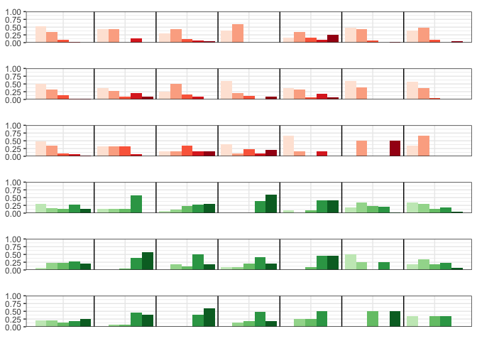<!-- -->

``` r
plot_grid(p7,p8,p9,p10,p11,p12,ncol=1)
```

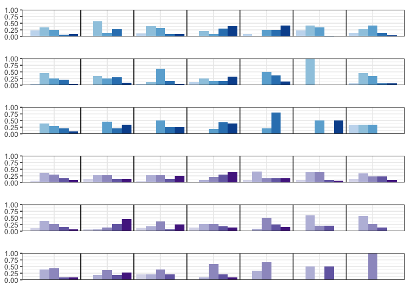<!-- -->

``` r
#plot_grid(p13,p14,p15,ncol=1)
plot_grid(p22,p23,p24,ncol=1)
```

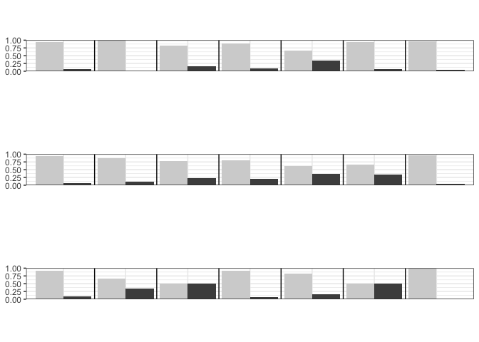<!-- -->

``` r
plot_grid(p16,p17,p18,ncol=1)
```

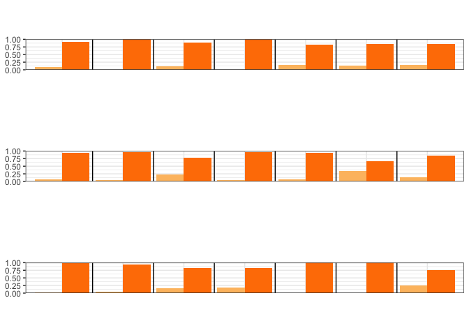<!-- -->

``` r
plot_grid(p19,p20,p21,ncol=1)
```

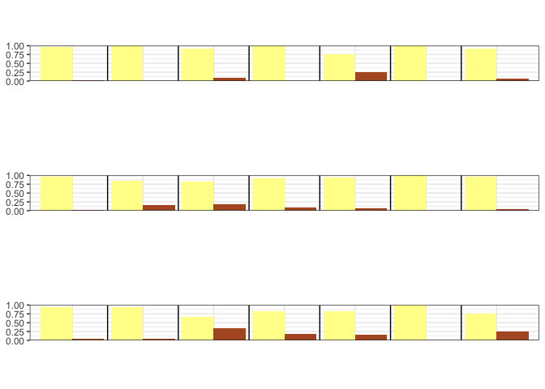<!-- -->

To identify genes and pathways in neutrophils that were associated with
COVID-19 severity, we performed differential gene expression analysis
between severe and non-severe COVID-19 patients for each time point.

``` r
source(paste0(prefix,"Neutrophil_DESeq2.R"))
```

``` r
DESeq2_list <- Neutrophil_DESeq2(counts = Count_filtered, mdata = metadata_filtered, day = "D0", covid = "Positive")
dds <- DESeqDataSetFromMatrix(countData = DESeq2_list$Count_select, colData = DESeq2_list$coldata, design = ~ Neutrophil_total + T_NK_factor + Monocyte_factor + IG_factor + Plasmablast_factor + severity.max)
dds <- DESeq(dds)

res <- as.data.frame(results(dds, name="severity.max_severe_vs_non.severe"))
filenam <- "Day0_COVID+_severe_vs_nonsevere_correct-NeuCont+TNK+Monocyte+Plasmablast+IG"
temp <- genepc[which(genepc$Gene.stable.ID %in% rownames(res)),]
res$symbol <- matrix(0L, nrow = nrow(res))
for (i in 1:nrow(res)){
  if (rownames(res)[i] %in% temp$Gene.stable.ID){
    res$symbol[i] <- temp$Gene.name[which(rownames(res)[i] == temp$Gene.stable.ID)] 
  } else {
    res$symbol[i] <- rownames(res)[i]
  }
}
res$rank <- sign(res$log2FoldChange)*(-1)*log10(res$pvalue)
res <- res[complete.cases(res),]
res_sig <- res[res$padj < 0.05,]
#write.table(res,paste0(prefix,"DESeq2/",filenam,".txt"),sep = "\t")

resordered <- res[order(res$rank),]

log2fc <- as.numeric(resordered$log2FoldChange)
log10p <- as.numeric(-1*log10(resordered$pvalue))
pvalue <- as.numeric(resordered$pvalue)
padj <- resordered$padj
rank <- resordered$rank
symbol <- resordered$symbol
combo <- cbind(log2fc,log10p,padj,pvalue,symbol,rank)
colnames(combo) <- c("log2fc","log10p","padj","pvalue","symbol","rank")
rownames(combo) <- rownames(resordered)
combo <- as.data.frame(combo)
combo$rank <- as.numeric(combo$rank)
combo$log10p <- as.numeric(combo$log10p)
combo$log2fc <- as.numeric(combo$log2fc)
combo$pvalue <- as.numeric(combo$pvalue)
combo$significance <- as.numeric(combo$padj < 0.05)
combo$significance <- as.factor(combo$significance)

combo$color <- 0
combo$color[combo$pvalue < 1e-4 & combo$log2fc > 0.5] <- 1
combo$color[combo$pvalue < 1e-4 & combo$log2fc < -0.5] <- -1

combo$labels <- 0
combo$labels[combo$symbol %in% c("IL1R2","PFKFB2","IL18R1","OLAH","ETS2","IRAK3","IL1R1","ARG1","CD177","SERPINB1","CD55","MCEMP1","TNFAIP3","IL10","S100A12","MMP9","CCL20")] <- 1
combo$labels[combo$symbol %in% c("PLEKHO1","HLA-DMB","HLA-DMA","HLA-DRA","CASS4","HLA-DRB1","CCR3","CCL2","HLA-DQA1","MYCL")] <- 1
combo$labels <- as.factor(combo$labels)

options(ggrepel.max.overlaps = Inf)
my.cols <- brewer.pal(3,"RdBu")
plot1 <- ggplot(combo, aes(x = log2fc, y = log10p)) + geom_point(data = subset(combo, color == 0), colour = "grey") + geom_point(data = subset(combo, color == 1), colour = my.cols[1]) + geom_point(data = subset(combo, color == -1), colour = my.cols[3]) + geom_text_repel(data = subset(combo, labels == 1), aes(label = as.character(symbol)))  + theme_bw() + ylab("-Log10(p-value)") + xlab("Log2(FC)") + annotate("text", x=1.3, y=0, label= "Severe", colour = my.cols[1]) + annotate("text", x=-1.2, y=0, label= "Non-severe", colour = my.cols[3]) + coord_fixed(ratio = .21) + theme(panel.grid = element_blank())
```

**Figure 2E:**

``` r
plot1
```

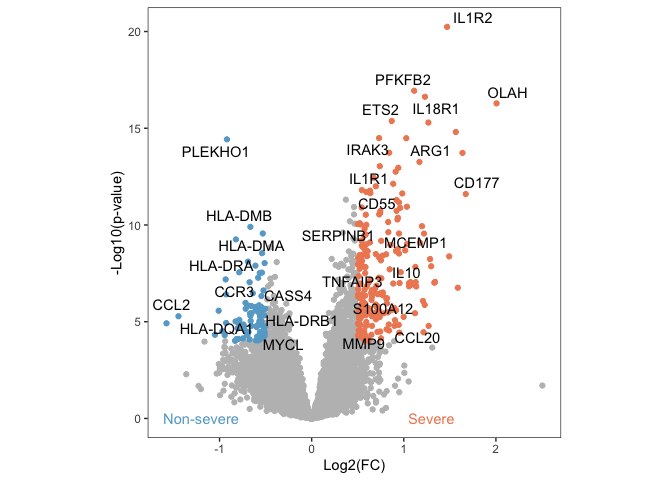<!-- -->

``` r
DESeq2_list <- Neutrophil_DESeq2(counts = Count_filtered, mdata = metadata_filtered, day = "D3", covid = "Positive")
dds <- DESeqDataSetFromMatrix(countData = DESeq2_list$Count_select, colData = DESeq2_list$coldata, design = ~ Neutrophil_total + T_NK_factor + Monocyte_factor + IG_factor + Plasmablast_factor + severity.max)
dds <- DESeq(dds)

res <- as.data.frame(results(dds, name="severity.max_severe_vs_non.severe"))
filenam <- "Day3_COVID+_severe_vs_nonsevere_correct-NeuCont+TNK+Monocyte+Plasmablast+IG"
temp <- genepc[which(genepc$Gene.stable.ID %in% rownames(res)),]
res$symbol <- matrix(0L, nrow = nrow(res))
for (i in 1:nrow(res)){
  if (rownames(res)[i] %in% temp$Gene.stable.ID){
    res$symbol[i] <- temp$Gene.name[which(rownames(res)[i] == temp$Gene.stable.ID)] 
  } else {
    res$symbol[i] <- rownames(res)[i]
  }
}
res$rank <- sign(res$log2FoldChange)*(-1)*log10(res$pvalue)
res <- res[complete.cases(res),]
res_sig <- res[res$padj < 0.05,]
#write.table(res,paste0(prefix,"DESeq2/",filenam,".txt"),sep = "\t")

resordered <- res[order(res$rank),]

log2fc <- as.numeric(resordered$log2FoldChange)
log10p <- as.numeric(-1*log10(resordered$pvalue))
pvalue <- as.numeric(resordered$pvalue)
padj <- resordered$padj
rank <- resordered$rank
symbol <- resordered$symbol
combo <- cbind(log2fc,log10p,padj,pvalue,symbol,rank)
colnames(combo) <- c("log2fc","log10p","padj","pvalue","symbol","rank")
rownames(combo) <- rownames(resordered)
combo <- as.data.frame(combo)
combo$rank <- as.numeric(combo$rank)
combo$log10p <- as.numeric(combo$log10p)
combo$log2fc <- as.numeric(combo$log2fc)
combo$pvalue <- as.numeric(combo$pvalue)
combo$significance <- as.numeric(combo$padj < 0.05)
combo$significance <- as.factor(combo$significance)

combo$color <- 0
combo$color[combo$pvalue < 1e-4 & combo$log2fc > 0.5] <- 1
combo$color[combo$pvalue < 1e-4 & combo$log2fc < -0.5] <- -1

combo$labels <- 0
combo$labels[combo$symbol %in% c("MCEMP1","CD177","FLOT1","GYG1","S100A12","PGS1","ZDHHC19","IL4R","FAM110B","PGD","EXOSC4","SLC2A3","SLC51A","CYSTM1","STXBP2","PYGL","MICAL1","CDK5RAP2","N4BP1")] <- 1
combo$labels[combo$symbol %in% c("FAM117B","PTPN4","HDAC9","ITFG2","NOV","MEF2C","RFTN1","RPGRIP1","ADAM28","PEBP1","TXK","SLC38A1","HLA-DRA","OXNAD1")] <- 1
combo$labels <- as.factor(combo$labels)

options(ggrepel.max.overlaps = Inf)
my.cols <- brewer.pal(3,"RdBu")
plot1 <- ggplot(combo, aes(x = log2fc, y = log10p)) + geom_point(data = subset(combo, color == 0), colour = "grey") + geom_point(data = subset(combo, color == 1), colour = my.cols[1]) + geom_point(data = subset(combo, color == -1), colour = my.cols[3]) + geom_text_repel(data = subset(combo, labels == 1), aes(label = as.character(symbol)))  + theme_bw() + ylab("-Log10(p-value)") + xlab("Log2(FC)") + annotate("text", x=1.3, y=0, label= "Severe", colour = my.cols[1]) + annotate("text", x=-1.2, y=0, label= "Non-severe", colour = my.cols[3]) + coord_fixed(ratio = .21) + theme(panel.grid = element_blank())
```

``` r
DESeq2_list <- Neutrophil_DESeq2(counts = Count_filtered, mdata = metadata_filtered, day = "D7", covid = "Positive")
dds <- DESeqDataSetFromMatrix(countData = DESeq2_list$Count_select, colData = DESeq2_list$coldata, design = ~ Neutrophil_total + T_NK_factor + Monocyte_factor + IG_factor + Plasmablast_factor + severity.max)
dds <- DESeq(dds)

res <- as.data.frame(results(dds, name="severity.max_severe_vs_non.severe"))
filenam <- "Day7_COVID+_severe_vs_nonsevere_correct-NeuCont+TNK+Monocyte+Plasmablast+IG"
temp <- genepc[which(genepc$Gene.stable.ID %in% rownames(res)),]
res$symbol <- matrix(0L, nrow = nrow(res))
for (i in 1:nrow(res)){
  if (rownames(res)[i] %in% temp$Gene.stable.ID){
    res$symbol[i] <- temp$Gene.name[which(rownames(res)[i] == temp$Gene.stable.ID)] 
  } else {
    res$symbol[i] <- rownames(res)[i]
  }
}
res$rank <- sign(res$log2FoldChange)*(-1)*log10(res$pvalue)
res <- res[complete.cases(res),]
res_sig <- res[res$padj < 0.05,]
#write.table(res,paste0(prefix,"DESeq2/",filenam,".txt"),sep = "\t")

resordered <- res[order(res$rank),]

log2fc <- as.numeric(resordered$log2FoldChange)
log10p <- as.numeric(-1*log10(resordered$pvalue))
pvalue <- as.numeric(resordered$pvalue)
padj <- resordered$padj
rank <- resordered$rank
symbol <- resordered$symbol
combo <- cbind(log2fc,log10p,padj,pvalue,symbol,rank)
colnames(combo) <- c("log2fc","log10p","padj","pvalue","symbol","rank")
rownames(combo) <- rownames(resordered)
combo <- as.data.frame(combo)
combo$rank <- as.numeric(combo$rank)
combo$log10p <- as.numeric(combo$log10p)
combo$log2fc <- as.numeric(combo$log2fc)
combo$pvalue <- as.numeric(combo$pvalue)
combo$significance <- as.numeric(combo$padj < 0.05)
combo$significance <- as.factor(combo$significance)

combo$color <- 0
combo$color[combo$pvalue < 1e-4 & combo$log2fc > 0.5] <- 1
combo$color[combo$pvalue < 1e-4 & combo$log2fc < -0.5] <- -1

combo$labels <- 0
combo$labels[combo$symbol %in% c("CDK5RAP2","MCEMP1","GYG1","PFKFB3","AGFG1","ETS2","S100A12","RABGEF1","IRAK2","F3","CD177","FOSL2","VNN1","PKM","NLRP3","TDRD9","CST7")] <- 1
combo$labels[combo$symbol %in% c("CCR3","RPS6KA5","AGAP7P","NOV","DTX4","NLRP1","RPGRIP1","ARRB1","DPEP3","CASS4","MAP7","AGAP4","TIGD3","MGLL","GRAMD1C")] <- 1
combo$labels <- as.factor(combo$labels)

options(ggrepel.max.overlaps = Inf)
my.cols <- brewer.pal(3,"RdBu")
plot2 <- ggplot(combo, aes(x = log2fc, y = log10p)) + geom_point(data = subset(combo, color == 0), colour = "grey") + geom_point(data = subset(combo, color == 1), colour = my.cols[1]) + geom_point(data = subset(combo, color == -1), colour = my.cols[3]) + geom_text_repel(data = subset(combo, labels == 1), aes(label = as.character(symbol)))  + theme_bw() + ylab("-Log10(p-value)") + xlab("Log2(FC)") + annotate("text", x=1.3, y=0, label= "Severe", colour = my.cols[1]) + annotate("text", x=-1.2, y=0, label= "Non-severe", colour = my.cols[3]) + coord_fixed(ratio = .21) + theme(panel.grid = element_blank())
```

**Figure S10A:**

``` r
plot1
```

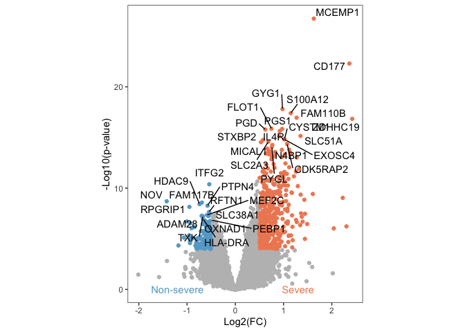<!-- -->

``` r
plot2
```

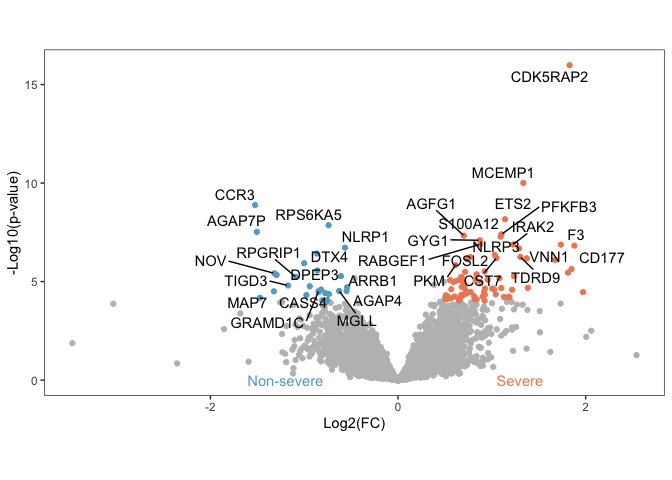<!-- -->

Next we compile neutrophil state gene signatures from previously
published sources to contextualize the differential gene expression
results and to see if any states are enriched in a given disease
outcome. For the NMF gene signatures, we took the top 100 genes per
cluster according to log(fold-change) values. For the ARDS gene
signatures, we took all genes from the microarray data from Juss et
al. which were differentially expressed by at least three-fold between
ARDS blood neutrophils and healthy controls. For the blood and tumor
neutrophils from lung cancer patients from Zillionis et al., we took the
cluster marker selection approach as described in their methods and
capped each list at 100 genes maximum. For the single-cell neutrophil
clusters in COVID-19 from Schulte-Schrepping et al., we filtered the
positive cluster marker genes from Schulte-Schrepping et al. Table S4
Sheet 6 and again capped the lists at 100 genes maximum with ranking
based on p-value. Finally, for the single-cell neutrophil clusters in
the context of sepsis, we utilized publicly available data from Reyes et
al. on the Broad Single Cell Portal and performed clustering in Seurat.

``` r
gene_expression.matrix <- read.csv(paste0(prefix,"Reyes_sepsis_scp_gex_matrix.csv"), header = T, stringsAsFactors = F)
row.names(gene_expression.matrix) <- gene_expression.matrix$GENE
gene_expression.matrix$GENE <- NULL
gene_expression.matrix <- data.matrix(gene_expression.matrix)
gene_expression.matrix <- Matrix(gene_expression.matrix, sparse = T)

sepsis_metadata <- read.table(paste0(prefix,"Reyes_sepsis_scp_meta_fixed.txt"), header = T, sep = "\t")
sepsis_metadata <- sepsis_metadata[-1,]
row.names(sepsis_metadata) <- sepsis_metadata$NAME
sepsis_metadata$NAME <- NULL

merged_seurat <- CreateSeuratObject(counts = gene_expression.matrix, min.features = 100, meta.data = sepsis_metadata)
merged_seurat <- NormalizeData(merged_seurat)
merged_seurat <- FindVariableFeatures(merged_seurat, selection.method = "vst", nfeatures = 2000)
all.genes <- rownames(merged_seurat)
merged_seurat <- ScaleData(merged_seurat, features = all.genes)

merged_seurat <- RunPCA(merged_seurat, features = VariableFeatures(object = merged_seurat))
merged_seurat <- RunUMAP(merged_seurat, dims = 1:40, reduction = "pca")
merged_seurat <- FindNeighbors(object = merged_seurat, 
                               dims = 1:40)
merged_seurat <- FindClusters(object = merged_seurat,
                              resolution = c(0.2, 0.4, 0.6, 0.8))
```

    ## Modularity Optimizer version 1.3.0 by Ludo Waltman and Nees Jan van Eck
    ## 
    ## Number of nodes: 1203
    ## Number of edges: 72088
    ## 
    ## Running Louvain algorithm...
    ## Maximum modularity in 10 random starts: 0.8474
    ## Number of communities: 4
    ## Elapsed time: 0 seconds
    ## Modularity Optimizer version 1.3.0 by Ludo Waltman and Nees Jan van Eck
    ## 
    ## Number of nodes: 1203
    ## Number of edges: 72088
    ## 
    ## Running Louvain algorithm...
    ## Maximum modularity in 10 random starts: 0.7751
    ## Number of communities: 5
    ## Elapsed time: 0 seconds
    ## Modularity Optimizer version 1.3.0 by Ludo Waltman and Nees Jan van Eck
    ## 
    ## Number of nodes: 1203
    ## Number of edges: 72088
    ## 
    ## Running Louvain algorithm...
    ## Maximum modularity in 10 random starts: 0.7224
    ## Number of communities: 6
    ## Elapsed time: 0 seconds
    ## Modularity Optimizer version 1.3.0 by Ludo Waltman and Nees Jan van Eck
    ## 
    ## Number of nodes: 1203
    ## Number of edges: 72088
    ## 
    ## Running Louvain algorithm...
    ## Maximum modularity in 10 random starts: 0.6726
    ## Number of communities: 7
    ## Elapsed time: 0 seconds

``` r
Idents(object = merged_seurat) <- "RNA_snn_res.0.6"
```

We can visualize the clustering results (not included in supplementary
figures):

``` r
DimPlot(merged_seurat,
        reduction = "umap",
        label = TRUE,
        label.size = 6)
```

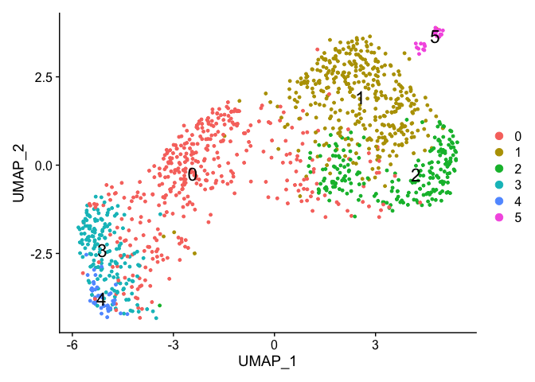<!-- -->

``` r
DimPlot(merged_seurat,
        reduction = "umap",
        label = TRUE,
        split.by = "disease__ontology_label", 
        label.size = 6)
```

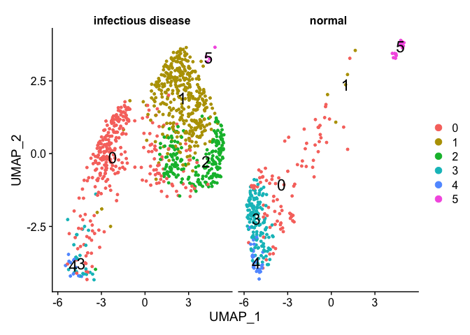<!-- -->

Now we calculate the cluster markers.

``` r
DEG_cluster0 <- FindMarkers(merged_seurat, ident.1 = "0", ident.2 = NULL)
top100genes_C0 <- DEG_cluster0 %>%
  dplyr::filter(p_val_adj < 0.05) %>%
  dplyr::arrange(desc(avg_log2FC)) %>%
  dplyr::slice(1:100)

DEG_cluster1 <- FindMarkers(merged_seurat, ident.1 = "1", ident.2 = NULL)
top100genes_C1 <- DEG_cluster1 %>%
  dplyr::filter(p_val_adj < 0.05) %>%
  dplyr::arrange(desc(avg_log2FC)) %>%
  dplyr::slice(1:100)

DEG_cluster2 <- FindMarkers(merged_seurat, ident.1 = "2", ident.2 = NULL)
top100genes_C2 <- DEG_cluster2 %>%
  dplyr::filter(p_val_adj < 0.05) %>%
  dplyr::arrange(desc(avg_log2FC)) %>%
  dplyr::slice(1:100)

DEG_cluster3 <- FindMarkers(merged_seurat, ident.1 = "3", ident.2 = NULL)
top100genes_C3 <- DEG_cluster3 %>%
  dplyr::filter(p_val_adj < 0.05) %>%
  dplyr::arrange(desc(avg_log2FC)) %>%
  dplyr::slice(1:100)

DEG_cluster4 <- FindMarkers(merged_seurat, ident.1 = "4", ident.2 = NULL)
top100genes_C4 <- DEG_cluster4 %>%
  dplyr::filter(p_val_adj < 0.05) %>%
  dplyr::arrange(desc(avg_log2FC)) %>%
  dplyr::slice(1:100)

DEG_cluster5 <- FindMarkers(merged_seurat, ident.1 = "5", ident.2 = NULL)
top100genes_C5 <- DEG_cluster5 %>%
  dplyr::filter(p_val_adj < 0.05) %>%
  dplyr::arrange(desc(avg_log2FC)) %>%
  dplyr::slice(1:100)
```

Now we have all the gene sets we will use. We first want to get a sense
of how similar these gene sets are to one another, and to this end we
build a network of the overlaps between gene sets.

``` r
gmt.file <- gmtPathways(paste0(prefix,"neutrophil_state_gene_sets.gmt"))

nodelist <- c("ARDS_UP","ARDS_DOWN","HTNEUTRO1","HTNEUTRO2","HTNEUTRO3","HTNEUTRO4","HTNEUTRO5","HBNEUTRO1","HBNEUTRO2","HBNEUTRO3","HBNEUTRO4","HBNEUTRO5","HBNEUTRO6","SCHULTE0","SCHULTE1","SCHULTE2","SCHULTE3","SCHULTE4","SCHULTE5","SCHULTE6","SCHULTE7","SCHULTE8","SEPSIS_C0","SEPSIS_C1","SEPSIS_C2","SEPSIS_C3","SEPSIS_C4","SEPSIS_C5","NMF1","NMF2","NMF3","NMF4","NMF5","NMF6")

edgelist <- matrix(0L, nrow = choose(length(nodelist),2), ncol = 4)
edgelist <- as.data.frame(edgelist)
edgelist[edgelist == 0] <- NA
colnames(edgelist) <- c("node1","node2","jaccard","overlap")
node1 <- rep(nodelist[1],length(nodelist)-1)
for (i in 2:length(nodelist)){
  node1 <- c(node1,rep(nodelist[i],length(nodelist)-i))
}
edgelist$node1 <- node1
node2 <- nodelist[-(1:1)]
for (i in 2:length(nodelist)){
  node2 <- c(node2,nodelist[-(1:i)])
}
edgelist$node2 <- node2

for (i in 1:nrow(edgelist)){
  set1 <- gmt.file[[edgelist$node1[i]]]
  set2 <- gmt.file[[edgelist$node2[i]]]
  intersection <- sum(set1 %in% set2)
  union <- length(set1) + length(set2) - intersection
  edgelist$jaccard[i] <- intersection/union
  edgelist$overlap[i] <- intersection/min(length(set1),length(set2))
}

edgelist <- edgelist[edgelist$jaccard > 0.05,]
nodelist <- nodelist[nodelist %in% c(edgelist$node1,edgelist$node2)]

network <- graph_from_data_frame(d = edgelist[,1:2], directed = F)
deg <- degree(network, mode = "all")

listlengths <- matrix(0L, nrow = length(nodelist), ncol = 1)
nodelist <- cbind(nodelist,listlengths)
nodelist <- as.data.frame(nodelist)
colnames(nodelist) <- c("node","length")
for (i in 1:nrow(nodelist)){
  nodelist$length[i] <- length(gmt.file[[nodelist$node[i]]])
}
degnums <- cbind(names(deg),1:length(deg))
nodelist$degnums <- matrix(0L, nrow = nrow(degnums), ncol = 1)
for (i in 1:nrow(nodelist)){
  nodelist$degnums[i] <- degnums[which(degnums[,1] == nodelist$node[i]),2]
}
nodelist <- nodelist[order(as.numeric(nodelist$degnums)),]
listlengths <- subset(nodelist, select = length)
listlengths <- as.numeric(unlist(listlengths))

myPalette <- colorRampPalette((brewer.pal(9, "RdYlBu")))
sc <- scale_colour_gradientn(colours = rev(myPalette(100)), limits=c(0,max(deg)))
l <- layout_with_fr(network)
V(network)$color <- deg-1
network$palette <- (rev(myPalette(9)))
```

**Figure 2F:**

``` r
plot(network, vertex.size = as.numeric(listlengths)/10, edge.width = edgelist$overlap*5, edge.curved = 0, vertex.label.cex = 0.8, vertex.label.color = "black", vertex.label.dist = -1.2)
```

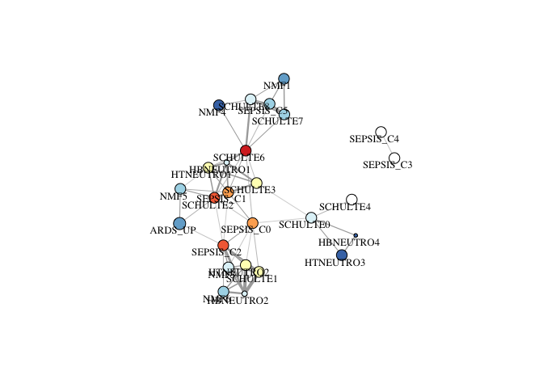<!-- -->

We can also compare the neutrophil gene sets by visualizing the
correlations between the mean z score for the genes in each gene set
across all samples. We convert some of the gene symbols that correspond
to multiple ENSEMBL IDs to the ENSEMBL ID which appears in the TPM
matrix. Some of the genes that were aligned to different genome versions
do not have matches and are excluded.

``` r
gmt.file <- gmtPathways(paste0(prefix,"neutrophil_state_gene_sets.gmt"))
gmt.file[["SEPSIS_C0"]] <- str_replace(gmt.file[["SEPSIS_C0"]],"\\.","-")
gmt.file[["SEPSIS_C1"]] <- str_replace(gmt.file[["SEPSIS_C1"]],"\\.","-")
gmt.file[["SEPSIS_C2"]] <- str_replace(gmt.file[["SEPSIS_C2"]],"\\.","-")
gmt.file[["SEPSIS_C3"]] <- str_replace(gmt.file[["SEPSIS_C3"]],"\\.","-")
gmt.file[["SEPSIS_C4"]] <- str_replace(gmt.file[["SEPSIS_C4"]],"\\.","-")
gmt.file[["SEPSIS_C5"]] <- str_replace(gmt.file[["SEPSIS_C5"]],"\\.","-")

geneids <- matrix(0L, nrow = 113, ncol = length(names(gmt.file)))
colnames(geneids) <- names(gmt.file)
geneids[geneids == 0] <- NA

genepc <- genepc[genepc$Gene.stable.ID %in% rownames(logTPM_filtered),]

for (j in 1:ncol(geneids)){
  for (i in 1:length(gmt.file[[names(gmt.file)[j]]])){
    geneids[i,j] <- gmt.file[[names(gmt.file)[j]]][i]
    if (gmt.file[[names(gmt.file)[j]]][i] %in% genepc$Gene.name){
      id <- genepc$Gene.stable.ID[which(genepc$Gene.name == gmt.file[[names(gmt.file)[j]]][i])]
      if (id %in% rownames(logTPM_filtered)){
        geneids[i,j] <- genepc$Gene.stable.ID[which(genepc$Gene.name == gmt.file[[names(gmt.file)[j]]][i])]
      }
    }
  }
}
geneids <- as.data.frame(geneids)
geneids$ARDS_UP[c(49,74,86,91,93)] <- NA
geneids$ARDS_UP[c(90)] <- "ENSG00000172062"
geneids$ARDS_DOWN[c(37,39,67)] <- NA
geneids$ARDS_DOWN[c(6)] <- "ENSG00000159618"
geneids$ARDS_DOWN[c(27)] <- "ENSG00000131203"
geneids$ARDS_DOWN[c(48)] <- "ENSG00000162894"
geneids$HTNEUTRO1[89] <- "ENSG00000184640"
geneids$HTNEUTRO2[c(48,50,57,58,77,86)] <- NA
geneids$HTNEUTRO3[c(31,37,52,74)] <- NA
geneids$HTNEUTRO3[76] <- "ENSG00000227811"
geneids$HTNEUTRO4[c(78,25,33,82)] <- NA
geneids$HTNEUTRO5[71] <- "ENSG00000111640"
geneids$HTNEUTRO5[c(91,3,2)] <- NA
geneids$HBNEUTRO1[14] <- "ENSG00000164104"
geneids$HBNEUTRO1[18] <- "ENSG00000177272"
geneids$HBNEUTRO2[38] <- NA
geneids$HBNEUTRO3[15] <- NA
geneids$HBNEUTRO5[4] <- NA
geneids$HBNEUTRO6[c(2,18,48,29,23,32,25,16,37,6,45)] <- NA
geneids$HBNEUTRO6[9] <- "ENSG00000279891"
geneids$SCHULTE0[88] <- "ENSG00000227811"
geneids$SCHULTE3[68] <- "ENSG00000124172"
geneids$SCHULTE3[47] <- "ENSG00000186205"
geneids$SCHULTE4[8] <- NA
geneids$SCHULTE7[52] <- NA
geneids$SCHULTE8[36] <- "ENSG00000112773"
geneids$NMF1[83] <- "ENSG00000271787"
geneids$NMF1[81] <- "ENSG00000161835"
geneids$NMF1[66] <- "ENSG00000197061"
geneids$NMF1[45] <- "ENSG00000184897"
geneids$NMF2[68] <- "ENSG00000278022"
geneids$NMF2[40] <- "ENSG00000279430"
geneids$NMF2[14] <- "ENSG00000249138"
geneids$NMF2[64] <- "ENSG00000227591"
geneids$NMF3[70] <- "ENSG00000108387"
geneids$NMF3[11] <- "ENSG00000236345"
geneids$NMF3[98] <- "ENSG00000248477"
geneids$NMF3[95] <- "ENSG00000250687"
geneids$NMF3[66] <- "ENSG00000225342"
geneids$NMF4[98] <- "ENSG00000136999"
geneids$NMF4[54] <- "ENSG00000287269"
geneids$NMF5[40] <- "ENSG00000287771"
geneids$NMF5[80] <- "ENSG00000287255"
geneids$NMF5[77] <- "ENSG00000287458"
geneids$NMF5[60] <- "ENSG00000283378"
geneids$NMF5[67] <- "ENSG00000235033"
geneids$NMF5[58] <- "ENSG00000224397"
geneids$NMF5[99] <- "ENSG00000245888"
geneids$NMF5[76] <- "ENSG00000135842"
geneids$NMF6[29] <- "ENSG00000272821"
geneids$NMF6[25] <- "ENSG00000263069"
geneids$NMF6[8] <- "ENSG00000133321"
geneids$NMF6[72] <- "ENSG00000197536"
geneids$NMF6[34] <- "ENSG00000287299"
geneids$NMF6[94] <- "ENSG00000237781"
geneids$NMF6[27] <- "ENSG00000228318"
geneids$NMF6[13] <- "ENSG00000224891"
geneids$SEPSIS_C0[c(2,4,8,36,42,43,73,93,94)] <- NA
geneids$SEPSIS_C0[15] <- "ENSG00000198408"
geneids$SEPSIS_C0[19] <- "ENSG00000180448"
geneids$SEPSIS_C1[c(10,23,40,47,48,52,66,84,90)] <- NA
geneids$SEPSIS_C1[21] <- "ENSG00000189159"
geneids$SEPSIS_C1[79] <- "ENSG00000155099"
geneids$SEPSIS_C2[c(64,68,91)] <- NA
geneids$SEPSIS_C2[58] <- "ENSG00000265531"
geneids$SEPSIS_C2[69] <- "ENSG00000137767"
geneids$SEPSIS_C3[c(8,11,13,14,15,16,17,18,20,21,28,36,44,51,53,56,57,69,75,78,81,87,88,90,91,94,97,99)] <- NA
geneids$SEPSIS_C3[45] <- "ENSG00000074696"
geneids$SEPSIS_C3[72] <- "ENSG00000131944"
geneids$SEPSIS_C3[84] <- "ENSG00000141934"
geneids$SEPSIS_C4[c(1,2,5,7,9,10,14,16,17,18,21,29,34,37,44,55,57,63,66,69,73,74,77,79,80,84,86,95)] <- NA
geneids$SEPSIS_C4[39] <- "ENSG00000152234"
geneids$SEPSIS_C4[43] <- "ENSG00000188596"
geneids$SEPSIS_C4[51] <- "ENSG00000174749"
geneids$SEPSIS_C4[59] <- "ENSG00000180488"
geneids$SEPSIS_C4[92] <- "ENSG00000141696"
geneids$SEPSIS_C5[c(24,33,45,77)] <- NA
geneids$SEPSIS_C5[72] <- "ENSG00000154518"

cormatrix <- matrix(0L, nrow = ncol(geneids), ncol = ncol(geneids))
pmatrix <- matrix(0L, nrow = ncol(geneids), ncol = ncol(geneids))
rownames(cormatrix) <- rownames(pmatrix) <- colnames(geneids)
colnames(cormatrix) <- colnames(pmatrix) <- colnames(geneids)

scorematrix <- matrix(0L, nrow = nrow(metadata_filtered), ncol = ncol(geneids))
rownames(scorematrix) <- rownames(metadata_filtered)
colnames(scorematrix) <- colnames(geneids)

for (i in 1:ncol(scorematrix)){
    tab <- logTPM_filtered[rownames(logTPM_filtered) %in% geneids[,i],]
    tab_z <- apply(tab,1,scale)
    tab_z <- t(tab_z)
    group1_meanz <- as.numeric(colMeans(tab_z))
    scorematrix[,i] <- group1_meanz
}

for (i in 1:nrow(cormatrix)){
  for (j in 1:nrow(cormatrix)){
    tab <- logTPM_filtered[rownames(logTPM_filtered) %in% geneids[,i],]
    tab_z <- apply(tab,1,scale)
    tab_z <- t(tab_z)
    group1_meanz <- as.numeric(colMeans(tab_z))
    
    tab <- logTPM_filtered[rownames(logTPM_filtered) %in% geneids[,j],]
    tab_z <- apply(tab,1,scale)
    tab_z <- t(tab_z)
    group2_meanz <- as.numeric(colMeans(tab_z))
    
    stats <- cor.test(x = group1_meanz, y = group2_meanz, use = "pairwise.complete.obs", method = "pearson")
    cormatrix[i,j] <- stats$estimate
    pmatrix[i,j] <- stats$p.value
  }
}

ptable <- matrix(0L, nrow = nrow(pmatrix)^2, ncol = 3)
colnames(ptable) <- c("Row","Column","pvalue")
ptable[,1] <- rep(colnames(pmatrix), each = nrow(pmatrix))
ptable[,2] <- rep(colnames(pmatrix), nrow(pmatrix))
for (i in 1:nrow(ptable)){
  ptable[i,3] <- pmatrix[rownames(pmatrix) %in% ptable[i,1],colnames(pmatrix) %in% ptable[i,2]]
}
ptable <- as.data.frame(ptable[complete.cases(ptable[,3]),])
ptable$fdr <- p.adjust(ptable[,3], method = "fdr")
ptable <- ptable[ptable[,4] < 0.05,]

cormatrix <- cormatrix[rownames(cormatrix) %in% unique(c(ptable[,1],ptable[,2])),colnames(cormatrix) %in% unique(c(ptable[,1],ptable[,2]))]
pmatrix <- pmatrix[rownames(pmatrix) %in% unique(c(ptable[,1],ptable[,2])),colnames(pmatrix) %in% unique(c(ptable[,1],ptable[,2]))]
```

**Figure S10B:**

``` r
corrplot(cormatrix, method = "square", type = "lower", order = "hclust", hclust.method = "ward.D", tl.col="black", col=colorRampPalette(c("blue","white","red"))(200), p.mat = pmatrix, sig.level = 0.05, insig = "blank")
```

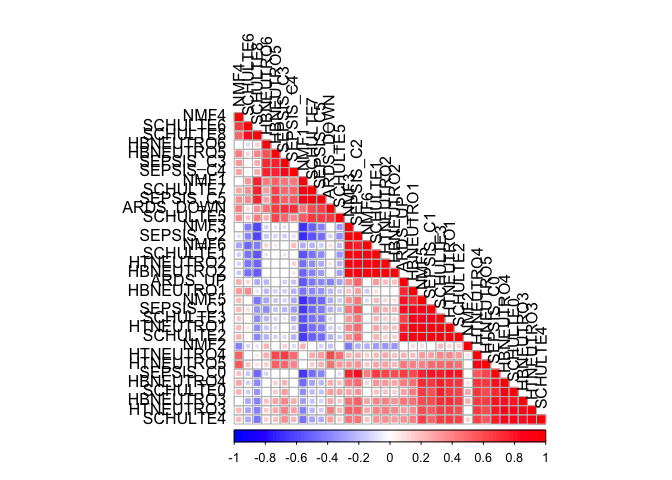<!-- -->

Now that we have our neutrophil gene sets and differentially expressed
gene lists, we can do GSEA on the results. We begin with the pathways.

``` r
gmt.file <- gmtPathways(paste0(prefix,"all_gene_sets.gmt"))
res0 <- read.xlsx(paste0(prefix,"Tables/TableS2.xlsx"), sheet = 5)
res3 <- read.xlsx(paste0(prefix,"Tables/TableS2.xlsx"), sheet = 8)
res7 <- read.xlsx(paste0(prefix,"Tables/TableS2.xlsx"), sheet = 11)

ranking0 <- res0[,"rank"]
names(ranking0) <- res0$symbol
set.seed(15001)
fgseaRes0 <- fgsea(pathways = gmt.file, 
                  stats = ranking0,
                  minSize=25,
                  maxSize=1000,
                  eps = 0)
#write.table(fgseaRes0[,1:7], file = paste0(prefix,"GSEA_",filenam,".txt"), sep = "\t")

ranking3 <- res3[,"rank"]
names(ranking3) <- res3$symbol
set.seed(15001)
fgseaRes3 <- fgsea(pathways = gmt.file, 
                  stats = ranking3,
                  minSize=25,
                  maxSize=1000,
                  eps = 0)
#write.table(fgseaRes[,1:7], file = paste0(prefix,"GSEA_",filenam,".txt"), sep = "\t")

ranking7 <- res7[,"rank"]
names(ranking7) <- res7$symbol
set.seed(15001)
fgseaRes7 <- fgsea(pathways = gmt.file, 
                  stats = ranking7,
                  minSize=25,
                  maxSize=1000,
                  eps = 0)
#write.table(fgseaRes[,1:7], file = paste0(prefix,"GSEA_",filenam,".txt"), sep = "\t")

pathways_to_show <- c("ARDS_UP_JUSS","REACTOME_NEUTROPHIL_DEGRANULATION","GO_MYELOID_LEUKOCYTE_ACTIVATION","HALLMARK_HYPOXIA","HALLMARK_TNFA_SIGNALING_VIA_NFKB","HALLMARK_IL6_JAK_STAT3_SIGNALING","HALLMARK_INFLAMMATORY_RESPONSE","GO_REACTIVE_OXYGEN_SPECIES_METABOLIC_PROCESS","GO_NEUTROPHIL_MIGRATION","HALLMARK_COMPLEMENT","HALLMARK_COAGULATION","HALLMARK_APOPTOSIS","HALLMARK_E2F_TARGETS","GO_REGULATION_OF_HISTONE_MODIFICATION","GO_TRANSLATIONAL_INITIATION","HALLMARK_NOTCH_SIGNALING","GO_DNA_REPLICATION","GO_HETEROCHROMATIN_ORGANIZATION","HALLMARK_MYC_TARGETS_V1","HALLMARK_MYC_TARGETS_V2","GO_RIBOSOME_BIOGENESIS","GO_ANTIGEN_PROCESSING_AND_PRESENTATION_OF_PEPTIDE_ANTIGEN","GO_COTRANSLATIONAL_PROTEIN_TARGETING_TO_MEMBRANE","ARDS_DOWN_JUSS")
gsea_results0 <- fgseaRes0[fgseaRes0$pathway %in% pathways_to_show,]
gsea_results0 <- gsea_results0[,c(1,2,6)]
gsea_results0$Day <- "D0"
gsea_results3 <- fgseaRes3[fgseaRes3$pathway %in% pathways_to_show,]
gsea_results3 <- gsea_results3[,c(1,2,6)]
gsea_results3$Day <- "D3"
gsea_results7 <- fgseaRes7[fgseaRes7$pathway %in% pathways_to_show,]
gsea_results7 <- gsea_results7[,c(1,2,6)]
gsea_results7$Day <- "D7"

gsea_results <- rbind(gsea_results0,gsea_results3,gsea_results7)
gsea_results <- gsea_results[-c(9,34,59),] #Neutrophil migration appears twice
gsea_results$pathwayMean <- NA
for (i in 1:nrow(gsea_results)){
  gsea_results$pathwayMean[i] <- mean(gsea_results$NES[gsea_results$pathway == gsea_results$pathway[i]])
}
fgseaordered <- gsea_results[rev(order(gsea_results$pathwayMean)),]
gsea_results <- gsea_results %>%
  arrange(factor(pathway, levels = fgseaordered$pathway[!duplicated(fgseaordered$pathway)]))

gsea_results$number <- rev(rep((1:(length(pathways_to_show)))*2,each = 3))
gsea_results$logp <- -log10(gsea_results$pval)
gsea_results$logp[gsea_results$logp < -log10(0.05)] <- NA
gsea_results$NES <- -1*gsea_results$NES

p1 <- ggplot(gsea_results, aes(x = Day, y = number)) + geom_point(aes(size = logp, fill = NES), alpha = 0.75, shape = 21) + scale_size_continuous(limits = c(0, 50), range = c(1,5.5), breaks = c(1,10,30,50)) + scale_fill_gradient(low = "red", high = "blue") + coord_fixed(ratio = .4) + theme_bw()
```

**Figure 2G:**

``` r
p1
```

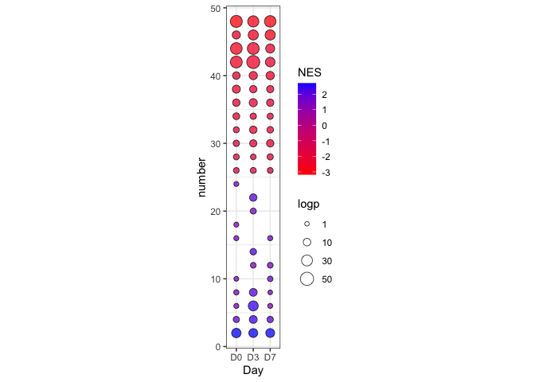<!-- -->

``` r
gmt.file <- gmtPathways(paste0(prefix,"neutrophil_state_gene_sets_ensembl.gmt"))
res0 <- read.xlsx(paste0(prefix,"Tables/TableS2.xlsx"), sheet = 5)
res3 <- read.xlsx(paste0(prefix,"Tables/TableS2.xlsx"), sheet = 8)
res7 <- read.xlsx(paste0(prefix,"Tables/TableS2.xlsx"), sheet = 11)

ranking0 <- res0[,"rank"]
names(ranking0) <- res0$Gene.ID
set.seed(15001)
fgseaRes0 <- fgsea(pathways = gmt.file, 
                  stats = ranking0,
                  minSize=25,
                  maxSize=1000,
                  eps = 0)
#write.table(fgseaRes0[,1:7], file = paste0(prefix,"GSEA_",filenam,".txt"), sep = "\t")

ranking3 <- res3[,"rank"]
names(ranking3) <- res3$Gene.ID
set.seed(15001)
fgseaRes3 <- fgsea(pathways = gmt.file, 
                  stats = ranking3,
                  minSize=25,
                  maxSize=1000,
                  eps = 0)
#write.table(fgseaRes[,1:7], file = paste0(prefix,"GSEA_",filenam,".txt"), sep = "\t")

ranking7 <- res7[,"rank"]
names(ranking7) <- res7$Gene.ID
set.seed(15001)
fgseaRes7 <- fgsea(pathways = gmt.file, 
                  stats = ranking7,
                  minSize=25,
                  maxSize=1000,
                  eps = 0)
#write.table(fgseaRes[,1:7], file = paste0(prefix,"GSEA_",filenam,".txt"), sep = "\t")

gsea_results0 <- fgseaRes0[,c(1,2,6)]
gsea_results0$Day <- "D0"
gsea_results3 <- fgseaRes3[,c(1,2,6)]
gsea_results3$Day <- "D3"
gsea_results7 <- fgseaRes7[,c(1,2,6)]
gsea_results7$Day <- "D7"

gsea_results <- rbind(gsea_results0,gsea_results3,gsea_results7)
gsea_results$pathwayMean <- NA
for (i in 1:nrow(gsea_results)){
  gsea_results$pathwayMean[i] <- mean(gsea_results$NES[gsea_results$pathway == gsea_results$pathway[i]])
}
fgseaordered <- gsea_results[rev(order(gsea_results$pathwayMean)),]
gsea_results <- gsea_results %>%
  arrange(factor(pathway, levels = fgseaordered$pathway[!duplicated(fgseaordered$pathway)]))

gsea_results$number <- rev(rep((1:(length(fgseaordered$pathway[!duplicated(fgseaordered$pathway)])))*2,each = 3))
gsea_results$logp <- -log10(gsea_results$pval)
gsea_results$logp[gsea_results$logp < -log10(0.05)] <- NA
gsea_results$NES <- -1*gsea_results$NES

p1 <- ggplot(gsea_results, aes(x = Day, y = number)) + geom_point(aes(size = logp, fill = NES), alpha = 0.75, shape = 21) + scale_size_continuous(limits = c(0, 53), range = c(1,5.5), breaks = c(1,10,30,50)) + scale_fill_gradient(low = "red", high = "blue") + coord_fixed(ratio = .4) + theme_bw()
```

**Figure 2H:**

``` r
p1
```

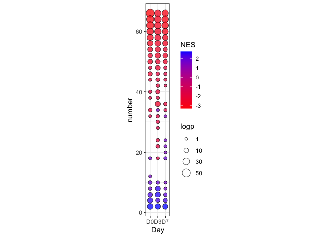<!-- -->

We note that the ARDS neutrophil signatures from Juss et al. are
consistently scoring very strongly.

``` r
getEnrichmentDataframe <- function (pathway, stats, gseaParam = 1, ticksSize = 0.2) {
    rnk <- rank(-stats)
    ord <- order(rnk)
    statsAdj <- stats[ord]
    statsAdj <- sign(statsAdj) * (abs(statsAdj)^gseaParam)
    statsAdj <- statsAdj/max(abs(statsAdj))
    pathway <- unname(as.vector(na.omit(match(pathway, names(statsAdj)))))
    pathway <- sort(pathway)
    gseaRes <- calcGseaStat(statsAdj, selectedStats = pathway, returnAllExtremes = TRUE)
    bottoms <- gseaRes$bottoms
    tops <- gseaRes$tops
    combo <- as.data.frame(cbind(tops,bottoms))
    combo$average <- matrix(0L, nrow = nrow(combo), ncol = 1)
    for (p in 1:nrow(combo)){
      combo$average[p] <- (combo$tops[p]+combo$bottoms[p])/2
    }
    combo <- cbind(combo,pathway)
    return(combo)
}

ARDSpathways <- c("ARDS_UP","ARDS_DOWN")

dataframe0 <- getEnrichmentDataframe(gmt.file[[ARDSpathways[1]]], ranking0)
ARDSdf0 <- cbind(dataframe0$pathway,dataframe0$average,rep(ARDSpathways[1],nrow(dataframe0)))
colnames(ARDSdf0) <- c("rank","enrichment","pathway")
for (i in 2:length(ARDSpathways)){
  dataframe0 <- getEnrichmentDataframe(gmt.file[[ARDSpathways[i]]],
               ranking0)
  temp <- cbind(dataframe0$pathway,dataframe0$average,rep(ARDSpathways[i],nrow(dataframe0)))
  colnames(temp) <- c("rank","enrichment","pathway")
  ARDSdf0 <- rbind(ARDSdf0,temp)
}
dataframe3 <- getEnrichmentDataframe(gmt.file[[ARDSpathways[1]]], ranking3)
ARDSdf3 <- cbind(dataframe3$pathway,dataframe3$average,rep(ARDSpathways[1],nrow(dataframe3)))
colnames(ARDSdf3) <- c("rank","enrichment","pathway")
for (i in 2:length(ARDSpathways)){
  dataframe3 <- getEnrichmentDataframe(gmt.file[[ARDSpathways[i]]],
               ranking3)
  temp <- cbind(dataframe3$pathway,dataframe3$average,rep(ARDSpathways[i],nrow(dataframe3)))
  colnames(temp) <- c("rank","enrichment","pathway")
  ARDSdf3 <- rbind(ARDSdf3,temp)
}
dataframe7 <- getEnrichmentDataframe(gmt.file[[ARDSpathways[1]]], ranking7)
ARDSdf7 <- cbind(dataframe7$pathway,dataframe7$average,rep(ARDSpathways[1],nrow(dataframe7)))
colnames(ARDSdf7) <- c("rank","enrichment","pathway")
for (i in 2:length(ARDSpathways)){
  dataframe7 <- getEnrichmentDataframe(gmt.file[[ARDSpathways[i]]],
               ranking7)
  temp <- cbind(dataframe7$pathway,dataframe7$average,rep(ARDSpathways[i],nrow(dataframe7)))
  colnames(temp) <- c("rank","enrichment","pathway")
  ARDSdf7 <- rbind(ARDSdf7,temp)
}
```

``` r
p1 <- ggplot(as.data.frame(ARDSdf0), aes(x = as.numeric(rank), y = as.numeric(enrichment), colour = pathway)) + geom_point() + theme_bw() + scale_colour_manual(values = c("blue","red")) + coord_fixed(ratio = 10000) + theme(panel.grid.minor = element_blank(), legend.text=element_text(size=6)) + xlab("Rank in Gene List") + ylab("Running Enrichment Score") + ggtitle("ARDS: Day 0")
p2 <- ggplot(as.data.frame(ARDSdf3), aes(x = as.numeric(rank), y = as.numeric(enrichment), colour = pathway)) + geom_point() + theme_bw() + scale_colour_manual(values = c("blue","red")) + coord_fixed(ratio = 10000) + theme(panel.grid.minor = element_blank(), legend.text=element_text(size=6)) + xlab("Rank in Gene List") + ylab("Running Enrichment Score") + ggtitle("ARDS: Day 3")
p3 <- ggplot(as.data.frame(ARDSdf7), aes(x = as.numeric(rank), y = as.numeric(enrichment), colour = pathway)) + geom_point() + theme_bw() + scale_colour_manual(values = c("blue","red")) + coord_fixed(ratio = 10000) + theme(panel.grid.minor = element_blank(), legend.text=element_text(size=6)) + xlab("Rank in Gene List") + ylab("Running Enrichment Score") + ggtitle("ARDS: Day 7")
```

**Figure S11A:**

``` r
p1
```

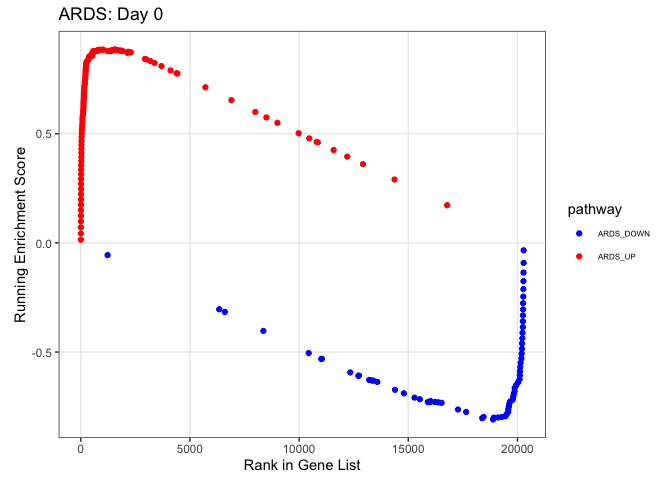<!-- -->

**Figure S11B:**

``` r
p2
```

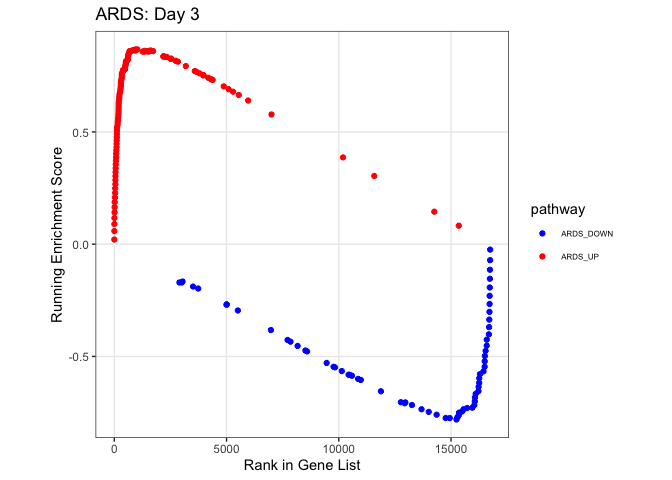<!-- -->

**Figure S11C:**

``` r
p3
```

<!-- -->

We compare the two sources in terms of log(fold-change) values between
severe vs. mild COVID-19 and non-COVID-19 ARDS vs. healthy controls to
search for any unique features. We load in the microarray summary data
from Juss et al.

``` r
gmt.file <- gmtPathways(paste0(prefix,"neutrophil_state_gene_sets.gmt"))
ards_up <- gmt.file[["ARDS_UP"]]
ards_down <- gmt.file[["ARDS_DOWN"]]
ards <- read.xlsx(paste0(prefix,"ARDS_juss_foldchanges.xlsx"))
ards <- ards[,c(2,4,5,6)]
day0 <- res0[,c(3,6,7,8)]
colnames(day0)[colnames(day0) == "log2FoldChange_severe_nonsevere"] <- "log2FoldChange"
day0 <- day0[day0$symbol %in% ards$Symbol,]
day3 <- res3[,c(3,6,7,8)]
colnames(day3)[colnames(day3) == "log2FoldChange_severe_nonsevere"] <- "log2FoldChange"
day3 <- day3[day3$symbol %in% ards$Symbol,]
day7 <- res7[,c(3,6,7,8)]
colnames(day7)[colnames(day7) == "log2FoldChange_severe_nonsevere"] <- "log2FoldChange"
day7 <- day7[day7$symbol %in% ards$Symbol,]
ards <- ards[ards$Symbol %in% day7$symbol,]
ards$sign <- sign(ards$Fold.Change)
ards$log2FoldChange <- log2(abs(ards$Fold.Change))*ards$sign
ards$Day0 <- matrix(0L, nrow = nrow(ards), ncol = 1)
for (i in 1:nrow(ards)){
  ards$Day0[i] <- day0$log2FoldChange[which(day0$symbol == ards$Symbol[i])]
}
ards$Day3 <- matrix(0L, nrow = nrow(ards), ncol = 1)
for (i in 1:nrow(ards)){
  ards$Day3[i] <- day3$log2FoldChange[which(day3$symbol == ards$Symbol[i])]
}
ards$Day7 <- matrix(0L, nrow = nrow(ards), ncol = 1)
for (i in 1:nrow(ards)){
  ards$Day7[i] <- day7$log2FoldChange[which(day7$symbol == ards$Symbol[i])]
}
ards$up <- matrix(0L, nrow = nrow(ards), ncol = 1)
ards$down <- matrix(0L, nrow = nrow(ards), ncol = 1)

for (i in 1:nrow(ards)){
  ards$up[i] <- (ards$Symbol[i] %in% ards_up)*2
  ards$down[i] <- ards$Symbol[i] %in% ards_down
}
ards$color <- ards$up + ards$down

ards$delta0 <- ards$log2FoldChange - ards$Day0
sd0 <- sd(ards$delta0)
ards$delta3 <- ards$log2FoldChange - ards$Day3
sd3 <- sd(ards$delta3)
ards$delta7 <- ards$log2FoldChange - ards$Day7
sd7 <- sd(ards$delta7)

ards$outlier0 <- abs(ards$delta0) > 2*sd0
ards$outlier0 <- ards$outlier0 + 2*(ards$delta0 > 2*sd0)
for (i in 1:nrow(ards)){
  if (ards$outlier0[i] > 0){
    if (ards$Day0[i] > 0){
      ards$outlier0[i] <- ards$outlier0[i] + 1
    }
  }
}
ards$outlier3 <- abs(ards$delta3) > 2*sd3
ards$outlier3 <- ards$outlier3 + 2*(ards$delta3 > 2*sd3)
for (i in 1:nrow(ards)){
  if (ards$outlier3[i] > 0){
    if (ards$Day3[i] > 0){
      ards$outlier3[i] <- ards$outlier3[i] + 1
    }
  }
}
ards$outlier7 <- abs(ards$delta7) > 2*sd7
ards$outlier7 <- ards$outlier7 + 2*(ards$delta7 > 2*sd7)
for (i in 1:nrow(ards)){
  if (ards$outlier7[i] > 0){
    if (ards$Day7[i] > 0){
      ards$outlier7[i] <- ards$outlier7[i] + 1
    }
  }
}

ards$ards_lfc_z <- (ards$log2FoldChange - mean(ards$log2FoldChange))/sd(ards$log2FoldChange)
ards$Day0_z <- (ards$Day0 - mean(ards$Day0))/sd(ards$Day0)
ards$Day3_z <- (ards$Day3 - mean(ards$Day3))/sd(ards$Day3)
ards$Day7_z <- (ards$Day7 - mean(ards$Day7))/sd(ards$Day7)

ards$delta0_z <- ards$ards_lfc_z - ards$Day0_z
ards$delta3_z <- ards$ards_lfc_z - ards$Day3_z
ards$delta7_z <- ards$ards_lfc_z - ards$Day7_z

options(ggrepel.max.overlaps = Inf)
my.cols <- brewer.pal(4,"RdYlBu")
fit <- lm(Day0 ~ log2FoldChange, data = ards)
p1 <- ggplot(ards, aes(x = log2FoldChange, y = Day0)) + geom_point(aes(colour = factor(outlier0))) + geom_smooth(method = "lm", color = "black") + theme_bw() + scale_colour_manual(values = c("grey",my.cols[1],my.cols[2],my.cols[4],my.cols[3])) + geom_vline(xintercept = c(log2(3),-log2(3)),lty = "dashed") + geom_hline(yintercept = 0, lty = "dashed") + geom_text_repel(data = subset(ards, outlier0 > 0), aes(x = log2FoldChange, y = Day0, label = Symbol)) + scale_y_continuous(limits = c(-3,3)) + coord_fixed(ratio = 1.1) + ylab("Day 0 COVIDP, Severe vs. Non-Severe: log2(Fold Change)") + xlab("ARDS vs. Healthy Volunteer: log2(Fold Change)") + annotate(geom="text", x=-1, y=-2.5, label=paste0("R2 = ",summary(fit)$r.squared, "\np = ", summary(fit)$coefficients[2,4]), color="black")
fit <- lm(Day3 ~ log2FoldChange, data = ards)
p2 <- ggplot(ards, aes(x = log2FoldChange, y = Day3)) + geom_point(aes(colour = factor(outlier3))) + geom_smooth(method = "lm", color = "black") + theme_bw() + scale_colour_manual(values = c("grey",my.cols[1],my.cols[2],my.cols[4],my.cols[3])) + geom_vline(xintercept = c(log2(3),-log2(3)),lty = "dashed") + geom_hline(yintercept = 0, lty = "dashed") + geom_text_repel(data = subset(ards, outlier3 > 0), aes(x = log2FoldChange, y = Day3, label = Symbol)) + scale_y_continuous(limits = c(-3,3)) + coord_fixed(ratio = 1.1) + ylab("Day 3 COVIDP, Severe vs. Non-Severe: log2(Fold Change)") + xlab("ARDS vs. Healthy Volunteer: log2(Fold Change)") + annotate(geom="text", x=-1, y=-2.5, label=paste0("R2 = ",summary(fit)$r.squared, "\np = ", summary(fit)$coefficients[2,4]), color="black")
fit <- lm(Day7 ~ log2FoldChange, data = ards)
p3 <- ggplot(ards, aes(x = log2FoldChange, y = Day7)) + geom_point(aes(colour = factor(outlier7))) + geom_smooth(method = "lm", color = "black") + theme_bw() + scale_colour_manual(values = c("grey",my.cols[1],my.cols[2],my.cols[4],my.cols[3])) + geom_vline(xintercept = c(log2(3),-log2(3)),lty = "dashed") + geom_hline(yintercept = 0, lty = "dashed") + geom_text_repel(data = subset(ards, outlier7 > 0), aes(x = log2FoldChange, y = Day7, label = Symbol)) + scale_y_continuous(limits = c(-3,3)) + coord_fixed(ratio = 1.1) + ylab("Day 7 COVIDP, Severe vs. Non-Severe: log2(Fold Change)") + xlab("ARDS vs. Healthy Volunteer: log2(Fold Change)") + annotate(geom="text", x=-1, y=-2.5, label=paste0("R2 = ",summary(fit)$r.squared, "\np = ", summary(fit)$coefficients[2,4]), color="black")
```

**Figure S11D:**

``` r
p1
```

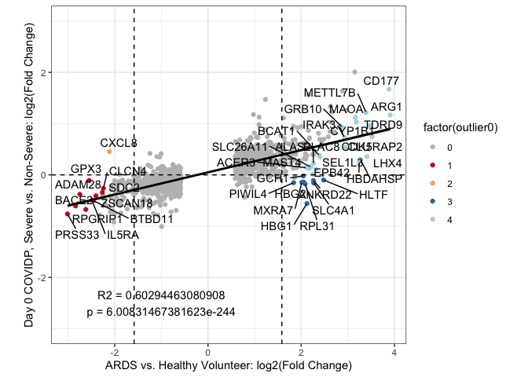<!-- -->

**Figure S11E:**

``` r
p2
```

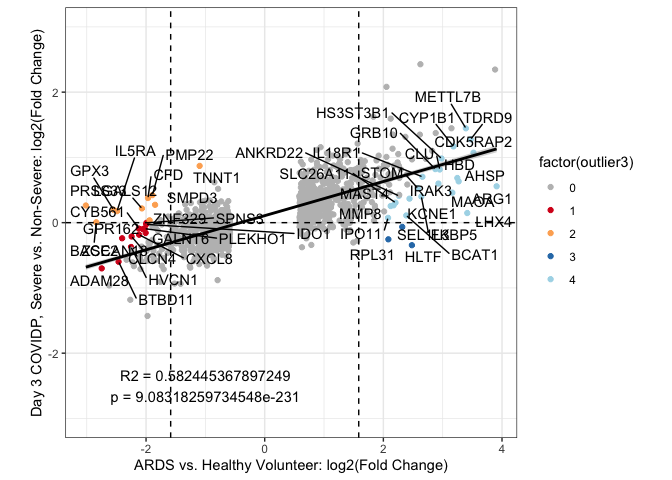<!-- -->

**Figure S11F:**

``` r
p3
```

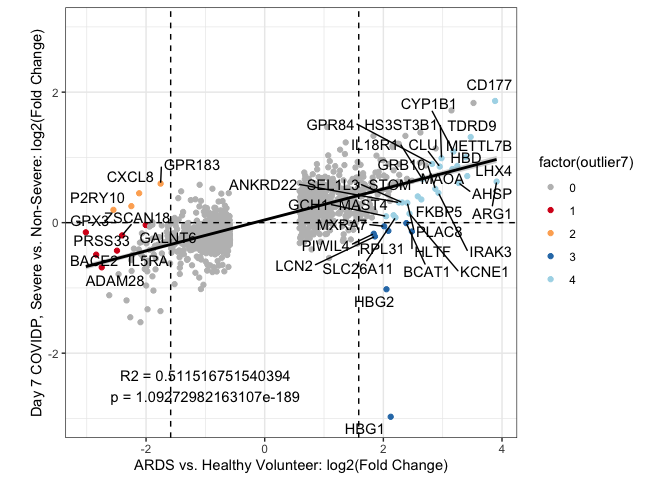<!-- -->

Finally we perform a differential expression analysis on the difference
in log(fold-change) between the two sources of data.

``` r
gmt.file <- gmtPathways(paste0(prefix,"all_gene_sets.gmt"))
ards <- ards[order(ards$delta0_z),]
ranking0 <- ards[,"delta0_z"]
names(ranking0) <- ards$Symbol
set.seed(15001)
fgseaRes0 <- fgsea(pathways = gmt.file, 
                  stats = ranking0,
                  minSize=25,
                  maxSize=1000,
                  eps = 0)

ards <- ards[order(ards$delta3_z),]
ranking3 <- ards[,"delta3_z"]
names(ranking3) <- ards$Symbol
set.seed(15001)
fgseaRes3 <- fgsea(pathways = gmt.file, 
                  stats = ranking3,
                  minSize=25,
                  maxSize=1000,
                  eps = 0)

ards <- ards[order(ards$delta7_z),]
ranking7 <- ards[,"delta7_z"]
names(ranking7) <- ards$Symbol
set.seed(15001)
fgseaRes7 <- fgsea(pathways = gmt.file, 
                  stats = ranking7,
                  minSize=25,
                  maxSize=1000,
                  eps = 0)

pathways_to_show <- c("ARDS_UP_JUSS","ARDS_DOWN_JUSS","GO_CATION_TRANSPORT","GO_INORGANIC_ION_TRANSMEMBRANE_TRANSPORT","GO_ION_HOMEOSTASIS","GO_METAL_ION_TRANSPORT","HALLMARK_HEME_METABOLISM")

gsea_results0 <- fgseaRes0[,c(1,2,6)]
gsea_results0 <- gsea_results0[gsea_results0$pathway %in% pathways_to_show]
gsea_results0$Day <- "D0"
gsea_results3 <- fgseaRes3[,c(1,2,6)]
gsea_results3 <- gsea_results3[gsea_results3$pathway %in% pathways_to_show]
gsea_results3$Day <- "D3"
gsea_results7 <- fgseaRes7[,c(1,2,6)]
gsea_results7 <- gsea_results7[gsea_results7$pathway %in% pathways_to_show]
gsea_results7$Day <- "D7"

gsea_results <- rbind(gsea_results0,gsea_results3,gsea_results7)
gsea_results$pathwayMean <- NA
for (i in 1:nrow(gsea_results)){
  gsea_results$pathwayMean[i] <- mean(gsea_results$NES[gsea_results$pathway == gsea_results$pathway[i]])
}
fgseaordered <- gsea_results[rev(order(gsea_results$pathwayMean)),]
gsea_results <- gsea_results %>%
  arrange(factor(pathway, levels = fgseaordered$pathway[!duplicated(fgseaordered$pathway)]))

gsea_results$number <- rev(rep((1:(length(fgseaordered$pathway[!duplicated(fgseaordered$pathway)])))*2,each = 3))
gsea_results$logp <- -log10(gsea_results$pval)
gsea_results$logp[gsea_results$logp < -log10(0.05)] <- NA

p1 <- ggplot(gsea_results, aes(x = Day, y = number)) + geom_point(aes(size = logp, fill = NES), alpha = 0.75, shape = 21) + scale_size_continuous(limits = c(0, 11), range = c(1,5.5), breaks = c(1,5,10)) + scale_fill_gradient(low = "red", high = "blue") + coord_fixed(ratio = .4) + theme_bw()
```

**Figure S11G:**

``` r
p1
```

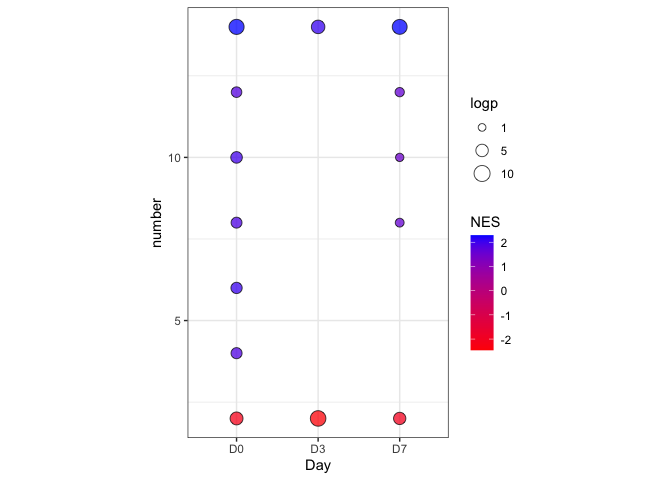<!-- -->

``` r
sessionInfo()
```

    ## R version 4.1.1 (2021-08-10)
    ## Platform: x86_64-apple-darwin17.0 (64-bit)
    ## Running under: macOS Big Sur 10.16
    ## 
    ## Matrix products: default
    ## BLAS:   /Library/Frameworks/R.framework/Versions/4.1/Resources/lib/libRblas.0.dylib
    ## LAPACK: /Library/Frameworks/R.framework/Versions/4.1/Resources/lib/libRlapack.dylib
    ## 
    ## locale:
    ## [1] en_US.UTF-8/en_US.UTF-8/en_US.UTF-8/C/en_US.UTF-8/en_US.UTF-8
    ## 
    ## attached base packages:
    ## [1] parallel  stats4    stats     graphics  grDevices utils     datasets 
    ## [8] methods   base     
    ## 
    ## other attached packages:
    ##  [1] corrplot_0.90               stringr_1.4.0              
    ##  [3] igraph_1.2.6                RCurl_1.98-1.4             
    ##  [5] scales_1.1.1                Matrix_1.3-4               
    ##  [7] SingleCellExperiment_1.14.1 Nebulosa_1.2.0             
    ##  [9] patchwork_1.1.1             ggalluvial_0.12.3          
    ## [11] SeuratObject_4.0.2          Seurat_4.0.4               
    ## [13] pheatmap_1.0.12             ggpubr_0.4.0               
    ## [15] fgsea_1.18.0                cowplot_1.1.1              
    ## [17] openxlsx_4.2.4              DESeq2_1.32.0              
    ## [19] SummarizedExperiment_1.22.0 Biobase_2.52.0             
    ## [21] MatrixGenerics_1.4.3        matrixStats_0.60.1         
    ## [23] GenomicRanges_1.44.0        GenomeInfoDb_1.28.2        
    ## [25] IRanges_2.26.0              S4Vectors_0.30.0           
    ## [27] BiocGenerics_0.38.0         dplyr_1.0.7                
    ## [29] plyr_1.8.6                  RColorBrewer_1.1-2         
    ## [31] ggrepel_0.9.1               ggplot2_3.3.5              
    ## [33] knitr_1.33                 
    ## 
    ## loaded via a namespace (and not attached):
    ##   [1] utf8_1.2.2             reticulate_1.20        ks_1.13.2             
    ##   [4] tidyselect_1.1.1       RSQLite_2.2.8          AnnotationDbi_1.54.1  
    ##   [7] htmlwidgets_1.5.3      grid_4.1.1             BiocParallel_1.26.2   
    ##  [10] Rtsne_0.15             munsell_0.5.0          codetools_0.2-18      
    ##  [13] ica_1.0-2              future_1.22.1          miniUI_0.1.1.1        
    ##  [16] withr_2.4.2            colorspace_2.0-2       highr_0.9             
    ##  [19] ROCR_1.0-11            ggsignif_0.6.2         tensor_1.5            
    ##  [22] listenv_0.8.0          labeling_0.4.2         GenomeInfoDbData_1.2.6
    ##  [25] polyclip_1.10-0        bit64_4.0.5            farver_2.1.0          
    ##  [28] parallelly_1.27.0      vctrs_0.3.8            generics_0.1.0        
    ##  [31] xfun_0.25              R6_2.5.1               locfit_1.5-9.4        
    ##  [34] bitops_1.0-7           spatstat.utils_2.2-0   cachem_1.0.6          
    ##  [37] DelayedArray_0.18.0    assertthat_0.2.1       promises_1.2.0.1      
    ##  [40] gtable_0.3.0           globals_0.14.0         goftest_1.2-2         
    ##  [43] rlang_0.4.11           genefilter_1.74.0      splines_4.1.1         
    ##  [46] rstatix_0.7.0          lazyeval_0.2.2         spatstat.geom_2.2-2   
    ##  [49] broom_0.7.9            yaml_2.2.1             reshape2_1.4.4        
    ##  [52] abind_1.4-5            backports_1.2.1        httpuv_1.6.2          
    ##  [55] tools_4.1.1            ellipsis_0.3.2         spatstat.core_2.3-0   
    ##  [58] ggridges_0.5.3         Rcpp_1.0.7             zlibbioc_1.38.0       
    ##  [61] purrr_0.3.4            rpart_4.1-15           deldir_0.2-10         
    ##  [64] pbapply_1.4-3          zoo_1.8-9              haven_2.4.3           
    ##  [67] cluster_2.1.2          magrittr_2.0.1         RSpectra_0.16-0       
    ##  [70] data.table_1.14.0      scattermore_0.7        lmtest_0.9-38         
    ##  [73] RANN_2.6.1             mvtnorm_1.1-2          fitdistrplus_1.1-5    
    ##  [76] hms_1.1.0              mime_0.11              evaluate_0.14         
    ##  [79] xtable_1.8-4           XML_3.99-0.7           rio_0.5.27            
    ##  [82] mclust_5.4.7           readxl_1.3.1           gridExtra_2.3         
    ##  [85] compiler_4.1.1         tibble_3.1.4           KernSmooth_2.23-20    
    ##  [88] crayon_1.4.1           htmltools_0.5.2        mgcv_1.8-36           
    ##  [91] later_1.3.0            tidyr_1.1.3            geneplotter_1.70.0    
    ##  [94] DBI_1.1.1              MASS_7.3-54            car_3.0-11            
    ##  [97] forcats_0.5.1          pkgconfig_2.0.3        foreign_0.8-81        
    ## [100] plotly_4.9.4.1         spatstat.sparse_2.0-0  annotate_1.70.0       
    ## [103] XVector_0.32.0         digest_0.6.27          sctransform_0.3.2     
    ## [106] RcppAnnoy_0.0.19       pracma_2.3.3           spatstat.data_2.1-0   
    ## [109] Biostrings_2.60.2      rmarkdown_2.10         cellranger_1.1.0      
    ## [112] leiden_0.3.9           fastmatch_1.1-3        uwot_0.1.10           
    ## [115] curl_4.3.2             shiny_1.6.0            lifecycle_1.0.0       
    ## [118] nlme_3.1-152           jsonlite_1.7.2         carData_3.0-4         
    ## [121] limma_3.48.3           viridisLite_0.4.0      fansi_0.5.0           
    ## [124] pillar_1.6.2           lattice_0.20-44        KEGGREST_1.32.0       
    ## [127] fastmap_1.1.0          httr_1.4.2             survival_3.2-13       
    ## [130] glue_1.4.2             zip_2.2.0              png_0.1-7             
    ## [133] bit_4.0.4              stringi_1.7.4          blob_1.2.2            
    ## [136] memoise_2.0.0          irlba_2.3.3            future.apply_1.8.1
