Figure3\_S12-S13
================
Tom LaSalle

This document contains all the code necessary to generate the plots for
Figure 3 and related supplementary figures (S12-S13). Plots are
subsequently edited in Adobe Illustrator to produce the final figures.

Load the necessary libraries:

``` r
library(knitr)
library(ggplot2)
library(ggrepel)
library(RColorBrewer)
library(plyr)
library(dplyr)
library(DESeq2)
library(openxlsx)
library(cowplot)
library(fgsea)
library(inflection)
library(ggpubr)
library(lmtest)
library(pROC)
library(sjPlot)
library(sjlabelled)
library(sjmisc)
library(heatmap3)
library(caret)
library(glmnet)
```

Load in the data:

``` r
prefix <- "~/Downloads/Github/"
metadata_long <- read.xlsx(paste0(prefix,"Tables/TableS1.xlsx"), sheet = 4)
Count <- read.xlsx(paste0(prefix,"Tables/TableS1.xlsx"), sheet = 7, rowNames = TRUE)
TPM <- read.xlsx(paste0(prefix,"Tables/TableS1.xlsx"), sheet = 8, rowNames = TRUE)
qc_data <- read.xlsx(paste0(prefix,"Tables/TableS1.xlsx"), sheet = 9)
genomic_signatures <- read.xlsx(paste0(prefix,"Tables/TableS1.xlsx"), sheet = 10)
genepc <- read.delim(paste0(prefix,"Ensembl_to_Symbol.txt"))
logTPM <- log2(TPM + 1)

metadata_long <- metadata_long[which(metadata_long$Public.ID %in% qc_data$Public.ID),]
metadata_long <- merge(metadata_long, qc_data)
rownames(metadata_long) <- metadata_long$Public.Sample.ID

metadata_filtered <- metadata_long[metadata_long$percent.mt < 20 & metadata_long$Genes.Detected > 10000 & metadata_long$Median.Exon.CV < 1 & metadata_long$Exon.CV.MAD < 0.75 & metadata_long$Exonic.Rate*100 > 25 & metadata_long$Median.3..bias < 0.9,]

logTPM_filtered <- logTPM[,colnames(logTPM) %in% rownames(metadata_filtered)]
TPM_filtered <- TPM[,colnames(TPM) %in% rownames(metadata_filtered)]
Count_filtered <- Count[,colnames(Count) %in% rownames(metadata_filtered)]

tf <- rowSums(TPM_filtered > 0.1) > ncol(TPM_filtered)*.2
TPM_filtered <- TPM_filtered[tf,]
Count_filtered <- Count_filtered[tf,]
logTPM_filtered <- logTPM_filtered[tf,]
tf <- rowSums(Count_filtered >= 6) > ncol(Count_filtered)*.2
TPM_filtered <- TPM_filtered[tf,]
Count_filtered <- Count_filtered[tf,]
logTPM_filtered <- logTPM_filtered[tf,]

rownames(genomic_signatures) <- genomic_signatures$Public.Sample.ID
metadata_filtered <- merge(metadata_filtered, genomic_signatures)
rownames(metadata_filtered) <- metadata_filtered$Public.Sample.ID
metadata_filtered$COVID <- mapvalues(metadata_filtered$COVID, from = c(0,1), to = c("Negative","Positive"))

# Color Palette
vermillion <- rgb(213,94,0,max=255)
bluishgreen <- rgb(0,158,115,max=255)
yellow <- rgb(240,228,66,max=255)
blue <- rgb(0,114,178,max=255)
orange <- rgb(230,159,0,max=255)
skyblue <- rgb(86,180,233,max=255)
lightgray <- rgb(211,211,211,max=255)
```

We begin by exploring the differences between the two immature
neutrophil subtypes (NMF1 and NMF4) by differential expression and gene
set enrichment analysis on Days 0, 3, and 7. Day 7 is included in the
main figure as the NMF analysis highlighted the greatest difference in
severity classification at this time point.

DESeq2 includes built-in filters for lowly expressed genes, but we have
found that there are sometimes still some outliers that have low counts
in too many samples. Therefore at the beginning of each NMF differential
expression analysis, we plot a curve: on the x axis, we plot the number
*x* of samples required to have at least 5 counts per gene, and on the y
axis, we plot the number of genes that pass this filter. We take the
inflection point of this curve as the number of samples needing at least
5 counts to keep the gene.

``` r
source(paste0(prefix,"Neutrophil_DESeq2.R"))
```

Day 0:

``` r
DESeq2_list <- Neutrophil_DESeq2(counts = Count_filtered, mdata = metadata_filtered, covid = "Positive", day = "D0", cluster = c(1,4))
dds <- DESeqDataSetFromMatrix(countData = DESeq2_list$Count_select, colData = DESeq2_list$coldata, design = ~ Neutrophil_total + T_NK_factor + Monocyte_factor + IG_factor + Plasmablast_factor + cluster_neuhi)
dds <- estimateSizeFactors(dds)
genenums <- as.data.frame(matrix(0L, nrow = 201, ncol = 2))
colnames(genenums) <- c("idx","genenum5")
genenums$idx <- 0:200
for (i in 1:nrow(genenums)){
  idx <- rowSums( counts(dds, normalized=TRUE) >= 5 ) >= i-1
  genenums$genenum5[i] <- sum(idx)
}
genenums <- genenums[genenums$genenum5 < 20000,]
genenums <- genenums[genenums$genenum5 != 0,]
cc <- bese(genenums$idx,genenums$genenum5,0)
ee <- bede(genenums$idx,genenums$genenum5,0)
ggplot(genenums, aes(x = idx, y = genenum5)) + geom_point() + ylab("Genes Passing Filter") + xlab("Sample Number Requirement") + geom_vline(xintercept = max(cc$iplast,ee$iplast), colour = "red")
```

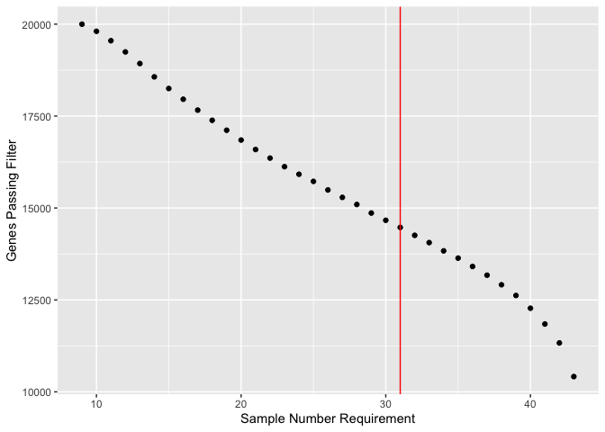<!-- -->

``` r
idx <- rowSums( counts(dds, normalized=TRUE) >= 5 ) >= max(cc$iplast,ee$iplast)
dds <- dds[idx,]
dds <- DESeq(dds)

res0 <- as.data.frame(results(dds, name="cluster_neuhi_4_vs_1"))
filenam <- "Day0_COVID+_NMF1_vs_NMF4_correct-NeuCont+TNK+Monocyte+Plasmablast+IG"
temp <- genepc[which(genepc$Gene.stable.ID %in% rownames(res0)),]
res0$symbol <- matrix(0L, nrow = nrow(res0))
for (i in 1:nrow(res0)){
  if (rownames(res0)[i] %in% temp$Gene.stable.ID){
    res0$symbol[i] <- temp$Gene.name[which(rownames(res0)[i] == temp$Gene.stable.ID)]
  } else {
    res0$symbol[i] <- rownames(res0)[i]
  }
}
res0$rank <- sign(res0$log2FoldChange)*(-1)*log10(res0$pvalue)
res0 <- res0[complete.cases(res0),]
res0_sig <- res0[res0$padj < 0.05,]
#write.table(res0,paste0("~/Documents/Github/DESeq2/",filenam,".txt"),sep = "\t")
```

Day 3:

``` r
DESeq2_list <- Neutrophil_DESeq2(counts = Count_filtered, mdata = metadata_filtered, covid = "Positive", day = "D3", cluster = c(1,4))
dds <- DESeqDataSetFromMatrix(countData = DESeq2_list$Count_select, colData = DESeq2_list$coldata, design = ~ Neutrophil_total + T_NK_factor + Monocyte_factor + IG_factor + Plasmablast_factor + cluster_neuhi)
dds <- estimateSizeFactors(dds)
genenums <- as.data.frame(matrix(0L, nrow = 201, ncol = 2))
colnames(genenums) <- c("idx","genenum5")
genenums$idx <- 0:200
for (i in 1:nrow(genenums)){
  idx <- rowSums( counts(dds, normalized=TRUE) >= 5 ) >= i-1
  genenums$genenum5[i] <- sum(idx)
}
genenums <- genenums[genenums$genenum5 < 20000,]
genenums <- genenums[genenums$genenum5 != 0,]
cc <- bese(genenums$idx,genenums$genenum5,0)
ee <- bede(genenums$idx,genenums$genenum5,0)
ggplot(genenums, aes(x = idx, y = genenum5)) + geom_point() + ylab("Genes Passing Filter") + xlab("Sample Number Requirement") + geom_vline(xintercept = max(cc$iplast,ee$iplast), colour = "red")
```

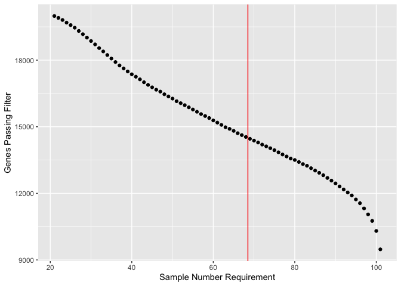<!-- -->

``` r
idx <- rowSums( counts(dds, normalized=TRUE) >= 5 ) >= max(cc$iplast,ee$iplast)
dds <- dds[idx,]
dds <- DESeq(dds)

res3 <- as.data.frame(results(dds, name="cluster_neuhi_4_vs_1"))
filenam <- "Day3_COVID+_NMF1_vs_NMF4_correct-NeuCont+TNK+Monocyte+Plasmablast+IG"
temp <- genepc[which(genepc$Gene.stable.ID %in% rownames(res3)),]
res3$symbol <- matrix(0L, nrow = nrow(res3))
for (i in 1:nrow(res3)){
  if (rownames(res3)[i] %in% temp$Gene.stable.ID){
    res3$symbol[i] <- temp$Gene.name[which(rownames(res3)[i] == temp$Gene.stable.ID)]
  } else {
    res3$symbol[i] <- rownames(res3)[i]
  }
}
res3$rank <- sign(res3$log2FoldChange)*(-1)*log10(res3$pvalue)
res3 <- res3[complete.cases(res3),]
res3_sig <- res3[res3$padj < 0.05,]
#write.table(res3,paste0("~/Documents/Github/DESeq2/",filenam,".txt"),sep = "\t")
```

Day 7:

``` r
DESeq2_list <- Neutrophil_DESeq2(counts = Count_filtered, mdata = metadata_filtered, covid = "Positive", day = "D7", cluster = c(1,4))
dds <- DESeqDataSetFromMatrix(countData = DESeq2_list$Count_select, colData = DESeq2_list$coldata, design = ~ Neutrophil_total + T_NK_factor + Monocyte_factor + IG_factor + Plasmablast_factor + cluster_neuhi)
dds <- estimateSizeFactors(dds)
genenums <- as.data.frame(matrix(0L, nrow = 201, ncol = 2))
colnames(genenums) <- c("idx","genenum5")
genenums$idx <- 0:200
for (i in 1:nrow(genenums)){
  idx <- rowSums( counts(dds, normalized=TRUE) >= 5 ) >= i-1
  genenums$genenum5[i] <- sum(idx)
}
genenums <- genenums[genenums$genenum5 < 20000,]
genenums <- genenums[genenums$genenum5 != 0,]
cc <- bese(genenums$idx,genenums$genenum5,0)
ee <- bede(genenums$idx,genenums$genenum5,0)
ggplot(genenums, aes(x = idx, y = genenum5)) + geom_point() + ylab("Genes Passing Filter") + xlab("Sample Number Requirement") + geom_vline(xintercept = max(cc$iplast,ee$iplast), colour = "red")
```

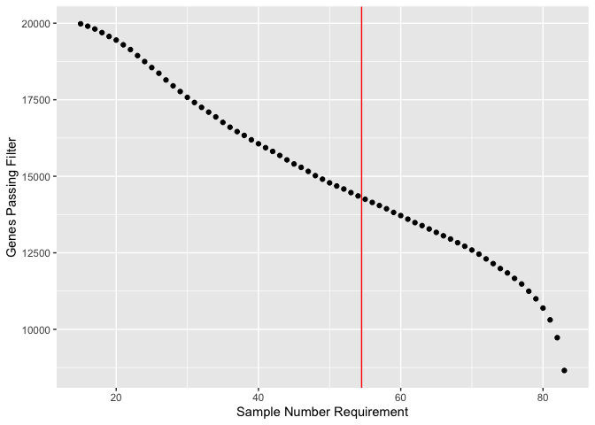<!-- -->

``` r
idx <- rowSums( counts(dds, normalized=TRUE) >= 5 ) >= max(cc$iplast,ee$iplast)
dds <- dds[idx,]
dds <- DESeq(dds)

res7 <- as.data.frame(results(dds, name="cluster_neuhi_4_vs_1"))
filenam <- "Day7_COVID+_NMF1_vs_NMF4_correct-NeuCont+TNK+Monocyte+Plasmablast+IG"
temp <- genepc[which(genepc$Gene.stable.ID %in% rownames(res7)),]
res7$symbol <- matrix(0L, nrow = nrow(res7))
for (i in 1:nrow(res7)){
  if (rownames(res7)[i] %in% temp$Gene.stable.ID){
    res7$symbol[i] <- temp$Gene.name[which(rownames(res7)[i] == temp$Gene.stable.ID)]
  } else {
    res7$symbol[i] <- rownames(res7)[i]
  }
}
res7$rank <- sign(res7$log2FoldChange)*(-1)*log10(res7$pvalue)
res7 <- res7[complete.cases(res7),]
res7_sig <- res7[res7$padj < 0.05,]
#write.table(res7,paste0("~/Documents/Github/DESeq2/",filenam,".txt"),sep = "\t")
```

``` r
resordered <- res0[order(res0$rank),]

log2fc <- as.numeric(resordered$log2FoldChange)
log10p <- as.numeric(-1*log10(resordered$pvalue))
pvalue <- as.numeric(resordered$pvalue)
padj <- resordered$padj
rank <- resordered$rank
symbol <- resordered$symbol
combo <- cbind(log2fc,log10p,padj,pvalue,symbol,rank)
colnames(combo) <- c("log2fc","log10p","padj","pvalue","symbol","rank")
rownames(combo) <- rownames(resordered)
combo <- as.data.frame(combo)
combo$rank <- as.numeric(combo$rank)
combo$log10p <- as.numeric(combo$log10p)
combo$log2fc <- as.numeric(combo$log2fc)
combo$pvalue <- as.numeric(combo$pvalue)
combo$significance <- as.numeric(combo$padj < 0.05)
combo$significance <- as.factor(combo$significance)

combo$color <- 0
combo$color[combo$pvalue < 1e-4 & combo$log2fc > 0.5] <- 1
combo$color[combo$pvalue < 1e-4 & combo$log2fc < -0.5] <- -1

combo$labels <- 0
combo$labels[combo$symbol %in% c("GSTM1","AC006441.3","DNPH1","GTPBP6","PSME2","TMEM219","NREP","SLC25A42","IL11RA","ETFB","LIME1","IL32","MRPS12","MRPS24","ATP5MC2","STXBP3","PIK3CG","PJA2","ACSL4","RP2","DSC2","WASHC4","RBM47","GALNT7","TBC1D14","SEC16A","FBXO34","HMGCR","RPL13AP6","GDAP2","BCAS3")] <- 1
combo$labels <- as.factor(combo$labels)

options(ggrepel.max.overlaps = Inf)
my.cols <- brewer.pal(3,"Set2")
plot1 <- ggplot(combo, aes(x = log2fc, y = log10p)) + geom_point(data = subset(combo, color == 0), colour = "grey") + geom_point(data = subset(combo, color == 1), colour = yellow) + geom_point(data = subset(combo, color == -1), colour = orange) + geom_text_repel(data = subset(combo, labels == 1), aes(label = as.character(symbol)))  + theme_bw() + ylab("-Log10(p-value)") + xlab("Log2(Fold-change)") + annotate("text", x=1.3, y=0, label= "NMF4", colour = yellow) + annotate("text", x=-1.2, y=0, label= "NMF1", colour = orange) + coord_fixed(ratio = .5) + theme(panel.grid = element_blank()) + ggtitle("Day 0, COVID+")
```

**Figure S12A:**

``` r
plot1
```

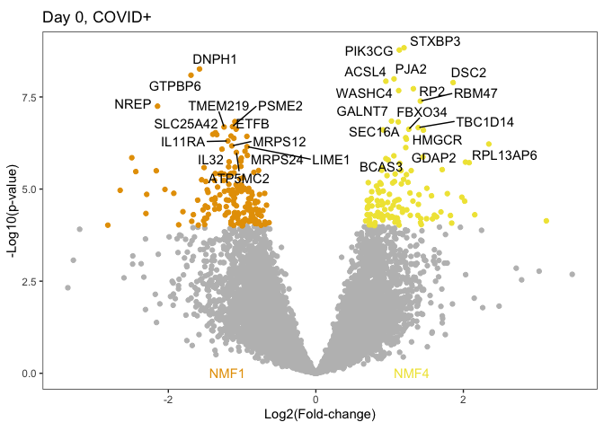<!-- -->

``` r
resordered <- res3[order(res3$rank),]

log2fc <- as.numeric(resordered$log2FoldChange)
log10p <- as.numeric(-1*log10(resordered$pvalue))
pvalue <- as.numeric(resordered$pvalue)
padj <- resordered$padj
rank <- resordered$rank
symbol <- resordered$symbol
combo <- cbind(log2fc,log10p,padj,pvalue,symbol,rank)
colnames(combo) <- c("log2fc","log10p","padj","pvalue","symbol","rank")
rownames(combo) <- rownames(resordered)
combo <- as.data.frame(combo)
combo$rank <- as.numeric(combo$rank)
combo$log10p <- as.numeric(combo$log10p)
combo$log2fc <- as.numeric(combo$log2fc)
combo$pvalue <- as.numeric(combo$pvalue)
combo$significance <- as.numeric(combo$padj < 0.05)
combo$significance <- as.factor(combo$significance)

combo$color <- 0
combo$color[combo$pvalue < 1e-4 & combo$log2fc > 0.5] <- 1
combo$color[combo$pvalue < 1e-4 & combo$log2fc < -0.5] <- -1

combo$labels <- 0
combo$labels[combo$symbol %in% c("UBXN2B","USP15","CASP8","RALB","CYB5R4","SNX10","ALDH1A2","IFNAR1","TLR1","SDCBP","RASSF5","PXK","GNAI3","TMEM154","CYTIP","SH3GLB1","FAM49B","RCC2","MRPL12","SSBP3","NME3","EIF3B","FBL","AP3D1","CTBP1","HRAS","OAF","SRM","CD81","COMMD4","MLXIP","MRPS24","AGAP3","LMNB2")] <- 1
combo$labels <- as.factor(combo$labels)

options(ggrepel.max.overlaps = Inf)
my.cols <- brewer.pal(3,"Set2")
plot1 <- ggplot(combo, aes(x = log2fc, y = log10p)) + geom_point(data = subset(combo, color == 0), colour = "grey") + geom_point(data = subset(combo, color == 1), colour = yellow) + geom_point(data = subset(combo, color == -1), colour = orange) + geom_text_repel(data = subset(combo, labels == 1), aes(label = as.character(symbol)))  + theme_bw() + ylab("-Log10(p-value)") + xlab("Log2(Fold-change)") + annotate("text", x=1.3, y=0, label= "NMF4", colour = yellow) + annotate("text", x=-1.2, y=0, label= "NMF1", colour = orange) + coord_fixed(ratio = .15) + theme(panel.grid = element_blank()) + ggtitle("Day 3, COVID+")
```

**Figure S12B:**

``` r
plot1
```

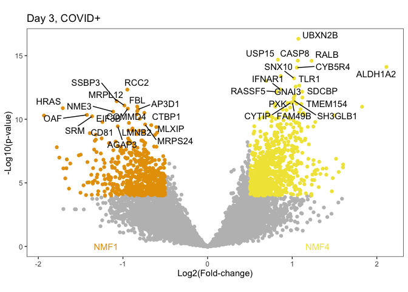<!-- -->

``` r
resordered <- res7[order(res7$rank),]

log2fc <- as.numeric(resordered$log2FoldChange)
log10p <- as.numeric(-1*log10(resordered$pvalue))
pvalue <- as.numeric(resordered$pvalue)
padj <- resordered$padj
rank <- resordered$rank
symbol <- resordered$symbol
combo <- cbind(log2fc,log10p,padj,pvalue,symbol,rank)
colnames(combo) <- c("log2fc","log10p","padj","pvalue","symbol","rank")
rownames(combo) <- rownames(resordered)
combo <- as.data.frame(combo)
combo$rank <- as.numeric(combo$rank)
combo$log10p <- as.numeric(combo$log10p)
combo$log2fc <- as.numeric(combo$log2fc)
combo$pvalue <- as.numeric(combo$pvalue)
combo$significance <- as.numeric(combo$padj < 0.05)
combo$significance <- as.factor(combo$significance)

combo$color <- 0
combo$color[combo$pvalue < 1e-4 & combo$log2fc > 0.5] <- 1
combo$color[combo$pvalue < 1e-4 & combo$log2fc < -0.5] <- -1

combo$labels <- 0
combo$labels[combo$symbol %in% c("UBQLN2","TTC19","SUCLG2","PTPRC","COQ10B","MMP8","CYB5R4","CD46","TSR3","MAZ","JUND","COX8A","MMP17","LAMP1","LY6E","COX6B1")] <- 1
combo$labels <- as.factor(combo$labels)

options(ggrepel.max.overlaps = Inf)
my.cols <- brewer.pal(3,"Set2")
plot1 <- ggplot(combo, aes(x = log2fc, y = log10p)) + geom_point(data = subset(combo, color == 0), colour = "grey") + geom_point(data = subset(combo, color == 1), colour = yellow) + geom_point(data = subset(combo, color == -1), colour = orange) + geom_text_repel(data = subset(combo, labels == 1), aes(label = as.character(symbol)))  + theme_bw() + ylab("-Log10(p-value)") + xlab("Log2(Fold-change)") + annotate("text", x=1.3, y=0, label= "NMF4", colour = yellow) + annotate("text", x=-1.2, y=0, label= "NMF1", colour = orange) + coord_fixed(ratio = .35) + theme(panel.grid = element_blank()) + ggtitle("Day 7, COVID+")
```

**Figure 3A:**

``` r
options(ggrepel.max.overlaps = Inf)
plot1
```

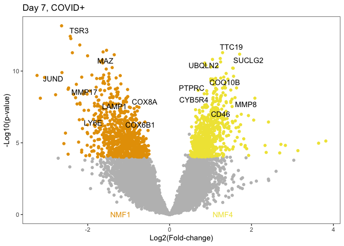<!-- -->

Now we perform the GSEA on each day.

``` r
gmt.file <- gmtPathways(paste0(prefix,"all_gene_sets.gmt"))

ranking <- res0[,"rank"]
names(ranking) <- res0$symbol
set.seed(15001)
fgseaRes0 <- fgsea(pathways = gmt.file, 
                  stats = ranking,
                  minSize=25,
                  maxSize=1000,
                  eps = 0)
fgseasig0 <- fgseaRes0[fgseaRes0$padj < 0.05,]

ranking <- res3[,"rank"]
names(ranking) <- res3$symbol
set.seed(15001)
fgseaRes3 <- fgsea(pathways = gmt.file, 
                  stats = ranking,
                  minSize=25,
                  maxSize=1000,
                  eps = 0)
fgseasig3 <- fgseaRes3[fgseaRes3$padj < 0.05,]

ranking <- res7[,"rank"]
names(ranking) <- res7$symbol
set.seed(15001)
fgseaRes7 <- fgsea(pathways = gmt.file, 
                  stats = ranking,
                  minSize=25,
                  maxSize=1000,
                  eps = 0)
fgseasig7 <- fgseaRes7[fgseaRes7$padj < 0.05,]
```

``` r
fgseasigordered <- fgseasig7[(order(fgseasig7$NES)),]
fgseasigordered <- fgseasigordered[fgseasigordered$pathway %in% c("HALLMARK_MTORC1_SIGNALING","HALLMARK_HEME_METABOLISM","GO_TRICARBOXYLIC_ACID_CYCLE","REACTOME_NEUTROPHIL_DEGRANULATION","GO_CELL_REDOX_HOMEOSTASIS","HALLMARK_FATTY_ACID_METABOLISM","GO_HEXOSE_CATABOLIC_PROCESS","GO_PEROXISOME_ORGANIZATION","HALLMARK_GLYCOLYSIS","GO_OXIDATIVE_PHOSPHORYLATION","GO_ELECTRON_TRANSPORT_CHAIN","GO_ATP_SYNTHESIS_COUPLED_ELECTRON_TRANSPORT","GO_MITOCHONDRIAL_RESPIRATORY_CHAIN_COMPLEX_ASSEMBLY","GO_MITOCHONDRIAL_ELECTRON_TRANSPORT_NADH_TO_UBIQUINONE","GO_NADH_DEHYDROGENASE_COMPLEX_ASSEMBLY")]
fgseasigordered$idx <- 1:nrow(fgseasigordered)
fgseasigordered$color <- as.numeric(fgseasigordered$NES > 0)
p1 <- ggplot(fgseasigordered, aes(x = factor(idx), y = NES, fill = factor(color), text = pathway)) + geom_col() + coord_flip() + theme_bw() + theme(panel.grid = element_blank()) + scale_fill_manual(values = c(orange,yellow)) + theme(legend.position = "none", axis.text.y = element_blank()) + xlab("") + geom_text(aes(x = idx, label = pathway)) + geom_hline(yintercept = 0) + geom_vline(xintercept = 6.5)
```

**Figure 3B:**

``` r
p1
```

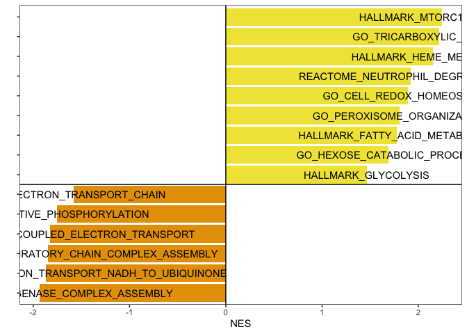<!-- -->

``` r
gsea_results0 <- fgseaRes0[fgseaRes0$pathway %in% c("HALLMARK_MTORC1_SIGNALING","HALLMARK_HEME_METABOLISM","GO_TRICARBOXYLIC_ACID_CYCLE","REACTOME_NEUTROPHIL_DEGRANULATION","GO_CELL_REDOX_HOMEOSTASIS","HALLMARK_FATTY_ACID_METABOLISM","GO_HEXOSE_CATABOLIC_PROCESS","GO_PEROXISOME_ORGANIZATION","HALLMARK_GLYCOLYSIS","GO_OXIDATIVE_PHOSPHORYLATION","GO_ELECTRON_TRANSPORT_CHAIN","GO_ATP_SYNTHESIS_COUPLED_ELECTRON_TRANSPORT","GO_MITOCHONDRIAL_RESPIRATORY_CHAIN_COMPLEX_ASSEMBLY","GO_MITOCHONDRIAL_ELECTRON_TRANSPORT_NADH_TO_UBIQUINONE","GO_NADH_DEHYDROGENASE_COMPLEX_ASSEMBLY"),]
gsea_results0 <- gsea_results0[,c(1,2,6)]
gsea_results0$Day <- "D0"
gsea_results3 <- fgseaRes3[fgseaRes3$pathway %in% c("HALLMARK_MTORC1_SIGNALING","HALLMARK_HEME_METABOLISM","GO_TRICARBOXYLIC_ACID_CYCLE","REACTOME_NEUTROPHIL_DEGRANULATION","GO_CELL_REDOX_HOMEOSTASIS","HALLMARK_FATTY_ACID_METABOLISM","GO_HEXOSE_CATABOLIC_PROCESS","GO_PEROXISOME_ORGANIZATION","HALLMARK_GLYCOLYSIS","GO_OXIDATIVE_PHOSPHORYLATION","GO_ELECTRON_TRANSPORT_CHAIN","GO_ATP_SYNTHESIS_COUPLED_ELECTRON_TRANSPORT","GO_MITOCHONDRIAL_RESPIRATORY_CHAIN_COMPLEX_ASSEMBLY","GO_MITOCHONDRIAL_ELECTRON_TRANSPORT_NADH_TO_UBIQUINONE","GO_NADH_DEHYDROGENASE_COMPLEX_ASSEMBLY"),]
gsea_results3 <- gsea_results3[,c(1,2,6)]
gsea_results3$Day <- "D3"
gsea_results7 <- fgseaRes7[fgseaRes7$pathway %in% c("HALLMARK_MTORC1_SIGNALING","HALLMARK_HEME_METABOLISM","GO_TRICARBOXYLIC_ACID_CYCLE","REACTOME_NEUTROPHIL_DEGRANULATION","GO_CELL_REDOX_HOMEOSTASIS","HALLMARK_FATTY_ACID_METABOLISM","GO_HEXOSE_CATABOLIC_PROCESS","GO_PEROXISOME_ORGANIZATION","HALLMARK_GLYCOLYSIS","GO_OXIDATIVE_PHOSPHORYLATION","GO_ELECTRON_TRANSPORT_CHAIN","GO_ATP_SYNTHESIS_COUPLED_ELECTRON_TRANSPORT","GO_MITOCHONDRIAL_RESPIRATORY_CHAIN_COMPLEX_ASSEMBLY","GO_MITOCHONDRIAL_ELECTRON_TRANSPORT_NADH_TO_UBIQUINONE","GO_NADH_DEHYDROGENASE_COMPLEX_ASSEMBLY"),]
gsea_results7 <- gsea_results7[,c(1,2,6)]
gsea_results7$Day <- "D7"

gsea_results <- rbind(gsea_results0,gsea_results3,gsea_results7)
gsea_results <- gsea_results %>%
  arrange(factor(pathway, levels = fgseasigordered$pathway))
```

``` r
gsea_results$NES <- gsea_results$NES#*-1
gsea_results$number <- rev(rep((1:15)*2,each = 3))
gsea_results$logp <- -log10(gsea_results$pval)
gsea_results$logp[gsea_results$logp < -log10(0.05)] <- NA

p1 <- ggplot(gsea_results, aes(x = factor(Day, levels = c("D7","D3","D0")), y = number)) + geom_point(aes(size = logp, fill = NES), alpha = 0.75, shape = 21) + scale_size_continuous(limits = c(0, 30), range = c(1,5.5), breaks = c(1,10,20)) + xlab("Day") + ylab("") + scale_fill_gradient(low = orange, high = yellow) + theme_bw() + geom_text(data = subset(gsea_results, Day == "D0"), aes(label = pathway), angle = 20) + coord_flip() + theme(panel.grid = element_blank(), aspect.ratio = 1/10)
```

**Figure S12C (Move the text to the bottom in Illustrator):**

``` r
p1
```

    ## Warning: Removed 11 rows containing missing values (geom_point).

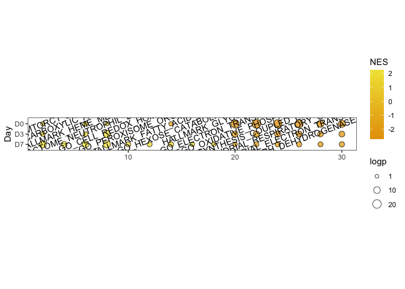<!-- -->

Now we explore another NMF subtype, NMF5: G-MDSC. First, we score each
sample according to their expression of the NMF marker genes. Then we
look at how the NMF5 score varies with Acuity on Day 0.

``` r
source(paste0(prefix,"Pathway_scoring.R"))
gmt.file <- gmtPathways(paste0(prefix,"neutrophil_state_gene_sets.gmt"))
metadata_filtered$NMF1_score <- Pathway_scoring("NMF1")
metadata_filtered$NMF2_score <- Pathway_scoring("NMF2")
metadata_filtered$NMF3_score <- Pathway_scoring("NMF3")
metadata_filtered$NMF4_score <- Pathway_scoring("NMF4")
metadata_filtered$NMF5_score <- Pathway_scoring("NMF5")
metadata_filtered$NMF6_score <- Pathway_scoring("NMF6")
metadata_filtered$ARDS_UP_score <- Pathway_scoring("ARDS_UP")
metadata_filtered$ARDS_DOWN_score <- Pathway_scoring("ARDS_DOWN")

metadata_temp <- metadata_filtered[(metadata_filtered$COVID == "Positive" & metadata_filtered$Day == "D0") | metadata_filtered$Day == "H",]
metadata_temp$Acuity.max <- factor(metadata_temp$Acuity.max, levels = c("H","5","4","3","2","1"))
p1 <- ggplot(metadata_temp, aes(x = Acuity.max, y = as.numeric(NMF5_score), fill = Acuity.max)) + geom_boxplot(outlier.shape = NA) + geom_jitter(alpha = 0.2) + theme_bw() + theme(panel.grid = element_blank(), legend.position = "none") + xlab("AcuityMax") + ylab("NMF5 (G-MDSC) Metagene Score") + geom_vline(xintercept = 1.5, linetype = "dashed") + ggtitle("Day 0 COVID+ & HC") + coord_fixed(ratio = 1.5) + stat_compare_means() + scale_fill_manual(values = c(skyblue,"seagreen","lightgreen","lightyellow","orange",vermillion))
stats <- cor.test(x = as.numeric(metadata_temp$Acuity.max), y = as.numeric(metadata_temp$NMF5_score), use = "pairwise.complete.obs", method = "kendall")
stats$estimate #Kendall's tau correlation
```

    ##       tau 
    ## 0.4100028

``` r
stats$p.value
```

    ## [1] 1.062918e-20

**Figure 3C:**

``` r
p1
```

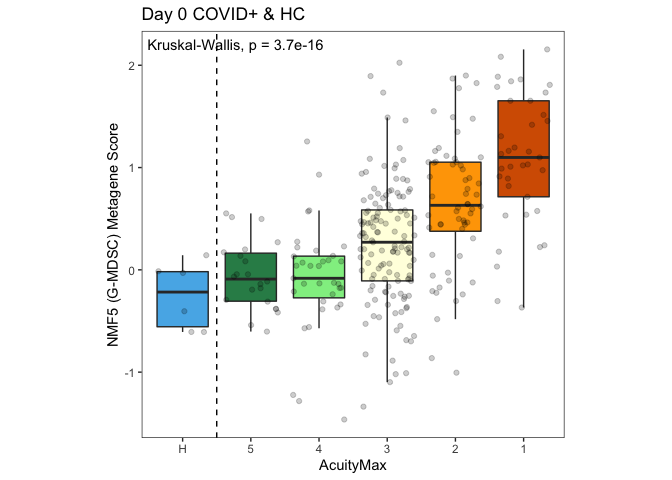<!-- -->

The NMF5 score correlates well with AcuityMax even on the initial day of
hospitalization. To test the predictive power of neutrophil states, we
build three logistic regression models: 1) only patient
demographics/characteristics, 2) combining demographics with clinical
lab values, and 3) combining demographics, clinical lab values, and
neutrophil state scores. We then use the likelihood ratio test to see if
adding more parameters significantly improves the model.

We consider only COVID+ patients on Day 0 who are admitted to the ED
(i.e. exclude AcuityMax5) and have complete data for ALC, ANC, D-dimers,
CRP, LDH, and BMI. Again, due to the IRB-approved waiver of informed
consent, clinical data is reported in quintiles; thus, we break the
neutrophil scores into quintiles as well for consistency. Additionally,
not all of the demographic information is publicly available, so those
lines will be commented out, and the results will be read in.

``` r
# metadata_temp <- metadata_filtered[metadata_filtered$COVID == "Positive" & metadata_filtered$Day == "D0" & metadata_filtered$Acuity.max %in% c("1","2","3","4") & complete.cases(metadata_filtered$ALC.matched) & complete.cases(metadata_filtered$Ddimer.matched) & complete.cases(metadata_filtered$CRP.matched) & complete.cases(metadata_filtered$LDH.matched) & complete.cases(metadata_filtered$BMI),]
# metadata_temp$severity.max <- mapvalues(metadata_temp$severity.max, from = c("non-severe","severe"), to = c(0,1))
# metadata_temp$severity.max <- as.factor(metadata_temp$severity.max)
# metadata_temp$Age <- mapvalues(metadata_temp$Age, from = c("1","2","3","4","5"), to = c("1_2","1_2","3","4","5"))
# metadata_temp$Age <- factor(metadata_temp$Age, levels = c("1_2","3","4","5"))
# metadata_temp$sex <- as.factor(metadata_temp$sex)
# metadata_temp$ethnicity <- as.factor(metadata_temp$ethnicity)
# metadata_temp$Heart.condition <- as.factor(metadata_temp$Heart.condition)
# metadata_temp$Diabetes <- as.factor(metadata_temp$Diabetes)
# metadata_temp$HTN <- as.factor(metadata_temp$HTN)
# metadata_temp$HLD <- as.factor(metadata_temp$HLD)
# metadata_temp$Lung.condition <- as.factor(metadata_temp$Lung.condition)
# metadata_temp$Kidney.condition <- as.factor(metadata_temp$Kidney.condition)
# metadata_temp$Immuno <- as.factor(metadata_temp$Immuno)
# metadata_temp$ANC.matched <- as.factor(metadata_temp$ANC.matched)
# metadata_temp <- metadata_temp[complete.cases(metadata_temp$ANC.matched),]
# metadata_temp$BMI <- mapvalues(metadata_temp$BMI, from = c("0","1","2","3","4","5"), to = c("0_1","0_1","2","3","4","5"))
# metadata_temp$BMI <- as.factor(metadata_temp$BMI)
# 
# metadata_temp$ANC.matched <- as.factor(metadata_temp$ANC.matched)
# metadata_temp$ALC.matched <- as.factor(metadata_temp$ALC.matched)
# metadata_temp$Creatinine.matched <- as.factor(metadata_temp$Creatinine.matched)
# metadata_temp$CRP.matched <- as.factor(metadata_temp$CRP.matched)
# metadata_temp$Ddimer.matched <- as.factor(metadata_temp$Ddimer.matched)
# metadata_temp$LDH.matched <- mapvalues(metadata_temp$LDH.matched, from = c("1","2","3","4","5"), to = c("1_2","1_2","3","4","5"))
# metadata_temp$LDH.matched <- as.factor(metadata_temp$LDH.matched)
# 
# metadata_temp$NMF1_score_factor <- cut_number(metadata_temp$NMF1_score, n = 5)
# metadata_temp$NMF2_score_factor <- cut_number(metadata_temp$NMF2_score, n = 5)
# metadata_temp$NMF3_score_factor <- cut_number(metadata_temp$NMF3_score, n = 5)
# metadata_temp$NMF4_score_factor <- cut_number(metadata_temp$NMF4_score, n = 5)
# metadata_temp$NMF5_score_factor <- cut_number(metadata_temp$NMF5_score, n = 5)
# metadata_temp$NMF6_score_factor <- cut_number(metadata_temp$NMF6_score, n = 5)
# metadata_temp$ARDS_UP_score_factor <- cut_number(metadata_temp$ARDS_UP_score, n = 5)
# metadata_temp$ARDS_DOWN_score_factor <- cut_number(metadata_temp$ARDS_DOWN_score, n = 5)
# 
# model1 <- glm(severity.max ~ Age + sex + ethnicity + Heart.condition + Diabetes + HTN + HLD + Lung.condition + Kidney.condition + Immuno + BMI, data = metadata_temp, family = binomial)
# model2 <- glm(severity.max ~ Age + sex + ethnicity + Heart.condition + Diabetes + HTN + HLD + Lung.condition + Kidney.condition + Immuno + BMI + ANC.matched + ALC.matched + Creatinine.matched + CRP.matched + Ddimer.matched + LDH.matched, data = metadata_temp, family = binomial)
# model3 <- glm(severity.max ~ Age + sex + ethnicity + Heart.condition + Diabetes + HTN + HLD + Lung.condition + Kidney.condition + Immuno + BMI + ANC.matched + ALC.matched + Creatinine.matched + CRP.matched + Ddimer.matched + LDH.matched + NMF1_score_factor + NMF2_score_factor + NMF3_score_factor + NMF4_score_factor + NMF5_score_factor + NMF6_score_factor + ARDS_UP_score_factor + ARDS_DOWN_score_factor, data = metadata_temp, family = binomial)
# 
# summary(model1)
# summary(model2)
# summary(model3)
# 
# lrtest(model1, model2)
# lrtest(model2, model3)
#
# prob1=predict(model1,type=c("response"))
# metadata_temp$prob1=prob1
#
# prob2=predict(model2,type=c("response"))
# metadata_temp$prob2=prob2
#
# prob3=predict(model3,type=c("response"))
# metadata_temp$prob3=prob3

probdf <- read.xlsx(paste0(prefix,"Tables/TableS3.xlsx"),sheet = 9)
metadata_temp <- merge(x = metadata_temp, y = probdf, by = "Public.Sample.ID")

g1 <- roc(severity.max ~ prob1, data = metadata_temp)
g2 <- roc(severity.max ~ prob2, data = metadata_temp)
g3 <- roc(severity.max ~ prob3, data = metadata_temp)

auc(g1)
```

    ## Area under the curve: 0.7349

``` r
auc(g2)
```

    ## Area under the curve: 0.8875

``` r
auc(g3)
```

    ## Area under the curve: 0.9601

**Figure 3D:**

``` r
plot(x = g1$specificities, y = g1$sensitivities, col = "green", pch = 19, cex = 0, asp = 1, xlim = rev(c(0,1)), xlab = "Specificity", ylab = "Sensitivity")
lines(x = g1$specificities, y = g1$sensitivities, col = "green")
abline(a = 1, b = -1)
lines(x = g2$specificities, y = g2$sensitivities, col = "blue")
lines(x = g3$specificities, y = g3$sensitivities, col = "red")
```

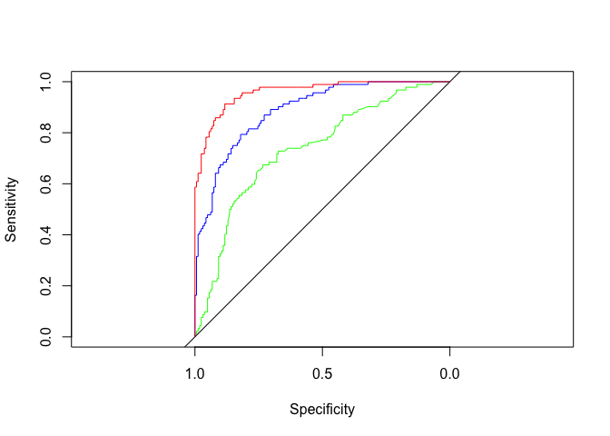<!-- -->

In the related supplementary figure there are forest plots showing the
odds ratio estimates for each factor level included in the models.
Without the actual models, it is not possible to generate these plots,
so their images will be read in here.

**Figure S12D:**

``` r
# my.cols <- brewer.pal(3,"RdBu")
# plot_model(model1, vline.color = "black", colors = c(my.cols[3], my.cols[1])) + theme_bw() + ggtitle("SeverityMax: Model 1")
```

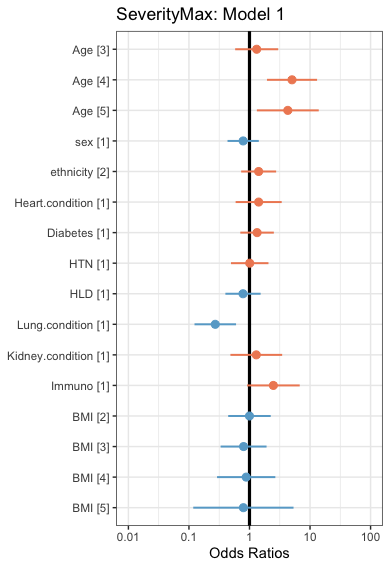

**Figure S12E:**

``` r
# my.cols <- brewer.pal(3,"RdBu")
# plot_model(model2, vline.color = "black", colors = c(my.cols[3], my.cols[1])) + theme_bw() + ggtitle("SeverityMax: Model 2")
```

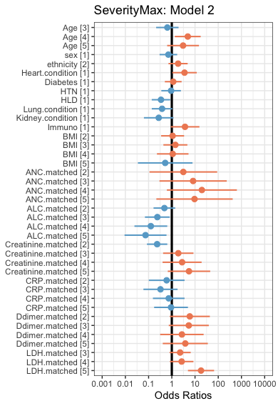

**Figure S12F:**

``` r
# my.cols <- brewer.pal(3,"RdBu")
# plot_model(model3, vline.color = "black", colors = c(my.cols[3], my.cols[1])) + theme_bw() + ggtitle("SeverityMax: Model 3")
```

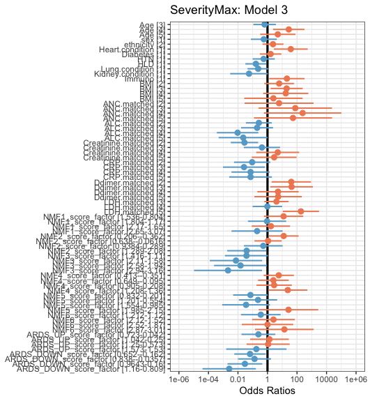

We next used a LASSO logistic regression model of COVID-19 disease
severity on Day 0 to perform feature selection on all of the parameters
that went into Model 3. Since there was no comparable validation
dataset, we performed the prediction with 100 repeats of five-fold cross
validation on both the regular data and data with permuted labels of
severity. Again, we comment out the code, which cannot be run with only
the publicly available data, and read in the results. This code was
adapted from Filbin et al. 2021.

``` r
# metadata_filtered$NMF1_score_factor <- cut_number(metadata_filtered$NMF1_score, n = 5)
# metadata_filtered$NMF2_score_factor <- cut_number(metadata_filtered$NMF2_score, n = 5)
# metadata_filtered$NMF3_score_factor <- cut_number(metadata_filtered$NMF3_score, n = 5)
# metadata_filtered$NMF4_score_factor <- cut_number(metadata_filtered$NMF4_score, n = 5)
# metadata_filtered$NMF5_score_factor <- cut_number(metadata_filtered$NMF5_score, n = 5)
# metadata_filtered$NMF6_score_factor <- cut_number(metadata_filtered$NMF6_score, n = 5)
# metadata_filtered$ARDS_UP_score_factor <- cut_number(metadata_filtered$ARDS_UP_score, n = 5)
# metadata_filtered$ARDS_DOWN_score_factor <- cut_number(metadata_filtered$ARDS_DOWN_score, n = 5)
# 
# variables_to_test <- c("sex" , "Age",  "ethnicity" , "Heart.condition" , "Diabetes" , "HTN" , "HLD" , "Lung.condition" , "Kidney.condition" , "Immuno" , "BMI" , "ANC.matched" , "ALC.matched" , "Creatinine.matched" , "CRP.matched" , "Ddimer.matched" , "LDH.matched" , "NMF1_score_factor" , "NMF2_score_factor" , "NMF3_score_factor","NMF4_score_factor","NMF5_score_factor","NMF6_score_factor", "ARDS_UP_score_factor","ARDS_DOWN_score_factor")
# columnorder <- c("Public.Sample.ID", "severity.max","sex", "Age", "ethnicity" , "Heart.condition" , "Diabetes" , "HTN" , "HLD" , "Lung.condition" , "Kidney.condition" , "Immuno" , "BMI" , "ANC.matched" , "ALC.matched" , "Creatinine.matched" , "CRP.matched" , "Ddimer.matched" , "LDH.matched" , "NMF1_score_factor" , "NMF2_score_factor" , "NMF3_score_factor","NMF4_score_factor","NMF5_score_factor","NMF6_score_factor", "ARDS_UP_score_factor","ARDS_DOWN_score_factor")
# 
# #Some helper functions
# fitLasso <- function(data){
#   
#   getweights <- data %>% 
#     select(Public.Sample.ID,severity.max) %>% 
#     group_by(severity.max) %>% 
#     mutate(N=n()) %>% 
#     ungroup() %>% 
#     mutate(w=1-N/nrow(data))
#   
#   data <- data %>% select(severity.max,all_of(c(variables_to_test))) %>% 
#     mutate(severity.max=factor(severity.max,levels=c("non.severe","severe")))
# 
#   lassoFit <- train(severity.max ~ . , 
#                     data = data, 
#                     method = "glmnet", 
#                     trControl = fitControl ,
#                     tuneLength = 15,
#                     metric = "Kappa",
#                     weights = getweights$w)
#   
#   fit <- glmnet(as.matrix(model.matrix(~-1+.,data=data %>% select(all_of(c(variables_to_test)))))[,-1], 
#                 data$severity.max,
#                 alpha=as.numeric(lassoFit$bestTune["alpha"]),
#                 lambda=as.numeric(lassoFit$bestTune["lambda"]),
#                 family="binomial",weights = getweights$w)
#   
#   return(fit)
# }
# 
# foldData <- function(data){
#   
#   data$FOLD <- NA
#   data$FOLD[data$severity.max=="severe"] <- sample(rep(1:5, ceiling(sum(data$severity.max=="severe"))),sum(data$severity.max=="severe"),replace=F)
#   data$FOLD[data$severity.max=="non.severe"] <- sample(rep(1:5, ceiling(sum(data$severity.max=="non.severe"))),sum(data$severity.max=="non.severe"),replace=F)
#   
#   return(data)
#   
# }
# getMeasures <- function(data){
#   
#   tmp.cm <- confusionMatrix(data=factor(data$predict.class,levels=c("severe","non.severe")),
#                             reference = factor(data$severity.max))
#   tmp.roc <- pROC::roc(severity.max~Prob,data %>% mutate(severity.max=factor(severity.max,levels=c("non.severe","severe"))),print.auc=F)
#   tmp.roc <- as.numeric(tmp.roc$auc)
#   names(tmp.roc) = "AUC"
#   N <- nrow(data);names(N) <- "N"
#   
#   out <- as.data.frame(t(as.matrix(c(N,
#                                      tmp.cm$byClass[c("Sensitivity","Specificity","Pos Pred Value","Neg Pred Value" )],
#                                      tmp.cm$overall[c("Accuracy","Kappa","AccuracyNull")],
#                                      tmp.roc))))
#   return(out)
#   
# }
# getFeatures <- function(x){
#   x <- as.matrix(x)
#   x <- x[rownames(x)!="(Intercept)",]
#   ind <- x != 0
#   out <- data.frame(feature =names(x)[ind],
#                     betas = as.numeric(x)[ind])
#   
#   return(out)
#   
# }
# simple_roc <- function(labels, scores){
#   labels <- labels[order(scores, decreasing=TRUE)]
#   data.frame(TPR=cumsum(labels)/sum(labels), FPR=cumsum(!labels)/sum(!labels), labels)
# }
# 
# do.severity.data <- metadata_filtered[metadata_filtered$COVID == "Positive" & metadata_filtered$Day == "D0" & metadata_filtered$Acuity.max %in% c("1","2","3","4") & complete.cases(metadata_filtered$ALC.matched) & complete.cases(metadata_filtered$Ddimer.matched) & complete.cases(metadata_filtered$CRP.matched) & complete.cases(metadata_filtered$LDH.matched) & complete.cases(metadata_filtered$BMI), colnames(metadata_filtered) %in% c("Public.Sample.ID","severity.max", variables_to_test)]
# 
# do.severity.data$severity.max <- mapvalues(do.severity.data$severity.max, from = c("non-severe","severe"), to = c("non.severe","severe"))
# do.severity.data$severity.max <- factor(do.severity.data$severity.max, levels = c("non.severe","severe"))
# do.severity.data$Age <- mapvalues(do.severity.data$Age, from = c("1","2","3","4","5"), to = c("1_2","1_2","3","4","5"))
# do.severity.data$Age <- factor(do.severity.data$Age, levels = c("1_2","3","4","5"))
# do.severity.data$sex <- as.factor(do.severity.data$sex)
# do.severity.data$ethnicity <- as.factor(do.severity.data$ethnicity)
# do.severity.data$Heart.condition <- as.factor(do.severity.data$Heart.condition)
# do.severity.data$Diabetes <- as.factor(do.severity.data$Diabetes)
# do.severity.data$HTN <- as.factor(do.severity.data$HTN)
# do.severity.data$HLD <- as.factor(do.severity.data$HLD)
# do.severity.data$Lung.condition <- as.factor(do.severity.data$Lung.condition)
# do.severity.data$Kidney.condition <- as.factor(do.severity.data$Kidney.condition)
# do.severity.data$Immuno <- as.factor(do.severity.data$Immuno)
# do.severity.data$ANC.matched <- as.factor(do.severity.data$ANC.matched)
# do.severity.data <- do.severity.data[complete.cases(do.severity.data$ANC.matched),]
# do.severity.data$BMI <- mapvalues(do.severity.data$BMI, from = c("0","1","2","3","4","5"), to = c("0_1","0_1","2","3","4","5"))
# do.severity.data$BMI <- as.factor(do.severity.data$BMI)
# do.severity.data$ANC.matched <- as.factor(do.severity.data$ANC.matched)
# do.severity.data$ALC.matched <- as.factor(do.severity.data$ALC.matched)
# do.severity.data$Creatinine.matched <- as.factor(do.severity.data$Creatinine.matched)
# do.severity.data$CRP.matched <- as.factor(do.severity.data$CRP.matched)
# do.severity.data$Ddimer.matched <- as.factor(do.severity.data$Ddimer.matched)
# do.severity.data$LDH.matched <- mapvalues(do.severity.data$LDH.matched, from = c("1","2","3","4","5"), to = c("1_2","1_2","3","4","5"))
# do.severity.data$LDH.matched <- as.factor(do.severity.data$LDH.matched)
# 
# reorder_idx <- match(columnorder, colnames(do.severity.data))
# do.severity.data <- do.severity.data[,reorder_idx]
# 
# fitControl <- trainControl(method="cv",number=5,
#                            classProbs=T,
#                            summaryFunction = defaultSummary,
#                            selectionFunction = "oneSE")
# 
# # 10 times 5fold CV -------------------------------------------------------
# 
# n.folds  <- 5
# n.repeats <- 2
# rep.data <- list()
# set.seed(9570815)
# for(reps in 1:n.repeats){
# 
#   fold.data <- foldData(do.severity.data)
#   fold.list <- vector("list",n.folds)
# 
#   for(fold in 1:n.folds){
# 
# 
#     train.data <- fold.data[fold.data$FOLD!=fold,]
#     test.data <- fold.data[fold.data$FOLD==fold,]
#     
#     scaleTrain <- train.data
#     scaleTest <- test.data
#     
#     tmp.fit <- fitLasso(scaleTrain)
#     betas <- coef(tmp.fit)
# 
# 
#     testtrain <- rbind(scaleTest %>%
#                          select(all_of(c(variables_to_test))) %>%
#                          mutate(set="Testing"),
#                        scaleTrain %>%
#                          select(all_of(c(variables_to_test))) %>%
#                          mutate(set="Training"))
# 
#     predicted.prob <- predict(tmp.fit,
#                               newx=as.matrix(model.matrix(~-1+.,data=testtrain %>% select(-set)))[testtrain$set=="Testing",-1],
#                               s=tmp.fit$lambda,
#                               type="response")
# 
#     predicted.prob <- data.frame(Public.Sample.ID=scaleTest$Public.Sample.ID,
#                                  Prob=as.numeric(predicted.prob),
#                                  severity.max=scaleTest$severity.max)
# 
#     fold.list[[fold]] <- list(prediction = predicted.prob,
#                               betas = betas)
# 
#     cat("Rep ",reps," Fold ",fold,"\n")
# 
#   }
# 
#   rep.data[[paste0("Rep",reps)]] <- fold.list
# }
# 
# 
# save(rep.data,
#      file=paste0(prefix,"Test_Lasso_Neutrophil_severe_prediction_list.Rdata"))
# 
# 
# perm.rep.data <- list()
# 
# set.seed(9570812)
# for(reps in 1:n.repeats){
# 
#   fold.data <- foldData(do.severity.data %>% mutate(severity.max=sample(severity.max)))
#   fold.list <- vector("list",n.folds)
# 
#   for(fold in 1:n.folds){
# 
# 
#     train.data <- fold.data[fold.data$FOLD!=fold,]
#     test.data <- fold.data[fold.data$FOLD==fold,]
# 
#     scaleTrain <- train.data
#     scaleTest <- test.data
#     
#     tmp.fit <- fitLasso(scaleTrain)
#     betas <- coef(tmp.fit)
# 
# 
#     testtrain <- rbind(scaleTest %>%
#                          select(all_of(c(variables_to_test))) %>%
#                          mutate(set="Testing"),
#                        scaleTrain %>%
#                          select(all_of(c(variables_to_test))) %>%
#                          mutate(set="Training"))
# 
#     predicted.prob <- predict(tmp.fit,
#                               newx=as.matrix(model.matrix(~-1+.,data=testtrain %>% select(-set)))[testtrain$set=="Testing",-1],
#                               s=tmp.fit$lambda,
#                               type="response")
# 
#     predicted.prob <- data.frame(Public.Sample.ID=scaleTest$Public.Sample.ID,
#                                  Prob=as.numeric(predicted.prob),
#                                  severity.max=scaleTest$severity.max)
# 
#     fold.list[[fold]] <- list(prediction = predicted.prob,
#                               betas = betas)
# 
#     cat("Rep ",reps," Fold ",fold,"\n")
# 
#   }
# 
#   perm.rep.data[[paste0("Rep",reps)]] <- fold.list
# }
# 
# 
# save(perm.rep.data,
#      file=paste0(prefix,"Test_lasso_Neutrophil_severe_prediction_list_permuted.Rdata"))
```

``` r
## Collect measures ---------
# 
# for(i in 1:length(rep.data)) names(rep.data[[i]]) <- paste0("fold",1:length(rep.data[[i]]))
# for(i in 1:length(perm.rep.data)) names(perm.rep.data[[i]]) <- paste0("fold",1:length(perm.rep.data[[i]]))
# 
# all.measure.results <- plyr::ldply(rep.data, function(x){
#   test.df <- plyr::ldply(lapply(x,function(y) y$prediction),data.frame,.id="fold") %>% 
#     mutate(predict.class = factor(ifelse(Prob<.5,"non.severe","severe")))
#   return(getMeasures(test.df))
# },
# .id="Rep")
# 
# all.measure.results.byFold <-  plyr::ldply(rep.data, function(x){
#   test.df <- plyr::ldply(lapply(x,function(y) y$prediction),data.frame,.id="fold") %>% 
#     mutate(predict.class = factor(ifelse(Prob<.5,"non.severe","severe"))) %>% 
#     group_by(fold) %>% 
#     group_modify(~getMeasures(.x)) %>% ungroup()
#   
#   return(test.df)
# },
# .id="Rep")
# 
# all.probs <-  plyr::ldply(rep.data, function(x){
#   plyr::ldply(lapply(x,function(y) y$prediction),data.frame,.id="fold") %>% 
#     mutate(predict.class = factor(ifelse(Prob<.5,"non.severe","severe"))) },
#   .id="Rep"
# )
# 
# all.measure.results.perm <- plyr::ldply(perm.rep.data, function(x){
#   test.df <- plyr::ldply(lapply(x,function(y) y$prediction),data.frame,.id="fold") %>% 
#     mutate(predict.class = factor(ifelse(Prob<.5,"non.severe","severe")))
#   return(getMeasures(test.df))
# },
# .id="Rep")
# 
# all.measure.results.byFold.perm <-  plyr::ldply(perm.rep.data, function(x){
#   test.df <- plyr::ldply(lapply(x,function(y) y$prediction),data.frame,.id="fold") %>% 
#     mutate(predict.class = factor(ifelse(Prob<.5,"non.severe","severe"))) %>% 
#     group_by(fold) %>% 
#     group_modify(~getMeasures(.x)) %>% ungroup()
#   
#   return(test.df)
# },
# .id="Rep")
# 
# all.probs.perm <-  plyr::ldply(perm.rep.data, function(x){
#   plyr::ldply(lapply(x,function(y) y$prediction),data.frame,.id="fold") %>% 
#     mutate(predict.class = factor(ifelse(Prob<.5,"non.severe","severe"))) },
#   .id="Rep"
# )
# 
# ## Table of all measures ---------
# original.measures <- all.measure.results %>% 
#   pivot_longer(-Rep,names_to="Measure",values_to="value") %>% 
#   group_by(Measure) %>% 
#   summarize(N=sum(!is.na(value)),Median=median(value),low.95=quantile(value,.025),up.95=quantile(value,.975))
# original.measures.fold <- all.measure.results.byFold %>% 
#   pivot_longer(-c(Rep,fold),names_to="Measure",values_to="value") %>% 
#   group_by(Measure) %>% 
#   summarize(N=sum(!is.na(value)),Median=median(value),low.95=quantile(value,.025),up.95=quantile(value,.975))
# 
# 
# #####Permutated data
# permuted.measures <- all.measure.results.perm %>% 
#   pivot_longer(-Rep,names_to="Measure",values_to="value") %>% 
#   group_by(Measure) %>% 
#   summarize(N=sum(!is.na(value)),Median=median(value),low.95=quantile(value,.025),up.95=quantile(value,.975))
# permuted.measures.fold <- all.measure.results.byFold.perm %>% 
#   pivot_longer(-c(Rep,fold),names_to="Measure",values_to="value") %>% 
#   group_by(Measure) %>% 
#   summarize(N=sum(!is.na(value)),Median=median(value,na.rm=T),low.95=quantile(value,.025,na.rm=T),up.95=quantile(value,.975,na.rm=T))
# 
# ##single roc curve
# test.df <- plyr::ldply(rep.data[[which.min(abs(all.measure.results$AUC-median(all.measure.results$AUC)))]],
#                   function(y) data.frame(y$prediction)) %>% 
#   mutate(predict.class = factor(ifelse(Prob<.5,"non.severe","severe")))
# 
# confusionMatrix(data=factor(test.df$predict.class,levels=c("severe","non.severe")),
#                 reference = factor(test.df$severity.max))
# 
# tmp.roc <- pROC::roc(severity.max~Prob,test.df %>% mutate(severity.max=factor(severity.max,levels=c("non.severe","severe"))))
# tmp.roc
# 
# 
# singleROC <- test.df %>% 
#   arrange(Prob) %>% 
#   group_modify(~simple_roc(as.numeric(.x$severity.max=="severe"),.x$Prob)) %>% 
#   ggplot(aes(x=FPR,y=TPR))+
#   geom_line()+
#   geom_abline(intercept=0,slope=1)+
#   annotate("text",x=0,y=1,label=paste("AUC:",round(as.numeric(tmp.roc$auc),4)),hjust=0)+
#   theme_bw()+
#   labs(x="1-Specificity",y="Sensitivity",title="Predicting severe COVID")
# 
# ggsave(filename=paste0(prefix,"singleROC.pdf"),
#   singleROC,
#   device = cairo_pdf,
#   height=6,width=6)
# 
# ##All ROC curves
# 
# allROC <- all.probs %>% mutate(Data="Original") %>% 
#   rbind(all.probs.perm %>% mutate(Data="Permuted")) %>% 
#   group_by(Data,Rep) %>% 
#   arrange(Rep,Prob) %>% 
#   group_modify(~simple_roc(as.numeric(.x$severity.max=="severe"),.x$Prob)) %>% 
#   ggplot(aes(x=FPR,y=TPR,group=interaction(Data,Rep),color=Data))+
#   geom_line()+
#   geom_abline(intercept=0,slope=1)+
#   theme_bw()+
#   labs(x="1-Specificity",y="Sensitivity",title="Predicting severe COVID: 100 Replications")+
#   scale_color_manual(values=c("#00559EFF","lightgray"))+
#   theme(legend.position="bottom")
# 
# ggsave(filename=paste0(prefix,"allROC.pdf"),
#        allROC,
#        device = cairo_pdf,
#        height=6,width=6)
```

**Figure 3E:**

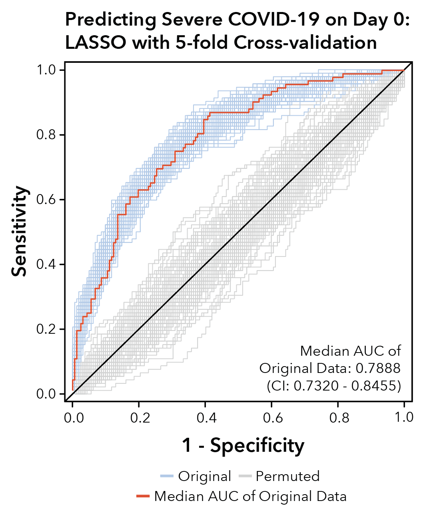

``` r
# ## extract features -----------
# 
# all.features <- plyr::ldply(rep.data, function(x){
#   plyr::ldply(lapply(x,function(y) y$betas),getFeatures,.id="Fold")
# },
# .id="Rep")
# 
# all.features.perm <- plyr::ldply(perm.rep.data, function(x){
#   plyr::ldply(lapply(x,function(y) y$betas),getFeatures,.id="Fold")
# },
# .id="Rep")
# 
# 
# table(all.features[,"feature"])
# 
# feat.freq.table <- all.features %>% 
#   group_by(feature) %>% 
#   summarize(Frequency_Selected=n()) %>% 
#   arrange(desc(Frequency_Selected)) %>% 
#   mutate(Proportion = Frequency_Selected/500*100)
# 
# feat.freq.table <- feat.freq.table[(order(feat.freq.table$Frequency_Selected)),]

feat.freq.table <- read.xlsx(paste0(prefix,"Tables/TableS3.xlsx"), sheet = 11)
feat.freq.table$rank <- rev(1:nrow(feat.freq.table))
feat.freq.table <- feat.freq.table[order(feat.freq.table$rank),]
```

**Figure 3F:**

``` r
par(mar=c(4,15,4,4))
barplot(height = feat.freq.table$Proportion, names = feat.freq.table$feature, horiz = T, las = 1, cex.names = .2)
```

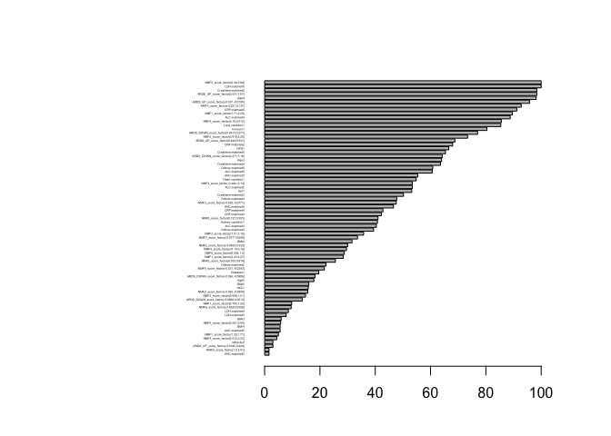<!-- -->

Next we switch our focus to the severe patients. We want to identify
features which are different between severe patients who survive and
those who do not survive. We start by performing differential expression
analyses for Days 0, 3, and 7 between AcuityMax1 and AcuityMax2
patients.

Day 0:

``` r
DESeq2_list <- Neutrophil_DESeq2(counts = Count_filtered, mdata = metadata_filtered, covid = "Positive", day = "D0", severity = "severe")
dds <- DESeqDataSetFromMatrix(countData = DESeq2_list$Count_select, colData = DESeq2_list$coldata, design = ~ Neutrophil_total + T_NK_factor + Monocyte_factor + IG_factor + Plasmablast_factor + Acuity.max)
dds <- DESeq(dds)

res0 <- as.data.frame(results(dds, name="Acuity.max_2_vs_1"))
filenam <- "Day0_COVID+_A1_vs_A2_correct-NeuCont+TNK+Monocyte+Plasmablast+IG"
temp <- genepc[which(genepc$Gene.stable.ID %in% rownames(res0)),]
res0$symbol <- matrix(0L, nrow = nrow(res0))
for (i in 1:nrow(res0)){
  if (rownames(res0)[i] %in% temp$Gene.stable.ID){
    res0$symbol[i] <- temp$Gene.name[which(rownames(res0)[i] == temp$Gene.stable.ID)]
  } else {
    res0$symbol[i] <- rownames(res0)[i]
  }
}
res0$rank <- sign(res0$log2FoldChange)*(-1)*log10(res0$pvalue)
res0 <- res0[complete.cases(res0),]
res0_sig <- res0[res0$padj < 0.05,]
#write.table(res0,paste0("~/Documents/Github/DESeq2/",filenam,".txt"),sep = "\t")
```

Day 3:

``` r
DESeq2_list <- Neutrophil_DESeq2(counts = Count_filtered, mdata = metadata_filtered, covid = "Positive", day = "D3", severity = "severe")
dds <- DESeqDataSetFromMatrix(countData = DESeq2_list$Count_select, colData = DESeq2_list$coldata, design = ~ Neutrophil_total + T_NK_factor + Monocyte_factor + IG_factor + Plasmablast_factor + Acuity.max)
dds <- DESeq(dds)

res3 <- as.data.frame(results(dds, name="Acuity.max_2_vs_1"))
filenam <- "Day3_COVID+_A1_vs_A2_correct-NeuCont+TNK+Monocyte+Plasmablast+IG"
temp <- genepc[which(genepc$Gene.stable.ID %in% rownames(res3)),]
res3$symbol <- matrix(0L, nrow = nrow(res3))
for (i in 1:nrow(res3)){
  if (rownames(res3)[i] %in% temp$Gene.stable.ID){
    res3$symbol[i] <- temp$Gene.name[which(rownames(res3)[i] == temp$Gene.stable.ID)]
  } else {
    res3$symbol[i] <- rownames(res3)[i]
  }
}
res3$rank <- sign(res3$log2FoldChange)*(-1)*log10(res3$pvalue)
res3 <- res3[complete.cases(res3),]
res3_sig <- res3[res3$padj < 0.05,]
#write.table(res3,paste0("~/Documents/Github/DESeq2/",filenam,".txt"),sep = "\t")
```

Day 7:

``` r
DESeq2_list <- Neutrophil_DESeq2(counts = Count_filtered, mdata = metadata_filtered, covid = "Positive", day = "D7", severity = "severe")
dds <- DESeqDataSetFromMatrix(countData = DESeq2_list$Count_select, colData = DESeq2_list$coldata, design = ~ Neutrophil_total + T_NK_factor + Monocyte_factor + IG_factor + Plasmablast_factor + Acuity.max)
dds <- DESeq(dds)

res7 <- as.data.frame(results(dds, name="Acuity.max_2_vs_1"))
filenam <- "Day3_COVID+_A1_vs_A2_correct-NeuCont+TNK+Monocyte+Plasmablast+IG"
temp <- genepc[which(genepc$Gene.stable.ID %in% rownames(res7)),]
res7$symbol <- matrix(0L, nrow = nrow(res7))
for (i in 1:nrow(res7)){
  if (rownames(res7)[i] %in% temp$Gene.stable.ID){
    res7$symbol[i] <- temp$Gene.name[which(rownames(res7)[i] == temp$Gene.stable.ID)]
  } else {
    res7$symbol[i] <- rownames(res7)[i]
  }
}
res7$rank <- sign(res7$log2FoldChange)*(-1)*log10(res7$pvalue)
res7 <- res7[complete.cases(res7),]
res7_sig <- res7[res7$padj < 0.05,]
#write.table(res7,paste0("~/Documents/Github/DESeq2/",filenam,".txt"),sep = "\t")
```

``` r
resordered <- res0[order(res0$rank),]

log2fc <- as.numeric(resordered$log2FoldChange)
log10p <- as.numeric(-1*log10(resordered$pvalue))
pvalue <- as.numeric(resordered$pvalue)
padj <- resordered$padj
rank <- resordered$rank
symbol <- resordered$symbol
combo <- cbind(log2fc,log10p,padj,pvalue,symbol,rank)
colnames(combo) <- c("log2fc","log10p","padj","pvalue","symbol","rank")
rownames(combo) <- rownames(resordered)
combo <- as.data.frame(combo)
combo$rank <- as.numeric(combo$rank)
combo$log10p <- as.numeric(combo$log10p)
combo$log2fc <- as.numeric(combo$log2fc)
combo$pvalue <- as.numeric(combo$pvalue)
combo$significance <- as.numeric(combo$padj < 0.05)
combo$significance <- as.factor(combo$significance)

combo$color <- 0
combo$color[combo$pvalue < 1e-4 & combo$log2fc > 0.5] <- 1
combo$color[combo$pvalue < 1e-4 & combo$log2fc < -0.5] <- -1

combo$labels <- abs(combo$color)
combo$labels <- as.factor(combo$labels)

options(ggrepel.max.overlaps = Inf)
my.cols <- brewer.pal(3,"Set2")
plot1 <- ggplot(combo, aes(x = log2fc, y = log10p)) + geom_point(data = subset(combo, color == 0), colour = "grey") + geom_point(data = subset(combo, color == 1), colour = "navy") + geom_point(data = subset(combo, color == -1), colour = "red") + geom_text_repel(data = subset(combo, labels == 1), aes(label = as.character(symbol)))  + theme_bw() + ylab("-Log10(p-value)") + xlab("Log2(Fold-change)") + annotate("text", x=1.3, y=0, label= "AcuityMax2", colour = "navy") + annotate("text", x=-1.2, y=0, label= "AcuityMax1", colour = "red") + coord_fixed(ratio = 1) + theme(panel.grid = element_blank()) + ggtitle("Day 0, COVID+")
```

**Figure S13A:**

``` r
plot1
```

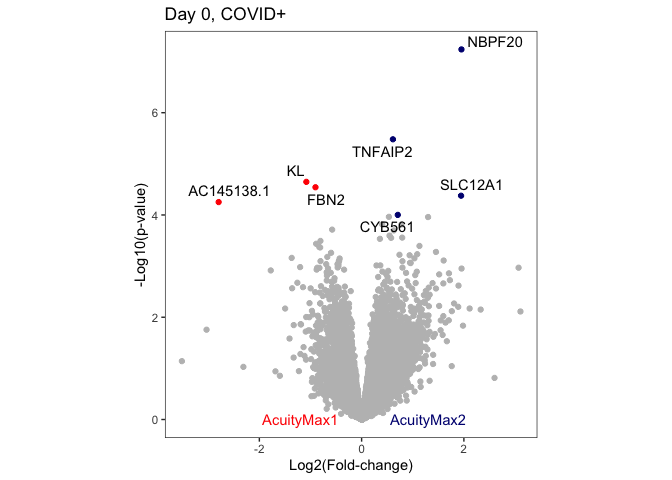<!-- -->

``` r
resordered <- res3[order(res3$rank),]

log2fc <- as.numeric(resordered$log2FoldChange)
log10p <- as.numeric(-1*log10(resordered$pvalue))
pvalue <- as.numeric(resordered$pvalue)
padj <- resordered$padj
rank <- resordered$rank
symbol <- resordered$symbol
combo <- cbind(log2fc,log10p,padj,pvalue,symbol,rank)
colnames(combo) <- c("log2fc","log10p","padj","pvalue","symbol","rank")
rownames(combo) <- rownames(resordered)
combo <- as.data.frame(combo)
combo$rank <- as.numeric(combo$rank)
combo$log10p <- as.numeric(combo$log10p)
combo$log2fc <- as.numeric(combo$log2fc)
combo$pvalue <- as.numeric(combo$pvalue)
combo$significance <- as.numeric(combo$padj < 0.05)
combo$significance <- as.factor(combo$significance)

combo$color <- 0
combo$color[combo$pvalue < 1e-4 & combo$log2fc > 0.5] <- 1
combo$color[combo$pvalue < 1e-4 & combo$log2fc < -0.5] <- -1

combo$labels <- abs(combo$color)
combo$labels <- as.factor(combo$labels)

options(ggrepel.max.overlaps = Inf)
my.cols <- brewer.pal(3,"Set2")
plot1 <- ggplot(combo, aes(x = log2fc, y = log10p)) + geom_point(data = subset(combo, color == 0), colour = "grey") + geom_point(data = subset(combo, color == 1), colour = "navy") + geom_point(data = subset(combo, color == -1), colour = "red") + geom_text_repel(data = subset(combo, labels == 1), aes(label = as.character(symbol)))  + theme_bw() + ylab("-Log10(p-value)") + xlab("Log2(Fold-change)") + annotate("text", x=1.3, y=0, label= "AcuityMax2", colour = "navy") + annotate("text", x=-1.2, y=0, label= "AcuityMax1", colour = "red") + coord_fixed(ratio = 1) + theme(panel.grid = element_blank()) + ggtitle("Day 3, COVID+")
```

**Figure S13B:**

``` r
plot1
```

<!-- -->

``` r
resordered <- res7[order(res7$rank),]

log2fc <- as.numeric(resordered$log2FoldChange)
log10p <- as.numeric(-1*log10(resordered$pvalue))
pvalue <- as.numeric(resordered$pvalue)
padj <- resordered$padj
rank <- resordered$rank
symbol <- resordered$symbol
combo <- cbind(log2fc,log10p,padj,pvalue,symbol,rank)
colnames(combo) <- c("log2fc","log10p","padj","pvalue","symbol","rank")
rownames(combo) <- rownames(resordered)
combo <- as.data.frame(combo)
combo$rank <- as.numeric(combo$rank)
combo$log10p <- as.numeric(combo$log10p)
combo$log2fc <- as.numeric(combo$log2fc)
combo$pvalue <- as.numeric(combo$pvalue)
combo$significance <- as.numeric(combo$padj < 0.05)
combo$significance <- as.factor(combo$significance)

combo$color <- 0
combo$color[combo$pvalue < 1e-4 & combo$log2fc > 0.5] <- 1
combo$color[combo$pvalue < 1e-4 & combo$log2fc < -0.5] <- -1

combo$labels <- abs(combo$color)
combo$labels <- as.factor(combo$labels)

options(ggrepel.max.overlaps = Inf)
my.cols <- brewer.pal(3,"Set2")
plot1 <- ggplot(combo, aes(x = log2fc, y = log10p)) + geom_point(data = subset(combo, color == 0), colour = "grey") + geom_point(data = subset(combo, color == 1), colour = "navy") + geom_point(data = subset(combo, color == -1), colour = "red") + geom_text_repel(data = subset(combo, labels == 1), aes(label = as.character(symbol)))  + theme_bw() + ylab("-Log10(p-value)") + xlab("Log2(Fold-change)") + annotate("text", x=1.3, y=0, label= "AcuityMax2", colour = "navy") + annotate("text", x=-1.2, y=0, label= "AcuityMax1", colour = "red") + coord_fixed(ratio = 1) + theme(panel.grid = element_blank()) + ggtitle("Day 7, COVID+")
```

**Figure S13C:**

``` r
options(ggrepel.max.overlaps = Inf)
plot1
```

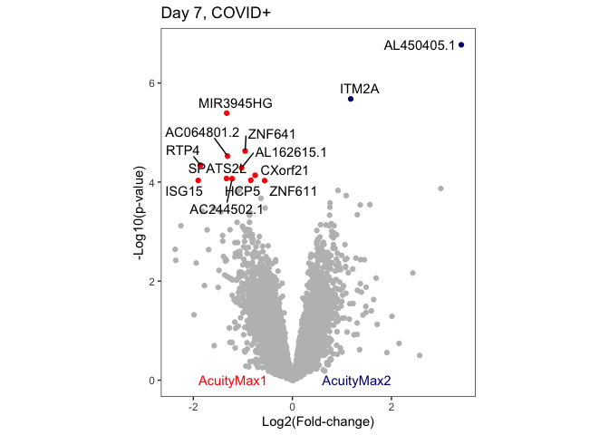<!-- -->

With these results we perform GSEA.

``` r
gmt.file <- gmtPathways(paste0(prefix,"all_gene_sets.gmt"))
ranking0 <- res0[,"rank"]
names(ranking0) <- res0$symbol
set.seed(15001)
fgseaRes0 <- fgsea(pathways = gmt.file, 
                  stats = ranking0,
                  minSize=25,
                  maxSize=1000,
                  eps = 0)
#write.table(fgseaRes0[,1:7], file = paste0(prefix,"GSEA_",filenam,".txt"), sep = "\t")

ranking3 <- res3[,"rank"]
names(ranking3) <- res3$symbol
set.seed(15001)
fgseaRes3 <- fgsea(pathways = gmt.file, 
                  stats = ranking3,
                  minSize=25,
                  maxSize=1000,
                  eps = 0)
#write.table(fgseaRes[,1:7], file = paste0(prefix,"GSEA_",filenam,".txt"), sep = "\t")

ranking7 <- res7[,"rank"]
names(ranking7) <- res7$symbol
set.seed(15001)
fgseaRes7 <- fgsea(pathways = gmt.file, 
                  stats = ranking7,
                  minSize=25,
                  maxSize=1000,
                  eps = 0)
#write.table(fgseaRes[,1:7], file = paste0(prefix,"GSEA_",filenam,".txt"), sep = "\t")

pathways_to_show <- c("ARDS_UP_JUSS","GO_DEFENSE_RESPONSE_TO_VIRUS","HALLMARK_INTERFERON_ALPHA_RESPONSE","HALLMARK_INTERFERON_GAMMA_RESPONSE","HALLMARK_HYPOXIA","GO_HEXOSE_CATABOLIC_PROCESS","REACTOME_NEUTROPHIL_DEGRANULATION","HALLMARK_GLYCOLYSIS","HALLMARK_MTORC1_SIGNALING","HALLMARK_FATTY_ACID_METABOLISM","GO_NADP_METABOLIC_PROCESS","GO_SYNAPTIC_TRANSMISSION_GLUTAMATERGIC","GO_TRICARBOXYLIC_ACID_CYCLE","HALLMARK_MYC_TARGETS_V1","HALLMARK_OXIDATIVE_PHOSPHORYLATION","GO_RIBOSOME_BIOGENESIS","GO_RESPIRATORY_ELECTRON_TRANSPORT_CHAIN","ARDS_DOWN_JUSS")
gsea_results0 <- fgseaRes0[fgseaRes0$pathway %in% pathways_to_show,]
gsea_results0 <- gsea_results0[,c(1,2,6)]
gsea_results0$Day <- "D0"
gsea_results3 <- fgseaRes3[fgseaRes3$pathway %in% pathways_to_show,]
gsea_results3 <- gsea_results3[,c(1,2,6)]
gsea_results3$Day <- "D3"
gsea_results7 <- fgseaRes7[fgseaRes7$pathway %in% pathways_to_show,]
gsea_results7 <- gsea_results7[,c(1,2,6)]
gsea_results7$Day <- "D7"

gsea_results <- rbind(gsea_results0,gsea_results3,gsea_results7)
gsea_results$pathwayMean <- NA
for (i in 1:nrow(gsea_results)){
  gsea_results$pathwayMean[i] <- mean(gsea_results$NES[gsea_results$pathway == gsea_results$pathway[i]])
}
fgseaordered <- gsea_results[(order(gsea_results$pathwayMean)),]
gsea_results <- gsea_results %>%
  arrange(factor(pathway, levels = fgseaordered$pathway[!duplicated(fgseaordered$pathway)]))

gsea_results$number <- rev(rep((1:(length(pathways_to_show)))*2,each = 3))
gsea_results$logp <- -log10(gsea_results$pval)
gsea_results$logp[gsea_results$logp < -log10(0.05)] <- NA

p1 <- ggplot(gsea_results, aes(x = Day, y = number)) + geom_point(aes(size = logp, fill = NES), alpha = 0.75, shape = 21) + scale_size_continuous(limits = c(0, 50), range = c(1,5.5), breaks = c(1,10,30,50)) + scale_fill_gradient(low = "red", high = "blue") + coord_fixed(ratio = .4) + theme_bw()
```

**Figure 3G:**

``` r
p1
```

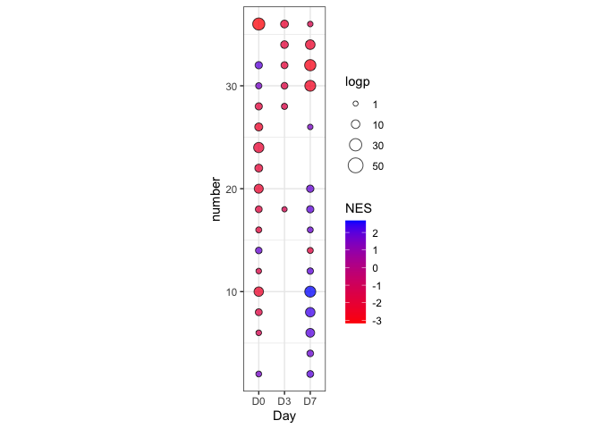<!-- -->

Next we want to see how neutrophil states differ between AcuityMax1 and
AcuityMax2. We start with the NMF cluster identities.

``` r
pvals <- as.data.frame(matrix(0L, nrow = 3, ncol = 7))
rownames(pvals) <- c("D0","D3","D7")
colnames(pvals) <- c("1","2","3","4","5","6","7")

metadata_temp <- metadata_filtered[metadata_filtered$COVID == "Positive" & metadata_filtered$Day == "D0" & metadata_filtered$severity.max == "severe",]
for (i in 1:7){
  twoway <- matrix(0L, nrow = 2, ncol = 2)
  twoway[1,1] <- sum(metadata_temp$Acuity.max == "1" & metadata_temp$cluster_neuhi == i)
  twoway[1,2] <- sum(metadata_temp$Acuity.max == "2" & metadata_temp$cluster_neuhi == i)
  twoway[2,1] <- sum(metadata_temp$Acuity.max == "1" & metadata_temp$cluster_neuhi != i)
  twoway[2,2] <- sum(metadata_temp$Acuity.max == "2" & metadata_temp$cluster_neuhi != i)
  
  pval <- fisher.test(twoway)
  pvals[1,i] <- pval$p.value
}

metadata_temp <- metadata_filtered[metadata_filtered$COVID == "Positive" & metadata_filtered$Day == "D3" & metadata_filtered$severity.max == "severe",]
for (i in 1:7){
  twoway <- matrix(0L, nrow = 2, ncol = 2)
  twoway[1,1] <- sum(metadata_temp$Acuity.max == "1" & metadata_temp$cluster_neuhi == i)
  twoway[1,2] <- sum(metadata_temp$Acuity.max == "2" & metadata_temp$cluster_neuhi == i)
  twoway[2,1] <- sum(metadata_temp$Acuity.max == "1" & metadata_temp$cluster_neuhi != i)
  twoway[2,2] <- sum(metadata_temp$Acuity.max == "2" & metadata_temp$cluster_neuhi != i)
  
  pval <- fisher.test(twoway)
  pvals[2,i] <- pval$p.value
}

metadata_temp <- metadata_filtered[metadata_filtered$COVID == "Positive" & metadata_filtered$Day == "D7" & metadata_filtered$severity.max == "severe",]
for (i in 1:7){
  twoway <- matrix(0L, nrow = 2, ncol = 2)
  twoway[1,1] <- sum(metadata_temp$Acuity.max == "1" & metadata_temp$cluster_neuhi == i)
  twoway[1,2] <- sum(metadata_temp$Acuity.max == "2" & metadata_temp$cluster_neuhi == i)
  twoway[2,1] <- sum(metadata_temp$Acuity.max == "1" & metadata_temp$cluster_neuhi != i)
  twoway[2,2] <- sum(metadata_temp$Acuity.max == "2" & metadata_temp$cluster_neuhi != i)
  
  pval <- fisher.test(twoway)
  pvals[3,i] <- pval$p.value
}

pvallist <- as.numeric(c(pvals[1,],pvals[2,],pvals[3,]))
pvallistcorrected <- p.adjust(pvallist, method = "fdr")
pvals[1,] <- pvallistcorrected[1:7]
pvals[2,] <- pvallistcorrected[8:14]
pvals[3,] <- pvallistcorrected[15:21]

nmftable <- as.data.frame(matrix(0L, nrow = 14, ncol = 3))
colnames(nmftable) <- c("Cluster","Severity","Freq")
nmftable$Cluster <- rep(1:7, each = 2)
nmftable$Acuity <- rep(c("1","2"),7)

metadata_temp <- metadata_filtered[metadata_filtered$COVID == "Positive" & metadata_filtered$Day == "D0" & metadata_filtered$severity.max == "severe",]
for (i in 1:nrow(nmftable)){
  nmftable$Freq[i] <- sum(metadata_temp$cluster_neuhi == nmftable$Cluster[i] & metadata_temp$Acuity.max == nmftable$Acuity[i])/sum(metadata_temp$Acuity.max == nmftable$Acuity[i])
}

p1 <- ggplot(nmftable, aes(x = factor(Cluster), y = Freq*100, fill = Acuity)) + geom_bar(position="dodge", stat="identity") + theme_bw() + xlab("") + ylab("Frequency") + ggtitle("Day 0, COVIDP") + scale_fill_manual(values = c("red","navy")) + theme(legend.position = "none")

metadata_temp <- metadata_filtered[metadata_filtered$COVID == "Positive" & metadata_filtered$Day == "D3" & metadata_filtered$severity.max == "severe",]
for (i in 1:nrow(nmftable)){
  nmftable$Freq[i] <- sum(metadata_temp$cluster_neuhi == nmftable$Cluster[i] & metadata_temp$Acuity.max == nmftable$Acuity[i])/sum(metadata_temp$Acuity.max == nmftable$Acuity[i])
}

p2 <- ggplot(nmftable, aes(x = factor(Cluster), y = Freq*100, fill = Acuity)) + geom_bar(position="dodge", stat="identity") + theme_bw() + xlab("") + ylab("Frequency") + ggtitle("Day 3, COVIDP") + scale_fill_manual(values = c("red","navy")) + theme(legend.position = "none")

metadata_temp <- metadata_filtered[metadata_filtered$COVID == "Positive" & metadata_filtered$Day == "D7" & metadata_filtered$severity.max == "severe",]
for (i in 1:nrow(nmftable)){
  nmftable$Freq[i] <- sum(metadata_temp$cluster_neuhi == nmftable$Cluster[i] & metadata_temp$Acuity.max == nmftable$Acuity[i])/sum(metadata_temp$Acuity.max == nmftable$Acuity[i])
}

p3 <- ggplot(nmftable, aes(x = factor(Cluster), y = Freq*100, fill = Acuity)) + geom_bar(position="dodge", stat="identity") + theme_bw() + xlab("NMF Cluster") + ylab("Frequency") + ggtitle("Day 7, COVIDP") + scale_fill_manual(values = c("red","navy")) + theme(legend.position = "none")
```

**Figure S13D:**

``` r
cowplot::plot_grid(p1,p2,p3,ncol=1)
```

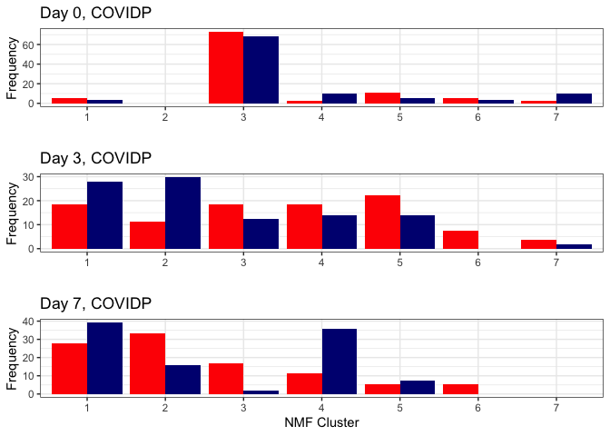<!-- -->

Next we perform GSEA for the neutrophil state gene sets.

``` r
gmt.file <- gmtPathways(paste0(prefix,"neutrophil_state_gene_sets_ensembl.gmt"))

ranking0 <- res0[,"rank"]
names(ranking0) <- rownames(res0)
set.seed(15001)
fgseaRes0 <- fgsea(pathways = gmt.file, 
                  stats = ranking0,
                  minSize=25,
                  maxSize=1000,
                  eps = 0)
#write.table(fgseaRes0[,1:7], file = paste0(prefix,"GSEA_",filenam,".txt"), sep = "\t")

ranking3 <- res3[,"rank"]
names(ranking3) <- rownames(res3)
set.seed(15001)
fgseaRes3 <- fgsea(pathways = gmt.file, 
                  stats = ranking3,
                  minSize=25,
                  maxSize=1000,
                  eps = 0)
#write.table(fgseaRes[,1:7], file = paste0(prefix,"GSEA_",filenam,".txt"), sep = "\t")

ranking7 <- res7[,"rank"]
names(ranking7) <- rownames(res7)
set.seed(15001)
fgseaRes7 <- fgsea(pathways = gmt.file, 
                  stats = ranking7,
                  minSize=25,
                  maxSize=1000,
                  eps = 0)
#write.table(fgseaRes[,1:7], file = paste0(prefix,"GSEA_",filenam,".txt"), sep = "\t")

gsea_results0 <- fgseaRes0[,c(1,2,6)]
gsea_results0$Day <- "D0"
gsea_results3 <- fgseaRes3[,c(1,2,6)]
gsea_results3$Day <- "D3"
gsea_results7 <- fgseaRes7[,c(1,2,6)]
gsea_results7$Day <- "D7"

gsea_results <- rbind(gsea_results0,gsea_results3,gsea_results7)
gsea_results$pathwayMean <- NA
for (i in 1:nrow(gsea_results)){
  gsea_results$pathwayMean[i] <- mean(gsea_results$NES[gsea_results$pathway == gsea_results$pathway[i]])
}
fgseaordered <- gsea_results[rev(order(gsea_results$pathwayMean)),]
fgseaordered <- fgseaordered[-c(34,35),] #HBNeutro6 was removed as it did not have enough genes to be scored on Day 7
gsea_results <- gsea_results %>%
  arrange(factor(pathway, levels = fgseaordered$pathway[!duplicated(fgseaordered$pathway)]))
gsea_results <- gsea_results[-c(97,98),]

gsea_results$number <- rev(rep((1:(length(fgseaordered$pathway[!duplicated(fgseaordered$pathway)])))*2,each = 3))
gsea_results$logp <- -log10(gsea_results$pval)
gsea_results$logp[gsea_results$logp < -log10(0.05)] <- NA

p1 <- ggplot(gsea_results, aes(x = Day, y = number)) + geom_point(aes(size = logp, fill = NES), alpha = 0.75, shape = 21) + scale_size_continuous(limits = c(0, 53), range = c(1,5.5), breaks = c(1,10,30,50)) + scale_fill_gradient(low = "red", high = "blue") + coord_fixed(ratio = .4) + theme_bw()
```

**Figure S13E:**

``` r
p1
```

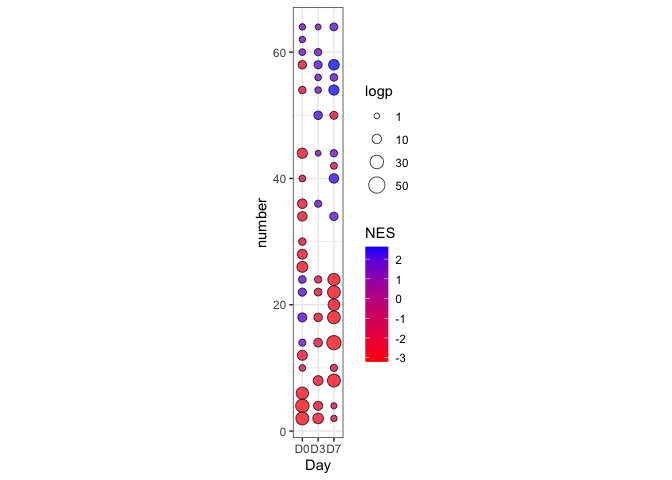<!-- -->

Of note, the interferon gamma and alpha response metagenes switch in
enrichment from A1 on Day 0 to A2 on Days 3 and 7.

``` r
getEnrichmentDataframe <- function (pathway, stats, gseaParam = 1, ticksSize = 0.2) {
    rnk <- rank(-stats)
    ord <- order(rnk)
    statsAdj <- stats[ord]
    statsAdj <- sign(statsAdj) * (abs(statsAdj)^gseaParam)
    statsAdj <- statsAdj/max(abs(statsAdj))
    pathway <- unname(as.vector(na.omit(match(pathway, names(statsAdj)))))
    pathway <- sort(pathway)
    gseaRes <- calcGseaStat(statsAdj, selectedStats = pathway, returnAllExtremes = TRUE)
    bottoms <- gseaRes$bottoms
    tops <- gseaRes$tops
    combo <- as.data.frame(cbind(tops,bottoms))
    combo$average <- matrix(0L, nrow = nrow(combo), ncol = 1)
    for (p in 1:nrow(combo)){
      combo$average[p] <- (combo$tops[p]+combo$bottoms[p])/2
    }
    combo <- cbind(combo,pathway)
    return(combo)
}

gmt.file <- gmtPathways(paste0(prefix,"all_gene_sets.gmt"))
ranking0 <- res0[,"rank"]
names(ranking0) <- res0$symbol
ranking3 <- res3[,"rank"]
names(ranking3) <- res3$symbol
ranking7 <- res7[,"rank"]
names(ranking7) <- res7$symbol
IFNpathways <- c("HALLMARK_INTERFERON_ALPHA_RESPONSE","HALLMARK_INTERFERON_GAMMA_RESPONSE")

dataframe0 <- getEnrichmentDataframe(gmt.file[[IFNpathways[1]]], ranking0)
IFNdf0 <- cbind(dataframe0$pathway,dataframe0$average,rep(IFNpathways[1],nrow(dataframe0)))
colnames(IFNdf0) <- c("rank","enrichment","pathway")
for (i in 2:length(IFNpathways)){
  dataframe0 <- getEnrichmentDataframe(gmt.file[[IFNpathways[i]]],
               ranking0)
  temp <- cbind(dataframe0$pathway,dataframe0$average,rep(IFNpathways[i],nrow(dataframe0)))
  colnames(temp) <- c("rank","enrichment","pathway")
  IFNdf0 <- as.data.frame(rbind(IFNdf0,temp))
}
IFNdf0$Day <- "D0"
IFNdf0$rank <- as.numeric(IFNdf0$rank)/max(as.numeric(IFNdf0$rank))
dataframe3 <- getEnrichmentDataframe(gmt.file[[IFNpathways[1]]], ranking3)
IFNdf3 <- cbind(dataframe3$pathway,dataframe3$average,rep(IFNpathways[1],nrow(dataframe3)))
colnames(IFNdf3) <- c("rank","enrichment","pathway")
for (i in 2:length(IFNpathways)){
  dataframe3 <- getEnrichmentDataframe(gmt.file[[IFNpathways[i]]],
               ranking3)
  temp <- cbind(dataframe3$pathway,dataframe3$average,rep(IFNpathways[i],nrow(dataframe3)))
  colnames(temp) <- c("rank","enrichment","pathway")
  IFNdf3 <- as.data.frame(rbind(IFNdf3,temp))
}
IFNdf3$Day <- "D3"
IFNdf3$rank <- as.numeric(IFNdf3$rank)/max(as.numeric(IFNdf3$rank))
dataframe7 <- getEnrichmentDataframe(gmt.file[[IFNpathways[1]]], ranking7)
IFNdf7 <- cbind(dataframe7$pathway,dataframe7$average,rep(IFNpathways[1],nrow(dataframe7)))
colnames(IFNdf7) <- c("rank","enrichment","pathway")
for (i in 2:length(IFNpathways)){
  dataframe7 <- getEnrichmentDataframe(gmt.file[[IFNpathways[i]]],
               ranking7)
  temp <- cbind(dataframe7$pathway,dataframe7$average,rep(IFNpathways[i],nrow(dataframe7)))
  colnames(temp) <- c("rank","enrichment","pathway")
  IFNdf7 <- as.data.frame(rbind(IFNdf7,temp))
}
IFNdf7$Day <- "D7"
IFNdf7$rank <- as.numeric(IFNdf7$rank)/max(as.numeric(IFNdf7$rank))

IFNAres <- rbind(IFNdf0[IFNdf0$pathway == "HALLMARK_INTERFERON_ALPHA_RESPONSE",],IFNdf3[IFNdf3$pathway == "HALLMARK_INTERFERON_ALPHA_RESPONSE",],IFNdf7[IFNdf7$pathway == "HALLMARK_INTERFERON_ALPHA_RESPONSE",])
IFNGres <- rbind(IFNdf0[IFNdf0$pathway == "HALLMARK_INTERFERON_GAMMA_RESPONSE",],IFNdf3[IFNdf3$pathway == "HALLMARK_INTERFERON_GAMMA_RESPONSE",],IFNdf7[IFNdf7$pathway == "HALLMARK_INTERFERON_GAMMA_RESPONSE",])

my.cols <- brewer.pal(3,"Set2")
p1 <- ggplot(as.data.frame(IFNAres), aes(x = as.numeric(rank), y = as.numeric(enrichment), colour = Day)) + geom_point(aes(shape = Day)) + theme_bw() + scale_colour_manual(values = my.cols) + coord_fixed(ratio = .65) + theme(panel.grid.minor = element_blank(), legend.text=element_text(size=6)) + xlab("Rank in Gene List") + ylab("Running Enrichment Score") + ggtitle("HALLMARK_INTERFERON_ALPHA_RESPONSE") + scale_shape_manual(values = c(16,15,17))
p2 <- ggplot(as.data.frame(IFNGres), aes(x = as.numeric(rank), y = as.numeric(enrichment), colour = Day)) + geom_point(aes(shape = Day)) + theme_bw() + scale_colour_manual(values = my.cols) + coord_fixed(ratio = .8) + theme(panel.grid.minor = element_blank(), legend.text=element_text(size=6)) + xlab("Rank in Gene List") + ylab("Running Enrichment Score") + ggtitle("HALLMARK_INTERFERON_GAMMA_RESPONSE") + scale_shape_manual(values = c(16,15,17))
```

**Figure 3H:**

``` r
p1
```

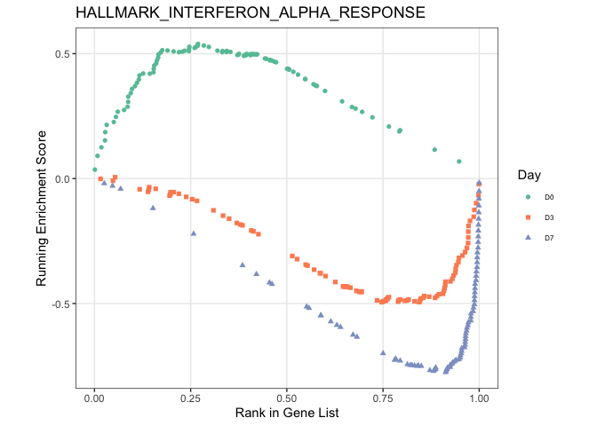<!-- -->

``` r
p2
```

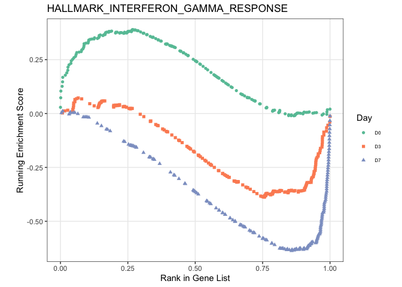<!-- -->

Let’s check if this is reflected in the neutrophil states as well.

``` r
gmt.file <- gmtPathways(paste0(prefix,"neutrophil_state_gene_sets_ensembl.gmt"))
ranking0 <- res0[,"rank"]
names(ranking0) <- rownames(res0)
ranking3 <- res3[,"rank"]
names(ranking3) <- rownames(res3)
ranking7 <- res7[,"rank"]
names(ranking7) <- rownames(res7)
NMFpathways <- c("NMF3","NMF6")

dataframe0 <- getEnrichmentDataframe(gmt.file[[NMFpathways[1]]], ranking0)
NMFdf0 <- cbind(dataframe0$pathway,dataframe0$average,rep(NMFpathways[1],nrow(dataframe0)))
colnames(NMFdf0) <- c("rank","enrichment","pathway")
for (i in 2:length(NMFpathways)){
  dataframe0 <- getEnrichmentDataframe(gmt.file[[NMFpathways[i]]],
               ranking0)
  temp <- cbind(dataframe0$pathway,dataframe0$average,rep(NMFpathways[i],nrow(dataframe0)))
  colnames(temp) <- c("rank","enrichment","pathway")
  NMFdf0 <- as.data.frame(rbind(NMFdf0,temp))
}
NMFdf0$Day <- "D0"
NMFdf0$rank <- as.numeric(NMFdf0$rank)/max(as.numeric(NMFdf0$rank))
dataframe3 <- getEnrichmentDataframe(gmt.file[[NMFpathways[1]]], ranking3)
NMFdf3 <- cbind(dataframe3$pathway,dataframe3$average,rep(NMFpathways[1],nrow(dataframe3)))
colnames(NMFdf3) <- c("rank","enrichment","pathway")
for (i in 2:length(NMFpathways)){
  dataframe3 <- getEnrichmentDataframe(gmt.file[[NMFpathways[i]]],
               ranking3)
  temp <- cbind(dataframe3$pathway,dataframe3$average,rep(NMFpathways[i],nrow(dataframe3)))
  colnames(temp) <- c("rank","enrichment","pathway")
  NMFdf3 <- as.data.frame(rbind(NMFdf3,temp))
}
NMFdf3$Day <- "D3"
NMFdf3$rank <- as.numeric(NMFdf3$rank)/max(as.numeric(NMFdf3$rank))
dataframe7 <- getEnrichmentDataframe(gmt.file[[NMFpathways[1]]], ranking7)
NMFdf7 <- cbind(dataframe7$pathway,dataframe7$average,rep(NMFpathways[1],nrow(dataframe7)))
colnames(NMFdf7) <- c("rank","enrichment","pathway")
for (i in 2:length(NMFpathways)){
  dataframe7 <- getEnrichmentDataframe(gmt.file[[NMFpathways[i]]],
               ranking7)
  temp <- cbind(dataframe7$pathway,dataframe7$average,rep(NMFpathways[i],nrow(dataframe7)))
  colnames(temp) <- c("rank","enrichment","pathway")
  NMFdf7 <- as.data.frame(rbind(NMFdf7,temp))
}
NMFdf7$Day <- "D7"
NMFdf7$rank <- as.numeric(NMFdf7$rank)/max(as.numeric(NMFdf7$rank))

NMF3res <- rbind(NMFdf0[NMFdf0$pathway == "NMF3",],NMFdf3[NMFdf3$pathway == "NMF3",],NMFdf7[NMFdf7$pathway == "NMF3",])
NMF6res <- rbind(NMFdf0[NMFdf0$pathway == "NMF6",],NMFdf3[NMFdf3$pathway == "NMF6",],NMFdf7[NMFdf7$pathway == "NMF6",])

my.cols <- brewer.pal(3,"Set2")
p1 <- ggplot(as.data.frame(NMF3res), aes(x = as.numeric(rank), y = as.numeric(enrichment), colour = Day)) + geom_point(aes(shape = Day)) + theme_bw() + scale_colour_manual(values = my.cols) + coord_fixed(ratio = .65) + theme(panel.grid.minor = element_blank(), legend.text=element_text(size=6)) + xlab("Rank in Gene List") + ylab("Running Enrichment Score") + ggtitle("NMF3 Gene Signature") + scale_shape_manual(values = c(16,15,17))
p2 <- ggplot(as.data.frame(NMF6res), aes(x = as.numeric(rank), y = as.numeric(enrichment), colour = Day)) + geom_point(aes(shape = Day)) + theme_bw() + scale_colour_manual(values = my.cols) + coord_fixed(ratio = .5) + theme(panel.grid.minor = element_blank(), legend.text=element_text(size=6)) + xlab("Rank in Gene List") + ylab("Running Enrichment Score") + ggtitle("NMF6 Gene Signature") + scale_shape_manual(values = c(16,15,17))
```

**Figure 3I:**

``` r
p1
```

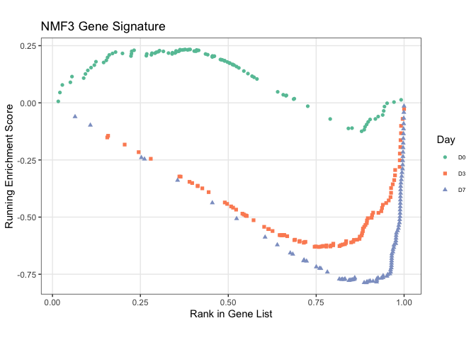<!-- -->

``` r
p2
```

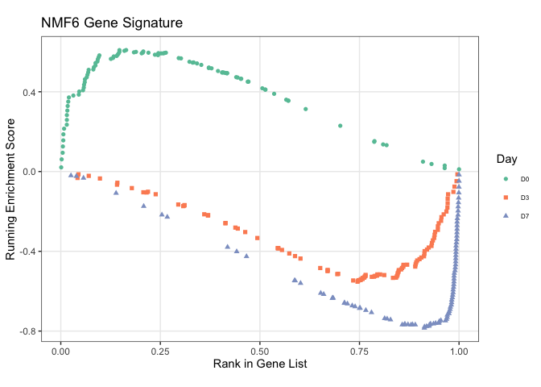<!-- -->

Since the previous Acuity-focused analysis revealed key branches in gene
expression across time, we search for diverging gene expression patterns
between severe and non-severe patients using a DESeq2 LRT model that
includes a Day:severity interaction term.

``` r
DESeq2_list <- Neutrophil_DESeq2(counts = Count_filtered, mdata = metadata_filtered, covid = "Positive", day = c("D0","D3","D7"))
dds <- DESeqDataSetFromMatrix(countData = DESeq2_list$Count_select, colData = DESeq2_list$coldata, design = ~ Neutrophil_total + T_NK_factor + Monocyte_factor + IG_factor + Plasmablast_factor + Day + severity.max + Day:severity.max)
dds_lrt_time <- DESeq(dds, test="LRT", reduced = ~ Neutrophil_total + T_NK_factor + Monocyte_factor + IG_factor + Plasmablast_factor + Day + severity.max)
res_LRT_time <- as.data.frame(results(dds_lrt_time))

filenam <- "COVID+_Day_severity_LRT_correct-NeuCont+TNK+Monocyte+Plasmablast+IG"
temp <- genepc[which(genepc$Gene.stable.ID %in% rownames(res_LRT_time)),]
res_LRT_time$symbol <- matrix(0L, nrow = nrow(res_LRT_time))
for (i in 1:nrow(res_LRT_time)){
  if (rownames(res_LRT_time)[i] %in% temp$Gene.stable.ID){
    res_LRT_time$symbol[i] <- temp$Gene.name[which(rownames(res_LRT_time)[i] == temp$Gene.stable.ID)]
  } else {
    res_LRT_time$symbol[i] <- rownames(res_LRT_time)[i]
  }
}
res_LRT_time$rank <- sign(res_LRT_time$log2FoldChange)*(-1)*log10(res_LRT_time$pvalue)
res_LRT_time <- res_LRT_time[complete.cases(res_LRT_time),]
res_LRT_time_sig <- res_LRT_time[res_LRT_time$padj < 0.05,]
#write.table(res_LRT_time,paste0("~/Documents/Github/DESeq2/",filenam,".txt"),sep = "\t")
```

Two of the top hits are *SERPINB2* and *ZBTB16*.

``` r
metadata_temp <- metadata_filtered[metadata_filtered$COVID == "Positive" & metadata_filtered$Day %in% c("D0","D3","D7"),]
my.cols <- brewer.pal(3, "RdBu")
p1 <- ggplot(metadata_temp, aes(x = factor(Day), y = as.numeric(SERPINB2_logTPM), fill = factor(severity.max))) + geom_boxplot(outlier.shape = NA) + geom_point(position = position_jitterdodge(), alpha = 0.3) + theme_bw() + xlab("Day") + ylab("log2(TPM+1)") + scale_fill_manual(values = my.cols[c(3,1)]) + coord_fixed(ratio = 0.5) + stat_compare_means() + ggtitle("SERPINB2")
p1$labels$fill <- "Severity Max"

p2 <- ggplot(metadata_temp, aes(x = factor(Day), y = as.numeric(ZBTB16_logTPM), fill = factor(severity.max))) + geom_boxplot(outlier.shape = NA) + geom_point(position = position_jitterdodge(), alpha = 0.3) + theme_bw() + xlab("Day") + ylab("log2(TPM+1)") + scale_fill_manual(values = my.cols[c(3,1)]) + coord_fixed(ratio = 0.4) + stat_compare_means() + ggtitle("ZBTB16")
p2$labels$fill <- "Severity Max"
```

**Figure 3J:**

``` r
p1
```

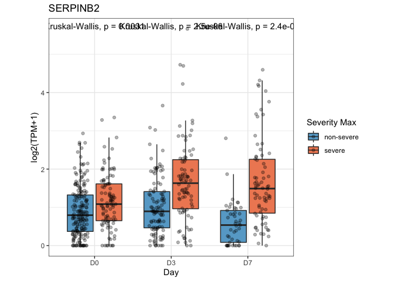<!-- -->

``` r
p2
```

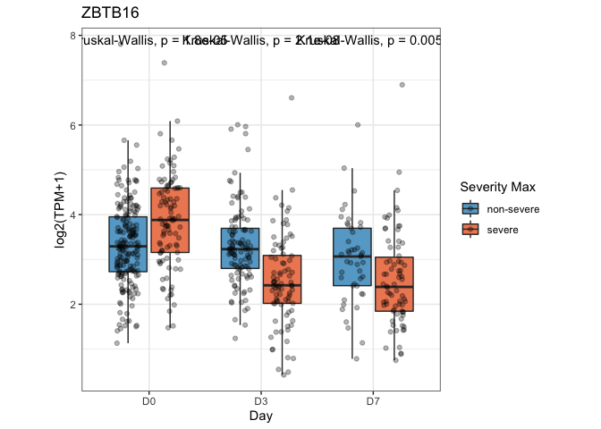<!-- -->

We can visualize the effect of several genes by plotting the
delta(fold-change) in severe vs. non-severe from Day 0 to Day 7. Then we
can color the points according to their fold-change from Day 0 to Day 7
for severe patients only to get a sense of where the difference in
fold-change is coming from.

``` r
DESeq2_list <- Neutrophil_DESeq2(counts = Count_filtered, mdata = metadata_filtered, covid = "Positive", day = c("D0","D7"), severity = "severe")
dds <- DESeqDataSetFromMatrix(countData = DESeq2_list$Count_select, colData = DESeq2_list$coldata, design = ~ Neutrophil_total + T_NK_factor + Monocyte_factor + IG_factor + Plasmablast_factor + Day)
dds <- DESeq(dds)

res0to7 <- as.data.frame(results(dds, name="Day_D7_vs_D0"))
filenam <- "COVID+_severe_Day0_vs_Day7_correct-NeuCont+TNK+Monocyte+Plasmablast+IG"
temp <- genepc[which(genepc$Gene.stable.ID %in% rownames(res0to7)),]
res0to7$symbol <- matrix(0L, nrow = nrow(res0to7))
for (i in 1:nrow(res0to7)){
  if (rownames(res0to7)[i] %in% temp$Gene.stable.ID){
    res0to7$symbol[i] <- temp$Gene.name[which(rownames(res0to7)[i] == temp$Gene.stable.ID)]
  } else {
    res0to7$symbol[i] <- rownames(res0to7)[i]
  }
}
res0to7$rank <- sign(res0to7$log2FoldChange)*(-1)*log10(res0to7$pvalue)
res0to7 <- res0to7[complete.cases(res0to7),]
res0to7_sig <- res0to7[res0to7$padj < 0.05,]
#write.table(res0,paste0("~/Documents/Github/DESeq2/",filenam,".txt"),sep = "\t")

res0 <- read.xlsx(paste0(prefix,"Tables/TableS2.xlsx"),sheet = 5)
res0 <- res0[rev(order(res0$rank)),]

res7 <- read.xlsx(paste0(prefix,"Tables/TableS2.xlsx"),sheet = 11)
res7 <- res7[rev(order(res7$rank)),]

res_LRT_time <- res_LRT_time[rownames(res_LRT_time) %in% res0$Gene.ID,]
res_LRT_time <- res_LRT_time[rownames(res_LRT_time) %in% res7$Gene.ID,]
res_LRT_time$log10p <- -1*log10(res_LRT_time$pvalue)

res_LRT_time$day0fc <- matrix(0L, nrow = nrow(res_LRT_time), ncol = 1)
res_LRT_time$day7fc <- matrix(0L, nrow = nrow(res_LRT_time), ncol = 1)
res_LRT_time$severefc <- matrix(0L, nrow = nrow(res_LRT_time), ncol = 1)

for (i in 1:nrow(res_LRT_time)){
  res_LRT_time$day0fc[i] <- res0$log2FoldChange_severe_nonsevere[which(res0$Gene.ID == rownames(res_LRT_time)[i])]
  res_LRT_time$day7fc[i] <- res7$log2FoldChange_severe_nonsevere[which(res7$Gene.ID == rownames(res_LRT_time)[i])]
  res_LRT_time$DFC[i] <- res_LRT_time$day7fc[i] - res_LRT_time$day0fc[i]
  res_LRT_time$severefc[i] <- res0to7$log2FoldChange[which(rownames(res0to7) == rownames(res_LRT_time)[i])]
}

res_LRT_time <- res_LRT_time[res_LRT_time$symbol %in% c("DAAM2","ZBTB16","IL1R2","VWA8","ITGA5","IFI30","FCER1G","IFITM2","CD14","IL1B","FCGR1A","PI3","EGR2","IRAK2","SERPINB2","CCL2"),]

res_LRT_time <- res_LRT_time[order(res_LRT_time$DFC),]
res_LRT_time$idx <- (1:nrow(res_LRT_time))

my.cols <- brewer.pal(3,"RdBu")
p1 <- ggplot(res_LRT_time, aes(x = DFC, y = idx)) + geom_point(aes(size = log10p, colour = severefc)) + scale_size_continuous(limits = c(0, 30), range = c(1,7), breaks = c(1,5,10,15)) + scale_color_gradient2(low = my.cols[1], mid = "grey", high = my.cols[3]) + coord_fixed(ratio = .15) + theme_bw() + geom_text(aes(label = symbol))
```

**Figure S13F:**

``` r
p1
```

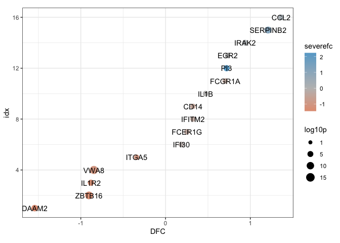<!-- -->

In addition to the gene-level analyses, we can look at which pathways
diverge between severe and non-severe patients based on GSEA.

``` r
res_LRT_time <- read.xlsx(paste0(prefix,"Tables/TableS3.xlsx"), sheet = 21)

gmt.file <- gmtPathways(paste0(prefix,"all_gene_sets.gmt"))
ranking <- res_LRT_time[,"rank"]
names(ranking) <- res_LRT_time$symbol
set.seed(15001)
fgseaRes <- fgsea(pathways = gmt.file, 
                  stats = ranking,
                  minSize=25,
                  maxSize=1000,
                  eps = 0)
```

    ## Warning in preparePathwaysAndStats(pathways, stats, minSize, maxSize,
    ## gseaParam, : There are duplicate gene names, fgsea may produce unexpected
    ## results.

``` r
#write.table(fgseaRes0[,1:7], file = paste0(prefix,"GSEA_",filenam,".txt"), sep = "\t")
```

Two of the top hits are GO\_GRANULOCYTE\_CHEMOTAXIS and
HALLMARK\_TNFA\_SIGNALING\_VIA\_NFKB.

``` r
source(paste0(prefix,"Pathway_scoring.R"))

GO_GRANULOCYTE_CHEMOTAXIS <- Pathway_scoring("GO_GRANULOCYTE_CHEMOTAXIS")
metadata_filtered$GO_GRANULOCYTE_CHEMOTAXIS <- (GO_GRANULOCYTE_CHEMOTAXIS)

HALLMARK_TNFA_SIGNALING_VIA_NFKB <- Pathway_scoring("HALLMARK_TNFA_SIGNALING_VIA_NFKB")
metadata_filtered$HALLMARK_TNFA_SIGNALING_VIA_NFKB <- (HALLMARK_TNFA_SIGNALING_VIA_NFKB)
```

``` r
metadata_temp <- metadata_filtered[metadata_filtered$COVID == "Positive" & metadata_filtered$Day %in% c("D0","D3","D7"),]
my.cols <- brewer.pal(3, "RdBu")
p1 <- ggplot(metadata_temp, aes(x = factor(Day), y = as.numeric(GO_GRANULOCYTE_CHEMOTAXIS), fill = factor(severity.max))) + geom_boxplot(outlier.shape = NA) + geom_point(position = position_jitterdodge(), alpha = 0.3) + theme_bw() + xlab("Day") + ylab("Metagene Score") + scale_fill_manual(values = my.cols[c(3,1)]) + coord_fixed(ratio = 1.65) + ggtitle("GO_GRANULOCYTE_CHEMOTAXIS")
p1$labels$fill <- "Severity Max"

p2 <- ggplot(metadata_temp, aes(x = factor(Day), y = as.numeric(HALLMARK_TNFA_SIGNALING_VIA_NFKB), fill = factor(severity.max))) + geom_boxplot(outlier.shape = NA) + geom_point(position = position_jitterdodge(), alpha = 0.3) + theme_bw() + xlab("Day") + ylab("Metagene Score") + scale_fill_manual(values = my.cols[c(3,1)]) + coord_fixed(ratio = 1.1) + ggtitle("HALLMARK_TNFA_SIGNALING_VIA_NFKB")
p2$labels$fill <- "Severity Max"
```

**Figure 3K:**

``` r
p1
```

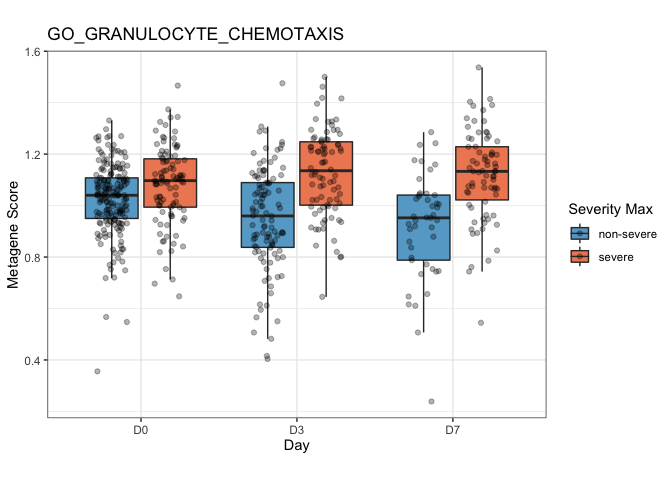<!-- -->

``` r
p2
```

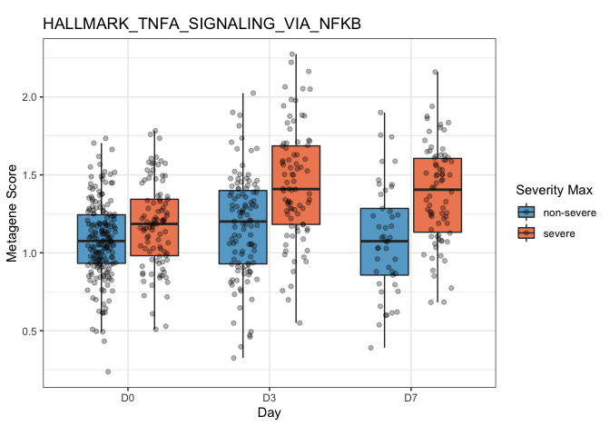<!-- -->

We can visualize several key pathways at once by plotting the normalized
enrichment score (NES) for the GSEA with the color of each point
indicating the difference in pathway metagene score between Day 0 and 7
for severe patients.

``` r
res <- read.xlsx(paste0(prefix,"Tables/TableS3.xlsx"),sheet = 22)
ressig <- res[res$padj < 0.05,]

ressig <- ressig[ressig$pathway %in% c("HALLMARK_TNFA_SIGNALING_VIA_NFKB","GO_GRANULOCYTE_CHEMOTAXIS","GO_MYD88_DEPENDENT_TOLL_LIKE_RECEPTOR_SIGNALING_PATHWAY","GO_REGULATION_OF_LEUKOCYTE_DEGRANULATION","HALLMARK_COMPLEMENT","GO_RESPONSE_TO_INTERLEUKIN_1","GO_RESPONSE_TO_TUMOR_NECROSIS_FACTOR","HALLMARK_IL2_STAT5_SIGNALING","GO_SPECIFIC_GRANULE","HALLMARK_KRAS_SIGNALING_UP","GO_CELLULAR_RESPONSE_TO_MOLECULE_OF_BACTERIAL_ORIGIN","GO_REGULATION_OF_WOUND_HEALING","HALLMARK_HYPOXIA","HALLMARK_HEME_METABOLISM","GO_TOLL_LIKE_RECEPTOR_SIGNALING_PATHWAY","GO_GOLGI_VESICLE_TRANSPORT"),]

GO_MYD88_DEPENDENT_TOLL_LIKE_RECEPTOR_SIGNALING_PATHWAY <- Pathway_scoring("GO_MYD88_DEPENDENT_TOLL_LIKE_RECEPTOR_SIGNALING_PATHWAY")
metadata_filtered$GO_MYD88_DEPENDENT_TOLL_LIKE_RECEPTOR_SIGNALING_PATHWAY <- (GO_MYD88_DEPENDENT_TOLL_LIKE_RECEPTOR_SIGNALING_PATHWAY)
GO_REGULATION_OF_LEUKOCYTE_DEGRANULATION <- Pathway_scoring("GO_REGULATION_OF_LEUKOCYTE_DEGRANULATION")
metadata_filtered$GO_REGULATION_OF_LEUKOCYTE_DEGRANULATION <- (GO_REGULATION_OF_LEUKOCYTE_DEGRANULATION)
HALLMARK_COMPLEMENT <- Pathway_scoring("HALLMARK_COMPLEMENT")
metadata_filtered$HALLMARK_COMPLEMENT <- (HALLMARK_COMPLEMENT)
GO_RESPONSE_TO_INTERLEUKIN_1 <- Pathway_scoring("GO_RESPONSE_TO_INTERLEUKIN_1")
metadata_filtered$GO_RESPONSE_TO_INTERLEUKIN_1 <- (GO_RESPONSE_TO_INTERLEUKIN_1)
GO_RESPONSE_TO_TUMOR_NECROSIS_FACTOR <- Pathway_scoring("GO_RESPONSE_TO_TUMOR_NECROSIS_FACTOR")
metadata_filtered$GO_RESPONSE_TO_TUMOR_NECROSIS_FACTOR <- (GO_RESPONSE_TO_TUMOR_NECROSIS_FACTOR)
HALLMARK_IL2_STAT5_SIGNALING <- Pathway_scoring("HALLMARK_IL2_STAT5_SIGNALING")
metadata_filtered$HALLMARK_IL2_STAT5_SIGNALING <- (HALLMARK_IL2_STAT5_SIGNALING)
GO_SPECIFIC_GRANULE <- Pathway_scoring("GO_SPECIFIC_GRANULE")
metadata_filtered$GO_SPECIFIC_GRANULE <- (GO_SPECIFIC_GRANULE)
HALLMARK_KRAS_SIGNALING_UP <- Pathway_scoring("HALLMARK_KRAS_SIGNALING_UP")
metadata_filtered$HALLMARK_KRAS_SIGNALING_UP <- (HALLMARK_KRAS_SIGNALING_UP)
GO_CELLULAR_RESPONSE_TO_MOLECULE_OF_BACTERIAL_ORIGIN <- Pathway_scoring("GO_CELLULAR_RESPONSE_TO_MOLECULE_OF_BACTERIAL_ORIGIN")
metadata_filtered$GO_CELLULAR_RESPONSE_TO_MOLECULE_OF_BACTERIAL_ORIGIN <- (GO_CELLULAR_RESPONSE_TO_MOLECULE_OF_BACTERIAL_ORIGIN)
GO_REGULATION_OF_WOUND_HEALING <- Pathway_scoring("GO_REGULATION_OF_WOUND_HEALING")
metadata_filtered$GO_REGULATION_OF_WOUND_HEALING <- (GO_REGULATION_OF_WOUND_HEALING)
HALLMARK_HYPOXIA <- Pathway_scoring("HALLMARK_HYPOXIA")
metadata_filtered$HALLMARK_HYPOXIA <- (HALLMARK_HYPOXIA)
HALLMARK_HEME_METABOLISM <- Pathway_scoring("HALLMARK_HEME_METABOLISM")
metadata_filtered$HALLMARK_HEME_METABOLISM <- (HALLMARK_HEME_METABOLISM)
GO_TOLL_LIKE_RECEPTOR_SIGNALING_PATHWAY <- Pathway_scoring("GO_TOLL_LIKE_RECEPTOR_SIGNALING_PATHWAY")
metadata_filtered$GO_TOLL_LIKE_RECEPTOR_SIGNALING_PATHWAY <- (GO_TOLL_LIKE_RECEPTOR_SIGNALING_PATHWAY)
GO_GOLGI_VESICLE_TRANSPORT <- Pathway_scoring("GO_GOLGI_VESICLE_TRANSPORT")
metadata_filtered$GO_GOLGI_VESICLE_TRANSPORT <- (GO_GOLGI_VESICLE_TRANSPORT)

ressig$log10p <- -1*log10(ressig$pval)

ressig$day0 <- matrix(0L, nrow = nrow(ressig), ncol = 1)
ressig$day7 <- matrix(0L, nrow = nrow(ressig), ncol = 1)

for (i in 1:nrow(ressig)){
  ressig$day0[i] <- mean(metadata_filtered[metadata_filtered$Day == "D0" & metadata_filtered$COVID == "Positive" & metadata_filtered$severity.max == "severe",colnames(metadata_filtered) == ressig$pathway[i]])
  ressig$day7[i] <- mean(metadata_filtered[metadata_filtered$Day == "D7" & metadata_filtered$COVID == "Positive" & metadata_filtered$severity.max == "severe",colnames(metadata_filtered) == ressig$pathway[i]])
  ressig$Dscore[i] <- ressig$day7[i] - ressig$day0[i]
}

ressig <- ressig[order(as.numeric(ressig$NES)),]
ressig$idx <- (1:nrow(ressig))

my.cols <- brewer.pal(3,"BuPu")
p1 <- ggplot(ressig, aes(x = as.numeric(NES), y = idx)) + geom_point(aes(size = log10p, colour = Dscore)) + scale_size_continuous(limits = c(0, 30), range = c(1,7), breaks = c(1,5,10,15)) + scale_color_gradient2(low = my.cols[3], mid = "grey", high = bluishgreen) + coord_fixed(ratio = .25) + theme_bw() + geom_text(aes(label = pathway))
```

**Figure S13G:**

``` r
p1
```

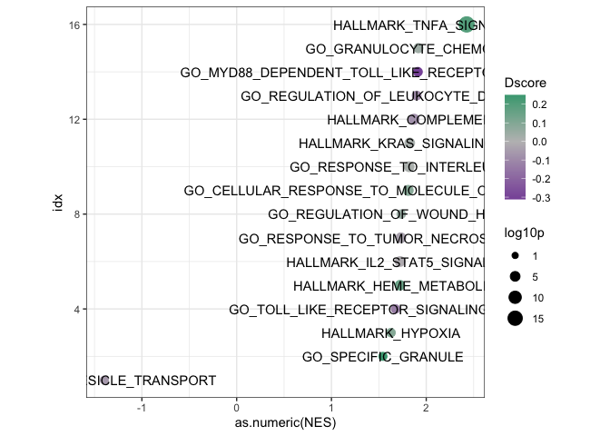<!-- -->

Finally we visualize a few more diverging pathways.

``` r
metadata_temp <- metadata_filtered[metadata_filtered$COVID == "Positive" & metadata_filtered$Day %in% c("D0","D3","D7"),]
my.cols <- brewer.pal(3, "RdBu")
p1 <- ggplot(metadata_temp, aes(x = factor(Day), y = as.numeric(GO_MYD88_DEPENDENT_TOLL_LIKE_RECEPTOR_SIGNALING_PATHWAY), fill = factor(severity.max))) + geom_boxplot(outlier.shape = NA) + geom_point(position = position_jitterdodge(), alpha = 0.3) + theme_bw() + xlab("Day") + ylab("Metagene Score") + scale_fill_manual(values = my.cols[c(3,1)]) + ggtitle("GO_MYD88_DEPENDENT_TOLL_LIKE_RECEPTOR_SIGNALING_PATHWAY")
p1$labels$fill <- "Severity Max"

p2 <- ggplot(metadata_temp, aes(x = factor(Day), y = as.numeric(GO_CELLULAR_RESPONSE_TO_MOLECULE_OF_BACTERIAL_ORIGIN), fill = factor(severity.max))) + geom_boxplot(outlier.shape = NA) + geom_point(position = position_jitterdodge(), alpha = 0.3) + theme_bw() + xlab("Day") + ylab("Metagene Score") + scale_fill_manual(values = my.cols[c(3,1)]) + ggtitle("GO_CELLULAR_RESPONSE_TO_MOLECULE_OF_BACTERIAL_ORIGIN")
p2$labels$fill <- "Severity Max"

p3 <- ggplot(metadata_temp, aes(x = factor(Day), y = as.numeric(GO_GOLGI_VESICLE_TRANSPORT), fill = factor(severity.max))) + geom_boxplot(outlier.shape = NA) + geom_point(position = position_jitterdodge(), alpha = 0.3) + theme_bw() + xlab("Day") + ylab("Metagene Score") + scale_fill_manual(values = my.cols[c(3,1)]) + ggtitle("GO_GOLGI_VESICLE_TRANSPORT")
p3$labels$fill <- "Severity Max"
```

**Figure S13H:**

``` r
p1
```

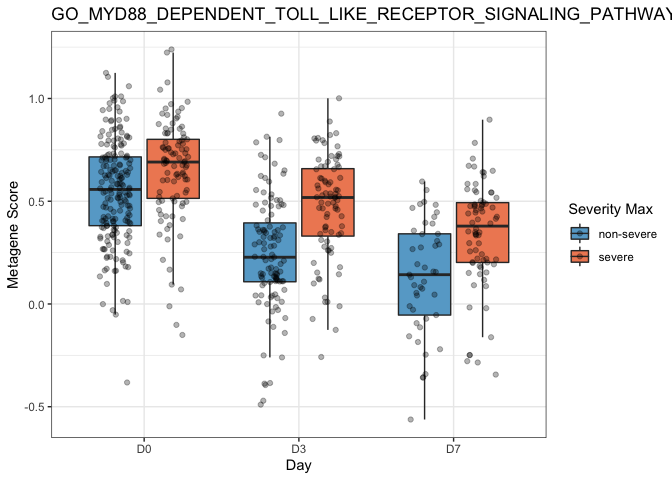<!-- -->

``` r
p2
```

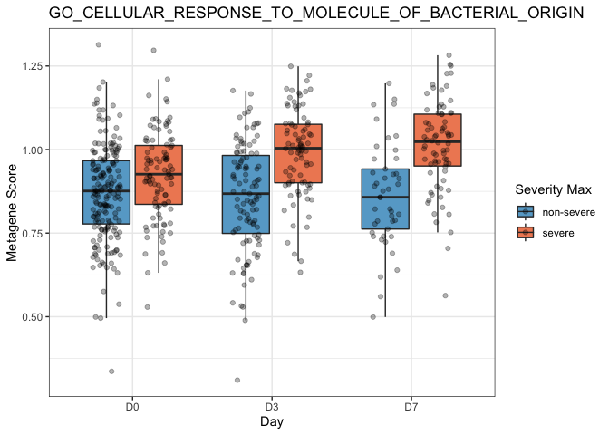<!-- -->

``` r
p3
```

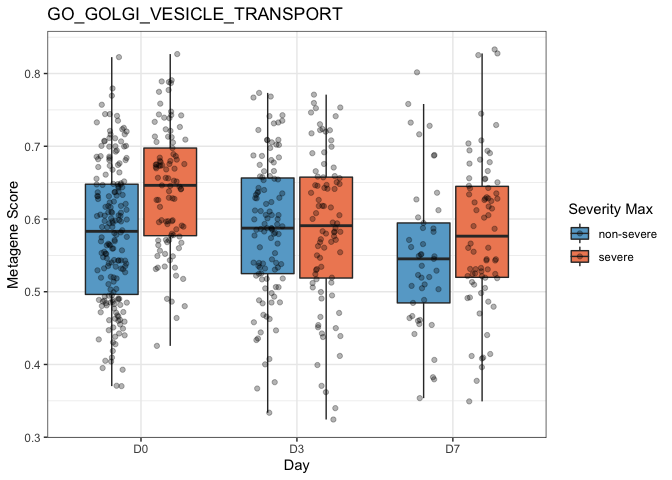<!-- -->

``` r
sessionInfo()
```

    ## R version 4.1.1 (2021-08-10)
    ## Platform: x86_64-apple-darwin17.0 (64-bit)
    ## Running under: macOS Big Sur 10.16
    ## 
    ## Matrix products: default
    ## BLAS:   /Library/Frameworks/R.framework/Versions/4.1/Resources/lib/libRblas.0.dylib
    ## LAPACK: /Library/Frameworks/R.framework/Versions/4.1/Resources/lib/libRlapack.dylib
    ## 
    ## locale:
    ## [1] en_US.UTF-8/en_US.UTF-8/en_US.UTF-8/C/en_US.UTF-8/en_US.UTF-8
    ## 
    ## attached base packages:
    ## [1] parallel  stats4    stats     graphics  grDevices utils     datasets 
    ## [8] methods   base     
    ## 
    ## other attached packages:
    ##  [1] glmnet_4.1-2                Matrix_1.3-4               
    ##  [3] caret_6.0-88                lattice_0.20-44            
    ##  [5] heatmap3_1.1.9              sjmisc_2.8.7               
    ##  [7] sjlabelled_1.1.8            sjPlot_2.8.9               
    ##  [9] pROC_1.18.0                 lmtest_0.9-38              
    ## [11] zoo_1.8-9                   ggpubr_0.4.0               
    ## [13] inflection_1.3.5            fgsea_1.18.0               
    ## [15] cowplot_1.1.1               openxlsx_4.2.4             
    ## [17] DESeq2_1.32.0               SummarizedExperiment_1.22.0
    ## [19] Biobase_2.52.0              MatrixGenerics_1.4.3       
    ## [21] matrixStats_0.60.1          GenomicRanges_1.44.0       
    ## [23] GenomeInfoDb_1.28.2         IRanges_2.26.0             
    ## [25] S4Vectors_0.30.0            BiocGenerics_0.38.0        
    ## [27] dplyr_1.0.7                 plyr_1.8.6                 
    ## [29] RColorBrewer_1.1-2          ggrepel_0.9.1              
    ## [31] ggplot2_3.3.5               knitr_1.33                 
    ## 
    ## loaded via a namespace (and not attached):
    ##   [1] readxl_1.3.1           backports_1.2.1        fastmatch_1.1-3       
    ##   [4] splines_4.1.1          listenv_0.8.0          BiocParallel_1.26.2   
    ##   [7] digest_0.6.27          foreach_1.5.1          htmltools_0.5.2       
    ##  [10] fansi_0.5.0            magrittr_2.0.1         memoise_2.0.0         
    ##  [13] globals_0.14.0         recipes_0.1.16         fastcluster_1.2.3     
    ##  [16] Biostrings_2.60.2      annotate_1.70.0        modelr_0.1.8          
    ##  [19] gower_0.2.2            colorspace_2.0-2       blob_1.2.2            
    ##  [22] haven_2.4.3            xfun_0.25              crayon_1.4.1          
    ##  [25] RCurl_1.98-1.4         genefilter_1.74.0      lme4_1.1-27.1         
    ##  [28] survival_3.2-13        iterators_1.0.13       glue_1.4.2            
    ##  [31] gtable_0.3.0           ipred_0.9-11           zlibbioc_1.38.0       
    ##  [34] emmeans_1.6.3          XVector_0.32.0         DelayedArray_0.18.0   
    ##  [37] sjstats_0.18.1         car_3.0-11             shape_1.4.6           
    ##  [40] future.apply_1.8.1     abind_1.4-5            scales_1.1.1          
    ##  [43] mvtnorm_1.1-2          DBI_1.1.1              rstatix_0.7.0         
    ##  [46] ggeffects_1.1.1        Rcpp_1.0.7             xtable_1.8-4          
    ##  [49] performance_0.7.3      foreign_0.8-81         bit_4.0.4             
    ##  [52] lava_1.6.10            prodlim_2019.11.13     datawizard_0.2.0.1    
    ##  [55] httr_1.4.2             ellipsis_0.3.2         farver_2.1.0          
    ##  [58] pkgconfig_2.0.3        XML_3.99-0.7           nnet_7.3-16           
    ##  [61] locfit_1.5-9.4         utf8_1.2.2             labeling_0.4.2        
    ##  [64] reshape2_1.4.4         tidyselect_1.1.1       rlang_0.4.11          
    ##  [67] effectsize_0.4.5       AnnotationDbi_1.54.1   munsell_0.5.0         
    ##  [70] cellranger_1.1.0       tools_4.1.1            cachem_1.0.6          
    ##  [73] generics_0.1.0         RSQLite_2.2.8          broom_0.7.9           
    ##  [76] evaluate_0.14          stringr_1.4.0          fastmap_1.1.0         
    ##  [79] yaml_2.2.1             ModelMetrics_1.2.2.2   bit64_4.0.5           
    ##  [82] zip_2.2.0              purrr_0.3.4            KEGGREST_1.32.0       
    ##  [85] future_1.22.1          nlme_3.1-152           compiler_4.1.1        
    ##  [88] curl_4.3.2             png_0.1-7              ggsignif_0.6.2        
    ##  [91] tibble_3.1.4           geneplotter_1.70.0     stringi_1.7.4         
    ##  [94] highr_0.9              parameters_0.14.0      forcats_0.5.1         
    ##  [97] nloptr_1.2.2.2         vctrs_0.3.8            pillar_1.6.2          
    ## [100] lifecycle_1.0.0        estimability_1.3       data.table_1.14.0     
    ## [103] bitops_1.0-7           insight_0.14.4         R6_2.5.1              
    ## [106] gridExtra_2.3          rio_0.5.27             parallelly_1.27.0     
    ## [109] codetools_0.2-18       boot_1.3-28            MASS_7.3-54           
    ## [112] assertthat_0.2.1       withr_2.4.2            GenomeInfoDbData_1.2.6
    ## [115] bayestestR_0.11.0      hms_1.1.0              grid_4.1.1            
    ## [118] rpart_4.1-15           timeDate_3043.102      tidyr_1.1.3           
    ## [121] class_7.3-19           minqa_1.2.4            rmarkdown_2.10        
    ## [124] carData_3.0-4          lubridate_1.7.10
