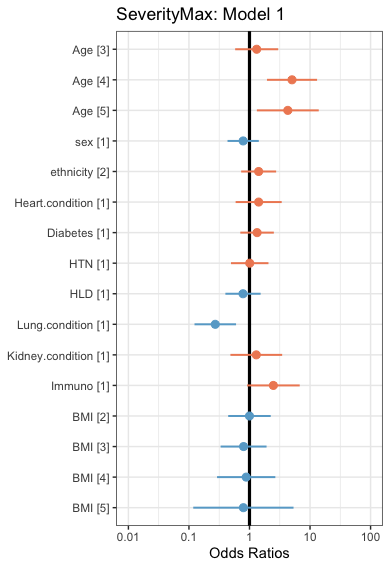
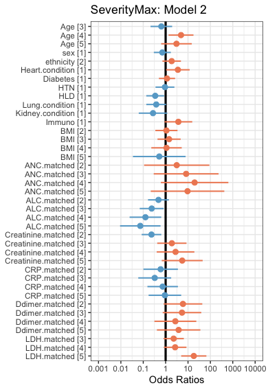
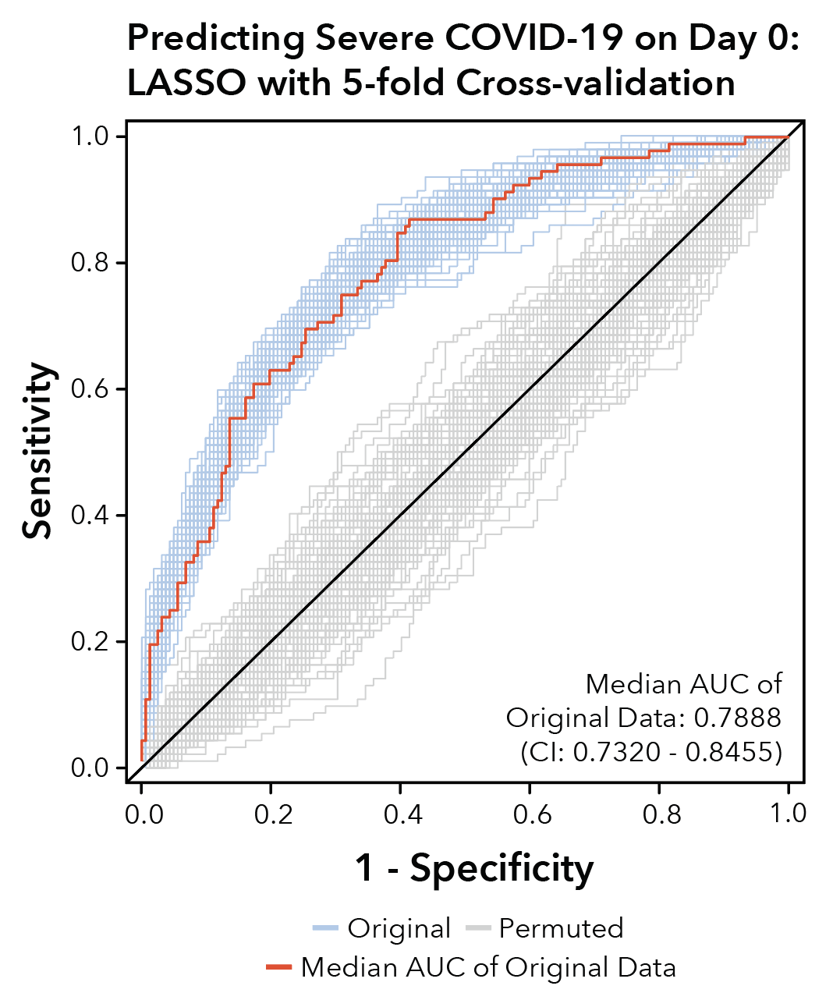

```{r setup, include=FALSE}
knitr::opts_chunk$set(cache = FALSE, echo = TRUE, warning = TRUE, message = FALSE, cache.lazy = FALSE)
```

This document contains all the code necessary to generate the plots for Figure 3 and the related supplementary figure (S13). Plots are subsequently edited in Adobe Illustrator to produce the final figures.

Load the necessary libraries:

```{r}
library(knitr)
library(ggplot2)
library(ggrepel)
library(RColorBrewer)
library(plyr)
library(dplyr)
library(DESeq2)
library(openxlsx)
library(cowplot)
library(fgsea)
library(ggpubr)
library(lmtest)
library(pROC)
library(sjPlot)
library(sjlabelled)
library(sjmisc)
library(heatmap3)
library(caret)
library(glmnet)
```

Load in the data:

```{r, cache = TRUE}
prefix <- "~/Downloads/Github/"
metadata_long <- read.xlsx(paste0(prefix,"Tables/TableS1.xlsx"), sheet = 4)
Count <- read.xlsx(paste0(prefix,"Tables/TableS1.xlsx"), sheet = 7, rowNames = TRUE)
TPM <- read.xlsx(paste0(prefix,"Tables/TableS1.xlsx"), sheet = 8, rowNames = TRUE)
qc_data <- read.xlsx(paste0(prefix,"Tables/TableS1.xlsx"), sheet = 9)
genomic_signatures <- read.xlsx(paste0(prefix,"Tables/TableS1.xlsx"), sheet = 10)
genepc <- read.delim(paste0(prefix,"Ensembl_to_Symbol.txt"))
logTPM <- log2(TPM + 1)

metadata_long <- metadata_long[which(metadata_long$Public.ID %in% qc_data$Public.ID),]
metadata_long <- merge(metadata_long, qc_data)
rownames(metadata_long) <- metadata_long$Public.Sample.ID

metadata_filtered <- metadata_long[metadata_long$percent.mt < 20 & metadata_long$Genes.Detected > 10000 & metadata_long$Median.Exon.CV < 1 & metadata_long$Exon.CV.MAD < 0.75 & metadata_long$Exonic.Rate*100 > 25 & metadata_long$Median.3..bias < 0.9,]

logTPM_filtered <- logTPM[,colnames(logTPM) %in% rownames(metadata_filtered)]
TPM_filtered <- TPM[,colnames(TPM) %in% rownames(metadata_filtered)]
Count_filtered <- Count[,colnames(Count) %in% rownames(metadata_filtered)]

tf <- rowSums(TPM_filtered > 0.1) > ncol(TPM_filtered)*.2
TPM_filtered <- TPM_filtered[tf,]
Count_filtered <- Count_filtered[tf,]
logTPM_filtered <- logTPM_filtered[tf,]
tf <- rowSums(Count_filtered >= 6) > ncol(Count_filtered)*.2
TPM_filtered <- TPM_filtered[tf,]
Count_filtered <- Count_filtered[tf,]
logTPM_filtered <- logTPM_filtered[tf,]

rownames(genomic_signatures) <- genomic_signatures$Public.Sample.ID
metadata_filtered <- merge(metadata_filtered, genomic_signatures)
rownames(metadata_filtered) <- metadata_filtered$Public.Sample.ID
metadata_filtered$COVID <- mapvalues(metadata_filtered$COVID, from = c(0,1), to = c("Negative","Positive"))

# Color Palette
vermillion <- rgb(213,94,0,max=255)
bluishgreen <- rgb(0,158,115,max=255)
yellow <- rgb(240,228,66,max=255)
blue <- rgb(0,114,178,max=255)
orange <- rgb(230,159,0,max=255)
skyblue <- rgb(86,180,233,max=255)
lightgray <- rgb(211,211,211,max=255)
```

We start by scoring each sample according to their expression of the NMF marker genes. Then we look at how the NMF5 score varies with Acuity on Day 0.

```{r}
source(paste0(prefix,"Pathway_scoring.R"))
gmt.file <- gmtPathways(paste0(prefix,"neutrophil_state_gene_sets.gmt"))
metadata_filtered$NMF1_score <- Pathway_scoring("NMF1")
metadata_filtered$NMF2_score <- Pathway_scoring("NMF2")
metadata_filtered$NMF3_score <- Pathway_scoring("NMF3")
metadata_filtered$NMF4_score <- Pathway_scoring("NMF4")
metadata_filtered$NMF5_score <- Pathway_scoring("NMF5")
metadata_filtered$NMF6_score <- Pathway_scoring("NMF6")
metadata_filtered$ARDS_UP_score <- Pathway_scoring("ARDS_UP")
metadata_filtered$ARDS_DOWN_score <- Pathway_scoring("ARDS_DOWN")

metadata_temp <- metadata_filtered[(metadata_filtered$COVID == "Positive" & metadata_filtered$Day == "D0") | metadata_filtered$Day == "H",]
metadata_temp$Acuity.max <- factor(metadata_temp$Acuity.max, levels = c("H","5","4","3","2","1"))
p1 <- ggplot(metadata_temp, aes(x = Acuity.max, y = as.numeric(NMF5_score), fill = Acuity.max)) + geom_boxplot(outlier.shape = NA) + geom_jitter(alpha = 0.2) + theme_bw() + theme(panel.grid = element_blank(), legend.position = "none") + xlab("AcuityMax") + ylab("NMF5 (G-MDSC) Metagene Score") + geom_vline(xintercept = 1.5, linetype = "dashed") + ggtitle("Day 0 COVID+ & HC") + coord_fixed(ratio = 1.5) + stat_compare_means() + scale_fill_manual(values = c(skyblue,"seagreen","lightgreen","lightyellow","orange",vermillion))
stats <- cor.test(x = as.numeric(metadata_temp$Acuity.max), y = as.numeric(metadata_temp$NMF5_score), use = "pairwise.complete.obs", method = "kendall")
stats$estimate #Kendall's tau correlation
stats$p.value
```

**Figure 3A:**

```{r}
p1
```

The NMF5 score correlates well with AcuityMax even on the initial day of hospitalization. To test the predictive power of neutrophil states, we build three logistic regression models: 1) only patient demographics/characteristics, 2) combining demographics with clinical lab values, and 3) combining demographics, clinical lab values, and neutrophil state scores. We then use the likelihood ratio test to see if adding more parameters significantly improves the model.

We consider only COVID+ patients on Day 0 who are admitted to the ED (i.e. exclude AcuityMax5) and have complete data for ALC, ANC, D-dimers, CRP, LDH, and BMI. Again, due to the IRB-approved waiver of informed consent, clinical data is reported in quintiles; thus, we break the neutrophil scores into quintiles as well for consistency. Additionally, not all of the demographic information is publicly available, so those lines will be commented out, and the results will be read in.

```{r}
# metadata_temp <- metadata_filtered[metadata_filtered$COVID == "Positive" & metadata_filtered$Day == "D0" & metadata_filtered$Acuity.max %in% c("1","2","3","4") & complete.cases(metadata_filtered$ALC.matched) & complete.cases(metadata_filtered$Ddimer.matched) & complete.cases(metadata_filtered$CRP.matched) & complete.cases(metadata_filtered$LDH.matched) & complete.cases(metadata_filtered$BMI),]
# metadata_temp$severity.max <- mapvalues(metadata_temp$severity.max, from = c("non-severe","severe"), to = c(0,1))
# metadata_temp$severity.max <- as.factor(metadata_temp$severity.max)
# metadata_temp$Age <- mapvalues(metadata_temp$Age, from = c("1","2","3","4","5"), to = c("1_2","1_2","3","4","5"))
# metadata_temp$Age <- factor(metadata_temp$Age, levels = c("1_2","3","4","5"))
# metadata_temp$sex <- as.factor(metadata_temp$sex)
# metadata_temp$ethnicity <- as.factor(metadata_temp$ethnicity)
# metadata_temp$Heart.condition <- as.factor(metadata_temp$Heart.condition)
# metadata_temp$Diabetes <- as.factor(metadata_temp$Diabetes)
# metadata_temp$HTN <- as.factor(metadata_temp$HTN)
# metadata_temp$HLD <- as.factor(metadata_temp$HLD)
# metadata_temp$Lung.condition <- as.factor(metadata_temp$Lung.condition)
# metadata_temp$Kidney.condition <- as.factor(metadata_temp$Kidney.condition)
# metadata_temp$Immuno <- as.factor(metadata_temp$Immuno)
# metadata_temp$ANC.matched <- as.factor(metadata_temp$ANC.matched)
# metadata_temp <- metadata_temp[complete.cases(metadata_temp$ANC.matched),]
# metadata_temp$BMI <- mapvalues(metadata_temp$BMI, from = c("0","1","2","3","4","5"), to = c("0_1","0_1","2","3","4","5"))
# metadata_temp$BMI <- as.factor(metadata_temp$BMI)
# 
# metadata_temp$ANC.matched <- as.factor(metadata_temp$ANC.matched)
# metadata_temp$ALC.matched <- as.factor(metadata_temp$ALC.matched)
# metadata_temp$Creatinine.matched <- as.factor(metadata_temp$Creatinine.matched)
# metadata_temp$CRP.matched <- as.factor(metadata_temp$CRP.matched)
# metadata_temp$Ddimer.matched <- as.factor(metadata_temp$Ddimer.matched)
# metadata_temp$LDH.matched <- mapvalues(metadata_temp$LDH.matched, from = c("1","2","3","4","5"), to = c("1_2","1_2","3","4","5"))
# metadata_temp$LDH.matched <- as.factor(metadata_temp$LDH.matched)
# 
# metadata_temp$NMF1_score_factor <- cut_number(metadata_temp$NMF1_score, n = 5)
# metadata_temp$NMF2_score_factor <- cut_number(metadata_temp$NMF2_score, n = 5)
# metadata_temp$NMF3_score_factor <- cut_number(metadata_temp$NMF3_score, n = 5)
# metadata_temp$NMF4_score_factor <- cut_number(metadata_temp$NMF4_score, n = 5)
# metadata_temp$NMF5_score_factor <- cut_number(metadata_temp$NMF5_score, n = 5)
# metadata_temp$NMF6_score_factor <- cut_number(metadata_temp$NMF6_score, n = 5)
# metadata_temp$ARDS_UP_score_factor <- cut_number(metadata_temp$ARDS_UP_score, n = 5)
# metadata_temp$ARDS_DOWN_score_factor <- cut_number(metadata_temp$ARDS_DOWN_score, n = 5)
# 
# model1 <- glm(severity.max ~ Age + sex + ethnicity + Heart.condition + Diabetes + HTN + HLD + Lung.condition + Kidney.condition + Immuno + BMI, data = metadata_temp, family = binomial)
# model2 <- glm(severity.max ~ Age + sex + ethnicity + Heart.condition + Diabetes + HTN + HLD + Lung.condition + Kidney.condition + Immuno + BMI + ANC.matched + ALC.matched + Creatinine.matched + CRP.matched + Ddimer.matched + LDH.matched, data = metadata_temp, family = binomial)
# model3 <- glm(severity.max ~ Age + sex + ethnicity + Heart.condition + Diabetes + HTN + HLD + Lung.condition + Kidney.condition + Immuno + BMI + ANC.matched + ALC.matched + Creatinine.matched + CRP.matched + Ddimer.matched + LDH.matched + NMF1_score_factor + NMF2_score_factor + NMF3_score_factor + NMF4_score_factor + NMF5_score_factor + NMF6_score_factor + ARDS_UP_score_factor + ARDS_DOWN_score_factor, data = metadata_temp, family = binomial)
# 
# summary(model1)
# summary(model2)
# summary(model3)
# 
# lrtest(model1, model2)
# lrtest(model2, model3)
#
# prob1=predict(model1,type=c("response"))
# metadata_temp$prob1=prob1
#
# prob2=predict(model2,type=c("response"))
# metadata_temp$prob2=prob2
#
# prob3=predict(model3,type=c("response"))
# metadata_temp$prob3=prob3

probdf <- read.xlsx(paste0(prefix,"Tables/TableS3.xlsx"),sheet = 3)
metadata_temp <- merge(x = metadata_temp, y = probdf, by = "Public.Sample.ID")

g1 <- roc(severity.max ~ prob1, data = metadata_temp)
g2 <- roc(severity.max ~ prob2, data = metadata_temp)
g3 <- roc(severity.max ~ prob3, data = metadata_temp)

auc(g1)
auc(g2)
auc(g3)
```

**Figure 3B:**

```{r}
plot(x = g1$specificities, y = g1$sensitivities, col = "green", pch = 19, cex = 0, asp = 1, xlim = rev(c(0,1)), xlab = "Specificity", ylab = "Sensitivity")
lines(x = g1$specificities, y = g1$sensitivities, col = "green")
abline(a = 1, b = -1)
lines(x = g2$specificities, y = g2$sensitivities, col = "blue")
lines(x = g3$specificities, y = g3$sensitivities, col = "red")
```

In the related supplementary figure there are forest plots showing the odds ratio estimates for each factor level included in the models. Without the actual models, it is not possible to generate these plots, so their images will be read in here.

**Figure S13A:**

```{r}
# my.cols <- brewer.pal(3,"RdBu")
# plot_model(model1, vline.color = "black", colors = c(my.cols[3], my.cols[1])) + theme_bw() + ggtitle("SeverityMax: Model 1")
```



**Figure S13B:**

```{r}
# my.cols <- brewer.pal(3,"RdBu")
# plot_model(model2, vline.color = "black", colors = c(my.cols[3], my.cols[1])) + theme_bw() + ggtitle("SeverityMax: Model 2")
```



**Figure S13C:**

```{r}
# my.cols <- brewer.pal(3,"RdBu")
# plot_model(model3, vline.color = "black", colors = c(my.cols[3], my.cols[1])) + theme_bw() + ggtitle("SeverityMax: Model 3")
```


We next used a LASSO logistic regression model of COVID-19 disease severity on Day 0 to perform feature selection on all of the parameters that went into Model 3. Since there was no comparable validation dataset, we performed the prediction with 100 repeats of five-fold cross validation on both the regular data and data with permuted labels of severity. Again, we comment out the code, which cannot be run with only the publicly available data, and read in the results. This code was adapted from Filbin et al. 2021.

```{r}
# metadata_filtered$NMF1_score_factor <- cut_number(metadata_filtered$NMF1_score, n = 5)
# metadata_filtered$NMF2_score_factor <- cut_number(metadata_filtered$NMF2_score, n = 5)
# metadata_filtered$NMF3_score_factor <- cut_number(metadata_filtered$NMF3_score, n = 5)
# metadata_filtered$NMF4_score_factor <- cut_number(metadata_filtered$NMF4_score, n = 5)
# metadata_filtered$NMF5_score_factor <- cut_number(metadata_filtered$NMF5_score, n = 5)
# metadata_filtered$NMF6_score_factor <- cut_number(metadata_filtered$NMF6_score, n = 5)
# metadata_filtered$ARDS_UP_score_factor <- cut_number(metadata_filtered$ARDS_UP_score, n = 5)
# metadata_filtered$ARDS_DOWN_score_factor <- cut_number(metadata_filtered$ARDS_DOWN_score, n = 5)
# 
# variables_to_test <- c("sex" , "Age",  "ethnicity" , "Heart.condition" , "Diabetes" , "HTN" , "HLD" , "Lung.condition" , "Kidney.condition" , "Immuno" , "BMI" , "ANC.matched" , "ALC.matched" , "Creatinine.matched" , "CRP.matched" , "Ddimer.matched" , "LDH.matched" , "NMF1_score_factor" , "NMF2_score_factor" , "NMF3_score_factor","NMF4_score_factor","NMF5_score_factor","NMF6_score_factor", "ARDS_UP_score_factor","ARDS_DOWN_score_factor")
# columnorder <- c("Public.Sample.ID", "severity.max","sex", "Age", "ethnicity" , "Heart.condition" , "Diabetes" , "HTN" , "HLD" , "Lung.condition" , "Kidney.condition" , "Immuno" , "BMI" , "ANC.matched" , "ALC.matched" , "Creatinine.matched" , "CRP.matched" , "Ddimer.matched" , "LDH.matched" , "NMF1_score_factor" , "NMF2_score_factor" , "NMF3_score_factor","NMF4_score_factor","NMF5_score_factor","NMF6_score_factor", "ARDS_UP_score_factor","ARDS_DOWN_score_factor")
# 
# #Some helper functions
# fitLasso <- function(data){
#   
#   getweights <- data %>% 
#     select(Public.Sample.ID,severity.max) %>% 
#     group_by(severity.max) %>% 
#     mutate(N=n()) %>% 
#     ungroup() %>% 
#     mutate(w=1-N/nrow(data))
#   
#   data <- data %>% select(severity.max,all_of(c(variables_to_test))) %>% 
#     mutate(severity.max=factor(severity.max,levels=c("non.severe","severe")))
# 
#   lassoFit <- train(severity.max ~ . , 
#                     data = data, 
#                     method = "glmnet", 
#                     trControl = fitControl ,
#                     tuneLength = 15,
#                     metric = "Kappa",
#                     weights = getweights$w)
#   
#   fit <- glmnet(as.matrix(model.matrix(~-1+.,data=data %>% select(all_of(c(variables_to_test)))))[,-1], 
#                 data$severity.max,
#                 alpha=as.numeric(lassoFit$bestTune["alpha"]),
#                 lambda=as.numeric(lassoFit$bestTune["lambda"]),
#                 family="binomial",weights = getweights$w)
#   
#   return(fit)
# }
# 
# foldData <- function(data){
#   
#   data$FOLD <- NA
#   data$FOLD[data$severity.max=="severe"] <- sample(rep(1:5, ceiling(sum(data$severity.max=="severe"))),sum(data$severity.max=="severe"),replace=F)
#   data$FOLD[data$severity.max=="non.severe"] <- sample(rep(1:5, ceiling(sum(data$severity.max=="non.severe"))),sum(data$severity.max=="non.severe"),replace=F)
#   
#   return(data)
#   
# }
# getMeasures <- function(data){
#   
#   tmp.cm <- confusionMatrix(data=factor(data$predict.class,levels=c("severe","non.severe")),
#                             reference = factor(data$severity.max))
#   tmp.roc <- pROC::roc(severity.max~Prob,data %>% mutate(severity.max=factor(severity.max,levels=c("non.severe","severe"))),print.auc=F)
#   tmp.roc <- as.numeric(tmp.roc$auc)
#   names(tmp.roc) = "AUC"
#   N <- nrow(data);names(N) <- "N"
#   
#   out <- as.data.frame(t(as.matrix(c(N,
#                                      tmp.cm$byClass[c("Sensitivity","Specificity","Pos Pred Value","Neg Pred Value" )],
#                                      tmp.cm$overall[c("Accuracy","Kappa","AccuracyNull")],
#                                      tmp.roc))))
#   return(out)
#   
# }
# getFeatures <- function(x){
#   x <- as.matrix(x)
#   x <- x[rownames(x)!="(Intercept)",]
#   ind <- x != 0
#   out <- data.frame(feature =names(x)[ind],
#                     betas = as.numeric(x)[ind])
#   
#   return(out)
#   
# }
# simple_roc <- function(labels, scores){
#   labels <- labels[order(scores, decreasing=TRUE)]
#   data.frame(TPR=cumsum(labels)/sum(labels), FPR=cumsum(!labels)/sum(!labels), labels)
# }
# 
# do.severity.data <- metadata_filtered[metadata_filtered$COVID == "Positive" & metadata_filtered$Day == "D0" & metadata_filtered$Acuity.max %in% c("1","2","3","4") & complete.cases(metadata_filtered$ALC.matched) & complete.cases(metadata_filtered$Ddimer.matched) & complete.cases(metadata_filtered$CRP.matched) & complete.cases(metadata_filtered$LDH.matched) & complete.cases(metadata_filtered$BMI), colnames(metadata_filtered) %in% c("Public.Sample.ID","severity.max", variables_to_test)]
# 
# do.severity.data$severity.max <- mapvalues(do.severity.data$severity.max, from = c("non-severe","severe"), to = c("non.severe","severe"))
# do.severity.data$severity.max <- factor(do.severity.data$severity.max, levels = c("non.severe","severe"))
# do.severity.data$Age <- mapvalues(do.severity.data$Age, from = c("1","2","3","4","5"), to = c("1_2","1_2","3","4","5"))
# do.severity.data$Age <- factor(do.severity.data$Age, levels = c("1_2","3","4","5"))
# do.severity.data$sex <- as.factor(do.severity.data$sex)
# do.severity.data$ethnicity <- as.factor(do.severity.data$ethnicity)
# do.severity.data$Heart.condition <- as.factor(do.severity.data$Heart.condition)
# do.severity.data$Diabetes <- as.factor(do.severity.data$Diabetes)
# do.severity.data$HTN <- as.factor(do.severity.data$HTN)
# do.severity.data$HLD <- as.factor(do.severity.data$HLD)
# do.severity.data$Lung.condition <- as.factor(do.severity.data$Lung.condition)
# do.severity.data$Kidney.condition <- as.factor(do.severity.data$Kidney.condition)
# do.severity.data$Immuno <- as.factor(do.severity.data$Immuno)
# do.severity.data$ANC.matched <- as.factor(do.severity.data$ANC.matched)
# do.severity.data <- do.severity.data[complete.cases(do.severity.data$ANC.matched),]
# do.severity.data$BMI <- mapvalues(do.severity.data$BMI, from = c("0","1","2","3","4","5"), to = c("0_1","0_1","2","3","4","5"))
# do.severity.data$BMI <- as.factor(do.severity.data$BMI)
# do.severity.data$ANC.matched <- as.factor(do.severity.data$ANC.matched)
# do.severity.data$ALC.matched <- as.factor(do.severity.data$ALC.matched)
# do.severity.data$Creatinine.matched <- as.factor(do.severity.data$Creatinine.matched)
# do.severity.data$CRP.matched <- as.factor(do.severity.data$CRP.matched)
# do.severity.data$Ddimer.matched <- as.factor(do.severity.data$Ddimer.matched)
# do.severity.data$LDH.matched <- mapvalues(do.severity.data$LDH.matched, from = c("1","2","3","4","5"), to = c("1_2","1_2","3","4","5"))
# do.severity.data$LDH.matched <- as.factor(do.severity.data$LDH.matched)
# 
# reorder_idx <- match(columnorder, colnames(do.severity.data))
# do.severity.data <- do.severity.data[,reorder_idx]
# 
# fitControl <- trainControl(method="cv",number=5,
#                            classProbs=T,
#                            summaryFunction = defaultSummary,
#                            selectionFunction = "oneSE")
# 
# # 10 times 5fold CV -------------------------------------------------------
# 
# n.folds  <- 5
# n.repeats <- 2
# rep.data <- list()
# set.seed(9570815)
# for(reps in 1:n.repeats){
# 
#   fold.data <- foldData(do.severity.data)
#   fold.list <- vector("list",n.folds)
# 
#   for(fold in 1:n.folds){
# 
# 
#     train.data <- fold.data[fold.data$FOLD!=fold,]
#     test.data <- fold.data[fold.data$FOLD==fold,]
#     
#     scaleTrain <- train.data
#     scaleTest <- test.data
#     
#     tmp.fit <- fitLasso(scaleTrain)
#     betas <- coef(tmp.fit)
# 
# 
#     testtrain <- rbind(scaleTest %>%
#                          select(all_of(c(variables_to_test))) %>%
#                          mutate(set="Testing"),
#                        scaleTrain %>%
#                          select(all_of(c(variables_to_test))) %>%
#                          mutate(set="Training"))
# 
#     predicted.prob <- predict(tmp.fit,
#                               newx=as.matrix(model.matrix(~-1+.,data=testtrain %>% select(-set)))[testtrain$set=="Testing",-1],
#                               s=tmp.fit$lambda,
#                               type="response")
# 
#     predicted.prob <- data.frame(Public.Sample.ID=scaleTest$Public.Sample.ID,
#                                  Prob=as.numeric(predicted.prob),
#                                  severity.max=scaleTest$severity.max)
# 
#     fold.list[[fold]] <- list(prediction = predicted.prob,
#                               betas = betas)
# 
#     cat("Rep ",reps," Fold ",fold,"\n")
# 
#   }
# 
#   rep.data[[paste0("Rep",reps)]] <- fold.list
# }
# 
# 
# save(rep.data,
#      file=paste0(prefix,"Test_Lasso_Neutrophil_severe_prediction_list.Rdata"))
# 
# 
# perm.rep.data <- list()
# 
# set.seed(9570812)
# for(reps in 1:n.repeats){
# 
#   fold.data <- foldData(do.severity.data %>% mutate(severity.max=sample(severity.max)))
#   fold.list <- vector("list",n.folds)
# 
#   for(fold in 1:n.folds){
# 
# 
#     train.data <- fold.data[fold.data$FOLD!=fold,]
#     test.data <- fold.data[fold.data$FOLD==fold,]
# 
#     scaleTrain <- train.data
#     scaleTest <- test.data
#     
#     tmp.fit <- fitLasso(scaleTrain)
#     betas <- coef(tmp.fit)
# 
# 
#     testtrain <- rbind(scaleTest %>%
#                          select(all_of(c(variables_to_test))) %>%
#                          mutate(set="Testing"),
#                        scaleTrain %>%
#                          select(all_of(c(variables_to_test))) %>%
#                          mutate(set="Training"))
# 
#     predicted.prob <- predict(tmp.fit,
#                               newx=as.matrix(model.matrix(~-1+.,data=testtrain %>% select(-set)))[testtrain$set=="Testing",-1],
#                               s=tmp.fit$lambda,
#                               type="response")
# 
#     predicted.prob <- data.frame(Public.Sample.ID=scaleTest$Public.Sample.ID,
#                                  Prob=as.numeric(predicted.prob),
#                                  severity.max=scaleTest$severity.max)
# 
#     fold.list[[fold]] <- list(prediction = predicted.prob,
#                               betas = betas)
# 
#     cat("Rep ",reps," Fold ",fold,"\n")
# 
#   }
# 
#   perm.rep.data[[paste0("Rep",reps)]] <- fold.list
# }
# 
# 
# save(perm.rep.data,
#      file=paste0(prefix,"Test_lasso_Neutrophil_severe_prediction_list_permuted.Rdata"))
```

```{r}
## Collect measures ---------
# 
# for(i in 1:length(rep.data)) names(rep.data[[i]]) <- paste0("fold",1:length(rep.data[[i]]))
# for(i in 1:length(perm.rep.data)) names(perm.rep.data[[i]]) <- paste0("fold",1:length(perm.rep.data[[i]]))
# 
# all.measure.results <- plyr::ldply(rep.data, function(x){
#   test.df <- plyr::ldply(lapply(x,function(y) y$prediction),data.frame,.id="fold") %>% 
#     mutate(predict.class = factor(ifelse(Prob<.5,"non.severe","severe")))
#   return(getMeasures(test.df))
# },
# .id="Rep")
# 
# all.measure.results.byFold <-  plyr::ldply(rep.data, function(x){
#   test.df <- plyr::ldply(lapply(x,function(y) y$prediction),data.frame,.id="fold") %>% 
#     mutate(predict.class = factor(ifelse(Prob<.5,"non.severe","severe"))) %>% 
#     group_by(fold) %>% 
#     group_modify(~getMeasures(.x)) %>% ungroup()
#   
#   return(test.df)
# },
# .id="Rep")
# 
# all.probs <-  plyr::ldply(rep.data, function(x){
#   plyr::ldply(lapply(x,function(y) y$prediction),data.frame,.id="fold") %>% 
#     mutate(predict.class = factor(ifelse(Prob<.5,"non.severe","severe"))) },
#   .id="Rep"
# )
# 
# all.measure.results.perm <- plyr::ldply(perm.rep.data, function(x){
#   test.df <- plyr::ldply(lapply(x,function(y) y$prediction),data.frame,.id="fold") %>% 
#     mutate(predict.class = factor(ifelse(Prob<.5,"non.severe","severe")))
#   return(getMeasures(test.df))
# },
# .id="Rep")
# 
# all.measure.results.byFold.perm <-  plyr::ldply(perm.rep.data, function(x){
#   test.df <- plyr::ldply(lapply(x,function(y) y$prediction),data.frame,.id="fold") %>% 
#     mutate(predict.class = factor(ifelse(Prob<.5,"non.severe","severe"))) %>% 
#     group_by(fold) %>% 
#     group_modify(~getMeasures(.x)) %>% ungroup()
#   
#   return(test.df)
# },
# .id="Rep")
# 
# all.probs.perm <-  plyr::ldply(perm.rep.data, function(x){
#   plyr::ldply(lapply(x,function(y) y$prediction),data.frame,.id="fold") %>% 
#     mutate(predict.class = factor(ifelse(Prob<.5,"non.severe","severe"))) },
#   .id="Rep"
# )
# 
# ## Table of all measures ---------
# original.measures <- all.measure.results %>% 
#   pivot_longer(-Rep,names_to="Measure",values_to="value") %>% 
#   group_by(Measure) %>% 
#   summarize(N=sum(!is.na(value)),Median=median(value),low.95=quantile(value,.025),up.95=quantile(value,.975))
# original.measures.fold <- all.measure.results.byFold %>% 
#   pivot_longer(-c(Rep,fold),names_to="Measure",values_to="value") %>% 
#   group_by(Measure) %>% 
#   summarize(N=sum(!is.na(value)),Median=median(value),low.95=quantile(value,.025),up.95=quantile(value,.975))
# 
# 
# #####Permutated data
# permuted.measures <- all.measure.results.perm %>% 
#   pivot_longer(-Rep,names_to="Measure",values_to="value") %>% 
#   group_by(Measure) %>% 
#   summarize(N=sum(!is.na(value)),Median=median(value),low.95=quantile(value,.025),up.95=quantile(value,.975))
# permuted.measures.fold <- all.measure.results.byFold.perm %>% 
#   pivot_longer(-c(Rep,fold),names_to="Measure",values_to="value") %>% 
#   group_by(Measure) %>% 
#   summarize(N=sum(!is.na(value)),Median=median(value,na.rm=T),low.95=quantile(value,.025,na.rm=T),up.95=quantile(value,.975,na.rm=T))
# 
# ##single roc curve
# test.df <- plyr::ldply(rep.data[[which.min(abs(all.measure.results$AUC-median(all.measure.results$AUC)))]],
#                   function(y) data.frame(y$prediction)) %>% 
#   mutate(predict.class = factor(ifelse(Prob<.5,"non.severe","severe")))
# 
# confusionMatrix(data=factor(test.df$predict.class,levels=c("severe","non.severe")),
#                 reference = factor(test.df$severity.max))
# 
# tmp.roc <- pROC::roc(severity.max~Prob,test.df %>% mutate(severity.max=factor(severity.max,levels=c("non.severe","severe"))))
# tmp.roc
# 
# 
# singleROC <- test.df %>% 
#   arrange(Prob) %>% 
#   group_modify(~simple_roc(as.numeric(.x$severity.max=="severe"),.x$Prob)) %>% 
#   ggplot(aes(x=FPR,y=TPR))+
#   geom_line()+
#   geom_abline(intercept=0,slope=1)+
#   annotate("text",x=0,y=1,label=paste("AUC:",round(as.numeric(tmp.roc$auc),4)),hjust=0)+
#   theme_bw()+
#   labs(x="1-Specificity",y="Sensitivity",title="Predicting severe COVID")
# 
# ggsave(filename=paste0(prefix,"singleROC.pdf"),
#   singleROC,
#   device = cairo_pdf,
#   height=6,width=6)
# 
# ##All ROC curves
# 
# allROC <- all.probs %>% mutate(Data="Original") %>% 
#   rbind(all.probs.perm %>% mutate(Data="Permuted")) %>% 
#   group_by(Data,Rep) %>% 
#   arrange(Rep,Prob) %>% 
#   group_modify(~simple_roc(as.numeric(.x$severity.max=="severe"),.x$Prob)) %>% 
#   ggplot(aes(x=FPR,y=TPR,group=interaction(Data,Rep),color=Data))+
#   geom_line()+
#   geom_abline(intercept=0,slope=1)+
#   theme_bw()+
#   labs(x="1-Specificity",y="Sensitivity",title="Predicting severe COVID: 100 Replications")+
#   scale_color_manual(values=c("#00559EFF","lightgray"))+
#   theme(legend.position="bottom")
# 
# ggsave(filename=paste0(prefix,"allROC.pdf"),
#        allROC,
#        device = cairo_pdf,
#        height=6,width=6)
```

**Figure 3C:**


```{r}
# ## extract features -----------
# 
# all.features <- plyr::ldply(rep.data, function(x){
#   plyr::ldply(lapply(x,function(y) y$betas),getFeatures,.id="Fold")
# },
# .id="Rep")
# 
# all.features.perm <- plyr::ldply(perm.rep.data, function(x){
#   plyr::ldply(lapply(x,function(y) y$betas),getFeatures,.id="Fold")
# },
# .id="Rep")
# 
# 
# table(all.features[,"feature"])
# 
# feat.freq.table <- all.features %>% 
#   group_by(feature) %>% 
#   summarize(Frequency_Selected=n()) %>% 
#   arrange(desc(Frequency_Selected)) %>% 
#   mutate(Proportion = Frequency_Selected/500*100)
# 
# feat.freq.table <- feat.freq.table[(order(feat.freq.table$Frequency_Selected)),]

feat.freq.table <- read.xlsx(paste0(prefix,"Tables/TableS3.xlsx"), sheet = 5)
feat.freq.table <- feat.freq.table[order(feat.freq.table$Proportion),]
```

**Figure 3D:**

```{r}
par(mar=c(4,15,4,4))
barplot(height = feat.freq.table$Proportion, names = feat.freq.table$feature, horiz = T, las = 1, cex.names = .2)
```

Next we switch our focus to the severe patients. We want to identify features which are different between severe patients who survive and those who do not survive. We start by performing differential expression analyses for Days 0, 3, and 7 between AcuityMax1 and AcuityMax2 patients.

Day 0:

```{r, cache = TRUE, warning = FALSE}
source(paste0(prefix,"Neutrophil_DESeq2.R"))
DESeq2_list <- Neutrophil_DESeq2(counts = Count_filtered, mdata = metadata_filtered, covid = "Positive", day = "D0", severity = "severe")
dds <- DESeqDataSetFromMatrix(countData = DESeq2_list$Count_select, colData = DESeq2_list$coldata, design = ~ Neutrophil_total + T_NK_factor + Monocyte_factor + IG_factor + Plasmablast_factor + Acuity.max)
dds <- DESeq(dds)

res0 <- as.data.frame(results(dds, name="Acuity.max_2_vs_1"))
filenam <- "Day0_COVID+_A1_vs_A2_correct-NeuCont+TNK+Monocyte+Plasmablast+IG"
temp <- genepc[which(genepc$Gene.stable.ID %in% rownames(res0)),]
res0$symbol <- matrix(0L, nrow = nrow(res0))
for (i in 1:nrow(res0)){
  if (rownames(res0)[i] %in% temp$Gene.stable.ID){
    res0$symbol[i] <- temp$Gene.name[which(rownames(res0)[i] == temp$Gene.stable.ID)]
  } else {
    res0$symbol[i] <- rownames(res0)[i]
  }
}
res0$rank <- sign(res0$log2FoldChange)*(-1)*log10(res0$pvalue)
res0 <- res0[complete.cases(res0),]
res0_sig <- res0[res0$padj < 0.05,]
#write.table(res0,paste0("~/Documents/Github/DESeq2/",filenam,".txt"),sep = "\t")
```

Day 3:

```{r, cache = TRUE, warning = FALSE}
DESeq2_list <- Neutrophil_DESeq2(counts = Count_filtered, mdata = metadata_filtered, covid = "Positive", day = "D3", severity = "severe")
dds <- DESeqDataSetFromMatrix(countData = DESeq2_list$Count_select, colData = DESeq2_list$coldata, design = ~ Neutrophil_total + T_NK_factor + Monocyte_factor + IG_factor + Plasmablast_factor + Acuity.max)
dds <- DESeq(dds)

res3 <- as.data.frame(results(dds, name="Acuity.max_2_vs_1"))
filenam <- "Day3_COVID+_A1_vs_A2_correct-NeuCont+TNK+Monocyte+Plasmablast+IG"
temp <- genepc[which(genepc$Gene.stable.ID %in% rownames(res3)),]
res3$symbol <- matrix(0L, nrow = nrow(res3))
for (i in 1:nrow(res3)){
  if (rownames(res3)[i] %in% temp$Gene.stable.ID){
    res3$symbol[i] <- temp$Gene.name[which(rownames(res3)[i] == temp$Gene.stable.ID)]
  } else {
    res3$symbol[i] <- rownames(res3)[i]
  }
}
res3$rank <- sign(res3$log2FoldChange)*(-1)*log10(res3$pvalue)
res3 <- res3[complete.cases(res3),]
res3_sig <- res3[res3$padj < 0.05,]
#write.table(res3,paste0("~/Documents/Github/DESeq2/",filenam,".txt"),sep = "\t")
```

Day 7:

```{r, cache = TRUE, warning = FALSE}
DESeq2_list <- Neutrophil_DESeq2(counts = Count_filtered, mdata = metadata_filtered, covid = "Positive", day = "D7", severity = "severe")
dds <- DESeqDataSetFromMatrix(countData = DESeq2_list$Count_select, colData = DESeq2_list$coldata, design = ~ Neutrophil_total + T_NK_factor + Monocyte_factor + IG_factor + Plasmablast_factor + Acuity.max)
dds <- DESeq(dds)

res7 <- as.data.frame(results(dds, name="Acuity.max_2_vs_1"))
filenam <- "Day3_COVID+_A1_vs_A2_correct-NeuCont+TNK+Monocyte+Plasmablast+IG"
temp <- genepc[which(genepc$Gene.stable.ID %in% rownames(res7)),]
res7$symbol <- matrix(0L, nrow = nrow(res7))
for (i in 1:nrow(res7)){
  if (rownames(res7)[i] %in% temp$Gene.stable.ID){
    res7$symbol[i] <- temp$Gene.name[which(rownames(res7)[i] == temp$Gene.stable.ID)]
  } else {
    res7$symbol[i] <- rownames(res7)[i]
  }
}
res7$rank <- sign(res7$log2FoldChange)*(-1)*log10(res7$pvalue)
res7 <- res7[complete.cases(res7),]
res7_sig <- res7[res7$padj < 0.05,]
#write.table(res7,paste0("~/Documents/Github/DESeq2/",filenam,".txt"),sep = "\t")
```

```{r}
resordered <- res0[order(res0$rank),]

log2fc <- as.numeric(resordered$log2FoldChange)
log10p <- as.numeric(-1*log10(resordered$pvalue))
pvalue <- as.numeric(resordered$pvalue)
padj <- resordered$padj
rank <- resordered$rank
symbol <- resordered$symbol
combo <- cbind(log2fc,log10p,padj,pvalue,symbol,rank)
colnames(combo) <- c("log2fc","log10p","padj","pvalue","symbol","rank")
rownames(combo) <- rownames(resordered)
combo <- as.data.frame(combo)
combo$rank <- as.numeric(combo$rank)
combo$log10p <- as.numeric(combo$log10p)
combo$log2fc <- as.numeric(combo$log2fc)
combo$pvalue <- as.numeric(combo$pvalue)
combo$significance <- as.numeric(combo$padj < 0.05)
combo$significance <- as.factor(combo$significance)

combo$color <- 0
combo$color[combo$pvalue < 1e-4 & combo$log2fc > 0.5] <- 1
combo$color[combo$pvalue < 1e-4 & combo$log2fc < -0.5] <- -1

combo$labels <- abs(combo$color)
combo$labels <- as.factor(combo$labels)

options(ggrepel.max.overlaps = Inf)
my.cols <- brewer.pal(3,"Set2")
plot1 <- ggplot(combo, aes(x = log2fc, y = log10p)) + geom_point(data = subset(combo, color == 0), colour = "grey") + geom_point(data = subset(combo, color == 1), colour = "navy") + geom_point(data = subset(combo, color == -1), colour = "red") + geom_text_repel(data = subset(combo, labels == 1), aes(label = as.character(symbol)))  + theme_bw() + ylab("-Log10(p-value)") + xlab("Log2(Fold-change)") + annotate("text", x=1.3, y=0, label= "AcuityMax2", colour = "navy") + annotate("text", x=-1.2, y=0, label= "AcuityMax1", colour = "red") + coord_fixed(ratio = 1) + theme(panel.grid = element_blank()) + ggtitle("Day 0, COVID+")
```

**Figure S13D:**

```{r}
plot1
```

```{r}
resordered <- res3[order(res3$rank),]

log2fc <- as.numeric(resordered$log2FoldChange)
log10p <- as.numeric(-1*log10(resordered$pvalue))
pvalue <- as.numeric(resordered$pvalue)
padj <- resordered$padj
rank <- resordered$rank
symbol <- resordered$symbol
combo <- cbind(log2fc,log10p,padj,pvalue,symbol,rank)
colnames(combo) <- c("log2fc","log10p","padj","pvalue","symbol","rank")
rownames(combo) <- rownames(resordered)
combo <- as.data.frame(combo)
combo$rank <- as.numeric(combo$rank)
combo$log10p <- as.numeric(combo$log10p)
combo$log2fc <- as.numeric(combo$log2fc)
combo$pvalue <- as.numeric(combo$pvalue)
combo$significance <- as.numeric(combo$padj < 0.05)
combo$significance <- as.factor(combo$significance)

combo$color <- 0
combo$color[combo$pvalue < 1e-4 & combo$log2fc > 0.5] <- 1
combo$color[combo$pvalue < 1e-4 & combo$log2fc < -0.5] <- -1

combo$labels <- abs(combo$color)
combo$labels <- as.factor(combo$labels)

options(ggrepel.max.overlaps = Inf)
my.cols <- brewer.pal(3,"Set2")
plot1 <- ggplot(combo, aes(x = log2fc, y = log10p)) + geom_point(data = subset(combo, color == 0), colour = "grey") + geom_point(data = subset(combo, color == 1), colour = "navy") + geom_point(data = subset(combo, color == -1), colour = "red") + geom_text_repel(data = subset(combo, labels == 1), aes(label = as.character(symbol)))  + theme_bw() + ylab("-Log10(p-value)") + xlab("Log2(Fold-change)") + annotate("text", x=1.3, y=0, label= "AcuityMax2", colour = "navy") + annotate("text", x=-1.2, y=0, label= "AcuityMax1", colour = "red") + coord_fixed(ratio = 1) + theme(panel.grid = element_blank()) + ggtitle("Day 3, COVID+")
```

**Figure S13E:**

```{r}
plot1
```

```{r}
resordered <- res7[order(res7$rank),]

log2fc <- as.numeric(resordered$log2FoldChange)
log10p <- as.numeric(-1*log10(resordered$pvalue))
pvalue <- as.numeric(resordered$pvalue)
padj <- resordered$padj
rank <- resordered$rank
symbol <- resordered$symbol
combo <- cbind(log2fc,log10p,padj,pvalue,symbol,rank)
colnames(combo) <- c("log2fc","log10p","padj","pvalue","symbol","rank")
rownames(combo) <- rownames(resordered)
combo <- as.data.frame(combo)
combo$rank <- as.numeric(combo$rank)
combo$log10p <- as.numeric(combo$log10p)
combo$log2fc <- as.numeric(combo$log2fc)
combo$pvalue <- as.numeric(combo$pvalue)
combo$significance <- as.numeric(combo$padj < 0.05)
combo$significance <- as.factor(combo$significance)

combo$color <- 0
combo$color[combo$pvalue < 1e-4 & combo$log2fc > 0.5] <- 1
combo$color[combo$pvalue < 1e-4 & combo$log2fc < -0.5] <- -1

combo$labels <- abs(combo$color)
combo$labels <- as.factor(combo$labels)

options(ggrepel.max.overlaps = Inf)
my.cols <- brewer.pal(3,"Set2")
plot1 <- ggplot(combo, aes(x = log2fc, y = log10p)) + geom_point(data = subset(combo, color == 0), colour = "grey") + geom_point(data = subset(combo, color == 1), colour = "navy") + geom_point(data = subset(combo, color == -1), colour = "red") + geom_text_repel(data = subset(combo, labels == 1), aes(label = as.character(symbol)))  + theme_bw() + ylab("-Log10(p-value)") + xlab("Log2(Fold-change)") + annotate("text", x=1.3, y=0, label= "AcuityMax2", colour = "navy") + annotate("text", x=-1.2, y=0, label= "AcuityMax1", colour = "red") + coord_fixed(ratio = 1) + theme(panel.grid = element_blank()) + ggtitle("Day 7, COVID+")
```

**Figure S13F:**

```{r}
options(ggrepel.max.overlaps = Inf)
plot1
```

With these results we perform GSEA.

```{r, warning = FALSE}
gmt.file <- gmtPathways(paste0(prefix,"all_gene_sets.gmt"))
ranking0 <- res0[,"rank"]
names(ranking0) <- res0$symbol
set.seed(15001)
fgseaRes0 <- fgsea(pathways = gmt.file, 
                  stats = ranking0,
                  minSize=25,
                  maxSize=1000,
                  eps = 0)
#write.table(fgseaRes0[,1:7], file = paste0(prefix,"GSEA_",filenam,".txt"), sep = "\t")

ranking3 <- res3[,"rank"]
names(ranking3) <- res3$symbol
set.seed(15001)
fgseaRes3 <- fgsea(pathways = gmt.file, 
                  stats = ranking3,
                  minSize=25,
                  maxSize=1000,
                  eps = 0)
#write.table(fgseaRes[,1:7], file = paste0(prefix,"GSEA_",filenam,".txt"), sep = "\t")

ranking7 <- res7[,"rank"]
names(ranking7) <- res7$symbol
set.seed(15001)
fgseaRes7 <- fgsea(pathways = gmt.file, 
                  stats = ranking7,
                  minSize=25,
                  maxSize=1000,
                  eps = 0)
#write.table(fgseaRes[,1:7], file = paste0(prefix,"GSEA_",filenam,".txt"), sep = "\t")

pathways_to_show <- c("ARDS_UP_JUSS","GO_DEFENSE_RESPONSE_TO_VIRUS","HALLMARK_INTERFERON_ALPHA_RESPONSE","HALLMARK_INTERFERON_GAMMA_RESPONSE","HALLMARK_HYPOXIA","GO_HEXOSE_CATABOLIC_PROCESS","REACTOME_NEUTROPHIL_DEGRANULATION","HALLMARK_GLYCOLYSIS","HALLMARK_MTORC1_SIGNALING","HALLMARK_FATTY_ACID_METABOLISM","GO_NADP_METABOLIC_PROCESS","GO_SYNAPTIC_TRANSMISSION_GLUTAMATERGIC","GO_TRICARBOXYLIC_ACID_CYCLE","HALLMARK_MYC_TARGETS_V1","HALLMARK_OXIDATIVE_PHOSPHORYLATION","GO_RIBOSOME_BIOGENESIS","GO_RESPIRATORY_ELECTRON_TRANSPORT_CHAIN","ARDS_DOWN_JUSS")
gsea_results0 <- fgseaRes0[fgseaRes0$pathway %in% pathways_to_show,]
gsea_results0 <- gsea_results0[,c(1,2,6)]
gsea_results0$Day <- "D0"
gsea_results3 <- fgseaRes3[fgseaRes3$pathway %in% pathways_to_show,]
gsea_results3 <- gsea_results3[,c(1,2,6)]
gsea_results3$Day <- "D3"
gsea_results7 <- fgseaRes7[fgseaRes7$pathway %in% pathways_to_show,]
gsea_results7 <- gsea_results7[,c(1,2,6)]
gsea_results7$Day <- "D7"

gsea_results <- rbind(gsea_results0,gsea_results3,gsea_results7)
gsea_results$pathwayMean <- NA
for (i in 1:nrow(gsea_results)){
  gsea_results$pathwayMean[i] <- mean(gsea_results$NES[gsea_results$pathway == gsea_results$pathway[i]])
}
fgseaordered <- gsea_results[(order(gsea_results$pathwayMean)),]
gsea_results <- gsea_results %>%
  arrange(factor(pathway, levels = fgseaordered$pathway[!duplicated(fgseaordered$pathway)]))

gsea_results$number <- rev(rep((1:(length(pathways_to_show)))*2,each = 3))
gsea_results$logp <- -log10(gsea_results$pval)
gsea_results$logp[gsea_results$logp < -log10(0.05)] <- NA

p1 <- ggplot(gsea_results, aes(x = Day, y = number)) + geom_point(aes(size = logp, fill = NES), alpha = 0.75, shape = 21) + scale_size_continuous(limits = c(0, 50), range = c(1,5.5), breaks = c(1,10,30,50)) + scale_fill_gradient(low = "red", high = "blue") + coord_fixed(ratio = .4) + theme_bw()
```

**Figure 3E:**

```{r, warning=FALSE}
p1
```

Next we want to see how neutrophil states differ between AcuityMax1 and AcuityMax2. First we perform GSEA for the neutrophil state gene sets. 

```{r, warning = FALSE}
gmt.file <- gmtPathways(paste0(prefix,"neutrophil_state_gene_sets_ensembl.gmt"))

ranking0 <- res0[,"rank"]
names(ranking0) <- rownames(res0)
set.seed(15001)
fgseaRes0 <- fgsea(pathways = gmt.file, 
                  stats = ranking0,
                  minSize=25,
                  maxSize=1000,
                  eps = 0)
#write.table(fgseaRes0[,1:7], file = paste0(prefix,"GSEA_",filenam,".txt"), sep = "\t")

ranking3 <- res3[,"rank"]
names(ranking3) <- rownames(res3)
set.seed(15001)
fgseaRes3 <- fgsea(pathways = gmt.file, 
                  stats = ranking3,
                  minSize=25,
                  maxSize=1000,
                  eps = 0)
#write.table(fgseaRes[,1:7], file = paste0(prefix,"GSEA_",filenam,".txt"), sep = "\t")

ranking7 <- res7[,"rank"]
names(ranking7) <- rownames(res7)
set.seed(15001)
fgseaRes7 <- fgsea(pathways = gmt.file, 
                  stats = ranking7,
                  minSize=25,
                  maxSize=1000,
                  eps = 0)
#write.table(fgseaRes[,1:7], file = paste0(prefix,"GSEA_",filenam,".txt"), sep = "\t")

gsea_results0 <- fgseaRes0[,c(1,2,6)]
gsea_results0$Day <- "D0"
gsea_results3 <- fgseaRes3[,c(1,2,6)]
gsea_results3$Day <- "D3"
gsea_results7 <- fgseaRes7[,c(1,2,6)]
gsea_results7$Day <- "D7"

gsea_results <- rbind(gsea_results0,gsea_results3,gsea_results7)
gsea_results$pathwayMean <- NA
for (i in 1:nrow(gsea_results)){
  gsea_results$pathwayMean[i] <- mean(gsea_results$NES[gsea_results$pathway == gsea_results$pathway[i]])
}
fgseaordered <- gsea_results[rev(order(gsea_results$pathwayMean)),]
fgseaordered <- fgseaordered[-c(34,35),] #HBNeutro6 was removed as it did not have enough genes to be scored on Day 7
gsea_results <- gsea_results %>%
  arrange(factor(pathway, levels = fgseaordered$pathway[!duplicated(fgseaordered$pathway)]))
gsea_results <- gsea_results[-c(97,98),]

gsea_results$number <- rev(rep((1:(length(fgseaordered$pathway[!duplicated(fgseaordered$pathway)])))*2,each = 3))
gsea_results$logp <- -log10(gsea_results$pval)
gsea_results$logp[gsea_results$logp < -log10(0.05)] <- NA

p1 <- ggplot(gsea_results, aes(x = Day, y = number)) + geom_point(aes(size = logp, fill = NES), alpha = 0.75, shape = 21) + scale_size_continuous(limits = c(0, 53), range = c(1,5.5), breaks = c(1,10,30,50)) + scale_fill_gradient(low = "red", high = "blue") + coord_fixed(ratio = .4) + theme_bw()
```

**Figure S13G:**

```{r, warning=FALSE}
p1
```

Next we move to the NMF cluster identities.

```{r}
pvals <- as.data.frame(matrix(0L, nrow = 3, ncol = 7))
rownames(pvals) <- c("D0","D3","D7")
colnames(pvals) <- c("1","2","3","4","5","6","7")

metadata_temp <- metadata_filtered[metadata_filtered$COVID == "Positive" & metadata_filtered$Day == "D0" & metadata_filtered$severity.max == "severe",]
for (i in 1:7){
  twoway <- matrix(0L, nrow = 2, ncol = 2)
  twoway[1,1] <- sum(metadata_temp$Acuity.max == "1" & metadata_temp$cluster_neuhi == i)
  twoway[1,2] <- sum(metadata_temp$Acuity.max == "2" & metadata_temp$cluster_neuhi == i)
  twoway[2,1] <- sum(metadata_temp$Acuity.max == "1" & metadata_temp$cluster_neuhi != i)
  twoway[2,2] <- sum(metadata_temp$Acuity.max == "2" & metadata_temp$cluster_neuhi != i)
  
  pval <- fisher.test(twoway)
  pvals[1,i] <- pval$p.value
}

metadata_temp <- metadata_filtered[metadata_filtered$COVID == "Positive" & metadata_filtered$Day == "D3" & metadata_filtered$severity.max == "severe",]
for (i in 1:7){
  twoway <- matrix(0L, nrow = 2, ncol = 2)
  twoway[1,1] <- sum(metadata_temp$Acuity.max == "1" & metadata_temp$cluster_neuhi == i)
  twoway[1,2] <- sum(metadata_temp$Acuity.max == "2" & metadata_temp$cluster_neuhi == i)
  twoway[2,1] <- sum(metadata_temp$Acuity.max == "1" & metadata_temp$cluster_neuhi != i)
  twoway[2,2] <- sum(metadata_temp$Acuity.max == "2" & metadata_temp$cluster_neuhi != i)
  
  pval <- fisher.test(twoway)
  pvals[2,i] <- pval$p.value
}

metadata_temp <- metadata_filtered[metadata_filtered$COVID == "Positive" & metadata_filtered$Day == "D7" & metadata_filtered$severity.max == "severe",]
for (i in 1:7){
  twoway <- matrix(0L, nrow = 2, ncol = 2)
  twoway[1,1] <- sum(metadata_temp$Acuity.max == "1" & metadata_temp$cluster_neuhi == i)
  twoway[1,2] <- sum(metadata_temp$Acuity.max == "2" & metadata_temp$cluster_neuhi == i)
  twoway[2,1] <- sum(metadata_temp$Acuity.max == "1" & metadata_temp$cluster_neuhi != i)
  twoway[2,2] <- sum(metadata_temp$Acuity.max == "2" & metadata_temp$cluster_neuhi != i)
  
  pval <- fisher.test(twoway)
  pvals[3,i] <- pval$p.value
}

pvallist <- as.numeric(c(pvals[1,],pvals[2,],pvals[3,]))
pvallistcorrected <- p.adjust(pvallist, method = "fdr")
pvals[1,] <- pvallistcorrected[1:7]
pvals[2,] <- pvallistcorrected[8:14]
pvals[3,] <- pvallistcorrected[15:21]

nmftable <- as.data.frame(matrix(0L, nrow = 14, ncol = 3))
colnames(nmftable) <- c("Cluster","Severity","Freq")
nmftable$Cluster <- rep(1:7, each = 2)
nmftable$Acuity <- rep(c("1","2"),7)

metadata_temp <- metadata_filtered[metadata_filtered$COVID == "Positive" & metadata_filtered$Day == "D0" & metadata_filtered$severity.max == "severe",]
for (i in 1:nrow(nmftable)){
  nmftable$Freq[i] <- sum(metadata_temp$cluster_neuhi == nmftable$Cluster[i] & metadata_temp$Acuity.max == nmftable$Acuity[i])/sum(metadata_temp$Acuity.max == nmftable$Acuity[i])
}

p1 <- ggplot(nmftable, aes(x = factor(Cluster), y = Freq*100, fill = Acuity)) + geom_bar(position="dodge", stat="identity") + theme_bw() + xlab("") + ylab("Frequency") + ggtitle("Day 0, COVIDP") + scale_fill_manual(values = c("red","navy")) + theme(legend.position = "none")

metadata_temp <- metadata_filtered[metadata_filtered$COVID == "Positive" & metadata_filtered$Day == "D3" & metadata_filtered$severity.max == "severe",]
for (i in 1:nrow(nmftable)){
  nmftable$Freq[i] <- sum(metadata_temp$cluster_neuhi == nmftable$Cluster[i] & metadata_temp$Acuity.max == nmftable$Acuity[i])/sum(metadata_temp$Acuity.max == nmftable$Acuity[i])
}

p2 <- ggplot(nmftable, aes(x = factor(Cluster), y = Freq*100, fill = Acuity)) + geom_bar(position="dodge", stat="identity") + theme_bw() + xlab("") + ylab("Frequency") + ggtitle("Day 3, COVIDP") + scale_fill_manual(values = c("red","navy")) + theme(legend.position = "none")

metadata_temp <- metadata_filtered[metadata_filtered$COVID == "Positive" & metadata_filtered$Day == "D7" & metadata_filtered$severity.max == "severe",]
for (i in 1:nrow(nmftable)){
  nmftable$Freq[i] <- sum(metadata_temp$cluster_neuhi == nmftable$Cluster[i] & metadata_temp$Acuity.max == nmftable$Acuity[i])/sum(metadata_temp$Acuity.max == nmftable$Acuity[i])
}

p3 <- ggplot(nmftable, aes(x = factor(Cluster), y = Freq*100, fill = Acuity)) + geom_bar(position="dodge", stat="identity") + theme_bw() + xlab("NMF Cluster") + ylab("Frequency") + ggtitle("Day 7, COVIDP") + scale_fill_manual(values = c("red","navy")) + theme(legend.position = "none")
```

**Figure S13H:**

```{r}
cowplot::plot_grid(p1,p2,p3,ncol=1)
```

Of note, the interferon gamma and alpha response metagenes switch in enrichment from A1 on Day 0 to A2 on Days 3 and 7.

```{r}
getEnrichmentDataframe <- function (pathway, stats, gseaParam = 1, ticksSize = 0.2) {
    rnk <- rank(-stats)
    ord <- order(rnk)
    statsAdj <- stats[ord]
    statsAdj <- sign(statsAdj) * (abs(statsAdj)^gseaParam)
    statsAdj <- statsAdj/max(abs(statsAdj))
    pathway <- unname(as.vector(na.omit(match(pathway, names(statsAdj)))))
    pathway <- sort(pathway)
    gseaRes <- calcGseaStat(statsAdj, selectedStats = pathway, returnAllExtremes = TRUE)
    bottoms <- gseaRes$bottoms
    tops <- gseaRes$tops
    combo <- as.data.frame(cbind(tops,bottoms))
    combo$average <- matrix(0L, nrow = nrow(combo), ncol = 1)
    for (p in 1:nrow(combo)){
      combo$average[p] <- (combo$tops[p]+combo$bottoms[p])/2
    }
    combo <- cbind(combo,pathway)
    return(combo)
}

gmt.file <- gmtPathways(paste0(prefix,"all_gene_sets.gmt"))
ranking0 <- res0[,"rank"]
names(ranking0) <- res0$symbol
ranking3 <- res3[,"rank"]
names(ranking3) <- res3$symbol
ranking7 <- res7[,"rank"]
names(ranking7) <- res7$symbol
IFNpathways <- c("HALLMARK_INTERFERON_ALPHA_RESPONSE","HALLMARK_INTERFERON_GAMMA_RESPONSE")

dataframe0 <- getEnrichmentDataframe(gmt.file[[IFNpathways[1]]], ranking0)
IFNdf0 <- cbind(dataframe0$pathway,dataframe0$average,rep(IFNpathways[1],nrow(dataframe0)))
colnames(IFNdf0) <- c("rank","enrichment","pathway")
for (i in 2:length(IFNpathways)){
  dataframe0 <- getEnrichmentDataframe(gmt.file[[IFNpathways[i]]],
               ranking0)
  temp <- cbind(dataframe0$pathway,dataframe0$average,rep(IFNpathways[i],nrow(dataframe0)))
  colnames(temp) <- c("rank","enrichment","pathway")
  IFNdf0 <- as.data.frame(rbind(IFNdf0,temp))
}
IFNdf0$Day <- "D0"
IFNdf0$rank <- as.numeric(IFNdf0$rank)/max(as.numeric(IFNdf0$rank))
dataframe3 <- getEnrichmentDataframe(gmt.file[[IFNpathways[1]]], ranking3)
IFNdf3 <- cbind(dataframe3$pathway,dataframe3$average,rep(IFNpathways[1],nrow(dataframe3)))
colnames(IFNdf3) <- c("rank","enrichment","pathway")
for (i in 2:length(IFNpathways)){
  dataframe3 <- getEnrichmentDataframe(gmt.file[[IFNpathways[i]]],
               ranking3)
  temp <- cbind(dataframe3$pathway,dataframe3$average,rep(IFNpathways[i],nrow(dataframe3)))
  colnames(temp) <- c("rank","enrichment","pathway")
  IFNdf3 <- as.data.frame(rbind(IFNdf3,temp))
}
IFNdf3$Day <- "D3"
IFNdf3$rank <- as.numeric(IFNdf3$rank)/max(as.numeric(IFNdf3$rank))
dataframe7 <- getEnrichmentDataframe(gmt.file[[IFNpathways[1]]], ranking7)
IFNdf7 <- cbind(dataframe7$pathway,dataframe7$average,rep(IFNpathways[1],nrow(dataframe7)))
colnames(IFNdf7) <- c("rank","enrichment","pathway")
for (i in 2:length(IFNpathways)){
  dataframe7 <- getEnrichmentDataframe(gmt.file[[IFNpathways[i]]],
               ranking7)
  temp <- cbind(dataframe7$pathway,dataframe7$average,rep(IFNpathways[i],nrow(dataframe7)))
  colnames(temp) <- c("rank","enrichment","pathway")
  IFNdf7 <- as.data.frame(rbind(IFNdf7,temp))
}
IFNdf7$Day <- "D7"
IFNdf7$rank <- as.numeric(IFNdf7$rank)/max(as.numeric(IFNdf7$rank))

IFNAres <- rbind(IFNdf0[IFNdf0$pathway == "HALLMARK_INTERFERON_ALPHA_RESPONSE",],IFNdf3[IFNdf3$pathway == "HALLMARK_INTERFERON_ALPHA_RESPONSE",],IFNdf7[IFNdf7$pathway == "HALLMARK_INTERFERON_ALPHA_RESPONSE",])
IFNGres <- rbind(IFNdf0[IFNdf0$pathway == "HALLMARK_INTERFERON_GAMMA_RESPONSE",],IFNdf3[IFNdf3$pathway == "HALLMARK_INTERFERON_GAMMA_RESPONSE",],IFNdf7[IFNdf7$pathway == "HALLMARK_INTERFERON_GAMMA_RESPONSE",])

my.cols <- brewer.pal(3,"Set2")
p1 <- ggplot(as.data.frame(IFNAres), aes(x = as.numeric(rank), y = as.numeric(enrichment), colour = Day)) + geom_point(aes(shape = Day)) + theme_bw() + scale_colour_manual(values = my.cols) + coord_fixed(ratio = .65) + theme(panel.grid.minor = element_blank(), legend.text=element_text(size=6)) + xlab("Rank in Gene List") + ylab("Running Enrichment Score") + ggtitle("HALLMARK_INTERFERON_ALPHA_RESPONSE") + scale_shape_manual(values = c(16,15,17))
p2 <- ggplot(as.data.frame(IFNGres), aes(x = as.numeric(rank), y = as.numeric(enrichment), colour = Day)) + geom_point(aes(shape = Day)) + theme_bw() + scale_colour_manual(values = my.cols) + coord_fixed(ratio = .8) + theme(panel.grid.minor = element_blank(), legend.text=element_text(size=6)) + xlab("Rank in Gene List") + ylab("Running Enrichment Score") + ggtitle("HALLMARK_INTERFERON_GAMMA_RESPONSE") + scale_shape_manual(values = c(16,15,17))
```

**Figure 3F:**

```{r}
p1
p2
```

Let's check if this is reflected in the neutrophil states as well.

```{r}
gmt.file <- gmtPathways(paste0(prefix,"neutrophil_state_gene_sets_ensembl.gmt"))
ranking0 <- res0[,"rank"]
names(ranking0) <- rownames(res0)
ranking3 <- res3[,"rank"]
names(ranking3) <- rownames(res3)
ranking7 <- res7[,"rank"]
names(ranking7) <- rownames(res7)
NMFpathways <- c("NMF3","NMF6")

dataframe0 <- getEnrichmentDataframe(gmt.file[[NMFpathways[1]]], ranking0)
NMFdf0 <- cbind(dataframe0$pathway,dataframe0$average,rep(NMFpathways[1],nrow(dataframe0)))
colnames(NMFdf0) <- c("rank","enrichment","pathway")
for (i in 2:length(NMFpathways)){
  dataframe0 <- getEnrichmentDataframe(gmt.file[[NMFpathways[i]]],
               ranking0)
  temp <- cbind(dataframe0$pathway,dataframe0$average,rep(NMFpathways[i],nrow(dataframe0)))
  colnames(temp) <- c("rank","enrichment","pathway")
  NMFdf0 <- as.data.frame(rbind(NMFdf0,temp))
}
NMFdf0$Day <- "D0"
NMFdf0$rank <- as.numeric(NMFdf0$rank)/max(as.numeric(NMFdf0$rank))
dataframe3 <- getEnrichmentDataframe(gmt.file[[NMFpathways[1]]], ranking3)
NMFdf3 <- cbind(dataframe3$pathway,dataframe3$average,rep(NMFpathways[1],nrow(dataframe3)))
colnames(NMFdf3) <- c("rank","enrichment","pathway")
for (i in 2:length(NMFpathways)){
  dataframe3 <- getEnrichmentDataframe(gmt.file[[NMFpathways[i]]],
               ranking3)
  temp <- cbind(dataframe3$pathway,dataframe3$average,rep(NMFpathways[i],nrow(dataframe3)))
  colnames(temp) <- c("rank","enrichment","pathway")
  NMFdf3 <- as.data.frame(rbind(NMFdf3,temp))
}
NMFdf3$Day <- "D3"
NMFdf3$rank <- as.numeric(NMFdf3$rank)/max(as.numeric(NMFdf3$rank))
dataframe7 <- getEnrichmentDataframe(gmt.file[[NMFpathways[1]]], ranking7)
NMFdf7 <- cbind(dataframe7$pathway,dataframe7$average,rep(NMFpathways[1],nrow(dataframe7)))
colnames(NMFdf7) <- c("rank","enrichment","pathway")
for (i in 2:length(NMFpathways)){
  dataframe7 <- getEnrichmentDataframe(gmt.file[[NMFpathways[i]]],
               ranking7)
  temp <- cbind(dataframe7$pathway,dataframe7$average,rep(NMFpathways[i],nrow(dataframe7)))
  colnames(temp) <- c("rank","enrichment","pathway")
  NMFdf7 <- as.data.frame(rbind(NMFdf7,temp))
}
NMFdf7$Day <- "D7"
NMFdf7$rank <- as.numeric(NMFdf7$rank)/max(as.numeric(NMFdf7$rank))

NMF3res <- rbind(NMFdf0[NMFdf0$pathway == "NMF3",],NMFdf3[NMFdf3$pathway == "NMF3",],NMFdf7[NMFdf7$pathway == "NMF3",])
NMF6res <- rbind(NMFdf0[NMFdf0$pathway == "NMF6",],NMFdf3[NMFdf3$pathway == "NMF6",],NMFdf7[NMFdf7$pathway == "NMF6",])

my.cols <- brewer.pal(3,"Set2")
p1 <- ggplot(as.data.frame(NMF3res), aes(x = as.numeric(rank), y = as.numeric(enrichment), colour = Day)) + geom_point(aes(shape = Day)) + theme_bw() + scale_colour_manual(values = my.cols) + coord_fixed(ratio = .65) + theme(panel.grid.minor = element_blank(), legend.text=element_text(size=6)) + xlab("Rank in Gene List") + ylab("Running Enrichment Score") + ggtitle("NMF3 Gene Signature") + scale_shape_manual(values = c(16,15,17))
p2 <- ggplot(as.data.frame(NMF6res), aes(x = as.numeric(rank), y = as.numeric(enrichment), colour = Day)) + geom_point(aes(shape = Day)) + theme_bw() + scale_colour_manual(values = my.cols) + coord_fixed(ratio = .5) + theme(panel.grid.minor = element_blank(), legend.text=element_text(size=6)) + xlab("Rank in Gene List") + ylab("Running Enrichment Score") + ggtitle("NMF6 Gene Signature") + scale_shape_manual(values = c(16,15,17))
```

**Figure 3G:**

```{r}
p1
p2
```

```{r}
sessionInfo()
```
