Neutrophil\_Sinha
================
Sam Freeman

Neutrophil Sinha et al. data analysis

Load the necessary libraries:

``` r
library(Seurat)
library(ggplot2)
library(batchelor)
library(leiden)
library(fgsea)
library(openxlsx)
library(plyr)
library(stringr)
library(RColorBrewer)
library(SingleR)
library(ggpubr)
library(gridExtra)
```

``` r
prefix <- "/Volumes/GoogleDrive/.shortcut-targets-by-id/1SQXfCUGIenBLXc4w_p0n7Mufi3JwjFCN/COVID19_Neutrophils/Revision/Final_Steps/Github/"
```

## `{r} #system('curl -LO https://figshare.com/ndownloader/files/31562957') #`

Load seurat object, plot UMAP with all cell types

``` r
load(paste0(prefix,"covid.combined_final.Robj"))
```

``` r
g_umap <- Seurat::DimPlot(covid.combined_final, group.by = "celltype1") +
  ggplot2::scale_color_brewer(palette = "Set3") +
  ggplot2::coord_fixed()
g_umap
```

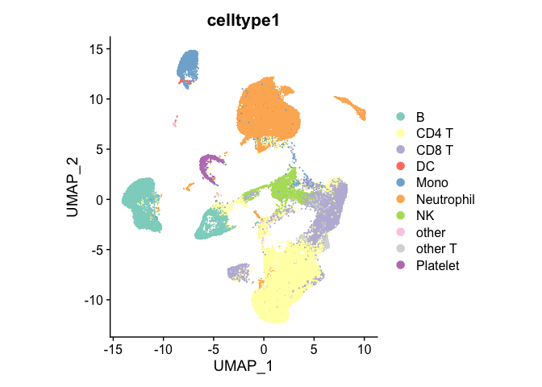

Subset to neutrophils, recluster

``` r
neu.covid.combined_final <- subset(covid.combined_final,subset=celltype1=="Neutrophil")
neu.covid.combined_final <- subset(covid.combined_final,subset=celltype3=="CD14 Mono")

neu.genes.use <- rowSums(GetAssayData(neu.covid.combined_final,slot="counts")) > 0
neu.genes.use <- names(neu.genes.use[neu.genes.use])

neu.covid.combined_final <- subset(neu.covid.combined_final, features = neu.genes.use)

neu.covid.combined_final <- Seurat::NormalizeData(neu.covid.combined_final,"RNA","LogNormalize",scale.factor=10000)
neu.covid.combined_final <- Seurat::FindVariableFeatures(neu.covid.combined_final,selection.method = "vst", nfeatures = 3000)

neu.covid.combined_final <- ScaleData(neu.covid.combined_final)

neu.covid.combined_final <- RunPCA(neu.covid.combined_final, features = VariableFeatures(object = neu.covid.combined_final))

#ElbowPlot(neu.covid.combined_final)

set.seed(1993)
neu.covid.combined_final <- FindNeighbors(neu.covid.combined_final, dims = 1:15)
neu.covid.combined_final <- FindClusters(neu.covid.combined_final, resolution=0.6)
```

    ## Modularity Optimizer version 1.3.0 by Ludo Waltman and Nees Jan van Eck
    ## 
    ## Number of nodes: 23712
    ## Number of edges: 730786
    ## 
    ## Running Louvain algorithm...
    ## Maximum modularity in 10 random starts: 0.8602
    ## Number of communities: 13
    ## Elapsed time: 5 seconds

``` r
neu.covid.combined_final <- RunUMAP(neu.covid.combined_final, dims = 1:15, seed.use = 1993)
```

    ## Warning: The default method for RunUMAP has changed from calling Python UMAP via reticulate to the R-native UWOT using the cosine metric
    ## To use Python UMAP via reticulate, set umap.method to 'umap-learn' and metric to 'correlation'
    ## This message will be shown once per session

``` r
mypal_16 <- colorRampPalette(brewer.pal(12, "Set3"))(16)
  
g_neu_umap <- DimPlot(neu.covid.combined_final, group.by = "seurat_clusters",label=TRUE) + scale_color_manual(values=mypal_16) + coord_fixed()
g_neu_umap
```

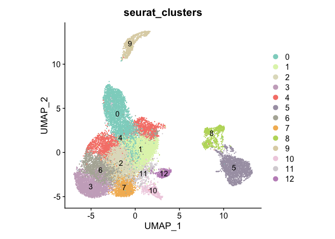

``` r
#ggsave("Sinha_neu_umap.pdf",g_neu_umap)


neu.markers <- FindAllMarkers(neu.covid.combined_final, only.pos = TRUE, min.pct = 0.25, logfc.threshold = 0.25)
#clusters 5/8/9 separate, possibly not neutrophils

monaco.ref <- celldex::MonacoImmuneData()
sce <- as.SingleCellExperiment(DietSeurat(neu.covid.combined_final))
monaco.main <- SingleR(test = sce,assay.type.test = 1,ref = monaco.ref,labels = monaco.ref$label.main)
monaco.fine <- SingleR(test = sce,assay.type.test = 1,ref = monaco.ref,labels = monaco.ref$label.fine)

neu.covid.combined_final@meta.data$monaco.main <- monaco.main$pruned.labels
neu.covid.combined_final@meta.data$monaco.fine <- monaco.fine$pruned.labels

g_neu_umap_monaco_main <- DimPlot(neu.covid.combined_final, group.by = "monaco.main",label=TRUE) + scale_color_manual(values=mypal_16) + coord_fixed()
g_neu_umap_monaco_main
```

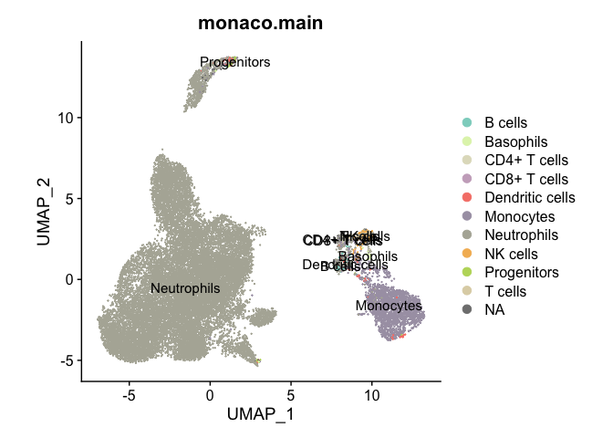

``` r
#ggsave("Sinha_neu_umap_monaco.pdf",g_neu_umap_monaco_main)


mypal_26 <- colorRampPalette(brewer.pal(12, "Set3"))(26)
g_neu_umap_monaco_fine <- DimPlot(neu.covid.combined_final, group.by = "monaco.fine",label=TRUE) + scale_color_manual(values=mypal_26) + coord_fixed() + theme(legend.position="bottom")
g_neu_umap_monaco_fine
```

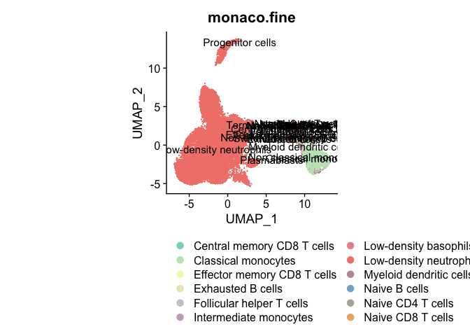

``` r
redo.neu.covid.combined_final <- subset(neu.covid.combined_final,subset=seurat_clusters %in% c(0,1,2,3,4,6,7,9,10,11,12))
redo.neu.genes.use <- rowSums(GetAssayData(redo.neu.covid.combined_final,slot="counts")) > 0
redo.neu.genes.use <- names(redo.neu.genes.use[redo.neu.genes.use])

redo.neu.covid.combined_final <- subset(redo.neu.covid.combined_final, features = redo.neu.genes.use)

redo.neu.covid.combined_final <- Seurat::NormalizeData(redo.neu.covid.combined_final,"RNA","LogNormalize",scale.factor=10000)
redo.neu.covid.combined_final <- Seurat::FindVariableFeatures(redo.neu.covid.combined_final,selection.method = "vst", nfeatures = 3000)

redo.neu.covid.combined_final <- ScaleData(redo.neu.covid.combined_final)

redo.neu.covid.combined_final <- RunPCA(redo.neu.covid.combined_final, features = VariableFeatures(object = redo.neu.covid.combined_final))

#ElbowPlot(neu.covid.combined_final)

set.seed(1993)
redo.neu.covid.combined_final <- FindNeighbors(redo.neu.covid.combined_final, dims = 1:15)
redo.neu.covid.combined_final <- FindClusters(redo.neu.covid.combined_final, resolution=0.6)
```

    ## Modularity Optimizer version 1.3.0 by Ludo Waltman and Nees Jan van Eck
    ## 
    ## Number of nodes: 20628
    ## Number of edges: 663135
    ## 
    ## Running Louvain algorithm...
    ## Maximum modularity in 10 random starts: 0.8771
    ## Number of communities: 13
    ## Elapsed time: 4 seconds

``` r
redo.neu.covid.combined_final <- RunUMAP(redo.neu.covid.combined_final, dims = 1:15, seed.use = 1993)

mypal_16 <- colorRampPalette(brewer.pal(12, "Set3"))(16)
  
g_neu_umap_redo <- DimPlot(redo.neu.covid.combined_final, group.by = "seurat_clusters",label=TRUE) + scale_color_manual(values=mypal_16) + coord_fixed()
g_neu_umap_redo
```

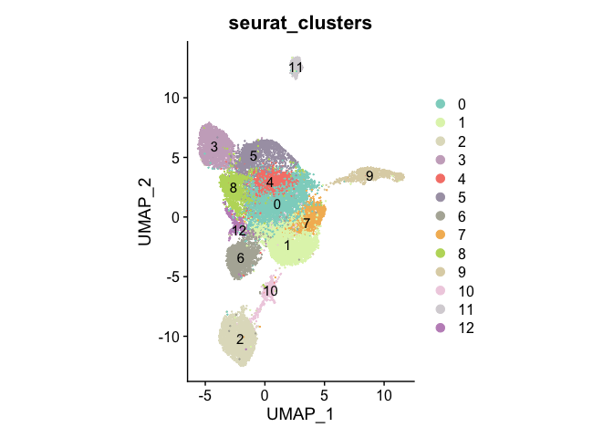

``` r
#ggsave("Sinha_neu_umap_redo.pdf",g_neu_umap_redo)

redo.neu.markers <- FindAllMarkers(redo.neu.covid.combined_final, only.pos = TRUE, min.pct = 0.25, logfc.threshold = 0.25)
#11 is erythrocytes, remove this cluster too

redo2.neu.covid.combined_final <- subset(redo.neu.covid.combined_final,subset=seurat_clusters %in% c(0,1,2,3,4,5,6,7,8,9,10,12))

redo2.neu.genes.use <- rowSums(GetAssayData(redo2.neu.covid.combined_final,slot="counts")) > 0
redo2.neu.genes.use <- names(redo2.neu.genes.use[redo2.neu.genes.use])

redo2.neu.covid.combined_final <- subset(redo2.neu.covid.combined_final, features = redo2.neu.genes.use)

redo2.neu.covid.combined_final <- Seurat::NormalizeData(redo2.neu.covid.combined_final,"RNA","LogNormalize",scale.factor=10000)
redo2.neu.covid.combined_final <- Seurat::FindVariableFeatures(redo2.neu.covid.combined_final,selection.method = "vst", nfeatures = 3000)

redo2.neu.covid.combined_final <- ScaleData(redo2.neu.covid.combined_final)

redo2.neu.covid.combined_final <- RunPCA(redo2.neu.covid.combined_final, features = VariableFeatures(object = redo2.neu.covid.combined_final))

#ElbowPlot(redo2.neu.covid.combined_final)

set.seed(1993)
redo2.neu.covid.combined_final <- FindNeighbors(redo2.neu.covid.combined_final, dims = 1:15)
redo2.neu.covid.combined_final <- FindClusters(redo2.neu.covid.combined_final, resolution=0.6)
```

    ## Modularity Optimizer version 1.3.0 by Ludo Waltman and Nees Jan van Eck
    ## 
    ## Number of nodes: 20177
    ## Number of edges: 647938
    ## 
    ## Running Louvain algorithm...
    ## Maximum modularity in 10 random starts: 0.8719
    ## Number of communities: 12
    ## Elapsed time: 4 seconds

``` r
redo2.neu.covid.combined_final <- RunUMAP(redo2.neu.covid.combined_final, dims = 1:15, seed.use = 1993)

mypal_16 <- colorRampPalette(brewer.pal(12, "Set3"))(16)
  
g_neu_umap_redo2 <- DimPlot(redo2.neu.covid.combined_final, group.by = "seurat_clusters",label=TRUE,raster=TRUE) + scale_color_manual(values=mypal_16) + coord_fixed()
g_neu_umap_redo2
```

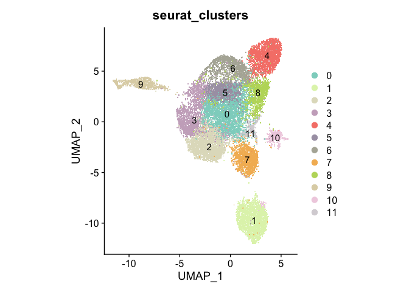

``` r
#ggsave("Sinha_neu_umap_redo2.pdf",g_neu_umap_redo2)

g_neu_umap_redo2_withdexstatus <- DimPlot(redo2.neu.covid.combined_final, group.by = "status",label=FALSE,raster=TRUE) + scale_color_manual(values=c("blue","red")) + coord_fixed()
g_neu_umap_redo2_withdexstatus
```

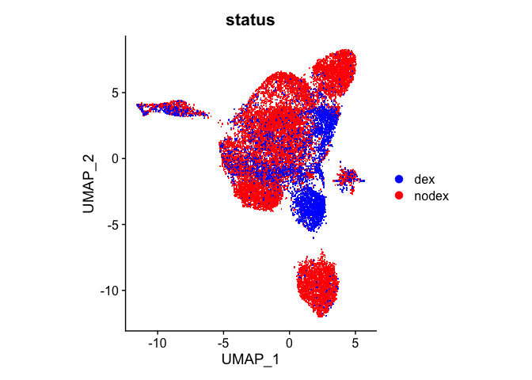

``` r
#ggsave("Sinha_neu_umap_redo2_withdexstatus.pdf",g_neu_umap_redo2_withdexstatus)

g_neu_umap_redo2_withvitalstatus <- DimPlot(redo2.neu.covid.combined_final, group.by = "Died",label=FALSE,raster=TRUE) + scale_color_manual(values=c("blue","red")) + coord_fixed()
g_neu_umap_redo2_withvitalstatus
```

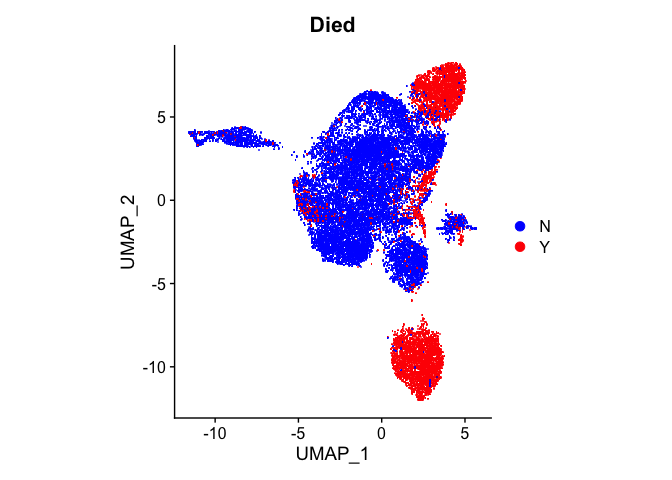

``` r
#ggsave("Sinha_neu_umap_redo2_withvitalstatus.pdf",g_neu_umap_redo2_withvitalstatus)

g_neu_umap_redo2_withtime <- DimPlot(redo2.neu.covid.combined_final, group.by = "time",label=FALSE,raster=TRUE) + scale_color_manual(values=c("blue","red")) + coord_fixed()
g_neu_umap_redo2_withtime
```

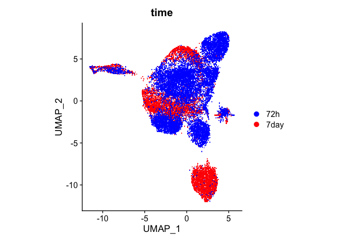

``` r
#ggsave("Sinha_neu_umap_redo2_withtime.pdf",g_neu_umap_redo2_withtime)


redo2_featureplot <- FeaturePlot(redo2.neu.covid.combined_final, features = c("S100A8","S100A9","S100A12","FCGR2A","CEACAM8","CXCR2"), raster=TRUE)
#ggsave("Sinha_neu_redo2_featureplot.pdf",redo2_featureplot,height=10,width=10)
redo2_featureplot
```

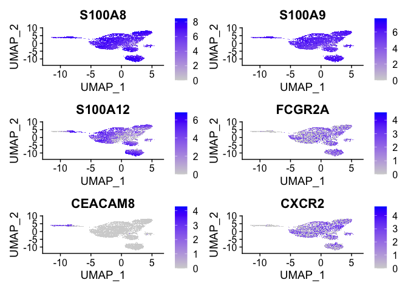

Score cells by NMF signatures, compare cells between dex/no dex and alive/dead

``` r
gmt.file <- gmtPathways(paste0(prefix,"neutrophil_state_gene_sets.gmt"))
tab <- redo2.neu.covid.combined_final@assays$RNA@counts[redo2.neu.covid.combined_final@assays$RNA@counts@Dimnames[[1]] %in% gmt.file$NMF1,]
tab_z <- apply(tab,1,scale)
tab_z <- t(tab_z)
nmf1_meanz <- as.numeric(colMeans(tab_z))
redo2.neu.covid.combined_final <- AddMetaData(redo2.neu.covid.combined_final, metadata = nmf1_meanz, col.name = "nmf1")
tab <- redo2.neu.covid.combined_final@assays$RNA@counts[redo2.neu.covid.combined_final@assays$RNA@counts@Dimnames[[1]] %in% gmt.file$NMF2,]
tab_z <- apply(tab,1,scale)
tab_z <- t(tab_z)
nmf2_meanz <- as.numeric(colMeans(tab_z))
redo2.neu.covid.combined_final <- AddMetaData(redo2.neu.covid.combined_final, metadata = nmf2_meanz, col.name = "nmf2")
tab <- redo2.neu.covid.combined_final@assays$RNA@counts[redo2.neu.covid.combined_final@assays$RNA@counts@Dimnames[[1]] %in% gmt.file$NMF3,]
tab_z <- apply(tab,1,scale)
tab_z <- t(tab_z)
nmf3_meanz <- as.numeric(colMeans(tab_z))
redo2.neu.covid.combined_final <- AddMetaData(redo2.neu.covid.combined_final, metadata = nmf3_meanz, col.name = "nmf3")
tab <- redo2.neu.covid.combined_final@assays$RNA@counts[redo2.neu.covid.combined_final@assays$RNA@counts@Dimnames[[1]] %in% gmt.file$NMF4,]
tab_z <- apply(tab,1,scale)
tab_z <- t(tab_z)
nmf4_meanz <- as.numeric(colMeans(tab_z))
redo2.neu.covid.combined_final <- AddMetaData(redo2.neu.covid.combined_final, metadata = nmf4_meanz, col.name = "nmf4")
tab <- redo2.neu.covid.combined_final@assays$RNA@counts[redo2.neu.covid.combined_final@assays$RNA@counts@Dimnames[[1]] %in% gmt.file$NMF5,]
tab_z <- apply(tab,1,scale)
tab_z <- t(tab_z)
nmf5_meanz <- as.numeric(colMeans(tab_z))
redo2.neu.covid.combined_final <- AddMetaData(redo2.neu.covid.combined_final, metadata = nmf5_meanz, col.name = "nmf5")
tab <- redo2.neu.covid.combined_final@assays$RNA@counts[redo2.neu.covid.combined_final@assays$RNA@counts@Dimnames[[1]] %in% gmt.file$NMF6,]
tab_z <- apply(tab,1,scale)
tab_z <- t(tab_z)
nmf6_meanz <- as.numeric(colMeans(tab_z))
redo2.neu.covid.combined_final <- AddMetaData(redo2.neu.covid.combined_final, metadata = nmf6_meanz, col.name = "nmf6")

ps1 <- FeaturePlot(redo2.neu.covid.combined_final, reduction = "umap", features = c("nmf1"), max.cutoff = 1.5, cols = c("blue","yellow","red"), raster = TRUE) & scale_colour_gradientn(colours = (brewer.pal(n = 9, name = "Reds"))) 
ps1 <- ps1 + theme(axis.line = element_blank(), axis.text = element_blank(), axis.title = element_blank(), axis.ticks = element_blank(), legend.position = "none") + ggtitle("NMF1")
ps2 <- FeaturePlot(redo2.neu.covid.combined_final, reduction = "umap", features = c("nmf2"), max.cutoff = 1.5, cols = c("blue","yellow","red"), raster = TRUE) & scale_colour_gradientn(colours = (brewer.pal(n = 9, name = "Reds"))) 
ps2 <- ps2 + theme(axis.line = element_blank(), axis.text = element_blank(), axis.title = element_blank(), axis.ticks = element_blank(), legend.position = "none") + ggtitle("NMF2")
ps3 <- FeaturePlot(redo2.neu.covid.combined_final, reduction = "umap", features = c("nmf3"), max.cutoff = 1.5, cols = c("blue","yellow","red"), raster = TRUE) & scale_colour_gradientn(colours = (brewer.pal(n = 9, name = "Reds")))
ps3 <- ps3 + theme(axis.line = element_blank(), axis.text = element_blank(), axis.title = element_blank(), axis.ticks = element_blank(), legend.position = "none") + ggtitle("NMF3")
ps4 <- FeaturePlot(redo2.neu.covid.combined_final, reduction = "umap", features = c("nmf4"), max.cutoff = 1.5, cols = c("blue","yellow","red"), raster = TRUE) & scale_colour_gradientn(colours = (brewer.pal(n = 9, name = "Reds")))
ps4 <- ps4 + theme(axis.line = element_blank(), axis.text = element_blank(), axis.title = element_blank(), axis.ticks = element_blank(), legend.position = "none") + ggtitle("NMF4")
ps5 <- FeaturePlot(redo2.neu.covid.combined_final, reduction = "umap", features = c("nmf5"), max.cutoff = 1.5, cols = c("blue","yellow","red"), raster = TRUE) & scale_colour_gradientn(colours = (brewer.pal(n = 9, name = "Reds")))
ps5 <- ps5 + theme(axis.line = element_blank(), axis.text = element_blank(), axis.title = element_blank(), axis.ticks = element_blank(), legend.position = "none") + ggtitle("NMF5")
ps6 <- FeaturePlot(redo2.neu.covid.combined_final, reduction = "umap", features = c("nmf6"), max.cutoff = 1.5, cols = c("blue","yellow","red"), raster = TRUE) & scale_colour_gradientn(colours = (brewer.pal(n = 9, name = "Reds"))) 
ps6 <- ps6 + theme(axis.line = element_blank(), axis.text = element_blank(), axis.title = element_blank(), axis.ticks = element_blank(), legend.position = "none") + ggtitle("NMF6")

cowplot::plot_grid(ps1,ps2,ps3,ps4,ps5,ps6,ncol=3)
```

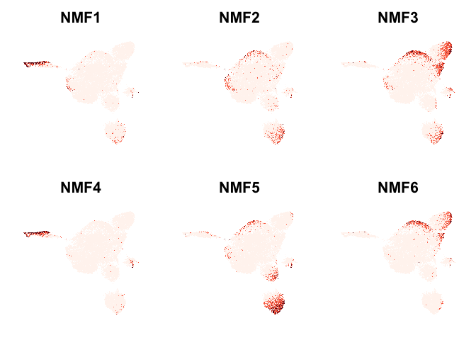

``` r
#cowplot::save_plot("Sinha_neutrophil_NMF_UMAP.pdf",cowplot::plot_grid(ps1,ps2,ps3,ps4,ps5,ps6,ncol=3))

tmp_ad <- c("alive","dead")
names(tmp_ad) <- c("N","Y")
df_dex <- data.frame(NMF1=redo2.neu.covid.combined_final@meta.data$nmf1,
                     NMF2=redo2.neu.covid.combined_final@meta.data$nmf2,
                     NMF3=redo2.neu.covid.combined_final@meta.data$nmf3,
                     NMF4=redo2.neu.covid.combined_final@meta.data$nmf4,
                     NMF5=redo2.neu.covid.combined_final@meta.data$nmf5,
                     NMF6=redo2.neu.covid.combined_final@meta.data$nmf6,
                     patient=redo2.neu.covid.combined_final@meta.data$patient,
                     dex=redo2.neu.covid.combined_final@meta.data$status,
                     dead=tmp_ad[c(redo2.neu.covid.combined_final@meta.data$Died)],
                     time=redo2.neu.covid.combined_final@meta.data$time,stringsAsFactors=F)

ps_nmf1_ad <- ggplot(df_dex, aes(x = factor(dead), y = NMF1, fill = factor(dead))) + geom_boxplot(outlier.shape = NA) + theme_bw() + xlab("Status") + ylab("NMF1") + scale_fill_manual(values = c("blue","red")) + coord_fixed(ratio = 0.5) + coord_cartesian(ylim = c(-0.5,1.25)) + stat_compare_means(label = "p.signif",label.y=0.5,label.x=1.4) + theme(legend.position="none",plot.title=element_text(hjust = 0.5)) + ggtitle("NMF1")
ps_nmf2_ad <- ggplot(df_dex, aes(x = factor(dead), y = NMF2, fill = factor(dead))) + geom_boxplot(outlier.shape = NA) + theme_bw() + xlab("Status") + ylab("NMF2") + scale_fill_manual(values = c("blue","red")) + coord_fixed(ratio = 0.5) + coord_cartesian(ylim = c(-0.5,1.25)) + stat_compare_means(label = "p.signif",label.y=0.5,label.x=1.4) + theme(legend.position="none",plot.title=element_text(hjust = 0.5)) + ggtitle("NMF2")
ps_nmf3_ad <- ggplot(df_dex, aes(x = factor(dead), y = NMF3, fill = factor(dead))) + geom_boxplot(outlier.shape = NA) + theme_bw() + xlab("Status") + ylab("NMF3") + scale_fill_manual(values = c("blue","red")) + coord_fixed(ratio = 0.5) + coord_cartesian(ylim = c(-0.5,1.25)) + stat_compare_means(label = "p.signif",label.y=0.5,label.x=1.4) + theme(legend.position="none",plot.title=element_text(hjust = 0.5)) + ggtitle("NMF3")
ps_nmf4_ad <- ggplot(df_dex, aes(x = factor(dead), y = NMF4, fill = factor(dead))) + geom_boxplot(outlier.shape = NA) + theme_bw() + xlab("Status") + ylab("NMF4") + scale_fill_manual(values = c("blue","red")) + coord_fixed(ratio = 0.5) + coord_cartesian(ylim = c(-0.5,1.25)) + stat_compare_means(label = "p.signif",label.y=0.5,label.x=1.4) + theme(legend.position="none",plot.title=element_text(hjust = 0.5)) + ggtitle("NMF4")
ps_nmf5_ad <- ggplot(df_dex, aes(x = factor(dead), y = NMF5, fill = factor(dead))) + geom_boxplot(outlier.shape = NA) + theme_bw() + xlab("Status") + ylab("NMF5") + scale_fill_manual(values = c("blue","red")) + coord_fixed(ratio = 0.5) + coord_cartesian(ylim = c(-0.5,1.25)) + stat_compare_means(label = "p.signif",label.y=0.5,label.x=1.4) + theme(legend.position="none",plot.title=element_text(hjust = 0.5)) + ggtitle("NMF5")
ps_nmf6_ad <- ggplot(df_dex, aes(x = factor(dead), y = NMF6, fill = factor(dead))) + geom_boxplot(outlier.shape = NA) + theme_bw() + xlab("Status") + ylab("NMF6") + scale_fill_manual(values = c("blue","red")) + coord_fixed(ratio = 0.5) + coord_cartesian(ylim = c(-0.5,1.25)) + stat_compare_means(label = "p.signif",label.y=0.5,label.x=1.4) + theme(legend.position="none",plot.title=element_text(hjust = 0.5)) + ggtitle("NMF6")

g_dex_ad_grid <- grid.arrange(ps_nmf1_ad,ps_nmf2_ad,ps_nmf3_ad,ps_nmf4_ad,ps_nmf5_ad,ps_nmf6_ad,nrow=1)
```

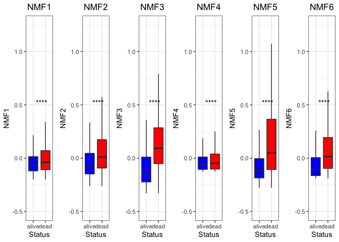

``` r
g_dex_ad_grid
```

    ## TableGrob (1 x 6) "arrange": 6 grobs
    ##   z     cells    name           grob
    ## 1 1 (1-1,1-1) arrange gtable[layout]
    ## 2 2 (1-1,2-2) arrange gtable[layout]
    ## 3 3 (1-1,3-3) arrange gtable[layout]
    ## 4 4 (1-1,4-4) arrange gtable[layout]
    ## 5 5 (1-1,5-5) arrange gtable[layout]
    ## 6 6 (1-1,6-6) arrange gtable[layout]

``` r
#ggsave("Dex_NMF_signature_alive_vs_dead.pdf",g_dex_ad_grid,height=7,width=12)

ps_nmf1_dnd <- ggplot(df_dex, aes(x = factor(dex), y = NMF1, fill = factor(dex))) + geom_boxplot(outlier.shape = NA) + theme_bw() + xlab("Treatment") + ylab("NMF1") + scale_fill_manual(values = c("blue","red")) + coord_fixed(ratio = 0.5) + coord_cartesian(ylim = c(-0.5,1.25)) + stat_compare_means(label = "p.signif",label.y=0.5,label.x=1.4) + theme(legend.position="none",plot.title=element_text(hjust = 0.5)) + ggtitle("NMF1")
ps_nmf2_dnd <- ggplot(df_dex, aes(x = factor(dex), y = NMF2, fill = factor(dex))) + geom_boxplot(outlier.shape = NA) + theme_bw() + xlab("Treatment") + ylab("NMF2") + scale_fill_manual(values = c("blue","red")) + coord_fixed(ratio = 0.5) + coord_cartesian(ylim = c(-0.5,1.25)) + stat_compare_means(label = "p.signif",label.y=0.5,label.x=1.4) + theme(legend.position="none",plot.title=element_text(hjust = 0.5)) + ggtitle("NMF2")
ps_nmf3_dnd <- ggplot(df_dex, aes(x = factor(dex), y = NMF3, fill = factor(dex))) + geom_boxplot(outlier.shape = NA) + theme_bw() + xlab("Treatment") + ylab("NMF3") + scale_fill_manual(values = c("blue","red")) + coord_fixed(ratio = 0.5) + coord_cartesian(ylim = c(-0.5,1.25)) + stat_compare_means(label = "p.signif",label.y=0.5,label.x=1.4) + theme(legend.position="none",plot.title=element_text(hjust = 0.5)) + ggtitle("NMF3")
ps_nmf4_dnd <- ggplot(df_dex, aes(x = factor(dex), y = NMF4, fill = factor(dex))) + geom_boxplot(outlier.shape = NA) + theme_bw() + xlab("Treatment") + ylab("NMF4") + scale_fill_manual(values = c("blue","red")) + coord_fixed(ratio = 0.5) + coord_cartesian(ylim = c(-0.5,1.25)) + stat_compare_means(label = "p.signif",label.y=0.5,label.x=1.4) + theme(legend.position="none",plot.title=element_text(hjust = 0.5)) + ggtitle("NMF4")
ps_nmf5_dnd <- ggplot(df_dex, aes(x = factor(dex), y = NMF5, fill = factor(dex))) + geom_boxplot(outlier.shape = NA) + theme_bw() + xlab("Treatment") + ylab("NMF5") + scale_fill_manual(values = c("blue","red")) + coord_fixed(ratio = 0.5) + coord_cartesian(ylim = c(-0.5,1.25)) + stat_compare_means(label = "p.signif",label.y=0.5,label.x=1.4) + theme(legend.position="none",plot.title=element_text(hjust = 0.5)) + ggtitle("NMF5")
ps_nmf6_dnd <- ggplot(df_dex, aes(x = factor(dex), y = NMF6, fill = factor(dex))) + geom_boxplot(outlier.shape = NA) + theme_bw() + xlab("Treatment") + ylab("NMF6") + scale_fill_manual(values = c("blue","red")) + coord_fixed(ratio = 0.5) + coord_cartesian(ylim = c(-0.5,1.25)) + stat_compare_means(label = "p.signif",label.y=0.5,label.x=1.4) + theme(legend.position="none",plot.title=element_text(hjust = 0.5)) + ggtitle("NMF6")

g_dex_dnd_grid <- grid.arrange(ps_nmf1_dnd,ps_nmf2_dnd,ps_nmf3_dnd,ps_nmf4_dnd,ps_nmf5_dnd,ps_nmf6_dnd,nrow=1)
```

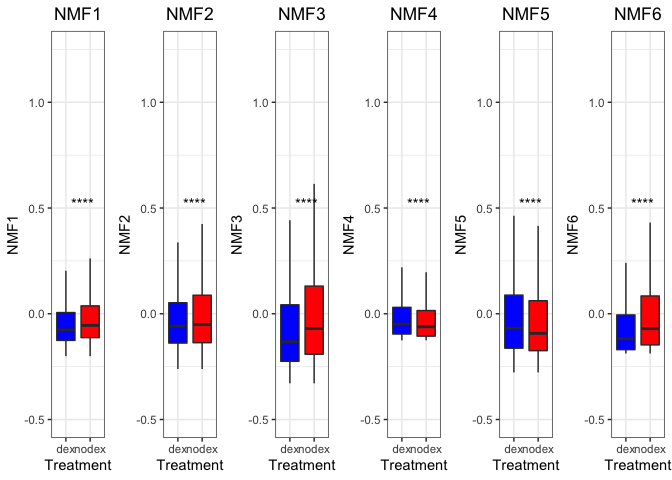

``` r
g_dex_dnd_grid
```

    ## TableGrob (1 x 6) "arrange": 6 grobs
    ##   z     cells    name           grob
    ## 1 1 (1-1,1-1) arrange gtable[layout]
    ## 2 2 (1-1,2-2) arrange gtable[layout]
    ## 3 3 (1-1,3-3) arrange gtable[layout]
    ## 4 4 (1-1,4-4) arrange gtable[layout]
    ## 5 5 (1-1,5-5) arrange gtable[layout]
    ## 6 6 (1-1,6-6) arrange gtable[layout]

``` r
#ggsave("Dex_NMF_signature_dex_vs_nodex.pdf",g_dex_dnd_grid,height=7,width=12)

ps_nmf1_t <- ggplot(df_dex, aes(x = factor(time), y = NMF1, fill = factor(time))) + geom_boxplot(outlier.shape = NA) + theme_bw() + xlab("Time") + ylab("NMF1") + scale_fill_manual(values = c("blue","red")) + coord_fixed(ratio = 0.5) + coord_cartesian(ylim = c(-0.5,1.25)) + stat_compare_means(label = "p.signif",label.y=0.5,label.x=1.4) + theme(legend.position="none",plot.title=element_text(hjust = 0.5)) + ggtitle("NMF1")
ps_nmf2_t <- ggplot(df_dex, aes(x = factor(time), y = NMF2, fill = factor(time))) + geom_boxplot(outlier.shape = NA) + theme_bw() + xlab("Time") + ylab("NMF2") + scale_fill_manual(values = c("blue","red")) + coord_fixed(ratio = 0.5) + coord_cartesian(ylim = c(-0.5,1.25)) + stat_compare_means(label = "p.signif",label.y=0.5,label.x=1.4) + theme(legend.position="none",plot.title=element_text(hjust = 0.5)) + ggtitle("NMF2")
ps_nmf3_t <- ggplot(df_dex, aes(x = factor(time), y = NMF3, fill = factor(time))) + geom_boxplot(outlier.shape = NA) + theme_bw() + xlab("Time") + ylab("NMF3") + scale_fill_manual(values = c("blue","red")) + coord_fixed(ratio = 0.5) + coord_cartesian(ylim = c(-0.5,1.25)) + stat_compare_means(label = "p.signif",label.y=0.5,label.x=1.4) + theme(legend.position="none",plot.title=element_text(hjust = 0.5)) + ggtitle("NMF3")
ps_nmf4_t <- ggplot(df_dex, aes(x = factor(time), y = NMF4, fill = factor(time))) + geom_boxplot(outlier.shape = NA) + theme_bw() + xlab("Time") + ylab("NMF4") + scale_fill_manual(values = c("blue","red")) + coord_fixed(ratio = 0.5) + coord_cartesian(ylim = c(-0.5,1.25)) + stat_compare_means(label = "p.signif",label.y=0.5,label.x=1.4) + theme(legend.position="none",plot.title=element_text(hjust = 0.5)) + ggtitle("NMF4")
ps_nmf5_t <- ggplot(df_dex, aes(x = factor(time), y = NMF5, fill = factor(time))) + geom_boxplot(outlier.shape = NA) + theme_bw() + xlab("Time") + ylab("NMF5") + scale_fill_manual(values = c("blue","red")) + coord_fixed(ratio = 0.5) + coord_cartesian(ylim = c(-0.5,1.25)) + stat_compare_means(label = "p.signif",label.y=0.5,label.x=1.4) + theme(legend.position="none",plot.title=element_text(hjust = 0.5)) + ggtitle("NMF5")
ps_nmf6_t <- ggplot(df_dex, aes(x = factor(time), y = NMF6, fill = factor(time))) + geom_boxplot(outlier.shape = NA) + theme_bw() + xlab("Time") + ylab("NMF6") + scale_fill_manual(values = c("blue","red")) + coord_fixed(ratio = 0.5) + coord_cartesian(ylim = c(-0.5,1.25)) + stat_compare_means(label = "p.signif",label.y=0.5,label.x=1.4) + theme(legend.position="none",plot.title=element_text(hjust = 0.5)) + ggtitle("NMF6")

g_dex_time_grid <- grid.arrange(ps_nmf1_t,ps_nmf2_t,ps_nmf3_t,ps_nmf4_t,ps_nmf5_t,ps_nmf6_t,nrow=1)
```

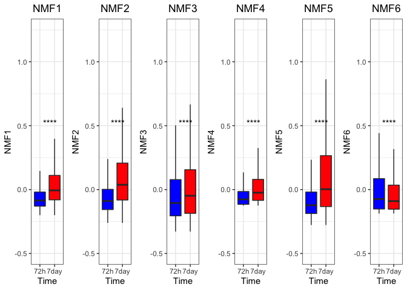

``` r
#ggsave("Dex_NMF_signature_72hr_vs_7days.pdf",g_dex_time_grid,height=7,width=12)
g_dex_time_grid
```

    ## TableGrob (1 x 6) "arrange": 6 grobs
    ##   z     cells    name           grob
    ## 1 1 (1-1,1-1) arrange gtable[layout]
    ## 2 2 (1-1,2-2) arrange gtable[layout]
    ## 3 3 (1-1,3-3) arrange gtable[layout]
    ## 4 4 (1-1,4-4) arrange gtable[layout]
    ## 5 5 (1-1,5-5) arrange gtable[layout]
    ## 6 6 (1-1,6-6) arrange gtable[layout]

``` r
ps_nmf1_ad72h7day <- ggplot(df_dex, aes(x = factor(time), y = NMF1, fill = factor(dead))) + geom_boxplot(outlier.shape = NA) + theme_bw() + xlab("Time") + ylab("NMF1") + scale_fill_manual(name="",values = c("blue","red")) + coord_fixed(ratio = 0.5) + coord_cartesian(ylim = c(-0.5,1.25)) + stat_compare_means(label = "p.signif",label.y=0.75,label.x=1.4) + theme(legend.position="bottom",plot.title=element_text(hjust = 0.5),legend.key.size = unit(0.2, 'cm'),legend.text=element_text(size=4)) + ggtitle("NMF1")
ps_nmf2_ad72h7day <- ggplot(df_dex, aes(x = factor(time), y = NMF2, fill = factor(dead))) + geom_boxplot(outlier.shape = NA) + theme_bw() + xlab("Time") + ylab("NMF2") + scale_fill_manual(name="",values = c("blue","red")) + coord_fixed(ratio = 0.5) + coord_cartesian(ylim = c(-0.5,1.25)) + stat_compare_means(label = "p.signif",label.y=0.75,label.x=1.4) + theme(legend.position="bottom",plot.title=element_text(hjust = 0.5),legend.key.size = unit(0.2, 'cm'),legend.text=element_text(size=4)) + ggtitle("NMF2")
ps_nmf3_ad72h7day <- ggplot(df_dex, aes(x = factor(time), y = NMF3, fill = factor(dead))) + geom_boxplot(outlier.shape = NA) + theme_bw() + xlab("Time") + ylab("NMF3") + scale_fill_manual(name="",values = c("blue","red")) + coord_fixed(ratio = 0.5) + coord_cartesian(ylim = c(-0.5,1.25)) + stat_compare_means(label = "p.signif",label.y=0.75,label.x=1.4) + theme(legend.position="bottom",plot.title=element_text(hjust = 0.5),legend.key.size = unit(0.2, 'cm'),legend.text=element_text(size=4)) + ggtitle("NMF3")
ps_nmf4_ad72h7day <- ggplot(df_dex, aes(x = factor(time), y = NMF4, fill = factor(dead))) + geom_boxplot(outlier.shape = NA) + theme_bw() + xlab("Time") + ylab("NMF4") + scale_fill_manual(name="",values = c("blue","red")) + coord_fixed(ratio = 0.5) + coord_cartesian(ylim = c(-0.5,1.25)) + stat_compare_means(label = "p.signif",label.y=0.75,label.x=1.4) + theme(legend.position="bottom",plot.title=element_text(hjust = 0.5),legend.key.size = unit(0.2, 'cm'),legend.text=element_text(size=4)) + ggtitle("NMF4")
ps_nmf5_ad72h7day <- ggplot(df_dex, aes(x = factor(time), y = NMF5, fill = factor(dead))) + geom_boxplot(outlier.shape = NA) + theme_bw() + xlab("Time") + ylab("NMF5") + scale_fill_manual(name="",values = c("blue","red")) + coord_fixed(ratio = 0.5) + coord_cartesian(ylim = c(-0.5,1.25)) + stat_compare_means(label = "p.signif",label.y=0.75,label.x=1.4) + theme(legend.position="bottom",plot.title=element_text(hjust = 0.5),legend.key.size = unit(0.2, 'cm'),legend.text=element_text(size=4)) + ggtitle("NMF5")
ps_nmf6_ad72h7day <- ggplot(df_dex, aes(x = factor(time), y = NMF6, fill = factor(dead))) + geom_boxplot(outlier.shape = NA) + theme_bw() + xlab("Time") + ylab("NMF6") + scale_fill_manual(name="",values = c("blue","red")) + coord_fixed(ratio = 0.5) + coord_cartesian(ylim = c(-0.5,1.25)) + stat_compare_means(label = "p.signif",label.y=0.75,label.x=1.4) + theme(legend.position="bottom",plot.title=element_text(hjust = 0.5),legend.key.size = unit(0.2, 'cm'),legend.text=element_text(size=4)) + ggtitle("NMF6")

g_dex_ad72h7d_grid <- grid.arrange(ps_nmf1_ad72h7day,ps_nmf2_ad72h7day,ps_nmf3_ad72h7day,ps_nmf4_ad72h7day,ps_nmf5_ad72h7day,ps_nmf6_ad72h7day,nrow=1)
```

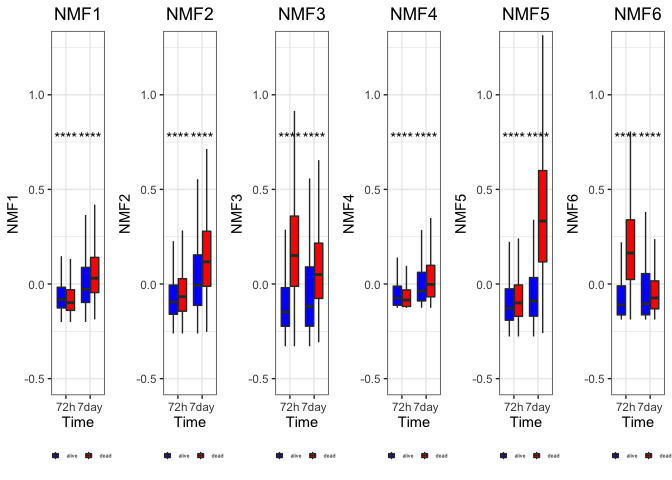

``` r
g_dex_ad72h7d_grid
```

    ## TableGrob (1 x 6) "arrange": 6 grobs
    ##   z     cells    name           grob
    ## 1 1 (1-1,1-1) arrange gtable[layout]
    ## 2 2 (1-1,2-2) arrange gtable[layout]
    ## 3 3 (1-1,3-3) arrange gtable[layout]
    ## 4 4 (1-1,4-4) arrange gtable[layout]
    ## 5 5 (1-1,5-5) arrange gtable[layout]
    ## 6 6 (1-1,6-6) arrange gtable[layout]

``` r
#ggsave("Dex_NMF_signature_alive_vs_dead_72hand7daysamples.pdf",g_dex_ad72h7d_grid,height=7,width=12)


ps_nmf1_dnd72h7day <- ggplot(df_dex, aes(x = factor(time), y = NMF1, fill = factor(dex))) + geom_boxplot(outlier.shape = NA) + theme_bw() + xlab("Time") + ylab("NMF1") + scale_fill_manual(name="",values = c("blue","red")) + coord_fixed(ratio = 0.5) + coord_cartesian(ylim = c(-0.5,1.25)) + stat_compare_means(label = "p.signif",label.y=0.75,label.x=1.4) + theme(legend.position="bottom",plot.title=element_text(hjust = 0.5),legend.key.size = unit(0.2, 'cm'),legend.text=element_text(size=4)) + ggtitle("NMF1")
ps_nmf2_dnd72h7day <- ggplot(df_dex, aes(x = factor(time), y = NMF2, fill = factor(dex))) + geom_boxplot(outlier.shape = NA) + theme_bw() + xlab("Time") + ylab("NMF2") + scale_fill_manual(name="",values = c("blue","red")) + coord_fixed(ratio = 0.5) + coord_cartesian(ylim = c(-0.5,1.25)) + stat_compare_means(label = "p.signif",label.y=0.75,label.x=1.4) + theme(legend.position="bottom",plot.title=element_text(hjust = 0.5),legend.key.size = unit(0.2, 'cm'),legend.text=element_text(size=4)) + ggtitle("NMF2")
ps_nmf3_dnd72h7day <- ggplot(df_dex, aes(x = factor(time), y = NMF3, fill = factor(dex))) + geom_boxplot(outlier.shape = NA) + theme_bw() + xlab("Time") + ylab("NMF3") + scale_fill_manual(name="",values = c("blue","red")) + coord_fixed(ratio = 0.5) + coord_cartesian(ylim = c(-0.5,1.25)) + stat_compare_means(label = "p.signif",label.y=0.75,label.x=1.4) + theme(legend.position="bottom",plot.title=element_text(hjust = 0.5),legend.key.size = unit(0.2, 'cm'),legend.text=element_text(size=4)) + ggtitle("NMF3")
ps_nmf4_dnd72h7day <- ggplot(df_dex, aes(x = factor(time), y = NMF4, fill = factor(dex))) + geom_boxplot(outlier.shape = NA) + theme_bw() + xlab("Time") + ylab("NMF4") + scale_fill_manual(name="",values = c("blue","red")) + coord_fixed(ratio = 0.5) + coord_cartesian(ylim = c(-0.5,1.25)) + stat_compare_means(label = "p.signif",label.y=0.75,label.x=1.4) + theme(legend.position="bottom",plot.title=element_text(hjust = 0.5),legend.key.size = unit(0.2, 'cm'),legend.text=element_text(size=4)) + ggtitle("NMF4")
ps_nmf5_dnd72h7day <- ggplot(df_dex, aes(x = factor(time), y = NMF5, fill = factor(dex))) + geom_boxplot(outlier.shape = NA) + theme_bw() + xlab("Time") + ylab("NMF5") + scale_fill_manual(name="",values = c("blue","red")) + coord_fixed(ratio = 0.5) + coord_cartesian(ylim = c(-0.5,1.25)) + stat_compare_means(label = "p.signif",label.y=0.75,label.x=1.4) + theme(legend.position="bottom",plot.title=element_text(hjust = 0.5),legend.key.size = unit(0.2, 'cm'),legend.text=element_text(size=4)) + ggtitle("NMF5")
ps_nmf6_dnd72h7day <- ggplot(df_dex, aes(x = factor(time), y = NMF6, fill = factor(dex))) + geom_boxplot(outlier.shape = NA) + theme_bw() + xlab("Time") + ylab("NMF6") + scale_fill_manual(name="",values = c("blue","red")) + coord_fixed(ratio = 0.5) + coord_cartesian(ylim = c(-0.5,1.25)) + stat_compare_means(label = "p.signif",label.y=0.75,label.x=1.4) + theme(legend.position="bottom",plot.title=element_text(hjust = 0.5),legend.key.size = unit(0.2, 'cm'),legend.text=element_text(size=4)) + ggtitle("NMF6")

g_dex_dnd72h7d_grid <- grid.arrange(ps_nmf1_dnd72h7day,ps_nmf2_dnd72h7day,ps_nmf3_dnd72h7day,ps_nmf4_dnd72h7day,ps_nmf5_dnd72h7day,ps_nmf6_dnd72h7day,nrow=1)
```

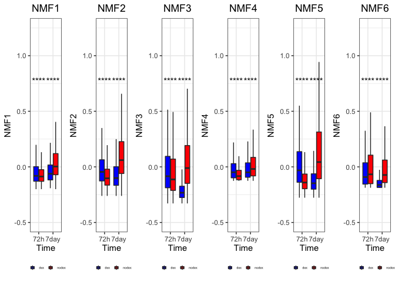

``` r
g_dex_dnd72h7d_grid
```

    ## TableGrob (1 x 6) "arrange": 6 grobs
    ##   z     cells    name           grob
    ## 1 1 (1-1,1-1) arrange gtable[layout]
    ## 2 2 (1-1,2-2) arrange gtable[layout]
    ## 3 3 (1-1,3-3) arrange gtable[layout]
    ## 4 4 (1-1,4-4) arrange gtable[layout]
    ## 5 5 (1-1,5-5) arrange gtable[layout]
    ## 6 6 (1-1,6-6) arrange gtable[layout]

``` r
#ggsave("Dex_NMF_signature_dex_vs_nodex_72hand7daysamples.pdf",g_dex_dnd72h7d_grid,height=7,width=12)
```
