New Neutrophil Analyses
================

### Somalogic Analyses

``` r
library(knitr)
library(ggplot2)
library(ggrepel)
library(RColorBrewer)
library(plyr)
library(dplyr)
```

    ## 
    ## Attaching package: 'dplyr'

    ## The following objects are masked from 'package:plyr':
    ## 
    ##     arrange, count, desc, failwith, id, mutate, rename, summarise,
    ##     summarize

    ## The following objects are masked from 'package:stats':
    ## 
    ##     filter, lag

    ## The following objects are masked from 'package:base':
    ## 
    ##     intersect, setdiff, setequal, union

``` r
library(DESeq2)
```

    ## Loading required package: S4Vectors

    ## Loading required package: stats4

    ## Loading required package: BiocGenerics

    ## 
    ## Attaching package: 'BiocGenerics'

    ## The following objects are masked from 'package:dplyr':
    ## 
    ##     combine, intersect, setdiff, union

    ## The following objects are masked from 'package:stats':
    ## 
    ##     IQR, mad, sd, var, xtabs

    ## The following objects are masked from 'package:base':
    ## 
    ##     anyDuplicated, append, as.data.frame, basename, cbind, colnames,
    ##     dirname, do.call, duplicated, eval, evalq, Filter, Find, get, grep,
    ##     grepl, intersect, is.unsorted, lapply, Map, mapply, match, mget,
    ##     order, paste, pmax, pmax.int, pmin, pmin.int, Position, rank,
    ##     rbind, Reduce, rownames, sapply, setdiff, sort, table, tapply,
    ##     union, unique, unsplit, which.max, which.min

    ## 
    ## Attaching package: 'S4Vectors'

    ## The following objects are masked from 'package:dplyr':
    ## 
    ##     first, rename

    ## The following object is masked from 'package:plyr':
    ## 
    ##     rename

    ## The following objects are masked from 'package:base':
    ## 
    ##     expand.grid, I, unname

    ## Loading required package: IRanges

    ## 
    ## Attaching package: 'IRanges'

    ## The following objects are masked from 'package:dplyr':
    ## 
    ##     collapse, desc, slice

    ## The following object is masked from 'package:plyr':
    ## 
    ##     desc

    ## Loading required package: GenomicRanges

    ## Loading required package: GenomeInfoDb

    ## Loading required package: SummarizedExperiment

    ## Loading required package: MatrixGenerics

    ## Loading required package: matrixStats

    ## 
    ## Attaching package: 'matrixStats'

    ## The following object is masked from 'package:dplyr':
    ## 
    ##     count

    ## The following object is masked from 'package:plyr':
    ## 
    ##     count

    ## 
    ## Attaching package: 'MatrixGenerics'

    ## The following objects are masked from 'package:matrixStats':
    ## 
    ##     colAlls, colAnyNAs, colAnys, colAvgsPerRowSet, colCollapse,
    ##     colCounts, colCummaxs, colCummins, colCumprods, colCumsums,
    ##     colDiffs, colIQRDiffs, colIQRs, colLogSumExps, colMadDiffs,
    ##     colMads, colMaxs, colMeans2, colMedians, colMins, colOrderStats,
    ##     colProds, colQuantiles, colRanges, colRanks, colSdDiffs, colSds,
    ##     colSums2, colTabulates, colVarDiffs, colVars, colWeightedMads,
    ##     colWeightedMeans, colWeightedMedians, colWeightedSds,
    ##     colWeightedVars, rowAlls, rowAnyNAs, rowAnys, rowAvgsPerColSet,
    ##     rowCollapse, rowCounts, rowCummaxs, rowCummins, rowCumprods,
    ##     rowCumsums, rowDiffs, rowIQRDiffs, rowIQRs, rowLogSumExps,
    ##     rowMadDiffs, rowMads, rowMaxs, rowMeans2, rowMedians, rowMins,
    ##     rowOrderStats, rowProds, rowQuantiles, rowRanges, rowRanks,
    ##     rowSdDiffs, rowSds, rowSums2, rowTabulates, rowVarDiffs, rowVars,
    ##     rowWeightedMads, rowWeightedMeans, rowWeightedMedians,
    ##     rowWeightedSds, rowWeightedVars

    ## Loading required package: Biobase

    ## Welcome to Bioconductor
    ## 
    ##     Vignettes contain introductory material; view with
    ##     'browseVignettes()'. To cite Bioconductor, see
    ##     'citation("Biobase")', and for packages 'citation("pkgname")'.

    ## 
    ## Attaching package: 'Biobase'

    ## The following object is masked from 'package:MatrixGenerics':
    ## 
    ##     rowMedians

    ## The following objects are masked from 'package:matrixStats':
    ## 
    ##     anyMissing, rowMedians

``` r
library(openxlsx)
library(corrplot)
```

    ## corrplot 0.92 loaded

``` r
library(ggmosaic)
```

    ## 
    ## Attaching package: 'ggmosaic'

    ## The following object is masked from 'package:matrixStats':
    ## 
    ##     product

``` r
library(cowplot)
library(Seurat)
```

    ## Attaching SeuratObject

    ## 
    ## Attaching package: 'Seurat'

    ## The following object is masked from 'package:SummarizedExperiment':
    ## 
    ##     Assays

``` r
library(heatmap3)
library(ggpubr)
```

    ## 
    ## Attaching package: 'ggpubr'

    ## The following object is masked from 'package:cowplot':
    ## 
    ##     get_legend

    ## The following object is masked from 'package:plyr':
    ## 
    ##     mutate

``` r
library(umap)
library(fgsea)
```

``` r
#prefix <- "~/Downloads/Github/"
#prefix <- "~/Desktop/Github/"
prefix <- "/Volumes/GoogleDrive/.shortcut-targets-by-id/1SQXfCUGIenBLXc4w_p0n7Mufi3JwjFCN/COVID19_Neutrophils/Revision/Final_Steps/Github/"
metadata_long <- read.xlsx(paste0(prefix,"Tables/TableS1.xlsx"), sheet = 4)
qc_data <- read.xlsx(paste0(prefix,"Tables/TableS1.xlsx"), sheet = 9)
genomic_signatures <- read.xlsx(paste0(prefix,"Tables/TableS1.xlsx"), sheet = 10)
metadata_long <- metadata_long[which(metadata_long$Public.ID %in% qc_data$Public.ID),]
metadata_long <- merge(metadata_long, qc_data)
metadata_filtered <- metadata_long[metadata_long$percent.mt < 20 & metadata_long$Genes.Detected > 10000 & metadata_long$Median.Exon.CV < 1 & metadata_long$Exon.CV.MAD < 0.75 & metadata_long$Exonic.Rate*100 > 25 & metadata_long$Median.3..bias < 0.9,]
metadata_filtered <- merge(metadata_filtered, genomic_signatures)
metadata_filtered$Public.Sample.ID <- metadata_filtered$Public.Sample.ID
metadata_filtered$COVID <- mapvalues(metadata_filtered$COVID, from = c(0,1), to = c("Negative","Positive"))

# Color Palette
vermillion <- rgb(213,94,0,max=255)
bluishgreen <- rgb(0,158,115,max=255)
yellow <- rgb(240,228,66,max=255)
blue <- rgb(0,114,178,max=255)
orange <- rgb(230,159,0,max=255)
skyblue <- rgb(86,180,233,max=255)
lightgray <- rgb(211,211,211,max=255)

somalogic <- read.xlsx(paste0(prefix,"Somalogic_Proteomics.xlsx"))
somalogic$Public.Sample.ID <- paste0(somalogic$Public,"_D",somalogic$day)
UniProt_Symbol <- read.xlsx(paste0(prefix,"UniProt_to_GeneID.xlsx"))

somalogic_hugo <- somalogic[,colnames(somalogic) %in% UniProt_Symbol$UniProtID]
somalogic_hugo <- somalogic_hugo[,colnames(somalogic_hugo) %in% UniProt_Symbol$UniProtID]
somalogic_hugo <- somalogic_hugo[,!(colnames(somalogic_hugo) %in% c("Q9HDB5","P58400"))]
UniProt_Symbol_somalogic <- UniProt_Symbol[UniProt_Symbol$UniProtID %in% colnames(somalogic_hugo),]
UniProt_Symbol_somalogic <- UniProt_Symbol_somalogic[!(is.na(UniProt_Symbol_somalogic$Gene)),]
somalogic_hugo <- somalogic_hugo[,colnames(somalogic_hugo) %in% UniProt_Symbol_somalogic$UniProtID]
rownames(UniProt_Symbol_somalogic) <- UniProt_Symbol_somalogic$UniProtID
colnames(somalogic_hugo) <- UniProt_Symbol_somalogic[colnames(somalogic_hugo),]$Gene
somalogic_hugo <- cbind(somalogic$Public,somalogic$day,somalogic$sample_barcode,somalogic$Public.Sample.ID,somalogic_hugo)
colnames(somalogic_hugo)[1:4] <- c("Public","day","sample_barcode","Public.Sample.ID")

somalogic <- somalogic[somalogic$Public.Sample.ID %in% metadata_filtered$Public.Sample.ID,]
somalogic_hugo <- somalogic_hugo[somalogic_hugo$Public.Sample.ID %in% metadata_filtered$Public.Sample.ID,]
metadata_filtered <- metadata_filtered[metadata_filtered$Public.Sample.ID %in% somalogic$Public.Sample.ID,]

somalogic <- merge(somalogic, metadata_filtered, by = "Public.Sample.ID")
```

    ## Warning in merge.data.frame(somalogic, metadata_filtered, by =
    ## "Public.Sample.ID"): column names 'Q99LC4', 'Q99LC4', 'Q99LC4', 'Q99LC4',
    ## 'Q99LC4', 'Q99LC4', 'Q99LC4', 'Q99LC4', 'Q99LC4', 'Q99LC4', 'Q99LC4', 'Q99LC4',
    ## 'Q99LC4', 'Q99LC4', 'Q99LC4', 'Q99LC4', 'Q99LC4', 'Q99LC4', 'Q99LC4', 'Q99LC4',
    ## 'Q99LC4', 'Q99LC4', 'Q99LC4', 'Q99LC4', 'Q99LC4', 'Q99LC4', 'Q99LC4', 'Q99LC4',
    ## 'Q99LC4', 'Q99LC4', 'Q99LC4', 'Q99LC4', 'Q99LC4', 'Q99LC4', 'Q99LC4', 'Q99LC4',
    ## 'Q99LC4', 'Q99LC4', 'Q99LC4', 'Q99LC4', 'Q99LC4', 'Q99LC4', 'Q99LC4', 'Q99LC4',
    ## 'P0DMV8', 'A4D1S0', 'Q99LC4', 'P0DMV8', 'Q99LC4', 'Q99LC4', 'Q99LC4', 'Q99LC4',
    ## 'Q99LC4', 'Q99LC4', 'P32927', 'Q99LC4', 'Q96PB7', 'P0DMV8', 'Q4LDE5', 'P12111',
    ## 'Q99LC4', 'Q99LC4', 'Q99LC4', 'Q9UNE7', 'P43405', 'Q99LC4', 'Q99LC4', 'Q99LC4',
    ## 'Q99LC4', 'Q99LC4', 'Q99LC4', 'Q99LC4', 'Q99LC4', 'Q99LC4', 'Q99LC4', 'Q99LC4',
    ## 'Q99LC4', 'Q99LC4', 'Q92870', 'Q99LC4', 'Q99LC4', 'Q99LC4', 'Q99LC4', 'Q99LC4',
    ## 'Q99LC4', 'Q99LC4', 'Q99LC4', 'Q99LC4', 'Q99LC4', 'Q99LC4', 'Q99LC4', 'Q99LC4',
    ## 'Q99LC4', 'Q99LC4', 'P02452', 'Q99LC4', 'O95704', 'P05455', 'Q13563', 'Q16666',
    ## 'Q9Y5P4', 'Q99LC4', 'Q9ULT6', 'Q9H7M9', 'O00213', 'Q99LC4', 'P0DMV8', 'Q99LC4',
    ## 'Q99LC4', 'Q99LC4', 'Q99LC4', 'Q99LC4', 'O43915', 'P26436', 'O43663', 'P25440',
    ## 'O00292', 'Q96CA5', 'P21757', 'P28838', 'O75022', 'Q15399', 'P09529', 'P0DMV8',
    ## 'P02775', 'P78368', 'P20073', 'P02458', 'Q9BR61', 'Q99497', 'P55075', 'O60496',
    ## 'P08476', 'P01042', 'P0C0L4.P0C0L5', 'P23560', 'P55075', 'P15692', 'P09758',
    ## 'P00533', 'P13725', 'P01024', 'P01024', 'P02775', 'Q92838', 'P01031', 'P02649',
    ## 'P02649', 'P55773', 'O95388', 'Q9Y337', 'Q15485', 'P35442', 'P02751', 'Q13261',
    ## 'P07948', 'P61769', 'P01374,.Q06643', 'P42212', 'P16860', 'P04070', 'P22607',
    ## 'P42212', 'P0DMV8', 'P02751', 'P00747', 'P00747', 'P01011', 'P24821', 'P55075',
    ## 'P62979', 'P43403', 'P01024', 'Q9Y240', 'P02775', 'P06239', 'P06396', 'P15692',
    ## 'P00742', 'P01189', 'P01024', 'P02671.P02675.P02679', 'P07355', 'Q04721',
    ## 'Q8TDQ0', 'P68400', 'O76074', 'P42684', 'O75815', 'O75791', 'P29353', 'P00740',
    ## 'P02649', 'P00734', 'P31751', 'P55291', 'P12931', 'Q9Y5U5', 'P20062', 'P06127',
    ## 'P06850', 'Q8TDF5', 'P24821', 'P24821', 'P09681', 'P01024', 'P01270', 'Q99LC4',
    ## 'O43557', 'Q99LC4', 'P24821', 'Q99LC4', 'Q99LC4', 'Q99LC4', 'Q99LC4', 'P16519',
    ## 'Q99LC4', 'P04637', 'Q2MKA7', 'P24821', 'P24821', 'Q99LC4', 'Q99LC4', 'Q99LC4',
    ## 'P12644', 'Q99LC4', 'Q99LC4', 'Q99LC4', 'Q99LC4', 'Q99LC4', 'Q99LC4', 'Q99LC4',
    ## 'Q9UKJ1', 'P55103', 'Q99LC4', 'Q99LC4', 'Q99LC4', 'Q99LC4', 'P04843', 'Q99LC4',
    ## 'P80370', 'P55107', 'Q99LC4', 'P0DMV8', 'P20849', 'P0CG47', 'Q86VZ4', 'P10696',
    ## 'Q99LC4', 'Q99LC4', 'Q99LC4', 'Q99LC4', 'Q7Z3B1', 'Q99LC4', 'Q99LC4', 'Q8IVU1',
    ## 'Q99LC4', 'P24821', 'Q99LC4', 'Q8N3T6', 'Q9H3T2', 'P0DMV8', 'P16860', 'Q99LC4',
    ## 'Q9BUP3', 'P78504', 'P55287', 'Q8IZJ1', 'P01042', 'Q15768', 'Q07444', 'P11912',
    ## 'Q99LC4', 'Q99LC4', 'Q99LC4', 'Q99LC4', 'Q99LC4', 'Q99LC4', 'Q99LC4', 'Q99LC4',
    ## 'P08684', 'P25786', 'P00738', 'P35318', 'Q99LC4', 'Q99LC4', 'P49961', 'Q99LC4',
    ## 'Q99LC4', 'Q99LC4', 'Q99LC4', 'Q99LC4', 'Q8N743', 'Q99LC4', 'P40225', 'P07766',
    ## 'Q99LC4', 'Q99LC4', 'Q99LC4', 'Q6NSJ0', 'Q13651', 'Q99LC4', 'P17948', 'Q9UMF0',
    ## 'Q99LC4', 'Q99LC4', 'Q99LC4', 'Q99LC4', 'Q99LC4', 'Q99LC4', 'Q99LC4', 'Q07654',
    ## 'Q96PQ1', 'P20333', 'Q99LC4', 'P80370', 'Q99LC4', 'Q8IW41', 'O94768', 'P07492',
    ## 'P05019', 'Q6UXX9', 'Q9BXY4', 'Q9P121', 'Q9Y2T1', 'P11006', 'P11006', 'P68408',
    ## 'P68408', 'P18509', 'Q9UBU3', 'P26349', 'P26349', 'P18509', 'P10584', 'P10584',
    ## 'P33183', 'P08659', 'Q14145', 'Q99LC4', 'O14763', 'Q6E0U4', 'Q99LC4', 'Q9H5V8',
    ## 'Q99LC4', 'Q07954', 'Q14956', 'Q99LC4', 'Q99LC4', 'Q8TEB7', 'Q99LC4', 'Q86VH4',
    ## 'Q9NNZ3', 'O14672', 'O95866', 'Q99LC4', 'Q99LC4', 'O15173', 'Q9NZV1', 'P04233',
    ## 'Q99LC4', 'Q99LC4', 'Q99LC4', 'A6NI73', 'Q99LC4', 'Q99LC4', 'P52799', 'Q99LC4',
    ## 'Q99LC4', 'Q6P995', 'Q99LC4', 'Q99LC4', 'Q99LC4', 'P02786', 'Q99LC4', 'Q99LC4',
    ## 'Q13596', 'Q99LC4', 'Q99LC4', 'Q99LC4', 'Q99LC4', 'Q9UKJ1', 'Q6P4E1', 'Q8IYS0',
    ## 'Q99LC4', 'Q5VY43', 'P09874', 'Q99LC4', 'P61981', 'Q9UJ90', 'Q14289', 'Q9NZ94',
    ## 'Q99LC4', 'Q99LC4', 'Q99LC4', 'P51858', 'P78536', 'P23443', 'Q99LC4', 'P08571',
    ## 'Q99LC4', 'Q8NBJ4', 'Q96PJ5', 'O43353', 'Q9Y661', 'O14668', 'Q99LC4', 'Q9P2E7',
    ## 'Q99LC4', 'Q5JTV8', 'Q99LC4', 'Q99LC4', 'Q99LC4', 'Q9Y6U7', 'Q99LC4', 'Q99LC4',
    ## 'Q99LC4', 'Q99LC4', 'Q96C24', 'O95841', 'Q6UXG2', 'Q99LC4', 'Q99LC4', 'P48740',
    ## 'Q9NZU0', 'P15941', 'P58499', 'Q02297', 'P38484', 'Q07954', 'Q07325', 'P37802',
    ## 'P01189', 'Q99LC4', 'Q9P0T7', 'Q99LC4', 'Q13586', 'O15389', 'P48061', 'Q99LC4',
    ## 'P55001', 'Q86YW5', 'Q99LC4', 'Q9GZP0', 'Q99LC4', 'Q99LC4', 'Q99LC4', 'Q99LC4',
    ## 'Q99LC4', 'Q99LC4', 'P49913', 'Q99LC4', 'Q99LC4', 'Q99LC4', 'P25445', 'Q99LC4',
    ## 'Q99LC4', 'Q12907', 'P01286', 'Q99LC4', 'Q99LC4', 'Q99LC4', 'Q99LC4', 'Q99LC4',
    ## 'O14791', 'Q99LC4', 'Q99LC4', 'Q9NQX7', 'Q99LC4', 'Q99LC4', 'Q99LC4', 'Q96AE7',
    ## 'Q99LC4', 'O94906', 'Q99LC4', 'Q9H6B4', 'Q8IYJ0', 'Q9UPZ6', 'Q99LC4', 'Q495A1',
    ## 'P51512', 'Q8NFT8', 'Q8NFZ4', 'Q99LC4', 'Q99LC4', 'Q07960', 'Q07820', 'P35222',
    ## 'P51946', 'Q99LC4', 'Q99LC4', 'Q9NT99', 'Q99LC4', 'Q96GP6', 'P56937', 'O75899',
    ## 'Q9UKA2', 'Q8N7C7', 'Q13444', 'P0CAP1', 'A2RU67', 'Q92575' are duplicated in the
    ## result

``` r
somalogic$cluster_neuhi <- factor(somalogic$cluster_neuhi)
somalogic_hugo <- merge(somalogic_hugo, metadata_filtered, by = "Public.Sample.ID")
somalogic_hugo$cluster_neuhi <- factor(somalogic_hugo$cluster_neuhi)

gmt.file <- gmtPathways(paste0(prefix,"all_gene_sets.gmt"))
```

ELANE, CTSG, LCN2/NGAL, AZU1, PRTN3

``` r
poi <- "PRTN3"
id <- UniProt_Symbol$UniProtID[which(UniProt_Symbol$Gene == poi)]

my.cols <- brewer.pal(3, "RdBu")
id <- UniProt_Symbol$UniProtID[which(UniProt_Symbol$Gene == poi)]

dat <- as.data.frame(somalogic[somalogic$COVID == "Positive" & somalogic$day %in% c("0","3","7"),colnames(somalogic) %in% c("day","severity.max", "cluster_neuhi",id)])
dat$zscore <- (dat[,2]-mean(dat[,2]))/sd(dat[,2])

ggplot(dat, aes_string(x = "day", y = "zscore", fill = "severity.max")) + theme_bw() + geom_boxplot(outlier.shape = NA) + xlab("") + theme(panel.grid = element_blank(), legend.position = "none") + geom_point(aes(colour = severity.max), position = position_jitterdodge(jitter.height = 0, jitter.width = 0.2), fill = "black", alpha = 0.2, size = 0.5) + ggtitle(paste0(poi,"/",id)) + stat_compare_means() + scale_fill_manual(values = c(my.cols[3],my.cols[1])) + scale_colour_manual(values = c("black","black")) + coord_fixed(ratio = .5)
```


``` r
id <- UniProt_Symbol$UniProtID[which(UniProt_Symbol$Gene == poi)]
ggplot(as.data.frame(somalogic[somalogic$COVID == "Positive" & somalogic$day %in% c("0","3","7") & somalogic$severity.max == "severe",colnames(somalogic) %in% c("day","severity.max", "Acuity.max", "cluster_neuhi",id)]), aes_string(x = "day", y = id, fill = "Acuity.max")) + theme_bw() + geom_boxplot(outlier.shape = NA) + xlab("") + theme(panel.grid = element_blank()) + geom_point(aes(colour = Acuity.max), position = position_jitterdodge(jitter.height = 0, jitter.width = 0.2), fill = "black", pch = 19, alpha = 0.2) + ggtitle(paste0(poi,"/",id)) + stat_compare_means() + scale_fill_manual(values = c("red","navy")) + scale_colour_manual(values = c("black","black"))
```

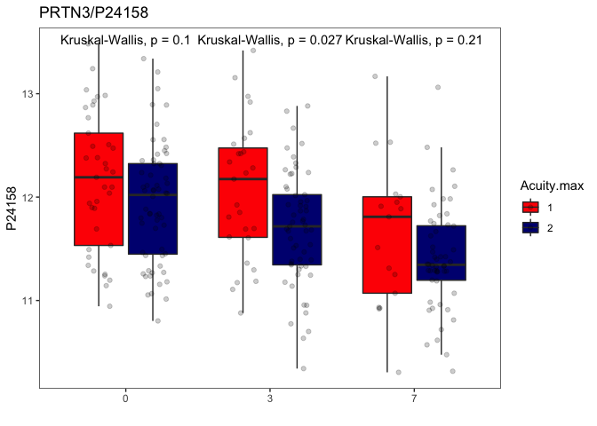

``` r
ggplot(as.data.frame(somalogic[somalogic$COVID == "Positive",colnames(somalogic) %in% c("cluster_neuhi",id)]), aes_string(x = "cluster_neuhi", y = id, fill = "cluster_neuhi")) + theme_bw() + geom_boxplot(outlier.shape = NA) + xlab("") + theme(legend.position = "none", panel.grid = element_blank()) + geom_jitter(fill = "black", pch = 21, width = 0.2, alpha = 0.2) + ggtitle(paste0(poi,"/",id)) + stat_compare_means() + scale_fill_manual(values = c(orange, skyblue, bluishgreen, yellow, blue, vermillion, "#bd6bd9"))
```

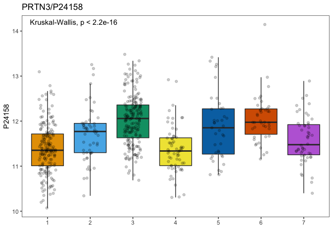

``` r
id <- UniProt_Symbol$UniProtID[which(UniProt_Symbol$Gene == poi)]
ggplot(as.data.frame(somalogic[somalogic$day == "0" & somalogic$COVID == "Positive",colnames(somalogic) %in% c("cluster_neuhi",id)]), aes_string(x = "cluster_neuhi", y = id, fill = "cluster_neuhi")) + theme_bw() + geom_boxplot(outlier.shape = NA) + xlab("") + theme(legend.position = "none", panel.grid = element_blank()) + geom_jitter(fill = "black", pch = 21, width = 0.2, alpha = 0.2) + ggtitle(paste0("D0 ",poi,"/",id)) + stat_compare_means() + scale_fill_manual(values = c(orange, skyblue, bluishgreen, yellow, blue, vermillion, "#bd6bd9"))
```


``` r
ggplot(as.data.frame(somalogic[somalogic$day == "3" & somalogic$COVID == "Positive",colnames(somalogic) %in% c("cluster_neuhi",id)]), aes_string(x = "cluster_neuhi", y = id, fill = "cluster_neuhi")) + theme_bw() + geom_boxplot(outlier.shape = NA) + xlab("") + theme(legend.position = "none", panel.grid = element_blank()) + geom_jitter(fill = "black", pch = 21, width = 0.2, alpha = 0.2) + ggtitle(paste0("D3 ",poi,"/",id)) + stat_compare_means() + scale_fill_manual(values = c(orange, skyblue, bluishgreen, yellow, blue, vermillion, "#bd6bd9"))
```

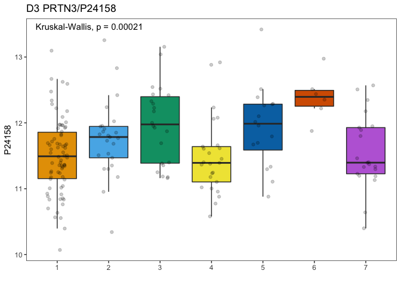

``` r
ggplot(as.data.frame(somalogic[somalogic$day == "7" & somalogic$COVID == "Positive",colnames(somalogic) %in% c("cluster_neuhi",id)]), aes_string(x = "cluster_neuhi", y = id, fill = "cluster_neuhi")) + theme_bw() + geom_boxplot(outlier.shape = NA) + xlab("") + theme(legend.position = "none", panel.grid = element_blank()) + geom_jitter(fill = "black", pch = 21, width = 0.2, alpha = 0.2) + ggtitle(paste0("D7 ",poi,"/",id)) + stat_compare_means() + scale_fill_manual(values = c(orange, skyblue, bluishgreen, yellow, blue, vermillion, "#bd6bd9"))
```

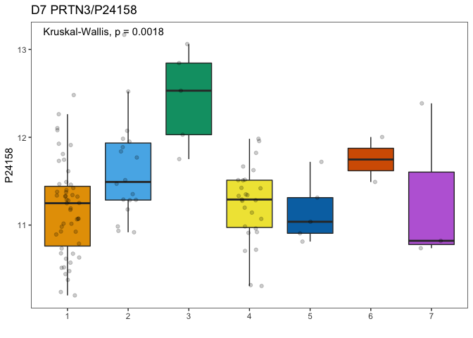

``` r
somalogic$REACTOME_NEUTROPHIL_DEGRANULATION <- as.numeric(somalogic$REACTOME_NEUTROPHIL_DEGRANULATION)
id <- UniProt_Symbol$UniProtID[which(UniProt_Symbol$Gene == poi)]
ggplot(as.data.frame(somalogic[,colnames(somalogic) %in% c("cluster_neuhi",id,"REACTOME_NEUTROPHIL_DEGRANULATION")]), aes_string(x = "REACTOME_NEUTROPHIL_DEGRANULATION", y = id)) + theme_bw() + geom_point() + theme(legend.position = "none", panel.grid = element_blank()) + ggtitle(paste0(poi,"/",id)) + geom_smooth(method = "lm")
```

    ## `geom_smooth()` using formula 'y ~ x'

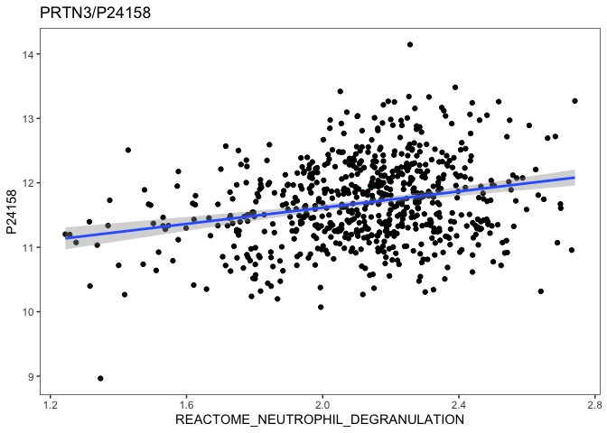

``` r
somalogic_hugo$PROTEIN_REACTOME_NEUTROPHIL_DEGRANULATION <- rowMeans(apply(somalogic_hugo[,colnames(somalogic_hugo) %in% gmt.file$REACTOME_NEUTROPHIL_DEGRANULATION],2,scale))
somalogic_hugo$REACTOME_NEUTROPHIL_DEGRANULATION <- as.numeric(somalogic_hugo$REACTOME_NEUTROPHIL_DEGRANULATION)
tmp_ct <- cor.test(somalogic_hugo$REACTOME_NEUTROPHIL_DEGRANULATION,somalogic_hugo$PROTEIN_REACTOME_NEUTROPHIL_DEGRANULATION,method="spearman")
tmp_ct_label <- paste0("rho=",round(tmp_ct$estimate,digits=2)," p=",signif(tmp_ct$p.value,digits=2))
ggplot(as.data.frame(somalogic_hugo), aes(x=REACTOME_NEUTROPHIL_DEGRANULATION,y=PROTEIN_REACTOME_NEUTROPHIL_DEGRANULATION)) + theme_bw() + geom_point() + theme(legend.position = "none", panel.grid = element_blank()) + geom_smooth(method = "lm") + annotate(geom="text",x=2.4,y=0.75,label=tmp_ct_label)
```

    ## `geom_smooth()` using formula 'y ~ x'

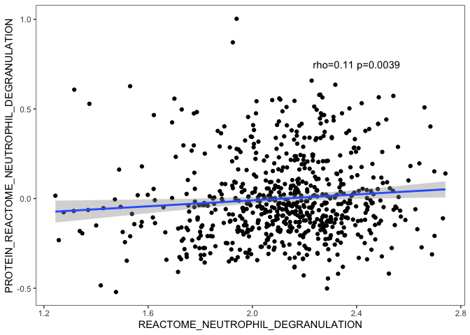

``` r
ggplot(as.data.frame(somalogic_hugo[somalogic_hugo$COVID == "Positive" & somalogic_hugo$day %in% c("0","3","7") & somalogic_hugo$severity.max == "severe",]), aes(x = day, y = PROTEIN_REACTOME_NEUTROPHIL_DEGRANULATION, fill = Acuity.max)) + theme_bw() + geom_boxplot(outlier.shape = NA) + xlab("") + theme(panel.grid = element_blank()) + geom_point(aes(colour = Acuity.max), position = position_jitterdodge(jitter.height = 0, jitter.width = 0.2), fill = "black", pch = 19, alpha = 0.2) + stat_compare_means(size=3.5) + scale_fill_manual(values = c("red","navy")) + scale_colour_manual(values = c("black","black"))
```


``` r
ggplot(as.data.frame(somalogic_hugo[somalogic_hugo$COVID == "Positive",]), aes(x=cluster_neuhi,y = PROTEIN_REACTOME_NEUTROPHIL_DEGRANULATION, fill = cluster_neuhi)) + theme_bw() + geom_boxplot(outlier.shape = NA) + xlab("") + theme(legend.position = "none", panel.grid = element_blank()) + geom_jitter(fill = "black", pch = 21, width = 0.2, alpha = 0.2) + stat_compare_means() + scale_fill_manual(values = c(orange, skyblue, bluishgreen, yellow, blue, vermillion, "#bd6bd9"))
```

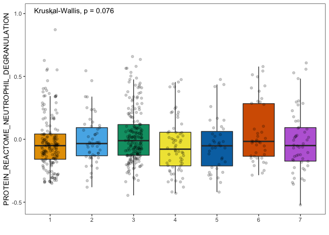

``` r
ggplot(as.data.frame(somalogic_hugo[somalogic_hugo$day == "0" & somalogic_hugo$COVID == "Positive",]), aes(x = cluster_neuhi, y = PROTEIN_REACTOME_NEUTROPHIL_DEGRANULATION, fill = cluster_neuhi)) + theme_bw() + geom_boxplot(outlier.shape = NA) + xlab("") + theme(legend.position = "none", panel.grid = element_blank()) + geom_jitter(fill = "black", pch = 21, width = 0.2, alpha = 0.2) + ggtitle("D0") + stat_compare_means() + scale_fill_manual(values = c(orange, skyblue, bluishgreen, yellow, blue, vermillion, "#bd6bd9"))
```

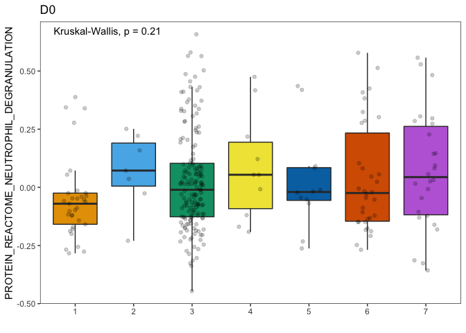

``` r
ggplot(as.data.frame(somalogic_hugo[somalogic_hugo$day == "3" & somalogic_hugo$COVID == "Positive",]), aes(x = cluster_neuhi, y = PROTEIN_REACTOME_NEUTROPHIL_DEGRANULATION, fill = cluster_neuhi)) + theme_bw() + geom_boxplot(outlier.shape = NA) + xlab("") + theme(legend.position = "none", panel.grid = element_blank()) + geom_jitter(fill = "black", pch = 21, width = 0.2, alpha = 0.2) + ggtitle("D3") + stat_compare_means() + scale_fill_manual(values = c(orange, skyblue, bluishgreen, yellow, blue, vermillion, "#bd6bd9"))
```

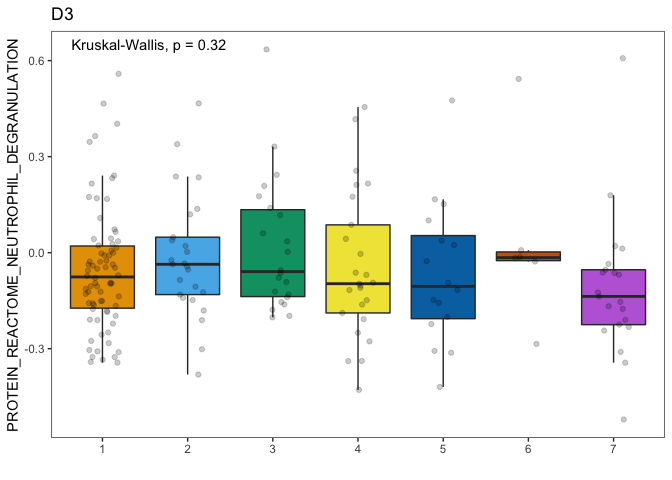

``` r
ggplot(as.data.frame(somalogic_hugo[somalogic_hugo$day == "7" & somalogic_hugo$COVID == "Positive",]), aes(x = cluster_neuhi, y = PROTEIN_REACTOME_NEUTROPHIL_DEGRANULATION, fill = cluster_neuhi)) + theme_bw() + geom_boxplot(outlier.shape = NA) + xlab("") + theme(legend.position = "none", panel.grid = element_blank()) + geom_jitter(fill = "black", pch = 21, width = 0.2, alpha = 0.2) + ggtitle("D7") + stat_compare_means() + scale_fill_manual(values = c(orange, skyblue, bluishgreen, yellow, blue, vermillion, "#bd6bd9"))
```

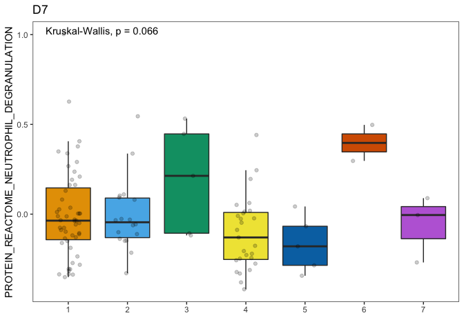

``` r
somalogic_hugo$PROTEIN_GO_AZUROPHIL_GRANULE <- rowMeans(apply(somalogic_hugo[,colnames(somalogic_hugo) %in% gmt.file$GO_AZUROPHIL_GRANULE],2,scale))
ggplot(as.data.frame(somalogic_hugo), aes(x=as.numeric(GO_AZUROPHIL_GRANULE),y=PROTEIN_GO_AZUROPHIL_GRANULE)) + theme_bw() + geom_point() + theme(legend.position = "none", panel.grid = element_blank()) + geom_smooth(method = "lm")
```

    ## `geom_smooth()` using formula 'y ~ x'

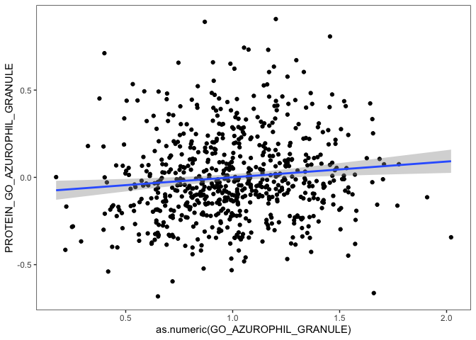

``` r
somalogic_hugo$PROTEIN_GO_SPECIFIC_GRANULE <- rowMeans(apply(somalogic_hugo[,colnames(somalogic_hugo) %in% gmt.file$GO_SPECIFIC_GRANULE],2,scale))
ggplot(as.data.frame(somalogic_hugo), aes(x=as.numeric(GO_SPECIFIC_GRANULE),y=PROTEIN_GO_SPECIFIC_GRANULE)) + theme_bw() + geom_point() + theme(legend.position = "none", panel.grid = element_blank()) + geom_smooth(method = "lm")
```

    ## `geom_smooth()` using formula 'y ~ x'

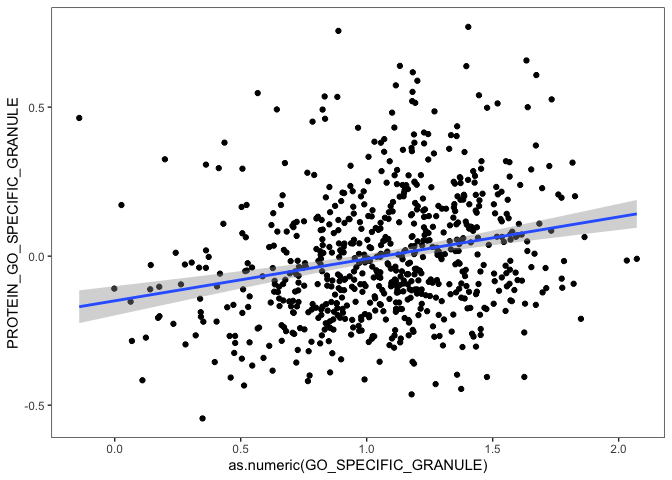

``` r
somalogic_hugo$PROTEIN_GO_TERTIARY_GRANULE <- rowMeans(apply(somalogic_hugo[,colnames(somalogic_hugo) %in% gmt.file$GO_TERTIARY_GRANULE],2,scale))
ggplot(as.data.frame(somalogic_hugo), aes(x=as.numeric(GO_TERTIARY_GRANULE),y=PROTEIN_GO_TERTIARY_GRANULE)) + theme_bw() + geom_point() + theme(legend.position = "none", panel.grid = element_blank()) + geom_smooth(method = "lm")
```

    ## `geom_smooth()` using formula 'y ~ x'

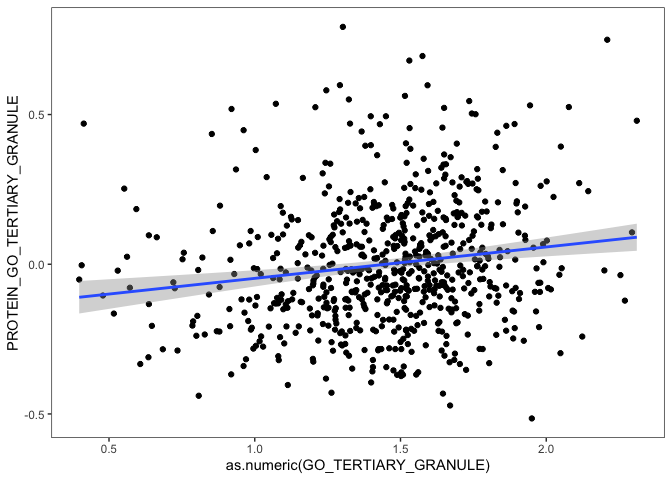

``` r
ggplot(as.data.frame(somalogic_hugo), aes(x=as.numeric(REACTOME_NEUTROPHIL_DEGRANULATION),y=scale(CTSG))) + theme_bw() + geom_point() + theme(legend.position = "none", panel.grid = element_blank()) + geom_smooth(method = "lm")
```

    ## `geom_smooth()` using formula 'y ~ x'

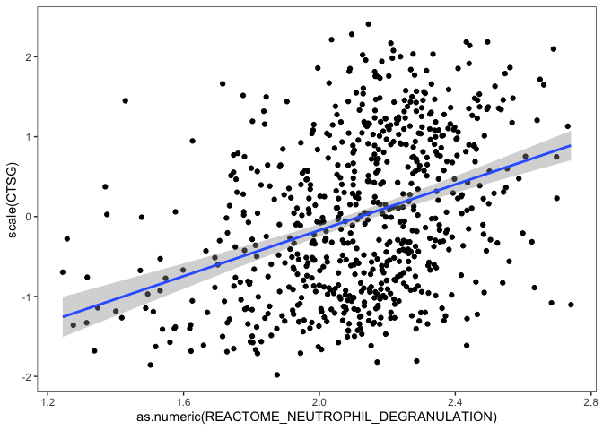

``` r
ggplot(as.data.frame(somalogic_hugo), aes(x=as.numeric(GO_AZUROPHIL_GRANULE),y=scale(CTSG))) + theme_bw() + geom_point() + theme(legend.position = "none", panel.grid = element_blank()) + geom_smooth(method = "lm")
```

    ## `geom_smooth()` using formula 'y ~ x'

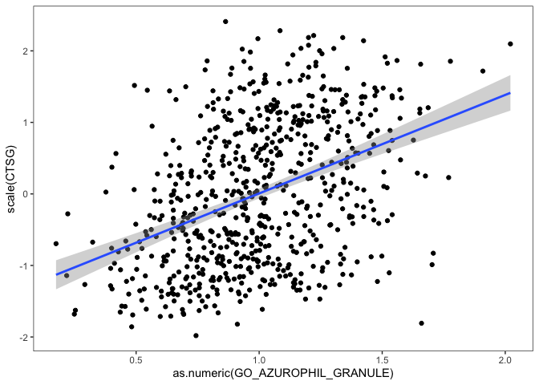

``` r
ggplot(as.data.frame(somalogic_hugo), aes(x=as.numeric(REACTOME_NEUTROPHIL_DEGRANULATION),y=scale(ELANE))) + theme_bw() + geom_point() + theme(legend.position = "none", panel.grid = element_blank()) + geom_smooth(method = "lm")
```

    ## `geom_smooth()` using formula 'y ~ x'

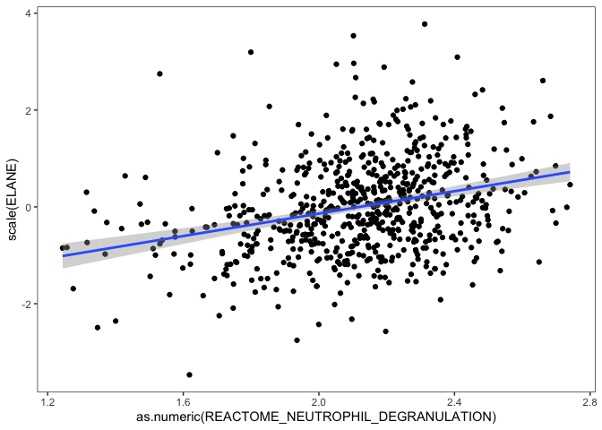

``` r
ggplot(as.data.frame(somalogic_hugo), aes(x=as.numeric(GO_AZUROPHIL_GRANULE),y=scale(ELANE))) + theme_bw() + geom_point() + theme(legend.position = "none", panel.grid = element_blank()) + geom_smooth(method = "lm")
```

    ## `geom_smooth()` using formula 'y ~ x'


``` r
ggplot(as.data.frame(somalogic_hugo), aes(x=as.numeric(REACTOME_NEUTROPHIL_DEGRANULATION),y=scale(LCN2))) + theme_bw() + geom_point() + theme(legend.position = "none", panel.grid = element_blank()) + geom_smooth(method = "lm")
```

    ## `geom_smooth()` using formula 'y ~ x'

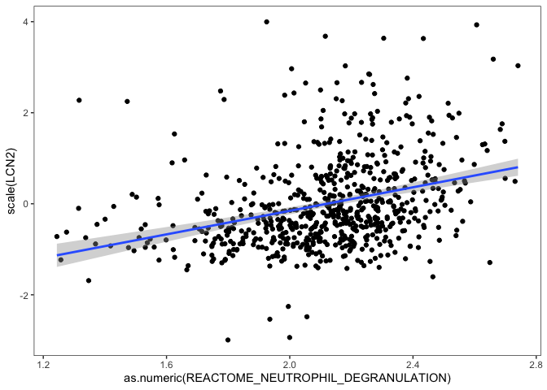

``` r
ggplot(as.data.frame(somalogic_hugo), aes(x=as.numeric(GO_TERTIARY_GRANULE),y=scale(LCN2))) + theme_bw() + geom_point() + theme(legend.position = "none", panel.grid = element_blank()) + geom_smooth(method = "lm")
```

    ## `geom_smooth()` using formula 'y ~ x'

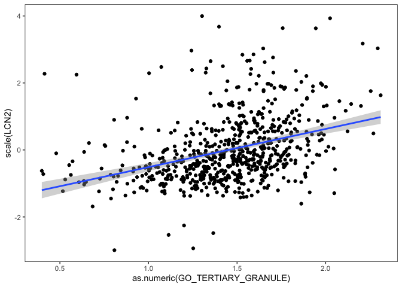

``` r
ggplot(as.data.frame(somalogic_hugo), aes(x=as.numeric(REACTOME_NEUTROPHIL_DEGRANULATION),y=scale(PRTN3))) + theme_bw() + geom_point() + theme(legend.position = "none", panel.grid = element_blank()) + geom_smooth(method = "lm")
```

    ## `geom_smooth()` using formula 'y ~ x'

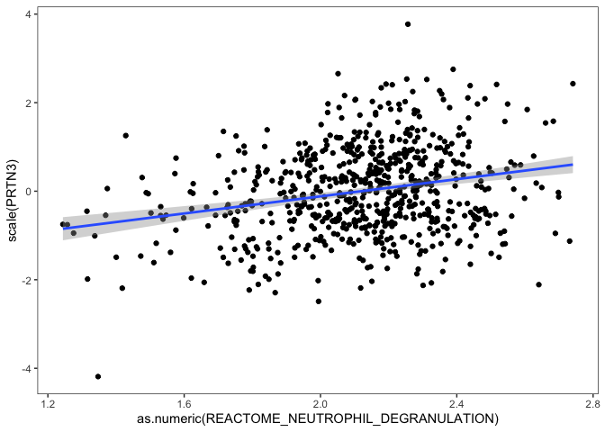

``` r
ggplot(as.data.frame(somalogic_hugo), aes(x=as.numeric(GO_AZUROPHIL_GRANULE),y=scale(PRTN3))) + theme_bw() + geom_point() + theme(legend.position = "none", panel.grid = element_blank()) + geom_smooth(method = "lm")
```

    ## `geom_smooth()` using formula 'y ~ x'

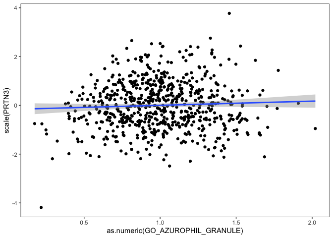

``` r
ggplot(as.data.frame(somalogic_hugo), aes(x=as.numeric(REACTOME_NEUTROPHIL_DEGRANULATION),y=scale(LTF))) + theme_bw() + geom_point() + theme(legend.position = "none", panel.grid = element_blank()) + geom_smooth(method = "lm")
```

    ## `geom_smooth()` using formula 'y ~ x'

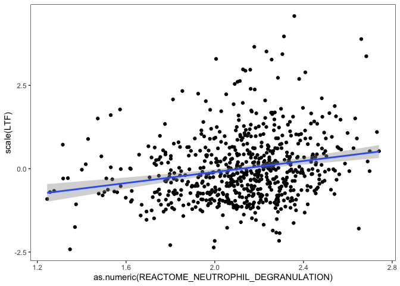

``` r
ggplot(as.data.frame(somalogic_hugo), aes(x=as.numeric(GO_SPECIFIC_GRANULE),y=scale(LTF))) + theme_bw() + geom_point() + theme(legend.position = "none", panel.grid = element_blank()) + geom_smooth(method = "lm")
```

    ## `geom_smooth()` using formula 'y ~ x'

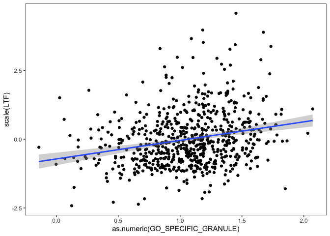

``` r
metadata_temp <- read.xlsx(paste0(prefix,"Tables/TableS1.xlsx"), sheet = 2)
metadata_temp$nmf.0 <- NA
metadata_temp$nmf.3 <- NA
metadata_temp$nmf.7 <- NA
metadata_temp$nmf.E <- NA

for (i in 1:nrow(metadata_temp)){
  patient <- metadata_temp$Public.ID[i]
  temp <- metadata_filtered[metadata_filtered$Public.ID == patient,]
  if (nrow(temp) >= 1){
    temp0 <- temp[temp$Day == "D0",]
    if (nrow(temp0) == 1){
      metadata_temp$nmf.0[i] <- temp0$cluster_neuhi[1]
    }
    temp3 <- temp[temp$Day == "D3",]
    if (nrow(temp3) == 1){
      metadata_temp$nmf.3[i] <- temp3$cluster_neuhi[1]
    }
    temp7 <- temp[temp$Day == "D7",]
    if (nrow(temp7) == 1){
      metadata_temp$nmf.7[i] <- temp7$cluster_neuhi[1]
    }
    tempE <- temp[temp$Day == "DE",]
    if (nrow(tempE) == 1){
      metadata_temp$nmf.E[i] <- tempE$cluster_neuhi[1]
    }
  }
}

metadata_completecases <- metadata_temp[complete.cases(metadata_temp$nmf.0),]
metadata_completecases <- metadata_completecases[complete.cases(metadata_completecases$nmf.3),]
metadata_completecases <- metadata_completecases[complete.cases(metadata_completecases$nmf.7),]
```

### CitH3 ELISA

``` r
library(dr4pl)
elisa_long <- read.xlsx(paste0(prefix,"CitH3_ELISA.xlsx"), sheet = 1)
#elisa_long <- read.xlsx("~/Desktop/Follow_Up_Experiments.xlsx",sheet = 2)

standards_p1 <- elisa_long[elisa_long$severity.max == "Standard" & elisa_long$plate == "P1",]
elisa_p1 <- elisa_long[elisa_long$severity.max != "Standard" & elisa_long$plate == "P1",]

a <- dr4pl(dose = as.numeric(standards_p1[standards_p1$Day != "",]$absorbance450),
            response = standards_p1[standards_p1$Day != "",]$concentration,
            method.init = "logistic")
plot(a)
```

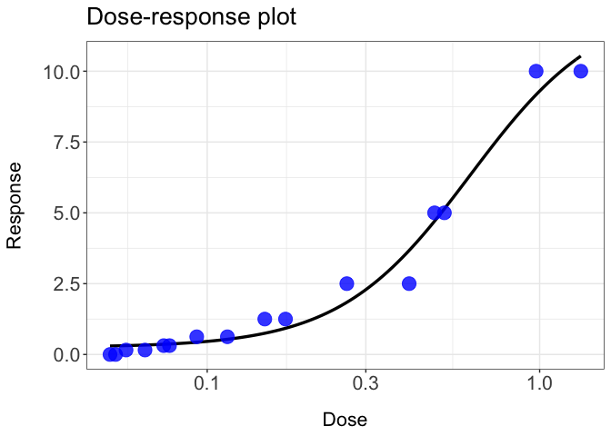

``` r
conversion <- function(ab) {
  th1 <- a$parameters[1]
  th2 <- a$parameters[2]
  th3 <- a$parameters[3]
  th4 <- a$parameters[4]
  conc <- th1+(th4-th1)/(1+(ab/th2)^th3)
  return(conc)
}

for (i in 1:nrow(elisa_p1)){
  elisa_p1$CitH3[i] <- conversion(elisa_p1$absorbance450[i])
}
elisa_p1$CitH3 <- elisa_p1$CitH3 * 9 #Samples were diluted 1:2 for the ELISA

for (i in 1:nrow(standards_p1)){
  standards_p1$CitH3[i] <- conversion(standards_p1$absorbance450[i])
}

elisa_p1 <- rbind(elisa_p1,standards_p1)
elisa_p1$CitH3 <- elisa_p1$CitH3 - mean(elisa_p1$CitH3[elisa_p1$Day == "S8"])

standards_p2 <- elisa_long[elisa_long$severity.max == "Standard" & elisa_long$plate == "P2",]
elisa_p2 <- elisa_long[elisa_long$severity.max != "Standard" & elisa_long$plate == "P2",]

a <- dr4pl(dose = as.numeric(standards_p2[standards_p2$Day != "",]$absorbance450),
            response = standards_p2[standards_p2$Day != "",]$concentration,
            method.init = "logistic")
plot(a)
```

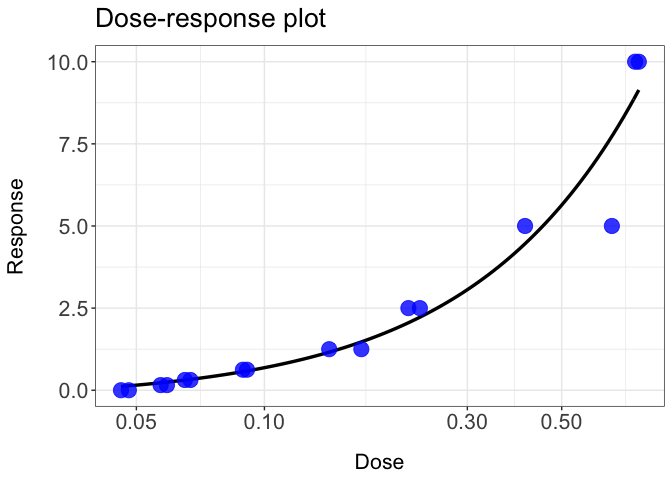

``` r
conversion <- function(ab) {
  th1 <- a$parameters[1]
  th2 <- a$parameters[2]
  th3 <- a$parameters[3]
  th4 <- a$parameters[4]
  conc <- th1+(th4-th1)/(1+(ab/th2)^th3)
  return(conc)
}

for (i in 1:nrow(elisa_p2)){
  elisa_p2$CitH3[i] <- conversion(elisa_p2$absorbance450[i])
}
elisa_p2$CitH3 <- elisa_p2$CitH3 * 9 #Samples were diluted 1:2 for the ELISA

for (i in 1:nrow(standards_p2)){
  standards_p2$CitH3[i] <- conversion(standards_p2$absorbance450[i])
}

elisa_p2 <- rbind(elisa_p2,standards_p2)
elisa_p2$CitH3 <- elisa_p2$CitH3 - mean(elisa_p2$CitH3[elisa_p2$Day == "S8"])

standards_p3 <- elisa_long[elisa_long$severity.max == "Standard" & elisa_long$plate == "P3",]
elisa_p3 <- elisa_long[elisa_long$severity.max != "Standard" & elisa_long$plate == "P3",]

a <- dr4pl(dose = as.numeric(standards_p3[standards_p3$Day != "",]$absorbance450),
            response = standards_p3[standards_p3$Day != "",]$concentration,
            method.init = "logistic")
plot(a)
```

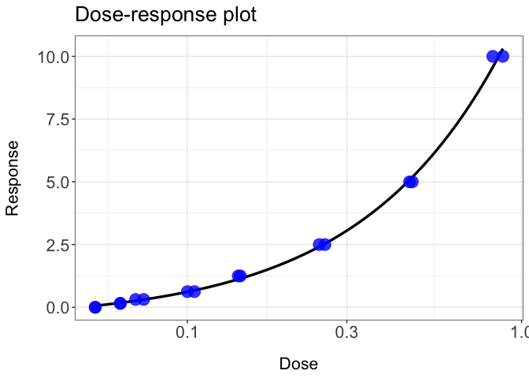

``` r
conversion <- function(ab) {
  th1 <- a$parameters[1]
  th2 <- a$parameters[2]
  th3 <- a$parameters[3]
  th4 <- a$parameters[4]
  conc <- th1+(th4-th1)/(1+(ab/th2)^th3)
  return(conc)
}

for (i in 1:nrow(elisa_p3)){
  elisa_p3$CitH3[i] <- conversion(elisa_p3$absorbance450[i])
}
elisa_p3$CitH3 <- elisa_p3$CitH3 * 9 #Samples were diluted 1:2 for the ELISA

for (i in 1:nrow(standards_p3)){
  standards_p3$CitH3[i] <- conversion(standards_p3$absorbance450[i])
}

elisa_p3 <- rbind(elisa_p3,standards_p3)
elisa_p3$CitH3 <- elisa_p3$CitH3 - mean(elisa_p3$CitH3[elisa_p3$Day == "S8"])

elisa_res <- rbind(elisa_p1,elisa_p2,elisa_p3)
```

``` r
my.cols <- brewer.pal(3,"RdBu")
ggplot(elisa_res[elisa_res$Day %in% c("H","D0","D3","D7"),], aes(x = factor(plate), y = as.numeric(CitH3), fill = factor(plate))) + geom_boxplot(outlier.shape = NA) + geom_point(position = position_jitterdodge()) + theme_bw() + stat_compare_means() + ylab("CitH3 Concentration") + xlab("Plate") + scale_y_log10()
```

    ## Warning in self$trans$transform(x): NaNs produced

    ## Warning: Transformation introduced infinite values in continuous y-axis

    ## Warning in self$trans$transform(x): NaNs produced

    ## Warning: Transformation introduced infinite values in continuous y-axis

    ## Warning in self$trans$transform(x): NaNs produced

    ## Warning: Transformation introduced infinite values in continuous y-axis

    ## Warning: Removed 1 rows containing non-finite values (stat_boxplot).

    ## Warning: Removed 1 rows containing non-finite values (stat_compare_means).

    ## Warning: Removed 1 rows containing missing values (geom_point).

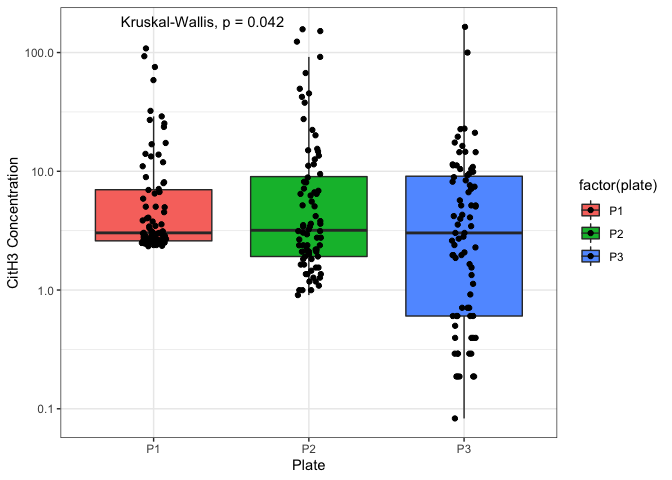

``` r
my.cols <- brewer.pal(3,"RdBu")
ggplot(elisa_res[elisa_res$severity.max == "Standard",], aes(x = factor(plate), y = as.numeric(CitH3), fill = factor(plate))) + geom_boxplot(outlier.shape = NA) + geom_point(position = position_jitterdodge()) + theme_bw() + stat_compare_means() + ylab("CitH3 Concentration") + xlab("Plate") + scale_y_log10()
```

    ## Warning in self$trans$transform(x): NaNs produced

    ## Warning: Transformation introduced infinite values in continuous y-axis

    ## Warning in self$trans$transform(x): NaNs produced

    ## Warning: Transformation introduced infinite values in continuous y-axis

    ## Warning in self$trans$transform(x): NaNs produced

    ## Warning: Transformation introduced infinite values in continuous y-axis

    ## Warning: Removed 4 rows containing non-finite values (stat_boxplot).

    ## Warning: Removed 4 rows containing non-finite values (stat_compare_means).

    ## Warning: Removed 2 rows containing missing values (geom_point).

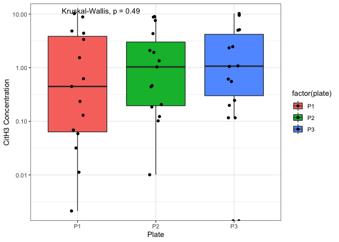

``` r
my.cols <- brewer.pal(3,"RdBu")
ggplot(elisa_res[elisa_res$severity.max == "Standard",], aes(x = factor(plate), y = as.numeric(CitH3))) + geom_boxplot(outlier.shape = NA, fill = "grey") + geom_point(aes(colour = Day), position = position_jitterdodge()) + theme_bw() + stat_compare_means() + ylab("CitH3 Concentration") + xlab("Plate")
```

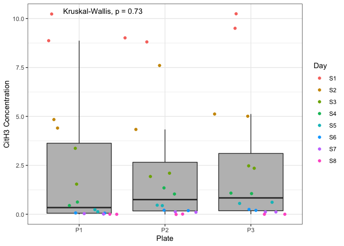

``` r
my.cols <- brewer.pal(3,"RdBu")
ggplot(elisa_res[elisa_res$severity.max == "Standard",], aes(x = factor(plate), y = as.numeric(CitH3))) + geom_boxplot(outlier.shape = NA, fill = "grey") + geom_point(aes(colour = Day), position = position_jitterdodge()) + theme_bw() + stat_compare_means() + ylab("CitH3 Concentration") + xlab("Plate") + scale_y_log10()
```

    ## Warning in self$trans$transform(x): NaNs produced

    ## Warning: Transformation introduced infinite values in continuous y-axis

    ## Warning in self$trans$transform(x): NaNs produced

    ## Warning: Transformation introduced infinite values in continuous y-axis

    ## Warning in self$trans$transform(x): NaNs produced

    ## Warning: Transformation introduced infinite values in continuous y-axis

    ## Warning: Removed 4 rows containing non-finite values (stat_boxplot).

    ## Warning: Removed 4 rows containing non-finite values (stat_compare_means).

    ## Warning: Removed 2 rows containing missing values (geom_point).

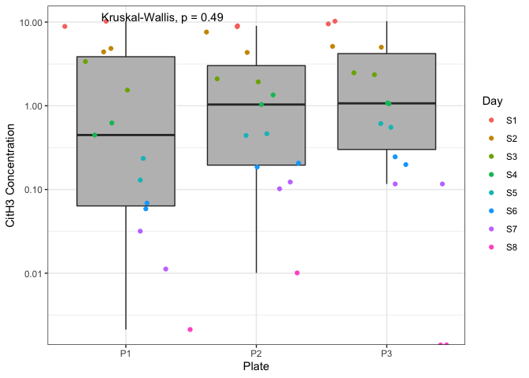

``` r
my.cols <- brewer.pal(3,"RdBu")
ggplot(elisa_res[elisa_res$severity.max == "Standard",], aes(x = factor(plate), y = as.numeric(absorbance450))) + geom_boxplot(outlier.shape = NA, fill = "grey") + geom_point(aes(colour = Day), position = position_jitterdodge()) + theme_bw() + stat_compare_means() + ylab("Absorbance 450") + xlab("Plate")
```

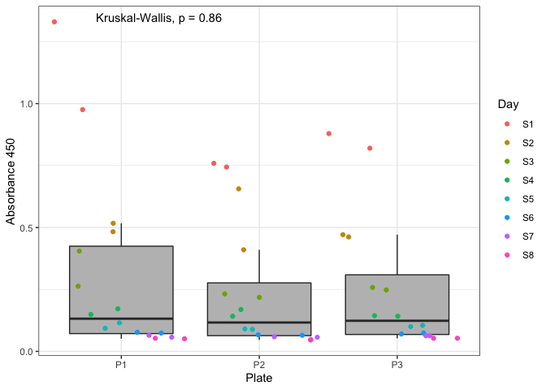

``` r
my.cols <- brewer.pal(3,"RdBu")
ggplot(elisa_res[elisa_res$severity.max == "Standard",], aes(x = factor(plate), y = as.numeric(absorbance450))) + geom_boxplot(outlier.shape = NA, fill = "grey") + geom_point(aes(colour = Day), position = position_jitterdodge()) + theme_bw() + stat_compare_means() + ylab("Absorbance 450") + xlab("Plate") + scale_y_log10()
```

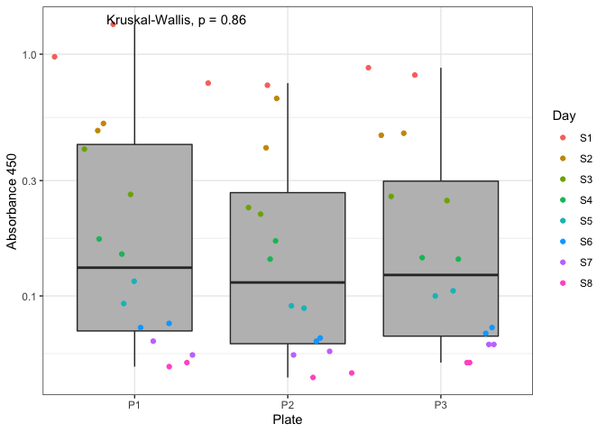

``` r
my.cols <- brewer.pal(3,"RdBu")
ggplot(elisa_res[elisa_res$Day %in% c("D0","D3","D7"),], aes(x = factor(Day), y = as.numeric(CitH3), fill = factor(severity.max))) + geom_boxplot(outlier.shape = NA) + geom_point(position = position_jitterdodge(), size = 0.5, alpha = 0.2) + theme_bw() + stat_compare_means() + ylab("CitH3 Concentration") + xlab("Day") + scale_fill_manual(values = c("green",my.cols[3],my.cols[1])) + scale_y_log10() + theme(legend.position = "none")
```

    ## Warning in self$trans$transform(x): NaNs produced

    ## Warning: Transformation introduced infinite values in continuous y-axis

    ## Warning in self$trans$transform(x): NaNs produced

    ## Warning: Transformation introduced infinite values in continuous y-axis

    ## Warning in self$trans$transform(x): NaNs produced

    ## Warning: Transformation introduced infinite values in continuous y-axis

    ## Warning: Removed 1 rows containing non-finite values (stat_boxplot).

    ## Warning: Removed 1 rows containing non-finite values (stat_compare_means).

    ## Warning: Removed 1 rows containing missing values (geom_point).

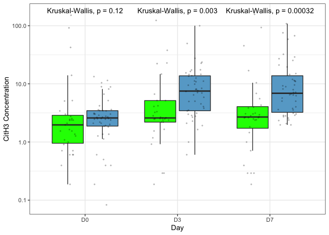

``` r
my.cols <- brewer.pal(3,"RdBu")
ggplot(elisa_res[elisa_res$Day %in% c("D0","D3","D7","H") & elisa_res$plate == "P1",], aes(x = factor(Day), y = as.numeric(CitH3), fill = factor(severity.max))) + geom_boxplot(outlier.shape = NA) + geom_point(position = position_jitterdodge()) + theme_bw() + stat_compare_means() + ylab("CitH3 Concentration") + xlab("Day") + scale_fill_manual(values = c(my.cols[3],my.cols[1],"green"))
```

    ## Registered S3 method overwritten by 'cli':
    ##   method     from         
    ##   print.boxx spatstat.geom

    ## Warning: Computation failed in `stat_compare_means()`:
    ## Problem with `mutate()` column `p`.
    ## ℹ `p = purrr::map(...)`.
    ## x all observations are in the same group

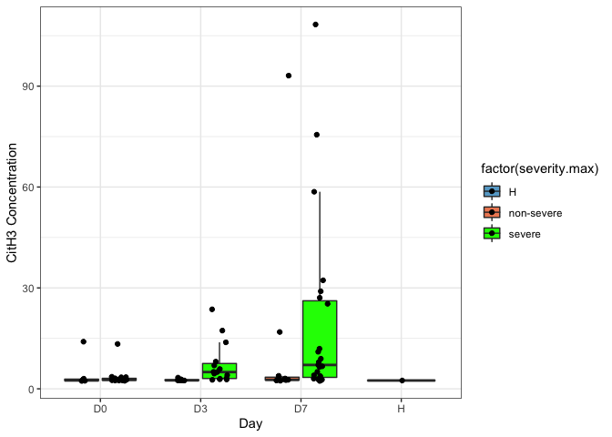

``` r
ggplot(elisa_res[elisa_res$Day %in% c("D0","D3","D7","H") & elisa_res$plate == "P2",], aes(x = factor(Day), y = as.numeric(CitH3), fill = factor(severity.max))) + geom_boxplot(outlier.shape = NA) + geom_point(position = position_jitterdodge()) + theme_bw() + stat_compare_means() + ylab("CitH3 Concentration") + xlab("Day") + scale_fill_manual(values = c(my.cols[3],my.cols[1],"green"))
```

    ## Warning: Computation failed in `stat_compare_means()`:
    ## Problem with `mutate()` column `p`.
    ## ℹ `p = purrr::map(...)`.
    ## x all observations are in the same group

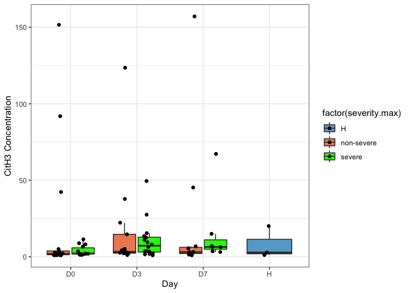

``` r
ggplot(elisa_res[elisa_res$Day %in% c("D0","D3","D7","H") & elisa_res$plate == "P3",], aes(x = factor(Day), y = as.numeric(CitH3), fill = factor(severity.max))) + geom_boxplot(outlier.shape = NA) + geom_point(position = position_jitterdodge()) + theme_bw() + stat_compare_means() + ylab("CitH3 Concentration") + xlab("Day") + scale_fill_manual(values = c(my.cols[3],my.cols[1],"green"))
```

    ## Warning: Computation failed in `stat_compare_means()`:
    ## Problem with `mutate()` column `p`.
    ## ℹ `p = purrr::map(...)`.
    ## x all observations are in the same group

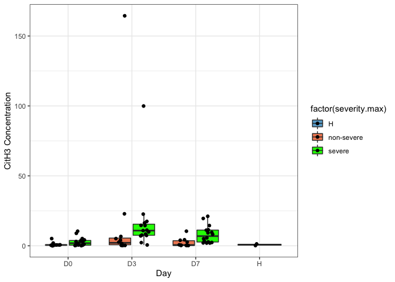

``` r
my.cols <- brewer.pal(3,"RdBu")
p <- ggplot(elisa_res[elisa_res$Day %in% c("D0","D3","D7"),], aes(x = factor(Day), y = as.numeric(CitH3), fill = factor(Acuity.max, levels = c("4","3","2","1")))) + geom_boxplot(outlier.shape = NA) + geom_point(position = position_jitterdodge(), size = 0.5) + theme_bw() + stat_compare_means() + ylab("CitH3 Concentration") + xlab("Day") + scale_fill_manual(values = rev(c("red",my.cols[1],blue,"purple"))) + scale_y_log10()
p$labels$fill <- "Acuity.max"
p
```

    ## Warning in self$trans$transform(x): NaNs produced

    ## Warning: Transformation introduced infinite values in continuous y-axis

    ## Warning in self$trans$transform(x): NaNs produced

    ## Warning: Transformation introduced infinite values in continuous y-axis

    ## Warning in self$trans$transform(x): NaNs produced

    ## Warning: Transformation introduced infinite values in continuous y-axis

    ## Warning: Removed 1 rows containing non-finite values (stat_boxplot).

    ## Warning: Removed 1 rows containing non-finite values (stat_compare_means).

    ## Warning: Removed 1 rows containing missing values (geom_point).

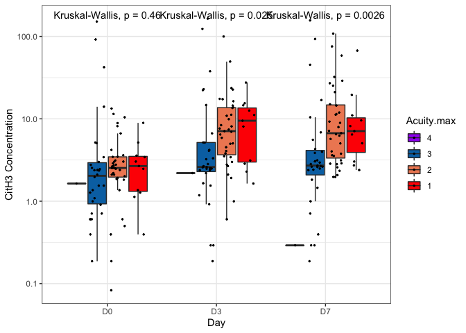

``` r
my.cols <- brewer.pal(3,"RdBu")
ggplot(elisa_res[elisa_res$Day %in% c("D0","D3","D7"),], aes(x = factor(cluster_neuhi), y = as.numeric(CitH3), fill = factor(cluster_neuhi))) + geom_boxplot(outlier.shape = NA) + geom_point(position = position_jitterdodge(jitter.width = 1.5), size = 0.5, alpha = 0.2) + theme_bw() + stat_compare_means() + ylab("CitH3 Concentration") + xlab("NMF") + scale_fill_manual(values = c(orange,skyblue,bluishgreen,yellow,blue,vermillion,"purple")) + scale_y_log10()
```

    ## Warning in self$trans$transform(x): NaNs produced

    ## Warning: Transformation introduced infinite values in continuous y-axis

    ## Warning in self$trans$transform(x): NaNs produced

    ## Warning: Transformation introduced infinite values in continuous y-axis

    ## Warning in self$trans$transform(x): NaNs produced

    ## Warning: Transformation introduced infinite values in continuous y-axis

    ## Warning: Removed 1 rows containing non-finite values (stat_boxplot).

    ## Warning: Removed 1 rows containing non-finite values (stat_compare_means).

    ## Warning: Removed 1 rows containing missing values (geom_point).

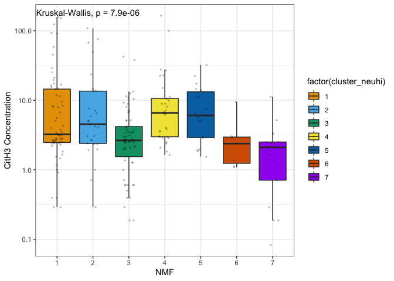

``` r
ggplot(elisa_res[elisa_res$Day %in% c("D0"),], aes(x = factor(cluster_neuhi), y = as.numeric(CitH3), fill = factor(cluster_neuhi))) + geom_boxplot(outlier.shape = NA) + geom_point(position = position_jitterdodge()) + theme_bw() + stat_compare_means() + ylab("CitH3 Concentration") + xlab("Day") + scale_fill_manual(values = c(orange,skyblue,bluishgreen,yellow,blue,vermillion,"purple"))
```

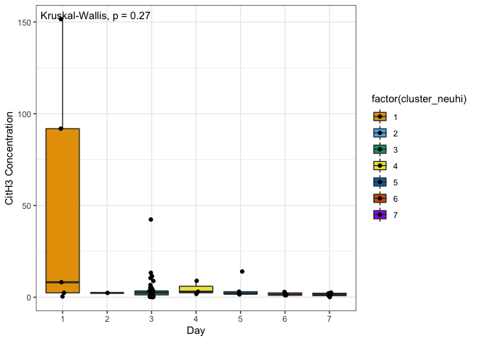

``` r
ggplot(elisa_res[elisa_res$Day %in% c("D3"),], aes(x = factor(cluster_neuhi), y = as.numeric(CitH3), fill = factor(cluster_neuhi))) + geom_boxplot(outlier.shape = NA) + geom_point(position = position_jitterdodge()) + theme_bw() + stat_compare_means() + ylab("CitH3 Concentration") + xlab("Day") + scale_fill_manual(values = c(orange,skyblue,bluishgreen,yellow,blue,vermillion,"purple"))
```

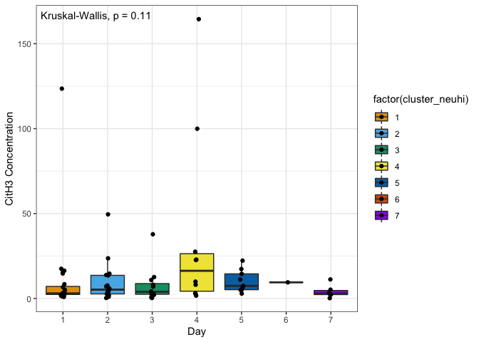

``` r
ggplot(elisa_res[elisa_res$Day %in% c("D7"),], aes(x = factor(cluster_neuhi), y = as.numeric(CitH3), fill = factor(cluster_neuhi))) + geom_boxplot(outlier.shape = NA) + geom_point(position = position_jitterdodge()) + theme_bw() + stat_compare_means() + ylab("CitH3 Concentration") + xlab("Day") + scale_fill_manual(values = c(orange,skyblue,bluishgreen,yellow,blue,vermillion,"purple"))
```

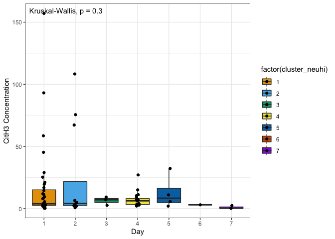

``` r
elisa_res_cov <- elisa_res[elisa_res$Public.Sample.ID %in% somalogic$Public.Sample.ID,]
elisa_res_cov_netosis <- merge(elisa_res_cov,somalogic[,c("Public.Sample.ID","NETosis","NETosis_Mukhopadhyay")],all.x=TRUE,by="Public.Sample.ID")
elisa_res_cov_netosis$NETosis <- as.numeric(elisa_res_cov_netosis$NETosis)
tmp_ct2 <- cor.test(elisa_res_cov_netosis$NETosis[as.numeric(elisa_res_cov_netosis$CitH3)>0],log10(as.numeric(elisa_res_cov_netosis$CitH3)[as.numeric(elisa_res_cov_netosis$CitH3)>0]),method="spearman")
```

    ## Warning in
    ## cor.test.default(elisa_res_cov_netosis$NETosis[as.numeric(elisa_res_cov_netosis$CitH3)
    ## > : Cannot compute exact p-value with ties

``` r
tmp_ct2_lab <- paste0("rho=",round(tmp_ct2$estimate,2)," p=",signif(tmp_ct2$p.value,3))
ggplot(elisa_res_cov_netosis[elisa_res_cov_netosis$Day %in% c("D0","D3","D7"),], aes(x = as.numeric(NETosis), y = as.numeric(CitH3))) + geom_point() + geom_smooth(method="lm") + theme_bw() + ylab("CitH3 Concentration") + xlab("RNA-Seq NETosis metagene") + scale_y_log10() + annotate(geom="text",x=-0.5,y=100,label=tmp_ct2_lab)
```

    ## Warning in self$trans$transform(x): NaNs produced

    ## Warning: Transformation introduced infinite values in continuous y-axis

    ## Warning in self$trans$transform(x): NaNs produced

    ## Warning: Transformation introduced infinite values in continuous y-axis

    ## `geom_smooth()` using formula 'y ~ x'

    ## Warning: Removed 1 rows containing non-finite values (stat_smooth).

    ## Warning: Removed 1 rows containing missing values (geom_point).

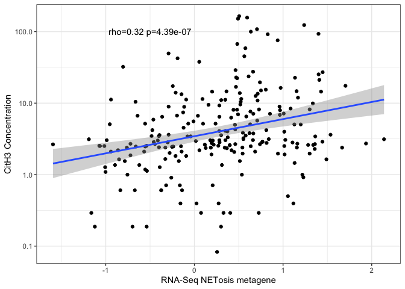

FCGR1A, FCGR1B, FCGR2A, FCGR2B, FCGR3A, FCGR3B, FCAR, FCGRT

``` r
metadata_long <- read.xlsx(paste0(prefix,"Tables/TableS1.xlsx"), sheet = 4)
qc_data <- read.xlsx(paste0(prefix,"Tables/TableS1.xlsx"), sheet = 9)
genomic_signatures <- read.xlsx(paste0(prefix,"Tables/TableS1.xlsx"), sheet = 10)
metadata_long <- metadata_long[which(metadata_long$Public.ID %in% qc_data$Public.ID),]
metadata_long <- merge(metadata_long, qc_data)
metadata_filtered <- metadata_long[metadata_long$percent.mt < 20 & metadata_long$Genes.Detected > 10000 & metadata_long$Median.Exon.CV < 1 & metadata_long$Exon.CV.MAD < 0.75 & metadata_long$Exonic.Rate*100 > 25 & metadata_long$Median.3..bias < 0.9,]
metadata_filtered <- merge(metadata_filtered, genomic_signatures)
metadata_filtered$Public.Sample.ID <- metadata_filtered$Public.Sample.ID
metadata_filtered$COVID <- mapvalues(metadata_filtered$COVID, from = c(0,1), to = c("Negative","Positive"))

genepc <- read.delim(paste0(prefix,"Ensembl_to_Symbol.txt"))
TPM <- read.xlsx(paste0(prefix,"Tables/TableS1.xlsx"), sheet = 8, rowNames = TRUE)
logTPM <- log2(TPM + 1)
logTPM_filtered <- logTPM[,colnames(logTPM) %in% rownames(metadata_filtered)]

Count <- read.table(gzfile(paste0(prefix,"Tables/Count_S1F.txt.gz")),sep="\t")
colnames(Count) <- Count[1,]
Count <- Count[-1,]
Count <- Count[,-2]
rownames(Count) <- Count[,1]
nams <- Count[,1]
Count <- Count[,-1]
Count <- as.data.frame(apply(Count,2,as.numeric))
rownames(Count) <- nams
TPM <- read.table(gzfile(paste0(prefix,"Tables/TPM_S1G.txt.gz")),sep="\t")
colnames(TPM) <- TPM[1,]
TPM <- TPM[-1,]
TPM <- TPM[,-2]
rownames(TPM) <- TPM[,1]
nams <- TPM[,1]
TPM <- TPM[,-1]
TPM <- as.data.frame(apply(TPM,2,as.numeric))
rownames(TPM) <- nams
logTPM <- log2(TPM + 1)
logTPM_filtered <- logTPM[,colnames(logTPM) %in% metadata_filtered$Public.Sample.ID]


gene <- "FCGR1A"
id <- genepc$Gene.stable.ID[which(genepc$Gene.name == gene)][1]
metadata_filtered$GOI <- t(logTPM_filtered[rownames(logTPM_filtered) == id,])
metadata_temp <- metadata_filtered[metadata_filtered$COVID == "Positive" & metadata_filtered$Day %in% c("D0","D3","D7"),]
my.cols <- brewer.pal(3, "RdBu")
p1 <- ggplot(metadata_temp, aes(x = factor(Day), y = as.numeric(GOI), fill = factor(severity.max))) + geom_boxplot(outlier.shape = NA) + geom_point(position = position_jitterdodge(), alpha = 0.2, size = 0.5) + theme_bw() + ylab("log2(TPM+1) Expression") + xlab("Day") + scale_fill_manual(values = my.cols[c(3,1)]) + stat_compare_means() + ggtitle(gene) + theme(legend.position = "none") + xlab("")

gene <- "FCGR1B"
id <- genepc$Gene.stable.ID[which(genepc$Gene.name == gene)][1]
metadata_filtered$GOI <- t(logTPM_filtered[rownames(logTPM_filtered) == id,])
metadata_temp <- metadata_filtered[metadata_filtered$COVID == "Positive" & metadata_filtered$Day %in% c("D0","D3","D7"),]
my.cols <- brewer.pal(3, "RdBu")
p2 <- ggplot(metadata_temp, aes(x = factor(Day), y = as.numeric(GOI), fill = factor(severity.max))) + geom_boxplot(outlier.shape = NA) + geom_point(position = position_jitterdodge(), alpha = 0.2, size = 0.5) + theme_bw() + ylab("log2(TPM+1) Expression") + xlab("Day") + scale_fill_manual(values = my.cols[c(3,1)]) + stat_compare_means() + ggtitle(gene) + theme(legend.position = "none") + xlab("")

gene <- "FCGR2A"
id <- genepc$Gene.stable.ID[which(genepc$Gene.name == gene)][1]
metadata_filtered$GOI <- t(logTPM_filtered[rownames(logTPM_filtered) == id,])
metadata_temp <- metadata_filtered[metadata_filtered$COVID == "Positive" & metadata_filtered$Day %in% c("D0","D3","D7"),]
my.cols <- brewer.pal(3, "RdBu")
p3 <- ggplot(metadata_temp, aes(x = factor(Day), y = as.numeric(GOI), fill = factor(severity.max))) + geom_boxplot(outlier.shape = NA) + geom_point(position = position_jitterdodge(), alpha = 0.2, size = 0.5) + theme_bw() + ylab("log2(TPM+1) Expression") + xlab("Day") + scale_fill_manual(values = my.cols[c(3,1)]) + stat_compare_means() + ggtitle(gene) + theme(legend.position = "none") + xlab("")

gene <- "FCGR2B"
id <- genepc$Gene.stable.ID[which(genepc$Gene.name == gene)][1]
metadata_filtered$GOI <- t(logTPM_filtered[rownames(logTPM_filtered) == id,])
metadata_temp <- metadata_filtered[metadata_filtered$COVID == "Positive" & metadata_filtered$Day %in% c("D0","D3","D7"),]
my.cols <- brewer.pal(3, "RdBu")
p4 <- ggplot(metadata_temp, aes(x = factor(Day), y = as.numeric(GOI), fill = factor(severity.max))) + geom_boxplot(outlier.shape = NA) + geom_point(position = position_jitterdodge(), alpha = 0.2, size = 0.5) + theme_bw() + ylab("log2(TPM+1) Expression") + xlab("Day") + scale_fill_manual(values = my.cols[c(3,1)]) + stat_compare_means() + ggtitle(gene) + theme(legend.position = "none") + xlab("")

gene <- "FCGR3A"
id <- genepc$Gene.stable.ID[which(genepc$Gene.name == gene)][1]
metadata_filtered$GOI <- t(logTPM_filtered[rownames(logTPM_filtered) == id,])
metadata_temp <- metadata_filtered[metadata_filtered$COVID == "Positive" & metadata_filtered$Day %in% c("D0","D3","D7"),]
my.cols <- brewer.pal(3, "RdBu")
p5 <- ggplot(metadata_temp, aes(x = factor(Day), y = as.numeric(GOI), fill = factor(severity.max))) + geom_boxplot(outlier.shape = NA) + geom_point(position = position_jitterdodge(), alpha = 0.2, size = 0.5) + theme_bw() + ylab("log2(TPM+1) Expression") + xlab("Day") + scale_fill_manual(values = my.cols[c(3,1)]) + stat_compare_means() + ggtitle(gene) + theme(legend.position = "none") + xlab("")

gene <- "FCGR3B"
id <- genepc$Gene.stable.ID[which(genepc$Gene.name == gene)][1]
metadata_filtered$GOI <- t(logTPM_filtered[rownames(logTPM_filtered) == id,])
metadata_temp <- metadata_filtered[metadata_filtered$COVID == "Positive" & metadata_filtered$Day %in% c("D0","D3","D7"),]
my.cols <- brewer.pal(3, "RdBu")
p6 <- ggplot(metadata_temp, aes(x = factor(Day), y = as.numeric(GOI), fill = factor(severity.max))) + geom_boxplot(outlier.shape = NA) + geom_point(position = position_jitterdodge(), alpha = 0.2, size = 0.5) + theme_bw() + ylab("log2(TPM+1) Expression") + xlab("Day") + scale_fill_manual(values = my.cols[c(3,1)]) + stat_compare_means() + ggtitle(gene) + theme(legend.position = "none") + xlab("")

gene <- "FCAR"
id <- genepc$Gene.stable.ID[which(genepc$Gene.name == gene)][1]
metadata_filtered$GOI <- t(logTPM_filtered[rownames(logTPM_filtered) == id,])
metadata_temp <- metadata_filtered[metadata_filtered$COVID == "Positive" & metadata_filtered$Day %in% c("D0","D3","D7"),]
my.cols <- brewer.pal(3, "RdBu")
p7 <- ggplot(metadata_temp, aes(x = factor(Day), y = as.numeric(GOI), fill = factor(severity.max))) + geom_boxplot(outlier.shape = NA) + geom_point(position = position_jitterdodge(), alpha = 0.2, size = 0.5) + theme_bw() + ylab("log2(TPM+1) Expression") + xlab("Day") + scale_fill_manual(values = my.cols[c(3,1)]) + stat_compare_means() + ggtitle(gene) + theme(legend.position = "none") + xlab("")

gene <- "FCGRT"
id <- genepc$Gene.stable.ID[which(genepc$Gene.name == gene)][1]
metadata_filtered$GOI <- t(logTPM_filtered[rownames(logTPM_filtered) == id,])
metadata_temp <- metadata_filtered[metadata_filtered$COVID == "Positive" & metadata_filtered$Day %in% c("D0","D3","D7"),]
my.cols <- brewer.pal(3, "RdBu")
p8 <- ggplot(metadata_temp, aes(x = factor(Day), y = as.numeric(GOI), fill = factor(severity.max))) + geom_boxplot(outlier.shape = NA) + geom_point(position = position_jitterdodge(), alpha = 0.2, size = 0.5) + theme_bw() + ylab("log2(TPM+1) Expression") + xlab("Day") + scale_fill_manual(values = my.cols[c(3,1)]) + stat_compare_means() + ggtitle(gene) + theme(legend.position = "none") + xlab("")

cowplot::plot_grid(p1,p2,p3,p4,p5,p6,p7,p8,ncol=4)
```

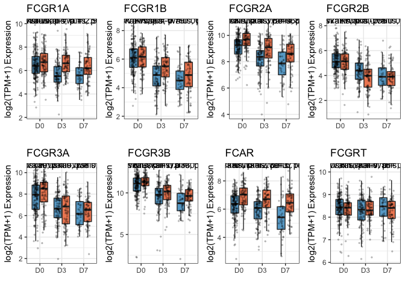

``` r
gene <- "FCGR1A"
id <- genepc$Gene.stable.ID[which(genepc$Gene.name == gene)][1]
metadata_filtered$GOI <- t(logTPM_filtered[rownames(logTPM_filtered) == id,])
metadata_filtered$cluster_neuhi <- mapvalues(metadata_filtered$cluster_neuhi, from = c("1","2","3","4","5","6","7"), to = c("NMF1","NMF2","NMF3","NMF4","NMF5","NMF6","Neu-Lo"))
metadata_filtered$cluster_neuhi <- factor(metadata_filtered$cluster_neuhi, levels = c("NMF1","NMF2","NMF3","NMF4","NMF5","NMF6","Neu-Lo"))
metadata_temp <- metadata_filtered[metadata_filtered$COVID == "Positive" & metadata_filtered$Day %in% c("D0","D3","D7"),]
kruskal.test(g = metadata_temp$cluster_neuhi, x = metadata_temp$GOI)$p.value
```

    ## [1] 4.804151e-25

``` r
p1 <- ggplot(metadata_temp, aes(x = factor(cluster_neuhi), y = as.numeric(GOI), fill = cluster_neuhi)) + geom_boxplot(outlier.shape = NA) + geom_jitter(width = 0.3, alpha = 0.2, size = 0.5) + theme_bw() + ylab("log2(TPM+1) Expression") + scale_fill_manual(values = c(orange,skyblue,bluishgreen,yellow,blue,vermillion,"purple")) + stat_compare_means() + ggtitle(gene) + theme(legend.position = "none") + xlab("")

gene <- "FCGR1B"
id <- genepc$Gene.stable.ID[which(genepc$Gene.name == gene)][1]
metadata_filtered$GOI <- t(logTPM_filtered[rownames(logTPM_filtered) == id,])
metadata_filtered$cluster_neuhi <- mapvalues(metadata_filtered$cluster_neuhi, from = c("1","2","3","4","5","6","7"), to = c("NMF1","NMF2","NMF3","NMF4","NMF5","NMF6","Neu-Lo"))
```

    ## The following `from` values were not present in `x`: 1, 2, 3, 4, 5, 6, 7

``` r
metadata_filtered$cluster_neuhi <- factor(metadata_filtered$cluster_neuhi, levels = c("NMF1","NMF2","NMF3","NMF4","NMF5","NMF6","Neu-Lo"))
metadata_temp <- metadata_filtered[metadata_filtered$COVID == "Positive" & metadata_filtered$Day %in% c("D0","D3","D7"),]
kruskal.test(g = metadata_temp$cluster_neuhi, x = metadata_temp$GOI)$p.value
```

    ## [1] 6.934239e-57

``` r
p2 <- ggplot(metadata_temp, aes(x = factor(cluster_neuhi), y = as.numeric(GOI), fill = cluster_neuhi)) + geom_boxplot(outlier.shape = NA) + geom_jitter(width = 0.3, alpha = 0.2, size = 0.5) + theme_bw() + ylab("log2(TPM+1) Expression") + scale_fill_manual(values = c(orange,skyblue,bluishgreen,yellow,blue,vermillion,"purple")) + stat_compare_means() + ggtitle(gene) + theme(legend.position = "none") + xlab("")

gene <- "FCGR2A"
id <- genepc$Gene.stable.ID[which(genepc$Gene.name == gene)][1]
metadata_filtered$GOI <- t(logTPM_filtered[rownames(logTPM_filtered) == id,])
metadata_filtered$cluster_neuhi <- mapvalues(metadata_filtered$cluster_neuhi, from = c("1","2","3","4","5","6","7"), to = c("NMF1","NMF2","NMF3","NMF4","NMF5","NMF6","Neu-Lo"))
```

    ## The following `from` values were not present in `x`: 1, 2, 3, 4, 5, 6, 7

``` r
metadata_filtered$cluster_neuhi <- factor(metadata_filtered$cluster_neuhi, levels = c("NMF1","NMF2","NMF3","NMF4","NMF5","NMF6","Neu-Lo"))
metadata_temp <- metadata_filtered[metadata_filtered$COVID == "Positive" & metadata_filtered$Day %in% c("D0","D3","D7"),]
kruskal.test(g = metadata_temp$cluster_neuhi, x = metadata_temp$GOI)$p.value
```

    ## [1] 1.318661e-79

``` r
p3 <- ggplot(metadata_temp, aes(x = factor(cluster_neuhi), y = as.numeric(GOI), fill = cluster_neuhi)) + geom_boxplot(outlier.shape = NA) + geom_jitter(width = 0.3, alpha = 0.2, size = 0.5) + theme_bw() + ylab("log2(TPM+1) Expression") + scale_fill_manual(values = c(orange,skyblue,bluishgreen,yellow,blue,vermillion,"purple")) + stat_compare_means() + ggtitle(gene) + theme(legend.position = "none") + xlab("")

gene <- "FCGR2B"
id <- genepc$Gene.stable.ID[which(genepc$Gene.name == gene)][1]
metadata_filtered$GOI <- t(logTPM_filtered[rownames(logTPM_filtered) == id,])
metadata_filtered$cluster_neuhi <- mapvalues(metadata_filtered$cluster_neuhi, from = c("1","2","3","4","5","6","7"), to = c("NMF1","NMF2","NMF3","NMF4","NMF5","NMF6","Neu-Lo"))
```

    ## The following `from` values were not present in `x`: 1, 2, 3, 4, 5, 6, 7

``` r
metadata_filtered$cluster_neuhi <- factor(metadata_filtered$cluster_neuhi, levels = c("NMF1","NMF2","NMF3","NMF4","NMF5","NMF6","Neu-Lo"))
metadata_temp <- metadata_filtered[metadata_filtered$COVID == "Positive" & metadata_filtered$Day %in% c("D0","D3","D7"),]
kruskal.test(g = metadata_temp$cluster_neuhi, x = metadata_temp$GOI)$p.value
```

    ## [1] 5.872294e-36

``` r
p4 <- ggplot(metadata_temp, aes(x = factor(cluster_neuhi), y = as.numeric(GOI), fill = cluster_neuhi)) + geom_boxplot(outlier.shape = NA) + geom_jitter(width = 0.3, alpha = 0.2, size = 0.5) + theme_bw() + ylab("log2(TPM+1) Expression") + scale_fill_manual(values = c(orange,skyblue,bluishgreen,yellow,blue,vermillion,"purple")) + stat_compare_means() + ggtitle(gene) + theme(legend.position = "none") + xlab("")

gene <- "FCGR3A"
id <- genepc$Gene.stable.ID[which(genepc$Gene.name == gene)][1]
metadata_filtered$GOI <- t(logTPM_filtered[rownames(logTPM_filtered) == id,])
metadata_filtered$cluster_neuhi <- mapvalues(metadata_filtered$cluster_neuhi, from = c("1","2","3","4","5","6","7"), to = c("NMF1","NMF2","NMF3","NMF4","NMF5","NMF6","Neu-Lo"))
```

    ## The following `from` values were not present in `x`: 1, 2, 3, 4, 5, 6, 7

``` r
metadata_filtered$cluster_neuhi <- factor(metadata_filtered$cluster_neuhi, levels = c("NMF1","NMF2","NMF3","NMF4","NMF5","NMF6","Neu-Lo"))
metadata_temp <- metadata_filtered[metadata_filtered$COVID == "Positive" & metadata_filtered$Day %in% c("D0","D3","D7"),]
kruskal.test(g = metadata_temp$cluster_neuhi, x = metadata_temp$GOI)$p.value
```

    ## [1] 7.564739e-37

``` r
p5 <- ggplot(metadata_temp, aes(x = factor(cluster_neuhi), y = as.numeric(GOI), fill = cluster_neuhi)) + geom_boxplot(outlier.shape = NA) + geom_jitter(width = 0.3, alpha = 0.2, size = 0.5) + theme_bw() + ylab("log2(TPM+1) Expression") + scale_fill_manual(values = c(orange,skyblue,bluishgreen,yellow,blue,vermillion,"purple")) + stat_compare_means() + ggtitle(gene) + theme(legend.position = "none") + xlab("")

gene <- "FCGR3B"
id <- genepc$Gene.stable.ID[which(genepc$Gene.name == gene)][1]
metadata_filtered$GOI <- t(logTPM_filtered[rownames(logTPM_filtered) == id,])
metadata_filtered$cluster_neuhi <- mapvalues(metadata_filtered$cluster_neuhi, from = c("1","2","3","4","5","6","7"), to = c("NMF1","NMF2","NMF3","NMF4","NMF5","NMF6","Neu-Lo"))
```

    ## The following `from` values were not present in `x`: 1, 2, 3, 4, 5, 6, 7

``` r
metadata_filtered$cluster_neuhi <- factor(metadata_filtered$cluster_neuhi, levels = c("NMF1","NMF2","NMF3","NMF4","NMF5","NMF6","Neu-Lo"))
metadata_temp <- metadata_filtered[metadata_filtered$COVID == "Positive" & metadata_filtered$Day %in% c("D0","D3","D7"),]
kruskal.test(g = metadata_temp$cluster_neuhi, x = metadata_temp$GOI)$p.value
```

    ## [1] 2.977992e-69

``` r
p6 <- ggplot(metadata_temp, aes(x = factor(cluster_neuhi), y = as.numeric(GOI), fill = cluster_neuhi)) + geom_boxplot(outlier.shape = NA) + geom_jitter(width = 0.3, alpha = 0.2, size = 0.5) + theme_bw() + ylab("log2(TPM+1) Expression") + scale_fill_manual(values = c(orange,skyblue,bluishgreen,yellow,blue,vermillion,"purple")) + stat_compare_means() + ggtitle(gene) + theme(legend.position = "none") + xlab("")

gene <- "FCAR"
id <- genepc$Gene.stable.ID[which(genepc$Gene.name == gene)][1]
metadata_filtered$GOI <- t(logTPM_filtered[rownames(logTPM_filtered) == id,])
metadata_filtered$cluster_neuhi <- mapvalues(metadata_filtered$cluster_neuhi, from = c("1","2","3","4","5","6","7"), to = c("NMF1","NMF2","NMF3","NMF4","NMF5","NMF6","Neu-Lo"))
```

    ## The following `from` values were not present in `x`: 1, 2, 3, 4, 5, 6, 7

``` r
metadata_filtered$cluster_neuhi <- factor(metadata_filtered$cluster_neuhi, levels = c("NMF1","NMF2","NMF3","NMF4","NMF5","NMF6","Neu-Lo"))
metadata_temp <- metadata_filtered[metadata_filtered$COVID == "Positive" & metadata_filtered$Day %in% c("D0","D3","D7"),]
kruskal.test(g = metadata_temp$cluster_neuhi, x = metadata_temp$GOI)$p.value
```

    ## [1] 1.98525e-57

``` r
p7 <- ggplot(metadata_temp, aes(x = factor(cluster_neuhi), y = as.numeric(GOI), fill = cluster_neuhi)) + geom_boxplot(outlier.shape = NA) + geom_jitter(width = 0.3, alpha = 0.2, size = 0.5) + theme_bw() + ylab("log2(TPM+1) Expression") + scale_fill_manual(values = c(orange,skyblue,bluishgreen,yellow,blue,vermillion,"purple")) + stat_compare_means() + ggtitle(gene) + theme(legend.position = "none") + xlab("")

gene <- "FCGRT"
id <- genepc$Gene.stable.ID[which(genepc$Gene.name == gene)][1]
metadata_filtered$GOI <- t(logTPM_filtered[rownames(logTPM_filtered) == id,])
metadata_filtered$cluster_neuhi <- mapvalues(metadata_filtered$cluster_neuhi, from = c("1","2","3","4","5","6","7"), to = c("NMF1","NMF2","NMF3","NMF4","NMF5","NMF6","Neu-Lo"))
```

    ## The following `from` values were not present in `x`: 1, 2, 3, 4, 5, 6, 7

``` r
metadata_filtered$cluster_neuhi <- factor(metadata_filtered$cluster_neuhi, levels = c("NMF1","NMF2","NMF3","NMF4","NMF5","NMF6","Neu-Lo"))
metadata_temp <- metadata_filtered[metadata_filtered$COVID == "Positive" & metadata_filtered$Day %in% c("D0","D3","D7"),]
kruskal.test(g = metadata_temp$cluster_neuhi, x = metadata_temp$GOI)$p.value
```

    ## [1] 1.575079e-15

``` r
p8 <- ggplot(metadata_temp, aes(x = factor(cluster_neuhi), y = as.numeric(GOI), fill = cluster_neuhi)) + geom_boxplot(outlier.shape = NA) + geom_jitter(width = 0.3, alpha = 0.2, size = 0.5) + theme_bw() + ylab("log2(TPM+1) Expression") + scale_fill_manual(values = c(orange,skyblue,bluishgreen,yellow,blue,vermillion,"purple")) + stat_compare_means() + ggtitle(gene) + theme(legend.position = "none") + xlab("")

cowplot::plot_grid(p1,p2,p3,p4,p5,p6,p7,p8,ncol=4)
```

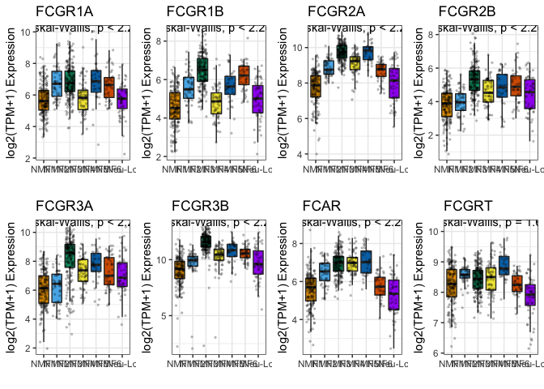
